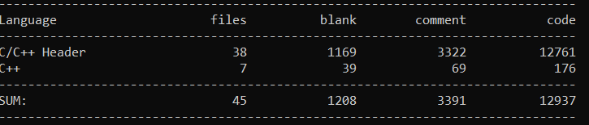

# Simple-RAPIDJSON
1. `Simple-RAPIDJSON`是一个`C++`库,用于解析及生成`JSON`,其类似`RapidXML`
2. 本项目主要是基于腾讯的`RAPIDJSON`项目,但是是简化版本
   * 仅考虑`UTF8`编码
   * 不考虑`JSON Schema`
   * 仅适用于`GCC`编译器
3. 本项目的特点:
   * 容易安装:只有头文件的库,只需要把头文件复制到所需项目中,即可使用
   * 独立、最小依赖:不需依赖`STL`、`BOOST`等
   * 没使用`C++`异常、`RTTI`
   * `API`风格,即`SAX`和`DOM`:本项目实现了类似`XML`的`SAX`和`DOM`接口,`Reader`和`Writer`=>`SAX`;`Document`=>`DOM`
   * 本项目支持递归解析(`DOM`解析)和迭代解析(`SAX`解析)
   * 支持`PrettyWriter`以更加直接、美观的方式格式化输出`JSON`文档,这个功能和`VScode`的格式化`JSON`文档一样
   * 支持自定义内存分配器
   * 理论来说,这是目前最高效的`JSON`解析器(但我没验证,这是腾讯的官网数据)
   * 高性能:
      - 使用模板及内联函数去降低函数调用开销
      - 内部经优化的`Grisu2`及浮点数解析实现
      - 可选的`SSE2/SSE4.2`支持
      - 自定义内存分配器
      - 短字符串优化技术 
      - 本项目中对于`Value`<=>`GenericValue`对象使用了转移语义(`Move()`).这样做对性能十分友好,这样就可以减少大量没必要的内存分配/释放过程,以及内存复制
4. 本项目没有使用`Cmake`进行编译,原因是本项目是一个头文件库,实际上没有源程序`.cpp`,若要使用的话,直接把这个头文件库拷贝即可
5. 本项目仅对本项目和`JsonCpp`两种`JSON`解析器进行的性能对比,并且只对比了`SAX`解析的性能,其结果为(我们以一个开源的672KB的`json`文档进行测试`https://code.google.com/archive/p/json-test-suite/downloads`):
   
   更多的测试可以参考`https://code.google.com/archive/p/rapidjson/wikis/Performance.wiki`
6. 代码量:
   