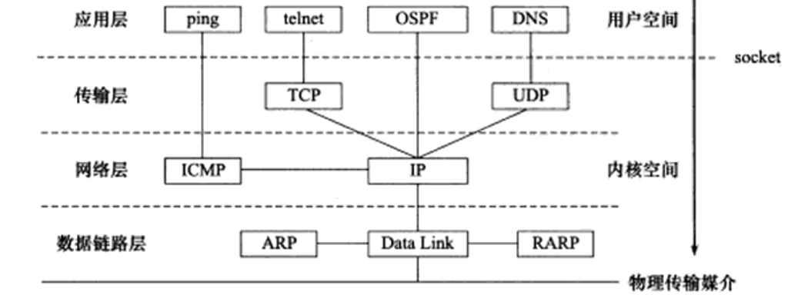

# 第一章 TCP/IP协议详解
1. TCP/IP协议族是一个四层协议系统.
   
2. 应用层在用户空间实现,不在内核中实现
3. 应用层:`ping`是应用程序,不是协议;`telnet`是远程登录协议;`DNS`是域名到IP转换的协议;`OSPF`是动态路由更新协议
4. `ARP`:IP->MAC;`ARP`维护一个高速缓存,其中包含经常访问或最近访问的机器的IP地址到物理地址的映射.这样就避免了重复的`ARP`请求,提高了发送数据包的速度
5. `WSL`下的DNS的IP地址是与windows本机一样的,可以直接使用`host -t A www.baidu.com`查看百度域名对应的IP
6. 应用程序-用户缓冲区;内核-内核缓冲区
7. 数据链路层、网络层、传输层协议是在内核中实现的.因此操作系统需要实现一组系统调用,使得应用程序能够访问这些协议提供的服务.实现这组系统调用的API为`socket`.由`socket`定义的API主要提供两点功能:
   * 将应用程序数据从用户缓冲区中复制到TCP/UDP内核发送缓冲区,以交付内核来发送数据;或者是从内核TCP/UDP接收缓冲区中复制数据到用户缓冲区,以读取数据
   * 应用程序可通过它们来修改内核中各层协议的某些头部信息或其它数据结构,从而精细地控制底层通信的行为
# 第二章 IP协议详解
1. IP协议是无状态、无连接、不可靠的
2. 网关:指连接两个不同网络的设备或系统,充当数据传输的中转站,帮助实现不同网络之间的通信和数据交换
3. 网卡:计算机用于连接到网络的硬件设备,也称为网络适配器或网络接口卡.一个计算机可以有多个网卡,如windows有以太网网卡(有线以太网电缆)、wifi网卡(网卡扫描wifi热点->认证热点,建立wifi连接->网卡向DHCP服务器请求IP地址(使计算机能够在网络中被识别)->计算机通过网卡连接到了网络)、蓝牙网卡
4. 每个网卡都有一个IP,平时所说的计算机IP,其实就是网卡IP