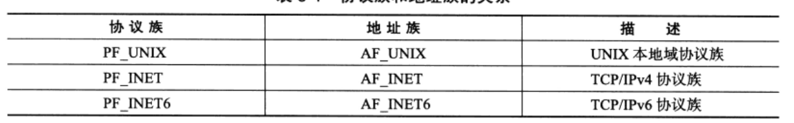

# 第一章 TCP/IP协议详解
1. TCP/IP协议族是一个四层协议系统.
   
2. 应用层在用户空间实现,不在内核中实现
3. 应用层:`ping`是应用程序,不是协议;`telnet`是远程登录协议;`DNS`是域名到IP转换的协议;`OSPF`是动态路由更新协议
4. `ARP`:IP->MAC;`ARP`维护一个高速缓存,其中包含经常访问或最近访问的机器的IP地址到物理地址的映射.这样就避免了重复的`ARP`请求,提高了发送数据包的速度
5. `WSL`下的DNS的IP地址是与windows本机一样的,可以直接使用`host -t A www.baidu.com`查看百度域名对应的IP
6. 应用程序-用户缓冲区;内核-内核缓冲区
7. 数据链路层、网络层、传输层协议是在内核中实现的.因此操作系统需要实现一组系统调用,使得应用程序能够访问这些协议提供的服务.实现这组系统调用的API为`socket`.由`socket`定义的API主要提供两点功能:
   * 将应用程序数据从用户缓冲区中复制到TCP/UDP内核发送缓冲区,以交付内核来发送数据;或者是从内核TCP/UDP接收缓冲区中复制数据到用户缓冲区,以读取数据
   * 应用程序可通过它们来修改内核中各层协议的某些头部信息或其它数据结构,从而精细地控制底层通信的行为
# 第2章 IP协议详解
1. IP协议是无状态、无连接、不可靠的
2. 网关:指连接两个不同网络的设备或系统,充当数据传输的中转站,帮助实现不同网络之间的通信和数据交换
3. 网卡:计算机用于连接到网络的硬件设备,也称为网络适配器或网络接口卡.一个计算机可以有多个网卡,如windows有以太网网卡(有线以太网电缆)、wifi网卡(网卡扫描wifi热点->认证热点,建立wifi连接->网卡向DHCP服务器请求IP地址(使计算机能够在网络中被识别)->计算机通过网卡连接到了网络)、蓝牙网卡
4. 每个网卡都有一个IP,平时所说的计算机IP,其实就是网卡IP
5. 当更改Wi-Fi热点时,连接到热点的设备的IP地址通常会发生变化.这是因为每个Wi-Fi热点都有自己的DHCP服务器负责为连接到该热点的设备分配IP地址
# 第17章 系统监测工具
1. `webbench`:压测工具
2. `tcpdump`:网络抓包工具
3. `iosf`:列出当前系统打开的文件描述符的工具(`-i`显示`socket`文件描述符)
4. `nc`:主要被用来快速构建网络连接.它可以以服务器方式运行,监听某个端口并接收客户连接,因此它可用来调试客户端程序.它也可以客户端方式运行,向服务器发起连接并接收数据,因此可用来调试服务器程序
5. `strace`:测试服务器性能的重要工具
6. `netstat`:它是网络信息统计工具.它可以打印本地网卡接口上的全部连接、路由表信息、网卡接口信息等
7. `vmstat`:它能实时输出系统的各种资源的使用情况,比如:进程信息、内存使用、CPU使用率以及I/O使用情况
8. `ifstat`:简单的网络流量监测工具
9.  `mpstat`:它能实时监测多处理器系统上每个CPU的使用情况
# 第5章 Linux网络编程基础API
1. 大端字节序:一个整数的高位字节(23~31 bit)存储在内存的低地址处,低位字节(0~7 bit)存储在内存的高地址处
2. 小端字节序:一个整数的高位字节(23~31 bit)存储在内存的高地址处,低位字节(0~7 bit)存储在内存的低地址处
3. 现代PC大多采用小端字节序,因此<mark>小端字节序又被称为主机字节序</mark>
4. <mark>大端字节序也称为网络字节序</mark>
5. 同一台机器上的两个进程也要考虑字节序问题,如`JAVA`虚拟机采用的是大端字节序
6. `Linux`提供了4个函数:
   ```C++
   unsigned long int htonl();
   unsigned long int htons();
   unsigned long int ntohl();
   unsigned long int ntohs();
   //long型函数常用来转换IP地址,short常用来转换端口号
   ```
7. `sockaddr`结构体是通用的`socket`地址,但在实际使用中不好用,因为在设置会获取IP地址和端口号需要执行位操作,所以常用专用的`socket`地址结构体->`socketaddr_in`(ipv4)和`sockaddr_in6`(ipv6)
   ```C++
      struct sockaddr{
      sa_family_t sa_family;//4字节,地址族类型变量
      char sa_data[14];//port(2字节)+IP地址(4字节)+填充(8字节)
   }
   ```
   需要注意<mark>:专用的`socket`结构体在实际使用时都需转化为通用`socket`地址类型`socketaddr`(强制类型转换),因为所有`socket`API使用的都是`socketaddr`</mark>,如:   
   ```C++
   bind(server_fd, (struct sockaddr *)&address, sizeof(address))
   ```
8. 地址族类型与协议族类型一一对应.其中宏`PF_*`和`AF_*`具有相同的值,所以通常混用,因此我在要用协议族的地方也直接写的`AF_*`
   
9.  点分十进制与网络字节序二进制表示的相互转换(ipv4):
   ```C++
   in_addr_t inet_addr(const char* strptr);//将点分十进制字符串表示的IPV4地址转化为用网络字节序整数表示的IPV4地址,typedef uint32_t in_addr_t
   int inet_aton(const char* cp, struct in_addr* inp);//将点分十进制的IPV4转换为网络字节序的二进制格式
   char* inet_ntoa(struct in_addr in);//将网络字节序的二进制格式转化为点分十进制的IPV4

   struct in_addr{
      uint32_t s_addr;//存储IPv4地址,以网络字节序存储
   }
   //inet_addr和inet_aton函数功能一样,但是inet_aton将转化结果存储与参数inp执行的地址结构图中去,而不是直接返回
   //inet_ntoa不可重入,即第二次调用它就会覆盖第一次的结果,这是线程不安全的
   ```
10. 同时适用IPV4和IPV6的地址转换函数:
   ```C++
   int inet_pton(int af, const char* src, void* dst);//af参数指定地址族,即可以是AF_INET或AF_INET6.函数成功返回1,失败返回0
   const char* inet_ntop(int af, const void* src, char* dst, socklen_t cnt);//cnt表示目标存储单元大小,可以设为:INET_ADDRSTRLEN或INET6_ADDRSTELEN,它们分别是表示IPV4和IPV6地址大小的宏.函数成功返回目标存储单元的地址,即dst;失败则返回NULL
   ```
11. <mark>套接字(`socket`)地址=(特定通信端点的)IP地址+端口号</mark>
12. `socket`原型:
   ```C++
    int socket(int domain, ine type, int protocol);
    //domain:底层协议族.对于TCP/IP协议族=AF_INET(IPV4),AF_INET6(IPV6)
    //type:服务类型有SOCK_STREAM服务(流服务),SOCK_UGRAM服务(数据报).对于TCP/IP协议族,传输层使用TCP协议则type=SOCK_STREAM,使用UDP则type=SOCK_DGRAM
    //protocol:它是表示在前两个参数构成的协议集合下,再选择一个具体的协议,不过前两个参数已经完成决定了它的值,所以几乎所有情况下,都把它设为0,表示使用默认协议
    //失败返回-1,成功返回一个socket文件描述符
   int sockfd = socket(AF_INET, SOCK_STREAM, 0); // 对于 TCP/IPV4
   int sockfd = socket(AF_INET, SOCK_DGRAM, 0);  // 对于 UDP/IPV4
   ```
13. 命令`socket`
    ```C++
    int bind(int sockfd, const struct sockaddr* my_addr, socklen_t addrlen);
    //bind将my_addr所指的socket地址分配给未命名的sockfd文件描述符
    //成功返回0,失败返回-1
    ```
14. 监听`socket`:
    ```C++
    int listen(int sockfd, int backlog);
    //sockfd指定被监听的socket
    //backlog提示内核监听队列的最大长度
    //成功返回0,失败返回-1
    ```
15. 接受连接:
    ```C++
    int accept(int sockfd, struct sockaddr* addr, socklen_t* addrlen);
    //sockfd是执行过listen系统调用的监听socket
    //addr用来获取被接受连接的远端socket地址(服务器本地socket地址)
    //成功返回通信socket,失败返回-1
    ```
16. 客户端发起连接:
    ```C++
    int connect(int sockfd, const struct sockaddr* serv_addr, socklen_t addrlen);
    //sockfd是客户端监听套接字
    //serv-addr是服务器的socket地址
    //成功返回0,失败返回-1
    ```
18. 关闭连接:
    ```C++
    int close(int fd);
    //close系统调用并非总是立即关闭一个连接,而是将fd的引用计数减1.只有当fd的引用计数为0时,才真正关闭连接
    ```
19. TCP数据读写:
    ```C++
    ssize_t recv(int sockfd, void* buf, size_t len, int flags);
    ssize_t send(int sockfd, const void* buf, size_t len, int flags);
    //flags通常设为0
    ```
20. UDP数据读写:
   ```C++
    ssize_t recvfrom(int sockfd, void* buf, size_t len, int flags, struct sockaddr* src_addr, socklen_t* addrlen);
    ssize_t sendto(int sockfd, const void* buf, size_t len, int flags, const struct sockaddr* dest_addr, socklen_t addrlen);
    //因为UDP通信没有连接的概念,所以每次读取数据都需要获取发送端的socket地址,即参数src_addr进而dest_addr
   ``` 
   `UDP`通信的简例: 
   ```C++
   #include <stdio.h>
   #include <stdlib.h>
   #include <string.h>
   #include <unistd.h>
   #include <arpa/inet.h>
   #include <sys/socket.h>
   #define PORT 8080
   #define BUF_SIZE 1024
   int main() {
      int sockfd;
      char buffer[BUF_SIZE];
      struct sockaddr_in server_addr, client_addr;
      socklen_t addr_len = sizeof(client_addr);   
      // 创建一个 UDP 套接字
      sockfd = socket(AF_INET, SOCK_DGRAM, 0);
      if (sockfd == -1) {
         perror("socket");
         exit(EXIT_FAILURE);
      }
      // 初始化服务器地址结构
      memset(&server_addr, 0, sizeof(server_addr));
      server_addr.sin_family = AF_INET;
      server_addr.sin_addr.s_addr = INADDR_ANY;
      server_addr.sin_port = htons(PORT);
      // 绑定套接字到本地地址和端口
      if (bind(sockfd, (struct sockaddr *)&server_addr, sizeof(server_addr)) == -1) {
         perror("bind");
         close(sockfd);
         exit(EXIT_FAILURE);
      }
      printf("Server is listening on port %d\n", PORT);

      while (1) {
         // 接收数据
         ssize_t recv_len = recvfrom(sockfd, buffer, BUF_SIZE, 0, (struct sockaddr *)&client_addr, &addr_len);
         if (recv_len == -1) {
               perror("recvfrom");
               close(sockfd);
               exit(EXIT_FAILURE);
         }
         // 输出接收到的数据和发送方地址信息
         buffer[recv_len] = '\0';
         printf("Received message: %s\n", buffer);
         printf("From IP: %s, Port: %d\n",
                  inet_ntoa(client_addr.sin_addr),
                  ntohs(client_addr.sin_port));
      }
      close(sockfd);
      return 0;
   }
   ```
21. 通用数据读写(了解即可):
   ```C++
    ssize_t recvmsg(int sockfd, struct msghdr* msg, int flags);
    ssize_t sendmsg(int sockfd, struct msghdr* msg, int flags);
    //flags通常设为0
   ```
22. 地址信息函数(便于程序调试输出):
    ```C++
    int getsockname(int sockfd, struct sockaddr* address, socklen_t* address_len);
    //获取sockfd套接字关联的本地地址(ip和port),并将其存储于address
    int getpeername(int sockfd, struct sockaddr* address, socklen_t* address_len);
    //获取sockfd对应的远端socket地址(对等方的ip和port),并将其存储于address.它常用于在客户端和服务器之间连接建立后获取对方的地址信息
    ```
23. <mark>`socket`默认是阻塞的,即它里面的`accept  recv  send`等这些是阻塞函数</mark>,可以直接将套接字设为非阻塞,此时对应的API函数都是非阻塞的了
24. <span style="color:red;">在网络编程中,`INADDR_ANY`是特殊的常量,通常用于服务器端套接字的绑定操作,以指示服务器可以接受来自任何网络接口的连接请求.具体来说,`INADDR_ANY`的值为`0.0.0.0`,它可以使服务器监听服务器所在的主机上的所有IP地址(主机可能有多个网卡,如以太网和无线,或多重IP地址),此时不管连接请求是通过哪个接口或哪个IP地址发送过来的,服务器都能接受</span>
25. 在客户端中,`connect`用于将客户端套接字连接到指定的服务器地址和端口,如果是写的`127.0.0.1`,那么表示服务器也在客户端的本机上:
    ```C++
    serv_addr.sin_family = AF_INET;
    serv_addr.sin_port = htons(80);
    if(inet_pton(AF_INET, "127.0.0.1", &serv_addr.sin_addr) <= 0) {
        std::cerr << "Invalid address/ Address not supported" << std::endl;
        return -1;
    }
    // 连接服务器IP和端口
    if (connect(sock, (struct sockaddr *)&serv_addr, sizeof(serv_addr)) < 0){//server_ip = "127.0.0.1",表示服务器在本地主机上
        std::cerr << "Connection error" << std::endl;
        return -1;
    }
    ```
26. `socket`选项(详细见<<Linux高性能服务器编程>>pp87):
    ```C++
   int getsockopt(int sockfd, int level, int option_name, void* option_value, socklen_t* restrict option_len);
   int setsockopt(int sockfd, int level, int option_name, consnt void* option_value, socklen_t option_len);
   如:
   int opt = 1;//对于SO_REUSEADDR,等于1表示启用选项
   if (setsockopt(server_fd, SOL_SOCKET, SO_REUSEADDR, &opt, sizeof(opt))) {
      std::cerr << "setsockopt" << std::endl;
      exit(EXIT_FAILURE);
   }
   //设置socket的选项SO_REUSEADDR可以强制使被处于TIME_WAIT状态的连接占用的socket地址,即此设置后即使sock处于TIME_WAIT状态,与之绑定的socket地址也可以立即被重用
   //opt=1表示启用这个选项
   ```