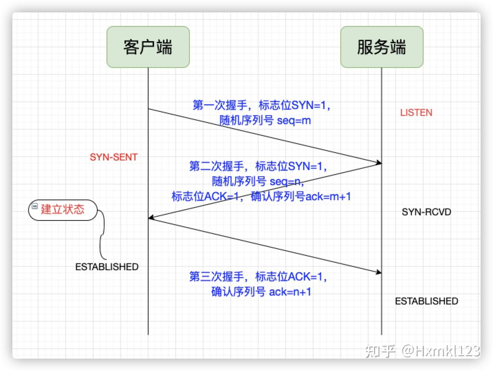
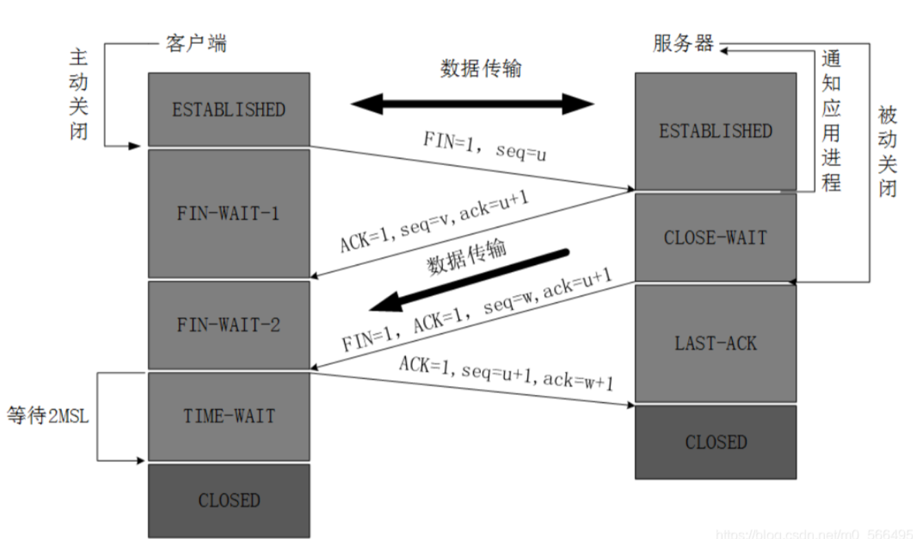
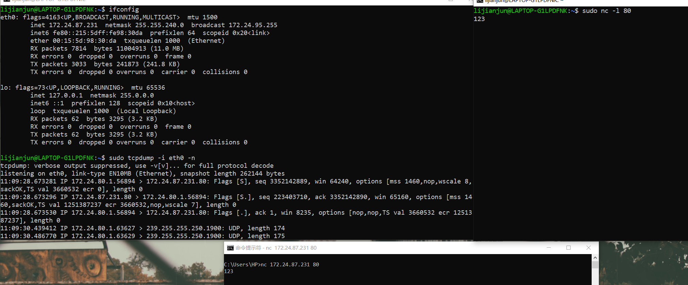

1. 三次握手、四次挥手
2. 为什么要三次握手:为了防止已失效的连接请求报文段突然又传送到了服务端
   ```s
   比如:client发出的第一个连接请求报文段并没有丢失,而是在某个网络结点长时间的滞留了,以致延误到连接释放以后的某个时间才到达server.本来这是一个早已失效的报文段,但是server收到此失效的连接请求报文段后,就误认为是client再次发出的一个新的连接请求,于是就向client发出确认报文段,同意建立连接.假设不采用“三次握手”,那么只要server发出确认,新的连接就建立了,由于client并没有发出建立连接的请求,因此不会理睬server的确认,也不会向server发送数据,但server却以为新的运输连接已经建立,并一直等待client发来数据.所以没有采用“三次握手”,这种情况下server的很多资源就白白浪费掉了
   ```
3. 
   
4. 在`TCP`报文头中,最重要的标志位有:
   ```s
   SYN:用于建立连接时发起连接请求的标志位
   ACK:用于确定收到数据的标志位
   FIN:用于关闭连接时发出结束连接请求的标志位
   RST:用于重置连接的标志位,通常用于异常情况的处理
   ```
5. 为什么要四次挥手:
   ```s
   当Server端收到FIN报文时,很可能并不会立即关闭SOCKET,所以只能先回复一个ACK报文,告诉Client端,"你发的FIN报文我收到了"。只有等到我Server端所有的报文都发送完了,我才能发送FIN报文,因此不能一起发送.故需要四步握手
   ```
6. 
   
7. `TCP`特点:
   * 基于连接的
   * 全双工
   * 字节流:不限制数据大小,打包成报文段,保证有序接收,重复报文自动丢弃
   * 流量缓冲:解决双方处理能力的不匹配
   * 可靠的传输服务
   * 拥塞控制
8. `TCP`连接:四元组[源地址,源端口,目的地址,目的端口]
9.  利用`tcpdump`抓包,`netcat(nc)`创建TCP连接:
   
10. `tcpdump`:
    ```s
    1. tcpdump是一个用于捕获数据包(抓包)的命令行工具,常用于网络故障排除、安全监控和协议分析等任务
    2. tcpdump -i <interface>//抓接口(网关)的包
    3. tcpdump -help
    4. tcpdump -w <filename>//保存数据到文件
    ```
11. `netcat`:
    ```s
    1. nc <目标主机IP> <端口号>//建立TCP连接
    2. nc -l [-p] <端口号>//监听TCP端口
    3. nc <目标主机IP> <端口号> < 文件名//发送文件
    4. nc -l [-p] <端口号> > 文件名//接收文件
    5. nc -u <目标主机IP> <端口号>//使用UDP协议
    ```
12. `telnet`也可以用于建立`TCP`连接
13. 对于`TCP`连接,客户端和服务器都可以主动关闭连接(发送`FIN`报文)
14. `netstat`是一个用于显示网络状态信息的命令行工具.它可以列出系统的网络连接、路由表、接口统计信息等
    ```s
    1. netstat -a//显示所有活动的网络连接
    2. netstat -l//显示所有监听状态的网络连接
    3. netstat -r//显示当前路由表
    4. netstat -s//显示统计信息,如接收和发送的数据包数量
    5. netstat -t//显示TCP协议的连接
    6. netstat -u//显示UDP协议的连接
    7. netstat -p//显示PID和进程名称
    8. netstat -n//显示数字格式的IP地址和端口号
    ```
