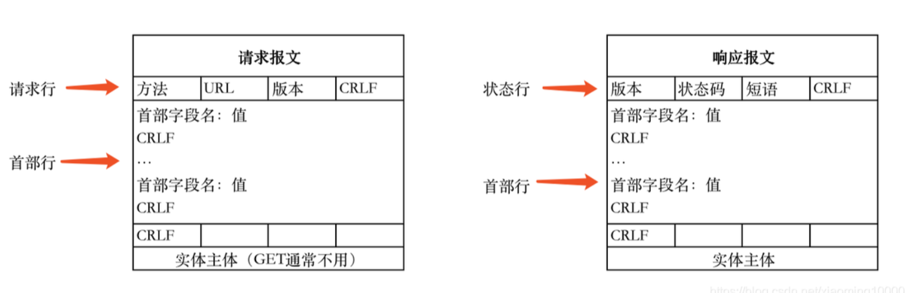

1. `HTTP`传输是基于`TCP/IP`的
2. `HTTP`是一个基于请求和响应,无状态的,应用层协议.所有的`WWW`文件都遵守这个标准
   ```s
   1. 无状态:协议对客户端没有状态存储,对事物处理没有"记忆"能力,比如访问一个网站需要反复进行登录操作
   2. 无连接:每次连接只处理一个请求,这样在长时间需要请求同一资源的情形下很耗费资源,因此后期可以通过Connection:Keep-Alive实现长连接
   3. 通信使用明文(不加密),内容可能被窃听或无法验证报文完整性,其内容可能已被篡改.所以出现了HTTPS
   ```
3. `HTTP2.0`实现了多路复用,多个请求共享一个`TCP`连接
4. <mark>`HTTP`报文通常是多行组成的,每一行都以回车符和换行符(CRLF)终止.在`HTTP`报文中,请求报文和响应报文都由首部和主体组成,它们之间由一个空行分隔开</mark>
5. `HTTP`报文格式格式:请求(响应)行+头部字段集合+空行+消息正文
   
   如:
   ```s
   请求报文:
   POST /index.html HTTP/1.1 \r\n
   Host: www.somenet.com     \r\n
   Content-Length:9          \r\n
   \r\n
   color=red

   请求报文:
   GET http://oa.funds.com.cn:9080/OMSS/index/index.jsp?f=Fri%20Jan%205%2008:56:35%20UTC+0800%202018 HTTP/1.1             \r\n
   Accept: */*                       \r\n
   Accept-Language: zh-CN            \r\n
   User-Agent: Mozilla/4.0 (compatible; MSIE 7.0; Windows NT 6.1; WOW64; Trident/7.0; SLCC2; .NET CLR 2.0.50727; .NET CLR 3.5.30729; .NET CLR 3.0.30729; Media Center PC 6.0; .NET4.0C; .NET4.0E)                          \r\n
   Accept-Encoding: gzip, deflate    \r\n
   Connection: Keep-Alive            \r\n
   Host: oa.funds.com.cn:9080        \r\n
   Cookie: JSESSIONID=0000AgK4N-vgetNoKBOfYd_hJQP:-1; ECSNSessionID=721303315959898497; ASPSESSIONIDQQSCRBSQ=OMFFMGDCJHLLHCLPGMKCEOEG; ASPSESSIONIDCCCRTRDD=KMENDGIBFBKFDLHKKPJGJNMF                                    \r\n
   空行

   响应报文:
   HTTP/1.1 200 OK         \r\n
   Content-Type:text/html  \r\n
   Content-Length: 362     \r\n
   \r\n
   <html>//具体html内容  
   ```
6. 请求行:`METHOD+空格+URI+空格+VERSION+换行`
7. 响应行:`METHOD+空格+STAUS CODE+空格+REASON+换行`
8. `HTTP`请求报文的方法:
   ```s
   1. GET
   2. POST
   3. HEAD
   4. PUT
   5. DELETE
   ```
9. 头部字段是`key-value`的形式,`key`和`value`之间用`:`分割,最后用`CRLF`换行表示字段结束.比如:`Connection:keep-alive`.头部字段不区分大小写,字段名不允许出现空格,可以使用`-`,不能使用`_`.`http`可以自定义头
10. `HTTP`的头字段可分为:
   * 请求字段:请求头中的头字段;如`Host,Referer`;
   * 响应字段:响应头中的头字段,如`Server`;
   * 通用字段:在请求头和响应头里都能出现,如`Content-type,Connection`;`Content-Type`通常用来指定在`HTTP`请求或响应中传输的数据的类型
11. `http`的一次完整通信过程:
   ```s
   1. DNS解析:URL->IP
   2. TCP连接:三次握手
   3. 客户端的Web浏览器发送HTTP请求
   4. Web服务器应答
   5. 浏览器解析:当浏览器从服务器接收到.html文件后,就开始解析其中的html代码,遇到静态资源js/css.image等时就会向服务器去请求下载(此时就用上keep-alive头部信息了)
   6. 浏览器进行页面渲染:浏览器利用自己内部的工作机制,把请求的静态资源和html代码进行渲染,渲染之后呈现给用户,浏览器是一个边解析边渲染的过程
   7. 服务器关闭TCP连接:一般情况,一旦Web服务器向浏览器发送了请求数据,它就要关闭TCP连接.如果浏览器或者服务器在头部信息加入了:Connection:keep-alive,则TCP连接在发送后将仍然保持打开状态.在 HTTP/1.1 或更高版本中,服务器通常不会在每次请求之后主动关闭TCP连接,除非明确指定
   ```
12. `HTTP`对应的端口号为80                                           