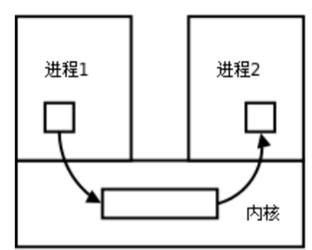

# 学习笔记
1. <mark>查询字符串是指在`URL`中用于传递参数的部分,通常出现在`?`后面,用于向服务器传递参数或数据,它由一系列键值对组成,键值对之间以及键和值之间用`=`分割,如:`?http://example.com/page?param1=value1&param2=value2`</mark>
2. 当客户端发送的请求不需要传递任何参数给服务器,则此时的`url`中没有查询字符串
3. `std::stoi`:将字符数组/字符串(`string`)可以转换为整数
## getsockname
1. 此函数用于获取套接字的本地地址信息,即本地主机和端口号
2. `getsockname`第二个参数期望一个指向`sockaddr`结构体的指针,而<mark>`reinterpret_cast`是`C++`中的一个类型转换操作符,用于在不同类型之间进行强制类型转换,它的作用是将一个指针或引用转换为一个完全不同的类型,即使这两种类型没有任何继承关系</mark>:
   ```C++
   reinterpret_cast<new_type>(expression)
   //expression是要进行转换的表达式,可以是一个指针、引用、或者其它任意表达式
   ```
## isspace

## strcasecmp()  C函数
1. `strcasecmp`不区分大小写;而`std::strcmp`要区分大小写

##  stat
1. `C++`中,可以使用`stat`函数来获取文件的状态信息,包括文件的大小、权限、修改时间等,这个函数是通过`<sys/stat.h>`头文件调用:
   ```C++
   struct stat st;
   st.st_size;
   st.st_mode;
   &st.st_mtime;
   ```
2. `st.st_mode`中的`st_mode`是`struct stat`结构体中的一个成员,用于表示文件的类型和访问权限,可以使用宏来解析`st_mode`成员的值,以确定文件的类型和权限:
   ```C++
   st.st_mode & S_ISREG;//判断是否是普通文件
   st.st_mode & S_IXUSR;//检查文件的指向权限是否被设置为用户可执行
   st.st_mode & S_IXGRP;//检查文件的指向权限是否被设置为群组可执行
   st.st_mode & S_IXOTH;//检查文件的指向权限是否被设置为其它用户可执行
   ```
## CGI
1. `CGI`(通用网关接口)用于在`Web`服务器上指向外部程序,并将它们的输出通过服务器发送给`Web`浏览器,即:(客户端)请求->服务器接收请求->调用对应`CGI`程序->返回结果到服务器->响应给客户端.`CGI`提供了一种`Web`服务器在指向外部程序的标准接口
2. `CGI`通常部署在`Web`服务器上
3. `java python c c++`等都支持`CGI`
4. `Web`服务器执行`CGI`程序的调用流程:
   * 接收`HTTP`请求:当`Web`服务器接收到客户端发送的`HTTP`请求时,它会检查请求的`URL`,确定是否要通过`CGI`程序来处理
   * 解析请求:`Web`服务器解析`HTTP`请求,并确定请求中的相关信息,例如`HTTP`方法(`GET  POST`等)、`URL`、请求头、请求正文等
   * 识别`CGI`请求:`Web`服务器检查请求的`URL`,如果发现它与`CGI`程序相关联,则认定需要调用`CGI`程序来处理请求
   * 准备执行环境:`Web`服务器设置一些环境变量,如:`REQUEST_METHD`、`QUERY_STRING`等
   * 执行`CGI`程序:通过启动一个新的进程来执行
   * 生成输出:生成一个`HTTP`响应
5. <mark>通常的`CGI`程序是通过创建新的进程来执行的</mark>

## Linux进程通信
1. 进程间通信方式:管道、消息队列、信号量、共享内存、套接字
2. 每个进程各自有不同的用户地址空间,任何一个进程的全局变量在另一个进程中都看不到,所以进程之间要交换数据必须通过内核,在内核中开辟一块缓冲区,进程A把数据从用户空间拷到内核缓冲区,进程B再从内核缓冲区把数据读走,内核提供的这种机制称为进程间通信
3. <mark>管道(本质就是内核的一块缓存)</mark>实现进程间通信:
   * 父进程创建管道,得到两个文件描述符指向管道的两端
   * 父进程`fork`出子进程,子进程也有两个文件描述符指向和父进程一样的管道
   * 父进程关闭管道读端,子进程关闭管道写端,则可以实现进程间通信 
   
   
4. `dup2`
5. `putenv`
6. `execl`:在当前进程中执行另一个程序,在`<unistd.h>`头文件中:
   ```C++
   int execl(const char *path, const char *arg0, ... /* (char  *) NULL */);
   //path:要执行的可执行文件的路径
   //arg0:要执行的程序的名称
   //后面是可选的参数列表,以NULL/mullptr结束
   ```


