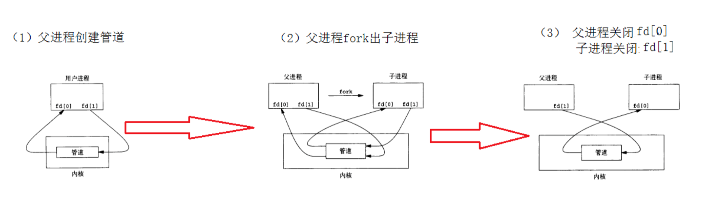

# 学习笔记
1. <mark>查询字符串是指在`URL`中用于传递参数的部分,通常出现在`?`后面,用于向服务器传递参数或数据,它由一系列键值对组成,键值对之间以及键和值之间用`=`分割,如:`?http://example.com/page?param1=value1&param2=value2`</mark>
2. 当客户端发送的请求不需要传递任何参数给服务器,则此时的`url`中没有查询字符串
3. `std::stoi`:将字符数组/字符串(`string`)可以转换为整数
4. 浏览器可以向指定的`ip:port`发送`http`请求
5. `c++`中`int->char[]`:`std::to_string()`
6. `.c_str()`:生成的字符串是`const char*`类型
## getsockname
1. 此函数用于获取套接字的本地地址信息,即本地主机和端口号
2. `getsockname`第二个参数期望一个指向`sockaddr`结构体的指针,而<mark>`reinterpret_cast`是`C++`中的一个类型转换操作符,用于在不同类型之间进行强制类型转换,它的作用是将一个指针或引用转换为一个完全不同的类型,即使这两种类型没有任何继承关系</mark>:
   ```C++
   reinterpret_cast<new_type>(expression)
   //expression是要进行转换的表达式,可以是一个指针、引用、或者其它任意表达式
   ```
## isspace
1. 这个函数是用来查询该字符是否是空格的
## strcasecmp()  C函数
1. `strcasecmp`不区分大小写;而`std::strcmp`要区分大小写

##  stat
1. `C++`中,可以使用`stat`函数来获取文件的状态信息,包括文件的大小、权限、修改时间等,这个函数是通过`<sys/stat.h>`头文件调用:
   ```C++
   struct stat st;
   st.st_size;
   st.st_mode;
   &st.st_mtime;
   ```
2. `st.st_mode`中的`st_mode`是`struct stat`结构体中的一个成员,用于表示文件的类型和访问权限,可以使用宏来解析`st_mode`成员的值,以确定文件的类型和权限:
   ```C++
   st.st_mode & S_ISREG;//判断是否是普通文件
   st.st_mode & S_IXUSR;//检查文件的指向权限是否被设置为用户可执行
   st.st_mode & S_IXGRP;//检查文件的指向权限是否被设置为群组可执行
   st.st_mode & S_IXOTH;//检查文件的指向权限是否被设置为其它用户可执行
   ```
## CGI
1. `CGI`(通用网关接口)用于在`Web`服务器上指向外部程序,并将它们的输出通过服务器发送给`Web`浏览器,即:(客户端)请求->服务器接收请求->调用对应`CGI`程序->返回结果到服务器->响应给客户端.`CGI`提供了一种`Web`服务器在指向外部程序的标准接口
2. `CGI`通常部署在`Web`服务器上
3. `java python c c++`等都支持`CGI`
4. `Web`服务器执行`CGI`程序的调用流程:
   * 接收`HTTP`请求:当`Web`服务器接收到客户端发送的`HTTP`请求时,它会检查请求的`URL`,确定是否要通过`CGI`程序来处理
   * 解析请求:`Web`服务器解析`HTTP`请求,并确定请求中的相关信息,例如`HTTP`方法(`GET  POST`等)、`URL`、请求头、请求正文等
   * 识别`CGI`请求:`Web`服务器检查请求的`URL`,如果发现它与`CGI`程序相关联,则认定需要调用`CGI`程序来处理请求
   * 准备执行环境:`Web`服务器设置一些环境变量,如:`REQUEST_METHD`、`QUERY_STRING`等
   * 执行`CGI`程序:通过启动一个新的进程来执行
   * 生成输出:生成一个`HTTP`响应
5. <mark>通常的`CGI`程序是通过创建新的进程来执行的</mark>
6. 当执行`cgi`脚本时(`execl()`),它的输出会被写入到管道中,具体来说,`CGI`程序通常会将其输出发送到标准输出流(`stdout`),而父进程通过重定向标准输出流到管道的写入端,使得`CGI`程序的输出被发送到该管道中.如果`cgi`程序是一个简单的生成`html`内容的脚本,那么`execl`输出到管道的内容就是该`html`内容,用于发送到浏览器(客户端),并在客户端生成相应的页面
## Linux进程通信
1. 进程间通信方式:管道、消息队列、信号量、共享内存、套接字
2. 每个进程各自有不同的用户地址空间,任何一个进程的全局变量在另一个进程中都看不到,所以进程之间要交换数据必须通过内核,在内核中开辟一块缓冲区,进程A把数据从用户空间拷到内核缓冲区,进程B再从内核缓冲区把数据读走,内核提供的这种机制称为进程间通信
3. <mark>管道(本质就是内核的一块缓存,也可以理解为一个"文件")</mark>实现进程间通信:
   * 父进程创建管道,得到两个文件描述符指向管道的两端
   * 父进程`fork`出子进程,子进程也有两个文件描述符指向和父进程一样的管道
   * 父进程关闭管道读端,子进程关闭管道写端,则可以实现进程间通信 
   
   
4. `pipe`:
   ```C++
   #include <unistd.h>
   int pipe(int fd[2]);//fd参数返回两个文件描述符,fd[0]指向管道的读端(指的是从管道读),fd[1]指向管道的写端(指的是向管道写)
   ```
5. 管道读取数据的四种情况:
   * 读端不读,写端一直写:这样会导致管道内写满数据,从而导致再次`write`的时候就会堵塞,直到管道中有空位置才写入数据并返回
   * 写端不写,读端一直读:管道中数据被读取完后,再次`read`会阻塞,直到管道中有数据可读了才读取数据并返回
   * 读端一直读,且`fd[0]`保持打开;而写端写了一部分数据不写了,并且关闭`fd[1]`:当管道读取完数据,再次`read`会返回0
   * 读端读了一部分,然后不读且关闭`fd[0]`,写端一直写且`fd[1]`保持打开:一旦读端的`fd[0]`关闭,而子进程继续向管道`write`,那么子进程会收到信号`SIGPIPE`,通常会导致进程异常终止
   * 上述的四种情况可以总结为:
      - 如果一个管道的写端一直在写,而读端的引⽤计数是否⼤于0决定管道是否会堵塞,引用计数大于0,只写不读再次调用`write`会导致管道堵塞
      - 如果一个管道的读端一直在读,而写端的引⽤计数是否⼤于0决定管道是否会堵塞，引用计数大于0,只读不写再次调用`read`会导致管道堵塞
      - 而当他们的引用计数等于0时,只写不读会导致写端的进程收到一个`SIGPIPE`信号,导致进程终止,只写不读会导致`read`返回0,就像读到⽂件末尾⼀样
6. 匿名管道的特点:
   * 只能用于具有血缘关系的进程间通信,通常用于父子进程通信
   * 只允许单向通信.想要一边读一边写,就需要两个管道(输入、输出管道)
   * 管道内部保证同步机制,从而保证访问数据的一致性
   * 面向字节流
   * 管道随进程存在
7. 命名管道(`FIFO`)的不同:
   * 匿名管道虽然可以理解为"文件",但是它在文件系统中是不可见的;而`FIFO`是一个设备文件,在文件系统真实显式的存在,它与一个路径名相关联(即存在于这个路径下)
   * `FIFO`可以在无血缘关系的进程间通信
   * `FIFO`遵循先进先出,即第一个进来的数据会第一个被读走
   * `FIFO`有`int mkfifo(const char* path, mode_t mod)`或`mknod()`创建
8. 在`unix`和类`unix`系统中,每个进程都有三个默认打开的文件描述符:标准输入(文件描述符0,通常为键盘输入)、标准输出(文件描述符1,通常为屏幕输出)和标准错误(文件描述符2,通常为屏幕输出)
9. `dup2`函数可以用来重定向文件描述符,如:`dup2(cgi_output[1], 1)`:重定向子进程的标准输出到(输出)管道的写入端(即标准输出的内容被发送到管道的写入端而不是屏幕)
10. `int putenv(char* string)`:设置环境变量的值,以格式`name=value`来将这个字符串加入到当前进程的环境变量中
11. `execl`:在当前进程中执行另一个程序,在`<unistd.h>`头文件中:
   ```C++
   int execl(const char *path, const char *arg0, ... /* (char  *) NULL */);
   //path:要执行的可执行文件的路径
   //arg0:要执行的程序的名称
   //后面是可选的参数列表,以NULL/mullptr结束
   ```
12. `waitpid`:等待子进程结束,当父进程调用`waitpid()`时,如果子进程还在运行,父进程就会被阻塞,直到指定的子进程结束.一旦子进程结束,父进程就会继续向下执行.而如果子进程已经结束,`waitpid()`则会立即返回子进程的状态信息
13. <mark>子进程的创建是在`fork()`之后,此刻子进程和父进程一起并行向下执行代码,为了确保子进程执行`task()`,那么使用`if(pid==0)`来确保此刻是子进程执行这个分支下的语句</mark>
14. 在操作系统中,多个线程共享同一个进程的地址空间,因此它们在内存空间上是相同的;而多个进程它们的内存空间是独立的
15. 进程和线程是否使用`while(1)`,即持续运行取决于具体任务(进程通常没用)


