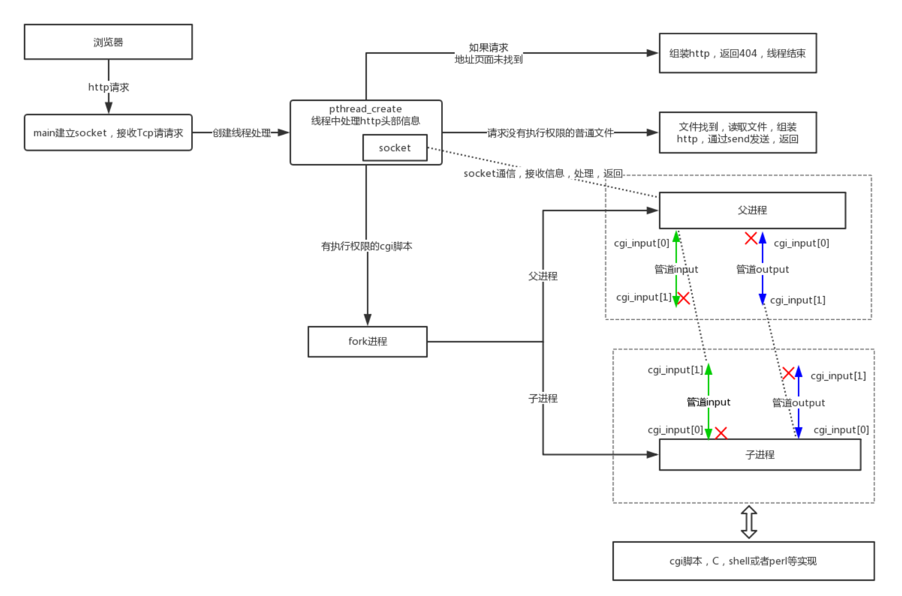

# upgrade_tinyhttp_plus
1. 基于`c++11`写的http服务器,主要涉及知识点:
   *  进程通信,管道
   *  http通信
   *  tcp/ip通信
   *  cgi程序
   *  线程池
   *  socket通信
   *  IO多路复用->EPOLL,边沿触发模式
   *  REACTOR设计模式(此程序的accept是用单独的工作线程处理,handler过程是用工作线程池处理)
2. 工作流程:
   * 服务器启动,在指定端口或随机端口绑定httpd服务
   * 浏览器通过IP:PORT向http服务器发送一个http请求
   * 服务器收到一个http请求时,派生一个线程运行accept_request函数
   * 取出http请求中的method(get或post)和url.对于get方法,如果携带参数,则query_string指针指向url中'?'后的查询字符串
   * 格式化url到path数组,表示浏览器请求的服务器文件路径,在tinyhttp中服务器文件是在htdocs文件夹下.当url以'/'结尾,或url是个目录,*则默认在path中加上index.html,表示访问的主页
   * 如果文件路径合法,对于无参数的get请求(静态请求),直接输出服务器文件到浏览器.其它情况调用excute_cgi执行cgi脚本(即有查询字符串)
   * 读取整个http请求并丢弃,如果是post则找出content-length
   * 建立两个管道,cgi_input和cgi_output,并fork()一个子进程
   * 在子进程中,重定向标准输入、输出到管道的读取端和写入端,关闭cgi_input的写入端和cgi_output的读取端,设置request_method的环境变量,get的话设置query_string的环境变量,post的话设置content-length的环境变量,这些环境变量都是为了个cgi脚本调用用的,接着用execl运行cgi程序
   * 在父进程中,关闭cgi_input的读取端和cgi_output的写入端,如果POST的话,把POST数据写入cgi_input,已被重定向到STDIN,读取cgi_output的管道输出到客户端,该管道输入是STDOUT.接着关闭所有管道,等待子进程结束
   * 关闭与浏览器的连接,完成一次http请求与回应,因为http无连接

1. 项目构建方法`Linux`:
   * git clone git@github.com:ONN-sp/CPP.git
   * 解压缩 unzip CPP-main.zip
   * cd Cpp_program/Tinyhttp/upgrade_tinyhttp
   * g++ -c HTTP_server.cpp -o HTTP_server.o
   * g++ -c ThreadPool.cpp -o ThreadPool.o
   * g++ HTTP_server.o ThreadPool.o -o output
   * ./output
2. 项目构建准备工作:
   * cd htdocs
   * sudo chmod 600 index.html
   * sudo chmod 600 index2.html
   * sudo chmod 777 color.cgi
   * sudo chmod 777 date.cgi

`index.html`:测试`color.cgi`脚本
`index2.html`:测试`date.cgi`脚本
1. 语言：C++11 已经在Ubuntu 20.04.1上成功测试