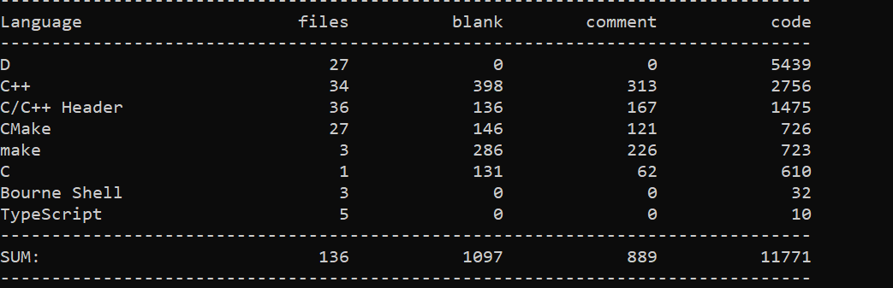

# High-Performance Webserver
1. 本项目百分之90以上基于C++11语法,也有`std::make_unique   std::make_shared`等C++11以后的语法,整个服务器基于`Muduo`的`one loop(reactor) per thread`
2. 主要内容是一个基于`muduo`网络库的`Webserver`服务器,支持解析`HTTP`头部,响应`HTTP`请求,支持服务器长连接`Keep-Alive`.日志部分支持同步日志记录和异步日志功能(后端:日志线程;前端:各个任务线程)  在项目中的各个环节提交了相应的测试代码
3. 环境：在Ubuntu 20.04.1上成功测试
4. 项目详细记录及过程文档见`https://github.com/ONN-sp/CPP/blob/main/Cpp_program/Web_sever/Web_server%E9%A1%B9%E7%9B%AE%E6%96%87%E6%A1%A3.md`
5. 项目构建方法`Linux`:
   * git clone git@github.com:ONN-sp/CPP.git
   * 解压缩 unzip CPP-main.zip
   * cd Cpp_program/Web_server/Base
   * bash build.sh
   * cd Cpp_program/Web_server/Net
   * bash build.sh
   * cd Cpp_program/Web_server/tests
   * bash build.sh
   * cd build
   * ./HttpServer_test(以此测试程序为例)
6. 注意:测试`Logfile_test.cpp`和`Asynclogging_test.cpp`的时候,需要先改`Web_server/tests/Logfiles`文件夹的权限=>`sudo chmod 777 ./Logfiles`
7. 项目技术点
   * IO多路复用->`EPOLL`,水平触发模式(对长连接短连接处理更友好)  非阻塞IO  Reactor模式
   * 整个项目都是基于`RAII`机制,即将将资源(锁、条件变量、文件描述符等等)的获取和释放绑定到对象的生命周期  使用智能指针管理对象    避免手动`delete`和一些潜在的内存泄漏问题
   * 工作线程利用线程池管理,并在程序开始时产生线程,避免在程序运行中产生线程而影响性能
   * 主线程主要负责接收连接(`accept`),并采用`Round-Robin`算法将任务分发给工作线程
   * 对于异步日志库,采用双缓冲机制(实际是四个缓冲区,前端两个后端两个)
   * 采用`Timerfd`作为定时器触发(定时器完成会触发一个可读事件),这样的话就能和事件驱动相统一
   * 采用了很多内置的系统函数,如`syscall memcpy()`等,这样能提高效率
   * 服务端采用了优雅的断开连接方式:主动断开(`shutdown`(半关闭))、被动断开(`Tcp`四次挥手)
   * 采用`std::move()`的移动语义方法,减少了拷贝的过程
   * 采用`std::make_unique  std::make_shared`,这样分配的内存效率更高,因为它只需要一次动态分配内存,它同时创建了`shared_ptr`和(`new`的)对象本身,而直接使用`new`则需要两次分配(一次为对象,一次为共享指针控制块)
   * 对于解决文件描述符耗尽的情况(也可说成是处理`busy loop`),提前准备立刻了空文件描述符,在面对服务器文件描述符耗尽时采用关闭/再接收/再关闭的方法,处理了此时的`busy loop`
   * 使用状态机的方法来解析和处理`HTTP`请求,来记录解析请求的各个状态
   * 本项目的主要思想`one loop(reactor) per thread`
8. 代码量:
   
9.  本项目的压测结果见`https://github.com/ONN-sp/CPP/blob/main/Cpp_program/Web_sever/Web_server%E9%A1%B9%E7%9B%AE%E6%96%87%E6%A1%A3.md`,本项目借助了`@linyacool`修改的支持`keep-Alive`的压测工具,并可以实现上万的并发测试

