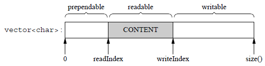

1. `getopt()`:这是一个C标准库函数,用于解析命令行参数,如:`./your_program_name -t 8 -p 8080 -l /var/log/webserver.log`:此时会启动服务器,使用8个线程(`-t 8`),监听端口号为8080(`-p 8080`),并将日志输出到`/var/log/webserver.log`
   ```C++
   int getopt(int argc, char* argv[], const char* optstring);
   //argc:命令行参数的数量,包括程序名称在内
   //argv:一个指向以nullptr结尾的指针数组,其中每个指针指向一个以nullptr结尾的字符串,表示一个命令行参数
   //optstring:一个包含所有有效选项字符的字符串.每个字符代表一个选项,如果后面跟着一个冒号":",则表示该选项需要一个参数.如,字符串"t:l:p"表示有三个选项,分别是't' 'l' 'p',其中't' 'p'后面需要一个参数
   //getopt()当所有选项解析完毕时,返回-1
   ```
2. 对于`optarg`,它是一个全局变量,用于存储当前`getopt()`解析到的选项的参数值.如:如果你的命令行参数是`-t 8`,当程序解析到`-t`选项时,`optarg`将被设置为`8`
3. `int main(int argc, char* argv[])`:程序入口点,其中:
   * `argc`:一个整数,表示传递给程序的命令行参数的数量,它至少为1,因为命令行第一个参数永远是程序的名称(通常是可执行文件的路径)
   * `argv`:一个指向字符指针数组的指针,表示传递给程序的实际命令行参数.`argv[0]`是指向程序名称的字符串,`argv[1]`到`argv[argc-1]`包含了传递给程序的其它参数,如:
   ```C++
    ./my_program arg1 arg2 arg3
    //argv[0]:指向字符串"./my_program"
    //argv[1]:指向字符串 "arg1"
    //argv[2]:指向字符串 "arg2"
    //argv[3]:指向字符串 "arg3"
    ```
    `argc argv`是由操作系统在调用程序时自动生成的参数.当在命令行中运行一个程序时,操作系统会自动将命令行参数传递给该程序
4. `C++`的接口设计中,`= 0`用于声明纯虚函数
5. `static_cast<...>`:`C++`中的强制类型转换
6. `::eventfd`:
   ```C++
   int eventfd(unsigned int initval, int flags);//创建一个指定控制标志的eventfd对象,并返回一个文件描述符
   //initval:初始计数器值
   //flags:控制标志,如EFD_NONBLOCK：非阻塞模式;EFD_CLOEXEC：在 exec 系统调用时自动关闭这个文件描述符
   ```
7. 回调函数的调用是上层来调的(如:`Tcpserver`等)
8. <mark>`muduo  web_server`的具体的`recv send accept`函数的调用是在回调函数内部,回调函数是被是否有对应就绪事件而触发的(最终是在`Channel`中的`HandleEvent`触发的,根据现在的就绪事件类型触发相应的回调函数),而不是先在外部调用`recv send accept`后触发回调函数(如先调用`recv`再触发对应的`Readcallback`).`wakeup_channel_->SetReadCallback([this]{this->HandleRead();})`:`read`函数在`HandleRead()`内部</mark>
9. 本项目中对于基本组件(`mutex condition thread`等)都不是直接在需要使用的地方调用标准库封装好的API,而是先自己将它们的创建、使用等方法封装成一个`RAII`对象,再在其他地方进行调用
10. 本项目有两个3秒的应用地方:
    * 3秒后业务线程的前端缓冲区队列会和日志线程的后端缓冲区队列进行交换(`buffersToWrite.swap(buffers_);`)
    * 3秒后`Logfile`就会把写入`FixedBuffer`中的日志信息写入到本地文件`::fflush(fp_)`
11. `GUARDED_BY`关键字:它修饰的变量必须在持有它给定的锁的所有权情况下,才能进行相应的操作. 如:`std::deque<Task> queue_ GUARDED_BY(mutex_);`表示表示任务队列`queue_`是在`mutex_`互斥锁保护下使用的,即它的`pop  push`等操作应该在持有`mutex_`这把锁的情况下才能进行
12. <mark>`mutable`关键字:用于声明类的成员变量.当一个成员变量被声明为`mutable`时,它将允许在`const`成员函数类修改这个变量的值,即使这个变量本身是`const`的,也可以(通常情况下,`const`成员函数是不允许修改对象的任何成员变量的,除非这些成员变量被声明为`mutable`),如:
   ```C++
   class Cache {
   public:
      Cache() : cachedValue_(0), count_(0) {}
      int getValue() const {
         // 在 const 成员函数中修改 mutable 成员变量count_
         ++count_;
         return cachedValue_;
      }
      void updateValue(int newValue) {
         cachedValue_ = newValue;
      }
   private:
      mutable int cachedValue_;
      mutable int count_;
   };
   //应该尽量不使用mutable,避免破坏类的const语义
   ```
13. `#include <stdexcept>`:`C++`标准库的一部分,包含了一组常用的标准异常类:
    * `std::exception`:所有标志异常的基类,可以捕获所有标准异常
    * `std::logic_error`:表示逻辑上的错误
    * `std::runtime_error`:表示程序在运行时遇到的错误,这些错误无法在编译时检测到
    * `std::invalid_argument`:表示函数收到一个无效的参数,如:传递了一个不合法的值个函数
    * `std::out_of_range`:表示访问了一个超出有效范围的元素
    * `std::length_error`:表示一个操作超出了长度限制.如:尝试向容器中插入超过最大长度的元素
    * `std::domain_error`:表示函数参数超出了有效的数学域.如:传递负数给一个只能接受非负数的数学函数
    * `std::overflow_error  std::underflow_error`:分别表示算数运算中的溢出和下溢
14. `SO_KEEPALIVE`:这个一个套接字选项,用于启用或禁用TCP连接的"保活"功能(`Keep Alive`).在网络编程中,`SO_KEEPALIVE`选项的作用是帮助检测"死"连接,也就是那些已经断开但并未关闭的连接.<mark>启用`SO_KEEPALIVE`后,`TCP/IP`协议栈会定期发送探测消息(`Keep-Alive`探测包)以确认连接的另一端是否仍然存在和响应.如果连接的另一端没有响应探测消息,`TCP/IP`协议栈会尝试重传一定次数的探测消息.如果多次探测都没有响应,则认为连接已经失效,会终止连接</mark>
15. 本项目最重要的就是搞清楚一层一层网络的回调函数的调用和传递
16. `channel_->SetReadCallback(std::bind(&Acceptor::handleRead, this));`:对于调用`std::bind`绑定类的成员函数时,传递`this`指针是必要的,因为成员函数需要一个对象实例来调用
17. 调用线程和所属线程要分清楚,这两者往往涉及到线程安全的问题
18. 本项目如果报错:`Segmentation fault`,那么很有可能的一种原因是:当前访问对象已经被释放了,具体来说当前对象从属于一个上层对象,该上层对象被析构了,那么可能当前对象也被析构了,这就是后面所说的对象生命周期问题
# argc argv
1. `int main(int argc, char* argv[])`:
# Muduo库的学习
1. `C++`中可能出现的内存问题:
   * 缓冲区溢出
   * 空指针/野指针
   * 重复释放
   * 内存泄漏
   * 不配对的`new/delete`
   * 内存碎片
2. `muduo`依赖于`boost`库
3. <mark>`Muduo`的设计理念:每个`EventLoop`运行在一个独立的线程中,每个线程负责管理一组I/O事件,这就是`one (event) loop per thread`</mark>
4. 主线程有一个`EventLoop`,负责接受连接(`accept`在主线程);每个工作线程运行一个独立的`EventLoop`,负责处理已经建立连接(主线程中建立了)上的I/O事件
5. `muduo`日志库是`C++ stream`风格,这样用起来更自然,不必费心保持格式字符串和参数类型的一致性,可以随用随写,而且是类型安全的
6. `muduo`广泛使用`RAII`这一方法来管理资源的生命周期 
7. `muduo`的`TcpClient`类没有高水位回调的主要原因是设计上的考虑.`TcpClient`作为客户端连接的封装,通常由应用程序控制数据的发送,而服务端(`TcpServer`)则需要处理更多的客户端连接和更复杂的流量控制
# 定时器
1. 计算机中的时钟不是理想的计时器,它可能会漂移或跳变
2. `Linux`的获取当前时间的函数:
   ```C++
   1. 
   time_t time(time_t* tloc);//返回从1970年1月1日到当前时间的秒数.若tloc!=nullptr,则time()会将当前时间保存到tloc指向的内存位置;若为nullptr,则返回时间值
   //time_t表示时间的基础类型,通常被定义为一个整数类型(__int64),用于存储自1970年1月1日00:00:00 UTC起经过的秒数
   2. int ftime(struct timeb* tp);//将当前时间的秒数和毫秒数存储在tp中,比time()更精细
   struct timeb {
    time_t time;       // 从 Unix 纪元开始的秒数
    unsigned short millitm; // 秒后经过的毫秒数
    short timezone;    // 本地时区相对于 UTC 的分钟数偏移
    short dstflag;     // 日光节约时间标志（非零表示处于日光节约时间）
   };
   3. int gettimeofday(struct timeval* tv, struct timezone* tz);//获取当前的系统时间,存储在tv中,这个结构包含秒和微秒的信息
   //struct timezone* tz:通常被弃用,设为nullptr
   struct timeval {
    time_t tv_sec;    // 从 Unix 纪元开始的秒数
    suseconds_t tv_usec; // 秒后经过的微秒数
   };
   4. int clock_gettime(clockid_t clk_id, struct timespec* tp);//能提供纳秒级的时间精度
   struct timespec {
    time_t tv_sec;    // 秒数
    long tv_nsec;     // 纳秒数
   };
   ```
3. `Linux`的定时函数:
   ```C++
   1. unsigned int sleep(unsigned int seconds);//将调用进程挂起指定的秒数
   2. unsigned int alarm(unsigned int seconds);//用于设置一个闹钟，在指定的秒数之后发送 SIGALRM 信号给调用进程。它通常用于定时触发信号处理器
   3. int usleep(useconds_t usec);//将调用进程挂起指定的微秒数
   4. int nanosleep(const struct timespec *req, struct timespec *rem);//将调用进程挂起指定的秒数和纳秒数
   5. int clock_nanosleep(clockid_t clk_id, int flags, const struct timespec *request, struct timespec *remain);//类似于 nanosleep()，但它允许指定不同的时钟源，并且可以选择相对或绝对的时间来休眠
   6. 
   int timerfd_create(int clockid, int flags);//创建一个新的定时器描述符
   //clockfd:指定定时器时钟源.可以是 CLOCK_REALTIME 或 CLOCK_MONOTONIC
   //flags:指定定时器的行为,通常为0
   //成功返回一个文件描述符;若出错返回1
   int timerfd_gettime(int fd, struct itimerspec *curr_value);//用于获取定时器描述符的当前超时设置
   //struct itimerspec *curr_value: 用于存储当前超时设置的 itimerspec 结构体指针
   struct itimerspec {
     struct timespec it_interval;  /* 周期定时器间隔.一旦定时器第一次触发后，it_interval 定义了多长时间后定时器再次触发。如果 it_interval 的值为零，则表示定时器只触发一次，不会重复 */
     struct timespec it_value;     /* 定时器的首次触发时间.当设置定时器时,it_value 定义了多长时间后定时器第一次触发。如果 it_value 的值为零，则表示定时器立即触发 */
   };
   int timerfd_settime(int fd, int flags, const struct itimerspec *new_value, struct itimerspec *old_value);//用于设置定时器文件描述符的超时值
   //flags:指定定时器的行为,通常为0
   //const struct itimerspec *new_value: 指定新的超时值的 itimerspec 结构体指针
   //struct itimerspec *old_value: 如果不为 NULL，则存储之前的超时值
   //返回0表示成功,新的超时值已经设置;返回-1则表示失败
   ```
4. 对于`Linux`的计时和定时函数的选择:`gettimeofday()`和`timerfd_create()/timerfd_gettime()/timerfd_settime()`.原因:
   * `time()`精度低,`ftime()`已被废弃,`clock_gettime()`精度高但开销更大
   * `sleep() alarm() usleep()`在实现时有可能用了`SLGALRM`信号,在多线程编程中处理信号相当棘手
   * `nanosleep() clock_nanosleep()`是线程安全的,但在非阻塞网络编程中,绝对不能用让线程挂起的方式来等待一段时间,这样一来程序会失去响应
   * `timerfd_create()/timerfd_gettime()/timerfd_settime()`把时间变成了一个文件描述符,该"文件"在定时器超时的那一刻变得可读(即定时完成时就会触发一个可读事件),这样就能方便的融入`select() poll() epoll()`.此定时方法本身不会挂起程序,它是否阻塞取决于`recv()`,因为它可读时就代表定时完成,这有点像时间回调函数
5. UTC(协调世界时)是全球标准的时间尺度,用来同步世界各地的时钟.UTC时间是没有时区的时间标尺,全球的时区偏移量都是基于UTC时间的,如:北京时间为UTC+8,美国东部时间为UTC-5
6. `std::tm`结构体:
   ```C++
   struct tm {
    int tm_sec;   // 秒，范围 0-59
    int tm_min;   // 分，范围 0-59
    int tm_hour;  // 小时，范围 0-23
    int tm_mday;  // 一个月中的第几天，范围 1-31
    int tm_mon;   // 月份，范围 0-11（0 代表一月，1 代表二月，依此类推）
    int tm_year;  // 年份，从 1900 年开始的年数
    int tm_wday;  // 一周中的第几天，范围 0-6（0 代表星期日，1 代表星期一，依此类推）
    int tm_yday;  // 一年中的第几天，范围 0-365
    int tm_isdst; // 夏令时标识，负数表示无效
   };
   ```
7. `C++`中:
   * 拷贝赋值运算符是在两个同类型对象之间进行的赋值操作,如`a=b`,其中`a`和`b`都是同一个类的实例
   * `timer.h`中成员级别的赋值不是拷贝赋值
8. `::close(timerfd_)  ::read`:为了显式地指明我们要调用操作系统提供的`close()  read()`函数,而非当前作用域内的其他可能存在的同名函数,我们使用作用域解析运算符`::`来表示我们要调用全局命名空间中的`close()  read()`函数
9. `TimerId`是定时器的唯一标识符,用于区分不同的定时器.在`Muduo`中,每个定时器都有一个唯一的`TimerId`,它由定时器的指针和定时器的序号两部分组成.定时器的指针用于定位定时器在`TimerQueue`中的位置,而定时器的序号则用于在多个定时器具有相同到期时间时进行排序
10. `std::pair<Timestamp, Timer*>`:为了处理两个到期时间相同的情况,这里使用`std::pair<Timestamp, Timer*>`作为`std::set`的`key`,这样就可以区分到期时间形相同的定时器
11. `TimerQueue`的成员函数只在其所属的I/O线程调用,因此不用加锁.如:借助`EventLoop::RunOneFunc`可以使`TimeQueue::addTimer`变成线程安全的,即无需用锁.办法是`loop_->RunOneFunc([this, timer](){this->AddTimerInLoop(timer);})`,即把定时器实际的工作转移到所属的I/O线程中去了
12. 在实际编程任务中,一定不能用`sleep()`或类似的方法来让程序原地停留等待,这会让程序失去响应.对于定时任务,我们应该把它变成一个特定的事件(`timerfd_create()/timerfd_gettime()/timerfd_settime()`将其变成了一个可读事件),到定时时间就会触发一个相应定时完成后需要完成的处理函数(即回调)
## Timer
1. `Timer::Timer(Timestamp expiration__, BasicFunc&& cb, double interval = 0.0)`:表示定义一个给定过期时间`expiration_`、回调函数`cb`、重复执行的间隔时间`interval`(为0表示不重复执行)的定时器
# std::pair
1. `std::pair`作用是将两个数据组合成一个数据,这两个数据可以是同一类型或不同类型,如:
   ```C++
   eg:
   std::pair<int, std::function<void()>> task;
   ```
# std::set
1. `std::set`是`C++`标准库中的一个容器,专门用于存储不重复的元素,并且这些元素按照特定的顺序自动排序.其底层实现通常使用红黑树或其他平衡二叉树,保证了插入、删除和查找等操作的时间复杂度位`O(logn)`
2. `std::set`在插入新元素时,会自动根据给定的比较规则(默认是`std::less`,即小于运算符)将元素放在正确的位置:
   ```C++
   int main() {
    std::set<int> mySet = {5, 1, 3, 7, 2};

    // 自动排序,输出有序的元素  自动为std::less(升序)
    for (int elem : mySet) {
        std::cout << elem << " ";
    }
    return 0;
   }
   //输出为=>1 2 3 5 7
   ```
3. `.lower_bound()`:查找集合中第一个不小于指定值的元素的位置
#  std::function<void()>
1. 这是一个通用的<mark>函数包装器</mark>,用于存储任意可调用对象(函数、函数指针、Lambda表达式等),并提供一种统一的方式来调用这些可调用对象
2. <span style="color:red;">严格来说`std::function<void()>`:表示不接受任何参数且无返回值的可调用对象,但是它仍然可以用作包装带有参数的函数的包装器:</span>
   ```C++
   1. 使用Lambda表达式忽略参数:
   void foo(int x){
      std::cout << x << std::endl;
   }
   std::function<void()> func = [](){
      foo(42);
   }
   func();
   2. 使用std::bind部分应用参数:
   void foo(int x){
      std::cout << x << std::endl;
   }
   std::function<void()> func = std::bind(foo, 42);
   func();
   3. 使用函数指针
   void foo() {
    std::cout << "Hello, World!" << std::endl;
   }
   std::function<void()> funcPtr = foo;
   funcPtr(); // 调用 foo 函数
   ```
# std::bind
1. `std::bind`通常期望传入普通指针或引用,而不是智能指针,所以对于智能指针要用`.get()`获取智能指针内部封装的裸指针:` loop_->RunOneFunc(std::bind(&Acceptor::Listen, acceptor_.get()));`
2. <mark>`std::bind`绑定成员函数时一定要传入该对象指针:</mark>
   ```C++
   class MyClass {
      public:
         void show(int x) {
            std::cout << "Value: " << x << std::endl;
         }
      };
      int main() {
         MyClass my_obj;
         auto bound_show = std::bind(&MyClass::show, &my_obj, std::placeholders::_1);// std::placeholders::_1表示绑定后的函数的第一个参数的位置
         bound_show(5); // 输出: Value: 5
         return 0;
      }
      ```
3. <mark>占位符在`C++`的`std::placeholders`命名空间中定义,用于在使用`std::bind`绑定函数时,表示将来调用时需要传入的参数位置:</mark>
   ```C++
   auto func = std::bind(&SomeClass::memberFunction, objectPtr, std::placeholders::_1, std::placeholders::_2);
   // std::placeholders::_1, std::placeholders::_2分别表示memberFunction函数的第一个参数位置和第二个参数位置
   ```
# `Poller  Channel  EventLoop`
1. `Poller  Channel  EventLoop`是`Muduo`网络库的核心组件,它们共同协作以实现高效的事件驱动编程
   * `Poller`:这是一个抽象基类,用于封装底层的I/O复用机制,如`epoll`.它负责监听多个文件描述符,并在它们有事件发生时通知`EventLoop`
   * `Channel`:它封装了一个文件描述符和该文件描述符的所有感兴趣的事件(读、写、错误等)及其回调函数.它不管理文件描述符的生命周期,仅负责将其事件分发给相应的回调函数
   * `EventLoop`:它是事件驱动系统的核心循环,负责在事件发生时调度相应的`Channel`处理器.它维护了一个`Poller`,并允许一个不断循环的事件处理机制
2. 三者调用关系:
   * `EventLoop` 持有一个 `Poller` 实例,并管理着一组 `Channel`
   * `Poller` 负责实际的 I/O 多路复用操作,它将发生的事件通知 `EventLoop`
   * `Channel` 与具体的文件描述符关联,负责将文件描述符上的事件分发给对应的处理函数
   * `EventLoop` 通过调用 `Poller` 的 `poll` 方法来等待事件的发生,当获取到活动事件后,它会获取活动事件的`Channel`列表(即注册与当前就绪事件的`fd`对应的`Channel`,把这些活跃的`Channel`放入`active_channels`),再依次调用每个`Channel`的回调函数处理事件
3. 
4. 类比`tiny_httpserver`来理解这三者的关系:(以`tiny_httpserver`主线程为例)`EventLoop`就是`tiny_httpserver`中主线程的事件循环(`while(1)`);`Poller`负责底层的事件多路复用,通过调用系统调用如`epoll_wait`来监听文件描述符上的事件;`Channel`封装了文件描述符及其事件处理函数,负责具体的事件处理逻辑(`Channel`就是主线程调用的就绪事件的对应的执行函数(如:`acceptConn`))
5. 一个线程<=>一个`EventLoop`,一个`EventLoop`可能涉及多个文件描述符
6. `epoll_wait()`:返回的是就绪的文件描述符个数,即就绪事件的个数,就绪事件被放在了`events_`中
# enum与enum class的区别
1. 这是两种不同的枚举类型声明方式:
   * `enum class`引入了作用域,枚举值被限制在枚举类型的作用域内,不会自动转换为整数.因此,枚举值必须显式地指定为枚举类型的成员:
      ```C++
      enum class ChannelState { Open, Closed };
      ChannelState state = ChannelState::Open;
      // 使用枚举值时必须指定作用域
      if (state == ChannelState::Open) { /* ... */ }
      ```
   * `enum`没有引入新的作用域,枚举值可以直接被用作整数.在枚举类型的作用域外部,枚举值可以隐式地转换为整数:
      ```C++
       enum ChannelState { Open, Closed };
      ChannelState state = Open;  // 不需要指定作用域(即不需要ChannelState::)
      // 在作用域外部，枚举值可以隐式转换为整数
      if (state == Open) { /* ... */ }
      ```
   * 使用`enum class`可以提供更好的封装和名称空间隔离,避免命名冲突,并且需要显式地进行枚举值的类型转换
   * 使用传统的`enum`保留了与`C`语言风格枚举相同的行为,不具备封装性和名称空间隔离,并且允许隐式转换为整数
# Channel
1. 活跃的`Channel`<=>这个`Channel`绑定的文件描述符有就绪事件
2. 一个`Channel`<=>一个文件描述符
3. 每个`Channel`对象自始至终只负责一个文件描述符的I/O事件的分发,但它不拥有这个文件描述符,也不会在析构时关闭这个文件描述符.每个`Channel`对象自始至终只属于一个`EventLoop`
4. 假设`epoll`中监听到有4个文件描述符有事件发生,那么我们就把这4个文件描述符所对应的`Channel`称为活跃的
5. 底层向上的调用关系:`Channel::Update()`->`EventLoop::UpdateChannel()`->`Poller::UpdateChannel()`->`epoller::UpdateChannel()`
6. 当`Channel`被标记为`kDeleted`,通常意味着已经执行了`epoll_ctl`的`EPOLL_CTL_DEL`操作.`kDeleted`意味着该`Channel`已经从`epoll`树上删除了
7. `Channel`的三个状态:
   * `kNew`:`Channel`刚创建,尚未加入到`epoll`树上.这通常是默认状态,表示`Channel`尚未参与到任何事件监控中
   * `kAdded`:`Channel`已经被添加到`epoll`树上,并正在监控其感兴趣的事件
   * `kDeleted`:`Channel`曾经在`epoll`树上,但当前已被标记为删除.`Channel`已经从`epoll`树中删除了
8. `Channel`类是用来封装文件描述符(通常是`socket`)的,它负责处理文件描述符上的事件,并调用相应的回调函数,这个回调函数是在检测到写/读/错误事件后就会立即调用的,而不是说检测到写事件后,再`write()`结束后才调用的
9. `Channel::Tie()`:`TcpConnection`中注册了`channel_`对应的回调函数,传入的回调函数均为`TcpConnection`对象的成员方法,因此可以说明`channel_`的结束一定早于`TcpConnection`对象,否则可能会出现`TcpConnection`对象在其拥有的`channel_`中被销毁了,而此时事件还没结束,所以此时的`channel_`就成为了空悬指针.此处用`Tie`去解决`TcpConnection`和其拥有的`Channel`的生命周期时长问题,从而保证了`Channel`对象能够在其所属的`TcpConnection`对象销毁前销毁
10. 本项目和`muduo`中有两种回调函数:一种是`Channel`(文件描述符)中的读、写、错误、关闭回调;一种是非`Channel`(文件描述符)回调,如`Acceptor`中属于`Channel`的可读回调`handleread()`中的`NewConnectionCallback`回调等
11. `Channel`的`close_callback_`可以理解为是为了资源清理时而设置的,当检测到`POLLHUP`事件且没有`POLLIN`事件时,表示此时的连接(其实就是套接字)可能已经挂起或关闭,此时就回调`close_callback_`.<mark>需要注意:`Channel`中的`close_call_back_`是当文件描述符挂起(挂断)时触发,这和"客户端主动关闭`Tcp`连接,服务端被动关闭"是不同的,这的被动关闭是不会触发对应`Channel`的`close_callback_`的,而是触发该`Channel`的`read_callback_`,进而通过读取到数据量为0,来确定关闭这个连接</mark>
12. <mark>`Channel::HandleEvent`处理的是`channel`对应文件描述符的读、写、关闭、错误四种回调;而`EventLoop::doPendingFunctors()`解决的是上层回调(非文件描述符的回调)(将上层回调放到所属的`loop`中的任务队列中执行,可以保证线程安全性),如`MessageCallback   ConnectionCallback  TcpServer::HandleCloseInLoop  TcpConnection::ConnectionEstablished`等等</mark>
13. `Channel::HandleEvent()`四种回调函数是在上层的`TcpConnection`的构造函数中注册的
14. </mark>本项目采用的是`muduo`设计回调的思想,即`Channel`控制最底层的四种回调:错误、关闭、读、写,这几种回调是通过文件描述符触发的,然后在这几种底层回调函数的内部一般是会进一步调用上层回调(`MessageCallback ConnectionCallback CloseCallback`,需要特别注意的是这个`TcpConnection::close_callback_`不是它拥有的`channel_`的回调,`channel_`的回调函数是`HandleClose`,这个`close_callback_`是在`HandleClose`中进一步调用的上层回调)</mark>
15. 本项目和`muduo`中的 `Callback.h`中的回调函数是供上层应用程序使用的(上层回调),而不是`Channel.h`中的的回调函数定义
# Poller
1. 这是一个基类,因为在muduo中同时支持`poll()`和`epoll()`.本项目只用了`epoll()`,所以只有`epoller`继承了`Poller`,继承后需要重写纯虚函数
2. `Poller`是I/O多路复用的封装,它是`EventLoop`的组成,与`EventLoop`的生命期相同,为`EventLoop`提供`poll()`方法.`poll()`方法是`Poller`的核心功能,它调用`epoll_wait()`获得当前就绪事件,然后注册一个`Channel`与该就绪事件的`fd`绑定(将`Channel`对象放在`epoll_event`中的用户数据区,这样可以实现文件描述符和`Channel`的一一对应.当`epoll`返回事件时,我们可以通过 `epoll_event`的`data.ptr`字段快速访问到对应的`Channel`对象,而不需要额外的查找操作),然后将该`Channel`填充到`active_channels`
3. 在`UpdateChannel()`中,为什么状态为`kDeleted`的`Channel`要被再次添加?
   ```s
   1. 如果 Channel 之前被标记为删除 (kDeleted)，但现在有新的事件需要处理，这说明它需要重新加入到 epoll 中
   2. 使用 EPOLL_CTL_ADD 再次添加 Channel，可以方便地将其重新激活，而不必频繁地删除和重新添加
   ```
4. `Poller.h`中只需要`Channel`类的指针或引用,不需要其完整定义,因此不需要包含`Channel.h`头文件
5. `events_`的初始大小为16(`kDefaultEvents`),如果事件数组已满,则将其大小加倍(`vector`的`resize`,这里是直接`vector.size`加倍,不是`vector`的`capacity`自动加倍的处理)
# EventLoop
1. `EventLoop`是I/O线程的事件循环,它能确保所有注册的事件都在`EventLoop`对象所在的线程中执行
2. `EventLoop::loop()`它调用`Poller::poll()`获得当前活动事件(就绪事件)的`Channel`列表,然后依次调用每个`Channel`的`handleEvent()`函数
3. `EventLoop`是`Channel`和`Poller`的桥梁
4. `EventLoop`<=>`Reactor`
5. 主`EventLoop(Reactor)`负责接收连接请求的到来,然后对应`accept`返回的文件描述符分发给子`EventLoop(Reactor)`,子`EventLoop(Reactor)`中对相应的事件进行回调
6. 假设一种情形:子`EventLoop`被阻塞了(因为`epoll_wait()`没有就绪事件发生),但是此时主`EventLoop`需要向子`EventLoop`添加一个需要理解执行的任务,所以此时必须唤醒这个子`EventLoop`
7. 调用`wakeup()`会获得一个文件描述符(`::eventfd()`返回的),文件描述符就伴随一个`Channel`.既然子`EventLoop`被阻塞了,那么需要一个就绪事件让它重新唤醒,<mark>本项目采用的是利用主动`wirte`来实现`wakeup`的,此时会伴随一个读事件回调</mark>
8. <mark>`EventLoop`中的`wakeup()`非常经典</mark>
9. <span style="color:red;">`wakeup`:如果不唤醒在`doPendingFunctors()`执行完n个回调后,如果又来了m个回调,但是现在会阻塞在`epoller_->Poll(KPollTimeMs, active_channels_);`中(它里面有`epoll_wait`),所以必须`wakeup()`.总之,`wakeup()`的目的就是为了使新加进来的回调能被立即执行:</span>
    ```C++
    void EventLoop::Loop() {
    assert(IsInThreadLoop()); // 确保当前线程是事件循环所在的线程
    running_ = true; // 标志事件循环开始运行
    quit_ = false;// 是否退出loop
    while (!quit_) {
        active_channels_.clear(); // 清空活跃 Channel 列表
        epoller_->Poll(KPollTimeMs, active_channels_); // 调用 Epoller 的 Poll 函数获取活跃的 Channel 列表
        for (const auto& channel : active_channels_)
            channel->HandleEvent(); //Poller监听哪些Channel发生了事件,然后上报给EventLoop,EventLoop再通知channel处理相应的事件
        doPendingFunctors(); // 处理待回调函数列表中的任务
    }
    running_ = false; // 事件循环结束
    }
    ```
10. `pendingFunctors_`是每个`EventLoop`对象独立存储的,但在多线程服务器中,其它线程(上层)可能需要向当前这个`EventLoop`添加回调函数(如:上层`EventLoop`会写入定时器回调函数),因此`pendingFunctors_`需要线程安全,因此加了锁
11. 为什么`if (!IsInThreadLoop() || calling_functors_)`后要`wakeup()`?
    * 首先,其它线程向所属当前线程的`EventLoop`添加任务,那么此时一定要`wakeup`(因为其它线程加进来的任务一定不在当前线程的`EventLoop`中,而当前`EventLoop`可能被阻塞住了);其次,如果新加进来的任务不是已经被执行了的,即此时加进来的是下一轮要去执行的,那么需要`wakeup`(为了使新加进来的任务在下一轮能被立即执行),即`calling_functors_`(当前`pendingFunctors_`执行完毕时会给`calling_functors_`置`false`)
12. `doPendingFunctors`中的经典操作:
    ```C++
    {
        MutexLockGuard lock(mutex_); // 加锁保护待执行任务列表
        functors.swap(pendingFunctors_); // 将待执行任务列表交换到局部变量中  这种交换方式减少了锁的临界区范围(这种方式把pendingFunctors_放在了当前线程的栈空间中,此时这个Functors局部变量就线程安全了),提升了效率,同时避免了死锁(因为Functor可能再调用queueInLoop)
    }
    ```
   `EventLoop::doPendingFunctors()`不是简单地在临界区内依次调用`Functor`,而是把回调列表`pendingFunctors_`交换到局部变量`functors`中去了,这样`functors`对于此`EventLoop`对应的线程它就是其独立拥有的,即线程安全的了(只是多消耗了栈空间).这样操作一方面减小了临界区的长度,另一方面也避免了死锁(此时可能出现的死锁情况:(`C++`中,`std::mutex`表示的就是非可重入互斥锁,这种锁不允许同一线程在已经持有锁的情况下再次获取同一个锁,否则会导致死锁),`Functor`可能再调用`QueueOneFunc`就可能出现一个线程再获取已经持有的锁)
13. `doPendingFunctors()`其实解决的是上层回调
14. `EventLoop`的`loop`方法是一个死循环,除非主动调用`quit`,或调用了该`loop_`的析构函数才能终止(和`Asynclogging::ThreadFunc`一样)
15. `EventLoop`采用的是`epoll`的水平触发(默认就是水平触发),而不是边沿触发,为什么?
    * 为了与传统的`poll()`兼容(`poll`没有边沿触发),因为在文件描述符数目较少,活动文件描述符比例较高时,`epoll`不见得比`poll`更高效,必要时可以切换`Poller`
    * 水平触发更简单
    * 读写的时候不必等候触发`EAGAIN`(表示缓冲区是否满(满对应写操作)),可以节省系统调用次数,降低延迟
16. <mark>本项目基于`muduo`设计的核心思想:每个`EventLoop`运行在一个单独的线程中,并且所有与该`EventLoop`相关的操作都应该在这个线程中执行(因此把上层的所有回调函数都放到了其所属的`EventLoop`的任务队列中去了(如:`TcpServer`中的`ptr->loop()->RunOneFunc(std::bind(&TcpConnection::ConnectionDestructor, ptr));`等等)).这个设计理念旨在保证线程安全性和系统的一致性,同时简化了并发编程的复杂性</mark>
17. 本项目和`muduo`通过使用`EventLoop`的`QueueInLoop`或`RunOneFunc`方法来将任务安全地调度到目标线程的`EventLoop`中执行,这种方法可以避免直接在多个线程中并发执行代码的风险.但是如果任务涉及到访问或修改多个线程共享的数据,即使这些任务是在 `EventLoop`的单线程中执行,也需要注意线程安全的问题
# EventLoopThread&EventLoopThreadLoop
1. 为了更直接的表示`one loop per thread`,我们建立了`EventLoopThread`,`thread_(std::bind(&EventLoopThread::StartFunc, this), name)`:体现了一个`thread`与一个`loop`绑定
2. `EventLoopThreadPool`中的`base_loop_`:它是整个`EventLoopThreadPool`的核心`EventLoop`对象,通常是主线程的`EventLoop`.它是传入一个`EventLoopThreadPool`的参数,而不会在这个`EventLoopThreadPool`中的`loops_`中
3. 尽管`ThreadPool`是一个通用组件,但在本项目和`Muduo`中并没有直接使用这个线程池,而是更多地依赖于`EventLoopThreadPool` 来处理`I/O`事件和分发任务.`Muduo`的设计哲学之一是每个连接都在一个固定的`EventLoop`中处理,避免多线程直接操作连接数据,从而简化了并发编程
4. <mark>一个`EventLoopThreadPool`->一群`EventLoopThread`对象=>每一个`EventLoopThread`绑定一个`Thread`对象和一个`EventLoop`对象(一个`Thread`<=>一个`EventLoop`<=>一个`Reactor`)</mark>
5. <mark>`std::unique_ptr<EventLoopThread>(thread)`:这并不是传统意义上的强制类型转换,而是使用`std::unique_ptr`的构造函数来接管原始指针`thread`的所有权.它是对象的所有权从一个原始指针转移到一个智能指针的过程,而不是类型之间的转换</mark>
## 所遇问题
1. `std::move`的问题:
   ```C++
   auto thread = std::make_unique<EventLoopThread>(cf, name_);
   threads_.emplace_back(std::move(thread));
   loops_.emplace_back(thread->StartLoop());
   // !!! 此时会报错  Segmentation fault   因为std::move把thread移动后,thread指针就变得无效了,它已经被转移到threads_容器了,因此thread->StartLoop()就会报错
   // 修改方法一:
   auto thread = std::make_unique<EventLoopThread>(cf, name_);
   threads_.emplace_back(std::move(thread));
   loops_.emplace_back(threads_.back()->StartLoop());
   // 修改方法二:
   EventLoopThread* thread = new EventLoopThread(cf, name_);
   threads_.emplace_back(std::unique_ptr<EventLoopThread>(thread));
   loops_.emplace_back(thread->StartLoop());
   ```
2. `EventLoopThread`中遇到了一个调试`Bug`=>`std::move`的胡乱使用:
   
# CurrentThread
1. `__thread`是一种用于声明线程局部存储变量的关键字.在多线程编程中,它允许每个线程拥有自己独立的变量副本,这意味着每个线程一进来后都会拥有这个变量,但是它们之间是互不干扰的.`__thread`可以用来修饰那些带有全局性且值可能变,但是又不值得用全局变量保护的变量
2. `::syscall(SYS_gettid)`:在`Linux`系统中用来获取当前线程ID的系统函数
3. 内联函数在`C++`中是一种特殊的函数,它通过编译器在调用点直接展开函数体,而不是像普通函数那样生成函数调用.这种特性通常用于简单且频繁调用的函数,以提高程序的执行效率和性能
4. `__thread`使用规则:只能用于修饰`POD`类型(包括基本数据类型`int float char enum`等、结构体等,不能有自定义的构造函数、析构函数、拷贝构造函数、移动构造函数、虚函数、赋值运算符等),不能修饰`class`类型,因为无法自动调用构造函数和析构函数.`__thread`可以用于修饰全局变量、函数内的静态变量,但是不能用于修饰函数的局部变量或`class`的普通成员变量.`__thread`初始化只能用编译器常量:
   ```C++
   1.
   __thread int counter;  // 基本类型
   2.
   struct NonPOD1 {
    int x;
    NonPOD1() : x(0) {}  // 自定义构造函数，不符合要求
   };
   struct NonPOD2 {
      virtual void func() {}  // 包含虚函数，不符合要求
   };
   ```
5. 编译常量:指的是在编译期就能确定其值的常量,包含:`字面值常量`:`42 3.14 'a'`等;`const常量`;`枚举类型`;`constexpr`;`模板参数`:
   ```C++
   1.
   const int maxCount = 100;
   const double pi = 3.14159;
   2.
   enum Color { Red = 1, Green = 2, Blue = 3 };
   3.
   constexpr int arraySize = 128;
   constexpr double square(double x) { return x * x; }
   4.
   template<int N>
   struct Factorial {
      static const int value = N * Factorial<N - 1>::value;
   };
   template<>
   struct Factorial<0> {
      static const int value = 1;
   };
   ```
6. `constexpr`:用于声明可以在编译时求值的常量表达式,它提供了比`const`更强大的编译时的计算能力:
   * 与`const`类似,`constexpr`可以用于定义在编译期求值的常量变量
   * `constexpr`关键字可以修饰函数,表示这个函数可以在编译期求值
   * 与`const`不同,`constexpr`提供了在编译期进行复杂计算的能力,包括递归和逻辑运算
   ```C++
   constexpr int arraySize = 128;
   constexpr int factorial(int n) {
      return (n <= 1) ? 1 : (n * factorial(n - 1));
   }
   constexpr int result = factorial(5); // factorial 函数是一个 constexpr 函数，如果传递给它的参数是一个编译时常量（如 5），那么它的结果也是一个编译时常量
   ```
# Logging
## logstream
1. `logstream.cpp logstream.h`:类比于`ostream.h`类,它们主要是重载了`<<`(本项目的日志库采用与`muduo`一样的`C++ stream`),此时`logstream`类就相当于`std::cout`,能用`<<`符号接收输入,`cout`是输出到终端,而`logstream`类是把输出保存到自己内部的缓冲区,可以让外部程序把缓冲区的内容重定向输出到不同目标,如:文件(对于日志输出,就是输出到本地文件中)、终端、`socket`(即`logstream`流对象是输出到`buffer (Buffer = FixedBuffer<kSmallSize>`)`的)
2. <mark>`logstream`类使用了自定义的`FixedBuffer`类,通过预先分配的固定大小的缓冲区来存储日志数据(注意:`logstream.cpp logstream.h`并没有给出日志输出到哪个本地文件啥的,只是到一个预先分配的缓冲区里了),这样可以减少频繁的动态内存分配,提高性能</mark>
3. `logStream`类里面有一个`Buffer`(`Buffer = FixedBuffer<kSmallSize>`)成员(就是`FixedBuffer`类的,不是`tiny_muduo::Buffer`类).该类主要负责将要记录的日志内容放到这个`Buffer`里面.包括字符串,整型、`double`类型(整型和`double`要先将之转换成字符型(`FormatInteger`和`snprintf(buf, sizeof(buf), "%g", num)`),再放到`buffer`里面).该类对这些类型都重载了`<<`操作符.这个`logStream`类不做具体的IO操作(`::recv ::send`)
4. <mark>`Buffer = FixedBuffer<kSmallSize>`定义的`Buffer`相当高效,因为它是利用`memcpy()`复制数据的,而`gcc`编译器会直接将`memcpy()`展开为内联代码,提高了执行效率</mark>
5. <mark>`gcc`内置函数不是`C`标准定义的,而是由编译器自定义的.内置函数(`memcpy() strrchr()`等)都是`inline`的</mark>
6. 流对象的形象理解:想象水流通过一根管道,水代表数据,管道代表流对象.数据在管道中流动,无论水的来源(例如水龙头、湖泊还是去向(例如水槽、河流),你都可以通过管道来运输水.在`C++`中,`std::cin`就像从键盘输入的管道,而`std::cout`就像输出到控制台的管道.对于`logstream`中的流对象,就是输出到`Buffer = FixedBuffer<kSmallSize>`这样的`buffer`中的管道
## logfile
1. `logfile`类是`webserver`日志库后端的实际管理者,主要负责日志的滚动
2. 为了在写日志的时候更高效,写日志到缓冲中使用非加锁的`::fwrite_unlocked`函数,因此要求外部单线程处理或加锁,保证缓冲区日志不会发生交织混乱
3. `fwrite_unlocked`比`fwrite`更高效
4. 对于日志滚动,其实就是重新生成日志文件,再向里面写数据;本项目有两种情况日志滚动:
   * 当日志消息文件大小达到设定值`rollSize_`就滚动
   * 当到了新的一天,日志也会滚动
5. 日志库不能每条消息都`flush`硬盘,更不能每条日志都`open/close`,这样性能开销太大.本项目定期(默认3秒)将缓冲区日志消息`flush`到硬盘(注意:这里的3秒指的是写入磁盘的时间间隔,而`asynclogging`中的3秒指的是前端和后端线程交换的时间间隔)
6. 日志信息->`::fwirte_unlocked`写到`fp_`所代表的文件流对应的内部缓冲区中->`flush`到本地文件中
7. 日志都在`./LogFiles/`文件夹中
# logging
1. 日志信息是有等级的,由低到高为:`DEBUG INFO WARN ERROR FATAL`:
   ```C++
   enum class Level{
      DEBUG, // 调试信息级别
      INFO,  // 普通信息级别
      WARN,  // 警告信息级别
      ERROR, // 错误信息级别
      FATAL  // 致命错误信息级别
   };

   #define LOG_INFO \
   if (LogLevel() <= tiny_muduo::Logger::Level::INFO) \
    tiny_muduo::Logger(__FILE__, __LINE__, tiny_muduo::Logger::Level::INFO).stream()
    //当输出的日志级别高于语句的日志级别(INFO),则打印日志(打印到屏幕)是个空操作,运行时开销接近0
    ```
2. 本项目的日志库的消息格式为:
   ```s
   日期 时间 微秒 线程ID 级别 写入的日志正文消息 - 源文件名:行号
   ```
   
3. 本项目的默认路径:`./webserver/tests/Logfiles/`
4. 本项目的日志文件名:`LogFile_当前时间_微秒.log`
5. 本项目的日志的使用方式(非异步):
   ```C++
   LOG_INFO << "AAA";
   //LOG_INFO是一个宏，展开后为：muduo::Logger(__FILE__, __LINE__).stream() << "AAA";构造了一个匿名对象Logger，在这个对象构造的时候其实已经写入了文件名和行号.匿名对象调用.stream()函数拿到一个LogStream对象，由这个LogStream对象重载<<将“AAA”写入LogStream的数据成员FixBuffer对象的data_缓冲区内.匿名对象在这条语句执行完毕以后会被销毁，因此会调用~muduo::Logger()函数将日志消息输出至目的地(fflush)(标准输出或者磁盘的日志文件)
   ```
6. 日志流程(非异步):`Logger`->`Implment`->`LogStream`->`operator << (即stream_ <<  写入的是GeneralTemplate对象,其实就是调用的是logstream的Append方法)`->`LogStream的FixBuffer内`->`g_output`(这是`logging.cpp`的`Logger::OutputFunc g_output`)->`g_flush`(这是`logging.cpp`的`Logger::FlushFunc g_flush`)
7. `g_output`的执行是在`Logger::Implement::~Implement()`中
8. 利用`LOG_DEBUG LOG_INFO LOG_WARN LOG_ERROR LOG_FATAL`直接输出日志时,对于本项目,没有设定`LogFile`对象的都不会输出到本地文件中(`Asynclogging`在`ThreadFunc`中是新建`LogFile`对象的),而是直接输出到屏幕,因为默认设置的日志`logstream`默认输出的是屏幕`fwrite(data, sizeof(char), len, stdout); fflush(stdout);`
# asynclogging
1. 一个日志库大体分为前端和后端.前端是供应用程序使用的接口,并生成日志消息(前端是业务线程产生一条条的日志消息);后端则负责把日志消息写到目的地(后端是一个日志线程,将日志消息写入文件,日志线程只有一个)
2. <mark>前面的`logstream logfile logging`还是停留在单线程的日志考虑中,即还没涉及到前端和后端线程,`asynclogging`将它们整合形成了多线程异步日志库</mark>
3. 日志线程和业务线程之间是典型地多生产者单消费者模型,前端的多个业务线程不用考虑后端,会一直无阻塞的向后端的日志线程写日志信息
4. 由于磁盘IO是移动磁头的方式来记录文件的,其速度与CPU允许速度并不在一个数量级上,磁盘IO很慢很慢,因此在正常的实时业务处理流程中应该彻底避免磁盘IO(即业务线程中不应该有磁盘IO的出现),所以我们使用业务现场和日志线程分开
5. <mark>我们采用的是双缓冲技术(实际是四个缓冲区,这里将抽象为两个缓冲区表述):准备`buffer`A和B,前端负责往`buffer`A填日志消息(各个业务线程互斥的填),后端负责将`buffer`B的数据写入本地文件(磁盘IO).当`buffer`A写满,交换A和B,让后端将`buffer`A的数据写入文件,而前端则往`buffer`B填入新的日志消息,如此往复.用两个`buffer`可以不必等待磁盘文件的读写(如果直接在业务线程往磁盘读写,那么很可能会阻塞很久,因为磁盘IO很慢),也避免了每条新日志消息都去唤醒日志线程,我们是拼成一个大的`buffer`再唤醒后端线程的.另外,为了及时将日志消息写入文件,即便`buffer`A未满,日志库也会3秒执行依次上述交换写入操作</mark>
6. 如果前端写入速度太快,一下把前端线程(业务线程)的两块缓存都用完了,那么只好再分配一块新的`buffer`,因为此时磁盘IO还没完成,后端的`buffer`还换不到前端来,这是极少发生的情况
7. 业务线程的缓冲区队列和日志线程的缓冲区队列的交换有两种条件,`if (buffers_.empty())`:为空就说明没写满的;不为空说明有写满的
   * 超时(3秒)
   * 业务线程写满了一个或多个`buffer`
   当条件满足时,先将当前缓冲`current_`移入`buffers_`,并离开将空闲的`newBuffer_current`移为当前缓冲(`current_ = std::move(newBuffer_current);`).接下来将`buffers_`与`buffersToWrite`交换(`buffersToWrite.swap(buffers_);`).最后用`newBuffer_next`代替`next_`(如果`next_`为空,说明当前没有备用缓冲区可以使用,需要从预留的`newBuffer_next`中获取一个新的缓冲区来充当`next_`),这样前端始终有一个预备的`buffer`可供调配.最终`buffersToWrite`内的`buffer`重新填充`newBuffer_current newBuffer_next`,这样下一次执行的时候还有两个空闲的`buffer`可用于替换前端的当前缓冲和备用缓冲
8. 四个缓冲区其实都是在`asynclogging`中创建的,只是前端缓冲区`current_  next_`是在业务线程中被写入的(即`void AsyncLogging::Append`在前端线程中被调用),而缓冲区交换、日志消息向文件的写入等过程都是在后端实现的.`logfile asynclogging`通常被归在后端日志线程中(但并不是说`asynclogging`的所有成员函数只会在日志线程中被调用,如前端业务线程会调用其中的`Append`,来向缓冲区写入日志信息),即负责收集日志信息和写入日志信息;`logstream logging`通常被归在前端的业务线程中,主要用于准备业务线程中的日志消息,并将其传递给`asynclogging`
9. `logstream logfile logging asynclogging`四个文件的工作协同关系:业务线程调用`logging`的宏(如`LOG_INFO`)->构造一个`Logger::Implment`,获得一个`logstream`流->向`logstream`流写入一个`GeneralTemplate`对象->调用`asynclogging`的`Append`方法(其实就是`logstream`的`Append`方法)写入到前端线程的缓冲区->调用后端日志线程的`ThreadFunc`,`AsyncFlush`写入本地文件
10. <mark>在`asynclogging`中,不管是前端缓冲区的`current_ next_`,还是后端缓冲区的`newBuffer_current newBuffer_next`,它们都没有拷贝,而是简单的指针交换`std::move`实现,不会带来多大开销</mark>
11. 对于多线程异步日志程序,只有在日志信息大于给定的日志文件大小(`log->writebytes() >= kSingleFileMaxSize`)才会新建一个`LogFile`,即新建一个本地的`.log`文件(其它情况(3秒到了,它只是`flush`到本地,只要大小没超`kSingleFileMaxSize`,那么第二个3秒写的还是同一个本地文件(`.log`)))
12. `buffers_.reserve(16)`:对容器`std::vector<BufferPtr> buffer_`的内存预分配操作,避免频繁的内存重新分配.<mark>`std::vector`是动态数组,其大小可以根据需要增长.然而,每次增加空间时,`std::vector`需要重新分配内存,并将旧数据复制到新位置.通过调用`reserve(16)`,我们可以提前为16个元素预分配空间,减少后续添加元素时的重新分配开销</mark>
13. `Asynclogging`的`ThreadFunc`方法是一个死循环,除非主动调用`quit`,或调用了该`log_`的析构函数才能终止
14. 《`Linux`多线程服务端编程》的P114-119:
    * 第一种情况是前端日志的频度不高,后端3秒超时后将"当前缓冲`current_`"写入文件:
    
    * 第二种情况,在3秒超时之前已经写满了当前缓冲,于是唤醒后端线程开始写入文件:
      
    * 第三种情况,前端在短时间内密集写入日志消息,用完了两个缓冲,并重新分配了一块新的缓冲:
     
    * 第四种情况,文件写入速度较慢,导致前端耗尽了两个缓冲,并分配了新缓冲:
     
# 所遇问题
1. 由于路径不正确的`segmentation fault`:写入日志的本地文件路径错误
2. 本地文件出现乱码:`stream_ << GeneralTemplate(data, len)`这里传入的长度`len`如果大了,那么写入的日志文件就会乱码.因为在`logstream`的`append()`中,指针`cur_`会多向前移动一个位置,但是这个位置啥也没有,最终导致写入乱码;`len`小了,不会乱码,只是导致日志信息缺失
3. `std::strlen`与`sizeof()`的区别:
   * `std::strlen`:计算`C`风格字符串(以`\0`结尾的字符数组)的长度,计算字符数组的字符数(不包括`\0`).它只适用与以`\0`结尾的字符数组
   * `sizeof()`:这是一个编译时的运算符,用于计算数据类型或对象在内存中的大小,以字节为单位
4.  `asynclogging`的调用出现死锁:经过几个小时的验证,最终发现死锁不是由于主线程(`asynclogging`中创建日志线程的原线程)和新创建的子线程(日志线程)之间调用(`CutDown() wait()`)导致`Latch`中锁的死锁,因为它们之间没有出现同一个线程持有同一把锁的情况,`CutDown()`是在线程1中执行,然后对有着同一个`latch_`对象的线程2产生唤醒操作.真正导致死锁的原因是:`condition.h`定义的条件变量对象,之前使用的是`std::unique_lock<std::mutex> lock(mutex_.mutex());`:此时在`asynclogging`的`ThreadFunc`一开始就上锁了,如果这还上锁那么就会死锁.解决办法:`std::unique_lock<std::mutex> lock(mutex_.mutex(), std::defer_lock);`:`std::defer_lock`表示不调用`std::unique_lock  std::lock_guard`时就立即上锁,而是后面需要上锁自己手动`lock()`
5. 忘写`written_bytes_ += len;`,导致一直不能新建`LogFile`,即就算输出的日志超过了给定的日志文件最大限制`kSingleFileMaxSize`,它也不能新建一个本地文件进行写入
6. `LogFile`的`Flush`和`append`函数在使用互斥锁前,一定要先判断是否存在,即`if(mutex_)`.必须先判断,不然程序有bug! 这个`mutex_`可能在其它地方被销毁了,而此时还没有`new`一个`LogFile`(一个`LogFile`有一个属于自己的局部变量`std::unique_ptr<MutexLock> mutex_;`),那么此时就会出现卡死的bug(因为`mutex_`已经被销毁了)
7. 如果写入的日志消息很小,占不满一个缓冲区,并且业务线程在3秒内就`Stop`了日志线程,那么本地文件啥也写不进来
8. 如果某个业务线程只做一个动作:往日志线程中写日志,它一直源源不断写日志.这个操作在实际本地日志文件中可能会出现"丢包"的情况,即有些日志在传输中被丢失了,因此往往不可能一个业务线程只做往日志线程写日志的动作,只要有了一定的其它动作处理,就能保证业务线程的日志传入日志线程不会太快,此时就能解决"丢包"的问题(业务线程写日志的速度过快,以至于缓冲区无法及时被清空,可能会触发缓冲区溢出,导致部分日志数据丢失)
9. 当前端拼命发送日志消息,超过后端的输出到本地的能力,会导致日志消息在内存中的堆积,实际上就是生产者速度高于消费者速度导致的.为了解决这个问题,我们和`muduo`一样的思路:直接丢掉多余的日志`buffer`(只留两个`buffer`),腾出内存(`asynclogging.cpp`的82-94行)
# Latch
1. 在多线程环境中,启动一个新线程后,主线程或其他管理线程可能需要确保新线程已经完成初始化和准备好处理任务.`latch_.wait();`的作用就是在启动线程后等待线程内部的初始化操作完成(即当新创建的线程初始化完毕并且准备好处理任务后,那么就会`latch_.CountDown()`),然后再继续执行主线程或其他线程的操作
2. 在多线程应用中,有时主线程或其他线程需要确保新创建的线程已经完成了必要的初始化和准备工作,才能继续后续的操作.`Latch`可以帮助实现这一点,通过在启动线程前等待`Latch`的计数器减为0,然后再继续执行
3. 使用`Latch`可以控制多个线程的启动顺序和执行顺序.如:一个线程可能依赖于另一个线程的某些操作完成后才能继续执行,通过 `Latch`可以实现等待另一个线程的完成(即在另一个线程完成时才会给`latch_.CountDown()`),这就有点像修某门课程时需要先修某些课程
4. 如:线程A需要确保新创建的线程B C D已经完成了必要的初始化和准备工作,那么在线程A中初始`latch_ = 3`,然后`wait`;随后每当一个线程B C D准备好了,就会在它们自己线程中`CutDown`(这里的它们肯定是共用一个`latch_`)
5. `Latch`利用互斥锁和条件变量来实现,实际上就等价于信号量
# thread
1. 我们给每个线程都取了唯一的名称,为了方便输出和调试`::prctl(PR_SET_NAME, thread_name_.size() == 0 ? ("WorkThread " + string(buf)).data() : thread_name_.data());`
## 所遇问题
1. 为什么要用`latch`计数器?
   * 原因见上面的`Latch`的作用
2. 析构时为什么不是`.join()`,而是`.detach`?
   * 为了避免阻塞等待每个线程的结束,而是通过标记线程为分离状态,让每个消除在完成后(调用`thread`析构函数)自动管理其资源,这种方式可以提高程序的响应率和效率.若要使用`.join()`,可以直接调用`thread.cpp`的`Join()`
3. 为什么要先判断`.joinable()`?
   * 判断此线程是否可`detach()`或`join()`
# Acceptor
1. `int getpeername(int sockfd, struct sockaddr *addr, socklen_t *addrlen);`:用于获取一个与已连接套接字管理的远程对端地址信息:
   * 已连接套接字:对于一个已连接的套接字(如客户端与服务器之间的连接),`getpeername`可以用来获取对端的地址信息,包括`IP`地址和端口号(客户端和服务器两方都可以通过这个函数获得对方的地址信息)
   * 监听套接字:对于一个监听套接字,它可以获取最近一次连接到达的对端地址信息,这在服务器端用于获取连接者的信息
2. <mark>本项目和`muduo`处理文件描述符耗尽时一种优雅的方法:创建空闲文件描述符`id_lefd_`+重新调用`accept`(操作系统在接受新连接时可能会进行的内部文件描述符管理)</mark>
   ```C++
   if(connfd < 0){
        if(errno == EMFILE){// 此时是因为文件描述符耗尽才建立连接失败
            ::close(id_lefd_);// 先关闭之前创建的空闲文件描述符 此时就有一个新的文件描述符可以用了(因此一定可以再次成功调用accept,只有成功调用后(成功调用后,文件描述符又耗尽了),此时操作系统就会自动会在内部关闭一些不再需要的文件描述符)
            id_lefd_ = ::accept(listen_fd_, NULL, NULL);// 重新尝试通过::accept()接受一个连接,以让操作系统释放一些不再使用的文件描述符(当文件描述符耗尽时,再次调用会让它自动释放不用的文件描述符)
            ::close(id_lefd_);// 此时id_lefd_是重新建立连接的通信文件描述符,此时需要立即关闭重新接受的文件描述符.这样做的目的是确保不会因为文件描述符泄露(没close就会泄露)而导致资源浪费或系统限制
            id_lefd_ = ::open(::open("/dev/null", O_RDONLY | O_CLOEXEC));
        }
        return;
   }
   ```
3. <mark>`id_lefd_`在处理文件描述符耗尽的作用:1. `id_lefd_`通过占用一个文件描述符的位置,可以在`EMFILE`(前面的`accept4()`)错误发生时,尝试通过重新调用`::accept()`来间接释放其他不再需要的文件描述符(操作系统在接受新连接时可能会进行的内部文件描述符管理)(只有先`::close(id_lefd_);`了,才能再次重新调用`::accept()`成功,因为此时才有一个空的位置).这种方法的目的是利用操作系统在`::accept()`调用时可能释放其他文件描述符的内部行为,从而为新连接请求腾出文件描述符(注:`::close(id_lefd_);`不会直接释放其它不需要的文件描述符);2. 文件描述符耗尽,此时若有新连接进来,那么可读事件会一直触发,如果不处理新连接就会`busy loop`,而`id_lefd_`设计也解决了这个问题:在这个地方的处理机制就是,先关掉之前创建的空的`idleFd_`,然后去`accept`,这样进行了连接(因为前一步释放了一个文件描述符，这一步应该会成功),进而处理一个可读事件,然后再关掉该文件描述符,重新将它设置为空文件描述符,如果还有新连接造成的可读事件就还会重复这样的处理.因此`idleFd_`就优雅的解决`EMFIFE`问题</mark>
4. `Acceptor`中如果不对文件描述符达到上限进行处理(既不优雅处理耗尽,也不采用直接退出的方法),那么会出现`busy loop`:此时因为没有新的文件描述符,那么新来的连接会放在`accept`队列中,于是可读事件会一直触发,因此出现`busy loop`
5. 在网络编程汇总,`busy loop`主要出现在以下几种情况:
   * 不断检查事件:如果没有任何事件发生,仍然频繁检查事件的状态,此时就是`busy loop`(`epoll_wait`的`timeout`非常短就会发生这种情况,此时会一直检查事件状态)
   * 轮询等待:程序通过不停地检查某个条件是否满足,而不是阻塞等待事件的改变(使用非`IO mutlexing`)
   * 高频任务执行:如若网络库在处理`socket`可读事件时,必须一次性把`socket`里的数据读完,否则会反复触发`POLLIN`事件,造成`busy loop`
6. `Acceptor`的`socket`是监听文件描述符,`channel_`用于检测此`socket`上的可读事件,一旦触发,就回调`handleRead()`(这个回调是`Channel`中的回调),在`accept()`成功之后接受了新连接,此时会调用`new_connection_callback_`新连接回调(这个不是`Channel`回调),这是为了处理连接建立后可能出现的后续的操作(如发送或接收数据等)
7. 在完整项目中,`Acceptor`的`new_connection_callback_`其实是`Tcpserver::HandleNewConnection`,实际上是上层`Tcpserver`传给`Acceptor`对象的.`new_connection_callback_`是在`handleRead`中调用的,而`handleRead`是在`acceptChannel_`(它是与`acceptSocket_->fd()`绑定的`Channel`)上有读事件就绪时调用的
8. `Acceptor`所属的`loop`就是主`reactor`的`loop`(`TcpServer`所属的`loop`也是主`reactor`的`loop`,它的`loop`是由`TcpServer`传进来的)   
## Socket
1. `Socket`类是对套接字的一个封装,用于封装一个`Socket RAII`对象,自动管理`socket`生命周期,包括创建、绑定、监听、连接和关闭(`shutdown` 非`close`)等操作
2. `int accept4(int sockfd, struct sockaddr *addr, socklen_t *addrlen, int flags)`:这是`accept`的扩展,它多了一个`flags`参数,可以用来在接受连接时设置一些额外的标志,如:`SOCK_NONBLOCK`等
3. `memset()`与`bzero()`:
   * `void *memset(void *s, int c, size_t n);`:`s`指向要填充的内存块的指针.`c`是要填充的值.`n`是要填充的字节数
   * `void bzero(void *s, size_t n);`:`s`和`n`同上
4. 为什么`Socket`类中定义了`ShutDownWrite`?
   因为TCP是一个全双工协议,同一个文件描述符既可读又可写,`ShutDownWrite`只关闭了"写"端,而可以继续读,这样是为了不漏收数据;如果直接`close`,此时会把`sockfd_`的读写端都关闭了
5. `address.sin_addr.s_addr = LookBackOnly ? htol(INADDR_LOOPBACK) : htonl(INADDR_ANY);`:表示绑定为回环地址或任意地址,默认绑定任意地址(即不给定`LookBackOnly`参数时)
6. 监听回环地址:表示只接受来自本地的连接;监听任意地址:表示接受来自网络上的任何地址连接
7. 一个`Socket`对象<=>一个文件描述符<=>一个`channel`
# Buffer
1. 为什么非阻塞网络编程中应用层的`buffer`是必须的?
   `non-blocking`网络编程中,`non-blocking IO`核心思想是避免阻塞在`read()/write()`或其他IO系统调用,可以最大限度复用`thread-of-control`,让一个线程能服务于多个`socket`连接.而IO线程只能阻塞在`IO-multiplexing`函数上,如`select()/poll()/epoll_wait()`,这样应用层的缓冲区就是必须的
2. `TcpConnection`必须要有`output buffer`:
   * 程序想通过`TCP`连接发送`100K byte`数据,但在`write()`调用中,操作系统(内核缓冲区)只接收`80K`(受`TCP`通告窗口`advertised window`的控制),而程序又不能原地阻塞等待,事实上也不知道要等多久.程序应该尽快交出控制器,返回到`event loop`.此时,剩余20K数据怎么办？对应用程序,它只管生成数据,不应该关心数据是一次发送,还是分几次发送,这些应该由网络库操心,程序只需调用`TcpConnection::send()`即可.网络库应该接管剩余的20K数据,把它保存到`TcpConnection`的`output buffer`,然后注册`POLLOUT`事件(需要注意的是不是一开始就关注`POLLOUT`(写)事件,而是在`write`无法完全写入内核缓冲区的时候才关注,将未写入的数据添加到应用层的`output buffer`缓冲区中,直到应用层这个缓冲区写完,就停止关注写事件,此时写完不停止关注的话就可能会造成`busy loop`),一旦`socket`变得可写就立刻发送数据.当然,第二次不一定能完全写入20K,如果有剩余,网络库应该继续关注`POLLOUT`事件;如果写完20K,网络库应该停止关注`POLLOUT`,以免造成`busy loop`
   * 如果程序又写入50K,而此时`output buffer`里还有待发20K数据,那么网络库不应该直接调用`write()`,而应该把这50K数据`append`到那20K数据之后,等`socket`变得可写时再一并写入
   * 如果`output buffer`里还有待发送数据,而程序又想关闭连接,但对程序而言,调用`TcpConnection::send()`后就认为数据迟早会发出去,此时网络库不应该直接关闭连接,而要等数据发送完毕.因为此时数据可能还在内核缓冲区中,并没有通过网卡成功发送给接收方.将数据`append`到`buffer`.甚至`write`进内核，都不代表数据成功发送给对端
3. `TcpConnection`必须要有`input buffer`:
   * `Tcp`是一个无边界的字节流协议,接收方可能出现粘包和分包的问题,因此需要`input buffer`
4. 对于应用层来说,它不会直接去操作`read() write()`这些IO函数,而是操作`input buffer`和`output buffer`
5. <mark>`Buffer`类中关注的是数据的管理方式(如可读、可写、预留的区域的大小等),而不会关注具体管理和解释数据的具体内容</mark>
6. `std::copy`:`C++`标准库中将一个范围内的元素复制到另一个范围的算法.通常用于在容器之间复制元素,也可用于指针指向的数组之间的复制:
   ```C++
   OutputIterator copy(InputIterator first, InputIterator last, OutputIterator result);
   //InputIterator first: 指向要复制的元素范围的起始位置（包括该位置的元素）
   //InputIterator last: 指向要复制的元素范围的结束位置（不包括该位置的元素）
   //OutputIterator result: 指向复制结果存储的起始位置
   //返回指向最后一个复制元素之后的位置(即目标范围的.end()迭代器)
   ```
   ```C++
   1.
   std::vector<int> source = {1, 2, 3, 4, 5};
   std::vector<int> destination(3);
   std::copy(source.begin() + 1, source.begin() + 4, destination.begin());
   2.
   const char source[] = "Hello, World!";
   char destination[50];
   std::copy(source, source + strlen(source) + 1, destination); // 包含 '\0'
   ```
7. `std::search()`:`C++`标准库的算法,用于在一个范围内查找子范围的第一个匹配位置:
   ```C++
   ForwardIterator1 search(ForwardIterator1 first1, ForwardIterator1 last1,
                        ForwardIterator2 first2, ForwardIterator2 last2);
   //first1, last1: 指向要搜索的范围的起始和结束位置
   //first2, last2: 指向待匹配的子范围的起始和结束位置
   1.
   std::vector<int> haystack = {1, 2, 3, 4, 5, 6, 7, 8, 9};
   std::vector<int> needle = {4, 5, 6};
   auto it = std::search(haystack.begin(), haystack.end(), needle.begin(), needle.end());
   ```
8. `std::to_string()`:`C++`标准库函数,用于将数值类型转换为字符串.提供了一种方便的方法来将整数、浮点数等数值类型转换为标准库中的`std::string`对象:
   ```C++
   namespace std {
    string to_string(int value);
    string to_string(unsigned value);
    string to_string(long value);
    string to_string(unsigned long value);
    string to_string(long long value);
    string to_string(unsigned long long value);
    string to_string(float value);
    string to_string(double value);
    string to_string(long double value);
   }
   ```
9. `Buffer`故意设计成非线程安全的:
   * 对于`input buffer`,`onMessage()`回调发生在该`TcpConnection`所属IO线程,应用程序应该在`onMessage()`中完成对`input buffer`的操作,并且不要把`input buffer`暴露给其他线程.这样,对`input buffer`的操作都在同一个IO线程,因此`Buffer class`不必是线程安全的。
   * 对于`output buffer`,应用程序不会直接操作它,而是调用`TcpConenction::send()`来发送数据,后者是线程安全的.准确来说,是会让`output buffer`只会在所属IO线程操作
10. `Buffer`的数据结构:
   
   2个索引`readIndex writeIndex`把缓冲区分为了三块:`prependable readable writable`:可以理解为三块缓冲区(预留缓冲区、可读缓冲区、可写缓冲区),这三块缓冲区的大小可以是0
   `prependable = readIndex`
   `readable = writeIndex - readIndex`
   `writable = size() - writeIndex`
   `0 <= readIndex <= writeIndex <= size()`
11. `Buffer`中有两个常数:
    ```C++
    static const size_t kCheapPrepend = 8;   // 初始预留的prependable空间大小
    static const size_t kInitialSize = 1024; // Buffer初始大小
    ```
    初始化完成后的`Buffer`结构:
    
12. `Buffer`的基本IO操作对应的结构图:
    * 初始化完成后,向`Buffer`写入200字节:
       
      此时`readIndex`不变,`writeIndex`向后移动200字节
    * 读出50字节:
        
      `readIndex`向后移动50字节,`writeIndex`不变
    * 接下来,一次性读入150字节,由于全部数据读完了,`readIndex writeIndex`返回原位以备新一轮使用:
         
    * <mark>`Buffer`的长度不是固定的,可以自动增长(`MakeSureEnoughStorage`中的`resize()`)(因为底层数据结构用的是`vector<char>`).`readable`由增长为1350(刚好增加了1200),`writeable`由824减为0.另外,`readIndex`由58回到了初始位置8,保证`prependable`等于`kCheapPrependable`.注意由于`vector`重新分配了内存,原来`Buffer`中指向其元素的指针就会失效,这也就是为什么`readIndex writeIndex`是整数下标而不是指针的原因</mark>.`Buffer`没有缩写功能,下次写1350字节数据的时候,就不用重新分配了
      
13. `vector`的`size`和`capacity`:`size`指的是当前存储的有效数据量;`capacity`指的是当前`vector`可以存储的最大数据量.两者是不同的概念
14. `buffer_.data();`<=>`&(*buffer_.begin())`,本项目直接用的`.data()`方法
15. `Buffer`使用`vector`数据结构的好处:
    * <mark>此时利用了`vector`的`capacity`机制:(`.resize(size_t n)`)`resize`改的是有效数据区域的大小(即把`Buffer`用来存储数据的有效区域改为`n`),将`vector`的大小调整为`n`,即`size`设置为`n`.如果`n>size`,新的元素会被添加到末尾.需要注意的是:`vector`的容量`capacity`在只有当`n > capacity`时,才会自动按照指数增长的方式(如:2倍)增长`capacity`;如果`n<capacity`,那么`resize`只会改变当前的`Buffer`的`size`,而不会改变其容量大小(即不会进行重新的内存分配,而只是直接在后面添加,直接`push_back`,此时的平均复杂的是常数);则在接下来写入`capacity()-size()`字节的数据时,都不会重新分配内存
    * `Buffer`需要对外表现为一块连续内存且`size()`可以自动增长,以适应不同大小的消息.因此使用`vector`</mark>
16. 为什么不需要调用`reserve()`(像`AsyncLogging`的`buffers_`一样)来预先分配空间?
    因为`Buffer`在构造函数里把初始`capacity`(`std::vector<char> buffer_(1024)`,初始时`size=capacity`)设为1KB,这样当需要设置的`size`超过1KB时`vector`会把`capacity`加倍,等于说`resize`就实现了`reserve`的功能,所以不需要`reserve`了
17. 内部腾挪:经过若干次读写,`readIndex`移到了比较靠后的位置,留下了很大的`prependable`空间,此时想写入`len`长的数据,如果`writeablebytes()+prependablebytes() >= kCheapPrepend+len`,那么`Buffer`此时不会重新分配内存,而是先把已有的数据移到前面去,减小多余的(比`kCheapPrepend`多的,都叫多余的)`prependable`空间,为`writeable`缓冲区腾出空间
18. `prependable`的作用:它可以让程序以极低的代价完成在数据前添加几个字节.在很多网络协议中,发送数据时需要在实际数据前面添加一些协议头部信息,比如消息长度、消息类型等.这些头部信息通常是在数据准备好之后才确定的.使用`prependable`区域可以避免在缓冲区的头部插入数据时进行不必要的数据拷贝.通常,如果我们在缓冲区的前面插入数据,会需要移动已有的数据,以腾出空间.而 `prependable`区域提供了一个可以直接写入的预留空间,从而避免了额外的内存拷贝和移动
19. `Peek()`和`begingRead()`函数不是一样的吗,为什么要写两个?
    * `Peek()`:`Peek()`方法调用`beginRead()`并返回`readIndex_`位置的指针.功能上,它与`beginRead()`返回相同的指针.但是,`Peek()`的设计意图更高层次,它是一个公开的方法,通常用于高层次的读取操作,比如查看当前缓冲区中的内容而不改变读索引的位置
    * `begingRead()`:用于直接返回当前可读数据的开始位置,即`buffer_`中指向`readIndex_`的位置.函数名更为直观,表示获取当前读操作的起始位置指针.在实现细节上,它是最底层的函数,其他函数(如`Peek()`)依赖于它来获取读指针
    * 总的来说,这两个函数的功能是一样的,只是为了提供一个上层与"查看"目的相对应的一个公开接口,而使用了`Peek()`
20. 为什么要提供常量和非常量函数的两个版本?如:`char* begin() const char* begin() cosnt`
    对于只需要读取数据的函数，可以使用常量函数,从而确保不会意外地修改数据;对于需要修改数据的函数,可以使用非常量函数,以便修改缓冲区的内容
21. `readv`:用于从文件或文件描述符中将数据读入多个非连续的缓冲区.它避免了多次调用`read()`或额外的内存拷贝
   ```C++
   ssize_t readv(int fd, const struct iovec *iov, int iovcnt);
   // fd:文件描述符:如果套接字
   // iov:指向iovec结构体数组的指针,iovec结构体定义了缓冲区的地址和长度
   struct iovec {
      void  *iov_base;  // 缓冲区的起始地址
      size_t iov_len;   // 缓冲区的长度
   };
   // iovcnt:iovec数组的长度,即数组中缓冲区的个数
   ```
22. 对于`ReadFd`:在非阻塞网络编程中,一方面我们希望减少系统调用,一次读的数据越多越好,那么似乎要准备一个大的缓冲区;另一方面希望减少内存占用:如果有10000个并发连接,每个连接一建立就分配各50KB的读写缓冲区的话,此时将占用1GB,而大多数时候这些缓冲区的使用率很低(即很多内存其实可能没有使用).怎样解决这个问题?
    * 本项目和`muduo`使用`readv`结合栈上空间(临时缓冲区`extrabuf`)解决:
      - 具体做法是:在栈上准备一个65536字节的`extrabuf`(选用这个值),然后利用`readv`来读取数据,`iovec`有两块,第一块指向`Buffer`中的`writeable`字节,另一块指向栈上的`extrabuf`.这样此时如果读入的数据不多,那么全部都读到`Buffer`中去了;如果此时读入的数据长度超过了`Buffer`的`writeable`字节数,就会读到`extrabuf`中去,然后程序在一次读取之后再把`extrabuf`里的数据`Append()`到`Buffer`中(此时如果预先给定的大小`kInitialSize`不够大,它会在`MakeSureEnoughStorage`中自动调整大小`resize`)
    * 这么做的好处?
      - 这样做利用了栈空间`extrabuf`,避免了每个连接的初始`Buffer`过大造成的内存浪费(因为只会在数据确实有那么多的时候才使用栈空间,不然不使用)
      - 避免了反复调用`read()`的系统开销(由于缓冲区足够大,通常一次`readv()`就行)
      - 由于采用的是水平事件触发,因此此时不会反复调用`read()`直到其返回`EAGAIN`(这个标志意味着从`fd`读完了),从而可以降低消息处理的延迟  
23. `Buffer`中的`Retrieve`系列函数指的是提取指定长度字节后,`Buffer`中`readIndex_ writeIndex_`的设置,即:用于移动 `Buffer`对象中的`readerIndex_ writeIndex_`(`RetrieveAll`实际就是一个复位操作),从而标识已经从缓冲区中提取了一定数量的数据(`Buffer`不关心读取的具体内容)
24. 本项目中利用`Buffer`一次读取`ReadFd()`最多可以读取128KB-1字节的数据,因为:我们只用了两块缓冲区,一个是本身的`Buffer`,一个是栈缓冲区`extrabuf`(`Buffer`的`writeable < sizeof(extrabuf)`才会使用栈缓冲区;当`writeable = sizeof(extrabuf)`此时为可读的最大长度,即`Buffer=64kB-1`,`extrabuf=64KB`). 如果从文件描述符中可读取的数据量超过`Buffer+extrabuf`两个缓冲区的总和,那么第一次`readv`将只会读取两个缓冲区能够容纳的最大数据量(即128KB-1字节),剩余的数据将保留在文件描述符的输入缓冲区中(此时可读事件会继续触发的),等待下次读取(还是会读取完的,不是说剩下的就不读取了)
# Tcpserver
1. `Tcpserver`中的回调函数是最上层的,一层一层往下传递(如`Tcpserver->Tcpconnection`)
2. 为什么` std::unique_ptr<Acceptor> acceptor_;`不用`shared_ptr`:
   不用`shared_ptr`,是为了确保只有`Tcpserver`控制`Acceptor`的生命周期(确保`Acceptor`只会在`Tcpserver`的析构函数中被释放),即只有他独占,没有其它地方共享,所以设计为`unique_ptr`
3. 为什么`std::shared_ptr<EventLoopThreadPool> threadPool_;`用`shared_ptr`:
   因为在多线程环境中,多个线程可能需要同时访问`threadPool_`,此时需要共享所有权(免得出现空悬指针的情况)
4. 客户端发起一个新建连接(即一个新的`TcpConnection`)请求实际的函数调用关系如下:(起初创建`accpetor`对象就已经`::bind`了)`TcpServer::Start()`(启动`Acceptor::Listen()`)->`Acceptor::channel_`(绑定到`acceptSocket_`了)对应的读事件触发->调用读回调函数`handleRead`->调用`TcpServer::HandleNewConnection`->创建`TcpConnection`对象、传递`TcpServer`中的上层回调到该`TcpConnection`中、将`TcpConnection::ConnectionEstablished`放入所属的`EventLoop`中(用户自定义的`connection_callback_`就在这个函数里面执行)
   
   
   <mark>需要注意的是:回调函数实际的调用顺序和回调函数的实际的传入顺序是相反的,这就等价于递归中的递推和回溯过程</mark>
5. `Tcpserver`处于`HTTP`的下一层(很上层了),其中的连接建立、销毁连接等操作的具体执行是在其所属的`EventLoop`的任务队列`pendingFunctors_`中,在`Tcpserver`中不会执行具体的这些操作,只是把这些操作注册到所属的`EventLoop`中(如`ptr->loop()->RunOneFunc(std::bind(&TcpConnection::ConnectionDestructor, ptr));`)
6. 本项目的`ConnectionMap connections_`中是一个`TcpConnection`名称和一个`TcpConnectionPtr`映射,而`TcpConnection`名称=`ip_port`(服务器的`IP`和端口)+文件描述符值+该`TcpConnection`的`ID`(`next_conn_id`)
7. `Tcpserver`中的`connection_callback_  message_callback_`是人为外部自定义传入的,然后又会在`TcpServer::HandleNewConnection`中把这两个回调函数传入`TcpConnection`中
8. 当新连接一建立(`Acceptor::handlRead()`了),`Acceptor`就会回调`Tcpserver::HandleNewConnection`,即是上层`Tcpserver`传给`Acceptor`对象的
9.  `HandleClose()`是`Channel`中的关闭回调,而`HandleCloseInLoop`不`Channel`中的关闭回调,它是`HandleClose()`这`Channel`关闭回调里的回调函数
10. </mark>本项目采用的是`muduo`设计回调的思想,即`Channel`控制最底层的四种回调:错误、关闭、读、写,这几种回调是通过文件描述符触发的,然后在这几种底层回调函数的内部一般是会进一步调用上层回调(`MessageCallback ConnectionCallback CloseCallback`,需要特别注意的是这个`TcpConnection::close_callback_`不是它拥有的`channel_`的回调,`channel_`的回调函数是`HandleClose`,这个`close_callback_`是在`HandleClose`中进一步调用的上层回调)</mark>
11. 测试程序结果:
    
# TcpConnection
1. `TcpConnection`有2个`Buffer`:`input buffer`,`output buffer`:
   * `input buffer`:`TcpConnection`会从`socket`(内核缓冲区)读取数据,然后写入`input buffer`(用户缓冲区)(实际是由`Buffer::readFd()`完成);客户代码在`onMessage`回调中,从`input buffer`读取数据
   * `output buffer`,客户代码把数据写入`output buffer`(用户缓冲区)(用`Connection::send()`完成);`TcpConnection`从`output buffer`读取数据并写入`socket`(内核缓冲区)
2. `TcpConnection`的回调都是`Tcpserver`传入的
3. 本项目中讨论的连接文件描述符就是`accept`得到的`fd`(之前我把它描述成的是通信文件描述符)
4. <mark>一个`TcpConnection`<=>一个`connfd`<=>一个`channel`</mark>
5. 为什么`SetSockoptKeepAlive()`设置在`TcpConnection`而不是`Acceptor`中?
   `Tcp`的`KeepAlive`用在`TcpConnection`是最合理的,因为这里才是一个新的`Tcp`连接的起点(`TcpServer::HandleNewConnection`一创建一个新的连接,就会立即进入`Tcpconnection`构造函数中),而`Acceptor`中的`bind listen`是使用`TCP`协议,而不是一个真正的`TCP`连接的起点
6. `shared_from_this()`:这是`C++`中智能指针`std::shared_ptr`的一种高级用法.它允许对象在其成员函数内部获取指向自身的`std::shared_ptr`(如果是获得指向自身的指针,那么就是`this`).<mark>要在类中的成员函数使用`shared_from_this()`,该类必须要继承自`std::enable_shared_from_this<T>`,其中`T`是类本身.这样,`shared_from_this()`函数会被添加到类中,如:`class TcpConnection : public std::enable_shared_from_this<TcpConnection>`</mark>
7. 为什么`Shutdown`要放入到所属的`Loop`中执行?
   如果`TcpConnection::shutdown`函数直接在当前调用线程中执行关闭操作,而这个线程可能不是`TcpConnection`所属的 `EventLoop`的线程,就会导致线程安全问题
8. `if(errno != EWOULDBLOCK)`:由于`connfd_`在`Aceeptor`中被设置成的非阻塞,所以可能出现一种情况是:当前操作无法立即完成而被阻塞导致`send_size<0`,此时其实不是真正的错误,所以写日志的时候需要区分开
9. 给`TcpConnection`传入的`connfd`是由`Acceptor::handleRead()`中的`Accept4`得到的一个已连接的文件描述符
10. `TcpConnection::Handlewrite()`中如果`output_buffer_`写完了,不关闭对应`channel_`的话,它就会`busy loop`,即一直触发可写事件(`channel_->DisableWriting();`)
11. 对于`TcpConnection`的`output_buffer_`如果一次没写完,即此时`ouput_buffer_`还有可读的区域,那么会继续触发可写事件,继续执行`TcpConnection::HandleWrite()`
12. `TcpConnection::Send()`:首先,直接将待发送的`message`发送到内核缓冲区(此时不利用`Buffer`类),如果发送完了`Send()`就结束了;否则,将剩下的数据先添加到当前`TcpConnection`对象的`output_buffer_`中,以待后续通过触发可写事件回调`TcpConnection::HandleWrite()`进行写(写剩下的数据其实就和可写事件触发回调`TcpConnection::HandleWrite()`一样了)(这正是`Buffer`类设计的初衷,也是`TcpConnection`需要`output_buffer`的原因).需要注意的是:此时一定要注册写事件`channel_->EnableWriting();`,否则后续无法触发可写事件了
13. 为什么`TcpConnection`的对象指针要用`shared_ptr`管理,而不是像其它对象那样用`unique_ptr`?(本项目对象只有`TcpConnection`的指针对象用`shared_ptr`管理)
    `TcpConnetion`对象是短命对象,如:如果客户端断开了某个`Tcp`连接,此时它对应的服务端`TcpConnection`对象的生命即将走到尽头,但是这时我们并不能立即`delete`这个对象,因为其它地方可能还持有它的引用,因此要用到`shared_ptr`(源于`TcpConnection`模糊的生命期)
14. `TcpConnection::ConnectionEstablished()`中为什么要用`Tie()`?
    `channel_`中注册了当前`TcpConnection`对象的回调事件.如果在回调事件处理过程中,拥有`channel_`的高层对象(对应的`TcpConnection`)被销毁了,这就会导致`channel_`指向的对象变得无效或指向非法内存(空悬指针),因此我们应该延长该`TcpConnection`对象的生命周期,使之比其拥有的`channel_`长,所以要调用`channel_->Tie(shared_from_this());` 
     
15. `TcpConnection`中的`channel_`设置的`channel_->SetCloseCallback(std::bind(&TcpConnection::HandleClose, this));`的关闭回调和服务端被动关闭调用`HandleClose`是两码事
16. 本项目只有一种关闭连接的方式:被动关闭,即对方先关闭连接,本地`raed()`返回0,触发关闭逻辑(注意:这个被动关闭不是通过`channel_`的关闭回调来关闭的,`channel_`的关闭回调是在文件描述符挂起(挂断)时才会被调用的,不是这儿说的被动关闭).被动关闭触发的是`channel_`的可读事件(因为对方发起关闭会发生标识符):
   ```C++
   else if(read_size == 0)// 客户端断开  这种是被动关闭,即对方关闭  服务端通过读取数据为0来判断对方关闭了
        HandleClose();
   ```
   服务端被动关闭的一个函数调用流程:
   
17. 非阻塞网络编程的发送数据比读取数据困难很多:如果还发送数据的速度高于接收数据的速度,会造成数据在本地内存的堆积,本项目的解决办法是"高水位回调"`HighWaterMarkCallback`和"低水位回调"`WriteCompleteCallback`.`WriteCompleteCallback`在写完成时(即发送缓冲区清空)时被调用,`HighWaterMarkCallback`在输出缓冲(发送缓冲区数据量+`Send()`中没发送玩的数据量)的长度超过用户指定的大小,就会触发回调,它只在上升沿触发一次(`oldLen < highWaterMark_`保证了只触发一次).需要注意的是:`HighWaterMarkCallback`和`WriteCompleteCallback`是用户自定义传入的,如果没有定义的话就不会有高低水位的处理    常见的一种自定义做法是:假设`Server`发给`Client`数据流(反过来一样),为防止`Server`发过来的数据撑爆`Client`的输出缓冲区,一种做法是在`Client`的`HighWaterMarkCallback`中停止读取`Server`的数据,而在`Client`的`WriteCompleteCallback`中恢复读取`Server`的数据(`Server`和`Client`应该各自有一对`HighWaterMarkCallback WriteCompleteCallback`)
# HTTP
1. 调用流程:
   * `HttpServer`创建并启动服务器:
      -  `HttpServer`对象被创建,并在指定的端口上监听
      -  设置一个`HTTP`请求处理回调函数`onRequest`(解析完成时回调)
   * 接受连接:  
      -  当有新的客户端连接时,`HttpServer`创建一个新的`TcpConnection`对象处理连接
      -  在`TcpConnection`内部维护一个`HttpContend`对象,用于解析`HTTP`请求
   * 读取并解析请求:
      - 客户端发送请求数据,`TcpConnection`读取数据并传递给`HttpContend`
      - `HttpContend`逐步解析数据,解析完成时生成一个`HttpRequest`对象
   * 处理请求:
      -  解析完成后,`HttpServer`调用用户定义的回调函数`onRequest`,并传递`HttpRequest`和`HttResponse`对象
      -  回调函数处理请求并填充`HttpResponse`对象
   * 发生响应:
      -  `HttpResponse`被序列化并通过`TcpConnection`发送回客户端     
## HttpContent
1. 本项目和`muduo`一样,只解析了`Http`请求报文中的请求行和头部字段两部分,而主体(消息体)(`body`)没有考虑.消息体的处理通常是在具体应用逻辑中实现的,例如处理`POST`请求时读取并处理请求体的数据.`muduo`的设计是尽量简单、高效，避免过多的复杂功能集成
2. `HttpContent`是解析`Http`请求报文的上层封装,具体的解析动作是在`HttpRequest`中完成的.`HttpContent`负责解析收到的数据,逐步将其解析成一个完整的`HttpRequest`对象.在解析过程中,`HttpContent`会根据接收到的数据更新解析状态,直到整个请求被解析完成(即`HttpcContent`的完整输出就是一个`HttpRequest`对象)
3. `HttpContent`与`HttpRequest`的区别:
   * `HttpRequest`是对完整`HTTP`请求的表示,包含了请求的所有信息(方法、路径、头部字段、请求体等)
   * `HttpContend`是解析`HTTP`请求过程中的上下文,维护解析状态,并在解析完成后生成`HttpRequest`对象
## HttpRequest
1. `HttpRequest`类的几个成员变量`Method method_; Version version_; std::string path_; std::string query_; std::map<std::string, std::string> headers_;`就构成了一个完整的`Http`请求报文(不考虑`Body`)
## HttpResponse

## HttpServer
1. 本项目引入了一个`muduo`没有的,即空闲连接的超时处理`auto_close_idleconnection_`:本项目对于空闲连接会进行8秒的超时检查,如果这个连接超过8秒还未使用的话就会被关闭
2. `HttpServer`相当于就是`TcpServer`的向上一层的封装,因此`HttpServer::ConnectionCallback()  HttpServer::MessageCallback()`就是`TcpServer::ConnectionCallback()  TcpServer::MessageCallback()`,即用户自定义回调函数先传给`HttpServer`这两个回调函数,然后再由`HttpServer`传给相应的`TcpServer`对象的这两个回调函数
# Cmake的学习
1. 直接利用`CMakeLists.txt`对当前目录下的某个`.cpp`文件(在当前目录下)生成可执行文件:
   ```txt
   cmake_minimum_required(VERSION 3.0)# 此项目要求的最低 CMake 版本为 3.0

   project(Timestamp_test CXX)# 定义了项目的名称为 WebServer，并且项目的主要编程语言是 C++

   include_directories(# 指定了编译器在查找头文件时应搜索的目录
   ../Base # 上一级文件夹下的Base目录  因为Base文件夹在CMakeLists.txt的上一级目录下,所以表示称../Base
   )

   aux_source_directory(Tests SRC_LIST1)# 查找当前目录下的所有源文件，并将名称保存到变量 SRC_LIST1
   add_executable(Timestamp_test Timestamp_test.cpp ${SRC_LIST1})# 指定生成目标
   ```
2. 利用`CMakeLists.txt`生成当前目录的静态库:
   ```txt
   cmake_minimum_required(VERSION 3.0)
   # 设置项目名称
   project(NetLib)
   # 设置默认的构建类型为 Release，如果用户未指定
   # Release:在 Release 模式下，编译器会对代码进行各种优化，以提高运行时性能。这些优化包括函数内联、循环展开、删除未使用的代码等
   # 在 Debug 模式下，编译器会生成完整的调试信息，使得可以在调试器中查看源代码、变量值、堆栈信息等
   if(NOT CMAKE_BUILD_TYPE)
      set(CMAKE_BUILD_TYPE "Release")
   endif()
   # 添加当前目录到搜索路径中
   include_directories(${CMAKE_CURRENT_SOURCE_DIR})
   # 定义源文件列表
   # 这里列出了所有要包含到静态库中的 .cpp 文件
   set(NET_SOURCES
      ./Poller/DefaultPoller.cpp
      ./Poller/Epoller.cpp
      ./Poller/Poller.cpp
      ./Timer/Timer.cpp
      ./Timer/TimerQueue.cpp
      ./Util/Channel.cpp
      ./Util/CurrentThread.cpp
      ./Util/EventLoop.cpp
   )
   # 添加静态库目标 webserver_poller
   add_library(webserver_net ${NET_SOURCES})
   target_link_libraries(webserver_net webserver_base)#链接到webserver_base库
   # 标准库不需要链接
   # 安装目标文件（静态库）
   # 将构建的静态库安装到 /usr/local/include/lib 目录
   install(TARGETS webserver_net DESTINATION lib)
   # 安装头文件
   # 获取当前目录下所有以 .h 结尾的头文件并安装到 /usr/local/include/webserver 目录
   file(GLOB HEADERS "*.h")
   install(FILES ${HEADERS} DESTINATION include/webserver/Net)
   ```
   构建了`webserver_poller`静态库,在其它`CMakeLists.txt`中要链接这个库的时候,直接`target_link_libraries(webserver_util webserver_poller)`:将指定目标`webserver_util`链接到库`webserver_poller`,需要注意的是,这个指定目标可以是可执行文件、静态库或动态库,即这个函数作用是可执行文件、静态库或动态库与其它库进行链接
3. `cmake ..`:这一步会根据`CMakeLists.txt`文件生成构建文件
4. `make`:这一步会实际编译源代码(如果`CMakeLists.txt`中有构建静态库,则这一步也会构建静态库)
5. `make install`:如果`CMakeLists.txt`中有安装静态库和头文件的步骤,则这一步会将生成的静态库和头文件安装到指定的目标目录(`/usr/local/lib`和`/usr/local/include/webserver`目录
6. 通过链接静态库进行编译:
   ```txt
   cmake_minimum_required(VERSION 3.0)# 此项目要求的最低 CMake 版本为 3.0
   project(Test CXX)
   add_executable(Timestamp_test Timestamp_test.cpp)# 指定生成目标
   target_link_libraries(Timestamp_test webserver_base)
   ```
   `target_link_libraries`不需要显示指定库的位置,因为`CMake`会自动查找并链接目标所需的库,它默认会搜索几个标准的库搜索路径,如:`/usr/lib    /usr/local/lib`等
7. <mark>为了合理实现可以相互调用静态库的方法写`CMakeLists.txt`,(前提假设:下层不能调用上层,上层可以调用下层,相同层之间可能会相互调用)我们必须相同层次的目录不能单独生成静态库,即想象成网络通信时,就是相同层不要单独构建一个库,需要把相同层的源文件构建在同一个库中.如果把相同层构建为两个不同的库,这可能是完成不了的,比如:`Timer`目录文件会调用`Util`中的文件,而`Util`文件也会调用`Timer`文件,所以此时就不知道怎么构建库了,因此对于相同层我们应该构建在一个库中.本项目,我们假定了三层,一层为底层`webserver_base`(包括`./Base/Logging`和`Base`)库,第二层为网络层`webserver_net`库(包括`Poller Timer Util`),第三层为应用层`webserver_http`(`Http`)</mark>
# Shell脚本
1. 可以将`cmake`的构建过程用`Shell`脚本给出,如:
   ```bash
   # #!/bin/sh 制定了脚本解释器为/bin/sh,即使用Shell解释器来执行脚本内容  /bin/bash  就是用Bash解释器来执行脚本内容
   #!/bin/sh   

   # 这行命令启用了脚本的调试模式,它会使Shell在执行每一条命令之前,先打印出该命令及其参数,这样可以在执行过程中看到具体执行的命令,有助于调试
   set -x      

   if [ ! -d "./build" ]; then  # 检查当前目录下是否存在 ./build,不存在就创建  build用于存放cmake产生的中间文件
   mkdir ./build 
   fi
   if [ ! -d "./logfiles" ]; then  # 检查当前目录下是否存在 ./logfiles,不存在就创建  logfiles存储的是输出的日志  logfile.cpp中给定了默认的日志输出路径,就是logfiles文件夹
   mkdir ./logfiles 
   fi
   cd ./build
   cmake .. 
   make -B   # 强制重新编译所有目标文件   强制 make 忽略时间戳和依赖关系,不管源文件是否改变,总是重新构建所有目标文件
   make install
   ```
2. <span style="color:red;"> 在`Windows`上编写完脚本,拷贝到`linux`上执行时,发现会报错:
   ```
   $'\r': command not found
   invalid option: set: usage: set [-abefhkmnptuvxBCHP] [-o option-name] [--] [arg ...]
   build.sh: line 10: syntax error: unexpected end of file
   ```
   其实代码看上去一点错没有,但是会报错.这些问题通常与脚本的文本格式有关,特别是换行符的问题,可能是由于不同操作系统之间的转换造成的,为了解决这个脚本的换行符的格式,即将文件中的`\r\n`转换为`\n`,从而消除换行符问题:
   ```bash
   sed -i 's/\r$//' build.sh
   ```
3. <mark>在本项目中,我们对`Net`目录和`Base`目录都写了自动化`build.sh`脚本,而`build.sh`脚本相当于对`CMakeLists`执行`cmake`命令,即:`cmake ..  make  make install`.除了测试程序(`tests`目录),其它文件夹(`Base  Net`)执行脚本后会在`/usr/local/lib`中生成对应的静态库(不会生成可执行文件),然后在测试文件夹下的`CMakeLists.txt`直接调用静态库就行,而不用一个一个的包括源文件.测试程序(`tests`目录)中的`CMakeLists.txt`执行后是直接在目录中生成可执行文件</mark>
4. 本项目中测试程序中直接调用静态库,如`Timestamp_test.cpp`测试程序:
   ```txt
   cmake_minimum_required(VERSION 3.0)# 此项目要求的最低 CMake 版本为 3.0

   project(Test CXX)

   add_executable(Timestamp_test Timestamp_test.cpp)# 指定生成目标
   target_link_libraries(Timestamp_test webserver_base)
   ```
5. `build.sh`脚本文件<=>手动在`CMakeLists.txt`的文件夹下执行以下命令:
   ```bash
   mkdir build
   cd build
   cmake ..
   make
   make install
   ```
6. `build.sh`的执行:`sudo bash build.sh`
# RAII
1. `RAII`是`C++`中一种重要的资源管理方法.它利用对象的生命周期管理资源(如内存、文件句柄、网络连接等),确保资源在使用期间被安全地获取和释放.这种模式在防止资源泄露和确保异常安全性方面起着关键作用
2. <mark>`RAII`的核心思想是将资源的获取和释放绑定到对象的生命周期:</mark>
   * 资源获取:在对象的构造函数中获取资源
   * 资源释放:在对象的析构函数中释放资源.如:
   ```C++
   1.
   class MutexLockGuard : public NonCopyAble {
        public:
            explicit MutexLockGuard(MutexLock& mutex)
                     : mutex_(mutex) {
                       mutex_.lock();//获取锁的所有权资源
            }
            ~MutexLockGuard() {
                mutex_.unlock();//释放锁的所有权
            }
        private:
            MutexLock& mutex_;
    };
    2.
    Epoller::Epoller(EventLoop* loop)
      : Poller(loop),
         epollfd_(::epoll_create1(EPOLL_CLOEXEC)),//获取套接字资源
         events_(kDefaultEvents) {}
    Epoller::~Epoller() {
      ::close(epollfd_);//释放套接字资源
    }
    ```
3. 智能指针的内存管理实际上就是`RAII`的应用,它只是封装成API了,在调用它时就是构造函数获取内存资源(这个指针资源),在离开作用域时就会自动释放这个资源(因为离开作用域后,这个对象就会自动调用析构函数了);`std::lock_guard<std::mutex> lock(mtx);`这类互斥锁也是`RAII`的应用,原理和智能指针一样,封装成了上层API,本项目相当于是自己写了一个`std::lock_guard<std::mutex>`
4. `RAII`的优点:
   * 异常安全性:通过在析构函数中释放资源,`RAII`确保了即使在异常情况下,资源也能被正确释放,防止资源泄露
   * 简化代码:`RAII`将资源管理的责任交给对象,减少了手动管理资源的需求,使代码更简洁和易于维护
   * 资源的自动管理:资源的获取和释放与对象的生命周期绑定,确保资源在需要时被分配,在不需要时被释放
5. <mark>本项目和`muduo`一样广泛使用`RAII`这一方法来管理资源的生命周期</mark>
6. 本项目所有的资源管理都是自己重新写的`RAII`对象,没有直接调用`C++`标准库中现成封装好的`RAII`对象,如:没有直接用`std::lock_guard<std::mutex>`,而是重新建了一个`MutexLock`对象;


