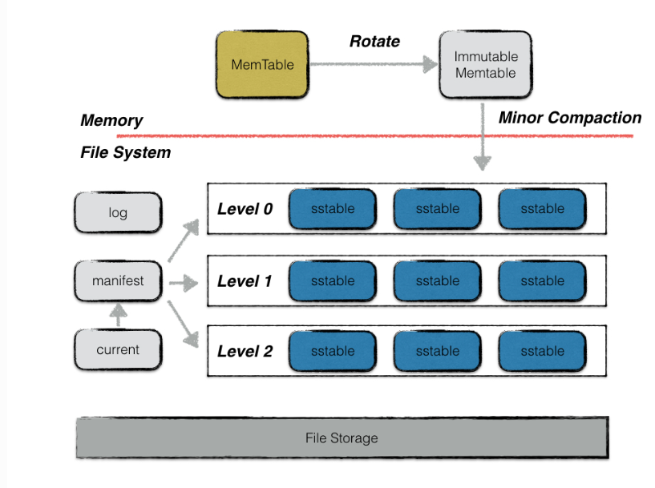
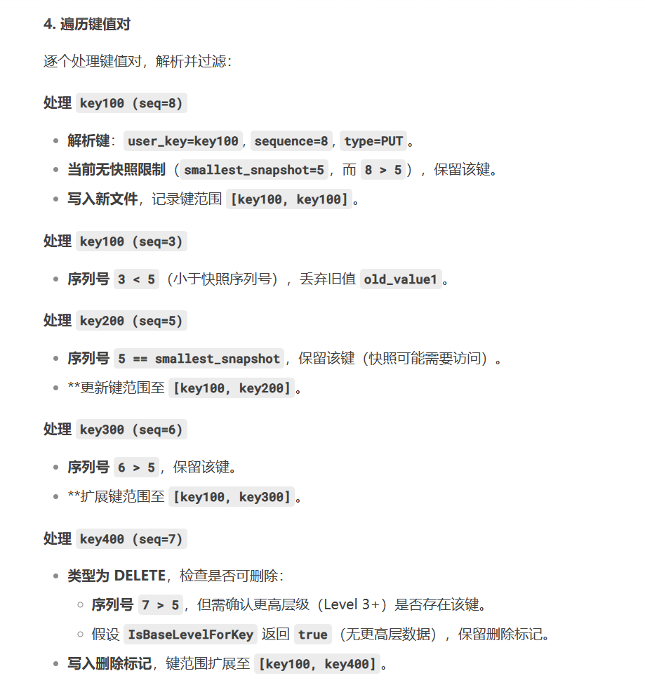

1. 本项目是对`Google`公司的`LevelDB`项目的学习
2. `LevelDB`是基于`LSM`树进行存储
3. `LevelDB`项目是对`Google`的`Bigtable`技术原理的体现,`LevelDB`是`Bigtable`的单机版
4. `LevelDB`是一个`C++`编写的高效键值嵌入式数据库,目前对亿级的数据有着非常好的读写性能
5. `LevelDB`的优点:
   * `key`和`value`采用字符串形式,且长度没有限制
   * 数据能持久化存储,同时也能将数据缓存到内存,实现快速读取
   * 基于`key`按序存放数据,并且`key`的排序比较函数可以根据用户需求进行定制
   * 支持简易的操作接口`API`,如`Put()、Get()、Delete()`,并支持批量写入
   * 可以针对数据创建数据内存快照
   * 支持前向、后向的迭代器
   * 采用`Google`的`Snappy`压缩算法对数据进行压缩,以减少存储空间
   * 基本不依赖其它第三方模块,可非常容易地移植到`Windows、Linux、UNIX、Android、iOS`
6. `LevelDB`的缺点:
   * 不是传统的关系数据库,不支持`SQL`(用于管理和操作关系型数据库的标准编程语言)查询与索引
   * 只支持单进程,不支持多进程
   * 不支持多种数据类型
   * 不支持客户端-服务器的访问模式.用户在应用时,需要自己进行网络服务的封装
   * 不支持分布式存储,无法直接扩展到多台机器,即为单机存储
7. `LevelDB`的两个衍生产品——`RocksDB`(`Facebook`)、`SSDB`     
8. `LevelDB`的核心操作:
   * 写操作
      - 写操作首先写入`Log`文件
      - 然后将数据插入到`MeeTable`中
      - 当`MemTable`达到一定大小时(默认为4MD),会转换为一个不可修改的`Immutable MemTable`,与此同时创建一个新的`memtable`,供用户继续进行读写操作.当一个`immutable memtable`被创建时,会触发后台线程将其写入磁盘,生成`SSTable`文件
   * 读操作
      - 首先在`MemTable`中查找数据
      - 如果未找到,则在`Immutable MemTable`中查找
      - 如果仍未找到,则在各级`SSTable`文件中查找(从`Level 0`开始逐级查找)   
9. <mark>`LevelDB`中磁盘数据读取与缓存均以块为单位,并且实际存储中所有的数据记录均以`key`进行顺序存储.根据排序结果,相邻的`key`所对应的数据记录一般均会存储在同一个块中.因此,在针对需要经常同时访问的数据时,其`key`在命名时,可以通过将这些`key`设置相同的前缀保证这些数据的`key`是相邻近的,从而使这些数据可存储在同一个块内</mark>  
10. `LevelDB`不属于`Redis`,它们是两个不同的数据库系统
    * `Redis`:主要将数据存储在内存中,虽然也有一些机制可以将数据持久化到磁盘,如`RDB`和 `AOF`,但其核心优势在于内存高速存取.例如,`Redis`的数据操作速度可以达到微秒级甚至更快,这是因为内存的访问速度远远高于磁盘
    * `LevelDB`:将数据存储在磁盘上,它使用一种名为日志结构合并树(`Log-Structured Merge-Tree`,`LSM`树)的数据结构来组织数据.`LSM`树通过将写操作写入内存的`MemTable`,并在后台将`MemTable`的数据按照一定规则刷写到磁盘上的`SSTable`文件中,来实现高效的写入性能.`LevelDB`的这种存储机制使得它在写入密集型的应用场景中表现出色  
11. 本项目的整体架构:
   
   本项目是一种基于`operation log`的文件系统,是`LSM`的典型代表,它把随机的磁盘写操作,变成了对`op log`的`append`操作,提高了`IO`效率,最新的数据存储在内存`MemTable`中,当`op log`文件超过限定值时,就定时做`check point`.`Leveldb`会生成新的`Log`文件和`Memtable`,后台调度会将`Immutable Memtable`的数据导出到磁盘,形成一个新的`SSTable`文件.`SSTable`就是由内存中的数据不断导出并进行`Compaction`操作后形成的,而且`SSTable`的所有文件是一种层级结构,第一层为`Level 0`,第二层为`Level 1`,依次类推,层级逐渐增高,这也是为何称之为`LevelDB`的原因
# Slice
1. `Slice`是`LevelDB`中的一种基本的、以字节为继承的数据存储单元,既可以存储`key`,也可以存储数据(`data`)
2. `Slice`是一种包含字节长度与指针的简单数据结构
3. 本项目为什么要使用`Slice`?
   一般来讲,`Slice`作为函数的返回值.相比于`C++`的`string`类型,如果在返回时采用`Slice`类型,则只需要返回长度与指针,而不需要复制长度较长的`key`和`value`.此外,`Slice`不以`'\0'`作为字符的终止符,可以存储值为`'\0'`的数据
# LSM树
1. `LSM`树是实现`LevelDB`的核心,其原理可以参考`"The log-structured merge-tree(LSM-tree)`论文
2. <mark>一般而言,在常规的物理硬盘存储介质上,顺序写比随机写速度要快,而`LSM`树正是充分利用了这一物理特性,从而实现对频繁、大量数据写操作的支持</mark>
3. </mark>`LSM`原理:下图中主要由常驻内存的`C0`树和保留在磁盘的`C1`树两个模块组成.虽然`C1`树保存在磁盘,但是会将`C1`树种一些需要频繁访问的数据保存在数据缓存中,从而保证高频访问数据的快速收敛.当需要插入一条新的数据记录时,首先在`Log`文件末尾顺序添加一条数据插入的记录,然后将这个新的数据添加到驻留在内存的`C0`树种,当`C0`树的数据大小达到某个阈值时,则会自动将数据迁移、保留在磁盘中的`C1`树,这就是`LSM`树的数据写的全过程.而对于数据读过程,`LSM`树将首先从`C0`树中进行索引查询,如果不存在,则转向`C1`中继续进行查询,直至找到最终的数据记录.对于`LevelDB`来说,`C0`树采用了`MemTable`数据结构实现,而`C1`树采用了`SSTable`</mark>
   
# 快照Snopshot
1. 快照是数据存储某一时刻的状态记录
2. `DB->GetSnapshot()`回创建一个快照,实际上就是生成一个当前最新的`SequeceNumber`对应的快照节点,然后插入快照双向链表中
# MANIFEST
1. `MANIFEST`文件记录了数据库的元数据(文件元信息保存在`SST`),包括:数据库的层级结构(`Level 0`到`Level N`);每个层级包含的 `SSTable`文件;每个`SSTable`文件的键范围(最小键和最大键);数据库的版本信息;日志文件的状态.`MANIFEST`文件是一个日志格式的文件
2. `MANIFEST`文件存储的其实是`versionEdit`信息,即版本信息变化的内容.一个`versionEdit`数据会被编码成一条记录,写入`MANIFEST`中.如下图就是一个`MANIFEST`文件的示意图,其中包含3条`versionEdit`记录,每条记录包括:(1)新增哪些`sst`文件;(2)删除哪些`sst`文件;(3)当前`compaction`的下标;(4)日志文件编号;(5)操作`seqNumber`等信息
   
3. <mark>`Manifest`文件不存储在`MemTable`或`SSTable`中,而是与日志文件、`SSTable`文件共同构成数据库的持久化存储体系(即存储在磁盘上)</mark>
# CURRENT
1. `CURRENT`文件是一个指向当前正在使用的`MANIFEST`文件的指针.`LevelDB`通过`CURRENT`文件快速找到最新的`MNIFEST`文件,从而加载数据库的元数据
# db.h
1. 接口函数的函数参数为什么要使用引用常量?
   一般而言,`C++`函数输入/输出参数均采用传值的方式.然而在传值过程中需要调用参数对象的复制构造函数来创建相应的副本,这样传值必然有一定开销,进而影响代码的执行效率.传入的是引用对象,因而不会创建新的对象,所以不会存在构造函数与析构函数的钓调用,因而执行效率大大提升.另外,通过`const`进行常量声明,保证了引用参数在函数执行过程中不会被调用者修改
2. `db.h`是`LevelDB`对外暴露的主要`API`,用户可以通过该头文件中定义的类和接口来操作`LevelDB`数据库.`db.h`是`LevelDB`的核心抽象层,它定义了数据库的行为和接口,而不涉及具体的实现细节(具体的实现细节在`dp_impl.c`中实现)
# db_impl.h/db_impl.c  
1. `db_impl`主要是封装一些供客户端应用进行调用的接口,即头文件中的相关`API`函数接口,主要有15个函数接口,其中4个接口用于测试用途    
2. 为什么在`DBImpl::RemoveObsoleteFiles()`中最后删除文件的操作前要先释放锁?
   一方面,因为文件删除操作(`env_->RemoveFile`)涉及磁盘`I/O`,通常比较耗时.如果在持有锁的情况下执行删除操作,其他线程可能会被阻塞,导致系统并发性能下降.另一方面,在`RemoveObsoleteFiles`函数中,删除操作的目标是磁盘上的文件,而不是内存中的共享数据结构,因此删除操作不会影响数据库的核心状态(如内存表、版本信息等),所以不需要在锁的保护下进行   
3. 在`LevelDB`中,`DBImpl::Recover()`是从磁盘上的持久化数据(主要是`Manifest`文件(`Recover()`通过读取`Manifest`文件,恢复数据库的层级结构和文件信息,见下图)和日志文件)中恢复数据库的状态,并将其恢复到内存(`MemTable、SST`)中,`Recover()`会调用`RecoverLogFile()`
        
   上图表示的是`Recover()`中的`version`信息的恢复
4. 真正的内存表(`MemTable`)中掉电后需要恢复的数据是依赖于日志文件恢复的(`RecoverLogFile()`).`LevelDB`在写入数据时,会先将数据写入日志文件,然后再写入内存中的`MemTable`.这种“先日志后内存”的写入顺序确保了即使在写入过程中发生掉电或异常退出,数据仍然可以通过日志文件恢复.`Recover()`全过程举例:
   
   
   
5. <mark>`Recover()`表示了两种恢复过程:`version`信息恢复和掉电后`MemTable`数据的恢复过程(`RecoverLogFile()`)</mark>
   
6. `DBImpl::Recover(VersionEdit* edit, bool* save_manifest)`中的`expected`存储的是什么?
   `versions_->AddLiveFiles(&expected)`会从`VersionSet`(版本集合)中提取当前所有活跃的`SSTable`文件的编号,并将这些编号插入到`expected`集合中.`VersionSet`是`LevelDB`管理版本的核心组件,记录了所有有效的`SSTable`文件及其层级信息."存活的"(`Live`)文件是指尚未被删除或合并(`Compaction`)的`SSTable`文件,它们属于当前数据库的最新快照.在恢复过程中,`LevelDB`会遍历数据库目录下的所有文件,并检查`expected`集合中的每个文件编号是否都有对应的物理文件(磁盘上的文件)存在,如:
   
   上图`expected`其实就是验证此时恢复后最新`version`信息中所表示的`SST`应该存储的文件(即在掉电前磁盘存活的文件(掉电前存活的文件被记录到了`version`中))是否真的存在磁盘中,存在的话是对的,不存在的话就会触发数据毁坏的错误
7. <mark>`Recover()`依赖`Manifest`恢复数据库的持久化数据,而`RecoverLogFile()`通过日志恢复内存中的临时数据</mark>
8. <mark>`RecoverLogFile()`函数的作用是从日志文件(`WAL`,`Write-Ahead Log`)中恢复数据,并将这些数据恢复到内存表(`MemTable`)中,最终可能写入到`SST`文件中</mark>.如:
   
9.  `RecoverLogFile()`中的日志复用:日志文件复用是一种优化机制,目的是减少日志文件的数量,避免频繁创建和删除日志文件,从而提高性能并减少文件系统的碎片化.日志文件复用的核心思想是:如果某个日志文件在恢复过程中没有被完全消耗(即其中的数据没有完全写入到`SST`文件中),并且满足特定条件,那么可以继续在该日志文件上追加新的日志记录,而不是创建新的日志文件.如:
   
10. <span style="color:red;">`version`数据恢复的过程就是依次应用`VersionEdit`的过程(`VersionEdit`表示一个`Version`到另一个`Version`的变更,为了避免进程崩溃或者机器宕机导致数据丢失,`LevelDB`把各个`VersionEdit`都持久化到磁盘,形成`MANIFEST`文件),其恢复的详细过程(`DBImpl::Recover()->VersionSet::Recover()`)如下:</span>
    
    
    需要注意的是,宕机后开始恢复时的`version`是空的,即它是从空的`version`按照`Manifest`中的一条条`VersionEdit`恢复到最新的`version`的
11. `WriteLevel0Table()`举例:
    
    
    
12. `CompactMemTable()`举例:
    
13. `CompactMemTable()`不是和`WriteLevel0Table()`作用一样吗,那么为什么要用`CompactMemTable()`?
    尽管`WriteLevel0Table()`负责将数据写入`SST`文件,但`CompactMemTable()`提供了更高层次的管理和协调功能,确保数据库的整体一致性和效率:1.`CompactMemTable()`确保在写入`SST`文件后,版本信息得到正确更新(包括设置前一个日志文件编号和当前日志文件编号),这对于数据库的恢复和一致性至关重要;2.通过替换旧的`MemTable`并清理过时文件,`CompactMemTable()`帮助管理数据库的资源,避免内存泄漏和磁盘空间浪费;3.`CompactMemTable()`作为协调者,确保在写入`SST`文件、更新版本信息、替换 `MemTable`和清理过时文件等步骤之间正确地进行协调
14. `CompactRange()`(这是`Manual Compaction`)是将指定范围`[begin, end)`内的数据从多个层级(如`level 0`到`max_level_with_files`)进行合并,如:
      
      
      
      调用`TEST_CompactRange(0, "C", "G")`时,`Level-0`中的文件`File0`和`Level-2`中的文件`File2`不会直接合并`Level-0`的文件会先与`Level-1`的文件合并,生成的新文件可能会进一步触发到`Level-2`的紧凑化,但不会直接从`Level-0`跳到`Level-2`
15. 需要注意的是:`TEST_CompactRange()`表示对指定`level`中范围`[begin, end)`的数据进行紧凑化,如果`Level-i`或其他层级中的文件与指定范围`[begin, end)`有重叠,这些文件中的整个数据范围都会被合并到一个新的文件中,而不仅仅是重叠的部分.如:
    
    最终生成的新文件的范围是`[A, F)`,而不是`[C, F)`
16. `TEST_CompactRange()`的行为取决于指定的层级`level`和范围`[begin, end)`,紧凑化操作会根据以下规则:
    
    
    
17. <mark>`LevelDB`的紧凑化机制:`LevelDB`的数据存储采用多层结构,紧凑化分为两类:</mark>
    * `Minor Compaction`:将内存中的`MemTable`持久化为`SSTable`文件到`Level 0`(参数`write_buffer_size`控制`MemTable`大小,`max_write_buffer_number`控制内存中最多保留的`Immutable MemTable`数量),`Level 0`的`SSTable`文件允许键范围重叠(但是单个文件的键是有序的),因此查询`Level 0`需检查所有文件,这是`LevelDB`写入快但读取相对慢的原因之一
    * `Major Compaction'`:(跨层合并)这是对磁盘上的`SSTable`文件进行合并的过程,主要目的是减少文件数量、清理冗余数据,并提升查询效率.可以分为`size Compaction`、`seek Compaction`和`manual Compaction`:
      - `size Compaction`:当某一层(如`Level L`)的数据总量超过预设阈值时,触发跨层合并,如:
         * `Level 0`的文件数量超过配置阈值(默认4个),此时的`compaction_score_`会大于等于1,则触发一次`Compaction`,并与`Level 1`中键范围重叠的`SST`文件合并,生成新的`SST`文件并写入`Level 1`,同时删除旧文件
         * `Level L(L≥1)`的数据大小超过其目标容量(如`Level 1`为10MB,`Level 2`为100MB等) 
      - `seek Compaction`:当某个`SSTable`文件因频繁查询未命中(可能包含大量已删除或过期数据)时触发.每个`SSTable`有一个`allowed_seeks`计数器,初始值为文件大小`/16KB`,每次未命中查询会减少该值,归零时触发合并(`allowed_seeks`是每个文件允许的最大无效读取次数),将被标记的`SST`文件与下  一层重叠的文件合并,清理上一层的无效数据
      - `Manual Compaction`:手动紧凑化,`LevelDB`确实支持通过`CompactRange()`方法手动触发紧凑化,合并不同层级的`SSTable`以减少冗余数据,并提升查询效率
18. 执行`Compaction`操作的真正入口方法是`BackgroundCompaction`:首先判断是否需要将一个`MemTable`文件生成为`SST`(`Minor Compaction`),如果不需要则判断是否`is_manual`,即是否为手动紧凑化操作,如果是就调用`CompactRange()`;否则依次通过`PickCompaction()`方法选取本次`Compaction()`操作需要参与的文件,接着调用`DoCompactionWork()`执行`Compaction`流程,最后调用`RemoveObsoleteFiles()`删除无用的文件
19. <mark>`BackgroundCompaction()`中的`Trivial Move`优化:它不是独立的紧凑化类型.触发`Trivial Move`的条件:当前层仅有一个文件&&下一层无需合并文件(即当前层文件与下一层无键范围重叠,可直接移动文件而无需合并)&&祖父层重叠文件总大小不超过阈值(防止移动文件到`Level L+1`后,未来触发`Level L+1`到`L+2`的`Compaction`时,因与`L+2`层文件大量重叠而导致合并开销剧增(即避免未来高成本的写放大)).`IsTrivialMove()`是`LevelDB`优化`Compaction`性能的关键机制,通过直接移动文件减少合并开销</mark>
20. `LevelDB`中的`level`代表层级,有0-6共7个层级,每个层级都由一定数量的`SSTable`文件组成.其中,高层级文件是由低层级的一个文件与高层级中与该文件有键重叠的所有文件使用归并排序算法生成,该过程称为`Compaction`.`LevelDB`通过`Compaction`将冷数据逐层下移,并且在`Compaction`过程中重复写入的键只会保留一个最终值,已经删除的键不再写入,因此可以减少磁盘空间占用.由于`Compaction`涉及大量的磁盘`I/O`操作,比较耗时,因此需要通过后台的一个独立线程执行该过程
21. `Level`SST`文件是由`Compaction`生成的
22. `Level 0`的单个文件中的键是有序的,但在`Level 0`中的所有文件可能会出现键 0`的`SSTable`文件是直接由内存数据刷盘生成的,其它高层级`Level L(L>=1)`的重叠的情况和所有文件的键是无序的情况.而从`Level 1`到`Level 6`,不只单个文件中的键是有序的,每个层级中的所有文件也不会有键重叠,`Level 1`到`Level 6`的所有文件键范围没有重叠
23. 每次执行`Compaction`操作之后会生成一个新的版本信息,`VersionEdit`是一个版本的中间状态,会保存一次`Compaction`操作后增加的删除文件信息以及其它一些元数据
24. `LevelDB`中每个`SST`文件都是用一个`FileMetaData`结构来表示的
   ```C++
   struct FileMetaData {
      FileMetaData() : refs(0), allowed_seeks(1 << 30), file_size(0) {}

      int refs;
      int allowed_seeks;  // Seeks allowed until compaction
      uint64_t number;
      uint64_t file_size;    // File size in bytes
      InternalKey smallest;  // Smallest internal key served by table
      InternalKey largest;   // Largest internal key served by table
   };
   ```
25. `LevelDB`中的`Compaction`操作实际是一个递归调用的过程,因为每次对`Level n`层的`Compaction`操作都会相应改编`Level n+1`层的文件大小,从而再次触发下一次`Compaction`操作
26. `Status s = env_->NewWritableFile(fname, &compact->outfile);`:创建可写文件句柄(用于管理`SST`文件的写入过程) ,`compact->outfile`持有该文件的写句柄(文件句柄是程序与文件系统交互时用来操作文件的抽象标识符,可以理解为操作系统提供给程序的一个"遥控器",通过这个"遥控器"可以控制文件(读取、写入、关闭等),而无需直接操作底层的磁盘或文件系统细节)
27. `DoCompactionWork()`大致的执行步骤:
    
28. `DoCompactionWork()`例子:
    
    
    
    
29. `DoCompactionWork()`中的`if(compact->compaction->ShouldStopBefore(key) && compact->builder!=nullptr)`是检查若将当前`key`加入输出文件后,该输出文件与祖父层(`Level+2`)的重叠文件大小是否超过阈值,即是否有写放大,若超过了就要停止当前文件.如:
    
30. `DoCompactionWork()`中的`drop`变量表示当前键是否丢弃,两种情况会丢弃:
    * 重复键:此时通过判断序列号即可,因为新键的序列号更大
    * 有删除标记且无更高层数据需要保留:删除标记&&更高层级没有该键
31. `DoCompactionWork()`处理键值对数据的主循环`while()`后为什么还要用`if (status.ok() && compact->builder != nullptr) status = FinishCompactionOutputFile(compact, input);`?
    因为主循环可能是由于输入迭代器没有数据了(数据都写入到输出文件中了,但可能还没构建`SST`完成)或数据库关闭而退出,此时需要将输出文件构建成`SST`,即还要在最后调用一次`FinishCompactionOutputFile()`(`LevelDB`的`TableBuilder`会先将键值对写入内存缓冲区,待缓冲区填满或显式调用`Finish()`时才将数据刷盘).如:
    
32. `NewInternalIterator()`会创建一个内部迭代器,用于合并内存表(`MemTable`)、不可变内存表(`Immutable MemTable`)和磁盘`SSTable`文件中的数据.如:
    
    
33. `Get()`用于从`LevelDB`中获取对应的键-值对数据,注意读取的时候是用的`LookupKey`(由`key`和对应的`SequenceNumber`构成),该函数的流程如下:
    
34. 已经有`NewInternalIterator()`了,为什么还要`NewIterator()`?
    `NewInternalIterator()`是一个内部函数,用于创建一个内部迭代器(`internal_iter`),该迭代器可以遍历数据库中的所有数据,包括内存表(`MemTable`)、不可变内存表(`Immutable MemTable`)和磁盘上的`SSTable`文件;`NewIterator()`是一个对外提供的函数,用于创建一个用户级别的迭代器(`DBIterator`),该迭代器封装了内部迭代器(`InternalIterator`),并提供了用户友好的接口
35. `Write()`中的队列`writers_`,该队列对象中的元素节点为`Writer`对象指针.`writers_`与写操作的缓存空间有关,批量操作请求均存储在这个队列中,按顺序执行,已完成的出队,而未执行的则在这个队列中处于等待状态,其结构如下:
    
36. `Write()`执行流程:
    
    
    
37. `GetProperty()`通过输出参数`value`返回所获取数据库的特定属性,如:
    
    
    
    
# SequenceNumber
1. `SequenceNumber`是一个64位整数,其中最高8位没有使用,实际只使用了56位,即7个字节,最后一个字节用于存储该数据的值类型:
   
2. `SequenceNumber`的主要作用是对数据库的整个存储空间进行时间刻度上的序列备份,即要从数据库中获取某一个数据,不仅需要其对应的键`key`,还需要其对应的`SequenceNumber`(`Lookupkey=key+SequenceNumber`)
# version_set/version_edit
1. `LevelDB`用`Version`表示一个版本的元信息,主要是每个`Level`的`.ldb`文件.除此之外,`Version`还记录了触发`Compaction` 相关的状态信息,这些状态信息会在响应读写请求或者`Compaction`的过程中被更新.`VersionEdit`表示一个`Version`到另一个 `Version`的变更,为了避免进程崩溃或者机器宕机导致数据丢失,`LevelDB`把各个`VersionEdit`都持久化到磁盘,形成`MANIFEST`文件.数据恢复的过程就是依次应用`VersionEdit`的过程.`VersionSet`表示`LevelDB`历史`Version`信息,所有的`Version`都按照双向链表的形式链接起来.`VersionSet`和`Version`的大体布局如下：
   
2. `VersionEdit`结构编解码在`manifest`文件的生成和读取中使用
# Env.v
1. `env_`为不同平台、不同操作系统提供了一个统一的上层抽象环境接口封装,下层具体的实现可能随着操作系统的不同而不同,但是上层都是一样的抽象环境接口`env_`