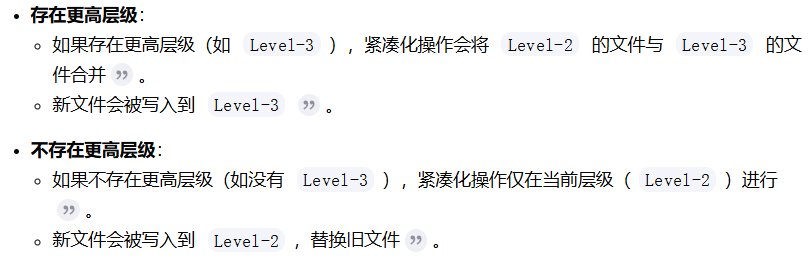
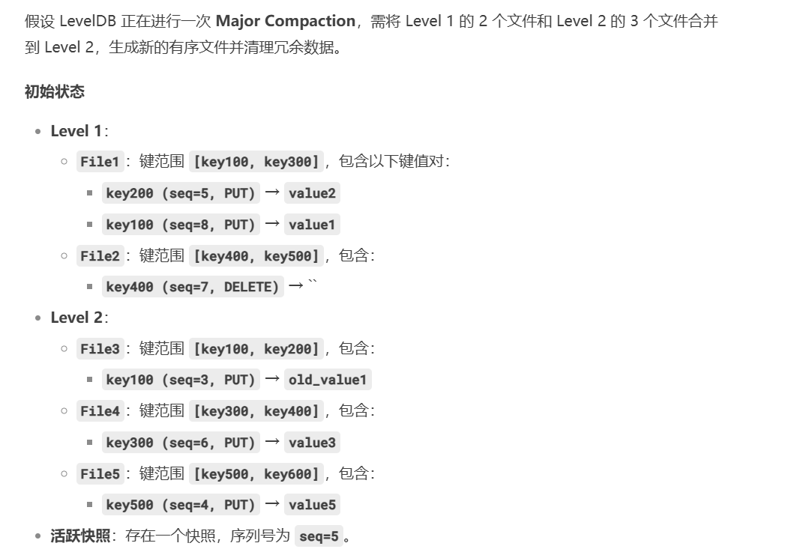
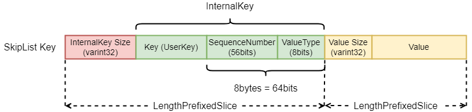
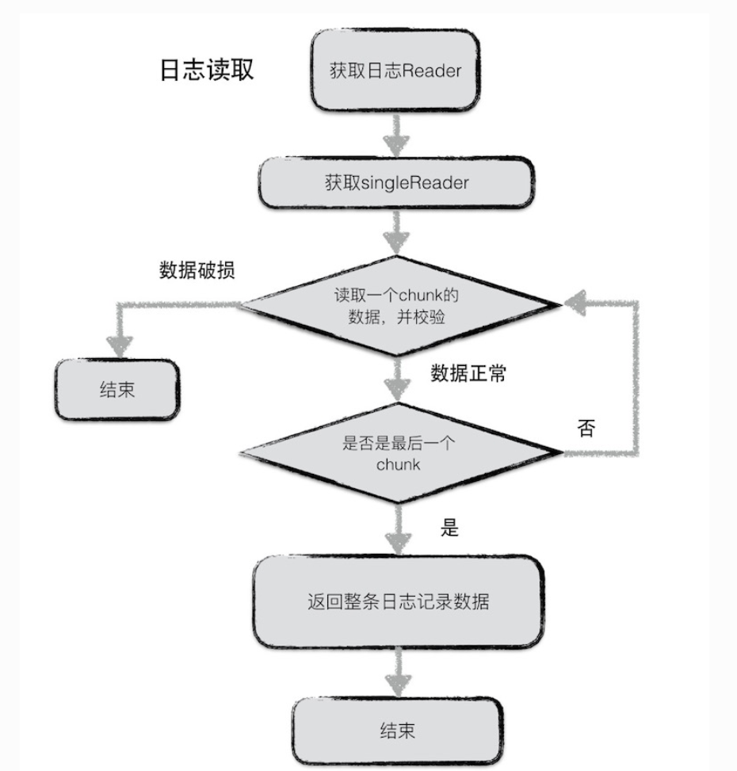
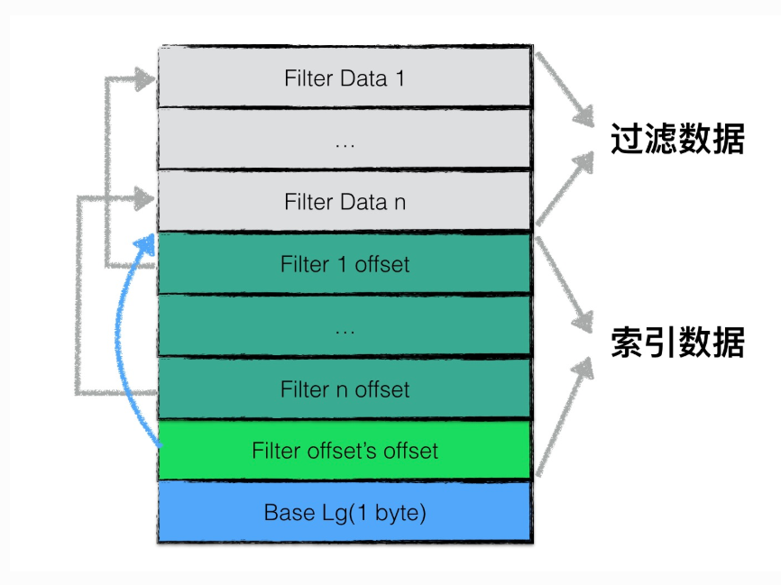

1. 本项目是对`Google`公司的`LevelDB`项目的学习
2. `LevelDB`是基于`LSM`树进行存储
3. `LevelDB`可以看作是存储在磁盘的`NoSQL`数据库
4. `LevelDB`项目是对`Google`的`Bigtable`技术原理的体现,`LevelDB`是`Bigtable`的单机版
5. `LevelDB`是一个`C++`编写的高效键值嵌入式数据库,目前对亿级的数据有着非常好的读写性能
6. `LevelDB`的优点:
   * `key`和`value`采用字符串形式,且长度没有限制
   * 数据能持久化存储,同时也能将数据缓存到内存,实现快速读取
   * 基于`key`按序存放数据,并且`key`的排序比较函数可以根据用户需求进行定制
   * 支持简易的操作接口`API`,如`Put()、Get()、Delete()`,并支持批量写入
   * 可以针对数据创建数据内存快照
   * 支持前向、后向的迭代器
   * 采用`Google`的`Snappy`压缩算法对数据进行压缩,以减少存储空间
   * 基本不依赖其它第三方模块,可非常容易地移植到`Windows、Linux、UNIX、Android、iOS`
7. `LevelDB`的缺点:
   * 不是传统的关系数据库,不支持`SQL`(用于管理和操作关系型数据库的标准编程语言)查询与索引
   * 只支持单进程,不支持多进程
   * 不支持多种数据类型
   * 不支持客户端-服务器的访问模式.用户在应用时,需要自己进行网络服务的封装
   * 不支持分布式存储,无法直接扩展到多台机器,即为单机存储
8. `LevelDB`的两个衍生产品——`RocksDB`(`Facebook`)、`SSDB`     
8. `LevelDB`的核心操作:
   * 写操作
      - 写操作首先写入`Log`文件
      - 然后将数据插入到`MemTable`中
      - 当`MemTable`达到一定大小时(默认为4MB),会转换为一个不可修改的`Immutable MemTable`,与此同时创建一个新的`memtable`,供用户继续进行读写操作.当一个`immutable memtable`被创建时,会触发后台线程将其写入磁盘,生成`SSTable`文件
   * 读操作
      - 首先在`MemTable`中查找数据
      - 如果未找到,则在`Immutable MemTable`中查找
      - 如果仍未找到,则在各级`SSTable`文件中查找(从`Level 0`开始逐级查找)   
9. <mark>`LevelDB`中磁盘数据读取与缓存均以块为单位,并且实际存储中所有的数据记录均以`key`进行顺序存储.根据排序结果,相邻的`key`所对应的数据记录一般均会存储在同一个块中.因此,在针对需要经常同时访问的数据时,其`key`在命名时,可以通过将这些`key`设置相同的前缀保证这些数据的`key`是相邻近的,从而使这些数据可存储在同一个块内</mark>  
10. `LevelDB`不属于`Redis`,它们是两个不同的数据库系统
    * `Redis`:主要将数据存储在内存中,虽然也有一些机制可以将数据持久化到磁盘,如`RDB`和 `AOF`,但其核心优势在于内存高速存取.例如,`Redis`的数据操作速度可以达到微秒级甚至更快,这是因为内存的访问速度远远高于磁盘
    * `LevelDB`:将数据存储在磁盘上,它使用一种名为日志结构合并树(`Log-Structured Merge-Tree`,`LSM`树)的数据结构来组织数据.`LSM`树通过将写操作写入内存的`MemTable`,并在后台将`MemTable`的数据按照一定规则刷写到磁盘上的`SSTable`文件中,来实现高效的写入性能.`LevelDB`的这种存储机制使得它在写入密集型的应用场景中表现出色  
11. 本项目的整体架构:
   
   本项目是一种基于`operation log`的文件系统,是`LSM`的典型代表,它把随机的磁盘写操作,变成了对`op log`的`append`操作,提高了`IO`效率,最新的数据存储在内存`MemTable`中,当`op log`文件超过限定值时,就定时做`check point`.`Leveldb`会生成新的`Log`文件和`Memtable`,后台调度会将`Immutable Memtable`的数据导出到磁盘,形成一个新的`SSTable`文件.`SSTable`就是由内存中的数据不断导出并进行`Compaction`操作后形成的,而且`SSTable`的所有文件是一种层级结构,第一层为`Level 0`,第二层为`Level 1`,依次类推,层级逐渐增高,这也是为何称之为`LevelDB`的原因
# Slice
1. `Slice`是`LevelDB`中的一种基本的、以字节为继承的数据存储单元,既可以存储`key`,也可以存储数据(`data`)
2. `Slice`是一种包含字节长度与指针的简单数据结构
3. 本项目为什么要使用`Slice`?
   一般来讲,`Slice`作为函数的返回值.相比于`C++`的`string`类型,如果在返回时采用`Slice`类型,则只需要返回长度与指针,而不需要复制长度较长的`key`和`value`.此外,`Slice`不以`'\0'`作为字符的终止符,可以存储值为`'\0'`的数据
# LSM树
1. `LSM`树是实现`LevelDB`的核心,其原理可以参考`"The log-structured merge-tree(LSM-tree)`论文
2. <mark>一般而言,在常规的物理硬盘存储介质上,顺序写比随机写速度要快,而`LSM`树正是充分利用了这一物理特性,从而实现对频繁、大量数据写操作的支持</mark>
3. <mark>`LSM`原理:下图中主要由常驻内存的`C0`树和保留在磁盘的`C1`树两个模块组成.虽然`C1`树保存在磁盘,但是会将`C1`树中一些需要频繁访问的数据保存在数据缓存中,从而保证高频访问数据的快速收敛.当需要插入一条新的数据记录时,首先在`Log`文件末尾顺序添加一条数据插入的记录,然后将这个新的数据添加到驻留在内存的`C0`树中,当`C0`树的数据大小达到某个阈值时,则会自动将数据迁移、保留在磁盘中的`C1`树,这就是`LSM`树的数据写的全过程.而对于数据读过程,`LSM`树将首先从`C0`树中进行索引查询,如果不存在,则转向`C1`中继续进行查询,直至找到最终的数据记录.对于`LevelDB`来说,`C0`树采用了`MemTable`数据结构实现,而`C1`树采用了`SSTable`</mark>
   
4. `LSM`树是怎么保证顺序写的?
    * `Memtable`：LSM树首先将数据写入内存中的Memtable。Memtable是一个有序的数据结构（跳表），它按照键的顺序存储数据
    * `SSTable`：当Memtable达到一定大小时，它会被顺序刷写到磁盘，形成一个SSTable文件
# 快照Snopshot
1. 快照是数据存储某一时刻的状态记录
2. `DB->GetSnapshot()`会创建一个快照,实际上就是生成一个当前最新的`SequeceNumber`对应的快照节点,然后插入快照双向链表中
# MANIFEST
1. `MANIFEST`文件记录了数据库的元数据(文件元信息保存在`SST`),包括:数据库的层级结构(`Level 0`到`Level N`);每个层级包含的 `SSTable`文件;每个`SSTable`文件的键范围(最小键和最大键);数据库的版本信息;日志文件的状态.`MANIFEST`文件是一个日志格式的文件
2. `MANIFEST`文件存储的其实是`versionEdit`信息,即版本信息变化的内容.一个`versionEdit`数据会被编码成一条记录,写入`MANIFEST`中.如下图就是一个`MANIFEST`文件的示意图,其中包含3条`versionEdit`记录,每条记录包括:(1)新增哪些`sst`文件;(2)删除哪些`sst`文件;(3)当前`compaction`的下标;(4)日志文件编号;(5)操作`seqNumber`等信息
   
3. <mark>`Manifest`文件不存储在`MemTable`或`SSTable`中,而是与日志文件、`SSTable`文件共同构成数据库的持久化存储体系(即存储在磁盘上)</mark>
4. `Manifest`文件示意图:
   
# CURRENT
1. `CURRENT`文件是一个指向当前正在使用的`MANIFEST`文件的指针.`LevelDB`通过`CURRENT`文件快速找到最新的`MNIFEST`文件,从而加载数据库的元数据
# db.h
1. 接口函数的函数参数为什么要使用引用常量?
   一般而言,`C++`函数输入/输出参数均采用传值的方式.然而在传值过程中需要调用参数对象的复制构造函数来创建相应的副本,这样传值必然有一定开销,进而影响代码的执行效率.传入的是引用对象,因而不会创建新的对象,所以不会存在构造函数与析构函数的调用,因而执行效率大大提升.另外,通过`const`进行常量声明,保证了引用参数在函数执行过程中不会被调用者修改
2. `db.h`是`LevelDB`对外暴露的主要`API`,用户可以通过该头文件中定义的类和接口来操作`LevelDB`数据库.`db.h`是`LevelDB`的核心抽象层,它定义了数据库的行为和接口,而不涉及具体的实现细节(具体的实现细节在`dp_impl.c`中实现)
# db_impl.h/db_impl.c  
1. `db_impl`主要是封装一些供客户端应用进行调用的接口,即头文件中的相关`API`函数接口,主要有15个函数接口,其中4个接口用于测试用途    
2. 为什么在`DBImpl::RemoveObsoleteFiles()`中最后删除文件的操作前要先释放锁?
   一方面,因为文件删除操作(`env_->RemoveFile`)涉及磁盘`I/O`,通常比较耗时.如果在持有锁的情况下执行删除操作,其他线程可能会被阻塞,导致系统并发性能下降.另一方面,在`RemoveObsoleteFiles`函数中,删除操作的目标是磁盘上的文件,而不是内存中的共享数据结构,因此删除操作不会影响数据库的核心状态(如内存表、版本信息等),所以不需要在锁的保护下进行   
3. 在`LevelDB`中,`DBImpl::Recover()`是从磁盘上的持久化数据(主要是`Manifest`文件(`Recover()`通过读取`Manifest`文件,恢复数据库的层级结构和文件信息,见下图)和日志文件)中恢复数据库的状态,并将其恢复到内存(`MemTable、SST`)中,`Recover()`会调用`RecoverLogFile()`
        
   上图表示的是`Recover()`中的`version`信息的恢复
4. 真正的内存表(`MemTable`)中掉电后需要恢复的数据是依赖于日志文件恢复的(`RecoverLogFile()`).`LevelDB`在写入数据时,会先将数据写入日志文件,然后再写入内存中的`MemTable`.这种“先日志后内存”的写入顺序确保了即使在写入过程中发生掉电或异常退出,数据仍然可以通过日志文件恢复.`Recover()`全过程举例:
   
   
   
5. <mark>`Recover()`表示了两种恢复过程:`version`信息恢复和掉电后`MemTable`数据的恢复过程(`RecoverLogFile()`)</mark>
   
6. `DBImpl::Recover(VersionEdit* edit, bool* save_manifest)`中的`expected`存储的是什么?
   `versions_->AddLiveFiles(&expected)`会从`VersionSet`(版本集合)中提取当前所有活跃的`SSTable`文件的编号,并将这些编号插入到`expected`集合中.`VersionSet`是`LevelDB`管理版本的核心组件,记录了所有有效的`SSTable`文件及其层级信息."存活的"(`Live`)文件是指尚未被删除或合并(`Compaction`)的`SSTable`文件,它们属于当前数据库的最新快照.在恢复过程中,`LevelDB`会遍历数据库目录下的所有文件,并检查`expected`集合中的每个文件编号是否都有对应的物理文件(磁盘上的文件)存在,如:
   
   上图`expected`其实就是验证此时恢复后最新`version`信息中所表示的`SST`应该存储的文件(即在掉电前磁盘存活的文件(掉电前存活的文件被记录到了`version`中))是否真的存在磁盘中,存在的话是对的,不存在的话就会触发数据毁坏的错误
7. <mark>`Recover()`依赖`Manifest`恢复数据库的持久化数据,而`RecoverLogFile()`通过日志恢复内存中的临时数据</mark>
8. <mark>`RecoverLogFile()`函数的作用是从日志文件(`WAL`,`Write-Ahead Log`)中恢复数据,并将这些数据恢复到内存表(`MemTable`)中,最终可能写入到`SST`文件中</mark>.如:
   
9.  `RecoverLogFile()`中的日志复用:日志文件复用是一种优化机制,目的是减少日志文件的数量,避免频繁创建和删除日志文件,从而提高性能并减少文件系统的碎片化.日志文件复用的核心思想是:如果某个日志文件在恢复过程中没有被完全消耗(即其中的数据没有完全写入到`SST`文件中),并且满足特定条件,那么可以继续在该日志文件上追加新的日志记录,而不是创建新的日志文件.如:
   
10. <span style="color:red;">`version`数据恢复的过程就是依次应用`VersionEdit`的过程(`VersionEdit`表示一个`Version`到另一个`Version`的变更,为了避免进程崩溃或者机器宕机导致数据丢失,`LevelDB`把各个`VersionEdit`都持久化到磁盘,形成`MANIFEST`文件),其恢复的详细过程(`DBImpl::Recover()->VersionSet::Recover()`)如下:</span>
    
    
    需要注意的是,宕机后开始恢复时的`version`是空的,即它是从空的`version`按照`Manifest`中的一条条`VersionEdit`恢复到最新的`version`的
11. `WriteLevel0Table()`举例:
    
    
    
12. `CompactMemTable()`举例:
    
13. `CompactMemTable()`不是和`WriteLevel0Table()`作用一样吗,那么为什么要用`CompactMemTable()`?
    尽管`WriteLevel0Table()`负责将数据写入`SST`文件,但`CompactMemTable()`提供了更高层次的管理和协调功能,确保数据库的整体一致性和效率:1.`CompactMemTable()`确保在写入`SST`文件后,版本信息得到正确更新(包括设置前一个日志文件编号和当前日志文件编号),这对于数据库的恢复和一致性至关重要;2.通过替换旧的`MemTable`并清理过时文件,`CompactMemTable()`帮助管理数据库的资源,避免内存泄漏和磁盘空间浪费;3.`CompactMemTable()`作为协调者,确保在写入`SST`文件、更新版本信息、替换 `MemTable`和清理过时文件等步骤之间正确地进行协调
14. `CompactRange()`(这是`Manual Compaction`)是将指定范围`[begin, end)`内的数据从多个层级(如`level 0`到`max_level_with_files`)进行合并,如:
      
      
      
      调用`TEST_CompactRange(0, "C", "G")`时,`Level-0`中的文件`File0`和`Level-2`中的文件`File2`不会直接合并`Level-0`的文件会先与`Level-1`的文件合并,生成的新文件可能会进一步触发到`Level-2`的紧凑化,但不会直接从`Level-0`跳到`Level-2`
15. 需要注意的是:`TEST_CompactRange()`表示对指定`level`中范围`[begin, end)`的数据进行紧凑化,如果`Level-i`或其他层级中的文件与指定范围`[begin, end)`有重叠,这些文件中的整个数据范围都会被合并到一个新的文件中,而不仅仅是重叠的部分.如:
    
    最终生成的新文件的范围是`[A, F)`,而不是`[C, F)`
16. `TEST_CompactRange()`的行为取决于指定的层级`level`和范围`[begin, end)`,紧凑化操作会根据以下规则:
    
    
    
17. <mark>`LevelDB`的紧凑化机制:`LevelDB`的数据存储采用多层结构,紧凑化分为两类:</mark>
    * `Minor Compaction`:将内存中的`MemTable`持久化为`SSTable`文件到`Level 0`(参数`write_buffer_size`控制`MemTable`大小,`max_write_buffer_number`控制内存中最多保留的`Immutable MemTable`数量),`Level 0`的`SSTable`文件允许键范围重叠(但是单个文件的键是有序的),因此查询`Level 0`需检查所有文件,这是`LevelDB`写入快但读取相对慢的原因之一
    * `Major Compaction`:(跨层合并)这是对磁盘上的`SSTable`文件进行合并的过程,主要目的是减少文件数量、清理冗余数据,并提升查询效率.可以分为`size Compaction`、`seek Compaction`和`manual Compaction`:
      - `size Compaction`:当某一层(如`Level L`)的数据总量超过预设阈值时,触发跨层合并,如:
         * `Level 0`的文件数量超过配置阈值(默认4个),此时的`compaction_score_`会大于等于1,则触发一次`Compaction`,并与`Level 1`中键范围重叠的`SST`文件合并,生成新的`SST`文件并写入`Level 1`,同时删除旧文件
         * `Level L(L≥1)`的数据大小超过其目标容量(如`Level 1`为10MB,`Level 2`为100MB等) 
      - `seek Compaction`:当某个`SSTable`文件因频繁查询未命中(可能包含大量已删除或过期数据)时触发.每个`SSTable`有一个`allowed_seeks`计数器,初始值为文件大小`/16KB`,每次未命中查询会减少该值,归零时触发合并(`allowed_seeks`是每个文件允许的最大无效读取次数),将被标记的`SST`文件与下一层重叠的文件合并,清理上一层的无效数据
       
      - `Manual Compaction`:手动紧凑化,`LevelDB`确实支持通过`CompactRange()`方法手动触发紧凑化,合并不同层级的`SSTable`以减少冗余数据,并提升查询效率
18. 执行`Compaction`操作的真正入口方法是`BackgroundCompaction`:首先判断是否需要将一个`MemTable`文件生成为`SST`(`Minor Compaction`),如果不需要则判断是否`is_manual`,即是否为手动紧凑化操作,如果是就调用`CompactRange()`;否则依次通过`PickCompaction()`方法选取本次`Compaction()`操作需要参与的文件,接着调用`DoCompactionWork()`执行`Compaction`流程,最后调用`RemoveObsoleteFiles()`删除无用的文件
19. 真正的删除操作在`DoCompactionWork()`过程
20. <mark>`BackgroundCompaction()`中的`Trivial Move`优化:它不是独立的紧凑化类型.触发`Trivial Move`的条件:当前层仅有一个文件&&下一层无需合并文件(即当前层文件与下一层无键范围重叠,可直接移动文件而无需合并)&&祖父层重叠文件总大小不超过阈值(防止移动文件到`Level L+1`后,未来触发`Level L+1`到`L+2`的`Compaction`时,因与`L+2`层文件大量重叠而导致合并开销剧增(即避免未来高成本的写放大)).`IsTrivialMove()`是`LevelDB`优化`Compaction`性能的关键机制,通过直接移动文件减少合并开销</mark>(`Trival Move`:当前层仅有一个文件&&当前层和下一层无重叠键&&将当前层的键和下一层合并后再与祖父层相比,其重叠键的总大小不超过阈值,那么可以直接将当前层的文件移动到下一层文件,并删除当前层文件,即发生`Trival Move`)
21. `LevelDB`中的`level`代表层级,有0-6共7个层级,每个层级都由一定数量的`SSTable`文件组成.其中,高层级文件是由低层级的一个文件与高层级中与该文件有键重叠的所有文件使用归并排序算法生成,该过程称为`Compaction`.`LevelDB`通过`Compaction`将冷数据逐层下移,并且在`Compaction`过程中重复写入的键只会保留一个最终值,已经删除的键不再写入,因此可以减少磁盘空间占用.由于`Compaction`涉及大量的磁盘`I/O`操作,比较耗时,因此需要通过后台的一个独立线程执行该过程
22. `LevelDB`的`SST`文件是由`Compaction`生成的
23. `Compation`过程会进行归并排序,是为了使紧凑化后的SST仍然是有序的
24. `Level 0`的单个文件中的键是有序的,但在`Level 0`中的所有文件可能会出现键重叠,`Level 0`的`SSTable`文件是直接由内存数据刷盘生成的.而从`Level 1`到`Level 6`,不只单个文件中的键是有序的,每个层级中的所有文件也不会有键重叠,`Level 1`到`Level 6`的所有文件键范围没有重叠
25. 每次执行`Compaction`操作之后会生成一个新的版本信息,`VersionEdit`是一个版本的中间状态,会保存一次`Compaction`操作后增加和删除文件信息以及其它一些元数据
26. `LevelDB`中每个`SST`文件都是用一个`FileMetaData`结构来表示的
   ```C++
   struct FileMetaData {
      FileMetaData() : refs(0), allowed_seeks(1 << 30), file_size(0) {}

      int refs;
      int allowed_seeks;  // Seeks allowed until compaction
      uint64_t number;
      uint64_t file_size;    // File size in bytes
      InternalKey smallest;  // Smallest internal key served by table
      InternalKey largest;   // Largest internal key served by table
   };
   ```
27. `LevelDB`中的`Compaction`操作实际是一个递归调用的过程,因为每次对`Level n`层的`Compaction`操作都会相应改编`Level n+1`层的文件大小,从而再次触发下一次`Compaction`操作
28. `Status s = env_->NewWritableFile(fname, &compact->outfile);`:创建可写文件句柄(用于管理`SST`文件的写入过程) ,`compact->outfile`持有该文件的写句柄(文件句柄是程序与文件系统交互时用来操作文件的抽象标识符,可以理解为操作系统提供给程序的一个"遥控器",通过这个"遥控器"可以控制文件(读取、写入、关闭等),而无需直接操作底层的磁盘或文件系统细节)
29. `DoCompactionWork()`大致的执行步骤:
    
30. `DoCompactionWork()`例子:
    
    
    
    
31. `DoCompactionWork()`中的`if(compact->compaction->ShouldStopBefore(key) && compact->builder!=nullptr)`是检查若将当前`key`加入输出文件后,该输出文件与祖父层(`Level+2`)的重叠文件大小是否超过阈值,即是否有写放大,若超过了就要停止当前文件.如:
    
32. `DoCompactionWork()`中的`drop`变量表示当前键是否丢弃,两种情况会丢弃:(需要注意:如果有快照,则取最老的快照号,即最小的序列号,然后比它大的序列号的键都不能删,因为旧版本可能在被其它线程读)
    * 重复键:此时通过判断序列号即可,因为新键的序列号更大
    * 有删除标记且无更高层数据需要保留:删除标记&&更高层级没有该键
33. `DoCompactionWork()`处理键值对数据的主循环`while()`后为什么还要用`if (status.ok() && compact->builder != nullptr) status = FinishCompactionOutputFile(compact, input);`?
    因为主循环可能是由于输入迭代器没有数据了(数据都写入到输出文件中了,但可能还没构建`SST`完成)或数据库关闭而退出,此时需要将输出文件构建成`SST`,即还要在最后调用一次`FinishCompactionOutputFile()`(`LevelDB`的`TableBuilder`会先将键值对写入内存缓冲区,待缓冲区填满或显式调用`Finish()`时才将数据刷盘).如:
    
34. `NewInternalIterator()`会创建一个内部迭代器,用于合并内存表(`MemTable`)、不可变内存表(`Immutable MemTable`)和磁盘`SSTable`文件中的数据.如:
    
    
35. `Get()`用于从`LevelDB`中获取对应的键-值对数据,注意读取的时候是用的`LookupKey`(由`键长度(Varint32)`+`InternalKey`构成),该函数的流程如下:
    
36. 已经有`NewInternalIterator()`了,为什么还要`NewIterator()`?
    `NewInternalIterator()`是一个内部函数,用于创建一个内部迭代器(`internal_iter`),该迭代器可以遍历数据库中的所有数据,包括内存表(`MemTable`)、不可变内存表(`Immutable MemTable`)和磁盘上的`SSTable`文件;`NewIterator()`是一个对外提供的函数,用于创建一个用户级别的迭代器(`DBIterator`),该迭代器封装了内部迭代器(`InternalIterator`),并提供了用户友好的接口
37. `Write()`中的队列`writers_`,该队列对象中的元素节点为`Writer`对象指针.`writers_`与写操作的缓存空间有关,批量操作请求均存储在这个队列中,按顺序执行,已完成的出队,而未执行的则在这个队列中处于等待状态,其结构如下:
    
38. `batch`里面保存的不是数据,而是一系列操作,如`put、delete`等.数据本身最后是存储在`SSTable`文件中的
39. `WriteBatch`的设计目的是为了提高写入性能和确保多个操作的原子性
40. `Write()`执行流程:
    
    
    
41. `GetProperty()`通过输出参数`value`返回所获取数据库的特定属性,如:
    
    
    
    
42. `GetApproximateSizes()`举例:
    
    
43. `Open()`的全流程:
    
44. `LevelDB`是怎么实现对数据库进行上锁的?
    这是通过在数据库目录中的一个`LOCK`特殊的空文件.当一个线程尝试对数据库进行写操作时,会尝试锁定`LOCK`文件(通过`fcntl`可以锁定文件).如果成功,则表示没有其它线程正在写数据库;如果失败,说明其它线程已经锁定了数据库,当前线程需要等待
# MemTable.h/MemTable.cc
1. `MemTable`是底层数据结构`SkipList`的封装
2. `MemTable Key`<=>`LookUpKey`:`| Size (int32变长)| User key (string) | sequence number (7 bytes) | value type (1 byte) |`
3. 每个跳表节点存储一个完整键值对条目,结构为:`| 键长度（Varint32） | InternalKey（用户键 + 序列号 + 类型） | 值长度（Varint32） | 值数据 |`
   
4. `InternalKey`:`| User key (string) | sequence number (7 bytes) | value type (1 byte) |`
5. `User_key`:`| User key (string) |`
6. `Get(const LookupKey& key, std::string* value, Status* s)`:主要就是一个`Seek`函数,根据传入的`LookupKey`得到在`memtable`中存储的`key`,然后调用`Skiplist::Iterator`的`Seek`函数查找.`Seek`直接调用`Skiplist`的`FindGreaterOrEqual(key)`接口,返回大于等于`key`的`Iterator`.然后取出`user key`判断时候和传入的`user key`相同,如果相同则取出`value`,如果记录的`Value Type`为`kTypeDeletion`,返回`Status::NotFound(Slice())`
# skiplist.h
1. `SkipList`是一个多层有序链表结构,通过在每个节点中保存多个指向其它节点的指针,将有序链表平均的复杂度`O(N)`降低到`O(logN)`
2. 平衡树是一种非常复杂的数据结构,为了维持树结构的平衡,获取稳定的查询效率,平衡树每次插入可能会涉及到较为复杂的节点旋转等操作.作者设计跳表的目的就是借助概率平衡,来构建一个快速且简单的数据结构,取代平衡树
3. 跳表结构:
   * `head_`指向一个头节点,头节点中不保存数据,但其有12层指针(跳表的最高层级)
   * `max_height_`为当前所有节点的最高层级(不包括头节点),下图展示了3层
   * 每个节点的`next_`数组长度和节点高度一致,`next_[0]`为最底层链表指针
   * `Node0、Node1、Node2`为3个`SkipList`的节点,保存的键分别为`key0、key4、key8`
    
4. `SkipList`查找`Seek()`,下图中查找值为17的链表节点,查找的过程为:
   * 首先根据跳表的高度选取最高层的头节点;
   * 若跳表中的节点内容小于查找节点的内容,则取该层的下一个节点继续比较;
   * 若跳表中的节点内容等于查找节点的内容,则直接返回;
   * 若跳表中的节点内容大于查找节点的内容,且层高不为0,则降低层高,且从前一个节点开始,重新查找低一层中的节点信息;若层高为0,则返回当前节点,该节点的`key`大于所查找节点的`key`
   综上,就是利用稀疏的高层节点,快速定位到所需要查找节点的大致位置,再利用密集的底层节点
    
5.  `SkipList`插入`Insert()`,下图为插入一个键`key3`,层高为4的节点(这个新插入的节点会随机产生层高),插入过程为:
    * `max_height_`变为4,因为新插入的节点层高为4;
    * 下图虚线箭头处为需要更新的指针,实线箭头为不需要更新的指针;
    * 插入过程:首先查找`key3`需要放置的位置,从高层级到低层级依次查找,此时需要一个额外的数组变量记录每一层级查找到的位置,最后将需要更新的节点指针依次更新即可.注意,如果新插入节点的高度大于当前的最大高度,则需要将头节点中高出当前最大高度的指针指向新插入节点.如图,将头节点中在`next_[3]`指向新插入的节点
    
6. 随机产生层高的概率分布公式:
    
7. `LevelDB`中的`SkipList`是单向多层有序链表,每个节点中只有后向指针,没有前向指针,因此正向遍历`Next()`明显优于反向遍历`Prev()`
# coding.h/coding.cc
1. `LevelDB`中采用的是小端字节序(内存低地址存放数据低位,内存高地址存放数据高位)
2. 定长编码就是将原有的`uint64`或`uint32`的数据直接存储在对应的8字节或4字节
3. 变长编码`varint`:这是将整数用1个或多个字节表示的一种序列化方法,其编码后的字节序还是小端模式.`varint`将实际的一个字节分成了两个部分,最高位定义为`MSB`,后续低7位表示实际数据.`MSB`是一个标志位,用于表示某一数值的字节是否还有后续的字节,如果为1表示该数值后续还有字节;如果为0表示该数值所编码的字节至此完毕.如:
   
# arena.h/arena.c
1. `Arena`主要表示一段较大且连续的内存空间,即内存池.其优势为:
   * 性能提升:内存申请本身就需要占用一定的资源,消耗空间与时间.而`Arena`内存池的基本思路就是预先申请一大块内存,然后多次分配给不同的对象,从而减少`malloc`或`new`的调用次数
   * 内存空间更高效的利用:利用`new/delete`频繁进行内存的申请与释放易造成内存碎片.即内存余量虽然够用,但由于缺乏足够大的连续空闲空间,从而造成申请一段较大的内存不成功的情况.而`Arena`内存池具有整块内存的控制权,用户可以任意操作这段内存,从而避免内存碎片的产生.如,可以针对每一个子任务,从`Arena`内存池中分配一个固定的内存片段,然后当所有任务结束后,一次性回收整个`Arena`内存空间(`Arena`析构函数会一次性释放所有的`Block`)
2. 内存碎片:指内存空间中存在大量零散、不连续的小块空闲内存,导致无法有效利用这些内存来满足较大的连续内存分配请求.碎片化会降低内存利用率,甚至引发程序性能下降或内存分配失败
3. `LevelDB`中,并不是所有地方都需要内存池来进行内存的分配与管理,`Arena`内存池主要是提供给`MemTable`使用
4. `Arena`内存池中的3个成员变量:`blocks_`是一个`char*`类型的`vector`动态数组,数组中的每一个元素均保存一个`char`类型的指针地址.这些指针地址指向堆空间预分配的一个大的内存块,称之为`Block`,大小默认为4KB;`alloc_ptr_`:指向当前最新`Block`中空闲内存空间的起始地址;`alloc_bytes_remaining_`:用于表示当前`Block`所剩余的空闲内存空间大小.如下图:
   
5. `Allocate()`的实现主要有两种情况:
   * 需要分配的字节数<=`alloc_bytes_remaining_`:此时`Allocate()`之间返回`alloc_ptr_`指向的地址空间,然后对`alloc_ptr_`和`alloc_bytes_remaining_`进行更新
   * 需要分配的字节数>`alloc_bytes_remaining_`:此时`Allocate()`需要调用`AllocateFallback()`.`AllocateFallback()`用于申请一个新`Block`内存空间,然后分配需要的内存并返回,因此当前`Block`剩余空闲内存就不可避免地浪费了.`AllocateFallback()`的使用也包括两种情况:
      - 需要分配的空间>`kBlockSize`的1/4(1KB):即是要分配一段较大的内存,此时会直接申请需要分配空间大小的`Block`,而不一定是4KB,从而避免剩余内存空间的浪费
      - 需要分配的空间<=`kBlockSize`的1/4:由于所需内存空间小于`kBlockSize`的1/4,则直接申请一个大小为`kBlockSize`的新`Block`空间,然后在新的`Block`上分配需要的内存并返回其首地址
6. 对上述`Allocate()`举例:初始化一个新的`Arena`实例`arena`;采用`Allocate`方法分配一个1000字节的内存空间;采用`Allocate`方法分配一个2500字节的内存空间;采用`Allocate`方法分配一个2000字节的内存空间;采用`Allocate`方法分配一个100字节的内存空间;销毁`arena`对象
   
   
7. `AllocateAligned()`表示考虑了(64位)8字节对齐的内存分配,其流程如下:
   
   由于分配的内存块的起始地址需为8的倍数,因而可能存在`padding`的情况,因此在当前`Block`内的内存分配实际需要的字节数,可能大于参数中的`bytes`
8. 计算机进行乘除或求模运算的速度远慢于位操作运算,因此上述的对齐操作,我们利用位运算实现:
   * `assert((align & (align - 1)) == 0);`:对齐的字节数一定是2的正整数幂,那么这段代码就是检查这个,对于一个2的正整数幂值,它与它的前一个数进行与操作,那么一定是0
   * `size_t current_mod = reinterpret_cast<uintptr_t>(alloc_ptr_) & (align - 1);`:假设`align=8`,那么这个运算得到的就是`alloc_ptr_`对`align`取余后的结果,如果`align`字节对齐了,那么取模结果就是0
# cache.h/cache.cc
1. `LevelDB`中的`LRU`策略淘汰的是`lru_`双向链表中的节点(这个节点是一个键值对)
2. `LRUCache`是包括哈希表(`HandleTable`)的,其关系图如下:
   
   通过一个哈希表快速定位到缓存,当发生哈希冲突时使用单向链表解决冲突.除此,哈希表中的所有值都会通过双向链表(`lru_`、`in_use_`)串联.每次访问一个值后,会将值在双向链表中移动位置来表明该值最近被访问,淘汰时直接淘汰一个最近未被访问到的值
3. `LRUCache`由两部分结构组成:
   * `Hash Table`:哈希表
   * `LRU`:双向链表(其实是双向循环链表)(`lru_`、`in_use_`)(存储缓存节点)
4. `LRU`基于这样一种假设:如果一个资源最近没有或者很少被使用到,那么将来也会很少甚至不被使用.因此如果内存不足,需要淘汰数据时,可以根据`LRU`策略来执行
5. `LRUCache`实现有两处细节
   * `LRUCache`的并发操作不安全,因此操作时需要加锁.为了减小锁的粒度,`LevelDB`中通过哈希函数将键分为16个段(即将大的缓存分成16个小的缓存),即分成16个小的`LRUCache`结构,每次进行`Cache`操作时需要先去查找该键属于的段
   * 每个`LRUCache`结构中有两个双向链表`lru_`和`in_use_`.`lru_`双向链表中的节点是可以淘汰的,而`in_use_`双向链表中的节点表示正在使用,因此不可以进行淘汰
      - 缓存节点放到`in_use_`还是`lru_`由节点中的成员变量`in_cache`(是否在缓存中)以及`refs`决定:如果一个缓存节点的`in_cache=true`,而且`refs=1`,则放到`lru_`中;如果`in_cache=true`,且`refs>=2`,则放到`in_use_`中 
6. `Ref()`:如果节点在`lru_`链表中,则调用`Ref()`函数后会将节点从`lru_`链表中删除,并且放到`in_use_`
7. `UnRef()`:首先将节点的`refs`变量减1,然后判断如果`refs`已经等于0,则删除并释放该节点;否则,如果`refs`变量等于1并且`in_cache`为`true`,则该节点从`in_use_`链表中删除并且移动到`lru_`链表中
8. 如果内存超出限制需要淘汰一个节点时,`LevelDB`会将`lru_`链表中的节点逐个淘汰
9. `LevelDB`中`Cache`缓存的主要是`SSTable`,即缓存节点的键为8字节的文件序号,值为一个包含了`SSTable`实例的结构
10. `LRUCache`中,缓存节点是同时存在于双向链表和哈希表中,即`LRUHandle`.对于一个`LRUHandle`节点,它同时属于哈希表和双向链表,即插入一个缓存节点时它会同时插入哈希表和双向链表中:
   ```C++
   if (capacity_ > 0) {// 缓存容量有效
      e->refs++;
      e->in_cache = true;
      LRU_Append(&in_use_, e);// 加入in_use_链表
      usage_ += charge;// 更新总内存占用
      FinishErase(table_.Insert(e));// 插入哈希表，替换旧节点并清理
   } 
   ```
11. `LRUCache`中的分片优化:这是一种通过将缓存拆分为多个独立管理的子缓存(称为分片)来提升并发性能的核心优化策略,默认使用16个分片.分片会将整个缓存划分为多个独立的分片,每个分片管理自己的哈希表和`LRU`链表,每个分片拥有独立的锁,不同分片操作可以并行执行,显著降低锁竞争,如:
   ```C++
      +---------------------+
   |  ShardedLRUCache    |
   |  [Shard0][Shard1]   | --> 分片0-15，各分片独立锁保护
   |  [Shard2][Shard3]   |     扩缩容仅影响单个分片
   +---------------------+
   ```
   
12. `LevelDB`的`LRUCache`实现中,哈希表的`resize()`过程不阻塞其他并发请求的关键在于其基于`Dynamic-Sized Nonblocking Hash Table`论文的设计(`resize()`扩张时是翻倍哈希表容量)
   
13. `LRUCache`在`LevelDB`中用于缓存:
    * 已打开的`SSTable`文件对象和相关元数据(布隆过滤器数据)
    * `SSTable`中的`DataBlock`的内容
14. `LRUCache`是存在于主存(`RAM`)中的,而非传统意义上`CPU`与主存之间的硬件高速缓存(如`L1/L2/L3 Cache`).这里的缓存是一个软件层面的抽象概念,其本质是通过主存实现的一种数据暂存机制,而非直接操作硬件高速缓存
# log_reader.h(.c)/log_writer.h(.c)
1. 当向`LevelDB`写入数据时,只需要将数据写入内存中的`MemTable`,而内存是易失性存储,因此需要一个额外的持久化文件:预写日志`WAL`.这是一个追加修改、顺序写入磁盘的文件.当宕机或程序崩溃时`WAL`能够保证写入成功的数据不会丢失,将`MemTable`成功写入`SSTable`后,相应的预写日志就可以删除了,预写日志就是`Log`文件
2. `Log`文件以块为单位,每一个块大小为32768字节,一条记录(新增键值对、删除键值对等)可能全部写到一个块上,也可能跨几个块.每一个块由头部与内容两部分组成,头部由四字节校验(`CRC32`),2字节的长度与1字节的类型(`log_format.h`中的`RecordType`)构成,即每一个块的开始7字节属于头部.对于头部类型字段:`kFullType`表示一条记录完整地写到了一个块上;当一条记录跨几个块时,`kFirstType`表示该条记录的第一部分,`kMiddleType`表示该条记录的中间部分,`kLastType`表示该条记录的最后一部分.每一块的结构和整体的日志结构如下:
   
   
3. `Log`文件的写入:调用`AddRecord()`就会写入`Log`文件,它根据写入记录的大小确定是否需要跨块,并据此得出相应的头部类型,然后将记录写入并刷新到磁盘.跨块的话会先在前一个块的后面部分写入`\x00`,然后再将剩余记录写到下一个块中
4. `Log`块中的内容部分是写入的`batch`编码后的信息,其格式为:
   
   单个日志文件块的内容信息部分:
   
5. 每次开始写入时首先判断当前块剩余空间是否小于等于6字节且大于0字节(不足以放满头部信息),如果是,需要使用`\x00`填充,然后开始写入新的块.`Log`写的流程如下:
   
6. `Log`文件的读取:调用`ReadRecord(Slice* record, std::string* scratch)`函数,它会读取一条记录到`fragment`变量中,并且返回该条记录的类型,如果是一条完整的记录则直接赋值给`record`并返回`true`;否则会先将数据临时存储到`scratch`变量,并且将中间记录追加到`scratch`变量,直到读取出类型为`kLastType`的记录并且追加到`scratch`,此时再将`scratch`值赋给`record`,并返回`true`.流程如下:
   
7. <mark>键值对每次写入时都需要先记录到`Log`文件,每个`Log`文件对应着一个`MemTable`,因此只有当一个`MemTable`大小因超出阈值而触发落盘并且成功生成一个`SSTable`之后,才可以将对应的`Log`文件删除.当`LevelDB`启动时会检测是否存在没有删除掉的`Log`文件,如果有则说明该`Log`文件对应的`MemTable`数据并未成功持久化到`SSTable`,此时则需要从该`Log`文件恢复`MemTable`</mark>
   
8. 当打开一个`LevelDB`的数据文件时,需先检验是否进行崩溃恢复,如果需要,则会从`Log`文件生成一个`MemTable`
# SSTable(block_builder..h(cc)/block.h(.cc)/table_builder.h(.cc)/table.h(.cc))
1. `SST`文件由一个个块组成,块中可用保存数据、数据索引、元数据或者元数据索引,其整体结构为:
   
   `footer`尾部信息共有48字节,前40字节是两个`BlockHandle`,用来存储`meta index block`和`index block`的索引信息,最后8字节是魔数,固定为`0xdb4775248b80fb57`,用来判断一个文件是否为`SST`文件
2. `BlockHandle`只关注两个成员变量`offset_`和`size_`,分别表示数据在`SST`中的偏移位置及大小,因此通过读取`SST`文件的`footer`尾部可用定位到数据索引区域以及元数据索引区域(读取索引区域后可用继续定位到具体的数据)
3. `SST`中的一个块默认为4KB,它由四部分组成:键值对数据、重启点数据(最后4个字节表示重启点个数)、压缩类型(不压缩或者`Snappy`压缩)、校验数据(4字节的`CRC`校验字段)
   
4. 为了节省存储空间,`LevelDB`并不会为每一对`key-value`都存储完整的`key`值,而是存储与上一个`key`非共享的部分,避免了`key`重复内容的压缩(即实现了前缀压缩).每间隔16个键值对(每当保存16个键值对后需要开启一个新的重启点,重启点过多会导致存储效率过低,即需要占用更多的空间,重启点过少则会导致读取效率过低),将开启一个新的完整的`key`的记录,每个重新存储完整`key`的点称为重启点(`Restart point`).块中键值对的存储格式:
   
5. 重启点指向一个偏移量,该偏移量指向的就是16个键值对为一组的其中表示完整键值对数据的开始位置(其实就是这一组键值对的第一个键值对位置)
6. 重启点数据是表示的`data block`的不同范围的`key`,因此可以通过重启点对应的`key`值与待查`key`比较,以便于快速定位目标数据所在的区域,而重启点是有序的,所以可以利用二分查找完成区域确定
7. 数据索引块:`key`:前一个数据块的最后一个键(这样设计的目的是可以先通过比较`index block`的`key`值来快速定位目标数据在哪个`data block`中);`value`:当前`data block`的位置和大小,是一个`BlockHandle`存储的
   
8. `last_key_.append(key.data() + shared, non_shared);`:`index block`的`key`保存的`last_key`是完整的,不是经过共同前缀阉割的
9. 元数据块:元数据块保存`LevelDB`中的布隆过滤器数据.在从`index block`大致确定的`data block`后,为了加快`SST`中数据查询的效率,会先根据`filter block`中的过滤数据判断指定的`data block`中是否有需要查询的数据,若判断不存在,则无需对这个`data block`进行数据查找.`filter block`的格式如下:
   
   * `SST`中,每2KB键值对数据会生成一个过滤器,过滤器内容保存在`filter data`中
   * 过滤器偏移量与过滤器内容部分一一对应
   * `Base Lg`默认值为11,表示2^11=2KB
10. 通过`index block`大致确定的`data block`,通过这个`data block`在`SST`文件中的偏移量来来算对应第`n`个过滤器数据,然后再依据第`n`个过滤器偏移量就能找到对应的过滤器数据,如:读取一个`data block`时,如果该`data block`通过`index block`查找到其对于`SST`文件的偏移量位2500,因为每2KB数据生成一个过滤器数据`filter data`,因此2500/2048=1,则通过第一个过滤器偏移量获取该`data block`对应的过滤器数据
11. 元数据索引块:`key`=`filter.leveldb.BuiltinBloomFilter2`;`value`:`BlockHandle`,其中表示元数据块的位置和大小
12. `data block`、`index block`、`meta data block`、`meta index block`都是利用`BlockBuilder`构建的,都是用`BlockBuilder::Add()/BlockBuilder::Finish()`添加键值对的(`meta data block`是位数组),即都是用`block.cc/block.h`统一管理块的
13. 从元数据块读取对应过滤数据的过程:根据给定的`key`找到对应可能存在的`data block`,然后根据这个`data block`的偏移量对2KB取余来知道它在第`n`个过滤数据中;利用`filter block`的`filter offset's offset`来找到`filter offset`的位置,然后通过第`n`个`offset`来找到对应的`filter data`
14. `meta data block`读取逻辑(从`SST`文件开始):
    * 读取`SST`文件的最后48字节的利用,即`Footer`数据；
    * 读取`Footer`数据中维护的(1)`Meta Index Block`(2)`Index Block`两个部分的索引信息并记录,以提高整体的查询效率；
    * 利用`meta index block`的索引信息读取该部分的内容;
    * 遍历`meta index block`,查看是否存在“有用”的`filter block`的索引信息;若有,则记录该索引信息;若没有,则表示当前`SST`文件中不存在任何过滤信息来提高查询效率(实际是从所得到的`data block`相对于`SST`文件的偏移量来得到`meta index`的,即得到具体对应哪一个`filter data`)；
15. 一个`SST`文件只有一个`filter block`,可能有多个`data block`
16. `BlockBuilder::Add()`是将数据保存到各个成员变量(`BlockBuilder`中的成员变量),而`BlockBuilder::Finish()`才会依据成员变量的值生成对应的块
17. 在块中查找键的逻辑(注意不是从`SST`开始查找):首先通过重启点数组二分查找,直到找到一个重启点,该重启点定位到的数据内容中有可能包含待查找的键(即找一个大于等于);接着在该数据内容中利用16个查找,直到找到一个大于等于待查找键的位置.`Block::Seek()`为什么通过重启点优化查找后,还是判断大于等于呢,而不只是等于?
    在`LevelDB`的`Seek`方法中,使用`>=`的比较操作,主要目的是在定位到目标键所在的位置后,方便后续的查找和插入操作(如果是插入的话那么就是这个位置,所以找到的这个键位置也是有用的)
18. `data block`的查找逻辑:二分查找重启点数组+线性查找键值对区间
19. `SSTable`文件的四种块:数据块、数据索引块、元数据索引块、元数据块都是利用重启点开始大范围查找,然后再细找吗?
    不是的,`data block`、`data index block`、`metadata index block`均采用键值对+前缀压缩+重启点结构,即先通过二分查找重启点来确定大范围,再线性扫描细化结果;而`metadata block`无键值对结构(采用位数组结构),元数据块中查找具体的`filter data`是利用直接相除计算来加载,无需利用重启点分段查找
20. `SSTable`的写操作通常发生在：
    * `memory db`将内容持久化到磁盘文件中时,会创建一个`sstable`进行写入；
    * `leveldb`后台进行文件`compaction`时,会将若干个`sstable`文件的内容重新组织,输出到若干个新的`sstable`文件中
    写入`SST`文件主要有以下几步:构建`data block`;构建`data index block`;构建`meta block`;,构建`meta index block`;写入`footer`
21. `table_builder.cc`里的`Finish()`会按照`SSTable`的格式,分别写入数据块、数据索引块、元数据块和元数据索引块,最后写入尾部
22. 对于`SST`文件的读取,我们会利用一个双层迭代器`TwoLevelIterator`.低一层为数据索引块的迭代器,即`rep_->index_bolck->NewIterator9rep_->options.comparator`,通过第一层的数据索引块迭代器查找待查键应该属于哪个数据块;然后通过第二层迭代器去读取这个块并查找该键(二分查找重启点数组+线性查找).`SST`文件读取的流程图:
    
# 布隆过滤器(boom.h(.c))  
1. 布隆过滤器是用来检索一个元素(某个键)是否在一个集合中存在的数据结构,其特点为可以使用<mark>固定大小的内存空间和指定数量的哈希函数</mark>来判定元素是否存在.如果布隆过滤器判定一个元素不存在,那么可以得出该元素肯定不存在,但如果布隆过滤器判定一个元素存在,则有一定的误报率
2. `LevelDB`为什么不用哈希表来检查某个键是否在数据块中存在呢?
   * 哈希表需要存储完整的key(或key的完整哈希值)，而`SSTable`中的key数量可能非常庞大，导致内存占用高;然而，布隆过滤器使用位数组+哈希函数，不存储key本身，只存“可能存在”的标记(即将哈希函数哈希得到的位给置1)，空间效率远高于哈希表
   * 哈希表通常用于内存中,而`SSTable`是磁盘文件，直接构建磁盘哈希表复杂且低效
3. 布隆过滤器原理:使用大小为`m bit`的数组作为存储空间,使用`k`个哈希函数进行计算.每次查找一个元素是否存在时,首先通过`k`个哈希函数分别计算该元素的哈希值,然后判断哈希值对应位置的比特数数组元素是否为1(即将计算得到的哈希值作为布隆过滤器的下标去看对应位置是否为1).如果有任意一位不为1,则可以判断该元素不存在.如:
   
   
4. 布隆过滤器存在误判的原因：因为哈希冲突导致位被其它元素覆盖，就可能将未存在的元素判为已存在。如：
   
5. 如果位数组存储空间`m`过小,则很快所有的位都会置为1,那么查询任何值都会返回`true`,起不到过滤的作用.同时,如果哈希函数个数`k`越多,布隆过滤器的效率越低.如果哈希函数太少,则误报率又会增大,因此要按照`k=(m/n)ln2`
6. `CreateFilter()`方法返回过滤器内容:事实上,对每个键只进行一次哈希运算,后续的哈希值是捅第一次的哈希值计算出来的`delta`来得到的,即后续次数的哈希结果是通过前一次的哈希值+`delta`来得到的
7. `KeyMatMatch()`:通过过滤器内容判断一个元素是否存在.它会看每一次哈希运算后的值在布隆过滤器中的相应位置是否为1,任意一次不为1即会返回`false`
8. 在`LevelDB`中,每2KB的键值对数据生成一个布隆过滤器,此时先调用`StartBlock`方法,该方法判断键值对数据是否已经达到2KB,如果未达到,则将新加入的键继续放到`keys_`中;如果已经达到2KB,则首先将`keys_`中的键生成一个布隆过滤器并保存到`result_`中,并将`result_`的长度作为一个过滤器数据偏移量压入`filter_offset_`数组,然后将`keys_`和`result_`重置为空
# SequenceNumber
1. `SequenceNumber`是一个64位整数,其中最高8位没有使用,实际只使用了56位,即7个字节,最后一个字节用于存储该数据的值类型:
   
2. `SequenceNumber`的主要作用是对数据库的整个存储空间进行时间刻度上的序列备份,即要从数据库中获取某一个数据,不仅需要其对应的键`key`,还需要其对应的`SequenceNumber`(`Lookupkey=变长32位+key+SequenceNumber+value type`)
# version_set/version_edit
1. `LevelDB`用`Version`表示一个版本的元信息,主要是每个`Level`的`.ldb`文件.除此之外,`Version`还记录了触发`Compaction` 相关的状态信息,这些状态信息会在响应读写请求或者`Compaction`的过程中被更新.`VersionEdit`表示一个`Version`到另一个 `Version`的变更,为了避免进程崩溃或者机器宕机导致数据丢失,`LevelDB`把各个`VersionEdit`都持久化到磁盘,形成`MANIFEST`文件.数据恢复的过程就是依次应用`VersionEdit`的过程.`VersionSet`表示`LevelDB`历史`Version`信息,所有的`Version`都按照双向链表的形式链接起来.`VersionSet`和`Version`的大体布局如下：
   
2. `VersionEdit`结构编解码在`manifest`文件的生成和读取中使用
3. `LevelDB`为什么要用`version`?
   `version`可以在文件不断被后台`compaction`增删改的同时,为前台读写提供无锁、一致、可恢复的文件视图.没有`Version`,就需要在每次读操作时加互斥锁去动态检查“现在到底有哪些文件”,这会极大降低并发度
4. `LevelDB`的`version`更新是在每次`compaction`之后发生的
5. `LevelDB`使用`Version`来管理每个层级拥有的文件信息,每次执行`Compaction`操作之后会生成一个新的版本.生成新版本的过程中,`LevelDB`会使用一个中间状态`VersionEdit`来临时保存信息,最后将当前版本与中间状态的`VersionEdit`合并处理之后生成一个新的版本,并将版本赋值为当前版本
6. 在`VersionEdit`中,`EncodeTo()`方法会将`VersionEdit`各个成员变量的信息编码为一个字符串.一般来说有两种编码方法可以用来序列化一个结构体:一种方法为将结构体的所有成员变量依次进行编码,那么解码时依次解出即可.该方法的确定是每次都必须编码所有成员变量;另一种方法为给每个成员变量设置一个标记,通过标记可以知道解码数据的类型.`LevelDB`使用第二种方法,编码时会先给每个成员变量定义一个`Tag`
7. `EncodeTo()`会依次以`Tag`开头,将比较器名称、日志序列号、上一个日志序列号、下一个文件序列号、最后一个序列号、`CompactPointers`、每个层级删除的文件以及增加的文件信息保存到一个字符串中.删除文件只保存了层级以及文件的序列号,增加的文件除了保存层级和文件序列号,还保存了每个文件的大小以及该文件中最大键值和最小键值
8. `VersionEdit::LogAndApply()`:
   * 将当前的版本根据`VersionEdit`进行处理,然后生成一个新的版本
   * 将`VersionEdit`写入`Manifest`文件
   * 执行`VersionSet`中的`Finalize`方法,对新版本中的`compaction_socre_`和`compaction_level_`赋值
   * 将新生成的版本挂载到`VersionSet`的双向链表中,并且将当前版本`current_`设置为新生成的版本
9.  一次版本升级过程:
   
10. `Version`中的信息
    * 当前每一层的SSTable文件元信息,每一个`SST`文件的`FileMetaData`
    * 记录被Seek太多次需要Compact的文件元信息,以及文件所在的level
    * 记录所有level层中compaction score最大的那一层及其level,用于比较判断是否需要对此level层进行compact
# Env.v
1. `env_`为不同平台、不同操作系统提供了一个统一的上层抽象环境接口封装,下层具体的实现可能随着操作系统的不同而不同,但是上层都是一样的抽象环境接口`env_`
# Cache
1. 程序是运行在`RAM`之中,`RAM`就是我们常说的`DDR`(如:`DDR3`、`DDR4`等).我们称之为`main memory`(主存).当我们需要运行一个进程的时候,首先会从磁盘设备(如，`eMMC`、`UFS`、`SSD`等)中将可执行程序`load`到主存中,然后开始执行
   
2. `CPU`处理程序中的加法:
   * `CPU`从主存中读取地址A的数据到内部通用寄存器 x0（ARM64架构的通用寄存器之一）
   * 通用寄存器 x0 加1
   * `CPU`将通用寄存器 x0 的值写入主存
3. `CPU register`的速度一般小于1ns，主存的速度一般是65ns左右。速度差异近百倍。因此，上面举例的3个步骤中，步骤1和步骤3实际上速度很慢。当CPU试图从主存中load/store 操作时，由于主存的速度限制，CPU不得不等待这漫长的65ns时间
4. 因此,一块速度极快且容量极小的存储设备就出来了,即`Cache`.在硬件上，我们将cache放置在CPU和主存之间，作为主存数据的缓存。 当CPU试图从主存中load/store数据的时候， CPU会首先从cache中查找对应地址的数据是否缓存在cache 中。如果其数据缓存在cache中，直接从cache中拿到数据并返回给CPU。当存在cache的时候，以上程序如何运行的例子的流程将会变成如下:
   
5. 为了进一步提升性能,引入多级`cache`:
   
6. `Cache`高速缓冲区:容量小速度快
# 面试项目介绍
1. 定义:LevelDB 是 Google 开源的嵌入式键值存储引擎，基于 LSM-Tree（Log-Structured Merge Tree）实现，专注于高吞吐写入和高效存储管理，是轻量级存储引擎的经典代表
2. 顺序写:指将数据按照逻辑上的先后顺序，依次连续地写入存储介质的物理位置。这种写入方式通过减少存储设备（如硬盘或固态硬盘）的寻址开销(顺序写避免了频繁的磁盘寻道,顺序写的话就是把接下来要写入的数据直接沿着后面写,磁道移动最多一个位置)，显著提高写入效率和吞吐量(若数据分散在多个不连续的磁道,每次写入需频繁寻道(从一个磁道移动到另一个磁道需要几毫米-十几毫秒),顺序写磁头只需沿单一方向移动)
3. 核心设计思想:
   * LevelDB 通过将随机写转换为顺序写（MemTable 内存写入 + WAL 日志持久化），极大提升了写入吞吐量，在机械硬盘中顺序写吞吐量比随机写高2-3个数量级
   * 内存与磁盘协同：写入时先写内存（MemTable，跳表结构保证有序性，Arena内存池分配内存空间(避免了内存碎片)），写满后转为 Immutable MemTable 并异步刷盘为 SSTable。
   * 通过 WAL（预写日志）保证宕机恢复，确保数据持久性
   *  Compaction机制：LevelDB 采用分层合并策略：Level 0 的 SSTable 可能有重叠，而更高层全局有序。Compaction 将上层数据与下层合并，删除旧数据，减少读放大。但 Compaction 可能引发写放大，需权衡资源开销
   * 读优化手段：利用布隆过滤器快速判断 Key 是否在 SSTable 中，避免无效磁盘访问；LRU Cache 缓存热数据，Table Cache 缓存文件句柄，减少 IO 次数
   * 版本控制：通过多版本并发控制(MVCC)实现快照隔离，Version 和 VersionEdit 管理元数据变更，原子切换保证一致性
   * 性能优化：通过分片（16个分片）减少锁竞争，每个片是独立的;为了节省内存空间，对Key 前缀进行压缩，减少存储空间和 I/O 开销
4. LevelDB的写入操作是单线程的，但刷盘操作是由后台线程异步完成的。这种设计既保证了写入的高效性，又通过异步刷盘优化了磁盘性能
5. 适合写密集、数据冷热分明的场景（如日志存储），但读延迟可能不稳定（需多层查询）。它目前是单线程的，在高并发情况有可能不太满足，因此RocksDB解决了这个问题
6.  `LevelDB`是怎么通过双向链表实现`LRU`结构的?
   * LevelDB的LRU缓存维护了两个双向链表：in_use_链表和lru_链表。
   * in_use_链表用于保存当前正在被使用的缓存项，这些缓存项的引用计数大于等于2。
   * lru_链表用于保存未被使用的缓存项，这些缓存项的引用计数为1。lru_链表的头节点是最老的缓存项（最早被使用的），尾节点是最新的缓存项(尾节点通过头节点的`pre`指针访问)。
   * 当需要删除最早被使用的节点时，直接从lru_链表的头部开始查找并移除第一个节点。这个节点就是最早被使用的节点。
   * 在LRUCache::Insert函数中，当插入新的缓存项导致缓存总大小超过容量时，会进入一个循环，不断移除lru_链表头部的节点，直到缓存总大小不超过容量为止
7.  `MVCC`的理解:
   MVCC多版本并发控制，⽤于管理多个事务同时访问和修改数据库的数据，⽽不会导致数据不⼀致或冲突。MVCC的核⼼思想是每个事务在数据库中看到的数据版本是事务开始时的⼀个快照，⽽不是实际的最新版本。这使得多个事务可以并发执⾏，⽽不会互相⼲扰
8. `LevelDB`的单线程指的是单线程写入,而其读取仍然是可以多线程并发执行的(为什么leveldb没有事务和并发写的概念，还需要mvcc?读可以并发且读操作可能会访问历史版本，如果只有一个版本，那么后台 compaction 一旦把数据合并掉，正在进行的读就会读到不一致或丢失的数据),所以利用了`MVCC`机制,每个读操作基于一个固定的序列号`Sequence number`(读取指定key中的sequence number)来访问特定`version`的数据(小于等于这个sequence number的version对应的数据，即在这之前已经存在的版本),保证一致性(`mysql`中`MVCC`保证一致性是通过事务`id`来和`Readview`中的四个字段进行判断的,来判断出当前事务可以访问的`undo log`版本记录)
9.  `LeveDB`是单机存储的,单机!=单线程,单机指的是不能分布式
10. `LevelDB`不支持事务,它是一个轻量级的嵌入式键值存储引擎,事务在维持其`ACID`特性时需要开销,因此和`LevelDB`的设计初衷相悖
11. 在`LevelDB`中,如果多个线程同时调用写入接口`Put()/Delete()`,`LevelDB`内部会将这些请求串行化(按到达顺序排队),会写入一个批量写入队列,逐个执行(最终效果等同于所有写入由 一个线程实际执行,其他线程需等待)
12. 磁盘文件`SSTable`的`Level 1-6`层的有序是在`Compaction`过程中利用归并排序实现的
13. 我自己对leveldb项目的修改：为了防止在一个长时间运行过程中，磁盘容量暴涨，我对每个键值对增加了一个TTL字段，添加到了key中sequence number后面，即后面读取的时候不仅会根据sequence number来读取最新的可见版本，而且还要满足这个版本未过期。过期扫描是开一个线程定时3分钟去扫描。此修改有一个问题：如果一个键值对的最新版本都过期了，那么就是读不到这个版本了，此时会返回已过期
14. `LSM`树是怎么保证顺序写的?
    * `Memtable`：LSM树首先将数据写入内存中的Memtable。Memtable是一个有序的数据结构（跳表），它按照键的顺序存储数据
    * `SSTable`：当Memtable达到一定大小时，它会被刷写到磁盘，形成一个SSTable文件。SSTable文件是按键顺序排列的，且数据是追加写入的，写入时磁盘不会随机寻道,而是沿着单一方向寻道
15. `LevelDB`中的`MemTable`利用`Arena`内存池进行内存管理?
   * 相比于直接使用`gblic`的`malloc`,其优势在于:
      - 小内存分配效率更高:`LevelDB`经常需要分配小块内存.对于每个小分配使用`malloc`可能因为开销而效率不高.`Arena`内存池一次性分配较大的内存块,然后高效地分割出小段,这减少了许多小`malloc`调用的开销.这种批处理机制同样应用于`jemalloc`、`tcmalloc`等,但它们需要维护复杂的数据结构,不如`Arena`高效(如`Arena`不需要内存回收,它是在`Arena`销毁时一次性回收整个`Arena`内存空间;`Arena`不需要维护复杂的链表结构,它是直接用一个指针来维持线性连续的内存分配)
      - 方便统计内存使用情况:`Arena`会通过参数跟踪内存使用情况
      - 内存空间更高效的利用,避免内存碎片产生:`Arena`内存池具有整块内存的控制权,用户可以任意操作这段内存,从而避免内存碎片的产生
         * 在内存池中通过移动指针`alloc_ptr_`来控制内存的连续线性分配,而不会造成很多内存小碎片,最多出现内存浪费(因为若此时内存块剩余空间不足了就会浪费)
   * `Arena`内存池中可以实现对齐分配
      - 利用`AllocateAligned()`(8字节对齐):采用的主要办法就是判断当前空闲内存的起始地址是否为8的倍数:如果是,则直接返回;如果不是,则对8取模(位运算来实现的,更高效),然后向后寻找最近的8倍数的内存地址并返回   
16. `leveldb`存储引擎和`innodb`存储引擎的不同
    * 前者是嵌入式存储引擎;后者是关系型数据库存储引擎
    * 前者的数据结构是LSM树;后者是B+树
    * 对于写入:前者是通过内存MemTable缓冲，定期刷盘为SST文件，并通过Compaction合并分层文件;后者按主键顺序存储在B+树叶子节点,支持二级索引，`innodb`是就地更新B+树（可能会经过Buffer pool）
    * 前者的写入吞吐很高，直接是顺序写；后者需要维护B+树结构，存在页分裂开销
    * 前者后台开销比较大，主要是多层SST文件的Compaction；后者相对较低，主要是脏页刷写
    * 前者写放大高（数据会被多次读写，SST的Compaction中一个数据可能被合并好几次到新的SST，即写放大）；后者低
    * 前者不支持事务，无隔离级别，无锁（单线程写入）；后者均支持
    * 两者都利用了WAL机制
    * 前者更适用于高吞吐写入场景，嵌入式kv存储、轻量级场景；后者更适用于强事务、复杂查询支持、高并发，关系型表格存储的场景
17. `leveldb`比`innodb`更高性能写入主要是因为:`leveldb`是顺序写，借助了内存中跳表的有序结构；而`innodb`有很多随机写，就算是主键自增id，那么二级索引也会是随机写
18. `leveldb`的高效写入性能的代价：写放大、后台开销大（Compaction：合并、排序）、读性能（先从内存读，再读多层的SST文件）