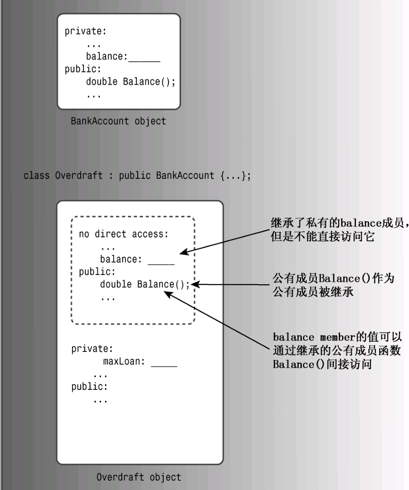

# 基础语法
1. C++对大小写字母敏感
2. C++用`cout`代替C中的`printf`,但是`cout`可以直接输出变量,不用加格式字符串,这和python类似.对于`cout`,系统会自动根据数据或变量类型进行输出
3. 双斜杠 `//`  注释
4. 预处理文件(头文件)`<iostream>`包括的是输入输出指令
5. 程序使用`cin`和`cout`作为输入和输出时必须`include<iostream>`文件
6. 新版C++协议的头文件是`iostream`,不是`iostream.h`,所以需要`namespace`指令来实现可以使用`iostream`中的定义
7. 命名空间可以作为附加信息来区分不同库中相同名称的函数、类、变量等
8. 所谓`namespace`,是指标识符的各种可见范围。C++标准程序库中的所有标识符(如:`cout`  `endl`等等)都被定义在`std`的`namespace`中(`using namespace std`操作可以使所有定义在`std`空间中的标识符都能在此程序中使用,可以理解为一个此程序中的全局声明)
9. `endl`是一个操作算子,它的作用就是换行+刷新缓冲区(是输出缓冲区),所以输出函数其实就是`cout`,`endl`只是起了个换行和刷新缓冲区的作用,输出的时候`endl`不是一定要有的
10. C++用`cout`输出换行的三种方式:
    ```C++
    eg:
    cout<<endl;
    cout<<'\n';
    cout<<"\n";
    ```
11. C++允许在创建变量时对它赋值
12. `climits`头文件中包含了关于整型限制的信息,具体来说,它定义了表示各种限制的符号名称
13. C++中定义了一种C中没有的初始化语法: 
    ```C++
    eg:
    int wrens(432) <=> int wrens = 432;
    ```
14. C++对字符用单引号,对字符串用双引号
15. C++为`cout`引入了一个`cout.put()`函数,类似C中的`putchar()`函数
16. `\`为转义字符
17. C++11 新增了类型`char16_t`和`char32_t`,其中前者是无符号16位,后者是无符号32位,定义方式为:
    ```C++
    eg:
    char16_t ch1 = u'q';
    char32_t ch2 = U'q';
    ```
18. 定义常量尽量用`const`, 因为它能够明确指定类型,并可以限制在特定的作用域中
19. <mark>`const`与`constexpr`变量都必须在声明时也初始化</mark>
20. C++中的自动类型转换:
    * 将一种算术类型值赋给另一种算术类型的变量时,C++将对值进行转换;
    * 表达式中包含不同的类型时,C++将对值进行转换;
    * 将参数传递给函数时,C++将对值进行转换;
21. 强制类型转换:`(typeName) value` OR `typeName value`
22. 查看变量类型:`typeid(variable).name()`
23. 定义常量
    ```C++
    //使用#define预处理器
    eg:
    #define SCREEN_HEIGHT 640//#define预定义不能有等号和分号
    //使用const关键字
    eg:
    const int SCREEN_WIDTH = 960;
    eg:
    //使用全局变量(不是常变量)
    int SCREEN_WIDTH = 960;
    ```
24. 全局变量在整个源文件的作用域都有效,只需要在一个源文件中定义全局变量,在其他不包含该全局变量的源文件的头文件用`extern`关键字声明即可
25. `C++`中全局变量的存储位置通常在:
   * 数据段:存储已初始化的全局变量和静态变量
   * BSS段:存储未初始化的全局变量和静态变量
   * 只读数据段:存储常量(如`const`修饰的全局变量)
26. <mark>全局变量的定义是在主函数开始之前的,因此如果在主函数中改变全局变量的值,这是不会影响全局变量的初始化的</mark>,如:
    ```C++
    int n;
    vector<int> father(n);
    int main(){
        n = 100;
        cout << father.size() << endl;
        return 0;
    }
    =>0// 全局变量father被全局变量n初始化,在全局变量初始化时n=0
    ```
28. `const`定义格式
    ```C++
    const typeName name = value;
    ```
29. 在用`cin`输入字符串时,它使用空白(空格、制表符和换行符)来确定输入字符串的结束位置,这意味着`cin`在获取字符数组输入时只读取一个单词,读取完后会自定在结尾添加空字符`'\0'`
30. <mark>`cout`(`cin`)是可以直接输出(输入)字符数组(字符串)的,但是对于其他类型数组只能遍历输出(输入)(遍历输出输入就是直接操作的单个元素变量名,而不是数组名)</mark>
    ```C++
    eg:
    int a[3]={1,2,3};(×)
    cout << a;//这输出不了1 2 3,它会输出变量a的值,即这个数组的首元素地址
    eg:
    int a[3];(×)
    cin >> a;//整数型数组不能直接对数组整体输入,只能单个元素的输入
    eg:
    int a[3];(√)
    cin >> a[1];//整数型数组不能直接对数组整体输入,只能单个元素的输入
    ```
29. <mark>`C++`里面的`cin`和`cout`对单个元素变量的输入和输出可以直接对变量进行操作,而不像`C`中的格式化输入(需要取地址)和输出.`C++`对字符数组(字符串)的输入和输出可以直接操作数组名</mark>
30. `>>`与`<<`叫做流运算符
31. <mark>`C++`中其它函数的定义位置不重要,可以在`main()`之前和之后,但是这些函数的声明必须在调用这些函数之前</mark>
32. `void *`是一个通用的指针类型,它可以指向任何类型的数据.然后,使用`void *`需要小心,因为它失去了类型信息,需要在使用时进行强制类型转换
33. <mark>对数组名取地址得到的整个数组的地址</mark>
34. `cout << 'b'-'a' << endl;`输出1
35. <span style="color:red;">`C++代码块`通常指的是一段用花括号`{}`包围起来的`C++`代码,用于定义一个作用域.在这个作用域内声明的变量在作用域外是不可见的(即离开作用域,里面的变量就会自动销毁),这样可以限制变量的作用范围,提高代码的可读性和安全性</span>
36. <mark>在`C++`中,函数形参为`const`类型的作用:</mark>
    * 保护实参的值不被修改:使用`const`修饰函数参数可以确保函数内部不会修改实参的值,这样有助于提高代码的可读性,并防止意外的修改实参导致的错误
    * 提高函数的通用性:形参为`const`类型,则实参可以是`const`类型,也可以是非`const`类型
37. <mark>标准输出和标准输入是程序的默认输出流,标准输出的文件描述符是`1`,标准输入的文件描述符是`0`</mark>
38. `char`类型对应的是`ASCII`码:
    ```C++
    char a=k='0';
    a++;
    k=k+'1';
    =>
    a='1'(ascll码:48+1=49->'1')
    k='a'(ascll码:48+49=97->'a')
    ```
39. `C++`中的续行符(`\`):在宏定义或长代码行中,反斜杠可以用来指示代码在下一行继续
# 数组
1. 数组声明应指出以下三点:
    * 存储在每个元素中的值的类型;
    * 数组名;
    + 数组中的元素数;
2. `typename arrayName[arraySize]` //<mark>表达式arraySize指定元素数目,它必须是整型常数(如10)或const值,也可以是常量表达式(如`8*sizeof(int)`)</mark>
3. 计算数组所含元素个数:
    ```C++
    eg:
    array_len = sizeof(array1) / sizeof(array1[0])
    ```
4. 只有在定义数组时才能使用初始化,以后就不能使用了,也不能将一个数组赋给另一个数组
5. 初始化数组时,提供的值可以少于数组的元素数目,其余编译器会自动补0
6. `C++11`的列表初始化新增了一些功能:
    * 初始化数组,可以省略等号,如:
        ```C++
        eg:
        int arr1 {1, 2};
        ```
    * 初始化列表中可以不包含任何东西,这将把所有元素都设置为0;
    * 列表初始化禁止缩窄转换;
7. 字符串(字符数组)其实可以看作字符串起来再加一个`'\0'`
8. <mark>字符串的索引`str[i]`是一个字符类型(`char`)</mark>
# 字符串
1. C++处理字符串有两种方式:
    * C-风格字符串:以空字符`'\0'`结尾,在利用初始化列表`{'l','o','v','e','\0'}`初始化字符串时,<mark>要显示的在最后一位给`'\0'`,否则不是字符串</mark>
    * 可以利用字符串常量,如:`char str1 = "Love";`用引号括起的字符串隐式地包括结尾的空字符,因此不用显示地包括它,存储时系统会自动添加`'\0'`将字符串读到char str1数组中,会自动加上空字符
2. `"S"`表示的是两个字符(字符`'S'`和`'\0'`)
3. 拼接字符串:C++允许拼接字符串字面值,如: 
    ```C++
    eg:
    cout << "I" "Love" "You" << endl;
    ```
    拼接时第二个字符串的第一个字符将紧跟在第一个字符串的最后一个字符后,第一个字符串中的'\0'将被第二个字符串的第一个字符代替
4. `strlen()`函数返回的是存储在数组中的字符串的长度,而不是数组本身的长度,<mark>并且不把空字符计算在内</mark>
5. `cin`使用空白(空格、制表符和换行符)来确定字符串的结束位置,则`cin`只读取一个单词.`cin`输入完后会自动在结尾添加`'\0'`
6. `iostream`中的类对象(`cin`)提供了`getline()`和`get()`两个读取一行字符串的函数,<mark>它们两个都是通过换行符结尾</mark>,其中:
    * `getline()`将丢弃输入时的换行符(不会把换行符存到输入缓冲区中),而get()会保存换行符在输入序列(输入缓冲区)中:
    ```C++
    eg:
        cin.getline(ArrayName, ArraySize); //在存储字符串时,系统自动用空字符('\0')来替代输入结尾标志'\n'

        cin.get(arrayName, ArrarSize);//系统也会自动添加空字符('\0')
        //前面两种是cin的方法,需要指定数组个数.对于string对象:
        getline(cin, str);//输入也以换行符终止.getline()与cin.getline()一样,读取换行符,将换行符替换成'\0',并将换行符从输入缓冲区中抹去
    ```
    * 对于`cin.get()`,由于第一次调用后,换行符将留在输入队列中,因此第二次调用时看到的第一个字符便是换行符.为了处理换行符:
    ```C++
    eg:
    cin.get(Arrayname, ArraySize).get()//这里的.get()是为了舍弃输入流中的一个紧接的字符
    ```          
    * `cin`输入也会将换行符保存在输入队列(输入缓冲区)中,所以有时输入会莫名产生空行的情况
7. string类位于命名空间std中(<mark>C没有string类</mark>)
   ```C++
   * 可以使用C-风格字符串来初始化string对象
   * 可以使用cin来将键盘输入存储到string对象中
   * 可以使用cout来显示string对象
   * 可以使用数组表示法来索引/访问存储在string对象中的字符
   ```
8.  虽然`string`未规定需要用`'\0'`结尾,但是在用`C-`风格的字符串或者用`cin`输入字符串赋给`string`对象时,也会把`'\0'`赋给`strng`对象(这是显然的).`string`对象不会自动给字符串分配`'\0'`,它有的`'\0'`只是赋给它的,其实在`C++`里,`string`是不需要识别结尾的,因为需要用到的东西,`string`函数库都解决了
9.  C++中处理字符串的三种方法:
    * 字符数组:`char array[Size]`;
    * string类: `string str1`;
    * 指针;
10. string类设计让程序能自动处理string的大小
11. 对于string类:
    ```C++
    eg:
    字符串拼接: "+"
    字符串合并: "+=", str1 += str2 //将str2加到str1末尾
    字符串复制: str1 = str2
    字符串大小: .size(), str1.size()
    字符串的查找; .find();//成功返回的是下标,不成功返回-1
    ```
12. `string`对象可以直接用下标索引,但前提是索引的位置是有字符的(这一点和`vector`容器一样)
13. 将一行输入读取到`string`对象中去
    ```C++
    getline(cin, str); //这里没用句点表示法,因为这个getline()不是类方法.另外,也没有指出字符串长度的参数,因为string对象将根据字符串的长度自动调整自己的大小
    ```
14. C++中增加了原始字符串,它用`"("和")"`定界,并使用前缀R来标识原始字符串.若要在原始字符串中输出小括号,则此时用`"+*("`和`")+*"`来替代定界符
15. `string`、字符数组、字符指针
    ```C++
    1. 字符指针有初始值时,不能修改其中字符的值
    char* p="sadsda";
    p[2]='2';
    //因为字符指针指向的是一个静态存储区const
    2. string允许修改
    string ss="sadsda";
    p[2]='2';
    3. 字符数组形式也允许修改
    char ss[26]="sadsda"
    p[2]='2';
    //因为字符数组放在栈内存中,属于动态内存区,允许修改
    ```    
16. `sizeof`会统计`'\0'`的数目
# 结构体
1. C++允许在声明结构变量时省略关键字(如:`struct inflatable goose<=>inflatable goose`),这与C不同(C中不能省略)
2. 结构体访问结构成员变量是用成员运算符(`.`)
3. 使用结构体前需要先定义,通常放在main()函数前进行外部定义.定义中的成员是用分号(`;`)
4. 初始化时各成员是用逗号(`,`)隔开
5. 同类型的结构体可以直接赋值
6. 结构体初始化赋值可以直接花括号赋值
7. 可以同时完成定义结构和创建结构变量的工作
   
8. 结构体变量的定义和初始化:
    ```C++
    inflatable a = 
    {
        ...
    }; 
    ```
9.  结构数组:`inflatable gifts[100]`; //假定inflatable是已经定义的`结构体名称.gifts`是一个数组,其中的每个元素都是inflatable对象
10. 结构数组初始化时:结果为一个被括在花括号中、用逗号分隔的值列表,其中每个值本身又是一个被括在花括号中、用逗号隔开的值列表
11. C++允许指定占用特定位数的结构成员,每个成员都被称为位字段,但<mark>位字段编程一般用在低级编程中</mark>
12. 结构体中定义的成员变量既可以是同类型也可以是不同类型
13. 
    其中`inflatable`就像是一个标准的类型名,可以被用来定义变量
14. 结构体中的构造函数与类中的构造函数定义/调用方式相同:
    ```C++
        struct Point {
        int x;
        int y;
        // 构造函数
        Point(int x_val, int y_val) : x(x_val), y(y_val) {}
    };
    int main() {
        // 创建结构体对象并调用构造函数初始化成员变量
        Point p1(3, 4);
        std::cout << "Point p1: (" << p1.x << ", " << p1.y << ")" << std::endl;
        return 0;
    }
    ```
15. 如果结构体内没有显示定义构造函数,那么编译器会自动生成一个默认的无参构造函数.当创建结构体对象时,会自动调用这个默认的构造函数来初始化对象:
    ```C++
        struct Point {
        int x;
        int y;
    };
    int main() {
        // 创建结构体对象并自动调用默认构造函数进行初始化
        Point p;
        // 输出默认初始化后的值
        std::cout << "Point p: (" << p.x << ", " << p.y << ")" << std::endl;
        return 0;
    }
    ```
# 结构体模板
1. 结构体模板和类模板几乎是一样的
# 共用体
1. 共用体是一种数据格式,它能够存储不同的数据类型(这一点类似结构体),但是它<u>只能同时存储其中的一种类型</u>.
2. 共用体的定义与结构体类似,但是共用体不能像结构体那样利用列表整体赋值,union只能用点号(`.`)对成员单独赋值
3. <mark>共用体的长度为其最大成员的长度.共用体使用了内存覆盖技术,同一时刻只能保存一个成员的值,如果对新的成员赋值,就会覆盖原来成员的值,所以共用体中的成员变量赋值应该结合内存空间来想.覆盖时,一般从低位开始覆盖,所以有可能没完全覆盖,比如char类型不能覆盖完int类型.当且仅当成员所占字节数相同,否则只会覆盖相应字节上的值</mark>
4. 共用体常用来节省空间,当数据线使用多种(但不会同时使用)时,就可考虑union
5. 共用体赋值时注意事项:
    ```C++
    eg:
    1. 
    union id{
            int x;
            float y;
            };
    int main()
        {
        id z;
        z.x = 1;
        z.y = 2; 
        cout << z.x << " " << z.y << endl;
        return 0;
    };=>1073741824 2
    //z.x=1073741824的原因没想明白,好像是溢出值
    2.
    union id{
            int x;
            int y;
            }
    int main()
        {
        id z;
        z.x = 1;
        z.y = 2; 
        cout << z.x << " " << z.y << endl;
        return 0;
    }=>2 2
    //z.x和z.y在共用体内存字节上完全重合,则后一个修改值会使前一个值与它一样
    ```
# 枚举
1. `C++`提供了`eunm`工具来创建符号常量,<mark>这种方式可以代替const</mark>
   ```C++
   eg:
   enum spectrum {red, orange, yellow, green, blue};
   #spectrum为新类型的名称,被称为枚举
   #red,orange等为符号常量,它们对应整数值0~4.这些常量称为枚举量
   #对于枚举,只定义了赋值运算符,没有定义算术运算符
   #枚举量是整型,可被提升为int类型,但int类型不能自动转换为枚举类型(band=3是非法的)
   #枚举定义可以省略枚举类型名称,即可以省略spectrum
   ```
2. 可以显示地指定整数值来覆盖默认值
   ```C++
   eg:
   enum bits{one=1,two=2,four=4,eight}
   #指定的值必须是整数
   #没有初始化的枚举量的值将比其前面的枚举量大1,eight的值为5
   ```
3. 枚举定义的取值范围
   * 上限
     - 找到大于这个最大值的最小的2的幂,将它减去1,得到的便是取值范围的上限.如上面的最大枚举值是5,在2的幂中比它大的最小的为8,则上限为7.
   * 下限
     - 如果枚举量的最小值不小于0,则下限为0.
     - 否则,采用与找上限方式相同的方式,但加上负号
4. `enum`与`enum class`这是两种不同的枚举类型声明方式:
   * `enum class`引入了作用域,枚举值被限制在枚举类型的作用域内,不会自动转换为整数.因此,枚举值必须显式地指定为枚举类型的成员:
      ```C++
      enum class ChannelState { Open, Closed };
      ChannelState state = ChannelState::Open;
      // 使用枚举值时必须指定作用域
      if (state == ChannelState::Open) { /* ... */ }
      ```
   * `enum`没有引入新的作用域,枚举值可以直接被用作整数.在枚举类型的作用域外部,枚举值可以隐式地转换为整数:
      ```C++
       enum ChannelState { Open, Closed };
      ChannelState state = Open;  // 不需要指定作用域(即不需要ChannelState::)
      // 在作用域外部，枚举值可以隐式转换为整数
      if (state == Open) { /* ... */ }
      ```
   * 使用`enum class`可以提供更好的封装和名称空间隔离,避免命名冲突,并且需要显式地进行枚举值的类型转换
   * 使用传统的`enum`保留了与`C`语言风格枚举相同的行为,不具备封装性和名称空间隔离,并且允许隐式转换为整数
# 指针
1. 指针是一个变量,其存储的是值的地址,而不是值的本身
2. 指针强调的是允许阶段,而数组等是强调的编译阶段
3. 指针名表示的是**地址**,`*`运算符被称为间接值或解除引用运算符
4. 指针定义的形式
   ```C++
   eg:
   int *ptr #(True)
   int* ptr #(True),C++习惯用
   int*ptr #(True)
   ```
5. 对每个指针变量名都需要使用一个`*`
   ```C++
   eg:
   int* p1, p2; #这样定义的p2是一个int而不是int*
   ```
6. 指针的危险:<span style="color:red;">因为在创建指针时,计算机只会分配用来存储地址的内存,而不会分配指针的指向.因此,在对指针应用解除引用运算符(`*`)前,要将指针初始化为一个确定的、适当的地址.</span>
    ```C++
    eg:
    int* p1;
    *p1 = 2;
    #这样是错误的
    ```
7. C++中不能将地址值以数值的方式直接赋给指针(C可以)
   ```C++
   eg:
   int* p;
   p = 0xB8000000;
   #C++中不允许
   ```
8. `new`分配内存和`delete`释放内存
    * new分配内存(运行阶段,可以编写程序边定义),它使程序在管理内存方面有更大的控制权
        ```C++
        1.
        //为一个数据对象(可以是结构,也可以是基本类型)获得并指定分配内存的格式
        typeName* pointer_name = new typeName;
        #new运算符根据类型来确定需要多少字节的内存.然后,它找到这样的内存,并返回其地址
        2.
        new分配的内存块通常与常规变量声明分配的内存块不同.变量的值都存储在被称为栈的内存中,而new从被称为堆或自由存储区的内存中分配内存
        3.
        //使用new来创建动态数组
        typeName* pointer_name = new typeName [num_elements]; #pointer_name指向第一个元素(和数组中的数组名一样)
        #如果通过声明来创建数组,则在程序被编译时将为它分配内存.在编译时给数组分配内存被称为静态联编.new分配是在程序允许时选择数组的长度,这种被称为动态联编
        ```
    * delete释放内存
        ```C++
        1.
        int* p = new int;
        ...
        delete p;
        #这将释放p指向的内存,但不会删除指针p本身
        2.
        new和delete一定要配对使用.否则将发生内存泄漏,也就是说,被分配的内存再也无法使用了
        3.
        //new和delete遵守的规则
         - 不要使用delete来释放不是new分配的内存
         - 不要使用delete释放同一个内存块两次
         - 如果使用new为数组分配内存,则应该使用delete []来释放
         - 如果使用new为一个实体分配内存,则应该使用delete来释放
         - 对空指针应用delete是安全
         4.
         释放动态数组内存时,要将数组指针的指向移到最初创建的位置.
         int* p = new array[3];
         p[0] = 1;
         p[1] = 2;
         p[2] = 3;
         p = p+1;
         cout << p[0] << endl;
         p = p-1;#必须有这一句
         delete [] p;
        ```
9. 不能修改数组名的值,但可以修改指针变量的值
10. <span style="color:red;">利用`new`分配内存创建的指针会给它一个指针的指向,所以不会出现`6.`中所说的指针的危险</span>
    ```C++
    eg:
    1. 
    int* p;
    *p = 1;
    cout << *p << endl;
    =>报错
    2. 
    int* p = new int;
    *p = 1;
    cout << *p << endl;
    =>1
    ```
11. 如果`p`是一个指向`int`的指针,那么`p+1`是导致它指向第2个元素.从地址角度看,`p`的值其实增加了一个`int`的字节数.<mark>指针变量加1,增加的量等于它指向的类型的字节数</mark>
12. 多数情况,C++将数组名解释为第一个元素的地址
13. 解除引用和数组表示法等价
    ```C++
    eg:
    *(stacks+1)<=>stacks[1]
    ```
14. 数组应用`sizeof`得到的是数组的字节长度,而对指针应用`sizeof`得到的是指针(该地址)的字节长度
15. 数组名被解释为其第一个元素的地址,而对数组名取地址(&)时,得到的是整个数组的地址
    ```C++
    eg:
    short tell[10];
    cout << tell << endl;
    cout << &tell << endl;
    #从数字上说,这两个地址相同;但从概念上说,tell是以一个2字节内存块的地址,而&tell是一个20字节内存块的地址.因此,此时的&tell+1是将地址+20
    ``` 
16. 
    ```C++
    //数组指针:指向n个元素的数组的指针
    eg:
    int(* p) [n];
    //指针数组:数组中每一个元素都是一个指针,含有n个指针
    eg:
    int* p[n];
    ```
17. 在`cout`和多数C++表达式中,`char`数组名、`char`指针以及用引号括起的字符串常量都被解释为字符串第一个字符的地址
18. 地址赋值并不会复制字符串(不会得到字符串的副本),而只是复制地址.然后使这两个指针都指向相同的内存单元和字符串
19. <span style="color:red;">获得字符串副本(复制字符串,但地址不同)</span>
    ```C++
    char animal[10] = "bird";
    //首先需要分配内存来存储这个字符串
    ps = new char [strlen(animal) + 1];//+1是为了包含空字符
    //接下来需要将字符串复制到新分配的空间,不能直接赋值,因为这样只能复制地址
    strcpy(ps, animal);
    ```
20. `strcpy()`会复制`'\0'`,而`strncpy()`不会复制`'\0'`
21. <mark>使用`new`动态创建结构体</mark>
    ```C++
    inflatable* ps = new inflatable;
    ```
22. 访问结构体.如果结构标识符是结构名,则使用句点`.`运算符;如果标识符是指向结构的指针,则使用箭头运算符`->`
    ```C++
    //创建动态结构时,不能将成员运算符(.)用于结构名,因为这种结构没有名称,只是知道它的地址
    eg:
    inflatable* ps = new inflatable;
    ps->name <=> (*ps).name;
    ```
23. `strlen`不能统计字符串的空字符`'\0'`
24. <mark>`C++`三种内存管理方法:</mark>
    ```s
    1. 自动存储:在函数内部定义的常规变量使用自动存储空间(栈->后进先出LIFO),被称为自动变量,它们在所属的函数被调用时自动产生,在该函数结束时消亡
    2. 静态存储是整个程序执行期间都存在的存储方式.使变量成为静态的方式有:
        - 函数外声明(全局)
        - 加关键字static
    3. 动态存储:new和delete管理了一个内存池(堆),堆和用于静态变量和自动变量的内存是分开的.使用new和delete能够在一个函数中分配内存,在另一个函数中释放它.因此,使用new和delete让程序员对程序如何使用内存有更大的控制权
    ```
25. 如果使用`new`在堆中创建变量后,没有`delete`,那么会发生<mark>内存泄露</mark>
26.  `array`对象
    ```C++
    1. 和数组一样,array对象的长度也是固定的,也使用栈,但它更方便、安全
    2. array<typeName, n_elem> arr;#创建了一个名为arr的array对象,但这的n_elem不能是变量
    ```
27. 空指针:指向已经销毁的对象或已经回收的地址;野指针:指的是未经初始化的指针
# std::vector
1. `Vector`对象(更详细的见`leetcode/learn.md`)
    ```C++
    1. vector类似string类,也是一个动态数组.可以在运行阶段设置vector对象的长度,可在末尾附加新数据,还可以插入新数据.
    2. vertor是使用new创建动态数组的替代,vector本质管理内存还是new和delete,但这些工作是自动完成的
    3. 使用vector对象要包含头文件vector,还要包含命名空间std
    4. vertor<typeName> vt(n_elem);#创建一个每个元素都是typeName类型的vector对象vt,可存储n_elem个元素,n_elem可以是整型常量也可以是整型变量
    5. vector对象会根据vector包的各种方法(插入、删除等)自动调整长度
    6. vector对象使用堆
    7. vector类不能直接用cin输入(因为vector类中没有这个cin方法),要借用vector.push_back()这些方法
    8. vector类不能直接用cout打印vector对象,可以用一下方法访问和遍历
        * 下标法:
        std::vector<int> vec = {1, 2, 3, 4, 5};
        for (size_t i = 0; i < vec.size(); ++i) {
            // 使用 vec[i] 访问当前索引处的元素
            // 例如：
            // std::cout << vec[i] << std::endl;
        }
        * for循环:
        std::vector<int> vec = {1, 2, 3, 4, 5};
        for (int element : vec) {
            // 对每个元素执行操作
            // 例如：
            // std::cout << element << std::endl;
        } 
        1. 迭代器:
        std::vector<int> vec = {1, 2, 3, 4, 5};
        for (auto it = vec.begin(); it != vec.end(); ++it) {
            // 使用 *it 访问当前迭代器指向的元素
            // 例如：
            // std::cout << *it << std::endl;
        }
    ```
2. `std::vector`的`.data()`方法返回一个指向当前`vector`这个元素数组的指针:
   ```C++
   std::vector<int> vec = {1, 2, 3};
   vec.data()<=>&(*vec.begin())<=>&vec[0];
   // 注意:只有在vec不为空时第三个等号才成立,因为若vec为空,直接用下标访问该vector数组和使用解引用的方法访问都会报错(未定义);但是vec.data()只是返回一个空指针nullptr
   // &(*vec.begin())在vec为空时也会报错未定义
   ```
3. `std::vector`为空时不能直接用下标访问(未定义的错误);而解引用访问也会报错,如`&(*vec.begin())`(`vec.begin()`为空,则`*vec.begin()`解引用会报未定义的错误)
4. <mark>`std::vector`在`C++`中频繁`push_back`会导致的问题:</mark>
   * 内存容量成倍增加:当`vector`的容量不足以容纳新元素时,它需要重新分配内存.而重新分配内存会涉及以下几步:
     - 先分配一块新的、更大的内存块(通常是当前容量的2倍)
     - 再将旧内存块中的元素复制到新内存块
     - 最后将释放旧内存块
     这样重新分配内存的操作很昂贵,会对性能产生较大的影响
   * 迭代器失效:在上面的重新分配内存中时,可能会导致所有指向`vector`元素的迭代器、指针和引用都失效了(因为之前的地址没东西了,被分配到新位置了),进而导致未定义
   * 性能问题:虽然`vector`会通过指向增长的方式来尽量减少重新分配内存的次数,但在最坏的情况下,频繁的`push_back`操作仍可能会导致大量的内存重新分配和元素拷贝,进而影响性能
5. `vector`的列表初始化:
    ```C++
    vector<vector<string>> res;
    res.emplace_back(vector<string>{"Q"});// 这是对的:这是利用vector的列表初始化,创建了一个包含一个string的vector
    res.emplace_back(vector<string>('Q'));// 这是错的:这是表示通过调用vector构造函数来初始化,这种方法的第一个参数必须是int(表示大小).如:vector<string> s(5);
    res.emplace_back(vector<string>{'Q'});// 这是不提倡的:其实是错的,但是编译器隐式将char转换为string了,所以不会报错
    // 注意:vector<string>{"Q"}中的vector<string>不是强制类型转换,这里是一个是构造一个vector<string>类型的临时对象,然后添加到res末尾
    ```
6. 拷贝列表初始化和直接使用列表初始化的不同(在现代编译器中大多会产生相同的效果):
   ```C++
   1. 使用拷贝列表初始化
   vector<int> a = {1,2,3};// 这是使用拷贝列表初始化的形式.首先创建了一个临时的vector<int>对象{1,2,3},然后再用这个临时对象来拷贝初始化a
   2. 直接使用列表初始化
   vector<int> a{1,2,3};// 这是直接使用列表初始化.编译器直接通过{1,2,3}来构造a,不会创建临时对象
   ```
7. `vector`的`size`和`capacity`:详见`https://www.programmercarl.com/%E6%A0%B9%E6%8D%AE%E8%BA%AB%E9%AB%98%E9%87%8D%E5%BB%BA%E9%98%9F%E5%88%97%EF%BC%88vector%E5%8E%9F%E7%90%86%E8%AE%B2%E8%A7%A3%EF%BC%89.html#%E6%80%BB%E7%BB%93`
   * `size`:表示`vector`当前包含的元素数量,即已经存储的有效元素的个数.通过`.size()`函数获取
   * `capacity`:表示`vector`分配的内存能够容纳的最大元素数量,而不需要重新分配内存.通过`.capacity()`函数获取
   * 通常情况下,`capacity`会大于或等于`size`.当`vector`添加元素时,如果元素数量超过当前`capacity`,`vector`会重新自动分配一块更大的内存,并将已有元素复制到新内存中.重新分配后,`capacity`会增加,但`size`只反映实际元素的数量
   * 有时因为编译器或`C++`标准库实现的优化行为,特别是在小型`vector`的`capacity`和`size`中会保持一致;但对于大一点的`vector`它就会`capacity`>`size`了,即：
     ```C++
     1.
     int main() {
        std::vector<int> v;
        v.push_back(1);
        v.push_back(2);
        std::cout << "Size: " << v.size() << std::endl;         // 输出当前元素个数
        std::cout << "Capacity: " << v.capacity() << std::endl; // 输出分配的容量
        return 0;
     } 
     =>
     Size: 2
     Capacity: 2
     2.
     int main() {
        std::vector<int> v;
        v.push_back(1);
        v.push_back(2);
        v.push_back(3);
        std::cout << "Size: " << v.size() << std::endl;         // 输出当前元素个数
        std::cout << "Capacity: " << v.capacity() << std::endl; // 输出分配的容量
        return 0;
     } 
     =>
     Size: 3
     Capacity: 4
     ```
8. <mark>`vector`的`operator[]`访问元素的方法不会出现越界报错(即`operator[]`无边界检查),只可能会导致未定义行为,即这个越界得到的垃圾值可能会使后续程序崩溃,这种设计是为了提高性能,因为边界监测会增加额外的开销:</mark>
    ```C++
    int main(){
        std::vector<int> a={1,2,3};
        std::cout << a[3] << std::endl;// 不会报错
        return 0;
    }
    // 此时直接输出的0
    ```
9.  <mark>`vector`的`.at()`访问元素的方法与`operator[]`类似,如:`vec.at(3);// 访问下标为3即第4个元素`,但是`.at()`访问元素的方法会进行边界检查</mark>
# std:list
1. `iterator insert(iterator pos, const T& value);`:`pos`指的是要插入元素的迭代器位置
2. `std::list`的迭代器可以随着链表长度的变化自动调整,而不需要像数组那样事先有固定的长度或容量.插入操作总是发生在"当前位置的前面",即使链表中还没有足够的元素,`insert`也能正确工作
3. <mark>`vector`是一块连续的内存,因此它的`insert`如果不在末尾,那么此时就需要向后移动大量元素=>`O(n)`,如果此时超过了容量,那么又会重新分配内存,然后拷贝操作,此时就会是=>`O(n^2)`</mark>
4. `list`和`vector`的`insert`方法不同,它插入操作是`O(1)`,因为只需修改相邻节点的指针
# 循环和关系表达式
1. 语句和表达式的区别就是一个分号`;`
2. 在`for`语句中声明的变量只能用在`for`语句中,当程序离开循环后,变量也会消失
3. 
    ```C++
    eg:
    using namespace std;//using编译指令,使所有的名称都可用
    using std::cout;//using声明,使一个名称cout可用,并且在后续使用中不用域解析运算符::
    //使用命名空间名称
    1. cout << 5;//使用using声明或编译指令后可直接用cout
    2. std::cout << 5;//无using指令,则需域解析运算符
    ```
4. `i++`表示使用`i`后再加1,`++i`表示先给`i`加1再使用`i`
5. `C++`文件的编译链接过程
   ```s
   预处理->编译(转换为汇编代码.编译的时候只检查函数声明,只要引用的函数声明了(头文件中声明也行)就行)->汇编(转换为机器码,汇编这一步需要为其他源文件生成一个机器码,即可执行文件)->链接(函数的定义是在链接检查的,链接将多个二进制目标文件和系统组件合成一个可执行文件)
   ```
6. 对于用户定义的类型,如果有用户定义的递增和递减运算符,则前缀格式(`++i`)的效率更高
7. 前缀递增`++i`、前缀递减`--i`和解除引用运算符`*`优先级相同,以从右到左的方式结合;后缀递增`i++`和后缀递减`i--`优先级相同,但比前缀高
   ```C++
   eg:
   *++pt;//先给pt加1,再将*应用于被递增后的pt
   eg:
   (*pt)++;//表示先对指针解除引用,然后++
   eg:
   x = *pt++;//先执行后缀递增,然后应用pt到*,注意这里后缀运算符是对原来地址而不是递增后的地址解除引用.x得到的是*pt的值,这条语句执行完毕后,pt的值将成为pt+1的地址(先用pt到语句,语句结束后再给pt+1)
   ```
8. 所有运算符中,逗号运算符是优先级最低的
9. 关系运算符的优先级比算术运算符低
10. 对于字符数组,是不能直接用关系运算符进行比较的,只能用`C-`风格字符串库的`strcmp()`函数进行比较.而对于`string`对象可以直接用关系运算符
11. `string`类重载了关系运算符,所以可以直接用关系运算符比较`string`对象,此时需要至少有一个操作数为`string`对象,另一个操作数可以是`C-`风格字符串
12. 字符可以直接用关系运算符比较,因为字符本质是整型
13. `while`不能像`for`那样在循环里面定义局部变量
14. 通常是在需要循环计数是用`for`,而无法预知循环次数时用`while`
15. `C++`创建别名
    ```C++
    eg:
    1. #define BYTE char* //BYT成为char的别名
    2. typedef char* byte;//通用格式为typedef typeName aliasName
    注意:
    * 使用#define建立别名定义指针时会出现和原始类型定义指针出现一样的问题,如:byte pa,pb;<=>char* pa,pb;此时pb只是一个char类型而不是指针
    * 但是用typedef不会出现上述问题
    * typedef是一种更佳的选择
    * typdedef不会创建新类型,它只是为己有类型建立一个别名
    ```
16. `C++`里面创建了一个测量程序时间的函数`clock()`,它会返回一个`clock_t`类型的值,这个值表示从程序启动到调用`clock()`函数所经过的时钟周期数
    ```C++
    #头文件ctime里面定义了一个符号常量-CLOCKS_PER_SEC,该常量等于每秒钟包含的系统时间单位数,因此将系统时间除以这个值就能得到秒数
    eg:
    clock_t start = clock();//记录程序启动到此刻的时间
    ...
    clock_t end = clock();//记录程序启动到此刻的时间周期数
    elapsed_tim = (end-start)/CLOCKS_PER_SEC;//计算中间程序块的运行时间(秒)
    ```
17. `C++`新增了一种循环:基于范围的`for`循环(对数组(或容器类,如`vector`和`array`)的每个元素执行相同的操作)
    ```C++
    for(int x : {1, 2, 3})//x必须在这声明,不能在外面声明,即for(x : {1, 2, 3})是错的
        cout << x << endl;
    //类似python中的for...in...
    ```
18. <span style="color:red;">文件尾条件`EOF`,许多PC的编程环境都将`ctrl+z`视为模拟的`EOF`.检测到`EOF`后,`cin`将两位(`eofbit`和`failbit`)都设置为1.如果`eofbit`或`failbit`被设置为1,则fail()/eof()成员函数(`cin`的成员函数)返回`true`,常用`fail()`方法</span>
19. `cin`方法检测到`EOF`时,将设置`cin`对象中一个指示`EOF`条件的标记.设置这个标记后,`cin`将不再读取输入,就算后面再次调用`cin`也不管用
20. `EOF`的常见输入做法
    ```C++
    1. 
        cin.get(ch);
        while(cin.fail() == false){
            ...
            cin.get(ch);
        }
    2.
        while(!cin.fail())
    3.
        //使用istream的对象作为条件时,效果是检查流的状态.若流有效,则该对象返回true,否则false.但是这个对象不能直接被输出,这是显然的
        eg:
        cout << cin;//(×)
        //cin是istream类的一个对象,而istream类提供了一个可以将istream对象(如cin)转换为bool值的函数,当istream类的对象(cin)出现在需要bool值的地方(如循环时的测试条件)会自动被转换为bool值,如果读取成功(则没读取到EOF)则返回true,否则false
        cin.get(ch);
        while(cin)
        {
            ...
            cin.get(ch);
        }
    4.
        //cin.get(char)返回值是一个cin对象
        while(cin.get(ch)){//此方法更通用,因为这样只需要调用一次cin.get()
            ...
        }
    5.
        //对于cin.get(),当该函数到达EOF时,将没有可返回的字符.相反,cin.get()将返回一个用符号常量EOF表示的特殊值,该常量在头文件iostream中定义.EOF值被定义为-1
        int ch;
        while((ch = cin.get())!=EOF){
            ...
        }
    ```
21. `cin.get()`与`cin.get(char)`的区别
    
    <mark>注意:`cin.get(char arrayname, arraysize)`的函数返回值也是一个istream对象
22. 使用`cin.get(char)`可以拼接
    ```C++
    eg:
    cin.get(ch1).get(ch2);//cin.get(ch1)会返回一个cin对象,则可以继续调用get(ch2).将输入中的字符读入到ch1中,然后将接下来的字符读入ch2中
    ```
23. `cin >> `这种也会返回一个`istream`对象
24. <span style="color:red;">`cin`不仅在遇到文件结束符`EOF`时会返回无效状态,它在无效输入(如用一个字符去作为整型数的输入)时也会返回一个无效状态,即此时也返回`false`.但是非常重要的是,只有对`cin`进行直接输入流操作(输入类型为数值类型才行),而不调用其它类方法(如cin.get(char ch),ch=cin.get()等)时才会有类型无效,返回`false`,这可以作为判断输入是否为数值的一个方法</span>
    ```C++
    eg:
    int ch;
    ch = cin.get();//cin.get()返回的不是istream对象
    //输入abc ?
    //返回97('a'的ASCII码)
    eg:
    char ch;
    cin.get(ch);
    //输入123
    //返回1
    eg:
    int ch;//float类型也行
    cin >> ch;
    //输入abc ?
    //返回0=false=无效状态
    //输入a
    //返回0=false=无效状态
    #因此,只有输入数值型(int float double 等)时能触发无效状态(类型无效)
    eg:
    char ch;
    cin >> ch;
    //输入123
    //返回1
    ```
# 分支语句和逻辑运算符
1. `C++`中逻辑运算符有两种表示方法
```C++
&&  <=> and;
||  <=> or;
!   <=> not;
```
1. `cctype`中的字符函数
   
   
2. `C++`中唯一一个需要3个操作数的运算符->条件运算符
   ```C++
   expression1? expression2:expression3
   #如果expression=true,则条件表达式的值为expression2,否则为expression3
   ```
3. `switch`
4. 通常,`cin`无法识别枚举类型,但是当`switch`语句将`int`值和枚举量标签进行比较时,会将枚举量提升为`int`.另外,在`while`循环中,也会将枚举量提升为`int`类型
5. `siwthc`的判断值必须是整数(`char`也行),并且`case label`中的`label`必须是常量
6. `C++`也有`goto`语句,但是在大多数情况下`goto`语句不好
# 输入、输出和文件
1. 在计算机系统中是指信息从外部输入设备向计算机内部输入,或者从内存向外部输出设备输出的过程.<mark>这种输入输出的过程被形象的比喻为"流",它提供了一种统一的方式来处理各自输入源和输出目标,如;文件、内存、网络连接等</mark>.如:
   ```C++
   eg:
   1.
   std::string line;
   std::getline(cin, line);
   2.
   std::ifstream resource;
   resource.open(file);//假定file是一个已有的文件
   std::getline(resource, line);
   //流提供了一种统一的方式来处理各自输入源(标准设备和文件),即resource文件输入流可以直接替代std::getline()中的cin流对象;又如:cin>>num与resource>>num;
   ```
2. `C++`中的流(流类位于`<iostream>`中):
    ```C++
    1. 输入流类(istream):用于从数据源(如键盘、文件等)读取数据,istream是所有输入流类的基类,它定义了读取数据的基本操作.常见的输入流类包括ifstream(从文件读取)、istringstream(从字符串读取)、cin(标准输入流)等
    2. 输出流类(ostream):用于向目标(如屏幕、文件等)写入数据.常见的输出流类包括ofstream、ostringstream、cout
    总的来说,流提供了一种方便、高效的方式来处理输入和输出操作,同时也提供了丰富的功能和灵活的错误处理机制
    ```
3. `C++`程序把输入和输出看作字节流.输入时,程序从输入流中抽取字节;输出时,程序将字节插入到输出流中.对于面向文本的程序,每个字节代表一个字符.简单的说,字节可以构成字符或数值数据的二进制表示(汇编阶段得到二进制文件),即字节是最小的"token"
4. 
5. <span style="color:red;">缓冲区可以高效地处理输入和输出,缓冲区是用作"中介"的内存块,它是将信息从设备传输到程序或从程序传输给设备的临时存储工具.缓冲区可以帮助匹配两端不同的信息传输速率</span>
6. <mark>刷新缓冲区是将缓冲区中的数据立刻写入文件,同时清空缓冲区</mark>(`endl`会刷新输出缓冲区)
7. <mark>`C++`中按下回车键不会直接刷新输入缓冲区</mark>(`C++`可以用`cin.ignore()`来清空输入缓冲区)
8. 缓冲区有三种:
    ```C++
    1. 全缓冲:当缓冲区填满时,才会刷新缓冲区并将数据写入目标地址
    2. 行缓冲:数据在传输过程中以行为单位进行缓冲存储.对于终端(如键盘、显示屏)进行输入和输出,当I/O流被设置为行缓冲模式(标准输入流,标准输出流就是行缓冲),输入的一行文本将在用户按下Enter键后一次性传给程序(不会等这个行缓冲区存满才传)
    3. 无缓冲:指在输入/输出操作中没有中间缓冲层的操作模式,在这种模式下,数据直接从程序到设备(输出)或从设备到程序(输入)进行传递,而不进行中间缓冲,这种情况实时性好,但系统开销大
   ```
9.  管理流和缓冲区的类
   
   `streambuf`类为缓冲区提供了内存,并提供了用于填充缓冲区、访问缓冲区内容、刷新缓冲区和管理缓冲区内存的类方法,因此如:
   ```C++
   cout << "Bjarne free";//标准输出流通过指向的streambuf对象将字符串"Bjarne free"中的字符放到cout管理的输出缓冲区中
   ```
   `ios_base`类表示流的一般特征,如是否可读取、是二进制流还是文本流等
   `ios`类基于`ios_base`,其中包括了一个指向`streambuf`对象的指针成员
   `ostream`类是从`ios`类派生而来的,提供了输出方法
   `istream`类是从`ios`类派生而来的,提供了输入方法
   `iostream`类是基于`ostream`和`istream`类的,因此继承了输入方法和输出方法
10. 在默认情况下,`cin`只能接收从键盘输入的数据,`cout`也只能将数据输出到屏幕上,但通过重定向,`cin`可以将指定文件作为输入流;同时`cout`可以将原本要输出到屏幕上的数据转而写到指定文件中
   ```C++
   1. 重定向标准输入
   #include <iostream>
   #include <fstream>
   int main(){
    //保存原始的输入流缓冲区
    std::streambuf* cinbuf = std::cin.rdbuf();
    //打开文件作为输入流
    std::ifstream in("input.txt");
    //将文件流的缓冲区设置为标准输入流的缓冲区
    std::cin.rdbuf(in.rdbuf());
    //cin读入此时的输入缓冲区
    cin >> ...
    //恢复原始的输入流缓冲区
    std::cin.rdbuf(cinbuf);
    return 0;
   }
   2. 重定向标准输入
   #include <iostream>
   #include <fstream>
   int main(){
    //保存原始的输出流缓冲区
    std::streambuf* coutbuf = std::cout.rdbuf();
    //打开文件作为输入流
    std::ifstream out("output.txt");
    //将文件流的缓冲区设置为标准输出流的缓冲区
    std::cout.rdbuf(out.rdbuf());
    //cout读入进此时的输出缓冲区'
    cout << ...
    //恢复原始的输出流缓冲区
    std::cout.rdbuf(coutbuf);
    return 0;
   }
   ```
11. 在程序中包含了`iostream`,将自动创建8个流对象(4个窄字符流:char等,4个宽字符流:wchar_t等)
   ```C++
   cin,wcin(行缓冲)
   cout,wcout(行缓冲)
   cerr/wcerr:与标准错误流相对应,可用于显示错误消息.默认情况下,这个流被关联到标准输出设备,这个流无缓冲
   clog/wclog:与标准错误流相对应,可用于显示错误消息.默认情况下,这个流被关联到标准输出设备,这个流为行缓冲
   ```
12. 在`C++`中,与`C`一样,`<<`运算符的默认含义是左移运算符,但`ostream`类重新定义了`<<`运算符,方法是将其<mark>重载为输出</mark>.此时,`<<`被称为插入运算符.插入运算符被重载,使之能够识别`C++`中所有基本类型
13. `ostream`类给每种数据类型都提供了`operator<<()`函数的定义,即
   ```C++
   cout << int;
   的原型是:
   ostream & operator << (int);
   //该原型表明函数会返回一个指向ostream对象的引用(即插入运算符的返回类型都是ostream &),这使得cout可以实现拼接输出,cout << "jlkjo" << 55;
   ```
14. <mark>`cout`输出会返回一个`ostream`对象(其实也就是`cout`对象)的引用,而`cin`会返回一个`istream`对象的引用.因此,可以实现在一行中链式输出和链式输入</mark>
15. `ostream`类为下面的指针类型定义了插入运算符函数:
   
   <mark>因此,`cout`可以直接显示输出字符串(字符数组),而对于其它类型的指针(如`int`数组,它对应的指针类型是void*),`cout`不能直接通过输出数组名来输出数组值,此时只能打印数组名表示的地址</mark>
16. <span style="color:red;">`C++`文件流操作主要涉及使用`<fstream>`头文件中定义的文件流类来进行文件的输入和输出操作,常见的文件流类有:`ifstream`,它代表了一个文件的输入流,用于从文件中读取数据;`ofstream`,它代表了一个文件的输出流,用于向文件中写入数据,以及`fstream`用于文件输入输出操作.要写入和读取文件,必须:</span>
    ```C++
    1. 创建一个ofstream/ifstream对象来管理输出/输入流: ifstream resource;
    2. 将该对象与特定的文件关联起来(open()方法): resource.open(filename)
    3. 类似使用cout/cin的方式使用该对象,唯一的区别是写入到文件,而不是屏幕(或者从文件中读取,而不是标准设备): resource >> num;(将resource关联的文件的第一个整数读取到num中.cin>>num//从标准设备(键盘)读取一个整数到num中)
    // 1,2可以并为1步,ifstream resource(filename)
    ```
    文件流操作是面向对象的,并且有较好的跨平台性
17. `std::ifstream`对象利用插入运算符`>>`读取时,与`cin`类似的:
    ```C++
    std::ifstream resource("1.txt");
    std::string buffer;
    resource >> buffer;
    // 这里不是一次性把1.txt文件读取到buffer中,而是像cin一样,只读取一个单词,即遇到空白字符就会读取结束
    ```
18. `ifstream`和`cin`都是用于输入数据的对象,但有区别:
    * 一个是文件读取流;一个是标准输入流
    * 一个用于文件读取,一个用于从标准设备中读取
19. <mark>`C++`中,流是通过标准库中的流类来实现的,即有了流对象的概念(`cin cout ifstream ofstream等`).通过输入流(对象)可以读取数据,通过输出流(对象)可以写入数据.流是一种对象</mark>
# 函数
1. <mark>函数传参实际上就是一个形参初始化的过程</mark>
2. `C++`中的隐式自动类型转换:
   
3. <mark>在`C++`中，通过引用传递方式时并不会发生隐式的自动类型转换.引用传递是一种将参数传递给函数的方式,其主要特点是不会创建参数的副本,而是直接操作传递进来的对象.因此,引用传递的行为更接近于直接使用原始对象,不涉及隐式类型转换.按值传递有隐式的自动类型转换</mark>
4. <span style="color:red;">在函数参数传递时,可以将`const`数据或非`const`数据的地址赋给`const`指针,但只能将非`const`数据的地址赋给非`const`指针(这和`const`引用是一样的)</span>
5. 将指针作为函数参数来传递时,可以使用指向`const`的指针来保护数据
6. 将`const`用于指针有两种情形:
   * 让指针指向一个常量对象,这样可以防止使用该指针来修改所指向的值
   * 将指针本身声明为常量
7. 可以利用两个指针来表示元素区间:一个指针标识数组的开头,另一个指针标识数组的尾部(指向最后一个元素后面的指针)
8. <span style="color:red;">引用传递和指针传递·这两种方式都可以直接修改实参的值,如果需要防止无意修改内容,则可以用`const`;而按值传递自动会避免这种情况,因为按值传递会创建副本</span>
9. 传递常规变量(非引用)时,函数将使用该变量的拷贝;但传递数组时,函数将使用原来的数组
10. `C++`对于返回值类型有限制,不能是数组,但可以是指针、结构和对象等(若需要返回数组,则可以利用指针)
11. 函数在执行返回语句后结束,如果函数包含多条返回语句,则函数在执行遇到的第一条返回语句后结束
12. 函数原型是一条语句，获取它的最简单方法是,复制函数定义的函数头,并添加分号
13. <mark>函数原型不需要提供变量名,有类型列表就可以了</mark>
14. <span style="color:red;">在函数形参(函数头或函数原型)中,如果用数组形式定义,有下面等价结论</span>
    ```C++
    函数头:
    int sum_arr(int arr[5], 5)<=>int sum_arr(int arr[], 5)<=>int sum_arr(int *arr, 5)
    函数原型:
    int sum_arr(int arr[5], 5);<=>int sum_arr(int arr[], 5);<=>int sum_arr(int [], 5);<=>int sum_arr(int *arr, 5);<=>int sum_arr(int *, 5);
    //实际上,C++中处理形参数组参数时是按照指针处理的,即读取的是这个数组的第一个元素的地址
    //从上面结果可知,形参中定义的数组size是没有用的(因此不能以为在形参数组定义中传入size,函数就能知道这个size了),因为实际上是处理的指针,即数组名,即该数组第一个元素的地址
    ```
15. 在`C++`中,当且仅当用于函数头或函数原型中,`int *arr`和`int arr[]`含义才是相同的
16. 二维数组的数组名也是一个地址,表示的是第一个元素(第一行数组)的地址,即<mark>二维数组名=数组指针</mark>
    ```C++
    *的优先级低于[]
    指针数组:是一个数组,其中每个元素都是指针
    int* pointerArray[5];//一个含有5个int*元素的数组,pointerArray数组中有5个指针元素
    数组指针:是一个指针,指向一个数组的指针
    int (*arrayPointer)[5];//指向一个由5个int组成的数组,arrayPointer是一个指针
    ```
17. C++中处理形参数组参数时是按照指针处理的,即读取的是这个数组的第一个元素的地址.因为二维数组名是一个数组指针,因此二维数组的形参可写为:
    ```C++
    eg:
    int sum(int (*ar2)[4], int size)//列数在数组形参中会定义, 这个size是行数,即二维数组中的元素个数(二维数组的元素个数其实是行数)
    而不是
    int sum(int* ar2[4], int size)
    ```
18. 当结构比较小时,可以按值传递结构
19. `C++`处理结构体的方式和基本类型完全相同,这意味着可以按值传递结构,并将其用作函数返回类型
20. 递归调用:先是前向递归,然后是反向回溯
21. 获取函数的地址=函数名
22. 实际上,函数名就是一个函数指针,它是指向该函数的地址
23. <span style="color:red;">在`C++`中,函数名被解释为函数指针.在大多数情况下,当使用函数名时,它会被隐式转换为指向函数的指针.因此,当使用函数名作为函数指针使用时,实际上已经使用了函数的地址,如`function()`.在大多数情况下,可以直接使用函数名,而不用取地址符`&`.但是,在某些情况下,例如当需要显式地指定函数指针类型时,或者在模板参数中使用函数指针时,可能需要使用取地址符`&`来获取函数的地址,以确保正确的类型匹配</span>
24. <mark>`&函数名`表示函数指针,而不是函数指针的指针</mark>
25. 声明指向某种数据类型的指针时,必须指定指针指向的类型,这意味着声明应指定函数的返回类型和参数列表,即:
    ```C++
    double pam(int);//声明一个函数
    double (*pf) (int);//pf为定义的函数指针
    pf = pam;
    //通常,要声明指向特定类型的函数的指针,可以直接利用函数的原型,将(*pf)替代函数名即可(注意不是用pf直接替代pam)
    ```
26. <mark>`C++`中有两种使用函数指针调用函数的方法:</mark>
    * 由于`pf`是函数指针,则`*pf`是函数,因此可以直接将`(*pf)`用作函数调用,即`double y = (*pf)(5)`
    * 由于函数名是指向该函数的地址,因此可以将函数指针直接用作函数调用,即`double y = pf(5)`
27. 函数指针数组:
    ```C++
    eg:
    const double * (*pa[3]) (const double *, int) = {f1, f2, f3};//*pa[3]是指针数组的定义形式,即pa是一个数组,其每个元素是一个指针
    ```
28. 函数数组指针:
    ```C++
    eg:
    const double * (*(*pd)[3]) (const double*, int) = &pa;//pa是24中的pa,(*pd)[3]是数组指针的定义形式,即pd是一个指针,指向一个包含3个元素的数组.建议使用auto
    auto pd = &pa;//pa表示函数指针数组,即数组名pa是指向函数指针的指针,因此指向此数组的指针就是&pa.使用auto可以使变量更具初始化表达式的类型推断变量的类型,而不需要我们显示声明类型
    ```
29. <span style="color:red;">`pa`(数组名)和`&pa`的区别:`pa`大多数情况表示数组第一个元素的地址,即`pa=&pa[0]`.但`&pa`是整个数组的地址.从数字上来说,`pa`和`&pa`的值相同,但它们类型不同.一个差别是,`pa+1`为数组下一个元素的地址,而`&pa+1`为数组`pa`后面一个12(假设数组大小为12)字节内存块的地址,另一个差别是,要得到第一个元素的值,只需对`pa`解除一次引用,但需对`&pa`解除两次引用</span>
30. 除了`auto`可以简化声明外,还可以利用`typedef`来创建类型别名,从而实现简化:
    ```C++
    eg:
    typedef const double *(*p_fun) (const doubkle*, int);//其实就是把函数指针的定义形式前面加一个typedef.定义了一个函数指针类型的别名
    p_fun p1 = f1;//p_fun为函数指针类型的别名,则p1为函数指针
    ```
31. 内联函数是`C++`为提高程序运行速度所做的一项改进,常规函数与内联函数的主要区别在于编译器如何将它们组合到程序中.常规函数是采用中断的方法将函数组合到程序中,即会来回跳跃(断点)并记录跳跃位置意味着以前使用函数时,需要一定的开销.`C++`的内联函数无需跳到另一个位置处执行代码,再跳回来,它会用内联代码(其实就是调用函数时对应的代码)替换函数调用的过程,相对于函数调用那句话在顺序执行时直接被替换成了对应的函数代码顺序执行.内联函数运行速度比常规函数快,但代价是需要占用更多内存
    
32. 我们应该有选择的使用内联函数:如果执行函数代码的时间比处理函数调用机制的时间长,则节省的时间将只占整个过程的很小一部分,即此时内联函数作用不大;但若代码执行时间很短,则内联调用就很有用(内联函数只是改进了调用函数这个阶段的速度)
33. <mark>对于带参数列表的函数,必须从右向左添加默认值.也就是说,要为某个参数设置默认值,则必须为它右边的所有参数提供默认值</mark>
34. 实参按从左到右的顺序依次被赋给相应的形参,而不能跳过中间参数(认为中间参数设置为默认参数就可以只赋两端),赋给两边参数
    ```C++
    #include <iostream>
    // 函数声明中定义默认参数值
    void exampleFunction(int a, int b = 2, int c = 4);
    int main() {
        // 调用时提供所有实参
        exampleFunction(1, 3, 5);
        // 省略一个实参，使用默认值
        exampleFunction(1, 3);
        // 省略两个实参，使用默认值
        exampleFunction(1);
        //下面是不允许的
        exampleFunction(1, ,5);//如果要实现跳过中间参数,赋两端的,只能用函数重载(但是一般都会避免这种情形)
        return 0;
    }
    // 函数定义中不要重复定义默认参数值
    void exampleFunction(int a, int b, int c) {
        std::cout << "a: " << a << ", b: " << b << ", c: " << c << std::endl;
    }
    ```
35. <span style="color:red;">要实现函数默认参数,只需在原型中指定默认值,而函数定义的函数头不要显示写默认值.在`C++`中，函数的默认参数值应该定义在函数的声明中，而不是在函数的定义中</span>
36. 函数重载指的是可以有多个同名的函数,因此对名称进行了重载
37. 函数的参数列表<=>函数特征标
38. 如果两个函数的参数数目和类型相同,同时参数的排列顺序也相同,则它们的特征标相同(变量名无关紧要)
39. `C++`允许定义名称相同的函数,条件是它们的特征标不同(函数重载基本原则是参数数量、类型或顺序有所不同)
    
40. 编译器在检查特征标时,将把类型引用和类型本身视为同一个特征标(意思是加个`&`不会改变特征标)
41. <span style="color:red;">在`C++`中,参数`char`到`const char`不算函数重载,因为编译器把它们两个视为相同类型的参数;但是参数`char*`到`const char*`算函数重载</span>
42. 函数模板是通用的函数描述,它们使用泛型来定义函数,其中的泛型可用具体的类型替换.通过将类型作为参数传递给模板,可使编译器生成该类型的函数
```C++
eg:
函数模板定义:
template <typename AnyType>
void Swap(AnyType &a, AnyType &b){
    AnyType temp;
    temp = a;
    a = b;
    b = temp;
}
//关键字template和typename是必需的,必须使用尖括号.类型名可以任意选择(这里为AnyType),可以是T
函数模板声明:
template <typename AnyType>// template是为了标识下面定义的是模板
void Swap(AnyType &a, AnyType &b);
```
43. 函数模板并不创建任何函数,而只是告诉编译器如何定义函数
44. `void`函数可以隐藏`return`
45. <mark>在`C++`中可以在函数内部调用外部变量的三种情况:</mark>
    * 外部变量为全局变量
    * 外部变量通过实参传入
    * 外部变量为类中的成员变量
    ```C++
    //错误操作
    void f(){
    std::cout << i << std::endl;
    }
    int main(){
        int i = 2;
        f();
        return 0;
    }
    ```
46. 在`C++`中,一个函数内部定义的变量的作用域仅限于该函数内部,其作用域不包括该函数内部调用的函数的内部,即:
    ```C++
    void B() {
    // 无法访问函数A中的变量a
    }
    void A() {
        int a = 10;
        B();
    }
    ```
47. <mark>重载一般是针对函数重载提出的,即相同函数名,不同函数参数个数、参数类型的函数</mark>
# 引用
1. `C/C++`都使用`&`来取地址
2. 引用一般用在函数中
3. 引用是一种允许使用一个已存在对象的别名的机制,引用变量提供了对同一内存位置的另一种访问方式,因此修改一个变量会影响另一个变量：
   ```C++
   1. 引用的声明和初始化:
   int b = 42;
   int &a = b;
   2. 修改引用变量会修改原始变量
   3. 引用作为函数形参
   ```
4. <mark>引用必须在声明时进行初始化,不能先声明再初始化.引用在声明时必须指定引用的类型</mark>
5. 引用变量和其它变量实际上没什么区别,加一个`&`只是表示它是引用变量.因此可以直接将其它变量(非引用变量)赋值给引用变量,而不是像指针那样只能将指针(地址)赋值给指针变量
6. `int`是整数类型,`int &`是整数引用类型
7. 引用经常被用作函数参数,使得函数中的变量名成为调用程序中的变量的别名,这种传递参数的方法称为按引用传递.
   ```C++
   引用传递格式:
   typename func(typename &variable,...)
   ```
8. <mark>若某函数有`const`引用形参,那么不能在函数内部修改引用形参的值,否则会报错</mark>  
9. `&`为左值引用,`&&`为右值引用(右值引用是指向右值的引用)
   ```s
   左值:左值参数是可被引用的数据对象,如:变量、数组元素、结构成员、引用和解除引用的指针.可以出现在赋值左侧.左值在表达式(如赋值表达式)结束后依然存在、可以被取地址的对象
   eg:
   int x = 42;//x是左值,42是右值
   右值:字面常量,如123等(字符常量不算)和包含多项的表达式,右值在表达式结束后就要被销毁,可以出现在赋值右侧,右值不能被取地址
   eg:
   int x = 2 + 3;//2+3是右值
   int && x = 6;//6是右值
   ```
10. <mark>当前`C++`中只有形参为`const`引用时,在实参和引用形参不匹配时才会生成临时变量,否则就会报错(即形参不是`const`时,形参和实参不匹配(包括了类型不匹配)就会报错)</mark>
11. <mark>如果引用参数为`const`,则编译器在下面两种情况会生成临时变量,即此时不会报错:</mark>
    ```s
    1. 实参的类型正确,但不是左值(此时实参可以为右值,如表达式)
    2. 实参类型不正确,但可以转换为正确的类型(这不是隐式自动类型转换)
    ```
    ```C++
      eg:
      int func(int& x){
         x = 5;
         return x;
      }
      int func(int& x);
      int main(){
      float i = 8.0;
      int k;
      k = func(i);
      cout << k << endl;
      return 0;
      }
      //这会报错,因为对于引用传递在非const引用参数时,就算是实参和形参数据类型不匹配也会报错(因为在引用传递中是没有隐式自动类型转换的(按值传递有),因此数据类型不匹配理论是要创建临时变量的,而非const不能创建临时变量,所以报错)
      eg:
      int func(const int& x){
         x = 5;
         return x;
      }
      int func(const int& x);
      int main(){
      float i = 8.0;
      int k;
      k = func(i);
      cout << k << endl;
      return 0;
      }
      //输出:5
    ```
    在引用传递里面,若不匹配就需要临时变量,而`C++`只允许`const`引用参数才能创建临时变量,而非`const`引用参数不能创建临时变量
12. 引用参数声明为`const`的好处:
    ```s
    * 使用const可以避免无意中修改数据的编程错误,此时改值就会报错
    * 使用const使函数能够处理const和非const实参,否则只能接受非const数据
    * 使用const引用使函数能够正确生成并使用临时变量
    ```
13. 右值引用
    
14. 使用结构引用参数的方式与使用基本变量引用相同,只需在声明结构参数时使用引用运算符`&`即可
15. 传统返回机制与按值传递函数参数类似,这个返回(`return`)值被复制到一个临时位置
16. <span style="color:red;">引用返回和指针返回是不会复制到临时位置,既不会产生临时变量(除了某些特殊情况,如引用传递中利用`const`左值引用时的类型不匹配),此时效率更高;但按值传递会产生临时变量,即产生参数副本</span>
17. 返回引用时最重要的一点是:应避免返回函数终止时不再存在的内在单元引用,如:
    (×),该函数返回的一个指向临时变量的引用,这个变量在函数运行完毕后就不再存在
18. 常规(非引用)返回类型是右值
19. 使得能够将特性从一个类传递给另一个类的语言特性被称为继承
20. 基类(如`ostream`),派生类(如`ofstream`)
21. 基类引用可以指向派生类对象,而无需进行强制类型转换,如:参数类型为`ostream &`的函数可以接受`ofstream`对象作为参数
22. 使用引用参数的主要原因：
    
23. 使用引用的基本指导方针:
   * 对于使用传递的值而不修改的函数时:
    
   * 对于修改调用函数中数据的函数时:
     
24. `C++`中内置数据类型不是类,而是语言的基本构造块之一
25. 临时变量不能作为非`const`引用变量的传入(`C++`编译器报错:`error: cannot bind non-const lvalue reference of type 'int&' to an rvalue of type 'int'`):
    ```C++
    int func(int& tmp){
        return tmp;
    }
    int main(){
        int a = 2;
        func(a+2);// a+2会构建一个临时变量(此时不是a了)
    }
    ```
26. 引用和值拷贝不同:
    ```C++
    unordered_map<string, map<string, int>> targets;
    bool backtracking(int ticketNum, vector<string>& result) {
        if (result.size() == ticketNum + 1) {
            return true;
        }
        for (auto& target : targets[result[result.size() - 1]]) { 
            if (target.second > 0 ) { // 记录到达机场是否飞过了
                result.push_back(target.first);
                target.second--;
                if (backtracking(ticketNum, result)) return true;
                result.pop_back();
                target.second++;
            }
        }
        return false;
    }
    // 为什么auto& target加上&,target的改变就会对后续的递归有影响？
    // auto& target是一个引用,而不是一个值拷贝.这意味着你在遍历targets[result[result.size() - 1]]时,target直接引用了targets容器中实际的元素.因此,target的修改会直接反映在targets容器中,所以会影响后续递归
    ```
# auto关键字
1. 用于声明变量时让编译器自动推断其类型,使得代码更灵活、可读性更好
   ```C++
   eg:
   auto variable_name = value;//编译器会根据初始化表达式(value,赋值等式的右端)的类型来推到变量variable_name的类型
   ```
2. `auto`在处理模板、迭代器和复杂的类型非常有用:
   ```C++
   eg:
   std::vector<int> num = ...;
   for(auto i = num.begin(); i <= num.end(); i++)
   ```
# 匿名函数
1. 语法形式:
   ```C++
   1. [capture-list](parameter-list)->return-type{function-body};
   2. [capture-list](parameter-list){function-body};//编译器可以自动推断返回值类型
   //变量捕获(方括号的部分,可以指定外部变量):让匿名函数可以访问(按值捕获)甚至修改(按引用捕获)函数外部的变量;按值捕获时在函数内部修改外部变量编译器会报错;
   []:不捕获任何变量
   [&]:捕获外部作用域的所有变量,并且是按引用捕获
   [=]:捕获外部作用域的所有变量,并且是按值捕获
   auto f = [](int i){return ...};
   f(10);//此时f就是这个匿名函数的函数名,f此时就像正常函数一样可以直接调用了
   ```
2. 匿名函数格式:`[capture](parameters) ->return-type{//函数体}`
3. 匿名函数若没有参数,则可以省略`()`,即`[]{...}`
4. 当函数主体只有`return`或者返回为`void`,那么`->return-type`可以被省略
5. 在线程池(线程数组)中添加线程时可以直接使用`lambda`表达式:
   ```C++
   threads.emplace_back([this](){
      //函数体
   }
   //threads是一个元素为std::thread的数组,因此这个lambda函数进来会调用thread的构造函数默认构造一个thread变量,而这个thread线程的入口函数就是这个lambda表达式
   ```
6. <span style="color:red;">匿名函数表达式中捕获的对象必须是可复制或可移动的,然而`std::packaged_task`对象本身是不可复制或移动的,但它所包装的任务函数理论上移动是安全的,因此我们可以通过`std::move`将`std::packaged_task`对象转换为可移动</span>(`std::move`也可见`多线程&线程池.md`)
# std::move
1. `std::move`是`C++11`引入的一个标准库函数,用于将对象转换为右值引用.右值引用允许我们在不拷贝对象的情况下移动其资源,从而提高程序的性能.在`C++`中,左值是指可以取地址的持久对象,而右值是指短暂的、无法取地址的值.通常情况下,当对象被传递时,会发生拷贝操作,这会涉及到分配新的内存和拷贝数据.而移动语义则允许对象的资源(如内存、文件句柄等)被“偷走”,而不需要拷贝.`std::move`的主要用途是显式地将一个左值(如一个局部变量)转换为右值,从而可以调用移动构造函数或移动赋值运算符,而不是拷贝构造函数或拷贝赋值运算符
2. <mark>当一个类对象被`std::move`之后,它的资源所有权被转移到另一个对象,而原对象仍然存在.原对象将会在其作用域结束时被正常析构,但此时它的资源(如内存、文件句柄等)可能已经被转移给了另一个对象,所以它可能处于一种有效但未定义状态.对于基本类型(如`int、char`等),使用`std::move`并不会带来性能提升,因为它们的复制和移动操作本质上是相同的.基本类型没有资源管理的概念,因此移动语义对基本类型没什么用.(对于基本类型,都是直接操作数据本身,没有涉及到动态内存或其它资源的转移)使用`std::move`,编译器仍然只是直接操作基本类型的数据值,不会产生任何资源转移行为</mark>
3. 基本类型是值类型,存储的就是具体的数据(如`int`类型变量存储的就是整数值),没有指向外部资源的指针,也没有复杂的内存分配.因此,对于基本类型,不存在需要“转移”或“交换”的资源
4. <mark>值传递中的值拷贝和`std::move()`避免的拷贝是两回事:值传递是发生在函数参数中,对于值拷贝,它本质是创建一个源对象的副本,目标对象拥有与源对象相同的值,但它们是两个独立的实体.就算是经过`std::move()`后参数被传入值传递的函数,也会发生一次由于值传递导致的拷贝;`std::move`是为了启用移动语义,它将对象强制转换为右值引用,允许转移对象的资源而不是拷贝.这在涉及动态资源管理时尤为有用,例如类中有指针、文件句柄或堆内存等资源时,移动语义可以通过转移资源所有权来避免昂贵的深拷贝操作</mark>
5. 在`C++`中,如果一个类没有显式定义移动构造函数,且该类有用户定义的拷贝构造函数,则当你尝试移动对象时(如通过`std::move`),拷贝构造函数会被调用.这是因为编译器无法生成默认的移动构造函数(因为自定义了构造函数,那么此时的移动构造函数的默认生成就被禁用了)
6. 拷贝构造和移动构造:
   ```C++
   1. 拷贝构造:拷贝构造函数是一种特殊的构造函数,用于创建一个新对象,其内容与另一个同类对象相同(拷贝构造函数进行深拷贝,即复制对象的所有内容).拷贝构造只有在值传递的时候才会被调用,在引用传递时不会被调用
   Myclass(const Myclass& obj);
   MyClass obj1("Hello");// 调用默认构造函数
   MyClass obj2 = obj1;// 调用拷贝构造  这不是拷贝赋值   拷贝赋值是对于一个已经存在的对象(即obj2事先已被定义)被赋值的情况
   MyClass obj3(obj1);// 调用拷贝构造函数
   Myclass& obj4;
   MyClass obj5(obj4);// 此时是按引用传递  因此不会发生拷贝构造
   2. 移动构造:移动构造函数用于从一个临时对象（右值引用）中“窃取”资源（例如指针、动态分配的内存等），而不是创建新资源的拷贝(移动构造函数将资源从一个对象转移到另一个对象，避免了不必要的资源复制和释放，因此更高效)
   Myclass(Myclass&& obj);
   // 移动构造函数将资源从一个对象转移到另一个对象,避免了不必要的资源复制和释放,因此更高效
   // 使用移动构造函数时,常用于临时对象的转移和避免不必要的资源复制时
   ```
7. <mark>在`C++`中,如果没有显式定义拷贝构造函数和移动构造函数,编译器会默认生成移动构造函数和拷贝构造函数(保证不报错),但是如果显式定义了移动构造和拷贝构造函数,就会直接调用它们</mark>:
   ```C++
   class Myclass{
    public:
        Myclass(int value): value_(value){
            std::cout << 66 << std::endl;
        }
        Myclass(const Myclass& obj){
            std::cout << 77 << std::endl;
        }
    private:
        int value_;
    };
    int main(){
        std::vector<Myclass> vec;
        Myclass obj(42);
        vec.emplace_back(obj);// 显式调用Myclass(const Myclass& obj)
        return 0;
    }
    // =>66 77
    ```
8. <mark>`emplace_back`和`push_back`参数为对象时的情况:</mark>
   ```C++
   struct Myclass {
    int value;
    Myclass(int v) : value(v) {}
    };
    std::vector<Myclass> vec;
    vec.emplace_back(42);// √ 直接在容器中构造Myclass对象,调用 Myclass(int)
    vec.push_back(42);// √
   ```
   * `push_back`传入的参数(42)会被用来创建一个临时对象,然后将该临时对象拷贝到容器中.在`push_back(42)`中,42会先通过`Myclass`的构造函数创建一个临时对象`Myclass(42)`,然后这个对象会被拷贝到`vector`中
   * `emplace_back`:直接在容器的内部位置构造对象,而不需要创建临时对象.`emplace_back(42)`会直接调用`Myclass`的构造函数在`vector`的内部位置创建对象,而不会进行额外的拷贝
9. <span style="color:red;">由于`push_back`会创建一个临时对象再拷贝进`vector`,因此它可以`edges.push_back({s, t});`,此时编译器会将`{s,t}`视为一个`std::vector<int>`的临时对象,并自动进行类型推断;而`emplace_back`是直接在容器中构造元素,而不是拷贝或移动一个已有对象.因此,它不会尝试将`{s,t}`转换成`std::vector<int>`,此时必须用`edges.emplace_back(std::vector<int>{s, t});`才行</span>
# 命名空间
1. 变量对程序而言可见的范围被称为作用域
2. 组织编写程序的策略:
   ```s
   头文件:包含结构声明和使用这些结构的函数的原型
   源代码文件:包含与结构有关的函数的代码(other.cpp)
   源代码文件:包含调用与结构相关的函数的带啊吗(main.cpp)
   ```
3. 头文件常包含的内容:
   
   <mark>模板定义通常也是放在头文件中评的,否则可能发送链接错误</mark>
4. <mark>`" "`文件名包含在双引号中,则编译器将首先查找当前的工作目录或源代码目录;如果没找到,则在标准位置查找.`< >`文件名若包含在尖括号中,则编译器将在存储标准头文件的主句系统的文件系统中查找</mark>
5. 自动变量:函数中不加关键字`static`声明的编译系统都视为自动变量,形参+局部变量.`C++`中将自动变量存储在栈中
6. 命名空间的定义:
   ```C++
   namespace namespace_name{
    ...
   }
   ```
7. 访问命名空间中名称的方法:<mark>作用域解析运算符`::`</mark>,`std::cout`,即叫做使用`std`名称限定`cout`
8. <mark>域解析符`::`也可以用于访问类中的函数:</mark>
   ```C++
   1. 访问类的静态成员函数
    class MyClass {
    public:
        static void myStaticFunction() {
            // 静态成员函数实现
        }
    };
    // 在类外部使用域解析符访问静态成员函数,此时不用先实例化该类的对象,才能访问成员函数
    MyClass::myStaticFunction();
    2. 在类外部定义实现类的成员函数
    class MyClass {
    public:
        void myMemberFunction(); 
            // 成员函数d的声明
        
    };
    // 在类外部定义实现类的成员函数
    void MyClass::myMemberFunction() {
        // 成员函数的实现
    }
    ```
9.  `C++`中提供了`using`声明和`using`编译(关键字`using namespace`)两种简化命名空间使用的方法
   ```C++
   eg:
   using std::cout;//using声明,仅使特定的标识符可用
   using namespace std;//using编译,使整个命名空间都可用
   ```
10. `using`编译指令和`using`声明增加了名称冲突的可能性
11. 编译器不允许同时使用两个`using`声明
12. <span style="color:red;">命名空间的使用原则:</span>
    ```C++
    1. 命名空间只能全局范围内定义,不能在局部定义命名空间<=>命名空间可以是全局的,也可以位于另一个命名空间中,但不能位于代码块({}花括号内部叫代码块,包括main()也算)中
    2. 命名空间内可以存放变量和函数
    3. 命名空间可以嵌套
    4. 命名空间是开放的,可以随时加入新的成员
        eg:
        namespace A{
            int a=10;
        }
        ...
        namespace A{
            int c=20;
        }//这是添加不是覆盖
    5. 命名空间中的函数可以在命名空间外定义
        eg:
        namespace A{
            int a=10;
            void func();//还是需要内部声明
        }
        void func(){
            ...
        }
    6. 无名命名空间,意味着命名空间中的标识符只能在本文件内访问,相当于给标识符加了static
    ```
# 链表
1. 链表是一种通过指针串联在一起的线性结构,每个节点由两部分组成,一个是数据域一个是指针域(存放指向下一个节点的指针),最后一个节点的指针域指向`null`
2. 双链表:
   
3. 循环链表:
   
4. 数组是在内存中是连续分布的,但是链表在内存中不是连续分布的
5. 单链表的定义:
   ```C++
   struct ListNode{
      int val;
      ListNode *next;
      ListNode(int x):val(x), next(NULL){}//节点的构造函数
   }
   ```
6. 通过自己定义构造函数初始化节点和使用默认构造函数初始化节点:
   ```C++
   1. 
   ListNode *head=new ListNode(5);//在堆上分配链表节点,data初始化为5
   2. 
   ListNode *head=new ListNode();  
   head->val=5;
   ``` 
7. 在`C++`中,类和结构体都可以用来构建链表节点,它们的主要区别在于成员默认的访问权限(类的成员默认访问权限是`private`;结构体相反)以及默认的继承方式
# 函数模板
1. 在函数模板中,当使用右值引用作为模板参数时(`F&&`),可以根据实参的类型来推导出参数类型是左值引用还是右值引用,此时可以被称为"万能引用"
2. <mark>在`C++`中,`class`和`typename`都可以用来声明模板参数,两者基本等价,但在后来的`C++`标准中更推崇用`typename`</mark>
3. 留出具体执行任务函数的接口(即函数内容是不定的),写一个函数模板:
   ```C++
   std::function<void()> task;
   template<class F, class... Args>//不用打分号
   void function_interface(F&& f, Args&&... args){//f是要调用的函数地址(函数名),args是参数;...表示可以有任意的参数个数
      task = std::bind(std::forward<F>(f), std::forward<Args>(args)...);
      task();//运行这个任务函数
   }
   ```
   `std::forward`见`Multithreading-and-thread-pooling/learn.md`
4. 在`C++11`之前函数模板的返回类型必须显示指定,即:`typename add(F&&f, Args&&... args)`.在`C++11`中引入了<mark>`auto`关键字和尾返回类型语法</mark>,即:`auto add(F&&f, Args&&... args)->decltype(f(args...))`
5. 2.的完整例子:
   ```C++
   class Test{
   private:
      std::function<void()> task;
   public:
      template<class F, class... Args>//不用打分号
      void function_interface(F&& f, Args&&... args){//f是要调用的函数地址(函数名),args是参数;...表示可以有任意的参数个数
         task = std::bind(std::forward<F>(f), std::forward<Args>(args)...);
         task();
      }
   };

   void func(int i){
      std::cout << i << std::endl;
   }

   int main(){
      Test A;
      A.function_interface(func, 2);
      return 0;
   }
   ```
6. <mark>对于函数模板,调用时若模板参数可以被推导,则可以省略尖括号`<>`,编译器会根据传入的参数类型推断模板参数的类型(此时省略或不省略都是可以的);然而在类(结构体)模板中,由于类型推断可能会更加复杂,因此在实例化类模板时,通常需要显式指定尖括号`<>`并提供模板参数类型:</mark>
   ```C++
   1. 函数模板,调用时不需要尖括号(与类模板不一样)
   template<typename T>
   T mmax(T a, T b) {
      return (a > b) ? a : b;
   }
   int main() {
      int result = mmax(3, 5); // 编译器推断为 max<int>(3, 5)
      double result2 = mmax(3.0, 5.0); // 编译器推断为 max<double>(3.0, 5.0)
      return 0;
   }
   int main() {
   int result = mmax<int, int>(3, 5); // 编译器推断为 max<int>(3, 5)
   double result2 = mmax<double, double>(3.0, 5.0); // 编译器推断为 max<double>(3.0, 5.0)
   return 0;
   }
   2.
   类模板,调用时需要尖括号
   template<typename T>
   class MyClass {
   public:
      T value;
      MyClass(T val) : value(val) {}
   };

   int main() {
      MyClass<int> obj1(5); // 显式指定类型
      MyClass<double> obj2(3.14); // 显式指定类型
      // MyClass obj1(5); // 错误，需要显式指定类型
      return 0;
   }
   ```
7. `C++`的函数模板是在编译阶段解析和实例化的,这一过程称为模板实例化,并发生在编译器生成代码时:
   * 由于函数模板在编译器被解析和实例化,因此可以实现静态多态性.相比于运行时多态性,模板实例化能在编译器就确定具体类型,避免了运行时的性能开销
   * 模板实例化在编译器中进行类型检查,这意味着编译器会在编译阶段检查模板函数的类型错误,而不是运行时
   * 模板的每个实例化都会生成一个新的函数版本,这可能会导致代码膨胀(即生成了大量不同类型的函数代码)
8. 函数模板特化:
    ```C++
    template <typename T>
    void process(T value) {
        std::cout << value << std::endl;
    }

    // 函数模板特化也是要用尖括号的,理解为一种通用模板实例化的特殊情况
    template <>
    void process<int>(int value) {
        std::cout <<  123 << value << std::endl;
    }
    int main() {
    process(2.0);// <=>process<double>(2.0)
    process<int>(8);
    return 0;
    }
    ```
# 类
1. `C++`中,<mark>类的成员变量可以在类的构造函数中初始化,也可以使用成员初始化列表来初始化(冒号实现初始化列表)</mark>:
   ```C++
   1. 构造函数中初始化:
   #include <iostream>
   class MyClass {
   public:
      MyClass(int value) {
         // 在构造函数中初始化成员变量
         myInt = value;
      }
      void printValue() {
         std::cout << "myInt: " << myInt << std::endl;
      }
   private:
      int myInt;
   };
   int main() {
      MyClass obj(42);
      obj.printValue(); // 输出: myInt: 42
      return 0;
   }
   2. 初始化器列表方法初始化:
   #include <iostream>
   class MyClass {
   public:
      // 使用成员初始化器列表语法初始化成员变量
      MyClass(int value) : myInt(value) {}
      void printValue() {
         std::cout << "myInt: " << myInt << std::endl;
      }
   private:
      int myInt;
   };
   int main() {
      MyClass obj(42);
      obj.printValue(); // 输出: myInt: 42
      return 0;
   }
   ```
2. <span style="color:red;">`C++`中的类构造函数在创建对象时会被自动调用.构造函数是用来初始化对象的特殊成员函数,其名称和类名相同,没有返回类型,可以有返回参数也可以没有.当创建一个类的对象时,编译器会自动调用适当的构造函数来初始化对象的成员变量</span>:
   ```C++
   #include <iostream>
   class MyClass {
   public:
      // 无参构造函数
      MyClass() {
         std::cout << "无参构造函数被调用" << std::endl;
      }
      // 有参构造函数
      MyClass(int value) {
         std::cout << "有参构造函数被调用，参数为: " << value << std::endl;
      }
   };
   int main() {
      MyClass obj1;        // 调用无参构造函数,不用加小括号
      MyClass obj2(42);    // 调用有参构造函数
      return 0;
   }
   ```
3. `C++`类中,若定义了有参构造函数,那么在实例化对象时若没有提供参数,编译器会报错,此时不会自动调用默认构造函数
4. 对于无参构造函数,调用时不用`()`,即:`Myclass obj`就行
5. <mark>`C++`类的析构函数会在对象被销毁时自动调用(即离开作用域时会自动调用析构函数):</mark>
   ```C++
   1. 当对象超出其作用域时,析构函数会被自动调用
   2. 当对象是动态分配的,通过delete手动释放内存时析构函数会被调用
   ```
6. 类的构造函数只能在创建对象时调用一次
7. <mark>在`C++`中,`public private protected`这些修饰符是用来指定类内部成员的访问级别的,而不能用来修饰类名;`java`可以用来修饰类名</mark>
8. `protected`:
    ```C++
    1. protected修饰的构造函数和析构函数不能直接被该类给实例化,但是可以被派生类实例化
    class NonCopyAble {
    protected:
    // 受保护的构造函数和析构函数允许派生类创建和销毁
    NonCopyAble() = default;
    ~NonCopyAble() = default;
    private:
    // 禁用拷贝构造函数和赋值运算符
    NonCopyAble(const NonCopyAble&) = delete;
    NonCopyAble& operator=(const NonCopyAble&) = delete;
    };
    class Derived : public NonCopyAble {
    public:
    Derived() {
        std::cout << "Derived class instance created." << std::endl;
    }
    };
    int main() {
    // NonCopyAble base;  // 错误：无法实例化NonCopyAble，因为构造函数是protected的
    Derived derived;      // 合法：可以实例化Derived类
    return 0;
    }
    //注意:实例化Derived对象的时候NonCopyAble也会被实例化
    ```
9.  <mark>对象=实例化后的类,对象指的是类的一个具体实例化后的实体.在`C++`中,实例化一个对象意味着在内存中为类的实例(对象)分配内存空间,并调用该类的构造函数来初始化该对象.实例化一个对象就是创建该类的一个具体实例</mark>
10. <span style="color:red;">在`C++`中,对于结构体和类,创建对象指针时必须先创建对象,然后再声明指针并将其指向该对象(除了`new`动态创建对象指针):
   ```C++
    1. 先创建对象,再定义指针:
        Point p1(3, 4); // 创建结构体对象并初始化
        Point* ptr = &p1; // 声明指针并将其指向对象
    2. 利用new声明指针时同时初始化:
        Point* ptr = new Point(3, 4);
   ```
   `Point* p1(3, 4)`这样是错误的,这是因为`Point*`表示一个指向`Point`对象的指针,而不是一个用于实例化的对象</span>
11. <mark>`C++`中的成员函数可以直接访问类的所有成员变量,无论这些成员变量是`private  public  portected`,成员函数都可以直接访问类的成员变量</mark>
12. `c++`类的实例化有三种方式:
    ```C++
    Class MyClass{
        ...        
    };
    1. 隐式创建(栈):
    MyClass t1;//隐式创建并调用无参构造函数
    MyClass t2(...);//隐式创建并调用有参构造函数
    2. 显示创建(栈):
    MyClass t1 = MyClass;//显示创建并调用无参构造函数
    MyClass t2 = MyClass(...);//显示创建并调用有参构造函数
    3. 显示new创建(堆):
    MyClass t1 = new MyClass;//显示new创建并调用无参构造函数
    MyClass t2 = new MyClass(...);//显示new创建并调用有参构造函数
    ```
13. `C++`中构造函数可以进行类型住那换,特别是单参数构造函数,允许从构造函数的参数类型到类类型的隐式转换:
    ```C++
    class Example {
    public:
        Example(int x) : value(x) {}
        void display() const {
            std::cout << "Value: " << value << std::endl;
        }
    private:
        int value;
    };

    Example ex = 42;//Example ex = 42<=>隐式调用Example(2)    // 隐式类型转换：int 到 Example   转换成一个value=42的Example对象ex,这和Example ex3(42)的效果一样
    ex.display();       // 输出: Value: 42
    Example ex3(42);    // 隐式实例化,显示构造
    ex3.display();      // 输出: Value: 42
    ```
    为了防止这种隐式类型转换(因为这种转换使得代码不好理解),`explicit`关键字可以防止隐式类型转换,即:
    ```C++
    class Example {
    public:
        explicit Example(int x) : value(x) {}
        void display() const {
            std::cout << "Value: " << value << std::endl;
        }
    private:
        int value;
    };
    ```
    <mark>`explicit`关键字仅用于构造函数的声明中,表明该构造函数是显示的,不能用于隐式转换.这通常在头文件中指出.在实现文件中(通常为头文件对应的`.cpp`)定义这个构造函数不需要再次使用`explicit`关键字</mark>
14. <mark>在编程中,类中的成员变量一般会在后面加一个`_`,如:`loop_   timerfd_`</mark>
15. 类的前向声明:这种情况通常发生在类之间存在相互引用的情况下,`class className;`.<mark>前向声明简化了头文件直接的依赖关系.对于现代的`GNU`的预处理过程,它在第二次会对同一个头文件不会去读取它,而是直接跳过,这样就加快了编译速度</mark>,一般是为了在`A`头文件中不想引入`B`的头文件,但要使用`B`类,并且在`A`中只会使用这个类型类`B`(即不会使用`B`的对象),而不需要它的定义,所以此时可以使用前向声明
    ```C++
    // 前向声明  告诉编译器B类存在,但前向声明不提供关于该类的具体信息      前向声明后就可以不用引入这个类B的头文件了
    class B;
    class A {
    private:
        B* b_ptr;  // 只需知道B是一个类就行  使用一个指针指向前向声明的B类
    public:
        void SetB(B& b) { b_ptr = b; }// 使用前向声明的B类的引用
    };
    //类A在定义中使用了一个指向类B的指针,因此为了让编译器知道B是什么,我们需要提前声明
    ```
    前向声明和类的完整定义最终指向的是同一个类
16. <mark>需要注意的是:前向声明只能用在类之间引用的情况,即在A类中,只能用它前向声明的B类的引用或一个指向B类的指针(因为只有这两种情况才是完全不需要知道B类的定义的),不能用B类去实例一个对象</mark>,如:
    ```C++
    class B;
    class A {
    private:
        B ptrB;  // 这是错的,只能用前向声明类的指针或引用,不能直接使用这个类(此时其实是定义的一个B类对象,所以需要B类的完整定义)
    public:
        void SetB(B b) { b_ptr = b; }// 这是错的,B b表示的是一个B类对象,此时一定需要B的完整定义
    };
    ```
17. <mark>以下几种情况函数的前向声明(1,2,3)是不用给的:</mark>
    ```C++
    1. 如果函数在调用点前已经完整定义,此时不用前向声明:
    void functionB() {
    std::cout << "In functionB" << std::endl;
    }
    void functionA() {
        functionB(); // 此时 functionB 已经完整定义，可以直接调用
    }
    2. 类的成员函数在类内部可以相 互调用,不用声明(不管是前还是后):
    class MyClass {
    public:
        void functionA() {
            functionB(); // functionB 可以直接被调用
        }
        void functionB() {
        }
    };
    3. 如果一个类或函数在头文件中已经完整定义,则在引用它们的源文件(.cpp)中不需要额外的声明:
    // Myclass.h
    class MyClass {
    public:
        void functionA();
        void functionB();
    };
    // Myclass.cpp
    #include "MyClass.h"
    void MyClass::functionA() {
        functionB(); // 已经在头文件中声明，可以直接调用
    }
    void MyClass::functionB() {
    }
    ```
    ```C++
    4. 在一个文件中,如果函数A在调用时还没有见过函数B的声明(非类的成员函数),那么就需要提前声明B:(这个其实是同一文件中的前向声明)
    void functionB();// 同一文件中的前向声明
    void functionA() {
        std::cout << "In functionA" << std::endl;
        functionB(); // 调用 functionB，但此时 functionB 还没有定义
    }
    void functionB() {
        std::cout << "In functionB" << std::endl;
    }
    ```
18. `C++`的`private`私有变量不能在类的外部被直接访问,只能通过该对象的方法来访问或修改,如:
    ```C++
    class MyClass {
        private:
            int privateVar;
        public:
            void setPrivateVar(int val) {
                privateVar = val;
            }
            int getPrivateVar() {
                return privateVar;
            }
        };
        int main() {
            MyClass obj;
            // obj.privateVar = 10; // 错误，不能直接访问私有变量
            obj.setPrivateVar(10); // 正确，通过公共方法访问私有变量
            int val = obj.getPrivateVar(); // 正确，通过公共方法获取私有变量的值
            return 0;
        }
    ```
19. <mark>`C++`中类的成员默认是`private`,结构体默认是`public`</mark>
# 类模板
1. 类模板和结构体模板在实例化时不能像函数模板那样利用参数推导来省略尖括号 `<>`
    ```C++
    类模板,调用时需要尖括号
    template<typename T>// typename用于声明模板参数中的类型
    class MyClass {
    public:
    T value;
    MyClass(T val) : value(val) {}
    };

    int main() {
    MyClass<int> obj1(5); // 显式指定类型   模板实例化
    MyClass<double> obj2(3.14); // 显式指定类型     模板实例化
    // MyClass obj1(5); // 错误，需要显式指定类型
    return 0;
    }
    ```
2. <mark>模板实例化指的是在程序中用具体类型替换模板参数(替换`template`中的`typename`指定的类型),以生成实际的类或结构体或函数的过程</mark>
3. 
    ```C++
    // 定义一个模板类 Box
    template <typename T>
    class Box {
    private:
        T length; // 长度
        T width;  // 宽度
        T height; // 高度
    public:
        // 构造函数
        Box(T l, T w, T h) : length(l), width(w), height(h) {}
        // 成员函数：计算体积
        T getVolume() {// 这是模板成员函数
            return length * width * height;
        }
        int getVolume(){// 这个是普通成员函数
            return 5;
        }
        // 成员函数：显示尺寸
        void displayDimensions() {
            cout << "Length: " << length << ", Width: " << width << ", Height: " << height << endl;
        }
    };
    int main() {
        // 创建不同类型的Box对象
        Box<int> intBox(3, 4, 5);
        Box<double> doubleBox(3.5, 4.5, 5.5);
        // 输出整数类型Box的体积和尺寸
        cout << "Integer Box Volume: " << intBox.getVolume() << endl;
        intBox.displayDimensions();
        // 输出浮点数类型Box的体积和尺寸
        cout << "Double Box Volume: " << doubleBox.getVolume() << endl;
        doubleBox.displayDimensions();
        return 0;
    }
    ```
4. <mark>`C++`中,在结构体模板和类模板中涉及到模板参数的成员函数才是模板成员函数,否则为普通成员函数.有时为了消除编译器对模板成员函数与普通成员函数之间的歧义,需要使用`template`关键字:</mark>
    ```C++
    template <typename T>
    struct MyStruct {
        void func() { /* ... */ }
        void func(T arg) { /* ... */ }
    };
    template <typename T>
    void callFunc(MyStruct<T>& obj) {
        obj.template func(5); // 指定obj.func是一个模板成员函数
    }
    // 使用template关键字,明确告诉编译器func是一个模板成员函数
    ```
5. <mark>`C++`中,`typename`用于告诉编译器,后面的标识符是一个类型.当我们在模板类或函数中使用某个类型参数时,编译器无法在第一次解析模板时确定该标识符是类型还是静态成员,尤其当这个标识符依赖于模板参数时:</mark>
    ```C++
    template <typename T>
    class Wrapper {
    public:
        using ValueType = T;
        ValueType get() { return ValueType(); }
    };
    // 在这里,Wrapper<T>::ValueType是依赖于模板参数T的类型.如果没有typename关键字,编译器可能会把Wrapper<T>::ValueType误认为是Wrapper<T>类的静态成员变量,而不是一个类型
    template <typename T>
    void process(Wrapper<T>& w) {
        typename Wrapper<T>::ValueType v = w.get(); // 使用typename关键字消除歧义
        std::cout << v << std::endl;
    }
    ```
# 模板特化
1. 模板特化是`C++`中模板的一个强大功能,允许为特定类型或特定参数值定制模板的实现(如:当前模板对于类型为`int`时它会特殊实现,而不都是通用实现).通过模板特化,开发者可以在处理某些特定类型或参数时提供特殊的实现,而其他情况下则使用通用模板.模板特化分为两类:完全特化和部分特化
2. 函数模板、结构体模板、类模板都有模板特化
3. 完全特化是指为模板的特定类型提供完全独立的实现.当一个模板被完全特化后,只有当模板参数完全匹配特化类型时,才会使用这个特化版本:
   ```C++
   1. 未使用SFINAE机制
   template <bool Condition, typename T = void> struct EnableIfCond  { typedef T Type; };// 这是一个通用模板,接受一个布尔条件Condition和一个类型T.如果Condition为true,则EnableIfCond<true, T>会提供一个名为Type的类型c成员,该类型是T
   template <typename T> struct EnableIfCond<false, T> {};// 完全特化:当Condition为false时,不提供Type成员变量,即啥也不做
   2. 未使用SFINAE机制
    // 通用模板
    template <typename T>
    class MyClass {
    public:
        void display() {
            std::cout << "Generic template" << std::endl;
        }
    };
    // 完全特化：为int类型提供特殊实现
    template <>
    class MyClass<int> {// 模板特化需要使用尖括号指定通用模板参数  未使用SFINAE机制
    public:
        void display() {
            std::cout << "Specialized template for int" << std::endl;
        }
    };
    int main() {
        MyClass<double> obj1;  // 使用通用模板
        obj1.display();        // 输出：Generic template

        MyClass<int> obj2;     // 使用特化的模板
        obj2.display();        // 输出：Specialized template for int

        return 0;
    }
    ```
4. 部分特化:
    ```C++
    1.
    template<typename, typename = void>
    struct IsRefCounted : public FalseType// 通用模板   IsRefCounted默认继承自FalseType,表示类型T不支持引用计数
    { };
    template<typename T>
    struct IsRefCounted<T, typename internal::EnableIfCond<T::kRefCounted>::Type> : public TrueType//部分特化模板 使用了SFINAE机制
    { };
    2.
    // 通用模板,接受两个类型参数
    template <typename T1, typename T2>
    class MyClass {
    public:
        void display() {
            std::cout << "Generic template" << std::endl;
        }
    };
    // 部分特化：当两个参数都是相同类型时
    template <typename T>
    class MyClass<T, T> {// 未使用SFINAE机制
    public:
        void display() {
            std::cout << "Partially specialized template for same types" << std::endl;
        }
    };
    int main() {
        MyClass<int, double> obj1;   // 使用通用模板
        obj1.display();              // 输出：Generic template
        MyClass<int, int> obj2;      // 使用部分特化的模板
        obj2.display();              // 输出：Partially specialized template for same types
        return 0;
    }
    // MyClass<T, T> 是对 MyClass<T1, T2> 的部分特化,适用于两个参数是相同类型的情况.如果参数类型不同,则使用通用模板
    ```
5. <mark>模板特化通常和`SFINAE`机制相联系(但不是所有的模板特化都与`SFINAE`相关).`SFINAE`允许在模板参数替换失败时,不会导致编译错误,而是让编译器忽略该特定的模板实例化(即模板特化版本),而去查找其它符合条件的版本(如:通用模板版本).注意:`SFINAE`机制是在模板参数替换过程中自动会被触发的,不用加外部声明什么的</mark>(这是一个编译期机制,在编译器试图根据提供的模板参数进行模板实例化时自动进行.其核心原理是在模板参数替换阶段,如果编译器发现某个模板实例化时因不合法的表达式、类型推导或不匹配的模板参数导致替换失败,则会触发 `SFINAE`)
6. <mark>`SFINAE`是根据类型或表达式条件选择模板的技术,而对于直接指定的一个具体参数(完全特化),如:`int`等,这种是没有`SFINAE`机制的.`SFINAE`机制通常和类似`std::enable_if<std::is_integral<T>::value>::type`这种表达式相结合,这样才可以在编译器实现推导</mark>:
    ```C++
    template <typename T>
    typename std::enable_if<std::is_integral<T>::value>::type
    process(T value) {
        std::cout << "Integral template: " << value << std::endl;
    }
    // typename std::enable_if<std::is_integral<T>::value>::type::如果T是整数类型,那么std::is_integral<T>::value=true,此时process的返回类型为type,从通用模板可以看出,type不指定的话就是void  如果不想void,就要传入类似typename std::enable_if<std::is_integral<T>::value, int>::type
    ```
7. <mark>上面的`::value`:在`C++`中,`::value`通常用于访问模板元编程中的类型或静态成员,特别是在使用`std::is_integral、std::is_floating_point`等类型特征类时.在标准库中的`std::is_integral`和其他类似的类型特征类中,`::value`是一个静态成员变量,它的类型是`bool`.它用于表示特定类型的特征,即:</mark>
    ```C++
    #include <type_traits>
    std::is_integral<int>::value // 返回 true  int是整型,则其value=true
    std::is_integral<double>::value // 返回 false
    ```
8. <mark>尖括号(<>)在模板特化和模板(结构体、类)实例化,尖括号用于指定模板参数的类型,尖括号中的参数与通用模板的参数对应:</mark>
   ```C++
   1. 模板特化:在模板特化时,尖括号用于指定特化的具体参数,即使特化的某些参数是常量,尖括号依然是必然的
   template <bool Condition, typename T = void> struct EnableIfCond  { typedef T Type; };// 通用模板
   template <typename T> struct EnableIfCond<false, T> {};// <false, T>就是指定通用模板中的具体参数  未使用SFINAE机制
   2. 模板实例化:在使用模板时,尖括号用于实例化模板,并传入具体的类型或值
   template <typename T>
   struct MyTemplate {};// 通用模板
   MyTemplate<int> instance; // <int>就是指定实例化MyTemplate通用模板的具体参数T
   ```
   <mark>由此可以看出,模板特化可以理解为模板实例化的一种情况</mark>
9. <mark>虽然模板特化可以看作模板实例化的一种,但是还是需要指定如:`template <typename T>`这种声明,因为特化模板本质还是一种泛化模板,需要在前面加上模板参数的声明</mark>
# 类继承
1. 从一个类派生出另一个类时,原始类称为基类,继承类称为派生类   
2. 使用公有派生`public`,基类的`public`成员将称为派生类的`public`成员;基类的`private`成员也将称为派生类的一部分,但只能通过基类的公有和保护方法访问
   
3. 创建派生类对象时,程序首先要调用基类构造函数(如果没有显式调用,那么程序会使用默认的基类构造函数),然后再调用派生类构造函数.基类构造函数复制初始化继承的数据成员;派生类构造函数主要用于初始化新增的数据成员.派生类的构造函数总是调用一个基类构造函数,可以使用初始化器语法指明要使用的基类构造函数,否则将使用默认的基类构造函数:
    ```C++
    class Epoller : public Poller // Epoller继承Poller
        ...
    Epoller::Epoller(EventLoop* loop)
    : Poller(loop),// 初始化器语法指明要调用的基类构造函数
      epollfd_(::epoll_create1(EPOLL_CLOEXEC)),
      events_(kDefaultEvents){}
    ```
4. 派生类和基类的特殊关系:
   * 派生类对象可以使用基类的非私有方法
   * 基类指针/引用可以在不进行显式类型转换的情况下指向/引用派生类对象(基类指针:一个类型为基类的指向/引用派生类对象的指针/引用)
    ```C++
    class RatedPlayer : TableTennisPlayer
        ...
    TableTennisPlayer& rt = RatedPlayer(...);// 基类引用
    TableTennisPlayer* pt = new RatedPlayer(...);// 基类指针
    // 不能将基类对象和地址赋给派生类引用指针
    RatedPlayer& rr = TableTennisPlayer(...);// ×
    RatedPlayer* pr = new TableTennisPlayer(...);// ×
    ```
    <mark>基类指针/引用只能用于调用基类方法</mark>
5. 基类有虚函数(方法),派生类也一定有虚函数(方法)(即使派生类中是基类虚方法的定义实现,这个实现的方法也是虚方法)
6. 如果派生类没有重新定义函数,那么将使用该函数的基类版本
# 静态联编和动态联编
1. 将源代码中的函数调用解释为执行特定的函数代码块被称为函数名联编.在编译过程中进行联编被称为静态联编;在程序运行时选择正确的虚方法的代码,这被称为动态联编
2. 通常,`C++`不允许直接将一种类型的地址赋给另一种类型的指针,也不允许一种类型的引用指向另一种类型.但是,<mark>在类继承中,指向基类的引用或指针可以引用派生类对象,而不必显式类型转换,这被称为向上强制转换</mark>(基类没有虚函数也可以向上强制转换,这和有没有虚函数没关系).向上强制转换是可传递的,如果`Base`派生出`A`类,`A`类又派生出`B`类,则`Base`指针或引用可以引用`Base`、`A`、`B`对象.如果不使用显式类型转换,向下强制转换是不允许的
   
3. 类继承中为什么需要向上强制转换?
   * 运行时多态:使用基类指针或引用可以实现运行时多态.多态性允许我们使用基类指针或引用来调用派生类对象的虚函数,从而实现运行时的动态绑定
   * 接口的统一
   * 代码重用
4. 编译器对非虚方法使用静态链表联编,对虚方法使用动态联编
5. <mark>为什么需要动态联编?=>在大多数情况下,动态联编很好,因为它让程序能够选择为特定类型设计的方法,实现灵活和可扩展的设计</mark>
6. 动态联编需要一些额外的处理开销,而静态联编的效率更高.因此,仅在程序设计中确实需要虚函数时,编译器才使用动态联编的方法,而默认是静态联编
7. <mark>虚函数工作原理:通常,编译器处理虚函数的方法是:给每个对象添加一个隐藏成员.隐藏成员中保存了一个指向函数地址数组的指针.这种数组称为虚函数表.虚函数表中存储了为类对象进行声明的虚函数的地址.例如,基类对象包含一个指针,该指针指向基类中所有虚函数的地址表.派生类对象将包含一个指向独立地址表的指针.如果派生类提供了虚函数的新定义,该虚函数表将保存新函数的地址;如果派生类没有重新定义虚函数,该虚函数表将保存函数原始版本的地址.如果派生类定义了新的虚函数,则该函数的地址也将被添加到虚函数表中.注意,无论类中包含的虚函数是1个还是10个,都只需要在对象中添加1个地址成员(指向这个虚函数表),只是表的大小不同而已</mark>:
   
8. 从上图可知,如果派生类重载了基类的虚函数,派生类会有自己的虚函数表,表中包含派生类重载的虚函数的地址(派生类中对于基类虚函数的实现的这个函数本质还是一个虚函数,还是会在虚函数表中);如果派生类没有重载某个基类的虚函数,派生类的虚函数表中对应的条目会指向基类的虚函数实现
# 虚函数
1. 虚函数是`C++`实现多态性的一种机制,通过使用虚函数,可以在派生类中重新定义基类中的函数
2. 虚函数定义使用`virtual`关键字
3. 虚函数的定义可以在基类中直接提供实现(即函数的具体实现),也可以在派生类中覆盖基类中的虚函数
4. 虚函数在基类中可以有默认的代码具体实现,而纯虚函数没有
5. 虚函数通常被声明在基类中
6. 纯虚函数是虚函数的特殊形式,它是一个在基类中声明但没有提供实现的虚函数,通常用于定义一个接口
7. <mark>定义一个纯虚函数的语法是在函数末尾加上`=0`:</mark>
   ```C++
    class Base {
    public:
        virtual void pureVirtualFunction() const = 0;
    };
   ```
8. <mark>如果一个类中只包含纯虚函数,那么这个类就是抽象类,不能被直接实例化(类似`java`的`interface`),而只能用作基类.派生类必须实现基类中的所有纯虚函数,否则它们也会成为抽象类</mark>
9. <mark>在基类方法的声明中使用关键字`virtual`可使该方法在基类以及所有的派生类(包括派生类的派生的类)都是虚的(派生类中对基类虚方法的实现方法也是虚的)</mark>
10. <mark>构造函数不能是虚函数,析构函数应当是虚函数,除非类不用做基类</mark>
11. <mark>基类中常会声明一个虚析构函数:如果析构函数不是虚的,则将只调用对应于指针类型(基类类型)的析构函数(即调用基类的析构函数).这意味着只有`Poller`的析构函数被调用,即使指针指向的是一个`Epoller`对象.如果析构函数是虚的,将调用相应对象类型的
析构函数.因此,如果指针指向的是`Epoller`对象,将调用`Epoller`的析构函数,然后自动调用基类的析构函数.因此,使用虚析构函数可以确保正确的析构函数序列被调用</mark>:
    ```C++
    class Epoller : public Poller // Epoller继承Poller
        ...
    Epoller::Epoller(EventLoop* loop)
    : Poller(loop),// 初始化器语法调用基类构造函数
      epollfd_(::epoll_create1(EPOLL_CLOEXEC)),
      events_(kDefaultEvents){}
    ```
# 多态
1. 多态允许相同的操作在不同的对象上表现出不同的行为,分为:静态多态(编译时多态)和动态多态(运行时多态);<mark>静态多态通过函数重载和模板实现,动态多态通过继承和虚函数实现</mark>
## 运行时多态
1. 运行时多态是通过继承和虚函数实现的.基类定义一个接口(虚函数),派生类实现具体的功能,调用时,具体调用哪个函数是在运行时确定的   运行时多态的派生类具体实现方法的调用一般是通过基类指针/引用来实现的
2. 如果要在派生类中重新定义基类的方法,通常将基类方法声明为虚的.这样,程序将根据对象类型而不是引用或指针的类型来选择方法版本
3. 对于基类的虚函数:程序将根据基类引用或指针指向的对象的类型(即指针指向的具体是哪个派生类对象)来选择基类的虚方法的具体实现的方法.如果不使用`virtual`,那么程序是根据引用类型或指针类型直接执行对应的方法的(即这就是普通类方法的调用执行)
4. <mark>运行时多态的调用:</mark>
   * 定义基类并声明虚函数`class Poller`
   * 派生类继承基类并重写虚函数`class Epoller : public Poller`
   * 使用基类指针或引用指向派生类对象`std::unique_ptr<Poller> poller_;  poller_(new Epoller(this))`
5. <mark>`C++`为什么需要运行时多态(动态多态)?</mark>
   * 运行时多态允许程序在运行时根据对象的实际类型调用相应方法,而不是编译时决定,这样可以使代码更加灵活和通用
   * 接口的统一和抽象:通过定义一个基类接口,并在派生类中实现这些接口,可以将具体实现与接口分离,这使得代码更具可扩展性和可维护性
   * 代码的重用和扩展:运行时多态使得可以通过继承和虚函数来扩展已有的代码,而无需修改现有代码.新的实现直接通过继承基类和`override`虚函数就行
   * 实现细节的隐藏:运行时多态允许对象的具体实现对客户端代码保持隐藏
# final 
1. `C++`中,`final`关键字通常用于类的继承和虚函数的声明,它的作用是阻止派生类对基类中的虚函数进行重写,或者防止派生类再次派出新的子类(不想哪个类或者虚函数被重写就把`final`写在哪):
   ```C++
   1. 禁止派生类重写虚函数:
    class Base {
    public:
        virtual void foo() final;
    };
    class Derived : public Base {
    public:
        // 错误:尝试重写被标记为final的虚函数
        // void foo() override;
    };
    2. 防止派生类再次派生:
    class Base final {
        // ...
    };
    // 错误：尝试从标记为 final 的类派生出新的类
    // class Derived : public Base {
    //     // ...
    // };
    ```
2. `C++`中的`final`只能修饰类或者虚函数(不能是普通函数)
3. 要用`final`,那么在虚函数定义和声明处都要写
# Override
1. `C++`中,`override`关键字用于显示地声明一个成员函数是重写了基类中的虚函数这个事实,以明确表示该函数是重写了基类中的虚函数,如果派生类没有成功地重写基类中的虚函数则会报错:
   ```C++
   class Base {
    public:
        virtual void foo();
        virtual void bar() const;
    };
    class Derived : public Base {
    public:
        // 重写基类中的虚函数foo
        void foo() override {
            // 派生类的实现
        }
        // 重写基类中的虚函数bar
        void bar() const override {
            // 派生类的实现
        }
    };
    ```
    总的来说,`override`关键字用于标识派生类中的函数是对基类中的虚函数的覆盖,从而提高代码的清晰度和可维护性
# nullptr
1. 在`C++`中,`nullptr`表示空指针常量,即空指针,可以用于任何指针类型的初始化、比较和赋值操作.`nullptr`取代了传统的`NULL`或`0`来表示空指针,具有更好的类型安全性和可读性.在链表中有时为了方便解题可以将空指针想做`head`的前一个节点,这样有时可以将`head`节点与其它节点使用相同的迭代公式(见`leetcode 206翻转链表`).总的来说,`nullptr`提供了一种更安全和更明确的方式来处理空指针,避免了与整数0的混淆
# 递归
1. 递归法=递推+回溯,其中终止条件`return`是递推的结束/回溯的开始,需要注意的是递归的后续回溯过程不是终止条件的`return`,而是函数正常结束的`return`;终止条件(基本情况)只会访问一次
2. 递推时要执行的语句在递归函数前面,回溯时要执行的语句在递归函数后面
3. 递归的维护变量保存在栈中
4. 递归就是类似循环,子问题需要把计算结果返回给上一级问题进行处理
5. 递归中的递推和回溯过程:<mark>递推是顺序向下处理下一级(层)问题;而回溯是把这一级(层)的计算结果返回给上一级(层)问题进行处理</mark>
6. <mark>递归可以返回上一层位置的原因:每一次递归调用都会把函数的局部变量、参数值和返回地址等压入调用栈中,然后递归返回的时候,从栈顶弹出上一次递归的各项参数</mark>,这其实就是函数调用时可以返回到被调用位置的原因.`C++`使用栈来管理函数调用,每当调用一个函数时,该函数的参数、局部变量和返回地址都被压入栈中.当函数执行完毕时,返回地址被弹出,程序控制权返回到调用该函数的地方
# operator
1. `C++11`中`operator`是一个关键字,其重载用法分为三类:
   * `operator`可以重载运算符`+ - =`等
   * `operator`可以重载函数调用运算符`operator()`
   * `operator`可以做类型转换运算符
2. `operator`用作重载运算符:
   ```C++
   1. 在C++中,可以通过重载运算符来改变操作符的行为,使其适用于自定义的类或结构体
   2. MyClass operator+(const MyClass& other) const;//最后一个const表示这是常量成员函数,以确保它不会修改对象的状态;若结构体或类不会修改对象的成员变量,那么需要声明为常量成员函数
   3.  
   struct Status{
        int val;
        ListNode* ptr;
        bool operator<(const Status& rhs) const{//重载运算符
            return this->val>rhs.val;
        }
    };
    ```
3. `operator`重载函数调用运算符(即可以把类实例化后的对象当作函数名直接调用)=>=>(`type operator()`):
   ```C++
   class Adder{
    public:
        int operator()(int a, int b){
            return a+b;
        }
   };
   // 使用函数对象进行加法运算
   Adder add;
   int result = add(3, 4);
   ```
4. `operator`类型转换操作符=>(`operator type()`).<mark>类型转换函数必须是成员函数,不能指定返回类型,并且形参表必须为空,返回值和转换后的类型是相同的</mark>.定义了类型转换运算符:
   ```C++
    class Inet6SocketAddress{
        private:
         int ipv6;
         int port;
         ...
        public:
            Inet6SocketAddress(int ipv6, int port, ...){
                ...
            }
            operator Address() const{
                return  ConvertTo();// ConvertTo()是将给定ipv6 port等对应信息转换为一个IPv6地址的转换函数,返回类型为Address
            }
    };
    Inet6SocketAddress inet6_addr(/* initialize with IPv6 address */);
    Address addr = inet6_addr; // 类型转换运算符在这个时候被隐式调用,将 inet6_addr 转换为 Address 对象
    //执行过程:实例化一个Inet6SocketAddress对象+隐式调用operator类型转换操作,转换为Address类型(其实就是调用operator Address()这个成员函数来返回的一个Address类型,进一步解读就是利用ConverTo()函数(使用Inet6SocketAddress类中的成员变量转换为一个Address对象)来返回一个Address对象)
    ```
    在需要`Address`对象的地方,可以直接使用`Inet6SocketAddress`对象,而不需要显示地调用转换函数
# this
1. `this`是一个指向当前对象的隐含指针.每个非静态成员函数都有一个隐式的`this`指针,它指向调用该成员函数的对象,其使用范围:
   * 成员函数中使用
   * 构造函数和析构函数中可以使用
   * 静态成员函数中不能使用:静态成员函数没有`this`指针,因为它们不依赖于类的任何具体实例对象
2. `C++`的`this`指针不仅适用于类,也适用于结构体.`this`指针指向当前对象的地址,无论是类还是结构体,都可以使用`this`指针来访问当前对象的成员变量和成员函数
# shared_from_this
1. `shared_from_this`用于获取指向当前对象的`std::shared_ptr`.它是`std::enable_shared_from_this`类模板的一部分,允许对象安全地获取自身的`shared_ptr`,其使用范围:
   * 成员函数中使用:`shared_from_this`通常在类的非静态成员函数中使用
   * 不能在构造函数和析构函数中使用:在构造函数中,`shared_ptr`还没有完全控制对象;而在析构函数中,`shared_ptr`正在销毁对象,所以在构造和析构函数中调用`shared_from_this`会导致未定义行为
   * 必须在对象由`std::shared_ptr`管理时使用:`shared_from_this`只能用在用`std::shared_ptr`管理的对象
# assert
1. `assert`是用于在程序中插入断言,即一种条件判断(条件成立则断言什么都不做,不成立就触发异常或错误).它通常在调试阶段用于验证程序的假设是否成立,头文件包含`#include <cassert>`:
   ```C++
   1. 只有expression:
   int x = 5;
   assert(x == 5);// 不等于5就会触发异常或错误
   2. 带消息的断言(逗号操作符或&&):
   assert(x==5 && "x must be 5);
   assert((void("x must be 5"), x==5));//void用来抑制警告
   ```
# 智能指针
1. 智能指针就是帮我们管理(可以成为托管)动态分配的内存,它会帮助我们自动释放`new`出来的内存.从而避免内存泄露
2. <mark>智能指针在作用域结束或重置(`.reset()`)时,既会释放它本身的内存(如果是栈上的对象),也会释放它所指向的对象的内存</mark>
3. `auto_ptr`是`C++98`定义的智能指针模板,可以将`new`获得的地址赋给这个对象,此时当对象过期时,其析构函数自动使用`delete`来释放内存:
    ```C++
    1.
    用法:
    #include <memory>
    auto_ptr<类型> 变量名(new 类型);
    如:
    auto_ptr<string> str(new string("你好世界));
    auto_ptr<vector<int>> av(new vector<int>());//调用默认构造函数

    2.
    智能指针可以像普通指针那样使用:因为重载了*和->运算符
    // 定义指向Test类的智能指针
    auto_ptr<Test> test(new Test);
    test->getDebug();
    *(test).getDebug();
    
    3.
    成员函数:
    .get():获取智能指针托管的指针地址  获得对应的裸指针
    .release():取消智能指针对动态内存的托管,也就是智能指针不再对该指针进行管理,改由管理员进行管理
    .reset():如果函数内不指定参数指针,则释放掉智能指针托管的指针内存,并将该智能指针置为NULL;如果有参数指针,则将托管的指针和此参数进行比较如果地址不一致,那么会析构掉原来托管的指针(动态内存被delete且智能指针置为NULL),然后使用参数的指针替代,然后智能指针就会托管参数的那个指针了
    ```
4. `C++11`后开始就不使用`auto_ptr`了,用`unique_ptr`替代了,其原因为:
    ```C++
    1. 复制或赋值都会改变资源的所有权,即排他所有权模式,一个对象指针只能被一个智能指针管理:
    // auto_ptr 被C++11抛弃的主要原因
    auto_ptr<string> p1(new string("I'm Li Ming!"));
    auto_ptr<string> p2(new string("I'm age 22."));
    cout << "p1：" << p1.get() << endl;
    cout << "p2：" << p2.get() << endl;
    // p2赋值给p1后，首先p1会先将自己原先托管的指针释放掉，然后接收托管p2所托管的指针，
    // 然后p2所托管的指针为NULL，也就是p1托管了p2托管的指针，而p2放弃了托管
    p1 = p2;	
    cout << "p1 = p2 赋值后：" << endl;
    cout << "p1：" << p1.get() << endl;
    cout << "p2：" << p2.get() << endl;
    2. 在STL容器中使用auto_ptr存在着重大风险,因为容器内的元素必须支持可复制和可赋值:
    vector<auto_ptr<string>> vec;
    auto_ptr<string> p3(new string("I'm P3"));
    auto_ptr<string> p4(new string("I'm P4"));
    // 必须使用std::move修饰成右值，才可以进行插入容器中
    vec.push_back(std::move(p3));
    vec.push_back(std::move(p4));
    cout << "vec.at(0)：" <<  *vec.at(0) << endl;
    cout << "vec[1]：" <<  *vec[1] << endl;
    // 风险来了：
    vec[0] = vec[1];	// 如果进行赋值，问题又回到了上面一个问题中
    cout << "vec.at(0)：" << *vec.at(0) << endl;// 报错,此时vec[0]为NULL
    cout << "vec[1]：" << *vec[1] << endl;
    3. 不支持对象数组的内存管理:
    auto_ptr<int[]> array(new int[5]);	// 不能这样定义
    ```
5. `unique_ptr`特性;
    ```C++
    1. 基于排他所有权模式,两个指针不能指向同一个资源
    2. 无法进行左值unique_ptr赋值(auto_ptr可以),也无法进行左值复制和赋值操作,但允许临时右值复制和赋值(std::move)
    unique_ptr<string> p1(new string("I'm Li Ming!"));
    unique_ptr<string> p2(new string("I'm age 22."));     
    cout << "p1：" << p1.get() << endl;
    cout << "p2：" << p2.get() << endl;
    p1 = p2;					// 禁止左值赋值
    unique_ptr<string> p3(p2);	// 禁止左值赋值构造
    unique_ptr<string> p3(std::move(p1));
    p1 = std::move(p2);	// 使用move把左值转成右值就可以赋值了，效果和auto_ptr赋值一样
    cout << "p1 = p2 赋值后：" << endl;
    cout << "p1：" << p1.get() << endl;
    cout << "p2：" << p2.get() << endl;
    3. 在STL容器中使用unique_ptr,不允许直接赋值(此时使用右值赋值后还是会出现auto_ptr问题1)
    4. 支持对象数组的内存管理
    // 会自动调用delete [] 函数去释放内存
    unique_ptr<int[]> array(new int[5]);	// 支持这样定义
    ```
6. `auto_ptr`和`unique_ptr`智能指针都有内存管理陷阱,即基于排他所有权.为了解决,出现了`shared_ptr`:当复制或拷贝(赋值)时,引用计数加1,当共享指针被销毁(`.reset()`)或置空(`nullptr`或`NULL`)或重新赋值(`ptr1=ptr2`,此时原先对象的引用次数减1)时,引用计数减1,如果计数为0,代表已经没有指针指向这块内存,那就释放.<mark>`shared_ptr`使用引用计数来管理资源的生命周期</mark>,每当创建一个`shared_ptr`指向某个资源时,引用计数会增加;当`shared_ptr`被销毁时,引用计数会减少.只有当引用计数变为零时,动态内存才会被释放
    ```C++
    用法:和auro_ptr一样
    shared_ptr<T> sp1;
    shared_ptr<T> sp2(new T());
    shared_ptr<T[]> sp4;
    shared_ptr<T[]> sp5(new T[]);
    
    eg:
    shared_ptr<Person> sp1;
    shared_ptr<Person> sp2(new Person(2));
    // 获取智能指针管控的共享指针的数量	use_count()：引用计数
    cout << "sp1	use_count() = " << sp1.use_count() << endl;
    cout << "sp2	use_count() = " << sp2.use_count() << endl << endl;
    // 共享
    sp1 = sp2;//引用计数+1
    cout << "sp1	use_count() = " << sp1.use_count() << endl;
    cout << "sp2	use_count() = " << sp2.use_count() << endl << endl;
    shared_ptr<Person> sp3(sp1);//引用计数+1
    cout << "sp1	use_count() = " << sp1.use_count() << endl;
    cout << "sp2	use_count() = " << sp2.use_count() << endl;
    cout << "sp2	use_count() = " << sp3.use_count() << endl << endl;
    eg:
    shared_ptr<int> up1(new int(10));  // int(10) 的引用计数为1
    shared_ptr<int> up2(new int(11));   // int(11) 的引用计数为1
    up1 = up2;	// int(10) 的引用计数减1,计数归零内存释放，up2共享int(11)给up1, int(11)的引用计数为2
    eg:
    shared_ptrr<int> up1(new int(10));
    up1 = nullptr ;	// int(10) 的引用计数减1,计数归零内存释放.此时不会直接释放对应管理的动态内存,要等计数=0才释放 
    // 或
    up1 = NULL; // 作用同上 
    ```
7. `shared_ptr`在循环引用时容易造成无法释放资源,因此在使用`shared_ptr`时注意避免对象交叉使用智能指针的情况,否则易导致内存泄漏:
    ```C++
    class Girl;
    class Boy {
    public:
        Boy() {
            cout << "Boy 构造函数" << endl;
        }
        ~Boy() {
            cout << "~Boy 析构函数" << endl;
        }
        void setGirlFriend(shared_ptr<Girl> _girlFriend) {
            this->girlFriend = _girlFriend;
        }
    private:
        shared_ptr<Girl> girlFriend;
    };
    class Girl {
    public:
        Girl() {
            cout << "Girl 构造函数" << endl;
        }
        ~Girl() {
            cout << "~Girl 析构函数" << endl;
        }
        void setBoyFriend(shared_ptr<Boy> _boyFriend) {
            this->boyFriend = _boyFriend;
        }
    private:
        shared_ptr<Boy> boyFriend;
    };
    void useTrap() {
        shared_ptr<Boy> spBoy(new Boy());
        shared_ptr<Girl> spGirl(new Girl());
        // 陷阱用法
        spBoy->setGirlFriend(spGirl);
        spGirl->setBoyFriend(spBoy);
        // 此时boy和girl的引用计数都是2
    }
    int main(void) {
        useTrap();
        system("pause");
        return 0;
    }
    //此时运行结束根本没有释放内存,因为当我们执行useTrap函数时，注意，是没有结束此函数，boy和girl指针其实是被两个智能指针托管的，所以他们的引用计数是2.useTrap函数结束后，函数中定义的智能指针被清掉，boy和girl指针的引用计数减1，还剩下1，对象中的智能指针还是托管他们的，所以函数结束后没有将boy和gilr指针释放的原因就是于此
    ```
8. 智能指针是一个类模板,所以`std::unique_ptr<EventLoop> loo_=std::unique_ptr<EventLoop>(loop)`(`loop`为裸指针)这种做法是错的,类对象直接赋值,其实是调用`std::unique_ptr<EventLoop>`类的构造函数,其参数为`std::unique_ptr<EventLoop>`对象,即一个拷贝构造,但这在`std::unique_ptr`中是禁止了的:
   ```C++
   1. unique_ptr禁止了拷贝构造 拷贝赋值
   int main(){
    std::unique_ptr<Myclass> a;
    std::unique_ptr<Myclass> b; 
    std::unique_ptr<Myclass> c(a);// 拷贝构造 ×
    b = a;// 拷贝赋值 ×
   }
   2. shared_ptr可以拷贝构造
   int main(){
    std::shared_ptr<Myclass> a;
    std::shared_ptr<Myclass> b; 
    std::shared_ptr<Myclass> c(a);// 拷贝构造 √
    b = a;// 拷贝赋值 √
   }
   ```
9. 拷贝构造和拷贝赋值:
    ```C++
    1.创建一个新的对象,并使用一个已有对象来初始化它.通常是在声明变量时发生,如:
     std::shared_ptr<Myclass> a(2);

     std::shared_ptr<Myclass> b(a); 或 
     std::shared_ptr<Myclass> b = a;// 拷贝构造
    1. 将一个已有对象的值赋给另一个已有对象.通常是在赋值操作中发生,如:
     std::shared_ptr<Myclass> a(2);
     std::shared_ptr<Myclass> b;
     b = a;// 拷贝赋值

     std::shared_ptr<EventLoop> loo_;                 // 声明一个空的 shared_ptr
     loo_ = std::shared_ptr<EventLoop>(loop);         // 这并不是传统意义上的强制类型转换,而是使用 std::shared_ptr 的构造函数来接管原始指针 loop 的所有权.它是对象的所有权从一个原始指针转移到一个智能指针的过程,而不是类型之间的转换
    ```
10. <mark>`loo_ = std::shared_ptr<EventLoop>(loop); `:(`loop`是一个裸指针)这并不是强制类型转换,而是使用`std::shared_ptr`的构造函数创建一个新的`std::shared_ptr`对象,并将其赋值给`loo_`.这是通过智能指针的构造函数进行对象的管理和所有权转移,而不是进行类型之间的转换,这只是智能所有权的转移</mark>
11. 构建`shared_ptr`也可以使用`make_shared`初始化对象,这样分配的内存效率更高.`make_shared`函数的主要功能是在动态内存中分配一个对象并初始化它,返回指向此对象的`shared_ptr`:
    ```C++
    用法:
    make_shared<T>(构造T类型对象需要的参数列表,即初始化)
    shared_ptr<int> a = make_shared<int>(2);//或
    auto a = make_shared<int>(2);
    struct MyClass {
        int data;
        MyClass(int d) : data(d) {}
    };
    std::shared_ptr<MyClass> ptr3 = std::make_shared<MyClass>(MyClass(42));
    ```
12. `make_shared`相比直接使用`new`来创建`shared_ptr`的优点:
   * 更高效:`make_shared`只需要一次动态分配内存,它同时创建了`shared_ptr`和(`new`的)对象本身,而直接使用`new`则需要两次分配(一次为对象,一次为共享指针控制块)
   * 异常安全:`make_shared`能够保证分配动态内存时的异常安全性,因为对象和共享指针控制块是一起分配的,这样可以避免分配对象成功但分配共享指针控制块失败的情况
13. `weak_ptr`是`c++11`引入的一种智能指针,它设计用于解决`shared_ptr`的循环引用问题.`weak_ptr`只可以从一个`shared_ptr`或另一个`weak_ptr`对象构造,它的构造和析构不会引起引用记数的增加或减少(因此可以解决循环引用问题):
    ```C++
    1.
    shared_ptr<Boy> spBoy(new Boy());
    shared_ptr<Girl> spGirl(new Girl());
    // 弱指针的使用
    weak_ptr<Girl> wpGirl_1;			// 定义空的弱指针
    weak_ptr<Girl> wpGirl_2(spGirl);	// 使用共享指针构造
    wpGirl_1 = spGirl;					// 允许共享指针赋值给弱指针
    cout << "spGirl \t use_count = " << spGirl.use_count() << endl;
    cout << "wpGirl_1 \t use_count = " << wpGirl_1.use_count() << endl;     
    1. 
    // 弱指针不支持 * 和 -> 对指针的访问
    /*wpGirl_1->setBoyFriend(spBoy);
    (*wpGirl_1).setBoyFriend(spBoy);*/
    3.
    // 在必要的使用可以转换成共享指针
    shared_ptr<Girl> sp_girl;
    sp_girl = wpGirl_1.lock();//weak_ptr->shared_ptr
    cout << sp_girl.use_count() << endl;
    // 使用完之后，再将共享指针置NULL即可
    sp_girl = NULL;
    ```
14. `weak_ptr`允许你观察由`shared_ptr`管理的对象,但是它不会增加对象的引用计数.当你需要访问`weak_ptr`指向的对象时,你必须先将`weak_ptr`转换为`shared_ptr`,如果`weak_ptr`指向的对象已经被释放,转换操作会失败.`weak_ptr`一般用于处理中间过程
15. 对于`shared_ptr  auto_ptr  unique_ptr`它们的成员方法都是一样的,`* ->`运算符也都是重载了的
16. 智能指针托管的内存的释放时间:
    * 对于`shared_ptr`,每当创建一个`shared_ptr`指向某个资源时,引用计数会增加;当`shared_ptr`被销毁时,引用计数会减少.只有当引用计数变为零时,动态内存才会被释放
    * 对于`unique_ptr`(`auto_ptr`一样),它独占所有权,因此在其被销毁时(作用域),它管理的动态内存会被释放
    * 对于`weak_ptr`,它不增加引用计数,只是用来观察`shared_ptr`管理的资源.当没有任何`shared_ptr`指向资源时,`weak_ptr`将失效,但并不影响资源的生命周期
# std::chrono
1. `std::chrono::duration`是一个模板类,用于表示时间的长度:
    ```C++
    std::chrono::nanoseconds: 以纳秒为单位的时间段 (1e-9 秒)
    std::chrono::microseconds: 以微秒为单位的时间段 (1e-6 秒)
    std::chrono::milliseconds: 以毫秒为单位的时间段 (1e-3 秒)
    std::chrono::seconds: 以秒为单位的时间段
    std::chrono::minutes: 以分钟为单位的时间段
    std::chrono::hours: 以小时为单位的时间段
    eg:
    std::chrono::seconds s(5);//类的实例化结构,表示5秒
    std::cout << s.count() << std::endl;
    ```
2. `std::chrono::time_point`代表一个具体的时间点(时刻),它是一个模板类
   ```C++
   1. 模板类定义:
   template <class Clock, class Duration = typename Clock::duration>
   class time_point;
   2.
   std::chrono::system_clock::time_point<=>std::chrono::time_point<std::chrono::system_clock>
   2. 
   std::chrono::system_clock::time_point s;//将创建一个表示 epoch（1970-01-01 00:00:00 UTC）的时间点
   3. 在计算机中,epoch 是一个固定的时间点,用作时间计算的参考点.std::chrono::system_clock的epoch通常是Unix时间纪元(1970年1月1日 00:00:00 UTC)
   std::chrono::system_clock::time_point second(std::chrono::seconds(5));//使用std::chrono::seconds(5)作为时间点
   second.time_since_epoch();//返回一个duration对象,表示从time_point所关联的时钟的epoch(起始时间点)到当前 time_point的时间间隔
   ```
3. `std::chrono::duration`是`C++`的一个模板类,用于表示时间段:
   ```C++
   1. 模板类定义
   template <class Rep, class Period = std::ratio<1>>//默认std::ratio<1> 表示秒单位
   class duration;
   //Rep:表示时间段的计数类型(如:int、long、double)
   //Period:表示时间单位的比率,使用std::ratio定义
   2. 构造函数
   std::chrono::duration<int> ten_seconds(10);//构造一个10s的时间段
   3. .count()//返回表示时间段的计数值(返回类型为Rep类型)
   std::chrono::duration<int> ten_seconds(10);
   std::cout << "Duration: " << ten_seconds.count() << " seconds\n";  // 输出: 10 seconds
   4. C++ 标准库预定义了一些常用的 std::chrono::duration 类型，它们使用了常见的时间单位
   std::chrono::nanoseconds：计数单位为纳秒
   std::chrono::microseconds：计数单位为微秒
   std::chrono::milliseconds：计数单位为毫秒
   std::chrono::seconds：计数单位为秒
   std::chrono::minutes：计数单位为分钟
   std::chrono::hours：计数单位为小时
   5. 使用std::chrono::duration自定义时间段类型
   using Hours = std::chrono::duration<int, std::ratio<3600>>;  // 1 小时等于 3600 秒
   ```
4. 时间点和时间段可以进行加减操作.时间点+时间段=时间点
5. 时钟类型:
   ```C++
   1. std::chrono::system_clock:系统时钟
   2. std::chrono::steady_clock:稳定时钟
   3. std::chrono::high_resolution_clock:高分辨率时钟,通常用于需要高精度的时间测量
   ```
6. 时间单位转换:`std::chrono::duration_cast`
   ```C++
   eg:
   std::chrono::seconds s(1);  // 1 秒
   std::chrono::milliseconds ms = std::chrono::duration_cast<std::chrono::milliseconds>(s);  // 转换为毫秒
   ```
7. 获取当前系统时间点:`auto now = std::chrono::system_clock::now();`
8. 时间格式化:
   ```C++
   1. char* std::ctime(const std::time_t* time);//将时间表示为人类可读的字符串,但是它是线程不安全的,因为它返回值指向一个内部静态字符数组的指针
   2. std::put_time(const std::tm* timeptr, const char* format);
   //<iomanip>头文件中
   //timeptr:指向std::tm结构体指针,该结构体保存了时间的详细信息
   //format:C 风格字符串,指定输出时间的格式.如:"%Y-%m-%d %H:%M:%S"
   //它是线程安全的
   ```
9. `std::chrono::system_clock::to_time_t()`:用于将`std::chrono::system_clock::time_point`类型的时间点转换为`std::time_t`类型的值
# 继承
1. 在`C++`中,创建派生类对象时,首先会调用基类的构造函数来初始化基类部分,然后才调用派生类的构造函数
2. `C++`中类默认是私有继承,结构体默认是公有继承
3. 函数声明表明`newDefaultPoller`返回类型是`Poller*`,这意味着<mark>它可以返回指向`Poller`或其任何子类对象的指针</mark>
   ```C++
   Poller* Poller::newDefaultPoller(EventLoop* loop) {//Poller是Epoller的父类
    if (::getenv("MUDUO_USE_POLL"))
        return nullptr; // 本项目没有 poll poller
    else
        return new Epoller(loop); // 返回 Epoller 类型的指针
    }
    ```
# 友元(friend)
1. 友元类允许另一个类访问它的私有(`private`)和保护(`protected`)成员
# static
1. <mark>`static`关键字只在类的声明(通常是头文件)中使用,用于指示某个成员是静态的(属于类,而不是实例).在实现文件中,编译器根据头文件中的声明,已经知道哪个成员是静态的,因此不需要再次声明:</mark>
   ```C++
   // MyClass.h
    class MyClass {
    public:
        explicit MyClass(int x);  // 显式构造函数声明
        static void staticFunction();  // 静态成员函数声明
    };
    // MyClass.cpp
    #include "MyClass.h"
    MyClass::MyClass(int x) {
        // 显式构造函数定义
    }
    void MyClass::staticFunction(){
        // 静态成员函数定义
    }
    ```
2. <mark>在`C++`中静态成员函数与非静态成员函数有不同的调用方式.静态成员函数属于类本身,而不是类的任何特定实例,因此可以通过类名直接调用,而不需要类的实例(静态成员也一样,可以直接用类名+域解析符调用):</mark>
   ```C++
   class MyClass {
    public:
        static void staticFunction() {
            // 静态成员函数的实现
            }
        };
    // 调用静态成员函数
    MyClass::staticFunction();//MyClass::staticFunction() 直接通过类名 MyClass 来调用静态成员函数 staticFunction
    ```
3. <mark>类中的非静态成员变量、非静态成员函数是属于类的实例(对象)的,因此不能在类的静态成员函数的定义中直接访问非静态变量的</mark>:
   ```C++
   //a.h
   class Myclass{
    public:
        static void func();
    private:
        int value = 20;
   };

   //a.cpp
   void Myclass::func(){
    std::cout << value << std::endl;//错误：无法访问非静态成员变量 value    
    //只有将value设为static,才能在这Myclass::func中直接用value进行访问(可以不写成Myclass::value,因为这个函数定义前面已经给了域解析符)   std::cout << Myclass::value << std::endl;  也没错
   }
    ```
4. 在类中,`static`数据成员是属于类的,而不是类的实例的;因此`static`数据成员不允许在类的声明或定义过程中被初始化(注意初始化和赋值不同),只能在类的外部被初始化:
   ```C++
    1.
    //C++11 仅限于 const 整型或枚举类型的静态成员能在类中初始化
    class MyClass {
    public:
        static int a = 20; // 错误：非 `const` 静态数据成员不能在类内初始化
        static const int b = 30; // 允许在类内初始化 `const` 整型或枚举类型的静态成员
    };
    // 必须在类的外部初始化静态数据成员
    int MyClass::a = 20; // 正确：在类外部初始化非 `const` 静态数据成员
    const int MyClass::b; // 正确：类外部也需要定义 `const` 静态成员，但不需要再次赋值
    1. 
    //C++17 引入了内联变量（inline variable）,它的静态成员也可以在类中直接初始化
    class MyClass {
    public:
        inline static int a = 20; // 允许：C++17 引入的内联静态成员初始化
        inline static double b = 3.14; // 允许：内联静态成员初始化
    };
    3.
    class Example {
    public:
        Example() {
            staticValue = 20; //这是修改静态变量,不是初始化,所以是允许的
        }
        static int staticValue; 
    };
    int Example::staticValue; //外部初始化  不给值,就是初始化为0
    ```
5. <mark>`C++`中,非静态成员变量属于类的每个实例.每当你创建一个类的实例时,编译器会为该实例的所有非静态成员变量分配内存。这意味着每个类的实例都有自己独立的一份非静态成员变量.在类的头文件中声明非静态成员变量时,编译器只需要知道它们的类型和名字,以便在创建类实例时分配适当的内存.非静态成员变量的内存分配是在类的构造函数中隐式完成的,因此不需要在类定义之外进行定义.然而,静态成员变量属于整个类,而不是类的某个实例.所有类的实例共享同一个静态成员变量.由于静态成员变量在类的所有实例中是共享的,因此它们的存储是独立于类的任何实例的.声明静态成员变量只是告诉编译器这个类有一个这样的静态成员,但不为它分配内存或初始化它.你必须在类定义之外定义静态成员变量,以便为其分配内存并提供初始值(如果静态成员变量不在类之外定义就会报错未定义):</mark>
    ```C++
    // .h
    class Timer {
        public:
            Timer() : expiration_(0), interval_(0), repeat_(false), sequence_(s_numCreated_.incrementAndGet()) {}
        private:
            Timestamp expiration_; // 非静态成员变量
            double interval_;      // 非静态成员变量
            bool repeat_;          // 非静态成员变量
            const int64_t sequence_; // 非静态成员变量
            static AtomicInt64 s_numCreated_; // 静态成员变量
        };
    // .cpp
    AtomicInt64 Timer::s_numCreated_;
    ```
    静态成员只需要在类外一个地方定义就行,因为其它实例是共享的
# 内联函数
1. 内联函数是一种特殊的函数,其特点是在每个调用点上直接展开函数体,而不是像普通函数一样进行函数调用.这样做的好处是可以减少函数调用的开销,特别是对于函数体较小、频繁调用的情况,可以提升程序的执行效率
2. 内联函数通常在函数定义处声明为`inline`:
   ```C++
   inline int add(int a, int b) {
    return a + b;
   }
   ```
3. <span style="color:red;">在`C++`中,内联函数在类的外部还是不能通过类名和作用域解析运算符`::`来进行调用</span>
4. <mark>想要在其它类中直接利用该类名+域解析符调用该类的成员函数,必须将该成员函数设为`static`</mark>
# C++的强制类型转换
## static_cast
1. `static_cast`不能用于在不同类型的指针之间的转换,也不能用于整型和指针之间的相互转换,当然也不能用于不同类型的引用之间的转换,它只能用于风险低的转换,如整型和浮点型、字符型之间的相互转换:
    ```C++
    class A
    {
    public:
        operator int() { return 1; }
        operator char*() { return NULL; }
    };
    int main()
    {
        A a;
        int n;
        char* p = "New Dragon Inn";
        n = static_cast <int> (3.14);  // n 的值变为 3
        n = static_cast <int> (a);  //调用 a.operator int，n 的值变为 1
        p = static_cast <char*> (a);  //调用 a.operator char*，p 的值变为 NULL
        n = static_cast <int> (p);  //编译错误，static_cast不能将指针转换成整型
        p = static_cast <char*> (n);  //编译错误，static_cast 不能将整型转换成指针
        return 0;
    }
    ```
2. `static_cast<...>`:`C++`中的强制类型转换,`C`和`C++`强制类型转换的区别:
   * `int value = (int)someVariable;`:`C`中的强制类型转换,这种使用更方便,但他在编译期间的类型检测不如`C++`严格,可能会导致一些类型不安全的问题
   * `int value = static_cast<int>(someVariable);`:`C++`中的强制类型转换,`static_cast`在编译期间进行严格的类型检查,只允许进行类型安全的转换.它会拒绝任何不安全的转换操作,从而提高了代码的安全性
3. <mark>`static_cast`只是用于不同类型之间的转换,而不能用于容器之间的转换,如:</mark>
   ```C++
   list<int> a;
   vector<int> b;
   b = vector<int>(a.begin(), a.end());// √
   ```
## reinterpret_cast
1. `reinterpret_cast`用于进行各种不同类型的指针之间、不同类型的引用之间以及指针和能容纳指针的整数类型之间的转换.转换时,实际执行的是逐个比特复制的操作(这种转换是不安全的,使用时要非常小心):
    ```C++
    int main() {
        int i = 65;
        char* c = reinterpret_cast<char*>(&i);
        std::cout << *c << std::endl;  // 输出 'A'，因为65的ASCII码是'A'
        return 0;
    }
    ```
## const_cast
1. `const_cast`用于进行去除变量的`const`属性的一个转换:
    ```C++
    void print(const int* x) {
        int* nonConstX = const_cast<int*>(x);
        *nonConstX = 10;  // 修改 const 对象   
    }
    int main() {
        const int i = 5;
        print(&i);// i变成非const了
        return 0;
    }
    ```
## dynamic_cast
1. `dynamic_cast`用于将多态基类的指针或引用(多态基类指针是一个指向派生类对象的基类类型的指针)强制转换为其派生类的指针或引用,而且能检查转换的安全性(与`reinterpret_cast`不同).对于不安全的指针转换,转换结果直接返回`NULL`指针
    ```C++
    class Base { 
    public:
        virtual ~Base() {}
    };
    class Derived : public Base {
    public:
        void derivedFunction() { std::cout << "Derived function called\n"; }
    };
    int main() {
        Base* basePtr = new Derived;// basePtr是一个基类指针  指向派生类Derived对象的一个基类类型(Base类型)的指针
        Derived* derivedPtr = dynamic_cast<Derived*>(basePtr);
        if (derivedPtr) {
            derivedPtr->derivedFunction();  // 安全地调用 Derived 类的成员函数
        } else {
            std::cout << "dynamic_cast failed\n";
        }
        delete basePtr;
        return 0;
    }
    ```
# 优先队列
1. 优先队列是一种堆一般为二叉堆.堆是一颗完全二叉树,树中每个结点的值都不小于(或不大于)其左右孩子的值.父节点大于等于左右孩子就是大顶堆(`priority_queue`默认是大顶堆),反之为小顶堆.大顶堆/小顶堆的实现就可以直接用`priority_quyeue`
2. `std::priority_queue`是`C++`标准库的一个容器适配器,它提供了一个优先级队列的实现,其中的元素按照一定的优先级进行排序.默认情况,它使用的是`std::less`作为比较函数(`less`此时的`.top()`为最大值->大顶堆(顶为最大值)),因此队列中的元素会按照降序进行排列
3. 在`C++`中,可以通过几种方式自定义比较函数:
   ```C++
   1. 使用函数指针// 此种方式不能直接写在类里面,因为类的成员函数隐式依赖于类实例,不是可以直接调用的可比较对象或函数指针,因此如果要写在类里面,就必须加一个static
    1.1 
        bool compare(int a, int b) {
            return a > b; // 最大堆
        }
        std::priority_queue<int, std::vector<int>, decltype(&compare)> pq(&compare);
        //也可以不用取地址符,因为函数名在大多数时候就是函数指针
        std::priority_queue<int, std::vector<int>, decltype(compare)> pq(compare);
    1.2
        class Solution {
            static bool cmp(vector<int>& a, vector<int>& b){// 函数指针的调用方式写在类里面,此时若比较函数不需要访问类的成员变量,那么就可加static来实现自定义比较函数的目的
                if(a[0]==b[0])
                    return a[1]<b[1];
                return a[0]>b[0];
            } 
            public:
                vector<vector<int>> reconstructQueue(vector<vector<int>>& people) {
                    vector<vector<int>> res;
                    sort(people.begin(), people.end(), cmp);
                    for(int i=0;i<people.size();i++){
                        int position=people[i][1];
                        res.insert(res.begin()+position, people[i]);加不同
                    }
                    return res;
                }
        };
   2. 使用函数对象
   struct Compare {//写成class Compare类也行
      bool operator()(int a, int b) {
         return a > b; // 最大堆
      }
   };
   std::priority_queue<int, std::vector<int>, Compare> pq;
   3. 使用匿名函数
   auto cmp = [](const std::pair<int, int> &l, const std::pair<int, int> &r) {
      return l.second < r.second;
   };
   std::priority_queue<std::pair<int, int>, std::vector<std::pair<int, int> >, decltype(cmp)> pq(cmp);
   ```
4. <mark>`std::priority_queue`的自定义比较器需要的是一个类型(从其模板类定义能看出),它不能直接传入函数名,必须借用`decltype`,或者直接使用类或结构体定义比较函数.但是,`sort()`函数的定义中其比较函数接受任何可调用对象,包括普通的函数,不要求是一个类型,因此可以直接给他传入一个普通函数名即可(此时不用`decltype`)</mark>
# `scanf printf`性能优于`cin cout`
1. 在`C++`中,对于大量数据的读取输出操作,使用`scanf`和`printf`通常比使用`C++`的`cin`和`cout`更高效:
   * 缓冲机制:
    - `scanf`和`printf`是`C`标准库中的函数,它们是基于`C`库的`I/O`函数,直接对接底层的`I/O`缓冲区,优化程度较高
    - `cin`和`cout`是`C++`标准库中的流对象,它们提供了更高级的功能和类型安全性,但默认情况下它们会进行同步操作(即与`C`的标准输入输出流`stdin`和`stdout`同步),这会增加开销
   * 类型检查和格式化开销:
    - `cin`和`cout`使用运算符重载来处理各种数据类型(`python`也是),虽然这使得它们更加灵活和类型安全,但也带来了额外的开销
    - 相比之下,`scanf`和`printf`通过格式字符串来处理输入输出(`%d %c`),这虽然需要手动指定类型,但处理起来更加直接,因此执行效率通常更高
   * 同步机制:
    - 默认情况下,`cin`和`cout`为了兼容`C`的`scanf`和`printf`,会与`stdio`进行同步,这样在混合使用`cin/cout`和`scanf/printf`时可以保持输入输出的顺序一致性,但这也增加了额外的开销
   * 不必要的功能:
    - `cin`和`cout`提供了更多的功能,如流操作符的链式调用、异常处理等,这些功能虽然增强了它们的灵活性和易用性,但在处理大量数据时,可能会带来不必要的性能开销
    - `scanf`和`printf`没有这些额外的功能,所以在处理简单的大量输入输出操作时,它们更加轻量级  
# stoi stol stoll to_string
1. `std::string`->`int/long/long long`:`stoi/stol/stoll`
2. `int`->`std::string`:`to_string(int num)`
3. `.c_str()`:返回指向该`std::string`对象内容的`const char*`类型指针
4. `const char*`->`int`:`atoi()`
# i++与++i
1. 在`C++`中,`++i`通常更高效,因为它避免了创建临时对象.在复杂类型(如迭代器或自定义类)中,使用`++i`可以减少内存分配和拷贝操作,从而提高性能.但在现代编译器下,能够优化两者则大多数情况两者性能相差不大
2. 在`C++`中,`i++`需要先保存当前值,然后自增并返回保存的旧值,以供当前使用(`for(int i=0;i<n;i++)`).这意味着在某些情况下,编译器可能会创建一个临时对象来存储这个旧值,以便在表达式中使用.这种临时对象的创建会带来额外的开销,而`++i`直接返回自增后的值,避免了这个过程.而对于这个临时对象,它会在离开作用域时自动销毁.在循环中,当前`i`对应的循环会创建一个临时对象(`i++`)来保存当前值,但这个临时对象在作用域结束,即对于当前临时对象对应的这个循环结束就是作用域结束,即进入下一次循环迭代时就是新的作用域了,所以会在进入下一次循环迭代前被销毁
# pow()与整数直接相乘
1. `pow(i,2)`比`i*i`的性能差:在`C++`中,`pow()`函数是一个通用的数学函数,它需要处理浮点数并指向额外的检查和计算,而`i*i`是一个简单的整数乘法,直接由便已经优化,因此后者更高效


    