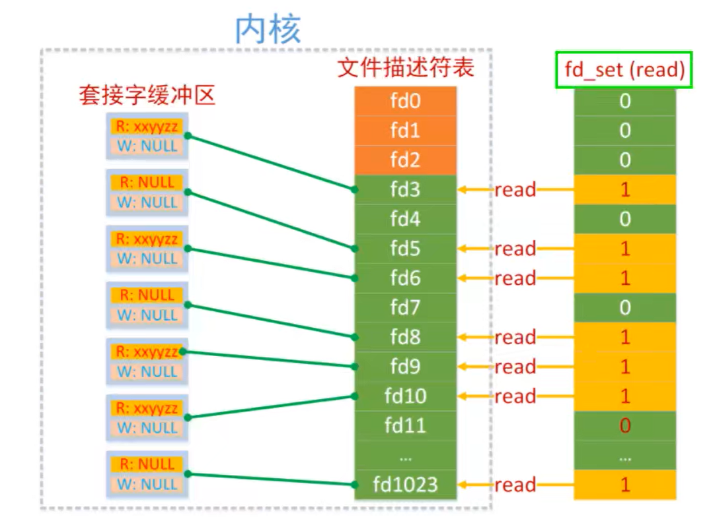
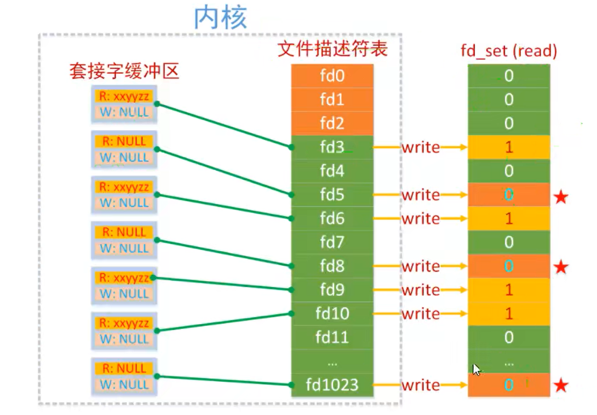

1. I/O多路复用:单线程或单进程同时监测若干个文件描述符(监听文件描述符、通信文件描述符)是否可以执行IO操作的能力
2. 发展历程:一切的开始,都起源于这个`read`函数是操作系统提供的,而且是阻塞的,我们叫它阻塞IO.为了破这个局,程序员在用户态通过多线程来防止主线程卡死(阻塞).后来操作系统发现这个需求比较大,于是在操作系统层面提供了非阻塞的`read`函数,这样程序员就可以在一个线程内完成多个文件描述符的读取,这就是非阻塞IO.但多个文件描述符的读取就需要遍历,当高并发场景越来越多时,用户态遍历的文件描述符也越来越多,相当于在`while`循环里进行了越来越多的系统调用.后来操作系统又发现这个场景需求量较大,于是又在操作系统层面提供了这样的遍历文件描述符的机制,这就是IO多路复用.多路复用有三个函数,最开始是`select`,然后又发明了`poll`解决了`select`文件描述符的限制，然后又发明了`epoll`解决`select`的三个不足
3. I/O多路复用通常与非阻塞I/O一起使用,这意味着当没有数据可用时系统调用不会阻塞进程(线程),而是立即返回一个错误或特定的状态.这种方式可用避免浪费CPU时间在等待I/O操作完成上,使得程序能够更加响应快速地处理其它任务
4. 举个例子,一个常见的使用多路复用的情况是网络编程中的服务器.服务器可能需要同时处理多个客户端的连接请求.通过使用多路复用，服务器可以同时监听多个客户端连接,而不必为每个连接创建一个线程或进程.这样可以更高效地利用系统资源,并且可以更容易地管理并发连接
5. `epoll`比`poll`和`select`效率更高:
   ```C++
   1. epoll:linux,底层是红黑树(无检测上限)
   2. select:可以跨平台,底层是线性表(默认的检测上限1024)
   3. poll:linux,底层是线性表
   ```
6. IO多路复用就是通过内核同时监听若干个文件描述符, 然后将可以进行IO操作的文件描述符告诉我们,即读缓冲区或写缓冲区可以进行操作,那么可以调用相应的`read`或`write`方法.此时调用`read  write`是不会阻塞的,因为此时内核已经把文件描述符是否可以进行IO操作的检测做完了.但是需要注意:假设内核检测后告诉我们有10个文件描述符是可以进行IO操作的,此时虽然检测是同时的,但是在实际处理各个新连接或通信数据的时候是顺序进行的.(I/O多路复用确实允许程序同时监视多个文件描述符,并且在任何一个文件描述符上发生事件时能够立即响应.这种并行性是指程序可以同时监视多个文件描述符的状态,而不必等待一个文件描述符的 I/O 操作(`read write accept等`)完成后再监视另一个文件描述符.然而,对于每个文件描述符的处理,在事件发生时,通常是按顺序进行的.<mark>这意味着在事件循环中,程序会逐个检查每个文件描述符的状态,如果有事件发生,则按顺序处理.即文件描述符的处理是按顺序处理的,只是并行检测而已</mark>.因此,虽然程序可以并行地监视多个文件描述符的状态,但实际的处理过程可能是顺序执行的)
7. 文件描述符就绪<=>对应的读缓冲区/写缓冲区可以进行IO操作
8. `accept`和`read`在服务器端对应的是套接字的读缓冲区,`write`对应的是写缓冲区
9. 多路复用适合处理连接数较多但每个连接的工作量不大(每个客户端和服务器交互过程很小,主要是在建立连接上)的场景,如高并发的网络服务器(即大部分实际时间都在IO操作上)
10. <mark>每个文件描述符对应的都是一个读缓冲区和写缓冲区</mark>
11. `select`:
   ```C++
   struct timeval{
      time_t tv_sec;//秒
      suseconds_t tv_usec;//毫秒
   };
   int select(int nfds, fd_set* readfds, fd_set* writefds, fd_set* exceptfds, struct timeval* timeout);
   //nfds:委托内核检测的这三个集合中最大的文件描述符(值)+1
   //readfds:文件描述符集合,内核只检测这个集合中文件描述符对应的读缓冲区.检测这些文件描述符对应的读缓冲区是不是可读
   //writefds:文件描述符集合,内核只检测这个集合中文件描述符对应的写缓冲区.检测这些文件描述符对应的写缓冲区是不是可写
   //exceptfds:检测这些文件描述符对应的缓冲区是不是异常
   //timeout:select函数的检测时长.如果指定为NULL,并不是说不阻塞,而是说当select检测的集合里若没有文件描述符就绪,那么就让select函数一直检测;当出现了就绪的文件描述符,select就可以返回了

   //返回值为就绪的文件描述符个数.readfds writefds exceptfds返回后是会被修改的
   ``` 
12. `fd_set`:
    内核在顺序遍历这个读集合的过程中,如果被检测的文件描述符对应的读缓冲区中没有数据,内核将修改这个文件描述符在读集合`fd_set`中对应的标志位,改为0,如果有数据那么标志位的值不变,还是1

    当`select()`函数解除阻塞后,被内核修改过的读集合通过参数传出,此时集合中只要标志位的值还为1,那么它对应的文件描述符肯定是就绪的,我们就可以基于这个文件描述符和客户端建立新连接或通信了
13. 相关操作函数:
    ```C++
    1. FD_ZERO(fd_set *set);//清空文件描述符集合.它将给定的fd_set数据结构中的所有位置都设置为0
    2. FD_SET(int fd, fd_set *set);//将指定的文件描述符fd添加到文件描述符集合中.这意味着将fd对应的位设置位1,表示该文件描述符处于就绪状态.在调用select之前,应该使用此函数将要监视的文件描述他添加到fd_set中
    3. FD_ISSET();//检查指定的文件描述符fd是否在文件描述符集合中被设置.如果fd对应的位=1,则表示该文件描述符处于就绪状态,该函数返回非零值;否则返回0.通常在调用select后使用此函数检查哪些文件描述符已准备好进行I/O操作
    4. FD_CLR();//将指定的文件描述符fd从文件描述符集合中清除.这意味着将fd对应的位设置为0,表示不再监视该文件描述符
    ```
14. IO多路复用的优点:
    * 资源节约:IO多路复用可以通过一个线程同时监视多个IO事件,而不是为每个IO事件创建一个线程或进程
    * 高并发性:通过IO多路复用,一个线程可以同时处理多个IO时间,因此能够更高效地处理大量并发连接
    * 低延迟
    * 简化代码逻辑
15. IO事件:指的是输入/输出操作发生或完成时发生的事件.在计算机系统中,IO事件通常与IO操作相关联,例如从文件读取数据、向网络发送数据等,具体IOP事件包括:
    * 可读事件:当一个IO通道(套接字、管道、文件等)中有数据可读时(如套接字的读缓冲区有数据时),会触发可读事件
    * 可写事件:当一个IO通道有足够的空间可以接收新的数据时,会触发可写事件
    * 异常事件:当IO通道发生异常(如套接字连接中断、套接字错误等)时,会触发异常事件
16. `epoll`的相关操作函数:
    ```C++
    1. int epoll_create(int size);//创建epoll实例,通过一颗红黑树管理待检测集合,这个参数在新版linux已经没什么用了,只需给一个大于0的数就行
    2. int epoll_create1(int flags);//flags是一个整数,可以传递0或一个标志位EPOLL_CLOEXEC(意味着在调用exec函数时会关闭该文件描述符)
    3. int epoll_ctl(int epfd, int op, int fd, struct epoll_event* event);//管理红黑树上的文件描述符(添加、修改、删除)
    //epfd:epoll的文件描述符,epoll_create的返回值
    //op:指定epoll树上的操作.EPOLL_CTL_ADD、EPOLL_CTL_MOD、EPOLL_CTL_DEL等
    //fd:待操作的文件描述符
    //event:文件描述符fd对应的事件(如:读事件、写事件、异常事件)
    4. int epoll_wait(int epfd, struct epoll_event* events, int maxevents, int timeout);//检测epoll树中是否有就绪的文件描述符,返回值是就绪文件描述符的个数
    //maxevents:指定events数组的最大容量
    //events:就是内核将就绪事件复制到的用户空间
    ```
16. 在服务器端使用`epoll`:
    * 创建`epoll`实例(树):`int epfd = epoll_create1(0);`
    * 将用于监听的套接字添加到`epoll`树中:
        ```C++
        struct epoll_event ev;
        ev.events = EPOLLIN;
        ev.data.fd = lfd;
        int ret = epoll_ctl(epfd, EPOLL_CTL_ADD, lfd, &ev);
        ```
    * 检测添加到`epoll`树的文件描述符是否就绪:`int num = epoll_wait(epfd, evs, size, -1);`
      - 如果是监听描述符,则建立连接:
        ```C++
        int cfd = accept(curfd, NULL, NULL);
        ev.events = EPOLLIN;
        ev.data.fd = cfd;
        epoll_ctl(epfd, EPOLL_CTL_ADD, cfd, &ev);
        ```
      - 如果是通信文件描述符,则进行通信:
        ```C++
        int len = recv(curfd, buf, sizeof(buf), 0);
        if(len==0){
            epoll_ctl(epfd, EPOLL_CTL_DEL, curfd, NULL);
            close(curfd);
        } 
        else if(len>0){
            send(curfd, buf, len, 0);
        }
        ```
17. `struct epoll_event`结构体:
    ```C++
    typedef union epoll_data{
        void *ptr;
        int fd;
        uint32_t u32;
        uint64_t u64;
    }epoll_data_t;

    struct epoll_event{
        uint32_t events;//EPOLLIN、EPOLLOUT、EPOLLRDHUP、EPOLLPRI、EPOLLERR、EPOLLHUP、EPOLLET等
        epoll_data_t data;//用户所操作的共用体数据(内核不会拿来用,用户写程序需要用,比如:使用其中的fd来记录此时的就绪的文件描述符的具体值),这个数据需要用户在epoll_ctl()前传入,一般是使用fd
    }
    ```
18. `poll`效率比`select  poll`更高效的原因:
    * 事件通知方式:`epoll`使用事件通知的方式,而不是轮询
    * 文件描述符管理:`epoll`使用红黑树的数据结构来管理文件描述符,这使得`epoll`能快速处理大量的描述符,而不会随着文件描述符数量的增加而降低性能
    * 无限扩展性:`epoll`支持边缘触发模式,这意味着它能够处理非阻塞的IO
    * 内核空间与用户空间的拷贝次数减少:`epoll`可以使用`epoll_ctl()`一次性注册大量的文件描述符(使用`EPOLL_CTL_AD_BATCH`操作):
        ```C++
        int epfd = epoll_create(1);
        struct epoll_event events[MAX_EVENTS];
        // 设置事件类型
        for (int i = 0; i < MAX_EVENTS; ++i) {
            events[i].events = EPOLLIN;  // 这里只关心可读事件
            events[i].data.fd = i + 1;   // 假设文件描述符从1开始
        }
        // 一次性注册多个文件描述符
        int ret = epoll_ctl(epfd, EPOLL_CTL_ADD_BATCH, 1, events);//此时的fd=1表示要注册的一系列文件描述符的起始位置
        ```
19. 事件通知方式:
    * `select`:使用轮询方式,即程序会主动的反复询问内核每个文件描述符是否有(IO)事件发生.`select`发生轮询主要是在阻塞等待的步骤处,在调用`select`函数后,程序会进入阻塞状态,等待文件描述符上的事件发生,这个等待过程实际上是通过<mark>程序不断主动轮询所有的文件描述符</mark>来完成的
    * `epoll`:使用事件通知的方式,当文件描述符上有(IO)事件发生时,内核会主动通知程序,而不需要程序不断地询问.`epoll`通过内核通知的机制：
        - 就绪事件列表:内核维护了一个就绪事件列表,当程序调用`epoll_ctl()`函数向`epoll`实例注册文件描述符时,内核会在内部维护一个数据结构来管理这些文件描述符及对应的事件,当文件描述符上有事件发生时,内核就会将这些就绪事件添加到就绪事件列表中.就绪事件列表是由内核自动维护的,程序无需显式操作
        - 用户态缓冲区:当程序调用`epoll_wait()`函数时,<mark>内核就会主动将就绪事件从内核空间复制到用户空间的缓冲区</mark>中,程序可以从这个缓冲区中读取就绪事件
20. <span style="color:red;">在服务器使用`select  poll  epoll`的构造流程都是类似的,思路都是一致的.如:对于就绪的文件描述符要分成监听文件描述符和通信文件描述符两种情况单独处理</span>
21. `epoll`的水平触发模式(LT):LT也是默认工作模式.其特点:
    * 读事件:如果文件描述符对应的读缓冲区还有数据,读事件就会被触发,`epoll_wait()`解除阻塞
        - 当读事件被触发,`epoll_wait()`解除阻塞,之后就可以接收数据了
        - 如果接收数据的buf很小,不能全部将缓冲区数据读出,那么读事件会继续被触发,直到数据被全部读出,如果接收数据的内存相对较大,读数据的效率也会较高
    * 写事件:如果文件描述符对应的写缓冲区可写,写事件就会被触发,其特点:
        - 当写事件被触发,`epoll_wait()`解除阻塞,之后就写入数据了
        - 如果写缓冲区没有被写满,写事件会一直被触发
22. `epoll`的边沿触发模式(ET),ET模式在很大程度上减少了`epoll`事件被重复触发的次数,因此效率要比`LT`模式高:
    * 读事件:当读缓冲区有新的数据进入,读事件被触发一次,没有新数据不会触发该事件
        - 如果有新数据进入到读缓冲区,该事件被触发,`epoll_wait()`解除阻塞
        - 如果数据没有被全部读走,并且没有新数据进入,那么读事件就不会再次被触发(注:不会清空缓冲区)(这种情况只是针对通信套接字符中的`read/recv`,而`accept`是不会读不完的)
        - 如果数据被全部读走或只读走一部分,此时有新数据进入,读事件被触发,并且还是只通知一次 
    * 写事件:当写缓冲区状态可写,写事件只会触发一次
        - 如果写缓冲区可写,写事件被触发,`epoll_wait()`解除阻塞
        - 写缓冲区从不满到被写满,期间写事件只会被触发一次
        - 写缓冲区从满到不满,状态会变为可写,写事件只会被触发一次
23. 设置ET模式:
    ```C++
    ev.events = EPOLLIN | EPOLLET;//读事件+ET模式
    ```
24. 总的来说,`epoll`的边沿模式下`epoll_wait()`检测到文件描述符有新事件才会再次通知,如果不是新的事件就不会通知,通知的次数比LT模式少,效率更高  
25. 通俗理解:ET模式就是要文件描述符一次就绪后,就要把事件做完,如果没做完,就会自动留到下一次解除`epoll_wait`阻塞才会被一起做(如:如果数据只被读走一部分,此时如果没有新数据进入,那么下一次epoll_wait()的时候这个文件描述符是不就绪的;如果有新数据进入,读事件才会再被触发);LT模式就是可以慢慢完成事件,没做完下一次还是就绪状态
26. `epoll`使用ET模式:
    * <mark>`epoll`在边沿模式下,必须要将套接字设置为非阻塞模式</mark>(不然会在最后一次读(写)完(满)缓冲区时会一直阻塞在`recv`(`send`)).此时会引发一个bug,在非阻塞模式下,当缓冲区读(写)完(满),再调用`recv`(`send`)函数会继续从(向)缓冲区读(写)数据,此时就会直接报错`Resource temporarily unavailable`,对应的全局变量`errno`被设置为`EAGAIN/EWOULDBLOCK`,所以此时应该直接判断`erron`是否为`EAGAIN`,进而来知道是否缓冲区空(满)了
    * 将套接字默认的阻塞行为修改为非阻塞:
        ```C++
        #include <fcntl.h>
        
        int flag = fcntl(cfd, F_GETFL);
        flag |= O_NONBLOCK;
        fcntl(cfd, F_SETFL, flag);
        ```
27. `epoll`相关的操作函数是线程安全的函数,所以对这些函数操作时不需要加锁
28. `select()    epoll_wait()`在等待就绪文件描述符时都是阻塞的

