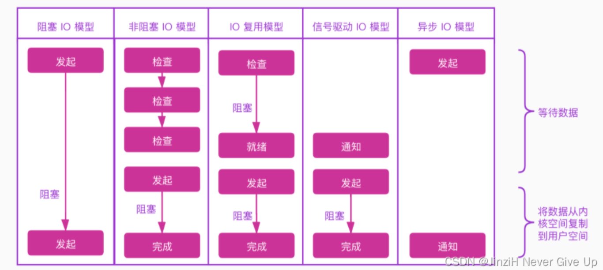

1. I/O就是计算机内存与外部设备之间拷贝数据的过程,CPU访问内存的速度远远高于外部设备,因此CPU是先把外部设备的数据读到内存(缓冲区)里,然后再进行处理
2. `BIO`:同步阻塞式IO;`NIO`:同步非阻塞式IO;`AIO`:异步非阻塞式IO
3. 五种主要的IO模型
   * 同步阻塞IO:用户线程发起 read 调用后就阻塞了,让出 CPU.内核等待网卡数据到来,把数据从网卡拷贝到内核空间,接着把数据拷贝到用户空间,再把用户线程叫醒
    
   * 同步非阻塞IO:用户线程不断的发起 read 调用,数据没到内核空间时,每次都返回失败,直到数据到了内核空间,这一次 read 调用后,在等待数据从内核空间拷贝到用户空间这段时间里,线程还是阻塞的,等数据到了用户空间再把线程叫醒
   
   * IO多路复用:
    
   * 信号驱动IO:信号驱动IO不是用轮询的方式去监控数据就绪状态,而是在调用`sigaction`时候建立一个`SIGIO`的信号联系,当内核触发`SIGIO`信号应用程序直接执行处理函数.`SIGIO`信号的几种触发情况:
     - 文件描述符可读:当文件描述符处于非阻塞模式下,并且有数据可读时,会触发`SIGIO`信号.这意味着可以从该文件描述符中读取数据而不会被阻塞 
     - 文件描述符可写:如果文件描述符处于非阻塞模式下,并且可以进行写操作(例如输出到文件或者套接字),则会触发`SIGIO`信号
     - 异常条件:有些特殊的情况下,如套接字出现异常条件(例如带外数据到达),也会触发`SIGIO`信号
   * 异步IO:用户线程发起`read`调用的同时注册一个回调函数,`read`立即返回,等内核将数据准备好后,再调用指定的回调函数完成处理.在这个过程中,用户线程一直没有阻塞
    
   
4. 信号驱动IO:
   ```C++
   #include <iostream>
   #include <csignal>
   #include <unistd.h>
   #include <fcntl.h>
   #include <cstring>
   // 定义信号处理函数
   void handle_signal(int signal) {//signal参数会传入触发了信号的信号类型,比如此时是传入SIGIO
      std::cout << "Received signal: " << signal << std::endl;
   }
   int main() {
      // 设置信号处理函数  SIGIO=异步I/O信号
      signal(SIGIO, handle_signal);//将SIGIO信号与handle_signal函数关联起来.当SIGIO信号触发时,系统会调用 handle_signal 函数
      // 打开一个文件
      int fd = open("example.txt", O_RDONLY);
      if (fd < 0) {
         std::cerr << "Error opening file!" << std::endl;
         return 1;
      }
      //设置文件描述所有者为当前进程
      if (fcntl(fd, F_SETOWN, getpid()) < 0) {
         std::cerr << "Error setting owner!" << std::endl;
         return 1;
      }
      // 设置文件描述符为异步模式
      int flags = fcntl(fd, F_GETFL);
      if (fcntl(fd, F_SETFL, flags | O_ASYNC) < 0) {//启用异步I/O
         std::cerr << "Error setting async mode!" << std::endl;
         return 1;
      }
      // 进入事件循环
      while (true) {
         sleep(1); // 模拟其他任务的执行

         // 在这里进行其他任务，当有信号触发时，handle_signal 函数会被调用
      }
      // 关闭文件
      close(fd);
      return 0;
   }
   ```
5. 信号驱动IO可以理解为将IO多路复用的第一个阻塞情况给消除了,即它不会像`select()`那样阻塞,而是可以继续执行其他任务,但是它还是可能会阻塞在事件处理上(如:`recv send`),其设置步骤:
   * 设置信号处理器:通常程序会设置一个信号处理器来处理IO事件,通常使用`sigaction()`函数注册一个信号处理器,比如`SIGIO`或`SIGPOLL`信号
   * 将文件描述符设置为非阻塞:对于进行信号驱动 I/O 的文件描述符,需要将其设置为非阻塞模式
   * 等待事件:即进入事件循环
6. 虽然信号驱动IO可以避免第一步的阻塞,但由于它的信号处理器的开销和信号处理的不确定性,它在高并发情况下可能会导致性能下降.与因此,信号驱动IO不适合在大规模网络服务器用(不适合高并发情况)
7. 异步IO消除了IO多路复用的两个阶段的阻塞,它将那两个阶段都交给内核来做.但是在高并发处理中还是IO多路复用更好
