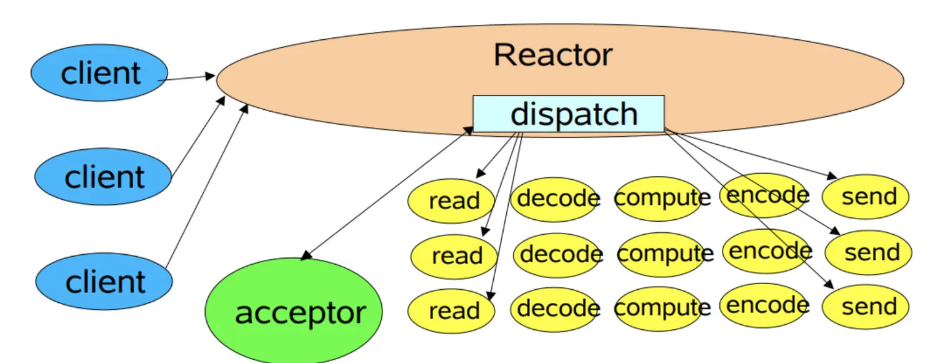
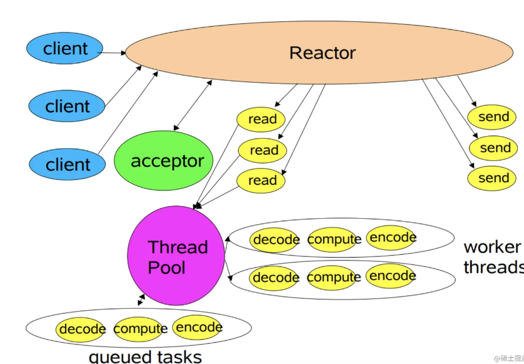

1. `Reactor`是一种事件驱动的设计模式,用于构建高效的并发应用程序.`select()  poll()  epoll()`是`linux`中用于实现`Reactor`模式的IO多路复用系统调用,即可以看作是`Reactor`模式的一种具体实现方法
2. 虽然`select()`的事件通知方式是使用轮询,但它也是基于事件驱动的
3. `reactor`模型是网络服务器端用来处理高并发IO请求的模型
4. `reactor`模型有三个角色:
   * `reactor`:负责事件监听和事件分发->(`select  epoll_wait等`)
   * `acceptor`:负责连接事件(`accept`)
   * `handler`:负责读写事件(`recv  send`)
5. `reactor`三种模型:
   * 单线程:`reactor acceptor handler`都是一个线程执行
   
   * 多线程:`reactor acceptor handler`都是一个线程执行,但是与此同时,会有一个线程池由若干`worker`线程组成,即此时的`handler`只负责读取请求`recv`和写回结果`send`,而具体的业务处理由`worker`线程完成
   
   * 主从多线程:一个主`reactor`线程:负责监听客户端事件,并在线程中让`acceptor`处理连接,即`select()+accept()`.多个子`reactor`线程负责连接后的后续事件处理,如`recv  send`,而具体的业务处理函数会让`worker`线程完成,即此时是相对于多线程把`handler`给放在子`reactor`线程处理了
   
6. `reactor`模式是一种事件驱动的模式,所以使用`select() poll() epoll()`进行IO多路复用的服务端也就是采用了`reactor`设计模式