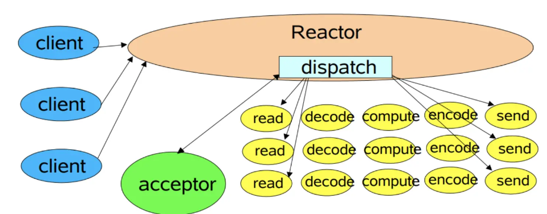
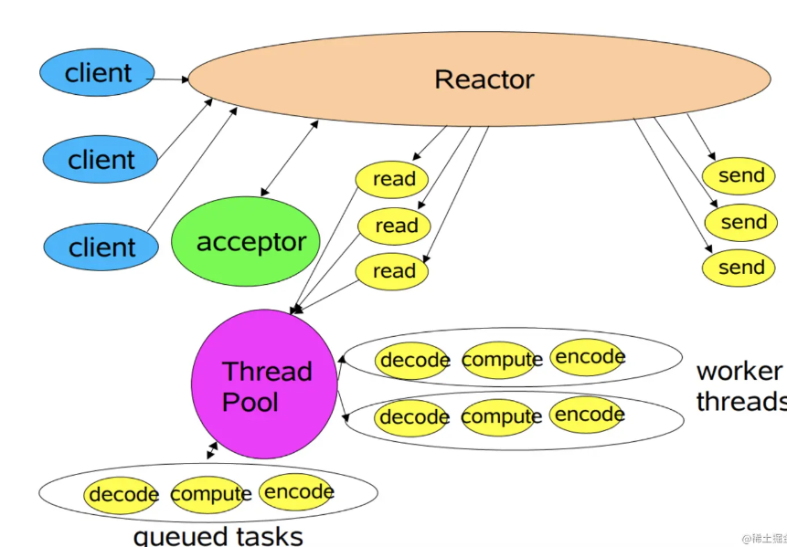
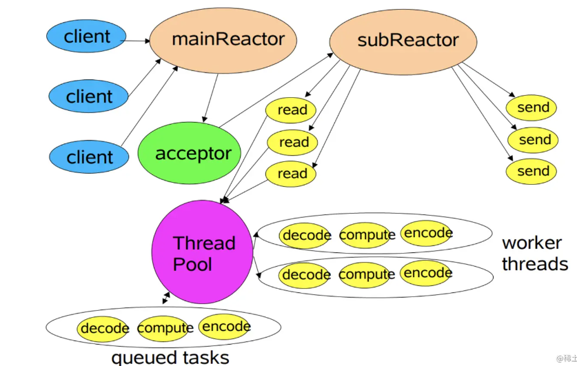
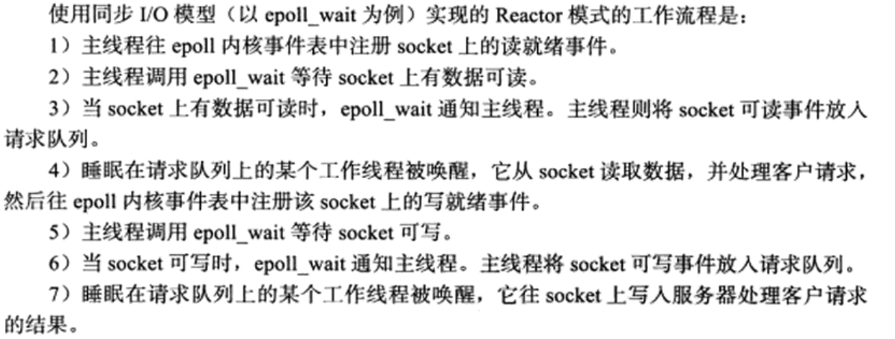
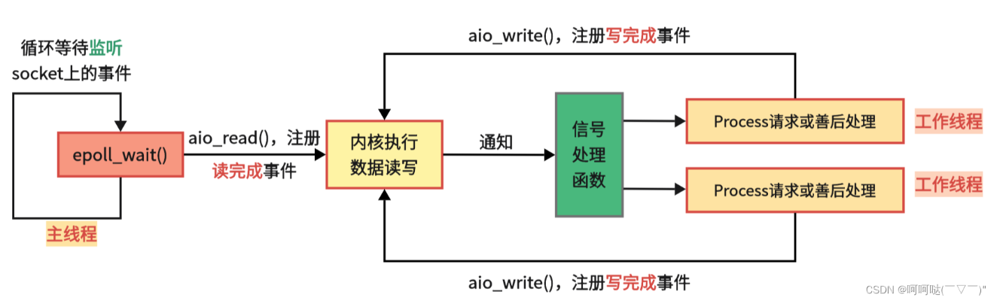

1. `Reactor`是一种事件驱动的设计模式,用于构建高效的并发应用程序.`select()  poll()  epoll()`是`linux`中用于实现`Reactor`模式的IO多路复用系统调用,即可以看作是`Reactor`模式的一种具体实现方法
2. 虽然`select()`的事件通知方式是使用轮询,但它也是基于事件驱动的
3. `reactor`模型是网络服务器端用来处理高并发IO请求的模型
4. `reactor`模型有三个角色:
   * `reactor`:负责事件监听和事件分发->(`select  epoll_wait等`)
   * `acceptor`:负责连接事件(`accept`)
   * `handler`:负责读写事件(`recv  send`)
5. `reactor`三种模型:
   * 单线程:`reactor acceptor handler`都是一个线程执行
   
   * 多线程:`reactor acceptor handler`都是一个线程执行,但是与此同时,会有一个线程池由若干`worker`线程组成,即此时的`handler`只负责读取请求`recv`和写回结果`send`,而具体的业务处理由`worker`线程完成
   
   * 主从多线程:一个主`reactor`线程:负责监听客户端事件,并在线程中让`acceptor`处理连接,即`select()+accept()`.多个子`reactor`线程负责连接后的后续事件处理,如`recv  send`,而具体的业务处理函数会让`worker`线程完成,即此时是相对于多线程把`handler`给放在子`reactor`线程处理了
   
6. `reactor`模式是一种事件驱动的模式,所以使用`select() poll() epoll()`进行IO多路复用的服务端也就是采用了`reactor`设计模式
7. `《Linux高性能服务器编程》`中说`reactor`在高并发处理时要设计成主线程只负责监听(`select epoll_wait`)文件描述符上是否有事件发生,而不做任何其它实质性的工作.`accept recv send`以及对应的`task`都要在工作线程中完成
   
8. 虽然`select()`在实现上可能采用了不同的机制(如轮询或底层操作系统提供的事件通知机制),但从调用者的角度来看,它确实是基于事件驱动的,因为程序会在事件发生时被唤醒并处理相应的事件
9. 与`reactor`模式不同,`proactor`模式将所有IO操作(`accept recv send`)都交给主线程和内核(异步则操作系统(内核)来IO操作)来处理,工作线程仅负责处理逻辑
10. `reactor`是同步IO模式,`proactor`是异步IO模式,它感知的是已完成的读写事件.在发起异步读写请求时,需要传入数据缓冲区的地址(用来存放结果数据)等信息,这样系统内核才可以自动帮我们把数据的读写工作完成,这里的读写工作全程由操作系统(内核)来做,而主线程可以处理其它逻辑
11. `reactor`和`proactor`都是基于事件驱动的网络编程模式,区别在于`reactor`模式是基于<mark>就绪</mark>的IO事件,而`proactor`模式则是基于<mark>已完成</mark>的IO事件(内核已完成IO操作,那么此时内核会通知主线程).`proactor`关注的是完成事件而不是就绪事件,`proactor`工作流程:
    * 主线程调用`aio_read`函数向内核注册`socket`上的读完成事件,并告诉内核用户读缓冲区的位置,以及读操作完成时如何通知应用程序(这里以信号为例)
    * 主线程继续处理其他逻辑
    * 当 `socket` 上的数据被读入用户缓冲区后(即此时的读操作完成了),内核将向应用程序发送一个信号,以通知应用程序数据已经可用
    * 应用程序预先定义好的信号处理函数选择一个工作线程来处理客户请求.工作线程处理完客户请求后,调用`aio_write`函数向内核注册`socket`上的写完成事件,并告诉内核用户写缓冲区的位置,以及写操作完成时如何通知应用程序(这里以信号为例)
    * 主线程继续处理其他逻辑
    * 当用户缓冲区的数据被写入`socket`之后,内核将向应用程序发送一个信号,以通知应用程序数据已经发送完毕
    * 应用程序预先定义好的信号处理函数选择一个工作线程来做善后处理,比如决定是否关闭`socket`
   
12. <mark>如果程序是计算密集型的,并发编程没有优势,反而由于任务的切换使效率降低;但如果程序使IO密集型的,比如经常读写文件,访问数据库等,则情况不同,此时并发编程很高效.由于IO操作的速度远没有CPU的计算速度快,所以让程序阻塞于IO操作将浪费大量的CPU时间</mark>
13. Linux2.6后才引入异步AIO接口`aio_read() aio_write()`等,对于实际应用中,大部分都是直接采用`reactor`模式