# 基础
1. `net start mysql80`:这条命令在`Windows`命令提示符下管理员运行,用来启动名为`mysql80`的`MySQL`服务(`mysql80`:这是`MySQL 8.0`的服务名称.不同的`MySQL`版本或者实例可以有不同的服务名,具体取决于安装时的配置.默认情况下,`MySQL 8.0`的服务名通常是 `mysql80`)
2. `mysql`中是表的数据结构,一行就是一条记录,一列就是一个字段(即这个记录对应的属性)
3. `mysql -u root -p`:按根用户进入`mysql`,需要输入密码:014779
4. `SQL`中的字符串类型:`varchar()`<=>`char[]`
5. `SQL`语言分为四种:`DDL DML DQL DCL`
   * `DDL`:数据定义语言,用来定义数据库对象(数据库、表、字段)
   * `DML`:数据操作语言,用来对数据库表中的数据进行增删改
   * `DQL`:数据查询语言,用来查询数据库中表的记录
   * `DCL`:数据控制语言,用来创建数据库用户、控制数据库的访问权限
6. `DDL`-数据库操作:
   * `SHOW DATABASES;`:查询所有数据库
   * `SELECT DATABASE();`:查询当前正在使用的数据库
   * `CREATE DATABASE [IF NOT EXISTS] 数据库名 [DEFAULT CHARSET 字符集] [COLLATE 排序规则];`:创建数据库(`create database if not exists test`:不存在`test`数据库就创建)
   * `DROP DATABASE [IF EXISTS] 数据库名`:删除数据库
   * `USE 数据库名`:使用指定数据库  这个指令会切换到指定的数据库中去
7. `DDL`-表操作
   * 查询
     * `SHOW TABLES;`:查询当前数据库下的所有表
     * `DESC 表名;`:查询指定表的表结构
     * `SHOW CREATE TABLE 表名;`:查询指定表的建表语句
   * 创建
     * `CREATE TABLE 表名(字段1 字段1类型 [COMMENT 字段1注释,...]) [COMMENT 表注释]`:创建表
8. `MySQL`与`Redis`的区别:
   * `MySQL`:是关系型数据库,以表格的形式存储数据,每张表由行和列组成,行表示记录,列表示字段.数据通过定义好的表结构(如表字段的类型、长度等)来组织和存储.例如,一个用户信息表,通常会有用户`ID`、用户名、密码、邮箱等字段,每行代表一个用户的具体信息
   * `Redis`:是基于键值对存储的非关系型数据库(也称为`NoSQL`数据库),可以存储多种类型的数据结构,包括字符串、哈希、列表、集合、有序集合等.数据以键值对的形式存在,每个键是一个唯一的标识符,对应的值可以是各种数据结构.例如,可以将一个用户的登录信息存储为一个键值对,键可能是“user:login_info”,对应的值可以是一个哈希结构,包含用户的`IP`地址、登录时间等信息
9. 一条`SQL`语句就是一个事务,只是它一条`SQL`语句结束后就会自动提交
10. 主键约束:主键是用来唯一标识表中每一行记录的字段或字段组合
    * 唯一性:主键的值必须唯一,不能有重复
    * 非空性:主键的值不能为`null`
    * 不可更改性:主键的值一旦确定,通常不应该被修改
    * 单一性:一个表只能有一个主键,但主键可以由多个字段组成
    * 如果表中没有显示定义主键,`InnoDB`会:
      - 如果表中有非空的唯一索引(`UNIQUE`)索引,`InnoDB`会使用该索引作为主键
      - 如果表中没有非空的唯一索引,`InnoDB`会自动创建一个隐藏的6字节行`ID`,并将其用作聚集索引,这个隐藏的行`ID`是内部生成的,不会在表结构中显示出来 
# 多表查询
1. 
# 事务
1. 事务是一组操作的集合,它是一个不可分割的工作单位,事务会把所有的操作作为一个整体一起向系统提交或撤销操作请求,即这些操作要么同时成功,要么同时失败
2. 事务的语法:`BEGIN/START TRANSACTION`,`COMMIT`,`ROLLBACK`:将数据库恢复到事务执行之前的样子,即回滚一个事务
3. 事务的四个特性
   * 原子性:一个事务中的所有操作，要么全部完成，要么全部不完成，不会结束在中间某个环节，而且事务在执行过程中发生错误，会被回滚到事务开始前的状态，就像这个事务从来没有执行过一样
   * 一致性:是指事务操作前和操作后，数据库完整性不受破坏
   * 隔离性:数据库允许多个并发事务同时对其数据进行读写和修改的能力，隔离性可以防止多个事务并发执行时由于交叉执行而导致数据的不一致，因为多个事务同时使用相同的数据时，不会相互干扰，每个事务都有一个完整的数据空间，对其他并发事务是隔离的
   * 持久性:事务处理结束后，对数据的修改就是永久的，即便系统故障也不会丢失
4. 并发事务问题
   * 脏读:一个事务读到另外一个事务还没有提交的数据
   * 不可重复读:一个事务先后读取同一条记录,但两次读取的数据不同,称之为不可重复读
   * 幻读:一个事务按照条件查询数据时,没用对应的数据行,但是在插入数据时,又发现这行数据已经存在,好像出现了"幻影"
5. `SQL`标准提出了四种隔离级别来规避上述的并发事务问题,隔离级别越高,性能效率越低.串行化>可重复读>读已提交>读未提交
   
# 存储引擎

# 索引
1. 索引是帮助存储引擎快速获取数据的一种数据结构(有序),形象的说就是索引是数据的目录.所以,要加快数据的查询,就是通过建立索引来提高查询的速度
2. 不同的存储引擎有不同的索引结构
3. 常见的索引结构:`B+Tree`索引、`Hash`索引、`R-tree`(空间索引)、`Full-text`(全文索引)
   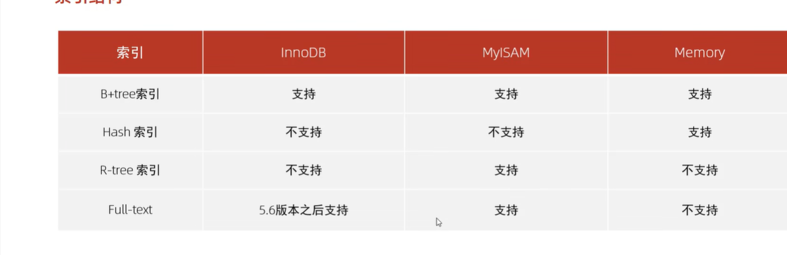
4. 红黑树是特殊的二叉平衡搜索树
5. `Btree`结构(多路平衡查找树):n个`key`有`n+1`个指针,5阶最大度就表示每个节点下最多有5个子节点(有4个`key`,5个指针).`B`树的插入构建过程就是一个中间节点向上分裂的过程,即该层节点超过阶数-1就会继续往上分裂,其动态演示过程:`https://www.cs.usfca.edu/~galles/visualization/BTree.html`
6. `B+Tree`数据结构和`BTree`类似,但是它的所有节点都会出现在叶子节点,它的非叶子节点只是起了索引的作用不存储具体数据;并且叶子节点形成了一个单向链表,其动态演示过程:`https://www.cs.usfca.edu/~galles/visualization/BPlusTree.html`
7. `mysql`对经典的`B+Tree`进行了优化,在原`B+Tree`的基础上,增加了一个指向相邻叶子节点的链表指针,就形成了带有顺序指针的`B+Tree`,提高区间访问的性能
   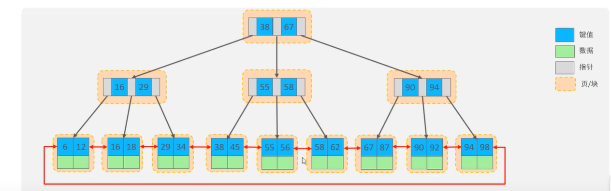
8. 哈希索引就是采用一定的`hash`算法,将键值换算成新的`hash`值,映射到对应的槽位上,然后存储在`hash`表中.`hash`索引特点:
   * `hash`索引只能用于对等比较(`=,in`),不支持范围查询(`between,>,<,...`)
   * 无法利用索引完成排序操作
   * 查询效率高,通常只需要一次检索就可以(无哈希冲突),效率高于`B+Tree`
9. 为什么`innoDB`存储引擎选择使用`B+Tree`?
   * `B+Tree`相对于二叉树,层级更少,搜索效率更高
   * 对于`BTree`,无论是叶子节点还是非叶子节点,都会保存数据,这样导致一页(固定16KB)中存储的键值减少,指针跟着减少,要同样保存大量数据,只能增加树的高度,导致性能降低
   * `hash`索引只支持等值比较,不支持范围查询;`B+Tree`还支持排序,`hash`不支持
10. 索引分类
   * 按存储分:聚集索引(必须有且只有一个)(有主键则就等于主键索引;没有主键就使用第一个唯一索引作为聚集索引;否则`innoDB`会自动生成一个`rowid`作为隐藏的聚集索引,)、二级索引(可以有多个)
      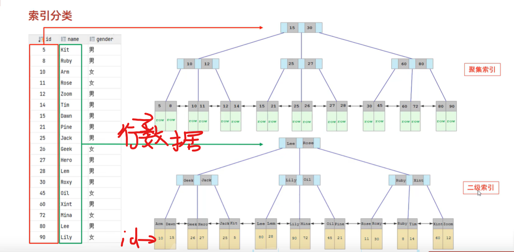
      查询所有字段时会从二级索引到聚集索引去查找,即先通过二级索引拿到`id`,再利用这个`id`去聚集索引中查找,即这就是回表查询
      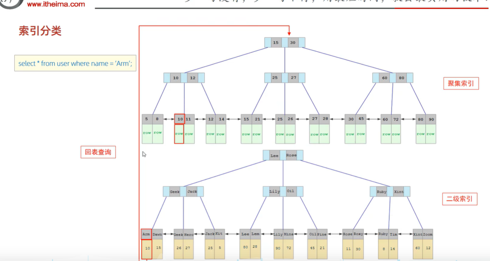
   * 按字段类型分:主键索引、唯一索引、常规索引(普通索引就是建立在普通字段上的索引，既不要求字段为主键，也不要求字段为 `UNIQUE`，即没有对字段列设置唯一性约束，可能找到多个主键id，需要多次回表操作)、前缀索引、全文索引
   * 按字段个数分:单列索引、联合索引(多个字段组合成一个索引作为`B+`树上的索引,而下方的值一般是主键`id`)
11. 不同层的页中每一个节点中保存的索引值是指向的页中最小的索引值
11. 聚集索引:表的数据都是存放在聚集索引的叶子节点里，所以 InnoDB 存储引擎一定会为表创建一个聚集，且由于数据在物理上只会保存一份，所以聚集只能有一个，聚集叶子节点存放的是实际数据，所有完整的用户记录都存放在聚集的叶子节点。叶子节点保存了该`id`对应的完整行记录,非叶子节点只是多一个最小主键`id`和页号(`id`和页号不算违背`B+`树非叶子节点只是起了索引的作用不存储具体数据的说法)
   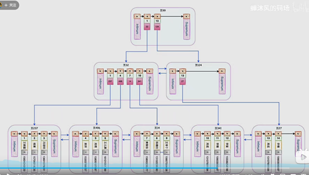
12. 二级索引：一张表只能有一个聚集索引，那为了实现非主键字段的快速搜索，就引出了二级索引（非聚集索引/辅助索引），它也是利用了 B+ 树的数据结构，但是二级索引的叶子节点存放的是主键值，不是实际数据。如果某个查询语句使用了二级索引，但是查询的数据不是主键值，这时在二级索引找到主键值后，需要去聚簇索引中获得数据行，这个过程就叫作回表，也就是说要查两个 B+ 树才能查到数据。二级索引中，非叶子节点会保存该索引对应的主键`id`和其指向的页号(注意:这里并不和`B+`树非叶子节点不保存数据相违背,对于二级索引每个节点只会多一个`id`和页号,并不是数据库表中某一行的完整记录,这个完整记录在聚集索引的非叶子节点中保存)
   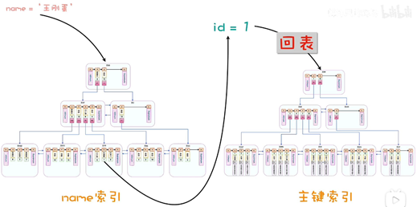
13. 联合索引:通过将多个字段（name\phone列）组合成一个索引，联合索引存在最左前缀匹配原则，按照最左优先的方式进行索引的匹配，先对name进行排序，再对phone进行排序，如果不遵守最左匹配原则，phone列是乱序的，起不到索引作用,即索引失效
   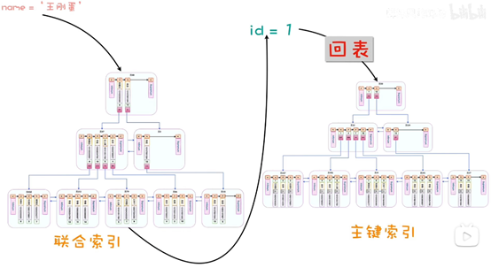
14. 前缀索引:当字段类似为字符串时,有时候需要索引很长的字符串,这会让索引变得很大,查询时,浪费大量的磁盘IO,影响查询效率.此时可以只将字符串的一部分前缀,建立索引,这样可以大大节约索引空间,从而提高索引效率
15. `mysql`中常规索引和唯一索引的区别
    常规索引可重复，唯一索引和主键一样不能重复。唯一索引可作为数据的一个合法验证手段，例如学生表的身份证号码字段，我们人为规定该字段不得重复，那么就使用唯一索引
16. `mysql`采用`B+`树作为索引的原因?
    * B+树与哈希表：Hash 在做等值查询的时候效率贼快，搜索复杂度为 O(1)。但是 Hash 表不适合做范围查询，它更适合做等值查询，这也是 B+Tree 索引要比 Hash 表索引有着更广泛的适用场景的原因
    * B+树与二叉树（红黑树）：对于有 N 个叶子节点的 B+Tree，其搜索复杂度为O(logdN)，其中 d 表示节点允许的最大子节点个数为 d 个;而对于二叉树,二叉树的每个父节点的儿子节点个数只能是 2 个，意味着其搜索复杂度为 O(logN)，这已经比 B+Tree 高出不少，因此二叉树检索到目标数据所经历的磁盘 I/O 次数要更多
    * B+树与B树：B+Tree 只在叶子节点存储数据，而 B 树 的非叶子节点也要存储数据，所以 B+Tree 非叶子节点只存储键值,这意味着B+树的非叶子节点可以存储更多的键值,从而减少了树的高度，高度越低，查询时磁盘I/O次数就越少。另外，B+Tree 叶子节点采用的是双链表连接，适合 MySQL 中常见的基于范围的顺序查找，而 B 树无法做到这一点（B树要范围查找就要在多个节点之间跳跃,效率很低）。总的来说，B+Tree 相比于 B 树和二叉树来说，最大的优势在于查询效率很高，因为即使在数据量很大的情况，查询一个数据的磁盘 I/O 依然维持在 3-4次
17. 索引涉及原则:
    * 针对于数据量较大,且查询比较频繁的表建立索引
    * 针对于常作为查询条件、排序、分组操作的字段建立索引
    * 尽量选择区分度高的列作为索引,尽量建立唯一索引,区分度越高,使用索引的效率越高
    * 如果是字符串类型的字段,字段的长度较长,可以针对于字段的特点,建立前缀索引
    * 尽量使用联合索引,减少单列索引,查询时,联合索引很多时候可以成为覆盖索引,节省存储空间,避免回表,提高查询效率
    * 要控制索引的数量,索引并不是多多益善,索引越多,维护索引结构的代价也就越大
    * 如果索引列不能存储`null`值,请在创建表时用`not null`约束它.当优化器知道每列是否包含`null`值时,它可以更好地确定哪个索引最有效地用于查询
18. `SQL`优化主要就是指的查询语句,其中索引的优化又占主要部分
19. `MySQL`性能分析的方法:
    * 使用`explain`语句,它能显示`mysql`如何执行查询,包括使用的索引、表的访问方式等信息
    * `show profiles`:查看每一条`sql`语句的耗时,以及耗时发生在哪
    * `SQL`执行频率:查看当前数据库的增删改查频次
    * 启用慢查询日志,再分析慢查询日志,找出性能较差的查询语句
20. 怎么加快`mysql`数据库中表的数据?
    利用索引
    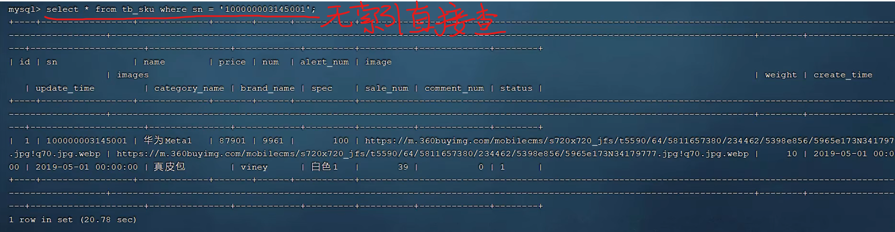
    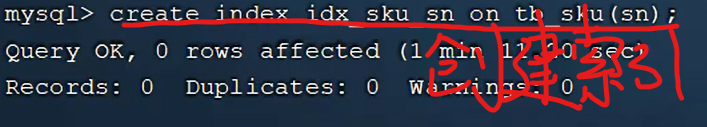
    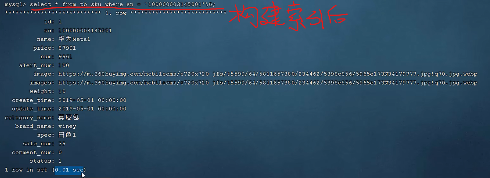
21. 索引使用规则:最左前缀法则:如果索引了多列(联合索引),要遵守最左前缀法则,指的是查询从索引的最左列开始,并且不跳过中间索引的列,如果跳过某一列,后面的字段将索引失效,即后面字段变成全文扫描了(注意再联合索引使用查询多个字段时,最左前缀法则没有对字段的前后顺序有要求,可以放在前面,也可以放在后面)
22. 索引失效的情况
    * 联合索引不满足最左前缀法则,则不满足的地方后方字段索引失效
    * 联合索引中,出现范围查询(`>  <`),范围查询的右侧的列的索引失效(可以改成`>=   <=`)
    * 不要在索引列上进行运算,否则这个列的索引将失效,`select * from tb_user where substring(phone,10,2)='15'`
    * 字符串类型字段使用时,不加引号,这个字段列的索引将失效;但是数字类型字段加引号不会使这个字段列的索引失效(`mysql`会自动将字符串类型转换为数字类型)
    * 模糊查询:使用`%`或`_`开头的`like`(`=`变成`like`)查询，`MySQL`无法确定以什么开头的记录可以匹配查询条件，造成索引失效。解决这个问题考虑使用全文索引或者其他优化方案(尾部模糊时索引不会失效,头部模糊时索引会失效),如`select * from tb_user where profession like '%工程'`
    * 查询语句时,用`or`分隔开的查询条件,如果`or`前的条件中的列有索引,而后面的列中没有索引,那么涉及的索引都不会被用到
    * 数据分布影响:如果`mysql`评估使用索引比用全表慢,那么就不会使用索引                                         
23. `SQL`提示是优化数据库的一个重要手段,即在`SQL`语句中加入一个人为的提示来达到优化索引的目的
    * 告诉数据库使用哪个索引:`use index`(`select * from tb_user use index(idx_user_pro) where profession='软件工程`)
    * 告诉数据库不使用哪个索引:`ignore index`
    * 告诉数据库必须用哪个索引:`force index`
24. 覆盖索引:查询使用了索引,并且需要返回的字段列,在该索引中已经全部能够找到,不会回表查询.尽量使用覆盖索引,以此来减少`select *`(`select *`很容易回表查询)
    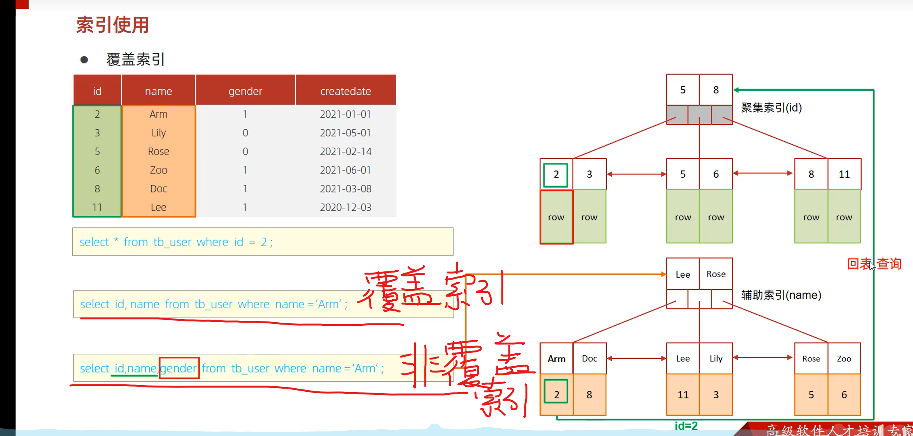
25. 根据`id`字段查询,即主键查询,效率最高,因为它直接走的是聚集索引,而不会回表查询
26. 最优方案是:使用联合索引(即一个二级索引),`id`作为叶子节点值,`username&password`作为索引值
    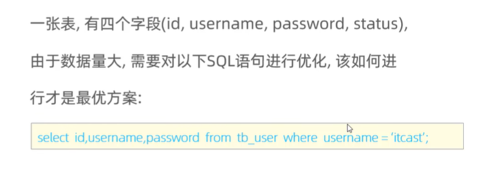
## InnoDB
1. `InnoDB`存储引擎将数据划分为若干个页,以页作为磁盘和内存之间交互的最小单位,默认大小是16KB
2. 对于主键索引:在一个页中,用户记录是按照主键由小到大串联而成的单向链表,每个页中,`InnoDB`会自动添加两条记录`infimum`最小记录(比这个页最小主键还小的记录)和`supremum`最大记录(比这个页最大主键还大的记录).在`InnoDB`存储引擎中,对于非叶子节点(索引页),它存储的是指向子页的指针和一个索引值,这个索引值是子页中最小的索引值,用于标识子页的范围.非主键索引是类似的,只是把索引从`id`变成其它字段
   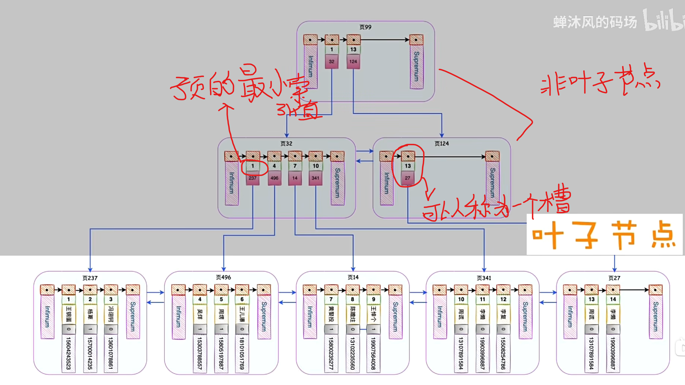