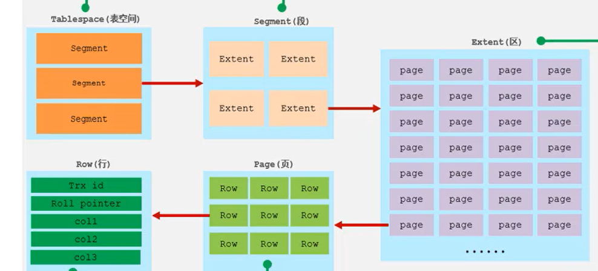

# 基础
1. `net start mysql80`:这条命令在`Windows`命令提示符下管理员运行,用来启动名为`mysql80`的`MySQL`服务(`mysql80`:这是`MySQL 8.0`的服务名称.不同的`MySQL`版本或者实例可以有不同的服务名,具体取决于安装时的配置.默认情况下,`MySQL 8.0`的服务名通常是 `mysql80`)
2. `mysql`中是表的数据结构,一行就是一条记录,一列就是一个字段(即这个记录对应的属性)
3. `mysql -u root -p`:按根用户进入`mysql`,需要输入密码:014779
4. `SQL`中的字符串类型:`varchar()`<=>`char[]`
5. `SQL`语言分为四种:`DDL DML DQL DCL`
   * `DDL`:数据定义语言,用来定义数据库对象(数据库、表、字段)
   * `DML`:数据操作语言,用来对数据库表中的数据进行增删改
   * `DQL`:数据查询语言,用来查询数据库中表的记录
   * `DCL`:数据控制语言,用来创建数据库用户、控制数据库的访问权限
6. `DDL`-数据库操作:
   * `SHOW DATABASES;`:查询所有数据库
   * `SELECT DATABASE();`:查询当前正在使用的数据库
   * `CREATE DATABASE [IF NOT EXISTS] 数据库名 [DEFAULT CHARSET 字符集] [COLLATE 排序规则];`:创建数据库(`create database if not exists test`:不存在`test`数据库就创建)
   * `DROP DATABASE [IF EXISTS] 数据库名`:删除数据库
   * `USE 数据库名`:使用指定数据库  这个指令会切换到指定的数据库中去
7. `DDL`-表操作
   * 查询
     * `SHOW TABLES;`:查询当前数据库下的所有表
     * `DESC 表名;`:查询指定表的表结构
     * `SHOW CREATE TABLE 表名;`:查询指定表的建表语句
   * 创建
     * `CREATE TABLE 表名(字段1 字段1类型 [COMMENT 字段1注释,...]) [COMMENT 表注释]`:创建表
8. `MySQL`与`Redis`的区别:
   * `MySQL`:是关系型数据库,以表格的形式存储数据,每张表由行和列组成,行表示记录,列表示字段.数据通过定义好的表结构(如表字段的类型、长度等)来组织和存储.例如,一个用户信息表,通常会有用户`ID`、用户名、密码、邮箱等字段,每行代表一个用户的具体信息
   * `Redis`:是基于键值对存储的非关系型数据库(也称为`NoSQL`数据库),可以存储多种类型的数据结构,包括字符串、哈希、列表、集合、有序集合等.数据以键值对的形式存在,每个键是一个唯一的标识符,对应的值可以是各种数据结构.例如,可以将一个用户的登录信息存储为一个键值对,键可能是“user:login_info”,对应的值可以是一个哈希结构,包含用户的`IP`地址、登录时间等信息
9. 一条`SQL`语句就是一个事务,只是它一条`SQL`语句结束后就会自动提交
10. 主键约束:主键是用来唯一标识表中每一行记录的字段或字段组合
    * 唯一性:主键的值必须唯一,不能有重复
    * 非空性:主键的值不能为`null`
    * 不可更改性:主键的值一旦确定,通常不应该被修改
    * 单一性:一个表只能有一个主键,但主键可以由多个字段组成
    * 如果表中没有显示定义主键,`InnoDB`会:
      - 如果表中有非空的唯一索引(`UNIQUE`)索引,`InnoDB`会使用该索引作为主键
      - 如果表中没有非空的唯一索引,`InnoDB`会自动创建一个隐藏的6字节行`ID`,并将其用作聚集索引,这个隐藏的行`ID`是内部生成的,不会在表结构中显示出来 
# 多表查询
1. 
# 事务
1. 事务是一组操作的集合,它是一个不可分割的工作单位,事务会把所有的操作作为一个整体一起向系统提交或撤销操作请求,即这些操作要么同时成功,要么同时失败
2. 事务的语法:`BEGIN/START TRANSACTION`,`COMMIT`,`ROLLBACK`:将数据库恢复到事务执行之前的样子,即回滚一个事务
3. 事务的四个特性
   * 原子性:一个事务中的所有操作，要么全部完成，要么全部不完成，不会结束在中间某个环节，而且事务在执行过程中发生错误，会被回滚到事务开始前的状态，就像这个事务从来没有执行过一样
   * 一致性:是指事务操作前和操作后，数据库完整性不受破坏
   * 隔离性:数据库允许多个并发事务同时对其数据进行读写和修改的能力，隔离性可以防止多个事务并发执行时由于交叉执行而导致数据的不一致，因为多个事务同时使用相同的数据时，不会相互干扰，每个事务都有一个完整的数据空间，对其他并发事务是隔离的
   * 持久性:事务处理结束后，对数据的修改就是永久的，即便系统故障也不会丢失
4. 并发事务问题
   * 脏读:一个事务读到另外一个事务还没有提交的数据
   
   * 不可重复读:一个事务先后读取同一条记录,但两次读取的数据不同,称之为不可重复读.事务A先读取数据x,然后事务B对x进行修改并提交,此时事务A再读取x,发现前后两次读取的数据x不一致,就说发生了不可重复读
   
   * 幻读:一个事务按照条件查询数据时,没有对应的数据行,但是在后续读取数据时,又发现这行数据已经存在,好像出现了"幻影".幻读主要强调的是一个事务在按照某个相同的搜索条件多次读取记录时,在后读取时读到了之前没有读到的记录
   (不会产生幻读,因为事务A执行`INSERT`时的当前读不会导致事务B的`insert`变成事务A的自身修改,即不会把事务B的`insert`操作以事务A`id`的形式记录到`undo log`版本链中,而后一次`select`快照读和`insert`前的快照读结果不同是因为事务A自身的`insert`,与事务B无关,这不是并发事务问题;如果`insert`变成`update`就会在前后两次的快照读中出现幻读)
5. `SQL`标准提出了四种隔离级别来规避上述的并发事务问题,隔离级别越高,性能效率越低.串行化(串行化隔离级别通常是通过加锁来实现的,通常不建议将隔离级别升级到串行化,因为这样会导致数据库在并发事务时性能很差)>可重复读>读已提交>读未提交
   
6. `InnoDB`引擎的默认隔离级别是可重复读,为解决幻读,对于快照读通过`MVCC`避免幻读(注意得是连续快照读,快照读中间加入当前读就不可以),快照读避免幻读是不用加锁的;对于当前读通过`next-key lock`锁(临键锁)避免幻读(因为当执行`select ... for update`语句的时候,会加上`next-key lock`,如果有其他事务在`next-key lock`锁范围内插入了一条记录,那么这个插入语句就会被阻塞,无法成功插入,所以就很好了避免幻读问题),当前读避免幻读是要加锁的
7. 快照读是如何避免幻读的?
   可重复读隔离级是由 MVCC（多版本并发控制）实现的，实现的方式是开始事务后（执行 begin 语句后），在执行第一个查询语句时，会创建一个 Read View，后续的查询语句利用这个 ReadView，通过这个 ReadView 就可以在 undo log 版本链找到事务开始时的数据，所以事务过程中每次查询的数据都是一样的，即使中途有其他事务插入了新记录，是查询不出来这条数据的，所以就很好了避免幻读问题
8. 普通`select`语句:在可重复读隔离级别下,不加锁:只有在第一次执行时才生成一个`Read view`,这样就把脏读、不可重复读和幻读现象都避免了
9. 事务A中前一次快照读和后一次当前读的结果不同,并不属于标准的并发事务问题,这是属于不同读操作的机制差异
10. 同一事务中前后快照读结果不同不是并发事务问题
    
# 存储引擎
1. `MySQL`的存储引擎:
   * InnoDB 引擎：提供了对事务ACID的⽀持，还提供了⾏级锁和外键的约束
   * MyISAM 引擎：不⽀持事务，也不⽀持⾏级锁和外键约束
   * Memery 引擎：将数据放在内存中，数据处理速度很快，但是安全性不⾼
# 索引
1. 索引是帮助存储引擎快速获取数据的一种数据结构(有序),形象的说就是索引是数据的目录.所以,要加快数据的查询,就是通过建立索引来提高查询的速度
2. 不同的存储引擎有不同的索引结构
3. 常见的索引结构:`B+Tree`索引、`Hash`索引、`R-tree`(空间索引)、`Full-text`(全文索引)
   
4. 红黑树是特殊的二叉平衡搜索树
5. `Btree`结构(多路平衡查找树):n个`key`有`n+1`个指针,5阶最大度就表示每个节点下最多有5个子节点(有4个`key`,5个指针).`B`树的插入构建过程就是一个中间节点向上分裂的过程,即该层节点超过阶数-1就会继续往上分裂,其动态演示过程:`https://www.cs.usfca.edu/~galles/visualization/BTree.html`
6. `B+Tree`数据结构和`BTree`类似,但是它的所有节点都会出现在叶子节点,它的非叶子节点只是起了索引的作用不存储具体数据;并且叶子节点形成了一个单向链表,其动态演示过程:`https://www.cs.usfca.edu/~galles/visualization/BPlusTree.html`
7. `mysql`对经典的`B+Tree`进行了优化,在原`B+Tree`的基础上,增加了一个指向相邻叶子节点的链表指针,就形成了带有顺序指针的`B+Tree`,提高区间访问的性能
   
8. 哈希索引就是采用一定的`hash`算法,将键值换算成新的`hash`值,映射到对应的槽位上,然后存储在`hash`表中.`hash`索引特点:
   * `hash`索引只能用于对等比较(`=,in`),不支持范围查询(`between,>,<,...`)
   * 无法利用索引完成排序操作
   * 查询效率高,通常只需要一次检索就可以(无哈希冲突),效率高于`B+Tree`
9. 为什么`innoDB`存储引擎选择使用`B+Tree`?
   * `B+Tree`相对于二叉树,层级更少,搜索效率更高
   * 对于`BTree`,无论是叶子节点还是非叶子节点,都会保存数据,这样导致一页(固定16KB)中存储的键值减少,指针跟着减少,要同样保存大量数据,只能增加树的高度,导致性能降低
   * `hash`索引只支持等值匹配,不支持范围查询;`B+Tree`还支持排序,`hash`不支持
10. 索引分类
   * 按数据结构分:全文索引、`B+`树索引、哈希索引、`Rtree`索引
   * 按存储分:聚集索引(必须有且只有一个)(有主键则就等于主键索引;没有主键就使用第一个唯一索引作为聚集索引;否则`innoDB`会自动生成一个`rowid`作为隐藏的聚集索引,)、二级索引(可以有多个)
      
      查询所有字段时会从二级索引到聚集索引去查找,即先通过二级索引拿到`id`,再利用这个`id`去聚集索引中查找,即这就是回表查询
      
   * 按字段类型分:主键索引、唯一索引、常规索引(普通索引就是建立在普通字段上的索引，既不要求字段为主键，也不要求字段为 `UNIQUE`，即没有对字段列设置唯一性约束，可能找到多个主键id，需要多次回表操作)、前缀索引、全文索引
   * 按字段个数分:单列索引、联合索引(多个字段组合成一个索引作为`B+`树上的索引,而下方的值一般是主键`id`)
11. 不同层的页中每一个节点中保存的索引值是指向的页中最小的索引值
12. 聚集索引:表的数据都是存放在聚集索引的叶子节点里，所以 InnoDB 存储引擎一定会为表创建一个聚集，且由于数据在物理上只会保存一份，所以聚集只能有一个，聚集叶子节点存放的是实际数据，所有完整的用户记录都存放在聚集的叶子节点。叶子节点保存了该`id`对应的完整行记录,非叶子节点只是多一个最小主键`id`和页号(`id`和页号不算违背`B+`树非叶子节点只是起了索引的作用不存储具体数据的说法)
   
13. 二级索引：一张表只能有一个聚集索引，那为了实现非主键字段的快速搜索，就引出了二级索引（非聚集索引/辅助索引），它也是利用了 B+ 树的数据结构，但是二级索引的叶子节点存放的是主键值，不是实际数据。如果某个查询语句使用了二级索引，但是查询的数据不是主键值，这时在二级索引找到主键值后，需要去聚簇索引中获得数据行，这个过程就叫作回表，也就是说要查两个 B+ 树才能查到数据。二级索引中，非叶子节点会保存该索引对应的主键`id`和其指向的页号(注意:这里并不和`B+`树非叶子节点不保存数据相违背,对于二级索引每个节点只会多一个`id`和页号,并不是数据库表中某一行的完整记录,这个完整记录在聚集索引的非叶子节点中保存)
   
14. 联合索引:通过将多个字段（name\phone列）组合成一个索引，联合索引存在最左前缀匹配原则，按照最左优先的方式进行索引的匹配，先对name进行排序，再对phone进行排序，如果不遵守最左匹配原则，phone列是乱序的，起不到索引作用,即索引失效
   
15. 前缀索引:当字段类似为字符串时,有时候需要索引很长的字符串,这会让索引变得很大,查询时,浪费大量的磁盘IO,影响查询效率.此时可以只将字符串的一部分前缀,建立索引,这样可以大大节约索引空间,从而提高索引效率
16. `mysql`中常规索引和唯一索引的区别
    常规索引可重复，唯一索引和主键一样不能重复。唯一索引可作为数据的一个合法验证手段，例如学生表的身份证号码字段，我们人为规定该字段不得重复，那么就使用唯一索引
17. `mysql`采用`B+`树作为索引的原因?
    * B+树与哈希表：Hash 在做等值查询的时候效率贼快，搜索复杂度为 O(1)。但是 Hash 表不适合做范围查询，它更适合做等值查询，这也是 B+Tree 索引要比 Hash 表索引有着更广泛的适用场景的原因
    * B+树与二叉树（红黑树）：对于有 N 个叶子节点的 B+Tree，其搜索复杂度为O(logdN)，其中 d 表示节点允许的最大子节点个数为 d 个;而对于二叉树,二叉树的每个父节点的儿子节点个数只能是 2 个，意味着其搜索复杂度为 O(log2N)，这已经比 B+Tree 高出不少，因此二叉树检索到目标数据所经历的磁盘 I/O 次数要更多
    * B+树与B树：B+Tree 只在叶子节点存储数据，而 B 树 的非叶子节点也要存储数据，所以 B+Tree 非叶子节点只存储键值,这意味着B+树的非叶子节点可以存储更多的键值,从而减少了树的高度，高度越低，查询时磁盘I/O次数就越少。另外，B+Tree 叶子节点采用的是双链表连接，适合 MySQL 中常见的基于范围的顺序查找，而 B 树无法做到这一点（B树要范围查找就要在多个节点之间跳跃,效率很低）。总的来说，B+Tree 相比于 B 树和二叉树来说，最大的优势在于查询效率很高，因为即使在数据量很大的情况，查询一个数据的磁盘 I/O 依然维持在 3-4次
18. 索引设计原则:
    * 针对于数据量较大,且查询比较频繁的表建立索引
    * 针对于常作为查询条件、排序、分组操作的字段建立索引
    * 尽量选择区分度高的列作为索引,尽量建立唯一索引,区分度越高,使用索引的效率越高
    * 如果是字符串类型的字段,字段的长度较长,可以针对于字段的特点,建立前缀索引
    * 尽量使用联合索引,减少单列索引,查询时,联合索引很多时候可以成为覆盖索引,节省存储空间,避免回表,提高查询效率
    * 要控制索引的数量,索引并不是多多益善,索引越多,维护索引结构的代价也就越大
    * 如果索引列不能存储`null`值,请在创建表时用`not null`约束它.当优化器知道每列是否包含`null`值时,它可以更好地确定哪个索引最有效地用于查询
19. `SQL`优化主要就是指的查询语句,其中索引的优化又占主要部分
20. `MySQL`性能分析的方法:
    * 使用`explain`语句,它能显示`mysql`如何执行查询,包括使用的索引、表的访问方式等信息
    * `show profiles`:查看每一条`sql`语句的耗时,以及耗时发生在哪
    * `SQL`执行频率:查看当前数据库的增删改查频次
    * 启用慢查询日志,再分析慢查询日志,找出性能较差的查询语句
21. 怎么加快`mysql`数据库中表的数据?
    利用索引
    
    
    
22. 索引使用规则:最左前缀法则:如果索引了多列(联合索引),要遵守最左前缀法则,指的是查询从索引的最左列开始,并且不跳过中间索引的列,如果跳过某一列,后面的字段将索引失效,即后面字段变成全文扫描了(注意再联合索引使用查询多个字段时,最左前缀法则没有对字段的前后顺序有要求,可以放在前面,也可以放在后面)
23. 索引失效的情况
    * 联合索引不满足最左前缀法则,则不满足的地方后方字段索引失效
    * 联合索引中,出现范围查询(`>  <`),范围查询的右侧的列的索引失效(可以改成`>=   <=`)
    * 不要在索引列上进行运算,否则这个列的索引将失效,`select * from tb_user where substring(phone,10,2)='15'`
    * 字符串类型字段使用时,不加引号,这个字段列的索引将失效;但是数字类型字段加引号不会使这个字段列的索引失效(`mysql`会自动将字符串类型转换为数字类型)
    * 模糊查询:使用`%`或`_`开头的`like`(`=`变成`like`)查询，`MySQL`无法确定以什么开头的记录可以匹配查询条件，造成索引失效。解决这个问题考虑使用全文索引或者其他优化方案(尾部模糊时索引不会失效,头部模糊时索引会失效),如`select * from tb_user where profession like '%工程'`
    * 查询语句时,用`or`分隔开的查询条件,如果`or`前的条件中的列有索引,而后面的列中没有索引,那么涉及的索引都不会被用到
    * 数据分布影响:如果`mysql`评估使用索引比用全表慢,那么就不会使用索引                                         
24. `SQL`提示是优化数据库的一个重要手段,即在`SQL`语句中加入一个人为的提示来达到优化索引的目的
    * 告诉数据库使用哪个索引:`use index`(`select * from tb_user use index(idx_user_pro) where profession='软件工程`)
    * 告诉数据库不使用哪个索引:`ignore index`
    * 告诉数据库必须用哪个索引:`force index`
25. 覆盖索引:查询使用了索引,并且需要返回的字段列,在该索引中已经全部能够找到,不会回表查询.尽量使用覆盖索引,以此来减少`select *`(`select *`很容易回表查询)
    
26. 根据`id`字段查询,即主键查询,效率最高,因为它直接走的是聚集索引,而不会回表查询
27. 最优方案是:使用联合索引(即一个二级索引),`id`作为叶子节点值,`username&password`作为索引值
    
28. 主键设计原则:
    * 满足业务需求的情况下,尽量降低主键的长度
    * 插入数据时,尽量选择顺序插入,选择使用`AUTO_INCREMENT`自增主键(乱序插入会发生页分裂)
    * 尽量不要使用`uuid`或其它自然主键(如身份证号)做主键;否则容易导致乱序,且长度可能很长
    * 业务操作时,尽量避免对主键的修改
# 视图
1. 视图是一种虚拟表,本身是不具有数据的,占用很少的内存空间,它是`SQL`中的一个重要概念(视图中的字段是基于基表创建的.视图本质上是一个虚拟表,它并不存储实际的数据,而是存储查询语句.这个查询语句会从一个或多个基表中选择特定的列,因此视图中的字段是基于这些基表的列创建的).视图建立在已有表的基础上,视图赖以建立的这些表称为基表.视图的创建和删除只影响视图本身,不影响对应的基表.但是当对视图中的数据进行增加、删除和修改时,数据表中的数据会相应地发生变化,反之亦然
   
2. 视图的优点:
   * 操作简单:将经常使用的查询操作定义为视图,可以使开发人员不需要关心视图对应的数据表的结构、表与表之间的关联关系,也不需要关心数据表之间的业务逻辑和查询条件,而只需要简单地操作视图即可
   * 减少数据冗余:视图本身不存储数据,不占用数据存储的资源,减少了数据冗余
   * 数据安全:`MySQL`将用户对数据的访问限制在某些结果集上(即可以屏蔽某些用户查看基表的某些字段),而这些数据的结果集可以使用视图来实现.用户不必直接查询或操作数据表.这也可以理解为视图具有隔离性,即相当于在用户和实际的数据表之间加了一层虚拟表
   * 能够分解复杂的查询逻辑:数据库中如果存在复杂的查询逻辑,则可以将问题进行分解,创建多个视图获取数据,再将创建的多个视图结合起来,完成复杂的查询逻辑
3. 视图更新:要使视图可更新,视图中的行与基础表中的行之间必须存在一对一的关系.如果视图包含以下任何一种情况,则该视图不可更新:
   
# 锁
1. `MySQL`按照锁的粒度分,分为:
   * 全局锁:锁定数据库中的所有表
   * 表级锁:每次操作锁住整张表
   * 行级锁:每次操作锁住对应的行数据
2. 全局锁就是对整个数据库实例加锁,加锁后整个实例就处于只读状态,后续更新操作的事务将被阻塞.全局锁主要应用于做全库逻辑备份,这样在备份数据库期间,不会因为数据或表结构的更新,而出现备份文件的数据与预期的不一样(即出现数据不一致),保证数据的完整性.加全局锁:`flush tables with read lock;`备份数据库->`mysqldump -h 主机IP -u root -p 密码 itcast > itcast.sql`(`mysqldump`不是`mysql`语法,不能在`mysql`上执行,直接在`windows`命令行执行即可)(`itcast`是待备份的数据库,备份的数据存到`itcast.sql`文件)->解锁`unlock tables;`.全局锁的缺点:如果数据库里有很多数据,备份就会花费很多的时间,关键是备份期间,业务只能读数据,而不能更新数据,这样会造成业务停滞.解决办法:如果数据库的引擎支持的事务支持可重复读的隔离级别,那么在备份数据库之前先开启事务,会先创建`Read View`,然后整个事务执行期间都在用这个`Read View`,而且由于`MVCC`的支持,备份期间业务依然可以对数据进行更新操作
3. 表级锁的锁定粒度大,发生锁冲突的概率最高,并发度低.表级锁分为:表锁、元数据锁、意向锁
4. 表锁:
   * 表共享读锁(读锁):当前客户端可以读,不会阻塞其它客户端的读,而会阻塞和其它客户端的写,当前自己客户端也不允许写(写的话会报错),即都不能写
   * 表独占写锁(写锁):加了写锁,当前客户端既能读也能写,其它客户端既不能写又不能读
   * 语法:加锁`lock tables 表名 read/write;`->解锁`unlock tables;`
5. 元数据锁(MDL):元数据锁的加锁过程是系统自动控制的,无需显示使用,在访问一张表的时候会自动加上.元数据锁的主要作用是维护表元数据的数据一致性,在表有活动事务的时候(即这个事务还没有提交),其它客户端不可以对元数据进行表结构变更的操作.(元数据锁无法解决并发事务出现的问题)
   
   
6. 意向锁:为了避免增删改查在执行时,表中加的行锁和表锁的冲突,在`InnoDB`中引入了意向锁,使得表锁不要检查每行数据是否加了行锁,使用意向锁来减少表锁的检查.加了意向锁后,就不用检查每行数据是否加了行锁了,而是直接检查当前要加的表锁和表中已经加的意向锁是否兼容,如果兼容则可以直接加表锁;否则会阻塞到前一个线程的事务提交后并释放锁后才能加锁(意向锁是自动加入的)
   * 意向兼容锁:此锁与表锁中的读锁兼容,与表锁中的写锁互斥(`select...lock in share mode`会自动为读取的行设置共享模式锁并且给表添加意向兼容锁)
   * 意向排他锁:此锁与表锁的读锁和写锁都互斥,意向锁之间不会互斥
7. 行级锁:每次操作锁住对应的行数据.锁定粒度最小,发生锁冲突的概率最低,并发度最高,应用在`InnoDB`存储引擎中.`InnoDB`的数据是基于索引组织的,行锁是通过对索引上的索引项加锁来实现的,而不是对记录加的锁,行级锁可以分为三类:
   * 行锁:锁定单个行记录的锁,防止其它事务对此行进行`update、delete`.在`RC、RR`(`RR`:可重复读,`RC`:读已提交)隔离级别下都支持
    
   * 间隙锁:锁定索引记录间隙(不含该记录),确保索引记录间隙不变,防止其它事务在这个间隙进行`insert`,产生幻读.在`RR`隔离级别下支持
    
   
   * 临键锁(next-key):行锁和间隙锁组合,同时锁住数据,并锁住数据前面的间隙`gap`.在`RR`隔离级别下支持
   
8. `InnoDB`实现了两种类型的行锁:
   * 共享锁(S):允许一个事务去读一行,阻止其它事务获得相同数据集的排他锁,如果其它事务是共享锁,那么是兼容的(事务A获得了这一行记录的共享锁,事务B还可以获得这一行记录的共享锁)
   * 排他锁(X):允许获取排他锁的事务更新数据,阻止其它事务获得相同数据集的共享锁和排他锁
    
   
9. `InnoDB`的行锁是针对于索引加的锁,如果某个字段不通过索引条件检索数据(即这个字段没有索引),那么`InnoDB`将对表中的所有记录加锁,此时会升级为表锁
10. MySQL 是怎么加锁的(MySQL 行级锁的加锁规则):临键锁是`InnoDB`的默认行级锁类型,但是临键锁在下面不同的情况会退化:
    * 唯一索引等值查询：当查询的记录是存在的，在索引树上定位到这一条记录后，将该记录的索引中的 next-key lock 会退化成行锁。当查询的记录是不存在的，在索引树找到第一条大于该查询记录的记录后，将该记录的索引中的 next-key lock 会退化成间隙锁
    * 非唯一索引即普通索引等值查询:当查询的记录存在时，由于不是唯一索引，所以肯定存在索引值相同的记录，于是非唯一索引等值查询的过程是一个扫描的过程，对于第一个不符合条件的二级索引记录，该二级索引的 next-key 锁会退化成间隙锁。同时，在符合查询条件的记录的主键索引上加行锁;当查询记录不存在时,向右遍历时最后一个值不满足查询需求时,临键锁会退化为间隙锁.如:
     
    * 非唯一索引和唯一索引的范围查询的加锁规则不同之处在于：唯一索引在满足一些条件的时候，索引的 next-key lock 退化为间隙锁或者行锁。非唯一索引范围查询，索引的 next-key lock 不会退化为间隙锁和行锁.如:
    
11. `MySQL`的锁是什么时候释放的?
    * 事务提交(`commit`):当一个事务提交后,其所有的锁都会被释放
    * 事务回滚(`rollback`):如果在事务中发生错误,调用`rollback`可以将所有的更改撤销,同时释放所有的锁
# InnoDB存储引擎
1. `InnoDB`存储引擎将数据划分为若干个页,以页作为磁盘和内存之间交互的最小单位,默认大小是16KB
2. 对于主键索引:在一个页中,用户记录是按照主键由小到大串联而成的单向链表,每个页中,`InnoDB`会自动添加两条记录`infimum`最小记录(比这个页最小主键还小的记录)和`supremum`最大记录(比这个页最大主键还大的记录).在`InnoDB`存储引擎中,对于非叶子节点(索引页),它存储的是指向子页的指针和一个索引值,这个索引值是子页中最小的索引值,用于标识子页的范围.非主键索引是类似的,只是把索引从`id`变成其它字段
   
3. 在`MySQL`的`InnoDB`存储引擎中,快照读和当前读是两种不同的读操作方式
4. 快照读是基于`MVCC`的读操作,读取的是数据的快照版本,而不是实时数据
   * 实现方式:在可重复读隔离级别下,事务的第一次查询后会创建一个`Read view`(一致性视图),记录当前所有活跃事务的事务`ID`(还未`commit`就是活跃的事务).快照读会根据`Read view`中的字段来判断版本链中哪个数据版本对当前事务可见
   * 快照读就是普通的`select`语句,不加锁,是非阻塞读
5. 当前读:当前读是读取最新的数据版本,并加锁,确保数据的一致性 
   * 实现方式:通过加锁机制来实现,例如`SELECT ... FOR UPDATE`或`SELECT ... LOCK IN SHARE MODE`.这些操作会锁定读取的行,防止其它事务修改
   * 当前读其实就是执行下列语句时进行数据读取的方式:`insert、update、delete、select...for update、select...lock in share mode`,这些语句需要读取最新的数据版本
6. `Read view`的创建:在读已提交(RC)隔离级别下,事务的每次查询开始时都会生成一个独立的`Read view`;在可重复读隔离级别(RR)下,只会在第一次执行查询语句时生成一个`Read view`,之后的查询就不会重复生成`Read view`了
7. `InnoDB`的逻辑存储结构
   * 表空间(`ibd`文件):一个`mysql`实例可以对应多个表空间,用于存储记录、索引等
   * 段:分为数据段、索引段、回滚段,数据段就是`B+`树的叶子节点,索引段是`B+`树的非叶子节点.段用来管理多个区
   * 区:表空间的单元结构,每个区的大小为1M.默认情况下,`InnoDB`存储引擎页大小为16K,即一个区中一共有64个连续的页
   * 页:`InnoDB`存储引擎磁盘管理的最小单元,每页默认大小16K.为了保证页的连续性,`InnoDB`存储引擎每次从磁盘申请4-5个区
   * 行:`InnoDB`存储引擎数据是按行进行存放的
      - `Trx_id`:每次对某条记录进行改动时,都会把对应的事务`id`赋值给`trx_id`隐藏列
      - `Roll_pointer`:每次对某条记录进行改动时,都会把旧的版本写入到`undo`日志中,然后这个隐藏列旧相当于一个指针,可以通过它来找到该记录修改前的信息
     
8. `InnoDB`的内存结构:
   * 缓冲池:缓冲池是主内存中的一个区域,里面可以缓存磁盘上经常操作的真实数据,在执行增删改查操作时,先操作缓冲池中的数据(若缓冲池没有数据,则从磁盘加载并缓存),然后再以一定频率刷新到磁盘,从而减少磁盘IO,加快处理速度.缓冲池以页为单位,底层采用链表数据结构管理页.根据状态可以分为:
      - free page:空闲页,未被使用
      - clean page:被使用页,数据没有被修改过
      - dirty page:脏页,被使用页,数据被修改过,页中数据与磁盘的数据产生了不一致 
   * `Change Buffer`(更改缓冲区):针对于非唯一二级索引页,在执行DML语句时,如果这些数据页没有在缓冲池中,不会直接操作磁盘,而是将数据变更存在更改缓冲区中,在未来数据被读取时,再将数据合并恢复到缓冲池中,再将合并后的数据刷新到磁盘中
   * 自适应哈希索引:用于优化对缓冲池数据的查询.`InnoDB`存储引擎会监控对表上各索引页的查询,如果观察到`hash`索引可以提升速度,则会自动建立`hash`索引(这并不和`InnoDB`默认支持`B+`树索引相违背),自适应哈希索引,无需人工干预,是系统自动完成的
   * 日志缓冲区:用来保存要写入到磁盘中的`log`日志数据(`redo logo、undo log`),默认大小为16MB,日志缓冲区的日志会定期刷新到磁盘中
   
9. `InnoDB`磁盘架构: 
   
10. `InnoDB`后台线程将`InnoDB`存储引擎缓冲池刷新到磁盘文件
    * `master thread`:核心后台线程,负责调度其它线程,还负责将缓冲池中的数据异步刷新到磁盘中,保证数据的一致性
    * `IO thread`:在`InnoDB`存储引擎中大量使用了异步IO,这样可以极大地提高数据库的性能
    * `purge thread`:主要用于回收事务已经提交了的`undo log`,在事务提交后,`undo log`可能不用了,就用它来回收
    * `page cleaner thread`:协助`master thread`刷新脏页到磁盘的线程,它可以减轻`master thread`的工作压力
11. 事务的原子性、一致性和持久性是由`InnoDB`的`redo log`和`undo log`日志来保证的;事务的隔离性是通过`InnoDB`的锁和`MVCC`保证的
12. `redo log`:重做日志,记录的是事务提交时(`commit`)数据页的物理修改,是用来实现事务的持久性.该日志文件由两部分组成:重做日志缓冲和重做日志文件,前者是在内存中,后者在磁盘中.当事务提交后会把所有修改信息都存到该日志文件中,用于在刷新脏页到磁盘,发生错误时,进行数据恢复使用.`redo log`在磁盘中的`ib_logfile0/ib_logfile1`两份文件是循环写的,即脏页数据顺利刷新到磁盘中,而没有出错导致的缓冲区和磁盘不一致的情况,所以`redo log`日志每隔一段时间就会清理,因此这两份文件是循环写的.注意:`redo log`也是预写机制`WAL`(和`LevelDB`一样),即事务`commit`后先把数据页的修改写到`redo log`中
   
13. `undo log`:回滚日志,用于记录数据被修改前的信息,作用包含两个:提供回滚和`MVCC`.`undo log`和`redo log`记录物理日志不一样,它是逻辑日志.可以认为当`delete`一条记录时,`undo log`中会记录一条对应的`insert`记录,反之亦然,当`update`一条记录时,它记录一条对应相反的`update`记录.当执行`rollback`时,就可以从`undo log`中的逻辑记录读取到对应的内容并进行回滚.`undo log`的生成:在事务开始后,对数据的修改(`insert、update、delete`)会生成一个`undo log`日志;`undo log`的销毁:`undo log`在事务执行时产生,事务提交时,并不会立即删除,因为这些日志可能还用于`MVCC`;`undo logo`存储:采用段的方式进行管理和记录,存放在`InnoDB`逻辑存储结构中段中,段的回滚段部分,内部包含1024个`undo log segment`
14. 在`insert、update、delete`时都会产生一个`undo log`日志.当`insert`时,产生的`undo log`日志只在回滚时需要,在事务提交后,可被立即删除;而`update、delete`时,产生的`undo log`日志不仅在回滚时需要,在快照读时也需要,不会被立即删除.`InnoDB`的后台线程(`purge thread`)负责清理不再需要的`undo log`日志
# 日志
1. 回滚日志undo log： 是 Innodb 存储引擎层⽣成的⽇志，实现了事务中的原⼦性，主要⽤于事务回滚和MVCC
2. 重做日志redo log：是物理⽇志，记录了某个数据⻚做了什么修改，每当执⾏⼀个事务就会产⽣⼀条或者多条物理⽇志
3. 归档⽇志binlog ：是Server 层⽣成的⽇志，主要⽤于数据备份和主从复制
4. 中继⽇志relay log：⽤于主从复制场景下， slave 通过io线程拷⻉master的 二进制日志binlog 后本地⽣成的⽇志
# MVCC
1. 当前读:读取最新的数据版本,读取时还要保证其它并发事务不能修改当前记录,会对读取的记录进行加锁,确保数据的一致性 
   * 实现方式:通过加锁机制来实现,例如`SELECT ... FOR UPDATE`或`SELECT ... LOCK IN SHARE MODE`.这些操作会锁定读取的行,防止其它事务修改
   * 当前读其实就是执行下列语句时进行数据读取的方式:`insert、update、delete、select...for update、select...lock in share mode`,这些语句需要读取最新的数据版本
     
2. 快照读是基于`MVCC`的读操作,读取的是数据的快照版本,而不是实时数据
   * 实现方式:在可重复读隔离级别下,事务的第一次查询后会创建一个`Read view`(一致性视图),记录当前所有活跃事务的事务`ID`(还未`commit`就是活跃的事务).快照读会根据`Read view`中的字段来判断版本链中哪个数据版本对当前事务可见
   * 快照读就是普通的`select`语句,不加锁,是非阻塞读
   
3. 串行化隔离级别下快照读会退化为当前读
4. `Read view`的创建:在读已提交隔离(RC)级别下,事务的每次查询开始时都会生成一个独立的`Read view`;在可重复读隔离(RR)级别下,只会在第一次执行查询语句时生成一个`Read view`,之后的查询就不会重复生成`Read view`了
5. `MVCC`:多版本并发控制.指维护一个数据的多个版本,使得读写操作没有冲突,快照读为`MySQL`实现`MVCC`提供了一个非阻塞读功能.`MVCC`具体实现,需要依赖于数据库记录中的三个隐式字段、`undo log`日志、`Read view`
   * 三个隐式字段(显示看不到的):
      - `trx_id`:最近修改事务的`id`,把插入这条记录或最后一条修改该记录的事务的事务`id`赋给`trx_id`,即保存的是当前事务`id`
       
      - `roll_pointer`:回滚指针,指向这条记录的上一个版本,用于配合`undo log`,指向上一个版本
      - `row_id`:隐藏主键,如果表结构中没有指定主键,将会生成该隐藏字段;如果有就不会生成
   * `undo log`版本链:不同的事务或相同事务对同一条记录进行修改,会导致该记录的`undo log`日志生成一条记录版本链表,链表的头部是最新的记录,链表尾部是最早的记录
    
   * `Read view`:是快照读`SQL`执行(普通`select`)时`MVCC`提取数据的依据,记录并维护系统当前活跃的事务(未`commit`)`id`;`Read view`包含了四个核心字段:
      - m_ids ：指的是在创建 Read View 时，当前数据库中活跃事务的事务 id 列表（“活跃事务”指的就是，启动了但还没提交的事务。）
      - min_trx_id ：指的是在创建 Read View 时，当前数据库中活跃事务中最小活跃事务id
      - max_trx_id ：预分配事务id，即当前最大事务id + 1； 
      - creator_trx_id ：指的是创建该 Read View 的事务的事务id
6. `Read view`原理:`Read view`是快照读时用来判断`undo log`版本链中一个版本(其实就是`undo log`中的一条记录)是否可以被`Read view`中所维护的活跃事务进行读取的依据.若沿着版本链找到了符合判断条件的版本记录,那么就不会继续往下找了,而是直接访问这个满足条件的版本作为快照读的结果
7. `Read view`的判断规则为:
   * 如果 `RX_ID`(`undo log`版本链中的每一个版本行记录对应的事务`id`) 小于 min_trx_id，则该行数据是在 ReadView 创建之前提交的，事务(这里的事务指的是`Read view`中维护的活跃事务)可以看到该记录版本
   * 如果 `RX_ID` 大于 max_trx_id，则该行数据是在 ReadView 创建之后提交的，事务不能看到该记录版本
   * 如果 `RX_ID` 在 min_trx_id 和 max_trx_id 之间，且不在 m_ids 列表中，则该行数据是在 ReadView 创建之前提交的，事务可以看到该行数据
   * 如果 `RX_ID` 在 min_trx_id 和 max_trx_id 之间，且在 m_ids 列表中，则该行数据是未提交的，事务不能看到该记录版本
   * 如果 `RX_ID==create_trx_id`,则事务可以看到该记录版本
   (注:第二条版本记录满足,第一条不满足) 
8. 读已提交RC：在每一次执行快照读时生成ReadView；可重复读RR：仅在第一次执行快照读时生成ReadView,后续快照读复用；（RR能解决不可重复读，但不完全能解决幻读，连续多次快照没有幻读，当两次快照读之间存在当前读可能会引起幻读）
9. `MVCC`原理?
   * MVCC多版本并发控制，⽤于管理多个事务同时访问和修改数据库的数据，⽽不会导致数据不⼀致或冲突。MVCC的核⼼思想是每个事务在数据库中看到的数据版本是事务开始时的⼀个快照，⽽不是实际的最新版本。这使得多个事务可以并发执⾏，⽽不会互相⼲扰。
   * 在MySQL InnoDB存储引擎下MVCC是针对读已提交RC与可重复读RR这两种隔离级别进行并发事务控制，比如说会根据事务并发流程图生成基于undo_log版本链，每个版本链通过trx_id字段记录当前事务与指针字段`roll_pointer`指向上一个版本。版本链最顶上的是最后进行更新的事务，并逐次记录将上一事务保存在版本链中。我们进⾏查询的时候应该查询哪个版本？这时候通过 ReadView 来实现，ReadView是快照读SQL执行时MVCC提取依据(通过ReadView就可以定位到版本链中的某一个版本记录(其实就是一行数据),然后进行快照读取.具体来说就是:通过`Read view`对`undo log`版本链中每一个版本行记录依据`Read view`规则进行判断,看这个版本记录是否可以读取,满足判断规则就可以读取这个版本记录;否则不可以读取.若前一个版本记录不满足,就会沿着版本链找下一个版本记录看是否可以读取)
10. RC下`MVCC`的过程:
   
11. 为什么`RC`隔离级别下不能避免不可重复读?
    `RC`下会在不同快照读时产生不同的`Read view`,而不同`Read view`通常会导致快照读读取到不同的结果,因此产生了同一事务前后两次读取结果不同的不可重复读的并发问题了
12. `RC`和`RR`隔离级别能阻止相应的并发事务问题是基于`MVCC`实现的
13. `MVCC`指的就是在使用`RR、RC`隔离级别的事务执行普通的`select`(快照读)时,访问记录的版本链的过程
14. `MVCC`是`RC`和`RR`隔离级别解决并发事务的原因,而涉及的是快照读.对于当前读,解决并发事务是利用的它本身的加锁机制
    
    事务A中,2查询时,会产生临键锁,事务B插入时,因为当前读的临键锁或一直阻塞,等到事务A提交后才能插入数据,所以事务A中的2和5的当前读查询数据是一致的,不会出现并发事务问题
15. `MVCC`是基于快照读的
16. `ReadView`是在快照读时生成的,当前读不会生成(不管是`RC`还是`RR`)
17. 在`RR`隔离级别下,连续快照读后,再当前读,然后再快照读,后面这次快照读不会产生新的`ReadView`
18. `RR`隔离级别可以完全解决脏读、不可重复读,在大多数情况下都能解决幻读,但是在特殊情况下会出现幻读:事务A连续快照读后用当前读,然后再快照读,这种情况在事务A上可能出现幻读,如:
    
    
    
    事务B在事务A快照读后执行插入`insert`操作,然后事务A`update`执行当前读,此时这个修改(这个修改会发生,因为`update`执行当前读,是可以看到事务B`insert`的记录的)会产生一个`undo log`版本记录,而这个版本记录的`trx_id`=事务A的`id`(即标记成了事务A自身的修改),所以对于后续事务A按照最初快照读产生的`ReadView`进行快照读时,是可以读到这个新修改的(因为这个写进`undo log`版本链的修改记录是以事务A`id`作为`trx_id`的,即事务A产生的`ReadView`中的`creator_trx_id`=该修改记录的`trx_id`,因此`ReadView`判断规则是一定满足的),所以在事务A中出现了幻读(需要注意的是事务A只有`update`才行,如果是`insert、select...for update`等都不行,因为这些指令都不会把其它事务的修改以事务A`id`的形式写进`undo log`版本链).对于第三张图中的`insert`,事务B的`insert`虽然会在事务A中被读取到(当前读),但是事务A读到了(读到了也不会在`undo log`版本链中写一个`trx_id`=事务A`id`且数据记录为事务B插入的记录的一个`undo log`版本记录,只会写一个`trx_id`=事务A`id`且数据记录为事务A自己插入的记录的一个`undo log`版本记录)也不会像使用`update`那样变成自身修改,即写一个`trx_id`=事务A`id`的版本记录到`undo log`版本链中去
19. 如果`UPDATE`语句的`WHERE`条件没有匹配到任何记录,该操作不会修改表中的数据
20. `RR`隔离级别可以完全解决脏读、不可重复读,上述所说的"连续快照读再当前读然后再快照读"的情况也不会引发不可重复读的并发问题,可重复读仅保证屏蔽其它事务的修改,但允许事务看到自身的修改,因此"连续快照读再当前读然后再快照读"最终的效果是导致事务A自身的修改,这个导致读取的不一致不能归结于不可重复读的并发问题

   
 