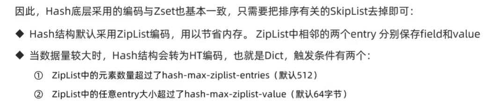
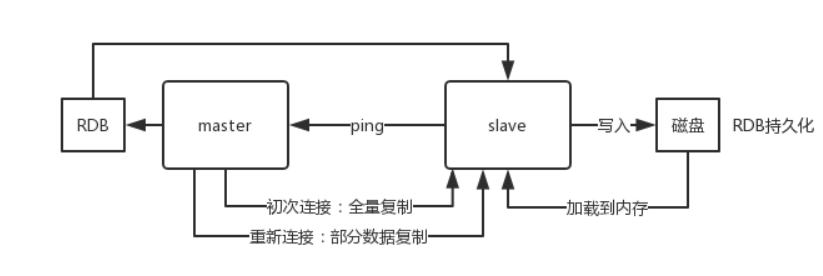
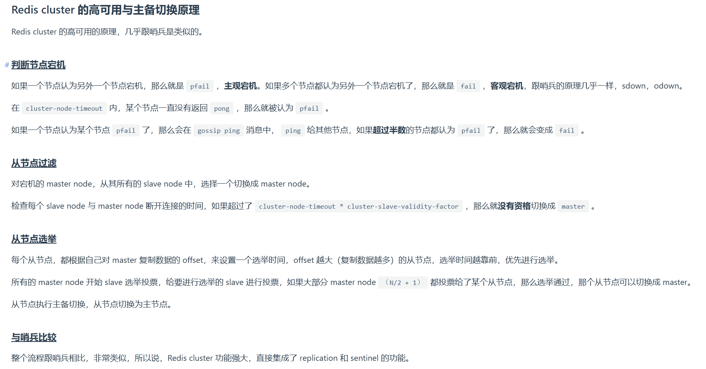

1. `Redis`特点:
   * 键值型
   * 单线程,每个命令具备原子性(redis单条命令是原子性的,但是redis事务不保证原子性)
   * 低延迟,速度快(基于内存、IO多路复用、良好的编码)
   * 支持数据持久化
   * 支持主从集群、分片集群
   * 支持多语言客户端(`java`,`C++`等)
2. `QuickList`的每一个节点都指向一个`ZipList`,`QuickList`=`LinkedList+ZipList`
3. `Redis`服务是有名称的,对于windows本地,可以通过配置文件中的`server_name`字段为`Redis`实例指定名称
4. 我自己试验是在`WSL`下的linux环境试验的
5. `SkipList`和`LevelDB`的跳表一样
   
6. `Redis`的五种基本数据结构:
   * 字符串
   
   
   
   * 哈希表
   
   
   * 列表:可以看作是一个双向链表结构,既可以支持正向检索也可以支持反向检索
    
   
   * 集合
    
   
   * 有序集合(`SortedSet=ZSet`):每个元素都带有一个`score`属性,可以基于`score`属性对元素排序,底层的实现是一个跳表+哈希表
   
   
   
7. `SDS、InSet、Dict、ZipList、QuickList、SkipList`是底层的数据结构,它们会封装成`RedisObject`对象,也就是`Redis`对象,其实就是`String、Hash、List、Set、ZSet`类型对象
8. `Redis`的命令行使用
   
9. `Redis`的`key`允许有多个单词形成层级结构,多个单词之间用`':'`隔开
10. `HSET`命令返回`integer 0`是因为`name`这个字段在`heima:user:1`这个哈希表中已经存在了(`SET`等命令返回的情况和这个类似)
11. `Redis`没有直接使用C语言中的字符串
12. 动态字符串`SDS`
   ```C
   struct __attribute__((__packed__)) sdshdr8 {
    uint8_t len;// 已保存的字符串字节数,不包含结束标识
    uint8_t alloc;// 申请的总的字节数,不包含结束标识
    unsigned char flags;// 不同SDS的头类型(有5种,如 #define SDS_TYPE_8 1),用来控制SDS的头大小
    char buf[];
   }
   // 上述这个SDS结构体保存的最大范围为255,还有其它范围更大的SDS结构体(有5种)
   ```
   
13. `SDS`具备动态扩容的能力,如:
   
14. `SDS`优点:
    * 获取字符串长度的时间复杂度为`O(1)`
    * 支持动态扩容
    * 减少内存分配次数
    * 二进制安全
15. `IntSet`是`Redis`中集合的一种实现方式,基于整数数组实现,并且具备元素唯一、长度可变、有序(底层采用二分查找来保证有序性)等特征
    ```C
    typedef struct intset {
        uint32_t encoding;// 编码方式,支持16位、32位、64位的整数
        uint32_t length;// 元素个数
        int8_t contents[];// 整数数组,保存集合数据
    } intset;
    ```
16. `intset`默认是升序将整数保存在`contents`中
    
17. `intset`的编码方式可以自动升级,即将编码方式升级到合适的大小
    
18.  `Dict`由三部分组成,分别是:哈希表、哈希节点(键值对)、字典
    
    当我们向`dict`添加键值对时,`Redis`首先根据`key`计算出`hash`值,然后利用`h&sizemask`来计算元素应该存储到数组中的哪个索引位置
    
19. `Dict`在每次新增键值对时都会检查负载因子(`LoadFactor=used/size`),满足以下两种情况时会触发哈希表扩容:
    * 哈希表的`LoadFactor>=1`,并且服务器没有执行`BGSAVE`或者`BGREWRITEAOF`等后台进程
    * 哈希表的`LoadFactor>5` 
20. `Dict`每次删除元素时,也会对负载因子做检查,当`LoadFactor<0.1`时,会做哈希表收缩.不管是扩容还是收缩,必定会创建新的哈希表,导致哈希表的`size`和`sizemask`变化,而`key`的查询与`sizemask`有关.因此必须对哈希表中的每一个`key`重新计算索引,插入新的哈希表,这个过程称为`rehash`,过程如下:
    
    `Dict`的`rehash`并不是一次性完成的.如果`dict`中包含数百万的`entry`,要在一次`rehash`完成,极有可能导致主线程阻塞.因此`dict`的`rehash`是分多次、渐进式的完成,因此称为渐进式`rehash`(每次访问`dict`时(增删改查)执行一次`rehash`),流程为:
    
21. `dict`底层是数组+链表来解决哈希冲突,`dict`包含两个哈希表`ht[0]`平常用,`ht[1]`用来`rehash`
22. `ziplist`是一种特殊的"双端链表,由一系列特殊编码的连续内存块组成.可以在任意一端进行压入/弹出操作(类似双端队列`deque`),并且该操作的时间复杂度为`O(1)`
    
23. `ziplist`的`entry`结构:
    
24. `ziplist`的连锁更新问题:在特殊情况下产生的连续多次空间扩展操作称之为连锁更新(概率降低)
    
    、
25. `Redis`的五种数据结构:`String`、`list`、`hash`、`set`、`sorted set`
26. `Redis`和`LevelDB`一样,也有部分数据在硬盘上
27. `Redis`是单线程的
28. `Redis`与`Memcache`的区别
    
29. `Redis`为什么这么快?
    * 全部操作是纯内存的操作
    * 采用单线程,有效避免了频繁的上下文切换
    * 采用非阻塞`I/O`多路复用
30. `Redis`设置过期时间的方案:
    * 定期删除:默认每隔100ms就随机抽取一些设置了过期时间的`key`,检查是否过期,如果过期就删除
    * 惰性删除:指某个键值过期后,此键值不会马上被删除,而是等到下层被使用的时候,才会被检查到过期,此时才能得到删除
31. 定期删除和惰性删除不能保证一定删除数据,`Redis`采用内存淘汰机制来确保数据一定被删除
32. `Redis`是通过`IO`多路复用来处理多个客户端请求
33. 缓存雪崩:指的是缓存同一时间大面积的过期失效,所以,后面的请求都会落到数据库上,造成数据库短时间内承受大量请求而崩掉(设置随机过期时间(避免大量缓存同时过期)、缓存预热(在系统启动或缓存重建时预先加载一些热点数据到缓存中)、分组缓存(将缓存数据分组,为每组设置不同的过期时间)来解决)
34. 缓存穿透:指查询一个一定不存在的数据,由于缓存不命中,接着查询数据库也无法查询出结果,因此也不会写入到缓存中,这会导致每个查询都会去请求数据库,造成缓存穿透(布隆过滤器、缓存空值(即把不存在的键值对应的值设为空)解决)
35. 缓存击穿:指一个`key`非常热点,大并发集中对这一个点访问,当这个`key`过期失效瞬间,持续的大并发就穿破缓存,直接请求数据库(互斥锁、缓存双写(设置一个主缓存,一个备缓存,主缓存过期时,备缓存仍然有效,避免所有请求同时击穿缓存))
36. `Redis`可以作为中间缓存使用
37. `Redis`的持久化机制:
    * 快照持久化:`Redis`可以通过创建快照来获得存储在内存里面的数据在某个时间点的副本.创建快照后,可以对快照进行备份,可以将快照复制到其它服务器从而创建具有相同数据的服务器副本,还快也将快照留在原地以便重启服务器的时候使用
    * `AOF`持久化
38. `Redis`为什么是单线程的?
    `Redis`是纯内存操作,执行速度非常快,因为性能瓶颈不在`CPU`上,因此不需要用多线程提升性能.并且多线程模型会带来并发安全问题和页面切换的系统开销
# 分布式缓存
1. <mark>`Redis`分布式实现</mark>
   * 主从复制(可以提高读操作的并发能力, (因为写操作主要集中在单个主节点上,这会导致主节点的写入压力较大,而且数据同步到从节点也需要一定的时间和资源,这也会限制写操作的性能))
   * 哨兵机制(提高可用性,故障切换)
   * `Cluster`分片集群(适用于需要高扩展性和高可用性的大规模分布式应用,这是几种方式中最强的分布式方案)
2. 单点部署`Redis`服务会发生一旦宕机,就不可用了.因此为了实现高可用,会将数据库复制到多个副本以部署在不同的服务器上,其中一台挂了也可以继续提供服务,`Redis`实现高可用的三种部署模式:主从模式、哨兵模式、集群模式
## RDB持久化
1. `save`和`bgsave`
   
   
2. `bgsave`中的异步`RDB`持久化时,操作系统的`copy-on-write`技术确保了子进程中的数据是执行`fork()`时的状态,不会受到父进程后续写操作的影响(父进程的写操作写到了拷贝的文件中)
   
## AOF持久化
1. `AOF`持久化,采用日志的形式来记录每个写操作,追加到文件中,重启时再重新执行`AOF`文件中的命令来恢复数据.它主要解决数据持久化的实时性问题.默认是不开启的
2. `AOF`持久化记录的是命令,`RDB`记录的是具体的值
3. `AOF`数据更完整,`RDB`一般可能是60秒记录一次(因为`bgsave`里面会`fork`一个子进程,然后读写会有很多磁盘IO操作,因此较为耗时),因此`RDB`不够完整,而`AOF`一般每秒记录一次
   
4. `LevelDB`和`MySQL`在系统崩溃、宕机时都是通过日志恢复(即写入数据时是先写到日志中),`Redis`是怎么实现数据恢复的呢?
   Redis 通过 RDB 快照和 AOF 日志实现数据持久化，重启时优先加载 AOF 文件恢复数据。虽然不像 MySQL 那样支持事务回滚，但通过合理的持久化配置，可以在宕机后最大限度地减少数据丢失.混合持久化（RDB+AOF）是 Redis 4.0+ 后的推荐方案
## 主从模式
1. 主从模式中,`Redis`部署了多台机器,有主节点,负责读写操作(主要是写),有从节点,只负责读操作.从节点的数据来自主节点,实现原理就是主从复制机制
   
   
   
2. 主从复制包括全量复制、增量复制两种.一般当`slave`第一次启动连接`master`,或者认为是第一次连接,就采用全量复制,其流程为:
   
3. `master`怎么判断是不是第一次连接?
   `slave`做数据同步之前(不管全量还是增量)必须向`master`声明自己的`replication id`和`offset`,`master`才可以判断到底需要同步哪些数据.需要全量同步即`offset=0&&replication id一样`
4. 增量复制:
   
5. 主从复制的断点续传:如果主从复制过程中,网络连接断掉了,那么可以接着上次复制的地方,继续复制下去,而不是从头开始复制一份.`master node`会在内存中维护一个`backlog`,`master`和`slave`都会保存一个`replica offset`还有一个`master runid`,`offset`就是保存在`backlog`中.如果`master`和`slave`网络连接断掉了,`slave`会让`master`从上次`replica offset`开始继续复制,如果没有找到对应的`offset`,那么就会执行一次`resynchronization`
6. `Redis`的高可用架构,叫做故障转移,也可以叫做主备切换
# 哨兵模式
1. 主从模式中，一旦主节点由于故障不能提供服务，需要人工将从节点晋升为主节点，同时还要通知应用方更新主节点地址。显然，多数业务场景都不能接受这种故障处理方式。Redis从2.8开始正式提供了Redis Sentinel（哨兵）架构来解决这个问题
2. 哨兵模式，由一个或多个Sentinel实例组成的Sentinel系统，它可以监视所有的Redis主节点和从节点，并在被监视的主节点进入下线状态时，自动将下线主服务器属下的某个从节点升级为新的主节点。但是呢，一个哨兵进程对Redis节点进行监控，就可能会出现问题（单点问题），因此，可以使用多个哨兵来进行监控Redis节点，并且各个哨兵之间还会进行监控
   
3. 哨兵的三个作用
   * 监控(`master、salve`)
    
   * 故障转移(切换从节点为主节点)
   * 通知(通知新的`master`地址)
4. 哨兵+`Redis`的主从部署架构,不能保证数据零丢失,只能保证`Redis`集群的高可用性
5. 哨兵至少需要3个实例,来保证自己的健壮性
6. 哨兵主从切换的数据丢失问题:
   * 异步复制导致的数据丢失:`master->slave`的复制是异步的,所以可能有部分数据还没复制到`slave`,`master`就宕机了,此时这部分数据就丢失了
   * 脑裂导致的数据丢失:脑裂:某个`master`所在机器突然脱离了正常的网络,跟其他`slave`机器不能连接,但是实际上`master`还允许着.此时哨兵可能就会认为`master`宕机了,然后开启选举,将其它`slave`切换城`master`.这个时候,集群里就会有两个`master`,也就是所谓的脑裂.此时虽然某个`slave`被切换成了`master`,但是可能客户端还没来得及切换到新的`master`,还继续向旧`master`写数据.因此旧`master`恢复时,就会被作为一个`slave`挂到新的`master`上去,自己的数据会清空,重新从新的`master`复制数据.而新的`master`并没有后来客户端写入的数据,因此,这部分数据就丢失了
   * 解决办法:
    
7. `sdown`:主观下线;`odown`:客观下线
8. 利用哨兵时的主从切换选举算法:
   
9. 哨兵完成切换后,会向其它哨兵进行`configuration`传播:
   
## Cluster集群模式
1. 主从机制和哨兵机制可以解决高可用、高并发读的问题,但是:没有解决海量数据存储(每个节点存储的数据是一样的(只有一个主节点),主从同步).分片集群模式可以解决,`Cluster`集群中有多个`master`,每个`master`保存不同数据(利用哈希槽来访问每个`master`中的数据),每个`master`也可以基于主从机制,即有多个`slave`节点;`master`之间通过`ping`监测彼此状态(充当哨兵)
   
2. `Cluster`的分布式寻址算法:`Redis`会把每一个`master`节点映射到0~16383共16384个插槽(`hash slot`)上.插槽算法把整个数据库分为16384个槽,每个进入`Redis`的键值对,根据`key`进行散列,分配到这16384插槽中的一个.使用的哈希映射也比较简单,用`CRC16`算法计算出一个16位的值,再对16384取模.数据库中的每个键都属于这16384个槽的其中一个,集群中的每个节点都可以处理这16384个槽
   
   
3. 数据`key`不是与节点绑定,而是与插槽绑定.`redis`会先根据`key`的有效部分计算插槽值(有效部分利用`CRC16`算法得到哈希值,然后再对16384取模得到的结果就是这个`key`对应的插槽值)
   
4. 集群模式的故障转移的时候主从切换不需要哨兵,因为它们`master`节点会相互通过心跳机制监控,即它们自己起到了哨兵的作用
5. `Redis Cluster`的高可用和主备切换原理
   
6. 为了保证高可用性,`Cluster`集群也用了主从模式
7. 集群的完整性问题:
   
8. `Cluster`节点间采用`Gossip`协议通信
9.  `Gossip`协议包含多种消息,`ping、pong、meet、fail`等
10. <mark>为什么`Cluster`集群模式是最强大的分布式方案?</mark>
    * 数据分片与水平扩展:Cluster将键空间划分为16384个哈希槽，每个槽可以分配给集群中的某个节点。这种数据分片方式使得数据能够均匀地分布在多个节点上，减轻了单个节点的存储压力，提高了整体的存储容量(每个主节点存储内容不同);(水平扩展)通过增加新的节点来分担现有节点的负载,从而提升系统的整体性能和容量
    * 高可用性:利用主从复制(每个主节点可以有一个或多个从节点作为备份。正常情况下，从节点会同步主节点的数据，当主节点发生故障时，从节点可以迅速被提升为主节点，继续提供服务，从而保证了服务的连续性)+自动故障切换(集群中的主节点会相互监控，当检测到主节点故障时，会通过选举算法选择一个从节点来接替故障的主节点，整个过程对客户端来说是透明的，最大限度地减少了服务中断的时间)
# Redis分布式锁
1. 分布式锁:是控制分布式系统不同进程共同访问共享资源的一种锁的实现
2. 一共有五种方式:
   * `setnx + expire`分开写:如果执行完`setnx`加锁,正要执行`expire`设置过期时间时,进程`crash`掉或者要重启维护了,那这个锁就“长生不老”了,别的线程永远获取不到锁啦,所以分布式锁不能这么实现(会出现死锁)
   * `setnx ex px nx`:存在锁过期被释放了,但是此时的业务还没执行完的问题和锁被别的线程误删的问题(会出现锁误删)
   * `setnx ex px nx + 校验唯一随机值`:存在锁过期释放了,业务还没执行完的问题
   * `Redisson`:只要线程一加锁成功,就会启动一个`watch dog`看门狗,它是一个后台线程,会每隔10秒检查一下,如果线程1还持有锁,那么就会不断的延长锁`key`的生存时间.因此,`Redisson`解决了锁过期释放,业务没执行完问题
   * `Redlock`:如果线程一在`Redis`的`master`节点上拿到了锁,但是加锁的`key`还没同步到`slave`节点.恰好这时,`master`节点发生故障,一个`slave`节点就会升级为`master`节点.线程二就可以获取同个`key`的锁啦(因为之前没有同步成功,可以从之前那个`slave`节点获取锁),但线程一也已经拿到锁了,锁的安全性就没了.因此,使用了`Redlock`算法:用多个`master`部署,保证它们不会同时宕机掉,并且这些`master`节点是完全相互独立的,相互之间不存在数据同步
     - 按顺序向5个`master`节点请求加锁
     - 根据设置的超时时间来判断，是不是要跳过该`master`节点
     - 如果大于等于三个节点加锁成功，并且使用的时间小于锁的有效期，即可认定加锁成功啦
     - 如果获取锁失败,解锁
    
3. 分布式锁的特性:互斥性、安全性、死锁、容错
# Redis过期策略
1. 定时过期、惰性过期、定期过期(定时抽样检查)
   
2. `Redis`使用了惰性过期和定期过期
# Redis内存淘汰策略
1. `volatile-lru`:当内存不足以容纳新写入数据时，从设置了过期时间的key中使用LRU（最近最少使用）算法进行淘汰
2. `allkeys-lru`:当内存不足以容纳新写入数据时，从所有key中使用LRU（最近最少使用）算法进行淘汰
3. `volatile-lfu`:当内存不足以容纳新写入数据时，从设置了过期时间的key中使用LFU（最近最少使用）算法进行淘
4. `allkeys-lfu`:当内存不足以容纳新写入数据时，从所有key中使用LFU（最近最少使用）算法进行淘汰
5. `volatile-random`:当内存不足以容纳新写入数据时，从设置了过期时间的key中随机淘汰数据
6. `allkeys-random`:当内存不足以容纳新写入数据时，从所有key中随机淘汰数据
7. `volatile-ttl`:当内存不足以容纳新写入数据时，在设置了过期时间的key中，根据过期时间进行淘汰，越早过期的优先被淘汰
8. `noeviction`:默认策略，当内存不足以容纳新写入数据时，新写入操作会报错
# Redis通信协议
1. `Redis`是一个`CS`架构的软件.`Redis`采用`RESP`协议通信
2. `RESP`通过首字节的字符来区分不同数据类型,常用的数据类型有五种:单行字符串、错误、数值、多行字符串、数组
3. `RESP`主要有实现简单、解析速度快、可读性好等优点
# Redis网络模型
1. `Redis`到底是单线程还是多线程?
   仅考虑`Redis`的核心业务部分(命令处理),那么它就是单线程;如果聊整个`Redis`,那么就是多线程
2. `Redis 6.0`在核心网络模型中引入了多线程,进一步提高对于多核`CPU`的利用率
# Redis和MySQL如何保持一致性
1. 涉及两部分:
   * 对于缓存数据是采用修改还是删除
   * 先删缓存再更新数据库,还是先更新数据库再删缓存
2. `Redis`缓存和数据库出现的一致性问题,比如
   
   在更新数据库和删除缓存值的过程中,无论是先更新缓存再更新数据库还是先更新数据库再更新缓存,只要有一个操作失败了,就会导致客户端读取到旧值,即出现不一致问题
3. 修改一条数据用删除的逻辑是最好的,因为删除操作很简单,而修改的付出的成本很高.为什么是删除缓存,而不是更新缓存?
   
4. 延迟双删(先删除缓存再更新数据库)
   * 先删除缓存
   * 再更新数据库
   * 休眠一会,再次删除缓存
    
5. 删除缓存重试(先更新数据库再删除缓存):延迟双删里面的第二次删除可能失败,删除重试就是为了解决这个:
   * 可以把要删除的缓存值或者要更新的数据库值暂存到消息队列中。当应用没有能够成功的删除缓存值或者是更新数据库值时，可以从消息队列中重新读取这些值，然后再次进行删除或者更新
   * 如果能够成功删除或者更新，我们就要把这些值从消息队列中去除，以免重复操作，此时，我们也可以保证数据库和缓存一致了。否则的话，我们还需要再次进行重试。如果重试超过一定次数，还是没有成功，我们就需要向应用层发送报错信息了
   (先操作数据库,再操作缓存)
6. `Binlog`同步策略(如:把删除`redis`的操作变更的数据记录到`cannal`客户端):加了删除重试,会引入消息队列这些业务代码侵入,因此提出了`Binlog`同步,即利用数据库的二进制日志来实现数据的同步
7. 建议优先更新数据库再删除缓存:
   先删除缓存值再更新数据库，有可能导致请求因为缓存缺失而访问数据库，给数据库带来压力;如果业务应用中读取数据库和写缓存的时间不好估算，那么，延时双删中的等待时间就不好设置
# Redis的事务机制
1. `Redis`事务就是顺序性、一次性、排他性的执行一个队列里的一系列命令
2. `Redis`事务支持一次执行多个命令,一个事务中所有命令都会被序列化.在事务执行过程,会按照顺序串行化执行队列中的命令(顺序性),其他客户端提交的命令请求不会插入到事务执行命令序列中(排他性)
3. `Redis`事务里面没有隔离级别概念
4. `Redis`事务不保证原子性(一个事务所有操作要么全部成功，要么全部失败)
5. `Redis`事务没有回滚概念
6. `Redis`事务本身不提供持久性保证，数据的持久性依赖于`Redis`的持久化机制
7. `Redis`事务的三个阶段
   * 开始事务(`MULTI`)
   * 命令入队
   * 执行事务(`EXEC`)、撤销事务(`DISCARD`)
8. 撤销事务会把入队的命令给不执行,即还是没有开启事务前的状态
9. 如果事务入队中有错误命令,那么根据不同错误有不同的处理
   * 语法错误(入队过程的错误):`Redis`会拒绝执行整个事务
   * 执行错误(`EXEC`阶段):`Redis`会继续执行事务中的其他命令
# Redis网络模型
## 用户空间和内核空间
1. 为了避免用户应用导致冲突甚至内核崩溃,用户应用和内核应该是分离的
2. 进程的寻址空间(进程只能访问虚拟内存空间,然后虚拟内存会对虚拟地址进行映射寻址到真实的物理内存中去)分为内核空间(32位系统为例,高地址的1GB)、用户空间(32位系统为例,低地址的3GB)
3. 用户空间只能执行受限的命令,而且不能直接调用系统资源,必须通过内核提供的接口(如`socket`)来访问
4. 内核空间可以执行特权命令,调用一切系统资源
5. `Linux`系统为了提高`IO`效率,会在用户空间和内核空间都加入缓冲区;
   * 写数据时,要把用户缓冲数据拷贝到内核缓冲区,然后写入底层设备(如磁盘)
   * 读数据时,要从设备读取数据到内核缓冲区,然后拷贝到用户缓冲区
   
## Linux五种不同IO模型
1. 阻塞`IO`:阻塞等待数据就绪
   
2. 非阻塞`IO`:通过`fctnl`来设置,默认是阻塞的
   
3. `IO`多路复用:`Redis`使用的是`epoll`.(`Linux`中一切皆文件,每个文件都用一个文件描述符`fd`来访问).`IO`多路复用是利用单个线程来同时监听多个`fd`,并在某个`fd`可读、可写时得到通知,从而避免无效的等待,充分利用`CPU`资源
   
4. 信号驱动`IO`
   
5. 异步`IO`
   
# Redis的乐观锁、悲观锁
1. 乐观锁是一种并发控制策略，它假设在大多数情况下数据不会被其他线程修改，因此在读取数据时不进行加锁，而是在更新数据时才检查数据是否被其他线程修改过,如果被修改过就放弃操作,否则执行操作,乐观锁适用于多读的应用类型,这样可以提高吞吐量
2. 乐观锁的实现方式:`Redis`事务机制、CAS机制、基于版本号
   * `Redis`事务机制:`WATCH`、`MULTI`、`EXEC`
   * `CAS`机制:通过比较和交换来确保数据的一致性(检查内存值是否等于预期值;如果等于,则将内存值更新为新值;如果不等于,则不做任何操作)
   * 基于版本号:这是最常见乐观锁实现的方式.在数据库表中添加一个版本号(`version`),每次更新数据时就检查当前版本号是否与数据库中的版本号一致.如果一致,则更新数据并递增版本号;如果不一致,则表示数据已被其他线程修改,更新失败
3. 乐观锁的`Redis`事务实现方式:在`Redis`中,乐观锁可以通过`WATCH`命令和事务`(MULTI/EXEC)`来实现
   * 使用`WATCH`命令监视一个或多个键，记录下它们的当前值
   * 开始一个事务，使用`MULTI`命令
   * 在事务中执行一系列操作，这些操作基于被监视键的当前值
   * 使用`EXEC`命令执行事务.如果在事务提交前，被监视的键的值被其他客户端修改过，则事务会被回滚，不执行任何操作.因此只有被监视的键没有被其它客户端(线程)修改才能更新成功
4. `CAS`的缺点:
   * `ABA`问题:如果一个变量在`CAS`操作期间被修改为其他值,然后再改回原来的值,`CAS`机制无法检测到这种变化,这可能导致数据不一致
   * 高竞争下的开销问题:在并发冲突概率大的高竞争环境下,如果`CAS`一直失败,会一直重试,`CPU`开销较大
5. 悲观锁是假设数据在大多数情况下都会被其它线程修改,因此在读取数据时就进行加锁,以确保数据的一致性.悲观锁更适用于多写的场景
6. 悲观锁可以利用`Redis`的`SETNX`实现:(分布式环境中,悲观锁可以通过分布式锁来实现)
   * 尝试获取锁，使用`SETNX`命令设置一个键值对，如果键不存在则设置成功并获取锁，否则获取锁失败
   * 如果获取锁成功，设置锁的过期时间，防止死锁
   * 执行相关操作
   * 操作完成后释放锁，删除键值对
# LUA脚本
1. `Redis`是单线程执行`LUA`脚本的,因此保证了`lua`脚本的原子性
2. `Redis`使用`lua`脚本的优点:
   * 原子性
   * 减少网络开销:将多个命令打包成一个脚本,减少了客户端和服务器之间的往返次数
   * 灵活性:`lua`是一种编程语言,可以在脚本中实现复杂的逻辑
   