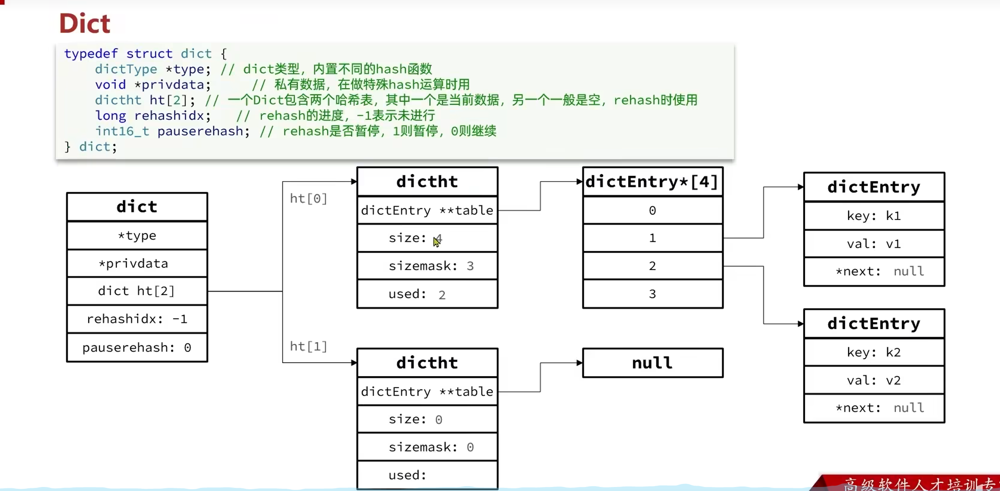
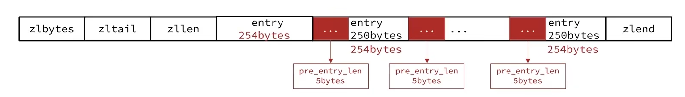
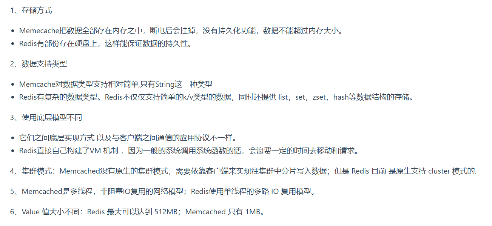
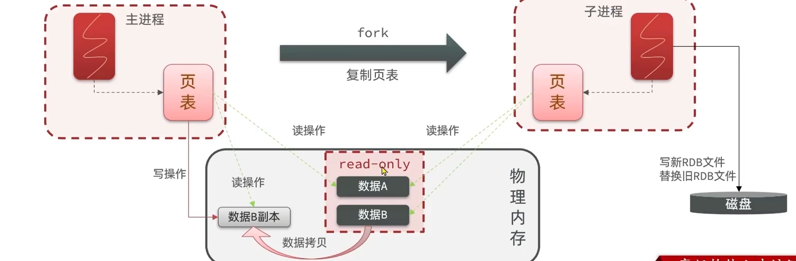
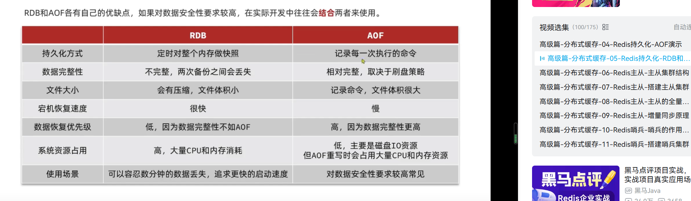
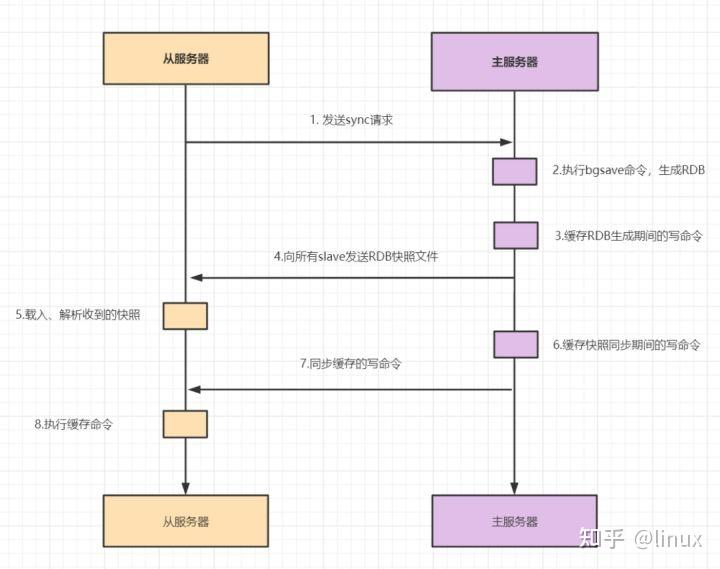
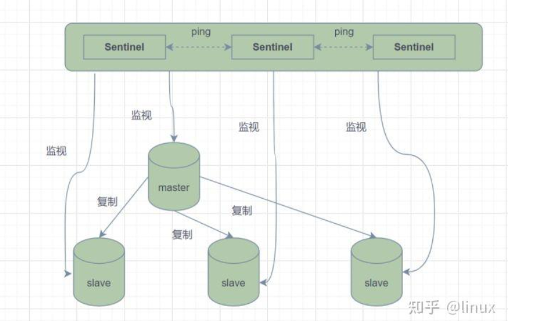
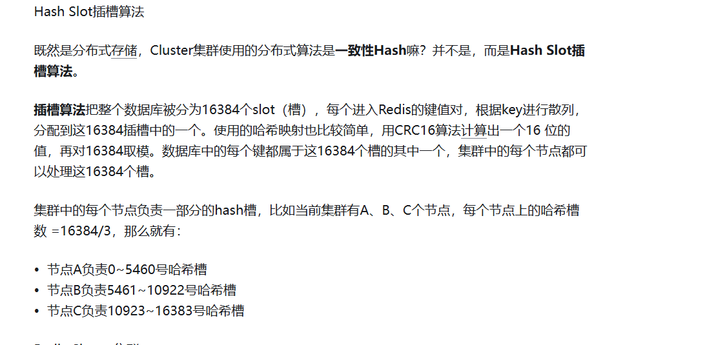
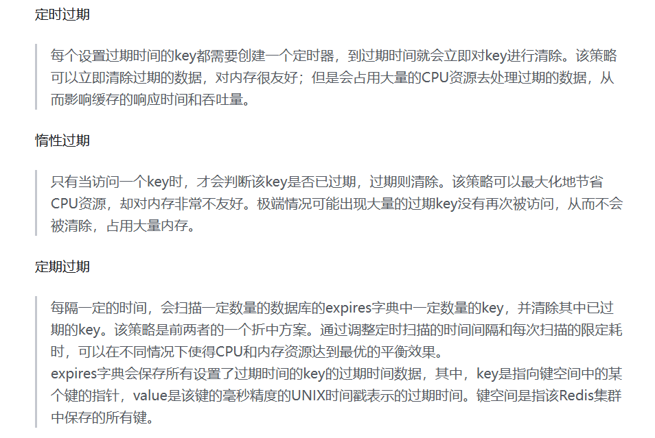
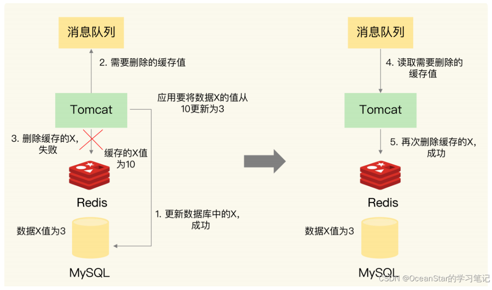

1. `Redis`特点:
   * 键值型
   * 单线程,每个命令具备原子性
   * 低延迟,速度快(基于内存、IO多路复用、良好的编码)
   * 支持数据持久化
   * 支持主从集群、分片集群
   * 支持多语言客户端(`java`,`C++`等)
2. `Redis`的五种基本数据结构:
   * 字符串
   
   * 哈希表
   
   * 列表:可以看作是一个双向链表结构,既可以支持正向检索也可以支持反向检索
    
   * 集合
    
   * 有序集合:每个元素都带有一个`score`属性,可以基于`score`属性对元素排序,底层的实现是一个跳表+哈希表
   
3. `Redis`的命令行使用
   
4. `Redis`的`key`允许有多个单词形成层级结构,多个单词之间用`':'`隔开
5. `HSET`命令返回`integer 0`是因为`name`这个字段在`heima:user:1`这个哈希表中已经存在了(`SET`等命令返回的情况和这个类似)
6. `Redis`没有直接使用C语言中的字符串
7. 动态字符串`SDS`
   ```C
   struct __attribute__((__packed__)) sdshdr8 {
    uint8_t len;// 已保存的字符串字节数,不包含结束标识
    uint8_t alloc;// 申请的总的字节数,不包含结束标识
    unsigned char flags;// 不同SDS的头类型(有5种,如 #define SDS_TYPE_8 1),用来控制SDS的头大小
    char buf[];
   }
   // 上述这个SDS结构体保存的最大范围为255,还有其它范围更大的SDS结构体(有5种)
   ```
   
8. `SDS`具备动态扩容的能力,如:
   
9. `SDS`优点:
    * 获取字符串长度的时间复杂度为`O(1)`
    * 支持动态扩容
    * 减少内存分配次数
    * 二进制安全
10. `IntSet`是`Redis`中集合的一种实现方式,基于整数数组实现,并且具备元素唯一、长度可变、有序(底层采用二分查找来保证有序性)等特征
    ```C
    typedef struct intset {
        uint32_t encoding;// 编码方式,支持16位、32位、64位的整数
        uint32_t length;// 元素个数
        int8_t contents[];// 整数数组,保存集合数据
    } intset;
    ```
11. `intset`默认是升序将整数保存在`contents`中
    
12. `intset`的编码方式可以自动升级,即将编码方式升级到合适的大小
    
13.  `Dict`由三部分组成,分别是:哈希表、哈希节点(键值对)、字典
    
    当我们向`dict`添加键值对时,`Redis`首先根据`key`计算出`hash`值,然后利用`h&sizemask`来计算元素应该存储到数组中的哪个索引位置
    
14. `Dict`在每次新增键值对时都会检查负载因子(`LoadFactor=used/size`),满足以下两种情况时会触发哈希表扩容:
    * 哈希表的`LoadFactor>=1`,并且服务器没有执行`BGSAVE`或者`BGREWRITEAOF`等后台进程
    * 哈希表的`LoadFactor>5` 
15. `Dict`每次删除元素时,也会对负载因子做检查,当`LoadFactor<0.1`时,会做哈希表收缩.不管是扩容还是收缩,必定会创建新的哈希表,导致哈希表的`size`和`sizemask`变化,而`key`的查询与`sizemask`有关.因此必须对哈希表中的每一个`key`重新计算索引,插入新的哈希表,这个过程称为`rehash`,过程如下:
    
    `Dict`的`rehash`并不是一次性完成的.如果`dict`中包含数百万的`entry`,要在一次`rehash`完成,极有可能导致主线程阻塞.因此`dict`的`rehash`是分多次、渐进式的完成,因此称为渐进式`rehash`(每次访问`dict`时(增删改查)执行一次`rehash`),流程为:
    
16. `dict`底层是数组+链表来解决哈希冲突,`dict`包含两个哈希表`ht[0]`平常用,`ht[1]`用来`rehash`
17. `ziplist`是一种特殊的"双端链表,由一系列特殊编码的连续内存块组成.可以在任意一端进行压入/弹出操作(类似双端队列`deque`),并且该操作的时间复杂度为`O(1)`
    
18. `ziplist`的`entry`结构:
    
19. `ziplist`的连锁更新问题:在特殊情况下产生的连续多次空间扩展操作称之为连锁更新(概率降低)
    
    、
20. `Redis`的五种数据结构:`String`、`list`、`hash`、`set`、`sorted set`
21. `Redis`和`LevelDB`一样,也有部分数据在硬盘上
22. `Redis`是单线程的
23. `Redis`与`Memcached`的区别
    
24. `Redis`为什么这么快?
    * 全部操作是纯内存的操作
    * 采用单线程,有效避免了频繁的上下文切换
    * 采用非阻塞`I/O`多路复用
25. `Redis`设置过期时间的方案:
    * 定期删除:默认每隔100ms就随机抽取一些设置了过期时间的`key`,检查是否过期,如果过期就删除
    * 惰性删除:指某个键值过期后,此键值不会马上被删除,而是等到下层被使用的时候,才会被检查到过期,此时才能得到删除
26. 定期删除和惰性删除不能保证一定删除数据,`Redis`采用内存淘汰机制来确保数据一定被删除
27. `Redis`是通过`IO`多路复用来处理多个客户端请求
28. 缓存雪崩:指的是缓存同一时间大面积的失效,所以,后面的请求都会落到数据库上,造成数据库短时间内承受大量请求而崩掉
29. 缓存穿透:指查询一个一定不存在的数据,由于缓存不命中,接着查询数据库也无法查询出结果,因此也不会写入到缓存中,这会导致每个查询都会去请求数据库,造成缓存穿透(布隆过滤器解决)
30. 缓存击穿:指一个`key`非常热点,大并发集中对这一个点访问,当这个`key`失效瞬间,持续的大并发就穿破缓存,直接请求数据库
31. `Redis`可以作为中间缓存使用
32. `Redis`的持久化机制:
    * 快照持久化:`Redis`可以通过创建快照来获得存储在内存里面的数据在某个时间点的副本.创建快照后,可以对快照进行备份,可以将快照复制到其它服务器从而创建具有相同数据的服务器副本,还快也将快照留在原地以便重启服务器的时候使用
    * `AOF`持久化
33. `Redis`为什么是单线程的?
    `Redis`是纯内存操作,执行速度非常快,因为性能瓶颈不在`CPU`上,因此不需要用多线程提升性能.并且多线程模型会带来并发安全问题和页面切换的系统开销
# 分布式缓存
1. 单点部署`Redis`服务会发生一旦宕机,就不可用了.因此为了实现高可用,会将数据库复制到多个副本以部署在不同的服务器上,其中一台挂了也可以继续提供服务,`Redis`实现高可用的三种部署模式:主从模式、哨兵模式、集群模式
## RDB持久化
1. `save`和`bgsave`
   
   
2. `bgsave`中的异步`RDB`持久化时,操作系统的`copy-on-write`技术确保了子进程中的数据是执行`fork()`时的状态,不会受到父进程后续写操作的影响(父进程的写操作写到了拷贝的文件中)
   
## AOF持久化
1. `AOF`持久化,采用日志的形式来记录每个写操作,追加到文件中,重启时再重新执行`AOF`文件中的命令来恢复数据.它主要解决数据持久化的实时性问题.默认是不开启的
2. `AOF`持久化记录的是命令,`RDB`记录的是具体的值
3. `AOF`数据更完整,`RDB`一般可能是60秒记录一次(因为`bgsave`里面会`fork`一个子进程,然后读写会有很多磁盘IO操作,因此较为耗时),因此`RDB`不够完整,而`AOF`一般每秒记录一次
   
## 主从模式
1. 主从模式中,`Redis`部署了多台机器,有主节点,负责读写操作,有从节点,只负责读操作.从节点的数据来自主节点,实现原理就是主从复制机制
2. 主从复制包括全量复制、增量复制两种.一般当`slave`第一次启动连接`master`,或者认为是第一次连接,就采用全量复制,其流程为:
   
# 哨兵模式
1. 主从模式中，一旦主节点由于故障不能提供服务，需要人工将从节点晋升为主节点，同时还要通知应用方更新主节点地址。显然，多数业务场景都不能接受这种故障处理方式。Redis从2.8开始正式提供了Redis Sentinel（哨兵）架构来解决这个问题
2. 哨兵模式，由一个或多个Sentinel实例组成的Sentinel系统，它可以监视所有的Redis主节点和从节点，并在被监视的主节点进入下线状态时，自动将下线主服务器属下的某个从节点升级为新的主节点。但是呢，一个哨兵进程对Redis节点进行监控，就可能会出现问题（单点问题），因此，可以使用多个哨兵来进行监控Redis节点，并且各个哨兵之间还会进行监控
   
3. 哨兵的三个作用
   * 监控(`master、salve`)
    
   * 故障转移(切换从节点为主节点)
   * 通知(通过广播通知其它从节点,修改配置文件`.conf`,让它们切换主机)
## Cluster集群模式
1. 主从机制和哨兵机制可以解决高可用、高并发读的问题,但是:没有解决海量数据存储(每个节点存储的数据是一样的,主从同步).分片集群模式可以解决,`Cluster`集群中有多个`master`,每个`master`保存不同数据(利用哈希槽来访问每个`master`中的数据),每个`master`也可以基于主从机制,即有多个`slave`节点;`master`之间通过`ping`监测彼此状态(充当哨兵)
   
2. `Redis`会把每一个`master`节点映射到0~16383共16384个插槽(`hash slot`)上.插槽算法把整个数据库被分为16384个槽,每个进入`Redis`的键值对,根据`key`进行散列,分配到这16384插槽中的一个.使用的哈希映射也比较简单,用`CRC16`算法计算出一个16位的值,再对16384取模.数据库中的每个键都属于这16384个槽的其中一个,集群中的每个节点都可以处理这16384个槽
   
3. 数据`key`不是与节点绑定,而是与插槽绑定.`redis`会先根据`key`的有效部分计算插槽值(有效部分利用`CRC16`算法得到哈希值,然后再对16384取模得到的结果就是这个`key`对应的插槽值)
   
4. 集群模式的故障转移的时候主从切换不需要哨兵,因为它们`master`节点会相互通过心跳机制监控,即它们自己起到了哨兵的作用
5. 为了保证高可用性,`Cluster`集群也用了主从模式
6. 集群的完整性问题:
   
# Redis分布式锁
1. 分布式锁:是控制分布式系统不同进程共同访问共享资源的一种锁的实现
2. 一共有五种方式:
   * `setnx + expire`分开写:如果执行完`setnx`加锁,正要执行`expire`设置过期时间时,进程`crash`掉或者要重启维护了,那这个锁就“长生不老”了,别的线程永远获取不到锁啦,所以分布式锁不能这么实现
   * `setnx ex px nx`:存在锁过期释放了,业务还没执行完的问题和锁被别的线程误删
   * `setnx ex px nx + 校验唯一随机值`:存在锁过期释放了,业务还没执行完的问题
   * `Redisson`:只要线程一加锁成功,就会启动一个`watch dog`看门狗,它是一个后台线程,会每隔10秒检查一下,如果线程1还持有锁,那么就会不断的延长锁`key`的生存时间.因此,`Redisson`就是使用`Redisson`解决了锁过期释放,业务没执行完问题
   * `Redlock`:如果线程一在`Redis`的`master`节点上拿到了锁,但是加锁的`key`还没同步到`slave`节点.恰好这时,`master`节点发生故障,一个`slave`节点就会升级为`master`节点.线程二就可以获取同个`key`的锁啦(因为之前没有同步成功,可以从之前那个`slave`节点获取锁),但线程一也已经拿到锁了,锁的安全性就没了.因此,使用了`Redlock`算法:用多个`master`部署,保证它们不会同时宕机掉,并且这些`master`节点是完全相互独立的,相互之间不存在数据同步
     - 按顺序向5个`master`节点请求加锁
     - 根据设置的超时时间来判断，是不是要跳过该`master`节点
     - 如果大于等于三个节点加锁成功，并且使用的时间小于锁的有效期，即可认定加锁成功啦
     - 如果获取锁失败,解锁
    
3. 分布式锁的特性:互斥性、安全性、死锁、容错
# Redis过期策略
1. 定时过期、惰性过期、定期过期(定时抽样检查)
   
2. `Redis`使用了惰性过期和定期过期
# Redis内存淘汰策略
1. `volatile-lru`:当内存不足以容纳新写入数据时，从设置了过期时间的key中使用LRU（最近最少使用）算法进行淘汰
2. `allkeys-lru`:当内存不足以容纳新写入数据时，从所有key中使用LRU（最近最少使用）算法进行淘汰
3. `volatile-lfu`:当内存不足以容纳新写入数据时，从设置了过期时间的key中使用LFU（最近最少使用）算法进行淘
4. `allkeys-lfu`:当内存不足以容纳新写入数据时，从所有key中使用LFU（最近最少使用）算法进行淘汰
5. `volatile-random`:当内存不足以容纳新写入数据时，从设置了过期时间的key中随机淘汰数据
6. `allkeys-random`:当内存不足以容纳新写入数据时，从所有key中随机淘汰数据
7. `volatile-ttl`:当内存不足以容纳新写入数据时，在设置了过期时间的key中，根据过期时间进行淘汰，越早过期的优先被淘汰
8. `noeviction`:默认策略，当内存不足以容纳新写入数据时，新写入操作会报错
# Redis通信协议
1. `Redis`是一个`CS`架构的软件.`Redis`采用`RESP`协议通信
2. `RESP`通过首字节的字符来区分不同数据类型,常用的数据类型有五种:单行字符串、错误、数值、多行字符串、数组
3. `RESP`主要有实现简单、解析速度块、可读性好等优点
# Redis网络模型
1. `Redis`到底是单线程还是多线程?
   仅考虑`Redis`的核心业务部分(命令处理),那么它就是单线程;如果聊整个`Redis`,那么就是多线程
2. `Redis 6.0`在核心网络模型中引入了多线程,进一步提高对于多核`CPU`的利用率
# Redis和MySQL如何保持一致性
1. 涉及两部分:
   * 对于缓存数据是采用修改还是删除
   * 先删缓存再更新数据库,还是先更新数据库再删缓存
2. `Redis`缓存和数据库出现的一致性问题,比如
   
   在更新数据库和删除缓存值的过程中,无论是先更新缓存再更新数据库还是先更新数据库再更新缓存,只要有一个操作失败了,就会导致客户端读取到旧值,即出现不一致问题
3. 修改一条数据用删除的逻辑是最好的,因为删除操作很简单,而修改的付出的成本很高
4. 延迟双删(先删除缓存再更新数据库)
   * 先删除缓存
   * 再更新数据库
   * 休眠一会,再次删除缓存
    
5. 删除缓存重试(先更新数据库再删除缓存):延迟双删里面的第二次删除可能失败,删除重试就是为了解决这个办法:
   * 可以把要删除的缓存值或者要更新的数据库值暂存到消息队列中。当应用没有能够成功的删除缓存值或者是更新数据库值时，可以从消息队列中重新读取这些值，然后再次进行删除或者更新
   * 如果能够成功删除或者更新，我们就要把这些值从消息队列中去除，以免重复操作，此时，我们也可以保证数据库和缓存一致了。否则的话，我们还需要再次进行重试。如果重试超过一定次数，还是没有成功，我们就需要向应用层发送报错信息了
   (先操作数据库,再操作缓存)
6. `Binlog`同步策略(如:把删除`redis`的操作变更的数据记录到`cannal`客户端):加了删除重试,会引入消息队列这些业务代码侵入,因此提出了`Binlog`同步,即利用数据库的二进制日志来实现数据的同步
7. 建议优先更新数据库再删除缓存:
   先删除缓存值在更新数据库，有可能导致请求因为缓存缺失而访问数据库，给数据库带来压力;如果业务应用中读取数据库和写缓存的时间不好估算，那么，延时双删中的等待时间就不好设置
# Redis的事务机制
1. 