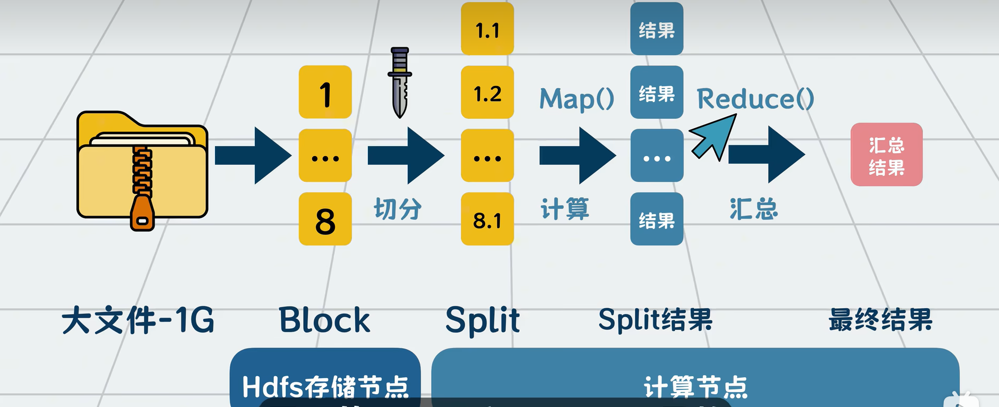
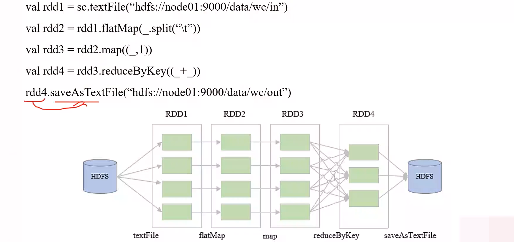
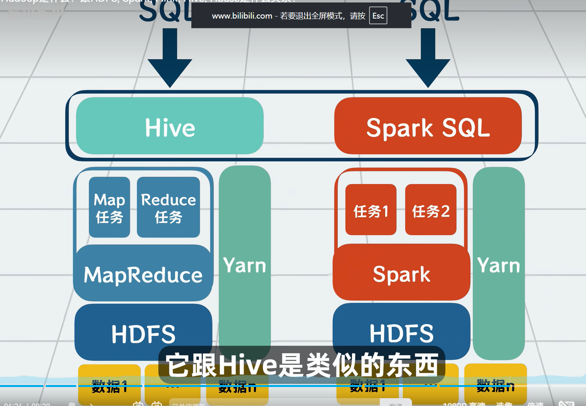

1. Hadoop是一个开源的分布式计算框架，专为海量数据存储与批处理设计，主要由HDFS、MapReduce、Yarn组成
   * HDFS：它是一个分布式文件系统，实际上就是对部署在多台独立物理机器上的文件进行管理，实际数据存在Datanode上。它存储的就是原先大数据被切分之后的小数据，一般都有很多hdfs节点
   * MapReduce：和存储类似，将数据切分为很多份，每份就是一个分片，然后分给多个服务器计算，再将结果聚合起来就行。Map和Reduce就是我们定义的两个阶段，来告诉每台服务器该怎么计算分片数据，怎么聚合。MapReduce就是map和reduce两个阶段，分而治之，然后聚合
   
   * Yarn：负责资源管理，给每个分片任务分服务器资源，然后将map和reduce的结果返回
2. Hadoop的MapReduce中间计算结果存在HDFS磁盘上，延迟大；Spark中间计算结果存在内存中
3. Spark 是一个开源的、分布式、内存级、统一分析引擎，用于处理大规模数据集。Spark Core、Spark SQL、Spark Streaming、Spark MLlib、Spark GraphX
4. RDD是Spark最核心的底层抽象，它代表一个不可变的、分区的、可并行计算的元素集合，它表示的是弹性分布式数据集。RDD操作分为Transformation和Action两种，前者是将一个RDD转换为一个新的RDD，后者是触发一个计算，触发结果的输出。RDD转换之间一对一为窄依赖，多对一为宽依赖，宽依赖中间有shuffle，数据恢复起来比较麻烦
5. DAG指的是Spark应用程序执行时，由RDD的Transformations所构成的逻辑图。顶点就是RDD，边代表了RDD之间的依赖关系（窄依赖或宽依赖）。Spark的DAGScheduler核心任务就是基于 DAG 中的宽依赖来划分 Stage
6. Stage是Spark执行过程中物理调度的基本单位。它是DAG被DAGScheduler划分后产生的一组并行任务的集合（划分依据：遇到窄依赖，就将当前的 RDD 加入到同一个 Stage 中，遇到宽依赖，就在此处断开，创建一个新的 Stage）。一个Stage包含多个Task，task数量等于该Stage中最后一个RDD的分区数，每个Task之间可以并行执行
7. DataFrame、Dataset API是上层API接口，它的底层是通过RDD实现的，但它不只是简单的RDD封装，而添加了优化、内存管理等策略，它使用了Catalyst优化器，性能得到提升，并且它是直接使用类SQL语言，开发起来更容易、更简单
8. 对比Spark和MapReduce模型
   * MR:每个Map和Reduce任务结束后，中间结果必须写入HDFS磁盘；
   * SP:中间结果优先存储在内存中
   * MR:核心抽象是Mapper和Reducer函数。开发者需要围绕这两个函数组织代码
   * SP:核心抽象是RDD,基于它进行运算
   * MR:依赖HDFS的数据多副本存储保证数据可靠性
   * SP:如果某个RDD分区丢失，Spark可以利用血统信息重新计算该分区，而不是依赖数据复制，节省空间（容错机制）
   * MR:以原生Jave为主
   * SP:支持Scala、Python、Java等
9. Spark是用来替换mapreduce模型的，以一个更优的设计来代替mapreduce模型
10. spark中可以通过 RDD（RDD是只读的）API 实现 类似MapReduce的作用，Spark是基于RDD运算的，它把数据读进来后转换为RDD，之后再对这个RDD进行算子操作（其中包含了map、reduce等丰富的算子），最后一个RDD基本就是最终结果
   
   * RDD操作分为Transformation和Action两种，前者是将一个RDD转换为一个新的RDD（如：map、filter、union等），后者是触发一个计算，触发结果的输出（例如：first、count、saveAsTextFile等）
   * RDD转换之间一对一为窄依赖，多对一为宽依赖，宽依赖中间有shuffle，数据恢复起来比较麻烦，尽量避免宽依赖算子，如reducebykey、sortbykey等
11. Spark是大数据处理中的通用计算引擎，它支持批处理和流处理
12. Spark的显著特点是它能够在内存中进行迭代计算，从而加快数据处理速度
13. Spark提供了6大组件：Spark Core、Spark SQL、Spark Streaming、Spark MLlib、Spark GraphX
14. Spark Core是Spark基础，它提供了内存计算的能力。它将分布式数据抽象为弹性分布式数据集（RDD），并为运行在其上的上层组件提供API。所有Spark的上层组件都建立在Spark Core的基础之上
15. Hadoop中的Hive可以将SQL查询转换为MapReduce任务；Spark通过Hive on Spark的适配层将SQL转换为Spark任务，但为了搭配起来性能更好，Spark中使用Spark SQL代替了Hive
   
16. Hadoop和Spark都是为离线数据设计的
17. Spark SQL是一个用于处理结构化数据的Spark组件。它允许使用SQL语句查询数据，Spark支持多种数据源，包括Hive表等
18. Spark Streaming是一个用于处理动态数据流的组件。在处理动态数据流时，流数据会被分割成微小的批处理，这些微小批处理将会在Spark Core上按时间顺序快速执行
19. Spark MLlib 是 Spark 的机器学习库。它提供了常用的机器学习算法和实用程序，包括分类、回归、聚类、协同过滤、降维等
20. Spark GraphX 是 Spark 的图形计算库
21. Spark优势
    * 速度：基于内存
    * 易用性：支持多种语言
    * 通用性：提供了多种组件，可以支持不同类型的计算任务
    * 兼容性：支持多种数据源
22. Hive表是一个底层数据实际存放在HDFS中的逻辑表，使用它后可以使用类sql语句进行访问数据（元数据在 Hive Metastore、数据在 HDFS、用类 SQL 语言定义的‘分布式文件视图’）
    