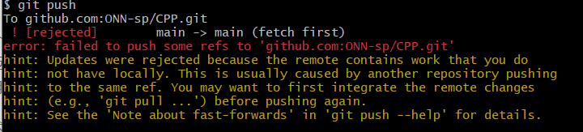

1. `Vscode`自带的`git`图形界面都是直接对本地仓库操作的,当本地提交后需要同步到远程才能在远程仓库更新
   
   
2. 注意:`vscode`删除分支需要命令行实现,它里面的删除分支只能删除本地分支,删除后没有同步更新到远程仓库的操作,所以需要命令行:`git push origin --delete feature-branch`
3. 公司中常用的`git`操作:
   * `git clone git@github.com:ONN-sp/CPP.git`:拉代码
   * `git branch`:查看当前分支
   * `git branch feature-branch`:创建新分支`feature-branch`,此时只在本地仓库创建了新分支
   * `git checkout feature-branch`:切换到新分支
   * `git push origin feature-branch`:将新分支推到远程仓库,如果有`git push --set-upstream origin feature-branch`就不需要它了
   * 然后就可以在新分支更新自己的代码:`git push --set-upstream origin feature-branch`(`git push --set-upstream origin feature-branch`:将`feature-branch`分支推到远程仓库`origin`,并且会设置该远程仓库的`feature-branch`是本地分支`feature-branch`的上游分支,从此之后就可以通过直接`git push`就能在本地和远程的`feature-branch`都同步更新了)、`git add .`、`git commit -m`、`git push`
   * 如果需要上线就要合并`feature-branch`到`main`分支上
   * `git checkout main`->`git merge feature-branch`:将`feature-branch`分支合并到`main`分支,此时只是在本地仓库更新了;`git push origin main`:将本地仓库的`main`分支推到远程仓库中
   * `git branch -d feature-branch`:在本地仓库删除`feature-branch`分支;`git push origin --delete feature-branch`:在远程仓库删除`feature-branch`分支
4. `main`叫做主分支,也叫做产品分支;`feature-branch`叫开发分支
5. 命令行中要有`origin`就表示对远程仓库的操作
6. 合并仓库时出现冲突:多个同事操作时,如果另一个同事已经合并了新代码到`main`分支中,但是我本地仓库的`main`分支还是之前的内容(即这个错误提示表明远程仓库中的`main`分支包含了本地没有的更新),此时如果我对我自己的分支的代码进行`merge`时就会出错:
   
   解决的办法就是在`merge`之前,先同步一下`main`分支,即`git pull origin main`
7. 需要注意的是:在合并的时候很有可能出现冲突或者不同步的问题
8. 合并分支报错
   
   因为开发分支有修改但是没有`push`,因此此时直接切换到主分支会报错,需要先在开发分支`push`后才行
   