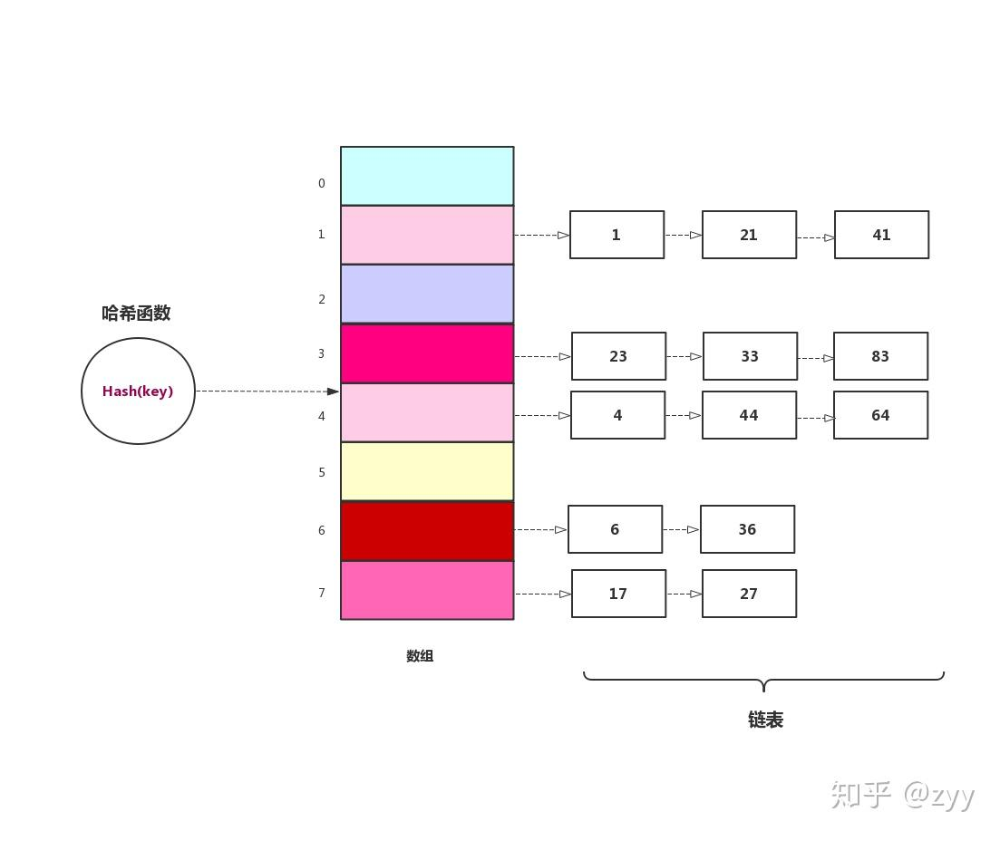
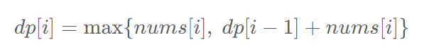
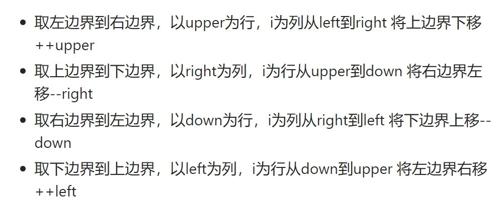
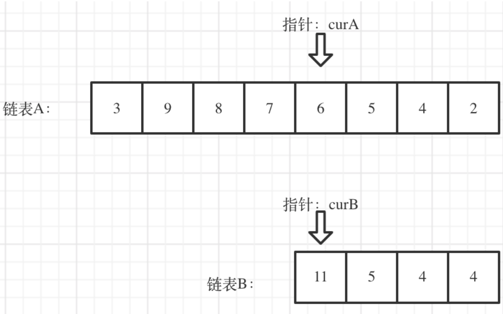

# 两数之和
1. 迭代器是一种检查容器内元素并遍历元素的数据类型,通常用于对C++中各种容器内元素的访问,但不同的容器有不同的迭代器,可以将其理解为指针
2. 按照迭代器的功能强弱,可以把迭代器分为<mark>输入迭代器、输出迭代器、前向迭代器、双向迭代器和随机访问迭代器</mark>
3. 
   ```C++ 
   1. begin():指向容器第一个元素的迭代器  rq.begin() OR begin(rq)
   2. end():指向容器最后一个元素的下一个位置的迭代器  rq.end()  OR  end(rq)
   3. 迭代器的通用功能:
      * 比较两个迭代器是否相等(==,!=)
      * 前置和后置递增运输(++)
      * 读取元素的解引用运算符(*).只能读元素,也就是解引用只能出现在赋值运算符的右边
      * 箭头运算符(->),解引用迭代器,并提取对象的成员   如:it->second(提取it迭代器位置的vlaue)
   ```
4. 
5. 无序容器(关联式容器)使用键值对(pair类型)的方式存储数据,关联式容器的底层实现采用的树存储结构,更确切的说是红黑树结构;而无序容器的底层实现采用的是哈希表的存储结构
6. `std::unordered_map<std::typename, std::typename> umap`
7. 无序容器
   ```C++
   1. unordered_map:存储键值<key, value>类的元素,其中各个键值的值不允许重复,且该容器中存储的键值是无序的
   2. unordered_multimap:和unordered_map唯一的区别在于,该容器允许存储多个键相同的键值对
   3. unordered_set:不在以键值对的形式存储数据,而是直接存储数据元素本身.另外,该容器存储的元素不能重复,且容器内部存储的元素也是无序的
   4. unordered_multiset:和unordered_set唯一的区别在于,该容器允许存储值相同的元素
   ```
8. `unordered_map`容器位于`<unordered_map>`头文化中,并位于`std`空间中
9. `unordered_map`的常见成员方法:
   ```C++
   *.size()
   *.find(key):查找key对应的值
   *.count(key):查找以key为键的键值对个数
   ```
10. <span style="color:red;">`unordered_map`的`key`只能用基本数据类型(包括`string`),但是结构体、类或数组`vector`等都是不行的;而哈希表的`value`可以是数组等其它复杂类型</span>
# 字母异位词分组
1. 整个`vector`容器不能直接用标准输出流进行输出
2. `vector`容器只有非空的时候才能使用`[]`索引的方法.若是直接下标访问空的会报错
3. `STL`中的`sort()`函数并非只是普通的快速排序,它是一个比较灵活的函数,它会根据我们数据的需要进行排序.使用`sort()`函数要包含头文件`#include<algorithm>`
4. `sort()`函数对给定区间所有元素进行排序,`sort(begin, end, cmp)`其中`begin`为指向待排序的数组的第一个元素的指针(或容器的开始迭代器),`end`为指向待排序的数组的最后一个元素的下一个位置的指针(或容器的结束迭代器),`cmp`参数为排序准则,`cmp`参数可以不写,默认从小到大进行排序
5. 哈希表是根据关键码(`key`)的值而直接进行访问的数据结构.<mark>一般哈希表都是用来快速判断一个元素是否出现集合里,或者元素出现的次数</mark>
6. 此题有排序和计数两种方法,但都是基于哈希表的
7. `vector`容器是`emplace_back`
8. `unordered_map`容器插入元素可以
   ```C++
   1. 直接赋值 
   unordered_map<int, int> mm;
   mm[1]=2;//m[key] = value;
   2. insert方法
   mm.insert(pair<int,int>(1,2));
   3. emplace方法
   mm.emplace(1,2)
   ```
9. <mark>此题中向`unordered_map`容器插入键值对时,遇到相同键值它就会自动把对应的所有`value`合在一个,然后一起对应这个`key`(因为`unordered_map`的键值不能重复)</mark>
10. `'b'-'a'=1,'0'+1='1'`
# 哈希表
1. 哈希表也叫散列表,哈希表是一种数据结构,它提供了快速的插入操作和查找操作,它的插入和查找的时间复杂度都是`O(1)`
2. 我们是通过`key`去查找`value`
3. 哈希函数的作用是帮我们把非`int`的`key`转化为直接查找用的数组下标
4. 哈希冲突是不可避免的,常用解决冲突的方法是:开放地址法(线性探测、二次探测、再哈希法)和链表法
5. 开放地址法中通过在哈希表中再寻找一个空位解决冲突的问题.而链表法是每个数组对应一条链表,当个`key`通过哈希函数落到哈希表中的某个位置,则把该条数据添加到链表中,其它同样映射到这个位置的数据项也只需添加到链表中,并不需要在原始数组中寻找空位来存储:
   
6. <mark>哈希表是基于数组的,所以要把`key`转换为数组下标,而这就是哈希函数的功能,转换后的下标就是哈希值</mark>
7. `unordered_map`容器插入的键值对本身是无序的,其中`insert`方法和`vetcor`的`push_back`也不同,它是按照哈希值进行散列的
# 最长连续序列
1. `unordered_set`,`std::unordered_set<std::typename> uset`:
   ```s
   1. 不再以键值对的形式存储数据,而是直接存储数据的值
   2. 容器内部存储的各个元素的值都互不相等,且不能被修改
   3. 不会对内部存储的数据进行排序
   ```
2. `sort`函数不支持对哈希表容器进行排序
3. 迭代器`it`,而`*it`是一个`const`,它是不能被直接赋值的,如:
   ```C++
   eg:
   unordered_set<int> set;
   for(auto i=set.begin();i!=set.end();i++)
      *i = 2;//这是不允许的
   ```
4. `set`和`unordered_set`容器是不允许直接修改元素值的,只能先删除再添加
5. `C++`中`for`的新用法,很适用于容器的遍历:
   ```C++
    std::vector<int> arr;
    arr.push_back(1);
    arr.push_back(2); 
    for (auto n : arr)
    {
        std::cout << n << std::endl;
    }
   ```
6. <mark>容器的遍历:下标法、`for :`、迭代器`begin end`</mark>
7. `set`和`unordered_set`容器会自动删除重复的元素,即重复的元素只会`emplace\insert`一个
8. `unordered_set`容器的添加元素方法是`.insert()`、`.emplace()`和`.emplace_hint()`,没有`.push_back()`
9. <span style="color:red;">`C++ STL`标准库中,所有无序容器的底层实现都采用的是哈希表存储结构.更准确地说,是用链表法解决数据存储位置发生冲突的哈希表</span>
10. `C++ STL`无序容器存储状态示意图:
    
    图中的各个链表称为桶(bucket)
# 移动零
1. 迭代器虽然可以看作指针来理解,但是它们之间还是不能直接赋值的
# 盛最多水的容器
1. <sapn style="color:red;">双指针算法指的是在重复遍历对象的过程中，不是在两个循环中使用单个指针进行重复访问，而是在一个循环中中使用两个相同方向（快慢指针fast slow）或者相反方向（对撞指针left right）的指针进行访问</span>
2. 双指针将一个两层循环转化成了一层循环，时间复杂度也从O(n^2)变成了O(n)
3. <mark>一般来讲，当遇到需要对一个数组进行重复遍历时，可以想到使用双指针法</mark>
4. <mark>找到判断指针移动的条件是双指针的核心</mark>
5. 哈希表本质就是一个数组，只不过在对元素进行处理前，需要经过哈希函数的加工，index=hashfuction(key)
6. 哈希法是牺牲了空间换取了时间
7. 空间复杂度是对算法在运行过程（也就是整个代码）中占用存储空间大小的一个量度，而
   ```C++
   while(n--){
   int i;
   }
   //这个i是每一次循环创建一个临时变量并把之前那个空间释放，即空间复杂度为O(1),而不是O(n)
   ```
8. <span style="color:red;">对撞指针很适用于有序数组</span>
# 三数求和
1. 对一个嵌套容器(容器的元素还是容器)的赋值
   ```C++
   1. 错
   vector<vector<int>> result;
   result[j].emplace_back(nums[i]);
   result[j].emplace_back(nums[forward]);
   result[j].emplace_back(nums[end]);
   //emplace_back最初是空的不能直接用下标索引.并且也不能result[j].emplace_back(nums[i],nums[forward],nums[end]),因为emplace_back只能一次传入一个元素
   2. 对
   vector<vector<int>> result;
   result.emplace_back(vector<int>{nums[i],nums[forward],nums[end]})
   ```
2. 此题最重要的是去重,但这里的去重不是去掉数组的相同元素,而是去掉相同结果集,所以set不能直接完成这里的去重
3. 此题中的三数求和是求的数组的三个元素，而不是对应的下标，这和题库中前面的两数求和(1)不同(双指针不能用来求下标这种题型，因为不能用sort)
4. 注意此题的剪枝情况(去重也可视为一种剪枝操作):
   ```C++
   eg:
   if(nums.size())
      return result;
   eg:
   if(nums[i]>0)
      return result;
   ```
5. 剪枝通常指的是一种优化技术，通过提前判断和排除不必要的搜索分支来减少搜索空间，以提高算法的效率，这通常应用于搜索算法或者递归算法中
6. <mark>`C++ STL`中的`sort`通常会使用底层实现来执行排序操作，而不会创建额外的临时数组</mark>
7. 此题的去重、剪枝、双指针移动条件的方法适用于此类问题：求数组中n个元素的和与target相等形成的解集（元素解），不显示重复的n元组
# 接雨水
1. 此题我是按列计算的,即每次计算一个宽度为1的方块的积水面积.每一列的积水面积公式=`(min(left_max,right_max)-height[i])*1`
# 无重复字符的最长子串
1. <mark>滑动窗口法可以用来解决一些查找满足一定条件的连续区间的性质(长度等)的问题</mark>,由于区间连续,因此当区间发生变化时,可以通过旧有的计算结果对搜索空间进行剪枝(确定左指针位置),这样便减少了重复计算,降低了时间复杂度.<mark>滑动窗口法往往类似于"请找出满足xx的最x的区间(子串、子数组)的xx"这类问题</mark>
2. 
3. <span style="color:red;">滑动窗口不能向双指针那样可以根据题意指针跳着访问,滑动窗口的右指针肯定是要一个一个遍历的,而左指针可以跳着访问</span>
4. <mark>滑动窗口法关注的是两个指针间的区间(内容、长度等),双指针关注的两个指针端点</mark>
5. 滑动窗口如何更新左指针很重要
6. <span style="color:red;">此题左窗口边界(左指针)依赖于新加入字符上一次出现的位置:如果新加入字符上一次出现的位置在此时未更新时窗口外,那么左边界就不需要变化;如果新加入字符上一次出现的位置在此时未更新时窗口内,那么左边界就要更新为上一次出现的位置的下一个位置</span>
7. `first=max(first, mm[s[second]])`是代码核心
8. 滑动窗口的窗口大小可能是固定的也可能不是固定的
# 找到字符串中所有字母异位词
1. <mark>子串必须是连续字符组成;而子序列可以是任意选取.滑动窗口可以很好的解决子串问题</mark>
2. 此题`leetcode`官网关于滑动窗口的解题方法:
   ```s
   1. 先初始化第一个滑动窗口(此滑动窗口可能满足题意也可能不满足)  0-p.size()
   2. 再依次向s字符串后面移动,一个一个的判断新窗口,如s[i]移出窗口,那么s[i+p.size()]就加入了新窗口
   ```
3. 此题的优化方法很巧,利用`differ`来判断,对移出的字符和新加入的字符处理细节很6
4. 此题`leetcode`官网解答的滑动窗口法没有结合双指针,一是因为它是固定滑动窗口,可以不用非要显式指针;二是因为如果想用左指针进行剪枝操作的话,对于此题来说操作起来比较复杂
# 和为k的子数组
1. 这个题用滑动窗口法感觉可以，但是我没成功，因为窗口有点不好取，不好判断怎样才构成一个窗口
2. 可以使用前缀法的题比较明显,即把前缀列一下,看看利不利于解题就行了.此题就是很明显的利用前缀更简便
3. 前缀和:从位置0到位置i这个区间内的所有的数字之和
4. 此题不能先构建完哈希表,再找和为k的子数组.因为,对于第i个前缀和,我们需要在它之前的前缀和数组中找`sum_temp-k`这个值是否有,而不包括自身和后续会加进来的`key`=前缀和,`value`=次数这对键值对
# 滑动窗口的最大值
1. `deque`是双端队列容器.它擅长在头部或尾部添加或删除元素,耗时为O(1).
2. 栈和队列
   
3. <mark>当需要向序列两端频繁的添加或删除元素时,应首选`deque`容器(时间复杂度为O(1))</mark>
4. `deque`容器的一些方法:
   ```C++
   .front();//返回第一个元素的引用
   .back();//返回最后一个元素的引用
   .push_back();//在序列的尾部添加一个元素
   .push_front();//在序列的头部添加一个元素
   .pop_front();//移除容器尾部的元素
   .pop_back();//移除容器头部的元素
   ```
5. `C++`中没有专门针对于栈、队列的容器类型(`stack  queue`).`stack`、`queue`、`priority_queue`是`STL`中的三种容器适配器,它们底层是用基础容器实现的,默认为:
   
6. 容器适配器就是将不适用的序列式容器(`vector deque list`)变得适用,即通过封装某个序列式容器使其满足特定的数据结构(栈、队列)
7. 此题直接用滑动窗口+`max_element()`方法时间复杂度太大了,虽然结果是对的
8. 此题用的是`deque`容器搭建的单调队列数据结构
9. <span style="color:red;">此题也是先初始化第一个窗口(与“找到字符串中所有字母异位词”类似),然后一个一个(这样的话一次循环产生就是一个新窗口的诞生(窗口大小固定))的往后移动进而判断新产生的窗口</span>
# 最小覆盖子串
1. 对于大多数涉及到两个字符串的问题都需要先判断长度,从而`return`:
   ```C++
   if(s.size()<p.size())
      return result;
   ```
2. 此题与"和为k的子数组"一样,用<mark>哈希表</mark>处理字符和字符频数(数值和数值频数)
   ```C++
   unordered_map<char int> mm;
   for(auto& c:s)
      mm[c]++;
   ```
3. 此题思路:先快指针移动,寻找包含t字符串的较大窗口;然后左指针移动,在刚刚由右指针移动而产生的合适区间中缩小区间至刚好包含t字符串;在处理中最重要的细节是:哈希表中频次的+1和-1
4. 如何在s字符串中找一个子串包含另一个字符串的所有字符:<mark>哈希表</mark>
   ```C++
   unordered_map<char int> hash;
   for(auto& c:s)
      hash[c]++;
   int count_num=0;//统计包含t字符串字符的个数
   while(fast<s.size()&&count_num<t.size()){
      if(hash.count(s[fast])){ 
         if(hash[s[fast]]>0)
            count_num++;
      hash[s[fast]]--;
      }
      fast++;
   }
   //当count_num==t.size()的时候就找到了一个满足题意的子串.此时hash中存储的字符频数等于0或小于0
   ```
5. 如何判断s字符串包含另一个字符串t的所有字符:
   ```C++
   1. 一个哈希表
   unordered_map<char, int> hash;
   int p=0;
   int cnt=0;
   for(auto& c:t)
      hash[c]++;
   while(p<s.size()){
      if(hash.count(s[p])&&hash[s[p]]!=0){
         cnt++;
         hash[s[p]]--;
      }
      p++;
   }
   if(cnt==t.size())
      return true;
   return false;
   2. 两个哈希表
   unordered_map<char, int> hashs, hasht;
   for(auto& c:s)
      hashs[c]++;
   for(auto& c:t)
      hasht[c]++;
   for(int i=0;i<t.size();i++){
      if(!hashs.count(t[i])||hashs[t[i]]<hasht[t[i]])
         return false;
   }
   return ture;
   ```
6. `str2 = str.substr(start, end)`:将str字符串中从start到end的子串赋给str2
7. `str1.find(str2)`:在str1中找等于str2的子串,返回的是str2在str1中的下标位置
# 最大子数组和
1. <mark>动态规划:DP;如果某一问题有很多重叠子问题,使用动态规划有效.动态规划中每一状态一定是由上一个状态推导出来的,如斐波那契数列</mark>
2. 动态规划解题步骤:
   ```s
   1. 确定dp数组以及下标含义
   2. 确定递推公式
   3. dp数组如何初始化
   4. 确定遍历顺序
   5. 举例推导dp数组
   ```
3. 此题的dp[i]:表示以nums[i]结尾的连续子数组的最大和
4. 此题思路:第i个子问题考虑为以nums[i]结尾的连续子数组的最大和.此题的状态转移公式(方程)为:
5. 动态规划问题必须是<mark>无后效性的</mark>.无后效性:当前状态dp[i]要得到下一状态dp[i+1],这与dp[i]之前的状态无关.此题就是无后效性的,当dp[i]的状态一旦确定,则此后过程(如dp[i+1])的演变不再受此前各种状态及决策的影响
# 合并数组
1. 做题要首先考虑给定数组为空的情况(剪枝)
2. `max`操作可以减少一个`if`判断
3. <span style="color:red;">判断区间重叠的题,一般都是要先排序,让所有相邻的区间尽可能重叠在一起,这里按左边界排序和右边界排序都可以</span>
4. 此题判断重叠的思路:排序后只需要比较前一个区间的右端点和这个区间的左端点大小,如果前一个区间右端点大于等于,则说明两个区间有重叠,则取这两个区间右端点的最大值即可
5. `sort`并不是简单的快速排序，它对快速排序进行了优化。此外，它还结合了插入排序和堆排序.系统会根据数据形式和数据量自动选择合适的排序方法.它每次排序中不只选择一种方法，比如给一个数据量较大的数组排序，开始采用快速排序，分段递归，分段之后每一段的数据量达到一个较小值后它就不继续往下递归，而是选择插入排序，如果递归的太深，他会选择推排序
   
# 轮转数组
1. 环状替换的思路:从位置0开始,最初令temp=nums[0].根据规则,位置0的元素会放至(0+k)%n的位置,然后再令x=(0+k)%nums.size(),此时交换temp和nums[x]即完成更新.然后,继续考虑位置x,并交换temp和nums[(x+k)%nums.size()],从而完成下一次更新,直至回到初始位置就一次更新结束
2. 必须使用临时变量temp,用来存储nums中被覆盖的元素,而这个元素也是下一次考虑交换的位置
   
3. 容易发现,当回到初始位置0时,有些数字可能还没有遍历到,此时我们应该从下一个元素开始重复的过程
4. <mark>此方法最关键的就是找到正确的遍历次数:`gcd(nums.size(),k)`,即`nums.size()`和`k`的最大公约数</mark>
5. `lcm(a,b)和gcd(a,b)`:最小公倍数、最大公约数;最小公倍数*最大公约数=两数之积
6. 当我们将数组的元素向右移动k次后.尾部`k%nums.size()`个元素会移动至数组头部,其余元素向后移动`k%nums.size()`个位置
7. 基于以上数组翻转时的事实,<span style="color:red;">数组翻转法的思路为:先将所有元素翻转,这样尾部的k%n个元素就被移至数组头部,然后我们再翻转[0,k%n-1]区间的元素和[k%n,n-1]区间的元素即可</span>
8. `void assign(const_iterator first,const_iterator last)`:将区间[first,last)的元素赋值到当前的vector容器中,这个容器会清除掉vector容器中以前的内容(<mark>不管是之前容器的长度更长或者更短,都会完全清除</mark>)
9. `std::reverse(iterator first, iterator last)`:参数是迭代器,表示要翻转的范围;reverse函数用于反转在[first,last)范围内的顺序(包括first指向的元素,不包括last指向的元素),reverse函数没有返回值
# 除自身以外数组的乘积
1. 此题的思路:一个数除自身以外数组的乘积=该元素在数组中的前缀积*后缀积(<mark>前缀积求解要从左往右求,后缀积要从后往前(就是从右往左)求</mark>).因此,我们可以分别用三个循环、1个前缀积数组、1个后缀积数组进行求解
2. 为了更低的时间复杂的和更小的空间复杂度,我们将输出结果数组`result`先作为前缀积数组(即保留前缀积值),然后用一个中间变量`temp`保留`nums[i]`处的后缀积,再将相乘结果替换`result[i]`,即两个循环、一个中间变量完成求解
3. `vector.back()`:返回最后一个元素的引用(不是指针)
# 第一个缺少的正整数
1. 本题基于的事实:<mark>对于一个数组,它的最小正整数一定$\in$[1, N+1](这个[1, N+1]=对应下标+1,所以其实是一个键值对为<key, value>=<i-1, i>(i$\in$[i, N])的哈希表),当数组刚好包括完了1,2,...,N这N个元素,那么最小正整数结果是N+1</mark>
2. <mark>数组可以看作一个`key=下标,value=数组对应元素`的一个哈希表,而本题的两种方法都是基于这种思路进行的</mark>
3. 此题是基于哈希表的思路,但是它要求空间复杂度O(1),所以使用数组的`value--index`来构造的一个"类哈希表"
4. <span style="color:red;">哈希表(打标记)思路:
   * 将数组中所有小于等于0的数修改为N+1；
   * 遍历数组中的每一个数,将数组中`nums[i]<=N&&nums[abs(nums[i])-1]>0`的数取反,即表示这个数组里面第abs(nums[i])个位置的数是存在的
   * 在遍历完成之后,如果数组中的每一个数都是负数,那么答案是N+1,否则答案是第一个正数的位置加1</span>
5. <span style="color:red;">置换法的思路:也是基于最小正整数$\in$[1, N+1],因此把数组中在[1, N+1]内的数置换到对应的下标位置处,然后再在数组中找第一个不等于下标+1的元素(数组nums不包含值为i+1(在[1, N+1]内)的元素),则此时i+1就是最小正整数</span>
6. 最小是用"下标本身就是从小到大的顺序排列"这个事实来实现的
7. 置换法中`nums[i]!=nums[nums[i]-1]`是保证不出现死循环,即要交换的两个元素相同就没必要交换了
8. <mark>此题的思路很新奇</mark>
# 矩阵置零
1. 由题意可知,我们只需知道矩阵中0元素对应的行列标即可,因此可以利用两个标记数组分别存储行标、列标就行(空间复杂度:O(m+n))
2. 为了减少空间复杂度,我们可以将矩阵的第一行和第一列作为行列标记数组来存储对应的0元素行标和列标,但这样会导致原矩阵的第一行和第一列被修改,无法记录它们原本是否包含0,因此需要额外的标记变量来分别记录第一行和第一列是否原本包含0.这个思路其实就是考虑除去第一行和第一列的新矩阵
3. 在两个标记变量的基础上,因为`matrix[0][0]`可以表示第一行或者第一列的是否含0情况,因此可以把`matrix[0][0]`设为第一列的标记变量,再单独设一个行标记变量`flag`即可
# 螺旋矩阵
1. 将矩阵看成若干层,首先输出最外层元素,其次输出次外层元素,直到输出最内层元素;显然,遍历一圈上下左右(upper,down,left,right)四个边界就会向内收缩一个单位.而遍历结束的条件就是左边界超过有边界或者上边界超过下边界
   
# 旋转图像
1. 从图可知,第`i`行对应的位置为第`n-i`列,但是这样做会需要一个额外数组进行存储矩阵的原始值
2. 原地交换的思路:为了实现原地交换,我们可以按从外向内的圈考虑,因为交换的元素肯定在一个圈上.从图像矩阵的旋转可知,任何一个元素对应的是4个元素的交换,因此可用使用一个临时变量来实现圈上的四个元素的原地交换;进一步可知,第`i`圈只需遍历`n-i-1`个元素(从第`i`圈的第一行观察就可清楚);而一个`n*n`的矩阵,一共需遍历`n/2`个圈、
3. 实现一个圈上4个位置的元素的原地交换
   ```C++
    int temp=matrix[i][j];
    matrix[n-j-1][i]=matrix[n-i-1][n-j-1];
    matrix[n-i-1][n-j-1]=matrix[j][n-i-1];
    matrix[j][n-i-1]=temp;
   ```
# 搜索二维矩阵Ⅱ
1. 对于这种由有序数组组成的数据结构,第一反应就是直接用二分法查找
2. 为了进一步降低时间复杂度,我们可以考虑使用`Z字形查找`,基于每行元素从左到右升序排列、m每列元素从上到下升序排列的事实,可以有以下思路:从矩阵的右上角考虑(因为对于右上角处的元素,它若大于target它就只能往下走,往左值会越来越小);若大于target,则会减此时的列标(相当于删去最后一列,再考虑新的矩阵的右上角元素);若小于target也是同理.在搜索过程中,当超出了矩阵边界,则矩阵中不存在target
# 二分法(查找/搜索)
1. 二分法是一种在有序数组或列表中查找目标值的高效算法,该算法的基本思想是将待查找的区间分为两部分，并在每次比较中将查找的区间分为两部分,并在每次比较中将查找范围缩小一半,直到找到目标值或确定目标值不存在为止
2. 二分法具体步骤:
   ```C++
   1. 初始化左右边界left.通常,左边界初始化为数组的起始位置0,边界初始化为数组的结束位置.size()   #形成一个左闭右闭区间
   2. 在每次迭代中,计算中间位置mid,即(left + right) / 2
   3. 如果目标值等于 array[mid],则找到目标值,返回 mid
   4. 如果目标值小于 array[mid],则目标值可能位于左半部分,更新右边界为 mid - 1
   5. 如果目标值大于 array[mid],则目标值可能位于右半部分,更新左边界为 mid + 1
   6. 重复步骤 2 到步骤 5,直到左边界大于右边界为止.如果找到目标值,则返回其索引;否则,返回不存在的指示
   ```
3. 二分法代码:
   ```C++
   1. 按照步骤手撕:
   //二分法
   bool searchMatrix(vector<vector<int>>& matrix, int target) {
      for(auto& i:matrix){//每一行的数组元素
            //定义一个左闭右闭的二分区间,下面是左闭右闭的写法
            int left=0;//二分区间的左端点
            int right=matrix[0].size()-1;//二分区间的右端点
            while(left<=right){
               int middle=(left+right)/2;
               if(i[middle]>target)
                  right=middle-1;
               else if(i[middle]<target)
                  left=middle+1;
               else
                  return true;
            }
            return false;
      }
      2. 利用lower_bound()函数:
      bool searchMatrix(vector<vector<int>>& matrix, int target) {
         for(auto& i:matrix){
            auto t = lower_bound(i.begin(),i.end(),target);//找到第一个不小于target的元素,并返回其迭代器
            if(t!=i.end()&&*i==target)
               return true;
         }
         return false;
      }
      //std::lower_bound()是C++标准库的一个函数,它用于在已排序的序列(数组、向量等)中查找第一个不小于某个值的元素,并返回其迭代器
      ```
4. 二分法的时间复杂度是`O(logn)`
# 相交链表
1. 此题的关键是:交点不是数值相等,而是指针相等.为了找到起始交点,那么应该让两个链表尾部对齐,即把长的链表向后移动两个链表长度差值这么长后的节点处
   
   
# 翻转链表
1. 此题有两种方法:递推法(迭代法)、递归法
2. 递推法就是在顺序访问链表的同时修改相邻两个节点的指向,需注意的是要保存`cur`节点的初始`cur->next`
3. 递归法=递推+回溯,其中终止条件`return`是递推的结束/回溯的开始,需要注意的是递归的后续回溯过程不是终止条件的`return`,而是函数正常结束的`return`;终止条件(基本情况)只会访问一次
4. 为了更清晰的想清楚迭代公式,可以利用`nullptr`,并将它想做`head`的前一个节点,并且这样不用在外面显示重新设翻转后的节点的`.next`成员为`NULL`
5. <span style="color:red;">翻转链表的方法技巧:使用3个节点指针`pre cur nex`,分别记录相邻的三个节点;`pre`初始化为一个`nullptr`,`cur`初始化为待翻转链表的起点;`nex`为此时`cur`的下一个节点(即`cur->next`);在迭代的过程中,第一次迭代不是将第二个节点的`next`指向第一个节点,而是将`cur->next`初始化为`nullptr`;然后`pre cur nex`依次往后移一个节点位置,后续的迭代过程就是改`next`的指向了:</span>
   ```C++
   1. 初始化定义:
   ListNode* pre=nullptr;
   ListNode* cur=head;
   2. 循环往后访问<=>while(cur!=nullptr):
   ListNode* nex=cur->next;
   cur->next=pre;
   pre=cur;
   cur=nex;
   3. 最后return pre;
   ```   
# 回文链表
1. <mark>计算机运行递归函数,在一个函数中调用一个函数时,计算机需要在进入被调用函数之前跟踪它在当前函数中的位置(以及任何局部变量的值),通过运行时存放在栈中来实现.而这开销往往很大</mark>
2. 此题可以用一个额外数组存储每一个节点的`vlaue`,但是空间复杂度`O(n)`;此题还可以用递归和快慢指针(`slow=slow->next;fast=fast->next->next`)方法,下面将快慢指针的思路:首先找到此时链表的中间节点;然后从这个中间节点开始翻转后半部分的链表;再和前半部分链表一起判断是否为回文链表.此方法的主要细节在找中间节点中:因为链表可能是奇数或者偶数,所以循环终止条件是`fast!=nullptr&&fast->next!=nullptr`,对于奇数个数节点的链表应该单独处理,即把慢指针往后再移一个`slow=slow->next`
3. <mark>对于快指针`fast=fast->next->next`这种,对于奇数个链表节点和偶数个链表节点的判断链表终点的条件是不一样的(应该是`fast==nullptr || fast->next==nullptr`),因为`nullptr->next`是不存在的.</mark>(环行链表题目也有涉及)
# 环行链表
1. 检查链表中是否存在环的思路:利用快慢指针,可以理解为两个跑步的人,只要有圈,速度快的一定会和速度慢的相遇;而快指针为`fast=fast->next->next`,慢指针`slow=slow->next`