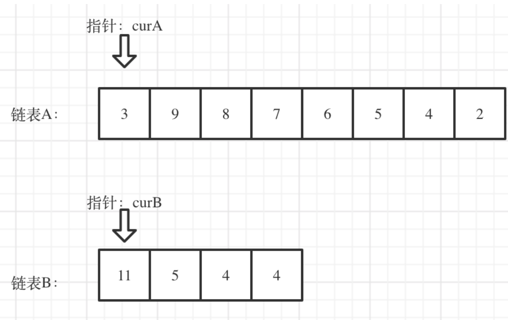

# 两数之和
1. 迭代器是一种检查容器内元素并遍历元素的数据类型,通常用于对C++中各种容器内元素的访问,但不同的容器有不同的迭代器,可以将其理解为指针
2. 按照迭代器的功能强弱,可以把迭代器分为<mark>输入迭代器、输出迭代器、前向迭代器、双向迭代器和随机访问迭代器</mark>
3. 
   ```C++ 
   1. begin():指向容器第一个元素的迭代器  rq.begin() OR begin(rq)
   2. end():指向容器最后一个元素的下一个位置的迭代器  rq.end()  OR  end(rq)
   3. 迭代器的通用功能:
      * 比较两个迭代器是否相等(==,!=)
      * 前置和后置递增运输(++)
      * 读取元素的解引用运算符(*).只能读元素,也就是解引用只能出现在赋值运算符的右边
      * 箭头运算符(->),解引用迭代器,并提取对象的成员   如:it->second(提取it迭代器位置的vlaue)
   ```
4. 
5. 无序容器(哈希容器)和关联式容器使用键值对(`pair`类型)的方式存储数据,关联式容器(如;`map  set  multimap multiset`)的底层实现采用的树存储结构,更确切的说是红黑树结构;而无序容器的底层实现采用的是哈希表的存储结构
6. `std::unordered_map<std::typename, std::typename> u_map`
7. 无序容器
   ```C++
   1. unordered_map:存储键值<key, value>类的元素,其中各个键值的值不允许重复,且该容器中存储的键值是无序的
   2. unordered_multimap:和unordered_map唯一的区别在于,该容器允许存储多个键相同的键值对
   3. unordered_set:不在以键值对的形式存储数据,而是直接存储数据元素本身.另外,该容器存储的元素不能重复,且容器内部存储的元素也是无序的
   4. unordered_multiset:和unordered_set唯一的区别在于,该容器允许存储值相同的元素
   ```
8. `unordered_map`容器位于`<unordered_map>`头文化中,并位于`std`空间中
9. `unordered_map`的常见成员方法:
   ```C++
   *.size()
   *.find(key):查找key对应的值
   *.count(key):查找以key为键的键值对个数
   ```
10. `unordered_map`的几种访问、遍历方法:
    ```C++
    1. 下标访问法,利用key
    2. .at(key)成员方法,返回的是key对应的value
    3. .find(key)成员方法,返回的是迭代器
    4. for(auto i:mm),返回的是键值对,不是迭代器.即i.first和i.second
    5. begin()/end(),遍历整个容器中的键值对,返回的是迭代器,即i->first和i->second
    ```
11. <span style="color:red;">`unordered_map`的`key`只能用基本数据类型(包括`string`),但是结构体、类或数组`vector`等都是不行的;而哈希表的`value`可以是数组等其它复杂类型</span>
# 字母异位词分组
1. 整个`vector`容器不能直接用标准输出流进行输出
2. <mark>`vector`容器只有非空的时候才能使用`[]`索引的方法.若是直接下标访问空的会报错</mark>
3. `STL`中的`sort()`函数并非只是普通的快速排序,它是一个比较灵活的函数,它会根据我们数据的需要进行排序.使用`sort()`函数要包含头文件`#include<algorithm>`
4. `sort()`函数对给定区间所有元素进行排序,`sort(begin, end, cmp)`其中`begin`为指向待排序的数组的第一个元素的指针(或容器的开始迭代器),`end`为指向待排序的数组的最后一个元素的下一个位置的指针(或容器的结束迭代器),`cmp`参数为排序准则,`cmp`参数可以不写,默认从小到大进行排序
5. 哈希表是根据关键码(`key`)的值而直接进行访问的数据结构.<mark>一般哈希表都是用来快速判断一个元素是否出现集合里,或者元素出现的次数</mark>
6. 此题有排序和计数两种方法,但都是基于哈希表的
7. `vector`容器是`emplace_back`
8. `unordered_map`容器插入元素可以
   ```C++
   1. 直接赋值 
   unordered_map<int, int> mm;
   mm[1]=2;//m[key] = value;
   2. insert方法
   mm.insert(pair<int,int>(1,2));
   3. emplace方法
   mm.emplace(1,2)
   ```
9. <mark>此题中向`unordered_map`容器插入键值对时,遇到相同键值它就会自动把对应的所有`value`合在一个,然后一起对应这个`key`(因为`unordered_map`的键值不能重复)</mark>
10. `'b'-'a'=1,'0'+1='1'`
# 哈希表
1. 哈希表也叫散列表,哈希表是一种数据结构,它提供了快速的插入操作和查找操作,它的插入和查找的时间复杂度都是`O(1)`
2. 在哈希表中,我们是通过`key`去查找`value`,即哈希表是基于键值对的,它是通过键值对的形式存储数据,
3. 哈希函数的作用是帮我们把非`int`的`key`转化为直接查找用的数组下标,哈希函数可以得到`key`的哈希地址
4. 哈希地址只是表示在查找表中的存储位置,而不是实际的物理存储位置
5. 哈希冲突是不可避免的,常用解决冲突的方法是:开放地址法(线性探测、二次探测、再哈希法)和链表法
6. 开放地址法中通过在哈希表中再寻找一个空位解决冲突的问题.而链表法是每个数组对应一条链表,当一个`key`通过哈希函数落到哈希表中的某个位置,则把该条数据添加到链表中,其它同样映射到这个位置的数据项也只需添加到链表中,并不需要在原始数组中寻找空位来存储:
   
7. <mark>哈希表是基于数组的,所以要把`key`转换为数组下标,而这就是哈希函数的功能,转换后的下标就是哈希值</mark>
8. `unordered_map`容器插入的键值对本身是无序的,其中`insert`方法和`vetcor`的`push_back`也不同,它是按照哈希值进行散列的
# 最长连续序列
1. `unordered_set`,`std::unordered_set<std::typename> uset`:
   ```s
   1. 不再以键值对的形式存储数据,而是直接存储数据的值
   2. 容器内部存储的各个元素的值都互不相等,且不能被修改
   3. 不会对内部存储的数据进行排序
   ```
2. `sort`函数不支持对哈希表容器进行排序
3. 迭代器`it`,而`*it`是一个`const`,它是不能被直接赋值的,如:
   ```C++
   eg:
   unordered_set<int> set;
   for(auto i=set.begin();i!=set.end();i++)
      *i = 2;//这是不允许的
   ```
4. `set`和`unordered_set`容器是不允许直接修改元素值的,只能先删除再添加
5. `C++`中`for`的新用法,很适用于容器的遍历:
   ```C++
    std::vector<int> arr;
    arr.push_back(1);
    arr.push_back(2); 
    for (auto n : arr)
    {
        std::cout << n << std::endl;
    }
   ```
6. <mark>容器的遍历:下标法、`for :`、迭代器`begin end`</mark>
7. `set`和`unordered_set`容器会自动删除重复的元素,即重复的元素只会`emplace\insert`一个
8. `unordered_set`容器的添加元素方法是`.insert()`、`.emplace()`和`.emplace_hint()`,没有`.push_back()`
9. <span style="color:red;">`C++ STL`标准库中,所有无序容器的底层实现都采用的是哈希表存储结构.更准确地说,是用链表法解决数据存储位置发生冲突的哈希表</span>
10. `C++ STL`无序容器存储状态示意图:
    
    图中的各个链表称为桶(bucket)
# 移动零
1. 迭代器虽然可以看作指针来理解,但是它们之间还是不能直接赋值的
# 盛最多水的容器
1. <sapn style="color:red;">双指针算法指的是在重复遍历对象的过程中,不是在两个循环中使用单个指针进行重复访问,而是在一个循环中中使用两个相同方向(快慢指针fast slow)或者相反方向(对撞指针left right)的指针进行访问</span>
2. 双指针将一个两层循环转化成了一层循环，时间复杂度也从O(n^2)变成了O(n)
3. <mark>一般来讲，当遇到需要对一个数组进行重复遍历时，可以想到使用双指针法</mark>
4. <mark>找到判断指针移动的条件是双指针的核心</mark>
5. 哈希表本质就是一个数组，只不过在对元素进行处理前，需要经过哈希函数的加工，index=hashfuction(key)
6. 哈希法是牺牲了空间换取了时间
7. 空间复杂度是对算法在运行过程（也就是整个代码）中占用存储空间大小的一个量度，而
   ```C++
   while(n--){
   int i;
   }
   //这个i是每一次循环创建一个临时变量并把之前那个空间释放，即空间复杂度为O(1),而不是O(n)
   ```
8. <span style="color:red;">对撞指针很适用于有序数组</span>
# 三数求和
1. 对一个嵌套容器(容器的元素还是容器)的赋值
   ```C++
   1. 错
   vector<vector<int>> result;
   result[j].emplace_back(nums[i]);
   result[j].emplace_back(nums[forward]);
   result[j].emplace_back(nums[end]);
   //emplace_back最初是空的不能直接用下标索引.并且也不能result[j].emplace_back(nums[i],nums[forward],nums[end]),因为emplace_back只能一次传入一个元素
   2. 对
   vector<vector<int>> result;
   result.emplace_back(vector<int>{nums[i],nums[forward],nums[end]})
   ```
2. 此题最重要的是去重,但这里的去重不是去掉数组的相同元素,而是去掉相同结果集,所以set不能直接完成这里的去重
3. 此题中的三数求和是求的数组的三个元素，而不是对应的下标，这和题库中前面的两数求和(1)不同(双指针不能用来求下标这种题型，因为不能用sort)
4. 注意此题的剪枝情况(去重也可视为一种剪枝操作):
   ```C++
   eg:
   if(nums.size())
      return result;
   eg:
   if(nums[i]>0)
      return result;
   ```
5. 剪枝通常指的是一种优化技术，通过提前判断和排除不必要的搜索分支来减少搜索空间，以提高算法的效率，这通常应用于搜索算法或者递归算法中
6. <mark>`C++ STL`中的`sort`通常会使用底层实现来执行排序操作，而不会创建额外的临时数组</mark>
7. 此题的去重、剪枝、双指针移动条件的方法适用于此类问题：求数组中n个元素的和与target相等形成的解集（元素解），不显示重复的n元组
# 接雨水
1. 此题我是按列计算的,即每次计算一个宽度为1的方块的积水面积.每一列的积水面积公式=`(min(left_max,right_max)-height[i])*1`
# 无重复字符的最长子串
1. <mark>滑动窗口法可以用来解决一些查找满足一定条件的连续区间的性质(长度等)的问题</mark>,由于区间连续,因此当区间发生变化时,可以通过旧有的计算结果对搜索空间进行剪枝(确定左指针位置),这样便减少了重复计算,降低了时间复杂度.<mark>滑动窗口法往往类似于"请找出满足xx的最x的区间(子串、子数组)的xx"这类问题</mark>
2. 
3. <span style="color:red;">滑动窗口不能向双指针那样可以根据题意指针跳着访问,滑动窗口的右指针肯定是要一个一个遍历的,而左指针可以跳着访问</span>
4. <mark>滑动窗口法关注的是两个指针间的区间(内容、长度等),双指针关注的两个指针端点</mark>
5. 滑动窗口如何更新左指针很重要
6. <span style="color:red;">此题左窗口边界(左指针)依赖于新加入字符上一次出现的位置:如果新加入字符上一次出现的位置在此时未更新时窗口外,那么左边界就不需要变化;如果新加入字符上一次出现的位置在此时未更新时窗口内,那么左边界就要更新为上一次出现的位置的下一个位置</span>
7. `first=max(first, mm[s[second]])`是代码核心
8. 滑动窗口的窗口大小可能是固定的也可能不是固定的
# 找到字符串中所有字母异位词
1. <mark>子串必须是连续字符组成;而子序列可以是任意选取.滑动窗口可以很好的解决子串问题</mark>
2. 此题`leetcode`官网关于滑动窗口的解题方法:
   ```s
   1. 先初始化第一个滑动窗口(此滑动窗口可能满足题意也可能不满足)  0-p.size()
   2. 再依次向s字符串后面移动,一个一个的判断新窗口,如s[i]移出窗口,那么s[i+p.size()]就加入了新窗口
   ```
3. 此题的优化方法很巧,利用`differ`来判断,对移出的字符和新加入的字符处理细节很6
4. 此题`leetcode`官网解答的滑动窗口法没有结合双指针,一是因为它是固定滑动窗口,可以不用非要显式指针;二是因为如果想用左指针进行剪枝操作的话,对于此题来说操作起来比较复杂
# 和为k的子数组
1. 这个题用滑动窗口法感觉可以，但是我没成功，因为窗口有点不好取，不好判断怎样才构成一个窗口
2. 可以使用前缀法的题比较明显,即把前缀列一下,看看利不利于解题就行了.此题就是很明显的利用前缀更简便
3. 前缀和:从位置0到位置i这个区间内的所有的数字之和
4. 此题不能先构建完哈希表,再找和为k的子数组.因为,对于第i个前缀和,我们需要在它之前的前缀和数组中找`sum_temp-k`这个值是否有,而不包括自身和后续会加进来的`key`=前缀和,`value`=次数这对键值对
# 滑动窗口的最大值
1. `deque`是双端队列容器.它擅长在头部或尾部添加或删除元素,耗时为O(1).
2. 栈和队列
   
3. <mark>当需要向序列两端频繁的添加或删除元素时,应首选`deque`容器(时间复杂度为O(1))</mark>
4. `deque`容器的一些方法:
   ```C++
   .front();//返回第一个元素的引用
   .back();//返回最后一个元素的引用
   .push_back();//在序列的尾部添加一个元素
   .push_front();//在序列的头部添加一个元素
   .pop_front();//移除容器尾部的元素
   .pop_back();//移除容器头部的元素
   ```
5. `C++`中没有专门针对于栈、队列的容器类型(`stack  queue`).`stack`、`queue`、`priority_queue`是`STL`中的三种容器适配器,它们底层是用基础容器实现的,默认为:
   
6. 容器适配器就是将不适用的序列式容器(`vector deque list`)变得适用,即通过封装某个序列式容器使其满足特定的数据结构(栈、队列)
7. 此题直接用滑动窗口+`max_element()`方法时间复杂度太大了,虽然结果是对的
8. 此题用的是`deque`容器搭建的单调队列数据结构
9. <span style="color:red;">此题也是先初始化第一个窗口(与“找到字符串中所有字母异位词”类似),然后一个一个(这样的话一次循环产生就是一个新窗口的诞生(窗口大小固定))的往后移动进而判断新产生的窗口</span>
# 最小覆盖子串
1. 对于大多数涉及到两个字符串的问题都需要先判断长度,从而`return`:
   ```C++
   if(s.size()<p.size())
      return result;
   ```
2. 此题与"和为k的子数组"一样,用<mark>哈希表</mark>处理字符和字符频数(数值和数值频数)
   ```C++
   unordered_map<char int> mm;
   for(auto& c:s)
      mm[c]++;
   ```
3. 此题思路:先快指针移动,寻找包含t字符串的较大窗口;然后左指针移动,在刚刚由右指针移动而产生的合适区间中缩小区间至刚好包含t字符串;在处理中最重要的细节是:哈希表中频次的+1和-1
4. 如何在s字符串中找一个子串包含另一个字符串的所有字符:<mark>哈希表</mark>
   ```C++
   unordered_map<char int> hash;
   for(auto& c:s)
      hash[c]++;
   int count_num=0;//统计包含t字符串字符的个数
   while(fast<s.size()&&count_num<t.size()){
      if(hash.count(s[fast])){ 
         if(hash[s[fast]]>0)
            count_num++;
      hash[s[fast]]--;
      }
      fast++;
   }
   //当count_num==t.size()的时候就找到了一个满足题意的子串.此时hash中存储的字符频数等于0或小于0
   ```
5. 如何判断s字符串包含另一个字符串t的所有字符:
   ```C++
   1. 一个哈希表
   unordered_map<char, int> hash;
   int p=0;
   int cnt=0;
   for(auto& c:t)
      hash[c]++;
   while(p<s.size()){
      if(hash.count(s[p])&&hash[s[p]]!=0){
         cnt++;
         hash[s[p]]--;
      }
      p++;
   }
   if(cnt==t.size())
      return true;
   return false;
   2. 两个哈希表
   unordered_map<char, int> hashs, hasht;
   for(auto& c:s)
      hashs[c]++;
   for(auto& c:t)
      hasht[c]++;
   for(int i=0;i<t.size();i++){
      if(!hashs.count(t[i])||hashs[t[i]]<hasht[t[i]])
         return false;
   }
   return ture;
   ```
6. `str2 = str.substr(start, end)`:将str字符串中从start到end的子串赋给str2
7. `str1.find(str2)`:在str1中找等于str2的子串,返回的是str2在str1中的下标位置
# 最大子数组和
1. <mark>动态规划:DP;如果某一问题有很多重叠子问题,使用动态规划有效.动态规划中每一状态一定是由上一个状态推导出来的,如斐波那契数列</mark>
2. 动态规划解题步骤:
   ```s
   1. 确定dp数组以及下标含义
   2. 确定递推公式
   3. dp数组如何初始化
   4. 确定遍历顺序
   5. 举例推导dp数组
   ```
3. 此题的dp[i]:表示以nums[i]结尾的连续子数组的最大和
4. 此题思路:第i个子问题考虑为以nums[i]结尾的连续子数组的最大和.此题的状态转移公式(方程)为:
5. 动态规划问题必须是<mark>无后效性的</mark>.无后效性:当前状态dp[i]要得到下一状态dp[i+1],这与dp[i]之前的状态无关.此题就是无后效性的,当dp[i]的状态一旦确定,则此后过程(如dp[i+1])的演变不再受此前各种状态及决策的影响
# 合并数组
1. 做题要首先考虑给定数组为空的情况(剪枝)
2. `max`操作可以减少一个`if`判断
3. <span style="color:red;">判断区间重叠的题,一般都是要先排序,让所有相邻的区间尽可能重叠在一起,这里按左边界排序和右边界排序都可以</span>
4. 此题判断重叠的思路:排序后只需要比较前一个区间的右端点和这个区间的左端点大小,如果前一个区间右端点大于等于,则说明两个区间有重叠,则取这两个区间右端点的最大值即可
5. `sort`并不是简单的快速排序，它对快速排序进行了优化。此外，它还结合了插入排序和堆排序.系统会根据数据形式和数据量自动选择合适的排序方法.它每次排序中不只选择一种方法，比如给一个数据量较大的数组排序，开始采用快速排序，分段递归，分段之后每一段的数据量达到一个较小值后它就不继续往下递归，而是选择插入排序，如果递归的太深，他会选择推排序
   
# 轮转数组
1. 环状替换的思路:从位置0开始,最初令temp=nums[0].根据规则,位置0的元素会放至(0+k)%n的位置,然后再令x=(0+k)%nums.size(),此时交换temp和nums[x]即完成更新.然后,继续考虑位置x,并交换temp和nums[(x+k)%nums.size()],从而完成下一次更新,直至回到初始位置就一次更新结束
2. 必须使用临时变量temp,用来存储nums中被覆盖的元素,而这个元素也是下一次考虑交换的位置
   
3. 容易发现,当回到初始位置0时,有些数字可能还没有遍历到,此时我们应该从下一个元素开始重复的过程
4. <mark>此方法最关键的就是找到正确的遍历次数:`gcd(nums.size(),k)`,即`nums.size()`和`k`的最大公约数</mark>
5. `lcm(a,b)和gcd(a,b)`:最小公倍数、最大公约数;最小公倍数*最大公约数=两数之积
6. 当我们将数组的元素向右移动k次后.尾部`k%nums.size()`个元素会移动至数组头部,其余元素向后移动`k%nums.size()`个位置
7. 基于以上数组翻转时的事实,<span style="color:red;">数组翻转法的思路为:先将所有元素翻转,这样尾部的k%n个元素就被移至数组头部,然后我们再翻转[0,k%n-1]区间的元素和[k%n,n-1]区间的元素即可</span>
8. `void assign(const_iterator first,const_iterator last)`:将区间[first,last)的元素赋值到当前的vector容器中,这个容器会清除掉vector容器中以前的内容(<mark>不管是之前容器的长度更长或者更短,都会完全清除</mark>)
9. `std::reverse(iterator first, iterator last)`:参数是迭代器,表示要翻转的范围;reverse函数用于反转在[first,last)范围内的顺序(包括first指向的元素,不包括last指向的元素),reverse函数没有返回值
# 除自身以外数组的乘积
1. 此题的思路:一个数除自身以外数组的乘积=该元素在数组中的前缀积*后缀积(<mark>前缀积求解要从左往右求,后缀积要从后往前(就是从右往左)求</mark>).因此,我们可以分别用三个循环、1个前缀积数组、1个后缀积数组进行求解
2. 为了更低的时间复杂的和更小的空间复杂度,我们将输出结果数组`result`先作为前缀积数组(即保留前缀积值),然后用一个中间变量`temp`保留`nums[i]`处的后缀积,再将相乘结果替换`result[i]`,即两个循环、一个中间变量完成求解
3. `vector.back()`:返回最后一个元素的引用(不是指针)
# 第一个缺少的正整数
1. 本题基于的事实:<mark>对于一个数组,它的最小正整数一定$\in$[1, N+1](这个[1, N+1]=对应下标+1,所以其实是一个键值对为<key, value>=<i-1, i>(i$\in$[i, N])的哈希表),当数组刚好包括完了1,2,...,N这N个元素,那么最小正整数结果是N+1</mark>
2. <mark>数组可以看作一个`key=下标,value=数组对应元素`的一个哈希表,而本题的两种方法都是基于这种思路进行的</mark>
3. 此题是基于哈希表的思路,但是它要求空间复杂度O(1),所以使用数组的`value--index`来构造的一个"类哈希表"
4. <span style="color:red;">哈希表(打标记)思路:
   * 将数组中所有小于等于0的数修改为N+1；
   * 遍历数组中的每一个数,将数组中`nums[i]<=N&&nums[abs(nums[i])-1]>0`的数取反,即表示这个数组里面第abs(nums[i])个位置的数是存在的
   * 在遍历完成之后,如果数组中的每一个数都是负数,那么答案是N+1,否则答案是第一个正数的位置加1</span>
5. <span style="color:red;">置换法的思路:也是基于最小正整数$\in$[1, N+1],因此把数组中在[1, N+1]内的数置换到对应的下标位置处,然后再在数组中找第一个不等于下标+1的元素(数组nums不包含值为i+1(在[1, N+1]内)的元素),则此时i+1就是最小正整数</span>
6. 最小是用"下标本身就是从小到大的顺序排列"这个事实来实现的
7. 置换法中`nums[i]!=nums[nums[i]-1]`是保证不出现死循环,即要交换的两个元素相同就没必要交换了
8. <mark>此题的思路很新奇</mark>
# 矩阵置零
1. 由题意可知,我们只需知道矩阵中0元素对应的行列标即可,因此可以利用两个标记数组分别存储行标、列标就行(空间复杂度:O(m+n))
2. 为了减少空间复杂度,我们可以将矩阵的第一行和第一列作为行列标记数组来存储对应的0元素行标和列标,但这样会导致原矩阵的第一行和第一列被修改,无法记录它们原本是否包含0,因此需要额外的标记变量来分别记录第一行和第一列是否原本包含0.这个思路其实就是考虑除去第一行和第一列的新矩阵
3. 在两个标记变量的基础上,因为`matrix[0][0]`可以表示第一行或者第一列的是否含0情况,因此可以把`matrix[0][0]`设为第一列的标记变量,再单独设一个行标记变量`flag`即可
# 螺旋矩阵
1. 将矩阵看成若干层,首先输出最外层元素,其次输出次外层元素,直到输出最内层元素;显然,遍历一圈上下左右(upper,down,left,right)四个边界就会向内收缩一个单位.而遍历结束的条件就是左边界超过有边界或者上边界超过下边界
   
# 旋转图像
1. 从图可知,第`i`行对应的位置为第`n-i`列,但是这样做会需要一个额外数组进行存储矩阵的原始值
2. 原地交换的思路:为了实现原地交换,我们可以按从外向内的圈考虑,因为交换的元素肯定在一个圈上.从图像矩阵的旋转可知,任何一个元素对应的是4个元素的交换,因此可用使用一个临时变量来实现圈上的四个元素的原地交换;进一步可知,第`i`圈只需遍历`n-i-1`个元素(从第`i`圈的第一行观察就可清楚);而一个`n*n`的矩阵,一共需遍历`n/2`个圈、
3. 实现一个圈上4个位置的元素的原地交换
   ```C++
    int temp=matrix[i][j];
    matrix[n-j-1][i]=matrix[n-i-1][n-j-1];
    matrix[n-i-1][n-j-1]=matrix[j][n-i-1];
    matrix[j][n-i-1]=temp;
   ```
# 搜索二维矩阵Ⅱ
1. 对于这种由有序数组组成的数据结构,第一反应就是直接用二分法查找
2. 为了进一步降低时间复杂度,我们可以考虑使用`Z字形查找`,基于每行元素从左到右升序排列、m每列元素从上到下升序排列的事实,可以有以下思路:从矩阵的右上角考虑(因为对于右上角处的元素,它若大于target它就只能往下走,往左值会越来越小);若大于target,则会减此时的列标(相当于删去最后一列,再考虑新的矩阵的右上角元素);若小于target也是同理.在搜索过程中,当超出了矩阵边界,则矩阵中不存在target
# 二分法(查找/搜索)
1. 二分法是一种在<mark>有序数组或列表</mark>中查找目标值的高效算法,该算法的基本思想是将待查找的区间分为两部分,并在每次比较中将查找的区间分为两部分,并在每次比较中将查找范围缩小一半,直到找到目标值或确定目标值不存在为止
2. 二分法具体步骤:
   ```C++
   1. 初始化左右边界left.通常,左边界初始化为数组的起始位置0,边界初始化为数组的结束位置.size()   #形成一个左闭右闭区间
   2. 在每次迭代中,计算中间位置mid,即(left + right) / 2
   3. 如果目标值等于 array[mid],则找到目标值,返回 mid
   4. 如果目标值小于 array[mid],则目标值可能位于左半部分,更新右边界为 mid - 1
   5. 如果目标值大于 array[mid],则目标值可能位于右半部分,更新左边界为 mid + 1
   6. 重复步骤 2 到步骤 5,直到左边界大于右边界为止.如果找到目标值,则返回其索引;否则,返回不存在的指示
   ```
3. 二分法代码:
   ```C++
   1. 按照步骤手撕:
   //二分法
   bool searchMatrix(vector<vector<int>>& matrix, int target) {
      for(auto& i:matrix){//每一行的数组元素
            //定义一个左闭右闭的二分区间,下面是左闭右闭的写法
            int left=0;//二分区间的左端点
            int right=matrix[0].size()-1;//二分区间的右端点
            while(left<=right){
               int middle=(left+right)/2;
               if(i[middle]>target)
                  right=middle-1;
               else if(i[middle]<target)
                  left=middle+1;
               else
                  return true;
            }
            return false;
      }
      1. 利用lower_bound()函数:
      bool searchMatrix(vector<vector<int>>& matrix, int target) {
         for(auto& i:matrix){
            auto t = lower_bound(i.begin(),i.end(),target);//找到第一个不小于target的元素,并返回其迭代器
            if(t!=i.end()&&*i==target)
               return true;
         }
         return false;
      }
      //std::lower_bound()是C++标准库的一个函数,它用于在已排序的序列(数组、向量等)中查找第一个不小于某个值的元素,并返回其迭代器
      ```
4. 二分法的时间复杂度是`O(logn)`
# 相交链表
1. 此题的关键是:交点不是数值相等,而是指针相等.为了找到起始交点,那么应该让两个链表尾部对齐,即把长的链表向后移动两个链表长度差值这么长后的节点处
   
   
# 翻转链表
1. 此题有两种方法:递推法(迭代法)、递归法
2. 递推法就是在顺序访问链表的同时修改相邻两个节点的指向,需注意的是要保存`cur`节点的初始`cur->next`
3. 为了更清晰的想清楚迭代公式,可以利用`nullptr`,并将它想做`head`的前一个节点(类似虚拟头节点),并且这样不用在外面显示重新设翻转后的节点的`.next`成员为`NULL`
4. <span style="color:red;">翻转链表的方法技巧:使用3个节点指针`pre cur nex`,分别记录相邻的三个节点;`pre`初始化为一个`nullptr`,`cur`初始化为待翻转链表的起点;`nex`为此时`cur`的下一个节点(即`cur->next`);在迭代的过程中,第一次迭代不是将第二个节点的`next`指向第一个节点,而是将`cur->next`初始化为`nullptr`;然后`pre cur nex`依次往后移一个节点位置,后续的迭代过程就是改`next`的指向了:</span>
   ```C++
   1. 初始化定义:
   ListNode* pre=nullptr;
   ListNode* cur=head;
   2. 循环往后访问<=>while(cur!=nullptr):
   ListNode* nex=cur->next;
   cur->next=pre;
   pre=cur;
   cur=nex;
   3. 最后return pre;
   ```   
# 回文链表
1. <mark>计算机运行递归函数,在一个函数中调用一个函数时,计算机需要在进入被调用函数之前跟踪它在当前函数中的位置(以及任何局部变量的值),通过运行时存放在栈中来实现.而这开销往往很大</mark>
2. 此题可以用一个额外数组存储每一个节点的`vlaue`,但是空间复杂度`O(n)`;此题还可以用递归和快慢指针(`slow=slow->next;fast=fast->next->next`)方法,下面为快慢指针的思路:首先找到此时链表的中间节点;然后从这个中间节点开始翻转后半部分的链表;再和前半部分链表一起判断是否为回文链表.此方法的主要细节在找中间节点中:因为链表可能是奇数或者偶数,所以循环终止条件是`fast!=nullptr&&fast->next!=nullptr`,对于奇数个数节点的链表应该单独处理,即把慢指针往后再移一个`slow=slow->next`
3. <mark>对于快指针`fast=fast->next->next`这种,对于奇数个链表节点和偶数个链表节点的判断链表终点的条件是不一样的(应该是`fast==nullptr || fast->next==nullptr`),因为`nullptr->next`是不存在的.</mark>(环行链表题目也有涉及)
4. 找链表的中点:`fast=fast->next->next; slow=slow->next`
# 环行链表
1. 检查链表中是否存在环的思路:利用快慢指针,可以理解为两个跑步的人,只要有圈,速度快的一定会和速度慢的相遇;而快指针为`fast=fast->next->next`,慢指针`slow=slow->next`
# 环形链表Ⅱ
1. 此题的思路:
   ```s
   1. 为了实现O(1)的空间复杂度,还是要用快慢指针;
   2. fast=head->next;slow=head; {fast=head;slow=head;同理(见后面步骤小括号),具体实现见代码}
   3. 在快指针fast和慢指针slow相遇时,设环外部分长度为a,环起点至相遇点长度为b,环的其余部分长度为c;假设快慢指针在环内长度为b处相遇,则当slow走了a+b时,fast指针走了a+b+n(b+c)=a+(n+1)b+nc;
   4. 因为fast=fast->next->next;slow=slow->next.因此fast指针走过的距离为slow指针的2倍,那么a+(n+1)b+nc-1=2(a+b)=>a=c+(n-1)(b+c)-1;   (a=c+(n-1)(b+c))
   5. 此时再设一个指针ListNode* ptr=head;由3可知,当ptr走到环起点,即走a长度;此时slow->next为环起点;
   6. 那么只需判断ptr==slow->next即可,若满足则刚好走到了环起点;   (只需判断ptr==slow即可)
   ```
# 合并两个有序链表
1. 思路:在迭代的过程中,需要维护一个`pre`指针来记录合并后节点的先后顺序,但是`nullptr->next`是不存在的,且不能直接把`pre`设为`list1 || list2`,这样会导致死循环,所以创一个新指针`new ListNode(-1)`,我们需要做的就是调整它的`next`指针.直到`list1`或者`list2`指向了`nullptr`:如果`list1`当前节点的值小于等于`list2`,我们就把`list1`当前的节点接在`pre`节点的后面同时将`list1`指针往后移一位.否则,我们对`list2`做同样的操作.不管我们将哪一个元素接在了后面,我们都需要把`pre`向后移一位
# 两数相加
1. 自己的方法:<mark>我们采用的是原地修改链表值的方法,最多再新建一个链表节点.此方法的关键是保留一个`pre`,因为`l1`和`l2`链表长度不知,所以当其中一个到达`nullptr`(假设为`l1`),下一步就应该将此时已经修改的链表(假设为`l1`)末尾链接到此时的`l2`,所以要保留一个`pre`,用于连接整个求和后的链表</mark>我们以`l1`(`l2`也可)为原地修改的链表.由于输入的两个链表都是逆序存储数字的位数的,因此两个链表中同一位置的数字可以直接相加.同时遍历两个链表,逐位计算它们的和并与当前的进位值相加.具体而言,如果当前两个链表数字为`l1->val    l2->val`,进位值为`carry`,则`sum=l1->val+l2->val+carry`;其中,则`l1->val=sum%10`,`carry=sum/10`.最后,若`carry`不为0,则说明和值增加了位数,要`new ListNode`.此方法的循环条件是`while(l1&&l2)`
2. `leetcode`官网方法:求出一个和值,就`new ListNode`一个新节点,并用`head`指向求和后的头节点,方便返回;`tail`指针用于连接新链表节点.这里有一个思想就是,如果两个链表的长度不同,则认为长度短的链表后面有若干个0`int n1=l1?l1->val:0;`,所以此方法的循环条件是`while(l1||l2)`
# 删除链表的倒数第N个节点
1. 哈希表法:`easy`
2. 双指针法:当需要对一个可遍历对象重复遍历时,要想到使用双指针法.具体地初始时`first`指向头节点,`second->next`指向头节点.首先使用`first`对链表进行遍历,遍历次数为`n`.此时,`first`和`second`之间隔了`n`个节点.在这之后,同时使用`first`和`second`进行遍历,当`first`到链表末尾时,`second`恰好指向倒数第`n-1`个节点
# 两两交换链表中的节点
1. 迭代法:
   
   
2. 递归法:
   ```C++
   1. 递归边界:如果head或者head->next为空,说明剩余节点不足两个,无需交换,返回head;
   2. 先交换以node3为头节点的链表,即递归调用swapPairs(node3)(需注意:两两交换涉及到的是3个节点.2 3 4 5具体实现两两交换)
   3. 把node1指向递归返回的链表头;
   4. 把node2指向node1;
   5. 返回node2,作为交换后的链表头节点;
   ```
3. <span style="color:red;">对于涉及到链表删除、链表插入、改变链表节点指向、处理边界(如一个链表中k个节点的处理,"25.K个一组翻转链表")的问题,可以尝试使用虚拟节点(即初始化一个`ListNode* dummyHead=new ListNode(0, head)`).这样可以使原链表的所有节点都按照统一的方式进行操作,虚拟节点有时也会更方便输出处理后的链表</span>
# K个一组翻转链表
1. 本题主要难点在考虑每一组(K个节点)的边界互连问题,其主要思路为我们把链表节点按K个一组分组,主要处理是先将第`i`组翻转后的尾指针连向第`i+1`组的头节点,然后对第`i+1`组节点翻转,将得到的翻转后的头节点赋给第`i`组翻转后的尾指针:
   ```C++
   ListNode* startNext = start->next;//实际上是翻转后的尾指针
   ListNode* endNext = end->next;//下一个待翻转的头指针
   end->next = nullptr;
   // 下面两句实现了边界互连
   start->next = reverse(start->next);//这里的翻转操作返回的是翻转后的头节点指针
   startNext->next = endNext;

   start = end = startNext;
   ```
# 排序链表
1. 为了实现时间复杂度为`O(nlogn)`,空间复杂度为`O(1)`的算法,必须使用自底向上(从最底下的1个节点开始向上合并)的归并排序算法:
   * 先统计整个链表的长度`length`
   * 每次取子链表长度`sublength=i`(`i`初始为1)的节点合并,由于每次合并只能两两合并,所以只需把链表拆分为3个部分,先合并前2部分,再循环合并剩下的
   * 找前2部分的子链表时,需要找到子链表的头节点和尾节点,并要断开子链表之间的连接
   * `sublength`每次`*2`(左移一位),重复前面步骤,直到合并到`sublength==length`,也就完成排序了
2. 更详细的解释见代码注释
# 随机链表的复制
1. 迭代+节点拆分:
   
2. 递归+哈希表:建立的哈希表是关于原链表的每一个节点和新节点的映射.遍历该链表(原链表)的过程中,检查`next`和`random`的创建情况,如果这两个节点的任何一个节点的对应映射位置的新节点没被创建,都应该递归地进行创建,然后在回溯过程就把`next  random`赋值给当前节点就行了
# 合并K个升序链表、
1. 顺序合并:这是最简单的方法,用一个变量`ans`来维护以及合并的链表,第`i`次循环把第`i`个链表和`ans`合并,答案保存到`ans`中
2. 分治合并思想:利用了折半的思想(类似二分)
   * 将`k`个链表配对并将同一对中的链表合并;
   * 第一轮合并后,`k`个链表被合并成了`k/2`个链表,平均长度为`2N/k`(`N`为`k`个链表的总长);然后是`k/4`个链表,`k/8`个链表等;
   * 重复这一过程直到得到最终的有序链表
   
3. 优先队列合并:此时是维护当前每个链表没有被合并的元素的最前面一个,`k`个链表就最多有`k`个满足这样条件的元素,每次再这些元素里面选取`val`属性最小的元素合并到答案中.在选取最小元素时,用优先队列实现
# LRU缓存
1. 双向链表+哈希表:本题需要改变数据的访问时间,即既需要能随机访问(哈希表),又需要能把访问过的数据插入头部(相当于把最久不访问的放在了尾部).双向链表按照被使用的顺序存储了这些键值对,靠近头部的键值对是最近使用的,而靠近尾部的键值对是最久未使用的;哈希表即为普通的哈希映射,通过缓存数据的键映射到其在双向链表中的位置
   
2. `.erase()`:删除指定的键值对:
   ```C++
   1. 删除特定键对应的值
   std::unordered_map<int, std::string> myMap;
   // 添加一些键值对到myMap中
   myMap.erase(5); // 删除键为5的元素
   2. 删除通过迭代器指定的元素
   std::unordered_map<int, std::string> myMap;
   // 添加一些键值对到myMap中
   auto it = myMap.find(5);
   if (it != myMap.end()) {
      myMap.erase(it); // 删除迭代器it指向的元素
   }
   3. 删除一定范围内的元素
   std::unordered_map<int, std::string> myMap;
   // 添加一些键值对到myMap中
   auto start = myMap.find(3);
   auto end = myMap.find(7);
   myMap.erase(start, end); // 删除从start到end范围内的元素（不包括end）
   4. 删除特定键值对应的元素(C++20及以后才有)
   std::unordered_map<int, std::string> myMap;
   // 添加一些键值对到myMap中
   myMap.extract(5); // 删除键为5的元素
   ```
# 二叉树
1. 二叉搜索树:有序树,左子树上所有节点均小于其根节点的值;右子树上所有节点均大于其根节点的值;左右子树也是二叉搜索树
2. 平衡二叉搜索树(AVL树):它是一棵空树或它的左右两个子树的高度差的绝对值不超过1,并且左右两个子树都是一颗平衡二叉树
3. 二叉树可以链式存储(就是一个链表),也可以顺序存储(数组):
   ```C++
   struct TreeNode{
      int val;
      TreeNode* left;
      TreeNode* right;
      TreeNode():val(0),left(nullptr),right(nullptr){}
      TreeNode(int _val):val(_val),left(nullptr),right(nullptr){}
      TreeNode(int _val, TreeNode* _left, TreeNode* _right):val(_val),left(_left_),right(_right){}
   }
   ```
4. 二叉树的遍历方法:深度优先遍历(`DFS`):前中后序遍历;广度优先遍历(`BFS`):层序遍历.前中后指的是中间节点(根节点)的遍历顺序,即前序:中左右;中序:左中右;后续:左右中
5. 深度优先遍历和广度优先遍历是两种常见的图遍历算法,用于在图(或树)数据结构中搜索特定元素或者找到特定路径
   * `DFS`:从起始顶点开始,不断沿着图的一条路径往下搜索,直到到达最深的顶点,然后回溯,继续探索其它路径.<mark>DFS常用递归或栈来实现</mark>
   
   * `BFS`:从起始顶点开始,先访问其所有相邻的顶点,然后逐层访问与起始顶点距离为2的顶点,依次类推,直到找到目标顶点或遍历完整个图.<mark>BFS常用队列实现</mark>
    
6. 二叉树的遍历:递归;迭代(非递归)
7. 写递归时的注意点:
   * 确定递归函数的参数和返回值:确定哪些参数是递归过程中需要处理的,那么就在递归函数里加上这个参数,并且还要明确每次递归的返回值是什么进而确定递归函数的返回类型
   * 确定终止条件:对于二叉树遍历,终止条件一般是`cur==nullptr`
   * 确定单层递归的逻辑:确定每一层递归需要处理的信息,在这就会重复调用自己来实现递归的过程(如:前序遍历,即中左右)
8. 递归法遍历二叉树:递归法`DFS`的三种二叉树遍历方法可以只用交换两行代码就能相互转换,只需要按照遍历顺序写递归逻辑顺序就行
   ```C++
   1. 前序遍历:中左右
   void traversal(TreeNode* cur, vector<int>& res){//必须是引用传递
        if(cur==nullptr)
            return;
        res.emplace_back(cur->val);//中
        traversal(cur->left, res);//左
        traversal(cur->right, res);//右
   }
   vector<int> inorderTraversal(TreeNode* root) {
        vector<int> res;
        traversal(root, res);
        return res;
   }
   2. 中序遍历:左中右
   void traversal(TreeNode* cur, vector<int>& res){
        if(cur==nullptr)
            return;
        traversal(cur->left, res);//左
        res.emplace_back(cur->val);//中
        traversal(cur->right, res);//右
   }
   vector<int> inorderTraversal(TreeNode* root) {
        vector<int> res;
        traversal(root, res);
        return res;
   }
   3. 后序遍历:左右中
   void traversal(TreeNode* cur, vector<int>& res){
        if(cur==nullptr)
            return;
        traversal(cur->left, res);//左
        traversal(cur->right, res);//右
        res.emplace_back(cur->val);//中
   }
   vector<int> inorderTraversal(TreeNode* root) {
        vector<int> res;
        traversal(root, res);
        return res;
   }
   4. 层序遍历(层序遍历的递归法没有迭代法好理解,递归法中不是一层一层的向res结果数组中添加结果)
   void layerOrder(TreeNode* cur, vector<vector<int>>& res, int depth){
         if(cur==nullptr)
               return;
         if(res.size()==depth)//！！！
               res.emplace_back(vector<int>());
         res[depth].emplace_back(cur->val);
         layerOrder(cur->left, res, depth+1);
         layerOrder(cur->right, res, depth+1);
   }    
   vector<vector<int>> levelOrder(TreeNode* root) {
      int depth=0;//用来表示第几层
      vector<vector<int>> res;
      layerOrder(root, res, 0);
      return res;
   }
   ```
9. 非递归法遍历二叉树:使用栈来实现.在非递归法(迭代)中有两个操作:处理(将元素放入结果数组中(放入的元素是栈中弹出的元素)),访问(一次循环遍历到的节点).对于前序和后序遍历(先序遍历是中左右,后序遍历是左右中,那么只需要调整一下先序遍历的代码顺序,就变成中右左的遍历顺序,然后再翻转结果数组,输出结果顺序就是左右中了),它们要访问的元素和要处理的元素顺序是一致的(也就是处理元素时不用等几次循环后才处理,而是一次循环后就处理此时遍历到的节点),即此刻访问到的元素就是要处理的元素,所以它们之间可以相互的简单转换(也就是有统一的迭代方法).然而中序遍历不是这样的,它的访问和处理是不一致的(一进来肯定是先访问的根节点),所以中序遍历的非递归法需要不同来处理,即要借用一个`cur`指针的遍历来帮助访问节点,使访问和处理一致.<mark>需要注意的是,在几种非递归法遍历时每一次处理(放入`res`数组)都是"中"节点</mark>详见[https://www.programmercarl.com/%E4%BA%8C%E5%8F%89%E6%A0%91%E7%9A%84%E8%BF%AD%E4%BB%A3%E9%81%8D%E5%8E%86.html#%E6%80%9D%E8%B7%AF](https://www.programmercarl.com/%E4%BA%8C%E5%8F%89%E6%A0%91%E7%9A%84%E8%BF%AD%E4%BB%A3%E9%81%8D%E5%8E%86.html#%E6%80%9D%E8%B7%AF)
    ```C++
    1. 前序遍历
    vector<int> inorderTraversal(TreeNode* root) {
        vector<int> res;
        stack<TreeNode*> st;
        if(root==nullptr)
            return res;
        st.push(root);
        while(!st.empty()){//只需一个条件
           TreeNode* cur = st.top();
           st.pop();
           res.emplace_back(cur->val);//中   处理完栈就把栈顶元素的左右孩子push进来
           if(cur->right)
               st.push(cur->right);//右(因为栈是先进后出,所以右写在左前面,这和前序遍历的顺序有点不同,但是本质一样的)
           if(cur->left)
               st.push(cur->left);//左
        }
        return res;
    }
    2. 后序遍历:中左右->中右左->左右中
    vector<int> inorderTraversal(TreeNode* root) {
        vector<int> res;
        stack<TreeNode*> st;
        if(root==nullptr)
            return res;
        st.push(root);
        while(!st.empty()){//只需一个条件
           TreeNode* cur = st.top();
           st.pop();
           res.emplace_back(cur->val);//中
           if(cur->left)
               st.push(cur->left);//左
           if(cur->right)
               st.push(cur->right);//右
        }
        reverse(res.begin(), res.end());
        return res;
    }
    3. 中序遍历
    vector<int> inorderTraversal(TreeNode* root) {
        vector<int> res;
        stack<TreeNode*> st;
        if(root==nullptr)
            return res;
        TreeNode* cur = root;
        while(cur!=nullptr || !st.empty()){//两个条件缺一不可
            if(cur!=nullptr){//指针访问到非叶子节点
                st.push(cur);
                cur = cur->left;//左
            }
            else{//cur此时为空就从栈弹出top()  
                cur = st.top();//从栈里弹出的数据,就是要处理的数据(放进res)
                st.pop();
                res.emplace_back(cur->val);//中
                cur = cur->right;//右
            }     
        }
        return res;
    }
    4. 层序遍历
    vector<vector<int>> levelOrder(TreeNode* root) {
        vector<vector<int>> res;
        queue<TreeNode*> qu;
        if(root==nullptr)
            return res;
        qu.push(root);
        while(!qu.empty()){
            int size = qu.size();//用来记录这一层的节点数
            vector<int> temp;
            while(size--){          
                TreeNode* cur = qu.front();
                temp.emplace_back(cur->val);
                qu.pop();//移除cur,加入进它的左右孩子节点
                if(cur->left)
                    qu.push(cur->left);
                if(cur->right)
                    qu.push(cur->right);
            }
            res.emplace_back(temp);
        } 
        return res;     
     }
    ```
10. 代码随想录有对三种`DFS`遍历方式进行统一的一个迭代程序,其实就是在要处理的节点(程序处理的都是此时的"中")放入栈之后,紧接着放入一个空指针作为标记
11. `stack`容器适配器:`stack`是一种单端开口的容器,实际上该容器模拟的就是栈存储结构,即无论是向里存数据还是从中取数据,都只能从这一个开口实现操作.`stack`位于`<stack>`头文件中,`st
12. ack`适配器默认采用`deque`基础容器
    
    
13. <mark>对于二叉树题选取遍历方法最重要</mark>
# 二叉树的中序遍历
1. 递归法和迭代法
# 二叉树的最大深度
1. 二叉树的高度和深度在大多数情况下是一样的概念,对于<mark>求二叉树的高度和深度的逻辑通常是使用后序遍历</mark>,即处理过程("中")在后面
2. 此题只要把每一个节点的左右孩子深度求出来,就能得到此父节点的深度`1+max(leftDepth, rightDepth)`
3. 本题也可以使用前序,但是比后序更复杂
4. 计算高度和深度是从下往上算(回溯过程就能实现从下往上处理),即叶子节点处为1,往上一层就加1:
   ```C++
   1. 后序遍历求深度/高度
   int getDepth(TreeNode* node){
      if(node == nullptr)//到了叶子节点的孩子节点
         return 0;
      int leftDepth = getDepth(node->left);//左
      int rightDepth = getDepth(node->right);//右
      int depth = 1 + max(leftDepth, rightDepth);//中<=>处理过程(也就是单层递归的处理逻辑)
      return depth;
   }
   //精简代码
   int getDepth(TreeNode* node){
      if(node == nullptr)//到了叶子节点的孩子节点
         return 0;
      return 1+max(getDepth(node->left), getDepth(node->right));
   }
   ```
# 翻转二叉树
1. 此题只要把每一个节点的左右孩子翻转一下,就可以达到整体翻转的效果.<mark>翻转二叉树在使用递归法时前序遍历和后序遍历都可以,而中序遍历不是很方便</mark>
# 对称二叉树
1. <mark>对于从孩子节点往上处理的问题一般就要优先考虑后序遍历</mark>
2. 此题的终止条件不止一个
3. 递归法:必须使用后序遍历,因为要从孩子节点往上处理
# 二叉树的直径
1. 二叉树直径长度=树中任意两节点最短路径的最大值(不重复走边);两节点之间的路径长度=它们之间边的数目
2. 两个叶子节点之间路径=根节点左右儿子的深度之和
3. 求直径(即求路径长度的最大值)等效于求路径经过节点数的最大值减1.任意一条路径均可以被看作由某个节点为起点,从其左孩子和右孩子向下遍历的路径拼接得到.假设我们知道对于该节点R的左孩子向下遍历经过最多的节点数L(即以左孩子为根的子树的深度)和其右孩子向下遍历经过最多的节点数R(即以右孩子为根的子树的深度),那么以该节点R为起点的路径经过节点数的最大值即为L+R+1,即此子树的直径为L+R+1-1
4. 此题中的递归其实就是求"二叉树的最大深度"的递归,只是处理过程多了一个计算直径的更新过程
# 二叉树的层序遍历
1. 迭代法更好理解,思路更清晰:
   
2. 递归法没有迭代法那么直观,因为它不是一层一层的,它其实用的是深度优先搜索:
   
3. 在`C++`中,`stack  queue  priority_queue`容器适配器没有迭代器,因此访问元素的唯一方式是遍历容器适配器,通过不断移除(`pop`)访问过的元素,再去访问下一个元素:
   ```C++
   while (!my_queue.empty())
    {
        std::cout << my_queue.front() << std::endl;
        //访问过的元素出队列
        my_queue.pop(); 
    }
    ```
# 将有序数组转换为二叉搜索树
1. 此题的本质就是寻找分割点(即此时的根节点),分割点作为当前节点,然后递归左区间和右区间.<mark>此处的分割点就是数组的中间位置的节点</mark>,所以就有点像二分法了
   ```C++
   int mid = (left+right)/2;
   TreeNode* node = new TreeNode(nums[mid]);
   node->left = sortArray(nums, left, mid-1);
   node->right = sortArray(nums, mid+1, right);
   ```
2. 迭代法就是使用三个队列来模拟这个不断寻找分割点,然后`new ThreeNode`的过程 
# 验证二叉搜索树
1. 对于二叉搜索树,如果用中序遍历,那么它就会得到一个单调递增的有序数组
2. <mark>遇到二叉搜索树或判断是否是二叉搜索树就要想到使用中序遍历</mark>
3. 此题最直白的想法就是中序遍历二叉树,然后将`val`保存为数组,最后再看这个数组是否有序就行
4. 此题最关键的是想到用前一个节点和当前节点的`val`进行比较(前一个节点的值必须比当前节点的值小(中序遍历时)),这样就可以实现二叉搜索的判断.即中序遍历时前一个节点的值比当前节点值小,则此时就是二叉搜索树
5. <mark>在二叉树中保存前一个节点往往很简单,通常就是(迭代、递归)在'中'处理时用`pre=cur`实现</mark>
# 二叉搜索树中第k小的元素
1. 这道题很明显就是利用中序遍历,并且要用迭代法,因为递归法不好在访问到第k小的节点时退出遍历的操作
# 二叉树的右视图
1. 右视图的节点就是每一层的最后一个节点,所以可以直接用广搜.也可以用根-右-左,这样的话每一层的第一个节点也是右视图节点了,此时可以用深搜
# 二叉树展开为链表
1. 不能直接用先序遍历的同时操作左右孩子,即:这样的话就会丢失右孩子,而不能进行后续的访问了
2. 可以对二叉树进行<mark>逆先序遍历(右-左-中)</mark>的访问,这样的话就会先访问到链表的最后一个节点,此时直接改它的前一个节点的左右孩子即可:
   ```C++
   ThreeNode* pre = nullptr;

   cur->right = pre;
   cur->left = nullptr;
   pre = cur;
   ```
3. 为了实现空间复杂度为O(1),我们只需两步:
   * 将此时节点的右子树接到这个右子树的前驱节点的右孩子处
   * 将此时节点的左子树插入到此时节点的右孩子地方,并将当前节点的左孩子设为空
   * 继续处理下一个节点,直到所有节点都处理结束
# 从前序与中序遍历序列构造二叉树
1. 以前序的第一个元素为切割点,因为它是根节点
2. 此题分为6步:
   * 如果数组大小=0,说明是空节点,直接返回`nullptr`
   * 如果不为空,那么取前序数组的第一个元素为节点元素
   * 找到前序数组第一个元素在中序数组的位置,作为切割点.找切割点不是从原数组的下标为0的位置开始找,而是切割后的数组的第一个位置开始,即`leftInorderBegin`,结束位置同理
      ```C++
      int leftInorderBegin = inorderBegin;
      int leftInorderEnd = delimiterIndex;
      int rightInorderBegin = delimiterIndex+1;
      int rightInorderEnd = inorderEnd;
      ``` 
   * 切割中序数组,切成中序左数组和中序右数组
      ```C++
      int leftPreorderBegin = preorderBegin+1;
      int leftPreorderEnd = preorderBegin+1+(leftInorderEnd-leftInorderBegin);
      int rightPreorderBegin = leftPreorderEnd;
      int rightPreorderEnd = preorderEnd; 
      ```
   * 切割前序数组,切成前序左数组和前序右数组.
   * 递归处理左区间和右区间
3. <mark>按照上面的方法切割后中序左数组和前序左数组就是切割点(以它为头节点)的左子树对应的数组;而中序右数组和前序右数组就是切割点(以它为头节点)的右子树对应的数组</mark>
4. 利用中序数组和后序数组构建二叉树同理,也是6步
4. <mark>在切割过程中会产生四个区间(中序左右数组,前序左右数组),因此和二分法中的一样一定要统一区间的规定,上面就是都用的左开右闭</mark> 
5. 前序和后序无法唯一确定一颗二叉树,因为没办法确定左右部分,即无法分割
# 二叉树的最近公共祖先 
1. 
2. <mark>此题需要从底向上遍历(回溯),那么二叉树只能通过后序遍历实现从底向上的遍历方式</mark>
3. 在回溯过程中,必须要遍历整棵二叉树,即使已经找到结果了,依然要把其它节点遍历完,因为要使用递归函数的返回值做逻辑判断
# 路径总和ⅠⅡⅢ
1. 对于二叉树:
   * 如果需要搜索整棵二叉树且不用处理递归返回值,递归函数就不要返回值("路径总和Ⅱ",`void`递归函数)
   * 如果需要搜索整棵二叉树且需要处理递归返回值,递归函数就需要返回值("二叉树的最近公共祖先")
   * 如果要搜索其中一条符合条件的路径,那么递归一定需要返回值,因为遇到符合条件的路径了就要及时返回("路径总和Ⅰ")
2. 如果递归函数有返回值,对于二叉树,搜索一条边的方法:
   ```C++
   if(递归函数(root->left))
      return ...;
   if(递归函数(root->right))
      return ...;
   ```
3. 如果递归函数有返回值,对于二叉树,搜索整棵树的方法:
   ```C++
   left = 递归函数(root->left);
   right = 递归函数(root->right);
   left与right的逻辑处理;
   ```
4. "路径总和Ⅰ"只需要找一条符合条件的路径,即只用搜索一条边即可
   
5. "路径总和Ⅱ"需要遍历整个树且不需要处理递归返回值,所以其递归函数没有返回值
   
6. "路径总和Ⅰ"和"路径总和Ⅱ"都是找的根节点->叶子节点,因此终止条件都涉及到叶子节点的判断:
   ```C++
   if(cur->left==nullptr&&cur->right==nullptr&&cur->val==target)        //访问到叶子节点 终止
         return ...; 
   if(cur->left==nullptr&&cur->right==nullptr)
         return ...;
   ```
7. "路径总和Ⅲ"与前两种不同,它不是仅考虑根节点到叶子节点,而是所有符合条件的路径(对路径的起点和终点不要求,但是要从父节点到子节点)
8. 对于"路径总和Ⅲ",最好的方法是使用<mark>前缀和</mark>,如果穷举所有的可能,即检测以当前节点为根的向下延深的路径种树,这样会超时.对于前缀和方法:<mark>保存由根节点到当前节点的路径上所有的节点的和.先序遍历二叉树的时候,记录下根节点到当前节点`cur`的路径上除当前节点以外所有的前缀和(不能在查找是否有满足的前缀和前,就把此时的前缀和(`curr+=cur->val`)加到哈希表中,这样的话对于`targetSum=0`时就会出错),在已保存的前缀和表中查找(利用哈希表)是否存在前缀和刚好等于当前节点到根节点的前缀和`curr-targetSum`(即`if(mm.count(curr-targetSum))`).为了保证找到的前缀和都是从父节点到子节点,必须在回溯时将哈希表对应`curr`前缀和的次数(`key-value`中的`value`)减1</mark>
# 二叉树中的最大路径和
1. 此题不能认为`cur`节点的最大路径和=`cur->left`的最大路径和+`cur->right`的最大路径和
2. `cur`节点的最大贡献值:空节点的最大贡献值等于0;非空节点的最大贡献值等于节点值`cur->val`与其子节点(`cur->left`和`cur->right`)中的最大贡献值之和(对于叶节点而言,最大贡献值等于节点值).`cur`的最大贡献值!=`cur`的最大路径和
   ```C++
    -10
    / \
   9  20
     /  \
    15   7
   //节点20的最大贡献值=20+15=35,而其最大路径和=15+7+20=42
   ```
3. <mark>利用最大贡献值是解本题的关键</mark>