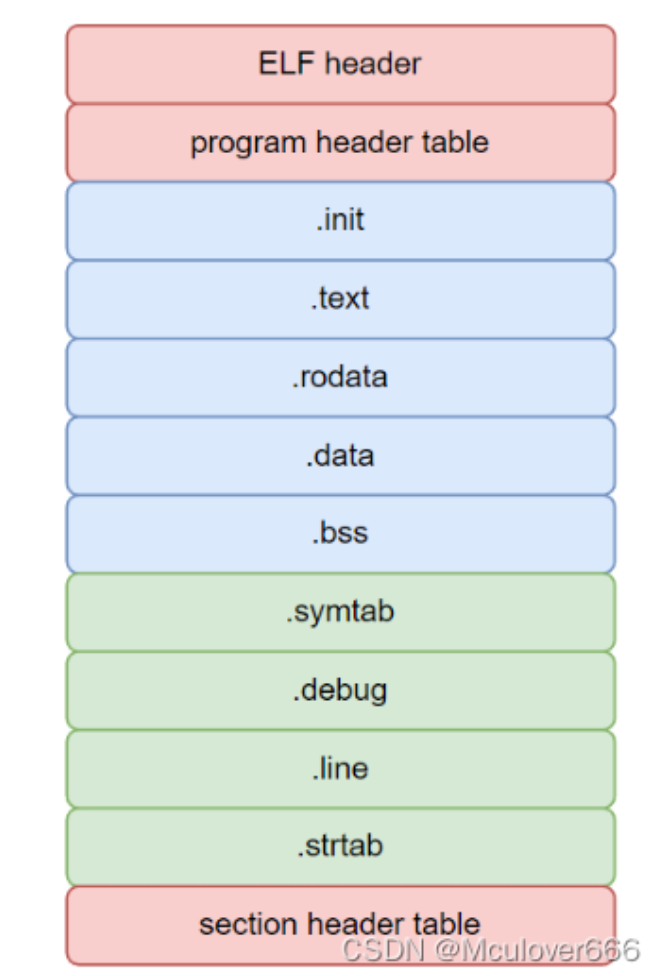
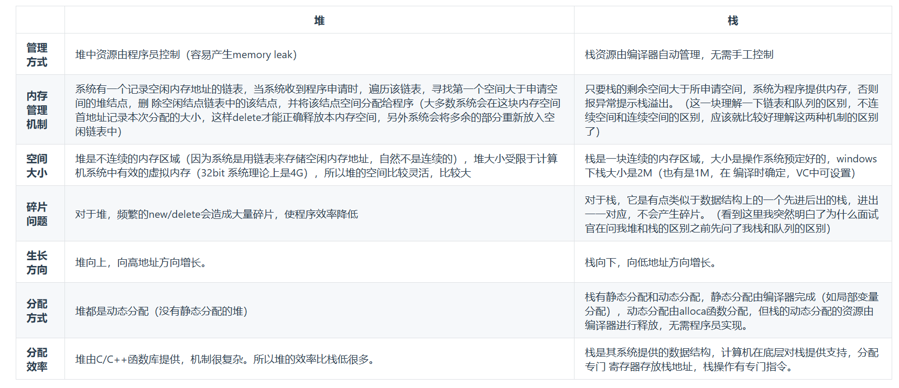

1. 一个可执行文件由一系列`section`构成,`section`称为段,包括:代码段`.text`、只读数据段`.rodata`、数据段`.data`、`.bss`段等.普通代码翻译成二进制放到代码段;常量放在只读数据段;初始化的全局变量和静态局部变量放在数据段;未初始化的全局变量和未初始化的静态变量放在`.bss`段;`.init`段存储用来初始化程序所依赖的环境的汇编代码.`.bss`段在可执行文件中不占用空间,在程序运行的时候才分配对应的空间
    
2. 在`main`执行之前和之后执行的代码可能是什么?
   * `main`函数执行之前,主要就是初始化系统相关资源:
      - 设置栈指针
      - 初始化静态`static`变量和`global`全局变量,即`.data`段的内容
      - 将未初始化部分的全局变量赋初值:数值型`short`、`int`、`long`等为0,`bool`为`false`,指针为`null`等,即`.bss`段的内容
      - 全局对象初始化,在`main`之前调用构造函数,这是可能会在`main`执行前的一些代码
      - 将`main`函数的参数`argc`、`argv`等传递给`main`函数,然后才真正运行`main`函数
   * `main`函数执行之后:
      - 全局对象的析构函数会在`main`函数之后执行
      - 可以用`atexit`注册一个函数,它会在`main`之后执行(`C`库函数`int atexit(void (*func)(void))`当程序正常终止时,调用指定的函数`func`.您可以在任何地方注册你的终止函数,它会在主程序终止的时候被调用)
3. `alignas`和`alignof`:`alignof`用于查询某种类型或对象的对齐方式,返回一个`size_t`,表示该类型需要的对齐字节数;`alignas`用于显式指定变量、对象、结构体或类的对齐要求.
    ```C++
    struct alignas(4) AlignedStruct {
        uint8_t a;    // 1 字节
        uint16_t b;   // 2 字节
        uint8_t c;    // 1 字节
    };
    ```
    `a`:位于偏移0,无填充;
    `b`:需对齐到2的倍数.则在`a`后填充1字节;`c`:位于偏移4(紧随`b`后),无填充;
    此时总大小=5字节,但是要求结构体对齐为4字节,因此总大小必须是4的倍数,那么需要在`c`后填充3字节至总共结构体有8字节大小
4. 结构体的内存对齐:
   * 第一个成员在与结构体变量偏移量为0的地址处
   * 其它成员变量要对齐到某个数字的整数倍的地址处(如`int`成员变量就要对齐到4字节的倍数地址处)
   * 结构体总大小为最大对齐数的整数倍
5. 指针和引用的区别:
   * 指针是一个变量,存储的是一个地址,引用跟原来的变量实质是同一个东西,是原变量的别名
   * 指针可以有多级,引用只有一级
   * 指针可以为空,引用不能为`null`且在定义时必须初始化(对非类类型的const变量在定义时也必须初始化)
   * 指针在初始化后可以改变指向,而引用在初始化后不可再改变
   * `sizeof`指针得到的是本指针的大小,`sizeof`引用得到的是引用所指向变量的大小
   * 当把指针作为参数进行传递时,也是将实参的一个拷贝传递给形参,两者指向的地址相同,但不是同一个变量,在函数中改变这个变量的指向不影响实参,而引用却可以
   * 在汇编层面,一些编译器将引用当作指针操作,因此引用会占用空间.是否占用空间,应该结合编译器分析
   * 引用在声明时必须初始化为另一变量,一旦出现必须为`typename refname &varname`形式;指针声明和定义可以分开
   * 引用一旦初始化后就不可以再改变,指针可以
   * 不存在指向空值的引用,必须有具体实体;但是存在指向空值的指针
6. 什么时候用指针,什么时候用引用
   指针:有指向不存在对象的可能时;需要在不同时刻指向不同对象时(即可以修改);否则总是优先使用引用
7. 堆和栈的区别
   * 申请方式不同
    - 栈由系统自动分配
    - 堆是自己申请和释放的
   * 申请大小限制不同
    - 栈顶和栈底是之前预设好的,栈是向栈底扩展,大小固定,可以通过`ulimit -a`查看,由`ulimit -s`修改
    - 堆向高地址扩展,是不连续的内存区域,大小可以灵活调整    
   * 申请效率不同
    - 栈由系统分配,速度快,不会有碎片(队列会导致碎片,前端空出来的内存不能被后端回收进行后续分配)
    - 堆由程序员分配,速度慢,且会有碎片
   * 栈空间默认是4M,堆区一般是1G-4G   
   * 生命周期不同
    - 堆生命周期由程序员控制
    - 栈的生命周期与函数调用生命周期一致(其实应该是作用域)
    
8. `new`和`delete`是如何实现的?
   * `new`的实现过程是:首先调用`operator new`的标准库函数,分配足够大的原始类型化的内存,以保存指定类型的一个对象;接下来运行该类型的一个构造函数,用于指定初始化构造对象;最后返回指向新分配并构造后的对象的指针
   * `delete`的实现过程:对指针指向的对象运行适当的析构函数;然后通过调用`operator delete`的标准库函数释放该对象所用内存
9.  `malloc`和`new`的区别
   * `malloc`和`free`是标准库函数,支持覆盖;`new`和`delete`是运算符,支持重载
   * `malloc`仅仅分配内存空间,`free`仅仅回收空间,不具备调用构造函数和析构函数功能,用`malloc`分配空间存储类的对象存在风险;`new`和`delete`相反
   * `malloc`和`free`返回的是`void`类型指针(必须进行类型转换),`new`和`delete`返回的是具体类型的指针
10. 既然有了`malloc/free`,`C++`为什么还需要`new/delete`?
   在对非基本数据类型的对象使用的时候,对象创建的时候还需要执行构造函数,销毁的时候要执行析构函数.而`malloc/free`是库函数,是已经编译的代码,所以不能把构造函数和析构函数的功能强加给`malloc/free`,所以`new/delete`是必不可少的
11. 被`free`回收的内存是立即返还给操作系统吗?
    不是的,被`free`回收的内存会首先被`ptmalloc`使用双链表保存起来,当用户下一次申请内存的时候,会尝试从这些内存中寻找合适的返回.这样就避免了频繁的系统调用,占用过多的系统资源.同时`ptmalloc`也会尝试对小块内存进行合并,避免过多的内存碎片。brk()分配的堆内存是不会立马返回给操作系统的，只有mmap()的才会
12. 宏定义和`typedef`区别
    * 宏主要用于定义常量及书写复杂的内容;`typedef`主要用于定义类型别名
    * 宏替换发生在编译阶段之前(预编译阶段),属于文本插入替换;`typedef`是编译的一部分
    * 宏不检查类型;`typedef`会检查数据类型
    * 宏不是语句,不在最后加分号;`typedef`是语句,要加分号标识结束
    * 注意对指针的操作,`typedef char* p_char`和`#define p_char char*`区别巨大
13. `strlen`和`sizeof`的区别
    * `sizeof`是运算符,并不是函数,结果在编译时得到而非运行中获得;`strlen`是字符处理的库函数
    * `sizeof`参数可以是任何数据的类型或数据;`strlen`的参数只能是字符指针且结尾是`'\0'`的字符串
    * 因为`sizeof`值在编译时确定,所以不能用来得到动态分配(运行时分配)存储空间的大小
14. 64位系统指针占用8字节;32位系统指针占用4字节
15. 常量指针和指针常量区别?
    * 常量指针是一个指向常量的指针,`int const* p`或`const int* p`
    * 指针常量是指指针本身是个常量,`int* const p`
16. 对于数组`int a[10]`,`&a`的类型为`int(*)[10]`,是一个数组指针
17. `C++`和`Python`的区别?
    * `Python`是一种脚本语言,是解释执行的,而`C++`是编译语言,是需要编译后在特定平台运行的.`Python`可以很方便的跨平台,但是效率没有`C++`高
    * `Python`使用缩进来区分不同的代码块(作用域),`C++`使用花括号来区分
    * `C++`中需要事先定义变量的类型,而`Python`不需要,`Python`的基本数据类型只有数字、布尔值、字符串、列表、元组等
    * `Python`的库函数更多
18. `C++`和`C`的区别?
    * `C++`中`new`和`delete`是对内存分配的运算符,取代了`C`中的`malloc`和`free`
    * 标准`C++`中的字符串类取代了标准`C`函数库头文件中的字符数组处理函数(`C++`有`string`类型)
    * `C++`中用来做控制态输入输出的`iostream`类库替代了`C`中的`stdio`函数库
    * `C++`中的`try/catch/throw`异常处理机制取代了`C`中的`setjmp()`和`longjmp()`函数
    * `C++`支持重载,`C`不支持
    * `C++`中,允许变量定义语句在程序中的任何地方,只要在是使用它之前就可以;而`C`中,必须要在函数开头部分
    * `C++`中,除了值和指针之外,新增了引用
    * `C++`相对`C`增加了一些关键字,如`bool,using,dynamic_cast,namespace`等
