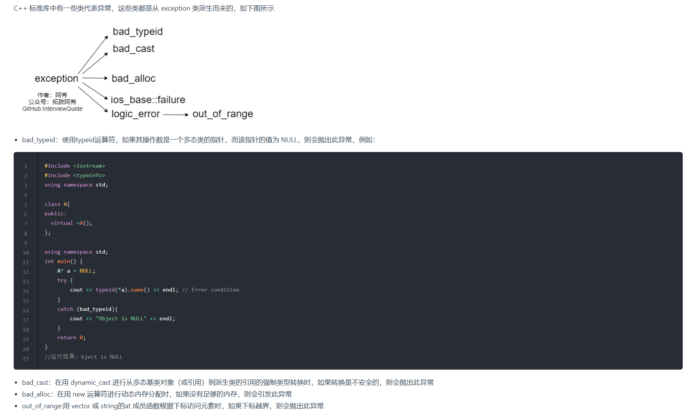

1. `C++`中的`new`:
   * `plain new`:普通的`new`,就是我们常用的`new`,它在空间内存分配失败的情况下是直接抛出异常`std::bad_alloc`而不是返回`nullptr`
   * `nothrow new`:它在空间内存分配失败时不抛出异常,而是返回`nullptr`
   * `placement new`:在一块已经分配成功的内存上重新构造对象
2. `C++`的异常处理:
   * `try、throw、catch`:对于`try-catch`,程序的执行流程是先执行`try`语句块,如果执行过程中没有异常发发生,则不会进入任何`catch`包裹的语句块;如果异常发生,则使用`throw`进行异常抛出,再由`catch`进行捕获,`catch`根据`throw`抛出的数据类型进行精确捕获,如果匹配不到就直接报错,可以使用`catch(...)`来捕获任何异常
   * 函数的异常声明列表:`int fun() throw(int,double,A,B,C){...}`:表示函数`fun()`可能会抛出`int,double,A,B,C`类型的异常
   * `C++`标准异常类`exception`
    
3. `static`的用法和作用
   * 隐藏的作用:如果一个文件中定义了一个全局变量,并且希望它只在该文件内部可见,则可以使用`static`修饰
   * 局部变量可以维持值,不会重新初始化:函数体内`static`变量的作用范围为该函数体,该变量的内存只被分配一次,因此其值在下次调用时仍维持上次的值
   * 默认初始化为0
   * 静态成员变量属于类本身,而不是类的某个具体对象.所有对象共享同一个静态成员变量(静态成员变量需要在外部初始化)
   * 静态成员函数属于类本身,而不是类的某个具体对象,它没有`this`只在
   * 静态成员函数不能被`virtual`修饰
   * `static`修饰的函数只能在定义它的文件内部调用,即也是隐藏性
4. 指针和`const`的用法
   * 当`const`修饰指针时,由于`const`的位置不同,它的修斯对象会有所不同
   * 顶层`const`:`int *const p2`:`const`修饰`p2`的值,即`p2`的值不能改变,`p2`只能指向固定的一个变量地址
   * 底层`const`:`int const *p1`:`const`修饰`*p1`,即`*p1`的值不能改变,那么不可以给`*p1`赋值改变`p1`指向变量的值,但是可以通过给`p1`赋值不同的地址改变这个指针指向
5. 形参和实参的区别?
   * 形参变量只有在被调用时才分配内存单元,在调用结束时,即可释放所分配的内存单元
   * 实参必须预先赋值
   * 实参和形参在数量上,类型上,顺序上应严格一致
   * 函数调用中发生的数据传送是单向的,即只能把实参的值传给形参,而不能把形参的值反向地传给实参.因此在函数调用过程中,形参的值发生改变,而实参中的值不会变化
   * 当是值传递是,会发生拷贝,产生临时对象
6. 值传递、指针传递和引用传递
   * 值传递:会产生临时对象,调用函数时,会将实参的值复制到形参中,形参和实参是两个独立的变量
   * 指针传递:传递的是变量的内存地址,形参和实参指向同一块内存,可以直接修改调用者的原始数据
   * 引用传递:引用和原始变量共享同一块内存,没有额外的内存开销,其内存开销最小(它既不会产生临时对象,又没有解引用操作)
7. 静态变量什么时候初始化?
    静态局部变量和全局变量一样,在主程序之前,编译器已经分配好了内存,但其初始化在`C`和`C++`中不同,`C++`中静态变量的初始化是在执行相关代码时才会进行初始化;而`C`中初始化发生在代码执行之前,即编译阶段分配好内存后就会初始化
8. `const`的作用
   * 声明常量:其值在初始化后不能被修改
   * 修饰指针:顶层`const`指针(指针本身是常量)和底层`const`指针(指针指向的值是常量)
   * 修饰引用:表示引用不能修改指向的值
   * 修饰函数参数:防止函数内部修改参数的值
   * 修饰函数返回值:可以防止返回值被修改
   * 修饰类的成员函数:构造一个常量成员函数,表示该成员函数不会修改类的成员变量(除了`mutable`修饰的变量)
9. 什么是类的继承?
    * 表示类与类之间的关系
    * 继承就是一个类继承了另一个类的属性和方法,这个新的类包含了上一个类的属性和方法,被称为子类或者派生类,被继承的类称为父类或基类
    * 子类拥有父类的所有属性和方法,子类可以拥有父类没有的属性和方法,子类对象可以当作父类对象使用
    * 继承中的访问控制:`private、protected、public`
    * 继承中的构造函数和析构函数
    * 继承中的兼容性原则
10. `new`和`delete`实现原理,`delete`是如何知道释放内存的大小?
    * `new`简单类型直接调用`operator new`分配内存;对于复制结构(如:类),先调用`operator new`分配内存,然后在分配的内存上调用构造函数
    * 对于复杂数据结构,`new []`先调用`operator new[]`分配内存,然后在分配的内存的前4字节写入数组大小`n`,然后调用`n`此构造函数
    * `delete`简单类型默认只是调用`free`函数;对于复杂数据类型,先调用析构函数再调用`operator delete`
    * 对于简单类型,`delete`<=>`delete []`
    * 需要在`new[]`一个对象数组时,需要保存数组的维度,`C++`的做法是在分配的内存数组空间前多分配了4个字节的大小,专门用来保存数组的大小,在`delete[]`时就可以取出这个保存的数.就知道调用析构函数多少次了
11. `malloc`的实现原理:
    * 从操作系统来看,`malloc`就是`brk`和`mmap`这两个系统调用来实现的.`brk`是将`.data`段的最高指针项高处移动,这一步可以扩大进程在运行时的堆大小;`mmap`是在进程的虚拟地址空间中寻找一块空闲的虚拟内存,这一步可以获得一块可以操作的堆内存.退出,分配的内存小于128k时,使用`brk`调用来获得虚拟内存;大于128k时就使用`mmap`来获得虚拟内存
    * `malloc`是从堆里面申请内存,也就是说函数返回的指针是指向堆里面的一块内存.操作系统中有一个记录空闲内存地址的链表.当操作系统收到程序的申请时,就会遍历该链表,然后就寻找第一个空间大于所申请空间的堆节点,然后就将该节点从空闲节点链表中删除,并将该节点的空间分配给程序
12. `malloc、realloc、calloc`的区别
    * `malloc`申请的空间的值是随机初始化的
    * `calloc`申请的空间的值初始化为0
    * `realloc`给动态分配的空间分配额外的空间,用于扩充容量
13. 类成员初始化方式:赋值初始化;列表初始化
    * 赋值初始化:通过在函数体内进行赋值初始化
    * 列表初始化:在冒号后使用初始化列表进行初始化
    * 两者的不同:函数体内赋值初始化是在所有的数据成员被分配内存空间后才进行的,它是在函数体执行之中初始化的;列表初始化是给数据成员分配内存空间时就进行初始化,也就是说分配一个数据成员只要冒号后有此数据成员的表达式,那么分配了内存空间后在进入函数体之前就初始化,就是说初始化这个数据成员时函数体还未执行
    * 通常更推荐列表初始化,因为列表初始化是纯粹的初始化操作(类似`emplace_back`),对于类类型,它少一次调用构造函数的过程;而在函数体内的赋值操作会多一次调用,因此更建议使用列表初始化
14. `C++`新增了`string`,它与`C`的`char*`有什么区别?它是怎么实现的?
    `string`继承自`basic_string`,其实是对`char*`进行了封装,封装的`string`包含了`char*`数组、容量、长度等属性;`string`可以动态扩展,在每次扩展的时候另外申请一块原空间大小两倍的空间,然后将原字符串拷贝过程,并加上新增的内容(类似`vector`)
15. 一个派生类的构造函数的执行顺序是怎样的?
    * 虚基类的构造函数
    * 基类实现的构造函数
    * 类类型的成员对象变量的沟站是
    * 派生类自己的构造函数
