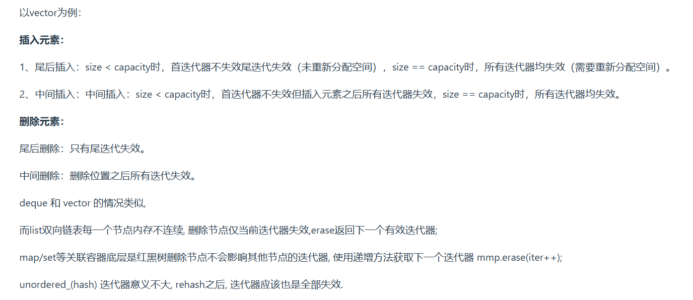
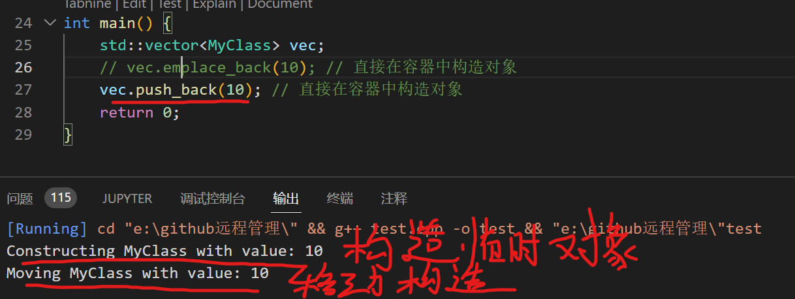
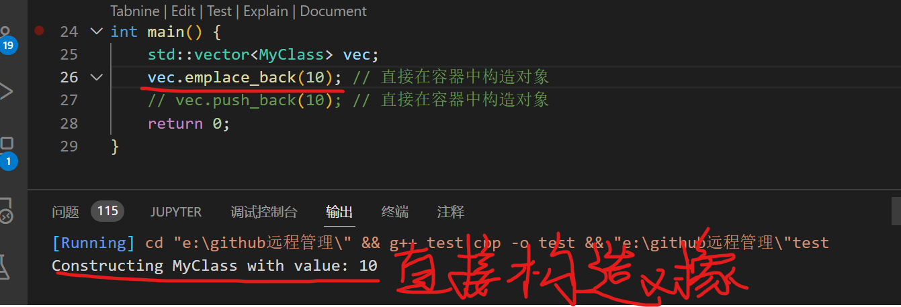
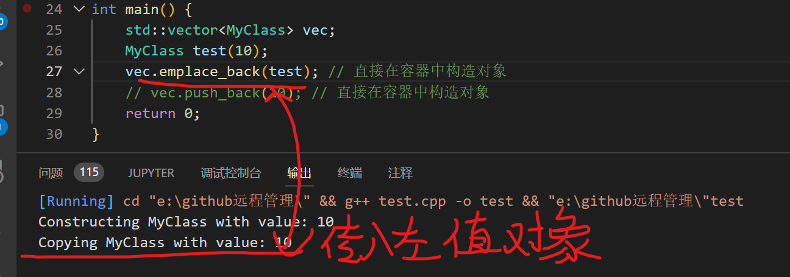
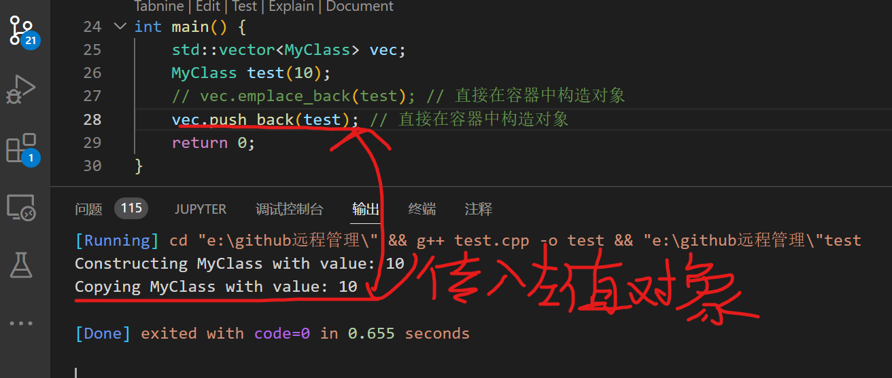
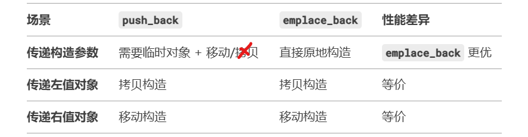
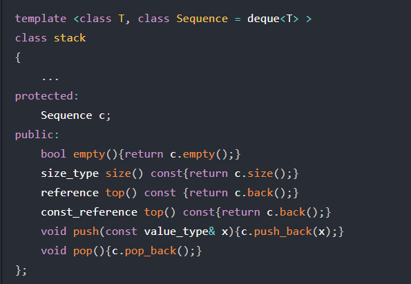
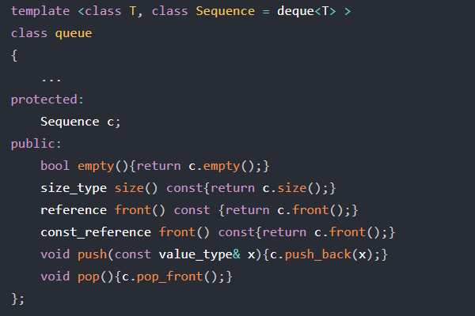

1. 哈希表的实现:桶(用`vector`实现)+`list`
2. 常见容器性质
   * `vector`底层数据结构是数组,支持快速随机访问
   * `list`底层数据结构是双向链表,支持快速增删
   * `deque`底层数据结构是一个中央控制器和多个缓冲区,支持首尾(中间不能)快速增删,也支持随机访问
   * `stack`底层一般用`list`或`deque`实现(默认是`deque`),封闭头部即可,不用`vector`是因为该容量大小有限制,扩容耗时
   * `queue`底层一般用`list`或`deque`实现(默认是`deque`),不用`vector`是因为该容量大小有限制,扩容耗时
   * `priority_queue`的底层数据结构一般是`vector`,对`heap`(二叉堆)为处理规则来管理底层容器实现
   * `set`底层数据结构为红黑树,有序,不重复
   * `multiset`底层数据结构是红黑树,有序,可重复
   * `map`底层数据结构为红黑树,有序,不重复
   * `multimap`底层数据结构是红黑树,有序,可重复
   * `unordered_set`底层数据结构是`hash`表,无序,不重复
   * `unordered_multiset`底层数据结构为`hash`表,无序,可重复
   * `unordered_map`底层数据结构是`hash`表,无序,不重复
   * `unordered_multimap`底层数据结构为`hash`表,无序,可重复
3. 各类容器:
   * 序列式容器:
     -  `array`
     - `vector`（动态数组）：内部以数组的形式存储数据；随机访问速度快，插删效率较低；在数组末尾插入元素的时间复杂度为常数级别（O(1)），但在其他位置插入或删除元素的时间复杂度为线性级别（O(n)）(因为涉及元素移动的操作)；适用于需要快速随机访问元素，不需频繁插入和删除的场景;并且扩容时会出现大量的移动、拷贝操作,影响性能
     - `deque`（双端队列）：内部以一段连续的空间，或多个连续空间存储数据；支持随机访问，插入和删除操作效率都比`vector`高；在队列的两端插入和删除元素的时间复杂度为常数级别（O(1)）；适用于需要在队列两端频繁插入和删除元素，并需要随机访问元素的场景
     - `list`（双向链表）：内部以双向链表的形式存储数据； 插入和删除操作效率高，但随机访问速度较慢；在任意位置插入和删除元素的时间复杂度为常数级别（O(1)）； 适用于需要频繁插入和删除元素，但不需要随机访问的场景
     - `forward_list`（单向链表）：`list`的迭代器是双向的，`forward_list`的迭代器属于单向的。虽然`forward_list`的很多功能不如`list`灵活，但是其所耗用的空间更小，操作更快
   * 容器适配器
     - `stack`:一种先进后出的数据结构，只有一个入口和出口，那就是栈顶，除了获取栈顶元素外，没有其他方法可以获取到内部的其他元素。stack除了默认使用deque作为其底层容器之外，也可以使用双向开口的list，只需要在初始化stack时将list作为第二个参数即可。栈只能操作顶端的元素，因此其内部元素无法被访问，也不提供迭代器
     - `queue`:一种先进先出的数据结构，只有一个入口和一个出口，分别位于最底端和最顶端，除出口元素外没有其他方法可获取内部其他元素。queue这种先进先出的数据结构很容易由双向开口的deque和list形成，只需要根据queue的性质对应移除某些接口即可实现
     - `priority_queue`:优先级队列是不同于先进先出队列另一种队列，每次从队列中取出具有最高优先权的元素。常见heap算法有插入(`push_heap()`)、弹出(`pop_heap()`、排序(`sort_heap()`)和构造算法(`make_heap()`)
   * 关联式容器
     - 有序关联式容器
       * `set/multiset/ && map/multimap`（红黑树）内部以红黑树的形式存储数据；元素自动排序，插入和删除操作效率较高；查找元素的时间复杂度为对数级别（O(log n)）；适用于需要元素自动排序，并需要快速查找元素的场景； 
     - 无序关联式容器
       * `unordered_set/unordered_map`（哈希表）内部以哈希表的形式存储数据； 元素无序存储，插入和删除操作效率较高；查找元素的平均时间复杂度为常数级别（O(1)）；适用于不需要元素排序，但需要快速查找元素的场景；总的来说，当需要使用STL容器时，需要根据具体的场景来选择合适的容器。如果需要快速随机访问元素，而不需要频繁插入和删除，则可以选择vector  
4. 红黑树是有序的、支持范围查询的，它的查找、插入、删除都是`O(logN)`；哈希表的查找都是`O(1)`,其插入和删除平均是`O(1)`,最坏是`O(N)`(大量冲突)
5. `vector`的增加删除是怎么做的?为什么是成倍方式扩容?
   * 新增元素:`vector`通过一个连续的数组存放元素,如果集合已满,在新增数据的时候,就要分配一块更大的内存,将原来的数据复制过来,释放之前的内存,再插入新增的元素
   * 对`vector`的任何操作,一旦引起空间重新配置,指向原`vector`的所有迭代器就都失效了
   * 初始时刻`vector`的`capacity`为0,塞入第一个元素后`capacity`增加为1
   * 不同的编译器实现的扩容方式不同,`VS`是1.5倍扩容,`GCC`是2倍扩容
   * 采用成倍方式扩容的原因:采用成倍方式扩容,可以保证常数的时间复杂度`O(1)`,而增加指定大小的容量只能达到`O(n)`的时间复杂度.倍增长因子设置在`(1,2]`之间
6. `STL`每种容器对应的迭代器
   * `vector、deque、array`->随机访问迭代器
   * `stack、queue、priority_queue`:无
   * `list、(multi)set/map`->双向迭代器
   * `unordered_(multi)set/map、forward_list`->前向迭代器
7. 对于`STL`容器的迭代器,直接使用类似操作`.begin()+1`来表示第二个元素可以吗?
   这对于支持随机访问迭代器的才可以(`vector、deque`).对于不支持随机访问迭代器的容器,这是非法的,因为这些容器的迭代器不支持算术运算,对于这些容器,需要使用`++`来移动迭代器
8. `forward_list`:单向链表,需要包含头文件`<forward_list>`,它没有`.size()`.可以利用`std::distance`来获取单向链表的大小,而不用自增去算`std::forward_list<int> list1;std::distance(std::begin(list1), std::end(list1);`
9.  `STL`迭代器失效的情况有哪些?
   
10. `vector`的`push_back`和`emplace_back`:
    * 类类型
        - `push_back`:若参数是左值对象,会调用`vector`包含的元素所属的类类型的拷贝构造函数创建对象(`std::vector<MyClass> vec;vec.push_back(test);`会调用`MyClass`的拷贝构造函数),后续不需要移动了;若参数为右值,则会调用移动构造函数创建对象,后续不需要移动了;
        - `emplace_back`:直接通过参数包`args`在容器内存中原地构造对象,无需临时对象.它通过完美转发调用类的构造函数,完全避免后续拷贝到容器末尾的操作,效率更高.若参数为左值对象,会调用拷贝构造函数;若参数为右值对象,会调用移动构造函数;
        - `emplace_back`只有在传递构造参数(先利用参数构建临时对象,再移动到容器末尾)和隐式类型转换时才会比`push_back`性能好,其余情况性能是一样的
        
         
        
        
        
    * 内置类型(如`int`)
        - `push_back`:内置类型没有构造函数,`push_back(2)`会隐式生成`int`类型的值,直接存入容器,无拷贝构造过程 
        - `emplace_back`:`emplace_back(2)`同样直接存入,两者效率等同
11. `list`相比于`vector`的连续线性空间,它会复杂很多,但是它的好处在于插入或删除都只作用于一个元素空间,其对任何位置元素的插入和删除都是常数时间,其数据结构如下:
   ```C++
   template<typename T>
   struct list {
    typedef void* void_pointer;
    void_pointer prev;
    void_pointer next;
    T data;
   };
   ``` 
12. `vector`是单向开口的连续线性空间,`deque`则是一种双向开口的连续线性空间,虽然`vector`也可以在头尾进行元素操作,但是其头部操作的效率十分低下(主要是涉及到整体的移动).`deque`和`vector`的最大差异:
   * `deque`是运行在常数时间内对头端进行元素操作
   * `deque`没有容量的概念,它是动态地以分段连续空间组合而成,可以随时增加一段新的空间并链接起来
   * `deque`迭代器的`++、--`操作远比`vector`迭代器繁琐,其主要工作在于缓冲区边界,如何从当前缓冲区跳到另一个缓冲区
13. `stack、queue`的实现
    
    
14. `STL`中的二叉堆实现`heap`数据结构,通常用于快速访问最大值或最小值,`heap`的实现基于完全二叉树,它用于实现`priority_queue`,`<algorithm>`包含`heap`算法:
    ```C++
    1.
    std::make_heap(first, last, cmp);//将一个范围内的元素重新排列成一个堆结构  cmp 是可选的比较函数，默认使用 std::less
    std::vector<int> vec = {3, 1, 4, 1, 5, 9, 2, 6};
    std::make_heap(vec.begin(), vec.end());
    2.
    std::push_heap(first, last, cmp);// 将一个新元素添加到堆中，并维护堆的性质
    std::pop_heap(first, last, cmp);// 将堆顶元素（最大值或最小值）移动到容器的末尾，并维护堆的性质
    std::sort(first, last, cmp);// pop_heap会把当前heap中最大值置于底层容器vector末尾,heap范围-1l那么不断指向pop_heap直到树为空,就能得到一个递增序列
    ```
15. 基于`vector+heap`实现`priority_queue`:
    ```C++
    template<typename T, typename Sequence=vector<T>, typename Compare=std::less>
    class priority_queue {
        ...
        protected:
            Sequence c;// 底层容器
            Compare cmp;// 元素大小比较标准
        public:
            bool empty() const {return c.empty();}
            int size() const {return c.size();}
            T top() const {return c.front();}
            void push (const T& x) {
                c.push_heap(x);
                push_heap(c.begin(), c.end(), cmp);
            }
            void pop() {
                pop_heap(c.begin(), c.end(), cmp);
                c.pop_back();
            }
    };
    ```
16. `STL`的`set`的实现:STL中的容器可分为序列式容器和关联式容器，set属于关联式容器。set的特性是，所有元素都会根据元素的值自动被排序，set元素的键值就是实值，实值就是键值，set不允许有两个相同的键值。set不允许迭代器修改元素的值，其迭代器是一种constance iterators。标准的STL set以红黑树作为底层机制
17. `STL`的`map`的实现:map的特性是所有元素会根据键值进行自动排序。map中所有的元素都是pair，拥有key和value两个部分，并且不允许元素有相同的key，一旦map的key确定了，那么是无法修改的，但是可以修改这个key对应的value，map的底层机制是红黑树
18. `STL`的`unordered_map`的实现:底层以哈希表实现,并且是无序的,键值必须唯一
19. 红黑树特性:
    * 每个节点不是红色就是黑色
    * 根节点为黑色
    * 如果节点为红色,其子节点必为黑
    * 任一节点至树尾端的任何路径,所含黑节点数量必相同
    * 查找时间一定可以控制在`O(logn)`
    * 它是二叉平衡搜索树
    * 若左子树不空,则左子树上所有节点的值均<=它的根节点的值
    * 若右子树不空,则右子树上所有节点的值>=它的根节点的值
20. `unordered_map`和`map`的区别和应用场景?
    `map`支持键值的自动排序,底层机制是红黑树,其查询和维护的时间复杂度均为`O(logN)`,但是空间占用比较大,因为每个节点要保持父节点、孩子节点及颜色的信息;`unordered_map`底层机制是哈希表,通过`hash`函数计算元素位置,其查询时间复杂度为`O(1)`,维护时间和桶所维护的`list`长度有关,但是建立哈希表耗时较大;`map`适用于有序数据的应用场景;`unordered_map`适用于高效查询的应用场景
21. 解决哈希冲突有哪些方法?
    * 开放地址法
        - 线性探测:如果发生冲突的话往哈希表下面找空位，如果有空位就插入数据，没有就继续查找
        - 二次探测
        - 再哈希
    * 链表法:把哈希表里的位置设置为链表，当某个节点发生冲突时直接把插入数据放入当前节点的链表中
    * 红黑树  
22. `map、set`是怎么实现，红黑树是怎么能够同时实现这两种容器？为什么使用红黑树？
    他们的底层都是以红黑树的结构实现，因此插入删除等操作都在O(logn)时间内完成，因此可以完成高效的插入删除； 在这里我们定义了一个模版参数，如果它是key那么它就是set，如果它是pair，那么它就是map；底层是红黑树，实现map的红黑树的节点数据类型是key+value，而实现set的节点数据类型是value； 因为map和set要求是自动排序的，红黑树能够实现这一功能，而且时间复杂度比较低
23. `unordered_map`如何解决冲突以及扩容？
    unordered_map底层使用的是哈希表，哈希表使用的开链法进行冲突避免；扩容时机：std::unordered_map 通过 负载因子（Load Factor） 来控制扩容。负载因子是元素数量与桶数量的比值（负载因子=已存储元素个数/哈希表容量(桶总数)）。当负载因子超过预设阈值（默认为 1.0），会触发扩容操作；扩容步骤:
    * 计算新桶数量: 新桶的数量通常是当前桶的两倍
    * 分配新内存：为新的桶数组分配内存
    * 重新哈希：将旧桶中的所有元素重新计算哈希值，并迁移到新桶中
    * 释放旧内存：释放旧桶数组的内存
    * 更新内部状态：更新桶数量、元素数量和负载因子
24. `C++`手撕哈希表:
    ```C++
    template <typename Key, typename Value>
    class HashTable {
    private:
        // 哈希表的大小
        size_t table_size;
        // 哈希表的存储结构（每个桶是一个链表） 一个键值对用pair表示
        std::vector<std::list<std::pair<Key, Value>>> table;
        // 哈希函数
        std::function<size_t(const Key&)> hash_func;
    public:
        // 构造函数
        HashTable(size_t size = 10, std::function<size_t(const Key&)> hash = [](const Key& key) { return std::hash<Key>{}(key); })
            : table_size(size), hash_func(hash), table(size) {}
        // 插入键值对
        void insert(const Key& key, const Value& value) {
            size_t index = hash_func(key) % table_size;
            for (auto& pair : table[index]) {
                if (pair.first == key) {
                    pair.second = value; // 如果键已存在，更新值
                    return;
                }
            }
            table[index].emplace_back(key, value); // 如果键不存在，插入新键值对
        }
        // 查找键对应的值
        bool find(const Key& key, Value& value) const {
            size_t index = hash_func(key) % table_size;
            for (const auto& pair : table[index]) {
                if (pair.first == key) {
                    value = pair.second;
                    return true;
                }
            }
            return false;
        }
        // 删除键值对
        bool erase(const Key& key) {
            size_t index = hash_func(key) % table_size;
            for (auto it = table[index].begin(); it != table[index].end(); ++it) {
                if (it->first == key) {
                    table[index].erase(it);
                    return true;
                }
            }
            return false;
        }
        // 打印哈希表内容（调试用）
        void print() const {
            for (size_t i = 0; i < table_size; ++i) {
                std::cout << "Bucket " << i << ": ";
                for (const auto& pair : table[i]) {
                    std::cout << "{" << pair.first << ": " << pair.second << "} ";
                }
                std::cout << std::endl;
            }
        }
        // 调整哈希表大小（重新哈希）
        void resize(size_t new_size) {
            std::vector<std::list<std::pair<Key, Value>>> new_table(new_size);
            for (const auto& bucket : table) {
                for (const auto& pair : bucket) {
                    size_t index = hash_func(pair.first) % new_size;
                    new_table[index].emplace_back(pair);
                }
            }
            table = std::move(new_table);
            table_size = new_size;
        }
    };
    ```


