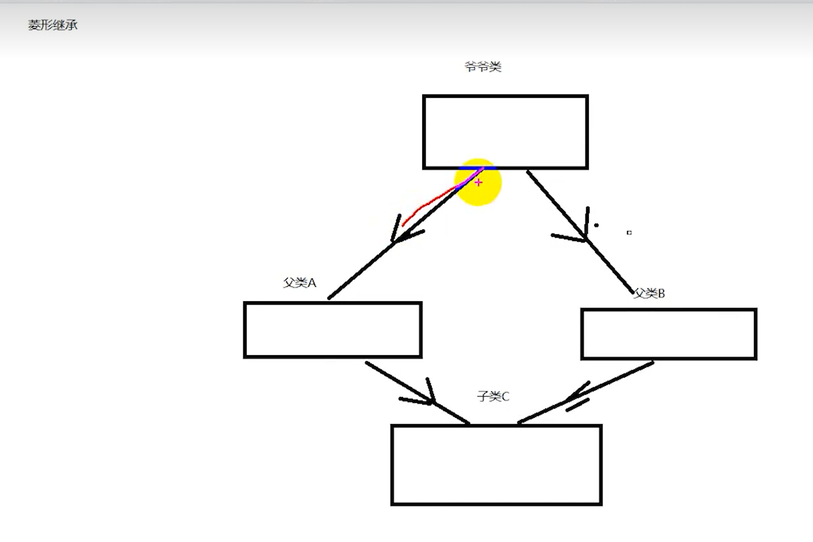

1. `C++`的多态怎么实现:
   * 函数重载+模板(编译时多态)
   ```C++
   // 模板函数，用于打印不同类型的数据
   template <typename T>
   void print(const T& value) {
      cout << value << endl;
   }
   // 重载模板函数，用于打印字符串
   void print(const string& value) {
      cout << "String: " << value << endl;
   }
   // 重载模板函数，用于打印布尔值
   void print(bool value) {
      cout << (value ? "True" : "False") << endl;
   } 
   ```
   * 虚函数+继承(运行时多态)
2. 对于运行时多态一般是用基类指针来访问的,即基类指针主要用于多态场景(注意:不能用基类指针来访问子类新增的成员(变量或函数),必须基类也要有).如:
   ```C++
   // 基类
   class Animal {
   public:
      virtual void makeSound() {
         cout << "动物发出声音" << endl;
      }
   };
   // 子类1
   class Dog : public Animal {
   public:
      void makeSound() override {
         cout << "汪汪汪" << endl;
      }
   };
   // 子类2
   class Cat : public Animal {
   public:
      void makeSound() override {
         cout << "喵喵喵" << endl;
      }
   };
   int main() {
      Animal* animal1 = new Dog();
      Animal* animal2 = new Cat();
      animal1->makeSound(); // 输出 "汪汪汪"
      animal2->makeSound(); // 输出 "喵喵喵"
      delete animal1;
      delete animal2;
      return 0;
   }
   ```
3. `C++`中,类实例化后的对象主要为非静态成员变量分配内存,而静态成员变量(静态存储区)和成员函数(代码区).非静态成员变量存储在对象的内存空间中
4. 多态的底层原理:
   * 在编译阶段,编译器在发现基类中有虚函数时,会自动为每个含有虚函数的类生成一份虚表(虚函数表),该表是一个一维数组,虚表里保存了虚函数的入口地址
   * 编译器会在每个对象的前四个字节(32位系统)中保存一个虚表指针(要证明它确实存在可以利用`sizeof(类对象)`)(虚表指针存在每个对象的开头4字节中),执行对象所属类的虚表.在构造时(注意:虚表指针是在运行时类实例化时才会有),根据对象的类型去初始化虚表指针`vptr`,从而让`vptr`指向正确的虚表,从而在调用虚函数时,能找到正确的函数(虚表指针是类的非静态成员变量)
   * 派生类在编译阶段会构建自己的虚表,虚表中包含了对基类的重写(`override`),也包含了自己新增的虚函数.在派生类定义对象时程序运行会自动调用构造函数,在构造函数中对虚表初始化.在构造子类对象时,会先调用父类的构造函数.此时,编译器只看到了父类,并为父类对象初始化虚表指针,令它指向父类的虚表;当调用子类的构造函数时,为子类对象初始化虚表指针,令它指向子类的虚表
   * 当派生类对基类的虚函数没有重写时,派生类的虚表指针指向的是基类的虚表;当派生类对基类的虚函数重写时,派生类的虚表指针指向的是自身的虚表;当派生类中有字节的虚函数时,会在自己的虚表中将此虚函数地址添加在后面
   这样指向派生类的基类指针在运行时,就可以根据派生类对虚函数重写情况动态的进行调用,从而实现运行时多态 
5. 一个类的虚函数表只会有一份,就算这个类实例了很多对象,它们也是共享一个虚表的
6. 构造函数不能是虚函数:虚函数对应一个虚函数表,类中存储一个虚表指针指向这个虚函数表.如果构造函数是虚函数,就需要通过虚表指针调用,可是对象没有初始化就没有虚表指针,无法找到虚函数表,所以构造函数不能是虚函数
7. `C++`中虚函数表位于可执行文件的只读数据段,也就是`C++`内存模型的常量区;而虚函数位于代码段
8. 构造函数可以重载,析构函数不能重载,一个类只能有一个析构函数,且不能指定参数
9. 析构函数的作用:与构造函数的作用相反,用于撤销对象的一些特殊任务处理,可以是释放对象分配的内存空间.析构函数没有参数,也没有返回值,而且不能重载,在一个类中只能有一个析构函数
10. `C++`可以定义空类,空类大小为1字节
11. 成员函数和普通函数的区别
    * 成员函数是定义在类内部的函数，它属于类的一部分，与类的对象相关联;普通函数是在类外部定义的独立函数，不属于任何类
    * 成员函数是类的组成部分，能够直接访问类中的其他成员（包括私有成员），这体现了封装的特点;普通函数与类没有直接的从属关系，不能直接访问类的成员，除非通过对象或者友元等方式
    * 成员函数的调用会隐式地传递一个指向调用该函数的对象的指针(`this`指针),通过这个指针可以访问对象的数据成员和成员函数
12. `C++`的类的成员函数的调用会隐式地传递一个指向调用该函数的对象的指针(`this`指针)
13. `C++`的类中,如果没有显式地定义任何构造函数,编译器会自动生成一个默认构造函数(无参构造函数);一旦类中定义了至少一个构造函数,编译器将不再提供默认构造函数
14. `C++`中,子类必须调用父类的构造函数:
    * 如果父类有默认构造函数,就不用在子类中显式初始化父类的构造函数,因为编译器会自动调用它们来初始化父类对象
    * 若父类显式定义了构造函数,那么子类构造函数就必须显式调用父类的构造函数 
15. `C++`的多继承:运行一个类继承多个基类的属性和方法.构造函数的执行顺序是按照继承列表中基类出现的顺序进行的,而析构函数的执行顺序则与构造函数相反
16. 在多继承情况下,派生类继承了多个基类,这些基类中可能包含同名的成员(成员函数或成员变量).当在派生类中使用这些同名成员时,编译器无法确定应该使用哪一个基类中的成员,从而产生歧义,即二义性
    ```C++
       // 基类1
   class Base1 {
   public:
      void show() {
         cout << "Base1 show" << endl;
      }
   };
   // 基类2
   class Base2 {
   public:
      void show() {
         cout << "Base2 show" << endl;
      }
   };
   // 派生类继承自Base1和Base2
   class Derived : public Base1, public Base2 {
   public:
      void display() {
         show();// 产生二义性 
      }
   };
   int main() {
      Derived d;
      d.display(); 
      return 0;
   }
   ```
17. 菱形继承(菱形继承即是一个类通过多继承继承了多个基类,而这些基类又有一个共同的基类,即祖父类)会出现二义性问题:如果祖父类中有一些成员(成员函数或成员变量),那么当两个父类都继承自祖父类时,派生类会分别从两个父类继承祖父类的成员,导致祖父类的成员在派生子类中出现了两次(因为祖父类的成员在两个父类中有两个副本),当在派生子类中访问祖父类的成员时,编译器无法确定应该访问从哪一个中间父类继承来的祖父类的成员,从而产生二义性
    
18. 解决二义性的办法:
   * 使用域解析符明确指定要调用的基类的成员函数
   ```C++
   // 基类1
   class Base1 {
   public:
      void show() {
         cout << "Base1 show" << endl;
      }
   };
   // 基类2
   class Base2 {
   public:
      void show() {
         cout << "Base2 show" << endl;
      }
   };
   // 派生类继承自Base1和Base2
   class Derived : public Base1, public Base2 {
   public:
      void display() {
         Base1::show(); // 明确调用Base1的show函数
         Base2::show(); // 明确调用Base2的show函数
      }
   };
   int main() {
      Derived d;
      d.display(); // 输出 Base1 show 和 Base2 show
      return 0;
   } 
   ```
   * 在派生子类中重写该成员,明确指定要调用的基类的成员函数
   ```C++
   // 基类1
   class Base1 {
   public:
      void show() {
         cout << "Base1 show" << endl;
      }
   };
   // 基类2
   class Base2 {
   public:
      void show() {
         cout << "Base2 show" << endl;
      }
   };
   // 派生类继承自Base1和Base2
   class Derived : public Base1, public Base2 {
   public:
      void show() {
         Base1::show(); // 重写show函数，调用Base1的show函数
      }
   };
   int main() {
      Derived d;
      d.show(); // 调用Derived类中的show函数，进而调用Base1的show函数
      return 0;
   } 
   ```
   * 菱形继承中的二义性可以通过虚继承解决:虚继承确保了两个父类只有一个祖父类的成员副本,而不是多个.当使用虚继承时,编译器会为每个虚继承的基类创建一个单独的继承路径,并在派生类中引入一个指向共同基类的指针,即无论通过哪个中间父类访问共同的祖父类的成员,都会指向同一个成员副本
   ```C++
   // 祖父类
   class TopBase {
   public:
      void show() {
         cout << "TopBase show" << endl;
      }
   };
   // 基类1虚继承自TopBase
   class Base1 : virtual public TopBase {
   };
   // 基类2虚继承自TopBase
   class Base2 : virtual public TopBase {
   };
   // 派生类继承自Base1和Base2
   class Derived : public Base1, public Base2 {
   };
   int main() {
      Derived d;
      d.show(); // 正确：调用TopBase的show函数，没有二义性
      return 0;
   } 
   ```