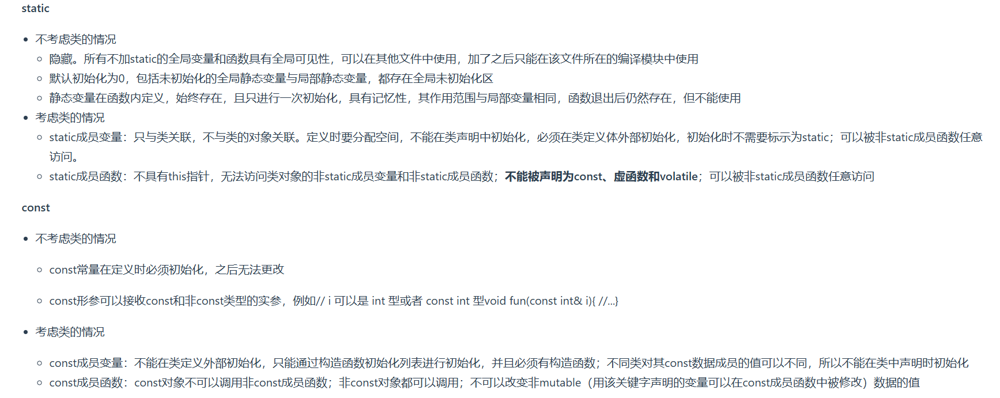
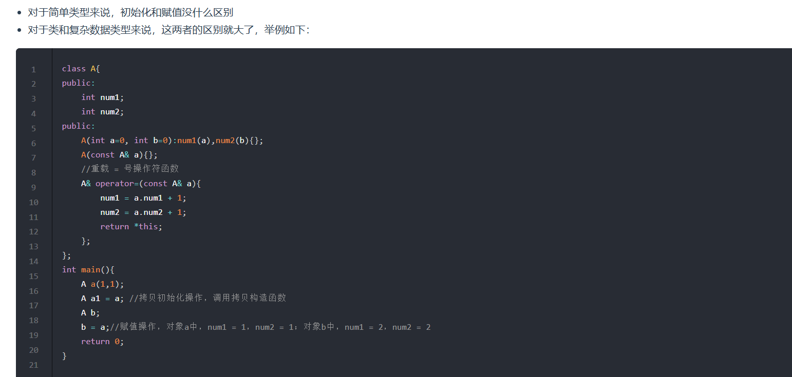

1. `C++`中的`struct`和`class`的区别
   * 相同点:
    - 两者都拥有成员函数、公有和私有部分
    - 任何可用使用`class`完成的工作,同样可用使用`struct`完成
   * 不同点:
    - `class`默认是`private`成员;而`struct`默认是`public`
    - 对于继承,`class`默认是`private`,`struct`默认是`public`
2. `define`和`const`的区别
   * `define`是在编译的预处理阶段;`const`是在编译、运行阶段
   * `define`只是将宏进行名称替换,在内存中会产生多个相同的备份;`const`在程序运行中只有一个备份
   * 宏不检查类型;`const`会检查数据类型
   * 宏定义的数据没有分配内存空间,只是插入替换掉;`const`定义的变量只是值不能改变,但要分配内存空间  
3. `static`和`const`的作用
   
   在类中定义`static`成员变量时不能直接初始化,如果是`static const`或者`inline static`那么是可用初始化的;`const`常量在定义时必须初始化,之后无法更改.`const`成员变量不能在类定义外部初始化,也不能在类中声明时初始化(因为不同类对其`const`数据成员的值可以不同)只能通过构造函数初始化列表进行初始化,而且必须有构造函数   
4. `C++`的顶层和底层`const`
   * 顶层`const`:指的是`const`修饰的变量本身是一个常量,无法修改,指的是指针,就是`*`号的右边(`int a=10;int* const b=&a;const int b2=20`)
   * 底层`const`:指的是`const`修饰的变量所指向的对象是一个常量,指的是所指变量,就是`*`号的左边(`int a=10;const int* b=&a`)
5. `override`用于指定这个子类的成员函数是重写的父类的虚函数;`final`关键字通常用于类的继承和虚函数的声明,它的作用是阻止派生类对基类中的虚函数进行重写或者防止派生类再次派出新的子类
6. 初始化和赋值的区别:
   
7. 在`C++`中加`extern "C"`后,相当于告诉编译器这部分代码是`C`写的,因此要按照`C`来编译,而不是`C++`
8. 野指针:没有被初始化过的指针,如果直接使用编译器会报错,产生非法内存访问.可以在初始化时赋值为`nullptr`;悬空指针:指向内存已经被释放了的一种指针.如果指针指向的内存已经被释放,继续使用这个指针就会行为不可预料.智能指针的本质就是避免悬空指针的产生
9. 浅拷贝:只是拷贝一个指针,并没有开辟一个地址,拷贝的指针和原来的指针指向同一块内存,修改时,原对象和拷贝对象都受到影响,如果原来的指针所指向的资源释放了,那么再释放浅拷贝的指针的资源就会出现错误;深拷贝:不仅拷贝值,还开辟出一块新的空间用来存放新的值,即使原先的对象被析构掉,释放内存了也不会影响到深拷贝得到的值,两个对象是完全独立的;
10. `volatile`、`mutable`和`explicit`关键字
    * `volatile`:这是一种类型修饰符,用来修饰变量,表示该变量的值可能会被程序之外的其他因素(如硬件设备、其他线程等)改变,因此编译器在优化时不能对访问这些变量的操作进行优化,必须每次直接从内存中读取变量的值
    * `mutable`:可以实现在常量成员函数中修改`mutable`声明的成员变量
    * `explicit`:修饰类的构造函数,被修饰的构造函数的类,不能发生相应的隐式类型转换,只能以显式的方式进行类型转换
11. 什么情况下会调用拷贝构造函数?
    * 用类的一个实例化对象去初始化另一个对象的时候
    * 函数的参数是类的对象时(非引用传递)
12. `public、protected、private`继承
    * `public`继承:公有继承的特点是基类的公有成员和保护成员作为派生类的成员时,都保持原有的状态,而基类的私有成员仍然是私有的,不能被这个派生类的子类所访问
    * `protected`继承:保护继承的特点是基类的所有成员和保护成员都成为派生类的保护成员,并且只能被他的派生类成员函数或友元函数访问,基类的私有成员仍然是私有的
    * `private`继承:私有继承的特点是基类的所有公有成员和保护成员都成为派生类的私有成员,并不被它的派生类的子类所访问,基类的成员只能由自己派生类访问,无法再往下继承
13. `C++`的`private`私有变量不能在类的外部被直接访问,只能通过该对象的方法来访问或修改
14. `private`修饰的成员具有以下特点:
    * 可以被本类的成员函数访问
    * 可以被友元类访问
    * 不能被派生类的成员函数访问
    * 不能被类外部的代码直接访问
15. `protected`修饰的成员具有以下特点:
    * 可以被本类的成员函数访问
    * 可以被派生类的成员函数访问
    * 可以被友元类访问
    * 不能被类外部的代码直接访问
16. `public`修饰的成员具有以下特点:
    * 可以被本类的成员函数访问
    * 可以被派生类的成员函数访问
    * 可以被友元类访问
    * 可以被类外部的代码直接访问