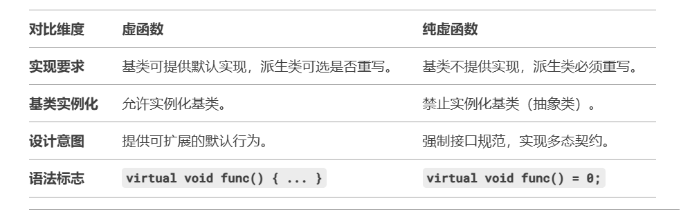

1. `C++`的内存分区:堆、栈、全局/静态存储区、常量存储区和代码区
2. 变量的生命周期
   * 局部变量（函数参数与返回值）是在内存栈上定义在函数体内部的变量，定义时默认是随机值，必须给初始化，生命过程随着函数的结束而消亡；
   * 全局变量是在内存静态存储区一般定义在程序最开始的地方，从定义开始到整个程序结束为止，为整个程序所使用，定义时默认是值为0，生命过程随整个程序的退出而消亡；
   * `static`变量也是在内存静态存储区，作用是其生命周期是为整个程序的生命周期，从定义开始到整个程序结束为止；`extern`修饰的变量可以拓展变量的生命周期，延长该变量的生命周期
3. `STL`中`allocate`包装`malloc`,`deallocate`包装`free`实现内存池
4. `C++`类的成员函数不占用对象的内存,静态成员也不占据类的空间,非静态成员变量才占据(成员函数被编译后放在代码段,静态成员放在静态存储区.只有非静态成员变量才会真正出现在每个对象的内存布局里)
5. 静态成员函数不能访问非静态成员变量,非静态成员变量属于每个对象，成员函数若要访问必须通过对象实例 + this指针才能定位
6. 类的成员函数(静态和非静态)对于每个对象都是共享的,即内存中只有一份。类的对象只是私有自己的非静态成员变量，像成员函数（不管是静态还是非静态）都是某个类的对象共享的
7. `this`指针
   * `this`指针是类的指针,指向对象的首地址
   * `this`指针只能再成员函数中使用,在全局函数、静态成员函数中不能用`this`
   * `this`指针只有在成员函数中才有定义,且存储位置会因编译器不同有不同存储位置
8. `this`在成员函数的开始执行前构造,在成员的执行结束后清除;`this`指针会因编译器不同而有不同的放置位置,可能是栈,也可能是寄存器,甚至是全局存储区;
9. 内存泄漏是指由于疏忽或错误造成了程序未能释放掉不再使用的内存的情况.内存泄漏并非指内存在物理上消失,而是应用程序分配某段内存后,由于设计错误,失去了对该段内存的控制.可以用智能指针来解决
10. 发生内存泄漏的几种情况:
   * 堆内存泄漏:`new、delete`没有成对出现
   * 没有将基类的析构函数定义为虚函数
   * 在释放对象数组时没有使用`delete []`而是使用了`delete`
11. 在类的析构函数中调用`delete this`,会发生什么?
   会导致堆栈溢出.`delete`本质是"为将被释放的内存调用一个或多个析构函数,然后,释放内存".显然,`delete this`会去调用本对象的析构函数,而析构函数中又调用`delete this`,形成无限递归,造成堆栈溢出,系统崩溃
12. 虚函数和纯虚函数的区别:
   虚函数使用`virtual`关键字声明,有函数体;纯虚函数使用`virtual`关键字声明,末尾添加`=0`,无函数体.虚函数是为了实现动态联编产生的,目的是通过基类类型的指针指向不同对象时,自动调用相应地、和基类同名的函数,即实现运行时多态.纯虚函数只是相当于一个接口名,但含有纯虚函数的类不能够实例化
   