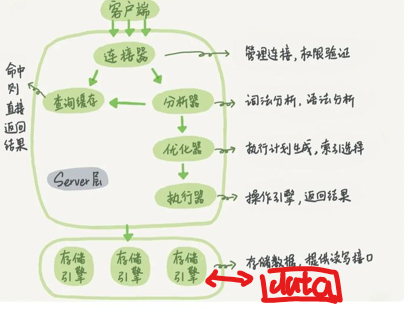

1. 关系型和非关系型数据库的区别
   * 数据模型:关系型数据库采用表格模型来存储数据,表格中的每行都代表一个记录,每列代表一个属性或字段.而`NoSQL`数据库则采用不同的数据模型,如文档、键值对等
   * 数据结构:关系型数据库的数据结构严格,要求每个表都必须有一个预定义的模式,包括数据模型、大小、关系等.而`NoSQL`数据库没有这种限制,允许数据结构的动态变化
   * 可扩展性:`NoSQL`数据库通常具有很好的可扩展性,可以通过添加更多的节点来水平扩展,以应对大规模数据处理和高并发访问的需求.关系型数据库也可以进行垂直扩展,即增加更多的处理能力和存储空间,但这种方式的扩展存在一定的局限性
   * `ACID`特性:关系型数据库通常具有`ACID`,它们可以确保数据的完整性和一致性.而`NoSQL`数据库通常不支持完全的`ACID`特性,但提供了更高的可用性和性能
   * 查询语言:关系型数据库通常使用`SQL`语言来查询和操作数据.而`NoSQL`数据库则使用不同的查询语言,如`MongoDB`的`Mongo Query`等
2. 索引的好处
   * 通过创建唯一性索引,可以保证数据库表中每一行数据的唯一性
   * 可以大大提高查询效率:如果没有索引,数据库需要逐行扫描表中的所有数据(全表扫描),而索引可以快速定位到满足条件的记录
   * 帮助服务器避免排序和临时表
   * 将随机IO变为顺序IO:因为`B+`树索引是有序的,那么在物理内存上有序的节点是物理相邻的
   * 可以加速表和表之间的连接   
3. `InnoDB`为什么要用自增`id`作为主键?
   如果表使用自增主键,那么每次插入新的记录,记录就会顺序添加到当前索引节点的后续位置,当一页写满,就会自动开辟一个新的页.如果使用非自增主键,由于每次插入主键的值近似随机,因此每次新纪录都要被插到现有索引页的中间某个位置,可能会导致频繁的移动和页分裂,可能造成大量的碎片,即页利用率不高,后续不得不通过`OPTIMIZE TABLE`来重建表并优化填充页面
4. `MyISAM`和`InnoDB`实现`B+`树索引的区别
   * `MyISAM`的`B+`树叶子节点的数据存放的是每一条数据记录的地址,即最终这个查询过程就类似`二级索引`
   * `InnoDB`的聚集索引中`B+`树叶子节点保存了完整的数据记录,这个索引的`key`是数据表的主键
5. 执行一条`SQL`查询语句,期间发生了什么?
   * 客户端请求
   * 连接器(验证用户身份,给予权限)
   * 查询缓存(命中缓存则直接返回,否则指向后续操作)
   * 分析器(对`SQL`进行语法分析和词法分析)
   * 优化器(主要对执行的`SQL`优化选择最优的执行方案)
   * 执行器(执行时会先看到用户是否有执行权限,有才去使用这个存储引擎提供的`API`接口)
   * 去引擎层获取数据返回
   
6. `MySQL`内部构造分为:服务层(连接器、查询缓存、分析器、优化器、执行器)和存储引擎层
7. `Drop`、`Delete`、`Truncate`的区别
   * `Drop`命令从数据库中删除表,所有的数据行、索引和权限也会被删除,这个操作不能回滚
   * `Truncate`删除表中所有的数据,这个操作不能回滚
   * `Delete`用来删除表的全部或一部分数据行,这个操作可以回滚
8. 可以从哪些方面做到`MySQL`性能优化?
   * 为查询字段创建索引
   * 避免使用`select *`,尽量是覆盖索引
   * 垂直分割分表
   * 选择正确的存储引擎
9. `MySQL`数据库的隔离级别
    * 读未提交:可能会发生脏读、不可重复读和幻读
    * 读已提交:可以阻止脏读,但不可重复读和幻读仍有可能发生
    * 可重复读:可以阻止脏读和不可重复读,但幻读仍有可能发生
    * 串行化:可以阻止脏读、不可重复读和幻读
10. 数据库为什么采用`B+`树而不是`B`树?
    B+Tree 只在叶子节点存储数据，而 B 树 的非叶子节点也要存储数据，所以 B+Tree 非叶子节点只存储键值,这意味着B+树的非叶子节点可以存储更多的键值,从而减少了树的高度，高度越低，查询时磁盘I/O次数就越少。另外，B+树只要遍历叶子节点就可以实现整棵树的遍历,而且它对于范围查询时很方便的(因为叶子节点采用的是有序双链表连接),而B树只能中序遍历所有节点,效率很低
11. 视图和游标:视图是一种虚拟的表,通常是有一个表或者多个表的行或列的子集,具有和物理表相同的功能;游标是对查询出来的结果集作为一个单元来有效的处理,一般不使用游标,但是需要逐条处理数据的时候,游标显得十分重要
12. `MySQL`为什么要有事务回滚机制?
    回滚机制是 MySQL 实现“事务原子性”的关键手段 —— 要么全部成功，要么全部撤销，防止数据出现“做一半”的残局
13. `InnoDB`和`MyISAM`的区别
    * `InnoDB`支持事务;`MyISAM`不支持
    * `MyISAM`只支持表级锁;`InnoDB`支持表级锁和行级锁
    * `InnoDB`支持外键;`MyISAM`不支持
    * `InnoDB`支持在线热备份;`MyISAM`不支持
    * `MyISAM`崩溃后发生损坏的概率比`InnoDB`高很多,而且恢复的速度也更慢
14. 对于`MySQL`,在绝大多数需求为单条记录查询时,可以选择哈希索引,查询性能最快;其余大部分场景,建议选择`B+`树索引
15. 数据库的分库分表的原因?会出现什么问题?
    为了减小数据库的单库单表负担,提高查询效率,缩短查询时间.分库分表会带来数据迁移和扩容问题、分页和排序问题