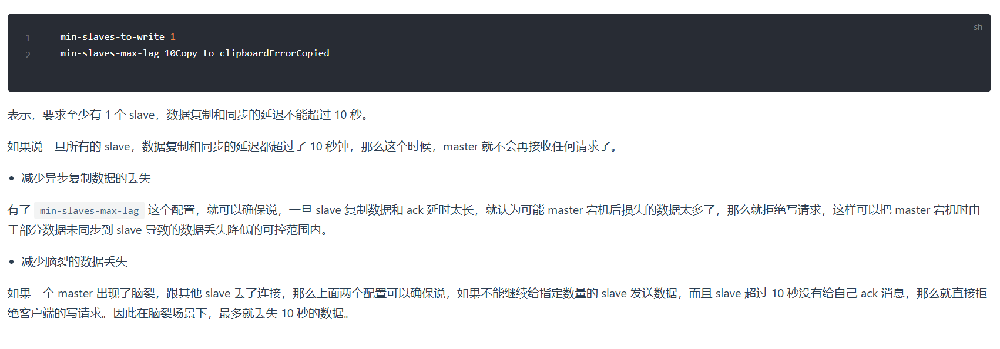

1. 如何解决`Redis`的并发竞争`Key`问题?
   分布式锁
2. `Redis`的高并发和高可用是如何保证的?
   高并发是利用主从模型架构保证的,一般一主多从就能实现;如果在实现高并发的同时,要尽可能多的容纳大量的数据,这时就需要使用`Redis`集群.高可用是通过哨兵机制实现的
3. 哨兵主从切换的数据丢失问题:
   * 异步复制导致的数据丢失:`master->slave`的复制是异步的,所以可能有部分数据还没复制到`slave`,`master`就宕机了,此时这部分数据就丢失了
   * 脑裂导致的数据丢失:脑裂:某个`master`所在机器突然脱离了正常的网络,跟其他`slave`机器不能连接,但是实际上`master`还允许着.此时哨兵可能就会认为`master`宕机了,然后开启选举,将其它`slave`切换城`master`.这个时候,集群里就会有两个`master`,也就是所谓的脑裂.此时虽然某个`slave`被切换成了`master`,但是可能客户端还没来得及切换到新的`master`,还继续向旧`master`写数据.因此旧`master`恢复时,就会被作为一个`slave`挂到新的`master`上去,自己的数据会清空,重新从新的`master`复制数据.而新的`master`并没有后来客户端写入的数据,因此,这部分数据就丢失了
   * 解决办法:
    
4. 3. `master`怎么判断是不是第一次连接?
   `slave`做数据同步之前(不管全量还是增量)必须向`master`声明自己的`replication id`和`offset`,`master`才可以判断到底需要同步哪些数据.需要全量同步即`offset=0&&replication id一样`
5. `Redis`集群模式的工作原理:
   * 集中式
   * `Gossip`:`Cluster`节点间采用`Gossip`协议通信