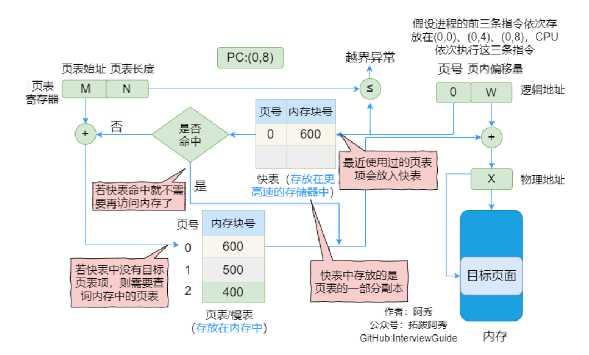
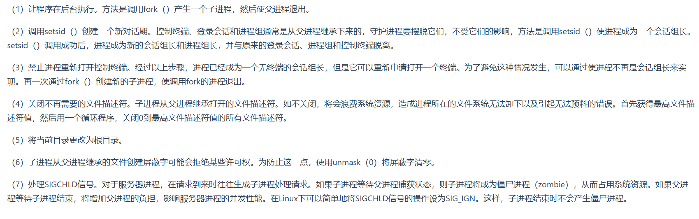

1. 内存是用于存放数据的硬件.程序执行前需要先放到内存中才能被`CPU`处理
2. 操作系统中的哲学家就餐问题:其实就是死锁问题.解决方法:
   * 每位哲学家必须同时拿起左右两根筷子
   * 只有在他的两个邻居都没有进餐的情况下才允许进餐
3. 几种典型锁:
   * 读写锁:多个读者可以同时进行读;写者必须互斥;写者优于读者
   * 互斥锁:一次只能一个线程拥有互斥锁,其它线程只有进入`sleep`状态等待.互斥锁是在抢锁失败的情况下主动放弃`CPU`进入睡眠状态直到锁的状态改变时再唤醒,互斥锁在加锁操作时涉及上下文的切换
   * 条件变量:互斥锁是线程间互斥的机制,条件变量则是同步机制
   * 自旋锁:如果线程无法取得锁,线程不会立刻放弃`CPU`时间片,而是一直循环尝试获取锁,直到获取为止;如果别的线程长时期占有锁,那么自旋就是在浪费`CPU`做无用功,但是自旋锁一般应用于加锁时间很短的场景,这个时候效率比较高.自旋锁不会进入互斥锁中的`sleep`睡眠状态
4. `POSIX`线程锁:互斥锁、条件变量、自旋锁
5. 怎么回收线程?
   * 等待线程结束:`int pthread_join(tid, retval)`:主线程调用,等待子线程退出并回收其资源,类似进程中的`wait()/waitpid()`回收僵尸进程
   * 结束线程:`void pthread_exit(void* retval)`:子线程执行,用于结束当前线程并通过`retavl`传递返回值
   * 分离线程:`int pthread_detach(pthread_t tid)`
6. 内存的覆盖是什么?
   由于程序运行时并非任何时候都要访问程序及数据各个部分,因此可以把用户空间分成为一个固定区和若干个覆盖区.将经常活跃的部分放在固定区(意思就是经常会被调用的部分),其余部分按照调用关系分段,首先将那些即将要访问的段放入覆盖区,其它段放在外存中,在需要调用前,系统将其调入覆盖区,替换覆盖区中原有的段.覆盖区的特点:是打破了必须将一个进程的全部信息装入内存后才能运行的限制,但当同时运行程序的代码量大于主存时仍不能运行,再而,内存中能够更新的地方只有覆盖区的段,不在覆盖区的段会常驻内存
7. 内存交换:内存空间紧张时,系统将内存中某些进程暂时换出外存,把外存中某些已具备运行条件的进程换入内存.换入:把准备好竞争`CPU`运行的程序从辅存移到内存;换出:把处于等待状态的程序从内存移到辅存,把内存空间腾出来
8. 什么时候会进行内存的交换?
   内存交换通常在许多进程运行且内存吃紧时进行(如:发现许多进程运行时经常发生缺页),而系统负荷降低就暂停
9. 终端退出,终端运行的进程会怎样?
    终端在退出时会发送`SIGHUP`给对应的`bash`进程,`bash`进程收到这个信号将它发给`session`下面的进程,如果程序没有对`SIGHUP`信号做特殊处理(如`nohup+&`),那么进程就会随着终端关闭而退出
10. 如何让进程后台运行?
    * 执行进程命令后加一个`&`,这样是将命令放入到一个作业队列中
    * `ctrl+z`挂起进程;`jobs`查看序号;`bg%序号`就能使进程后台运行了
    * `nohup+&`将标准输出和标准错误缺省会被重定向到`nohup.out`中,忽略所有挂断`SIGHUP`信号
    * 运行指令前+`setsid`,使其父进程变成`init`进程,不受`HUP`信号的影响
    * 将`命令+&`放在`()`中,也可以使进程不受`HUP`信号的影响
11. 快表:又称联想寄存器,是一种访问速度比内存快很多的高速缓冲存储器,用来存放当前访问的若干页表项,以加速地址变换的过程.与此对应,内存中的页表常称为慢表.快表就类似`Cache`缓存,快表会存放最近使用过的页表
    
12. 虚拟地址到物理地址的查表映射中,有快表和无快表有什么区别?
    
13. 在执行`malloc`申请内存时,操作系统是怎么做的?
    从操作系统来看,`malloc`就是`brk`和`mmap`这两个系统调用来实现的.`brk`是将`.data`段的最高指针项高处移动,这一步可以扩大进程在运行时的堆大小;`mmap`是在进程的虚拟地址空间中寻找一块空闲的虚拟内存,这一步可以获得一块可以操作的堆内存.退出,分配的内存小于128k时,使用`brk`调用来获得虚拟内存;大于128k时就使用`mmap`来获得虚拟内存.进程先通过这两个系统调用获取或者扩大进程的虚拟内存,获得相应的虚拟地址,在访问这些虚拟地址时,通过缺页中断,让内核分配相应的物理内存,这样内存分配才算完成
14. 守护进程:在后台运行的,没有控制终端与之相连的进程.它独立于控制终端,周期性地执行某种任务.`Linux`的大多数服务器就是用守护进程的方式实现的.创建守护进程的要点:
    