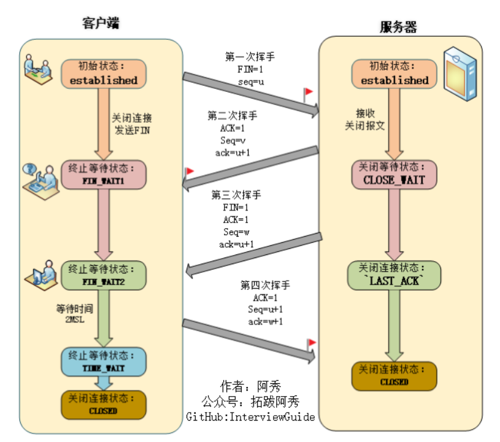
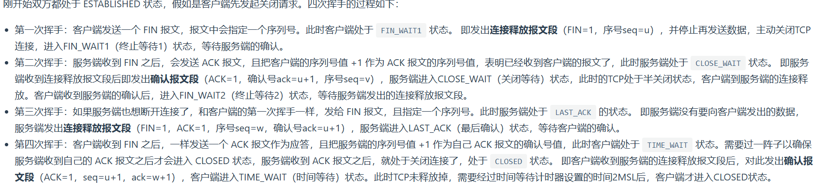
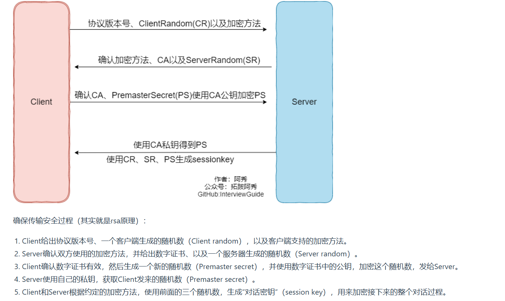
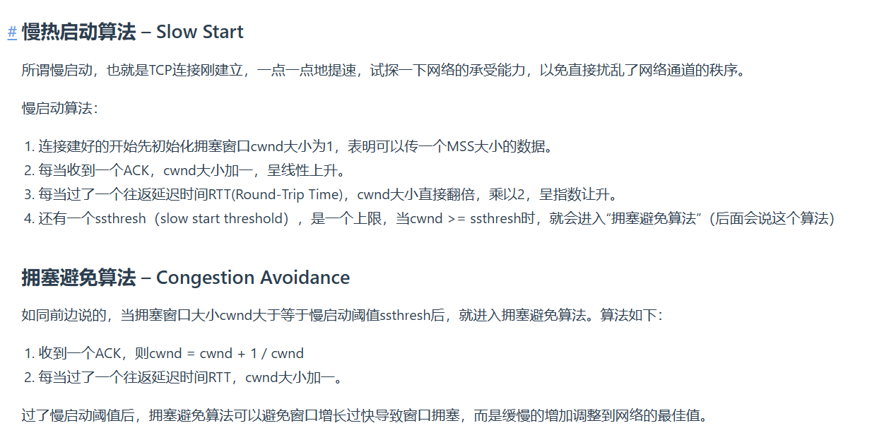
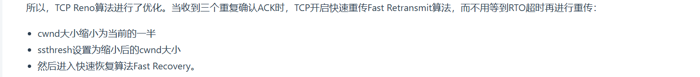

1. `TCP`的四次挥手:
   
   
2. 挥手为什么是四次,而握手只需要三次?
   因为握手时,服务器收到客户端的`SYN`连接请求报文后,可以直接发送`SYN+ACK`报文,因为服务端不需要发送什么其它数据,而是可以直接把`SYN`和`ACK`一起发送过去的,因此只需要三次;而对于挥手,当服务端收到`FIN`报文后,很可能并不会立即关闭连接,所以只能先回复一个`ACK`报文,只有等服务端的所有报文发送完了,才能发送`FIN`报文,即`ACK`和`FIN`不能一起发送,故需要四次挥手
3. `2MSL`的意义
   * 保证客户端发送的最后一个`ACK`报文能够到达服务端,不然的话服务器会一直重发`FIN`报文
   * 防止已失效的连接请求报文段出现在本连接中
4. 为什么是`2MSL`呢?
   因为客户端不知道服务端能否收到第四次挥手的`ACK`数据包,如果没收到,服务端就会重传`FIN`,考虑最坏的情况:第四次挥手的`ACK`包的最大生存时长(`MSL`)+服务端重传的`FIN`包的最大生存时长(`MSL`)=`2MSL`
5. `TCP`粘包和拆包
   * 如果一次请求发送的数据量比较小，没达到缓冲区大小，`TCP`则会将多个请求合并为同一个请求进行发送，这就形成了粘包问题 
   * 如果一次请求发送的数据量比较大，超过了缓冲区大小，`TCP`就会将其拆分为多次发送，这就是拆包，也就是将一个大的包拆分为多个小包进行发送
6. 对称密钥和非对称密钥:对称密钥加密和解密使用同一密钥;非对称密钥加密和解密使用不同密钥(公钥加密、私钥解密)
   优点:对称密钥运算速度快;非对称密钥可以更安全地将公钥传输给通信发送方
   缺点:对称密钥无法安全地将密钥传输给通信方;非对称密钥运算速度慢
7. `HTTP`缺点
   * 使用明文通信,内容可能会窃听
   * 不验证通信方的身份,通信方的身份有可能伪装
   * 无法证明报文的完整性,报文有可能被篡改
8. `HTTPS`采用混合的加密机制,使用非对称密钥加密用于传输对称密钥来保证传输过程的安全性,之后使用对称密钥加密进行通信来保证通信过程的效率
   
9. 网络层常见协议:
    * `IP`:不但定义了数据传输时的基本单元和格式,还定义了数据报的递交方法和路由选择
    * `ICMP`:一个错误侦测与回报机制,其目的是让我能够检测网路的连线状况
    * `RIP`:路由信息协议,使用跳数来衡量到达目标地址的路由距离
    * `IGMP`:用于实现组播、广播等通信
10. `TCP`拥塞控制四大算法:慢启动、拥塞控制、快重传(触发条件就是丢包,即收到三个重复的`ACK`)、快恢复
    
    
    一般来说,`TCP`拥塞控制算法以丢包为网络进入拥塞状态的信号.对于丢包有两种判定方式,一种是超时重传超时(其原理是在发送一个数据以后就开启一个计时器,在一定时间内如果没有得到发送数据段的`ACK`报文,那么就重新发送数据,直到发送成功为止);另一个是收到三个重复确认的`ACK`
11. 为什么快重传选择3次`ACK`?
    主要考虑还是区分包的丢失是由于链路故障还是乱序等其它因素引发.两次`ACK`很可能是乱序造成的,三次`ACK`很可能是丢包造成的,四次`AKC`更可能是丢包造成的,但是此时响应策略太慢.因此选取三次`ACK`
   