# Redis
1. `Redis`特点:
   * 键值型
   * 单线程,每个命令具备原子性
   * 低延迟,速度快(基于内存、IO多路复用、良好的编码)
   * 支持数据持久化
   * 支持主从集群、分片集群
   * 支持多语言客户端(`java`,`C++`等)
2. `Redis`的五种基本数据结构:
   * 字符串
   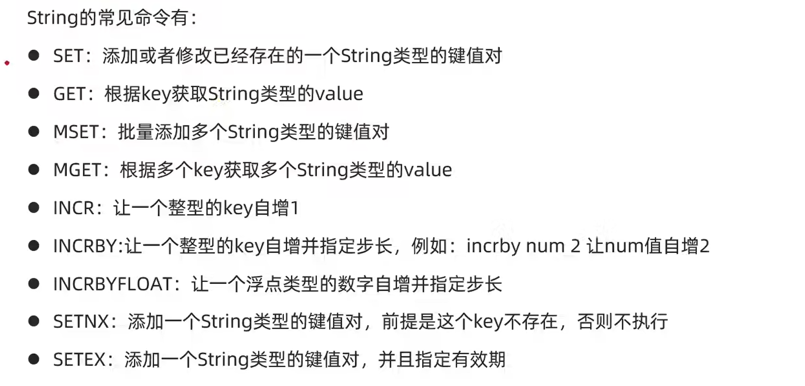
   * 哈希表
   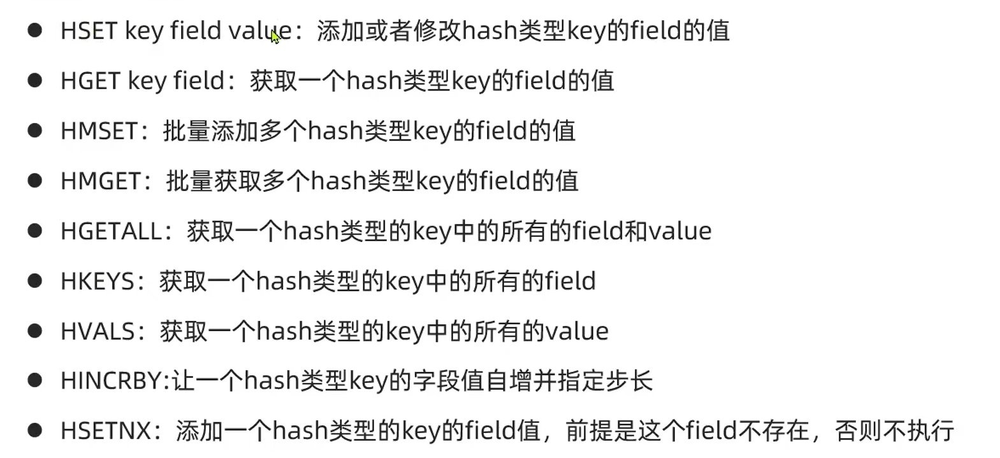
   * 列表:可以看作是一个双向链表结构,既可以支持正向检索也可以支持反向检索
   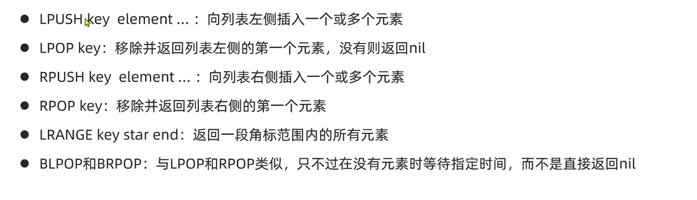 
   * 集合
   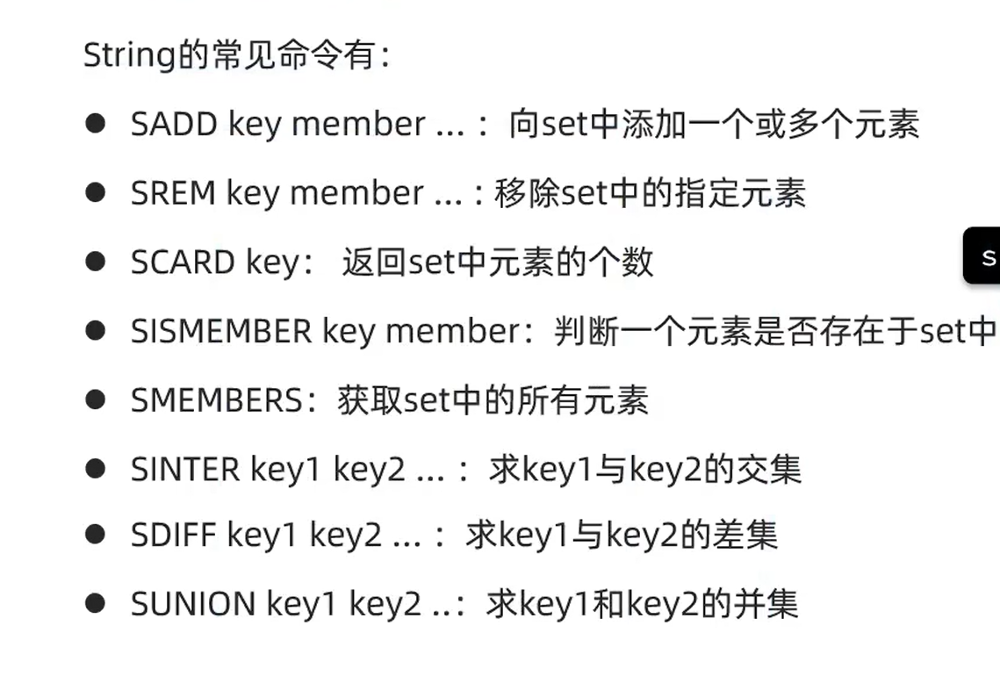 
   * 有序集合:每个元素都带有一个`score`属性,可以基于`score`属性对元素排序,底层的实现是一个跳表+哈希表
   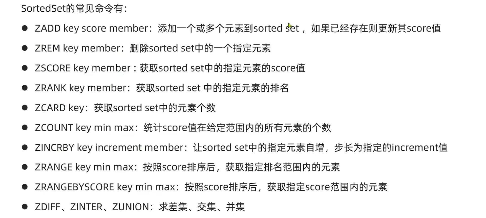
3. `Redis`的命令行使用
   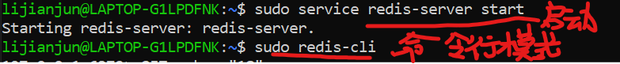
4. `Redis`的`key`允许有多个单词形成层级结构,多个单词之间用`':'`隔开
5. `HSET`命令返回`integer 0`是因为`name`这个字段在`heima:user:1`这个哈希表中已经存在了(`SET`等命令返回的情况和这个类似)
6. `Redis`没有直接使用C语言中的字符串
7. 动态字符串`SDS`
   ```C
   struct __attribute__((__packed__)) sdshdr8 {
    uint8_t len;// 已保存的字符串字节数,不包含结束标识
    uint8_t alloc;// 申请的总的字节数,不包含结束标识
    unsigned char flags;// 不同SDS的头类型(有5种,如 #define SDS_TYPE_8 1),用来控制SDS的头大小
    char buf[];
   }
   // 上述这个SDS结构体保存的最大范围为255,还有其它范围更大的SDS结构体(有5种)
   ```
   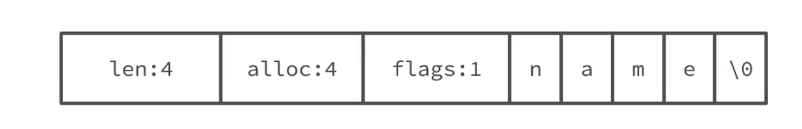
8. `SDS`具备动态扩容的能力,如:
   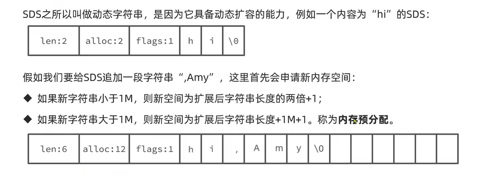
9. `SDS`优点:
    * 获取字符串长度的时间复杂度为`O(1)`
    * 支持动态扩容
    * 减少内存分配次数
    * 二进制安全
10. `IntSet`是`Redis`中集合的一种实现方式,基于整数数组实现,并且具备元素唯一、长度可变、有序(底层采用二分查找来保证有序性)等特征
    ```C
    typedef struct intset {
        uint32_t encoding;// 编码方式,支持16位、32位、64位的整数
        uint32_t length;// 元素个数
        int8_t contents[];// 整数数组,保存集合数据
    } intset;
    ```
11. `intset`默认是升序将整数保存在`contents`中
    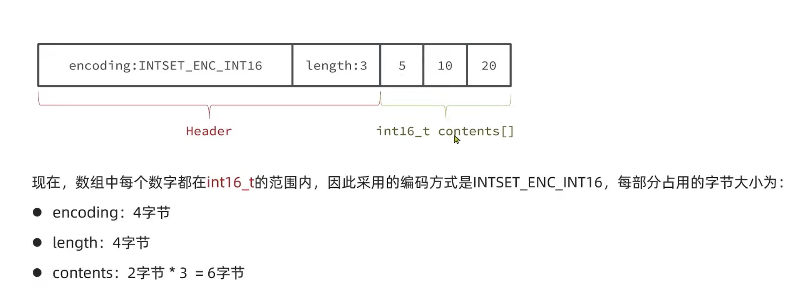
12. `intset`的编码方式可以自动升级,即将编码方式升级到合适的大小
    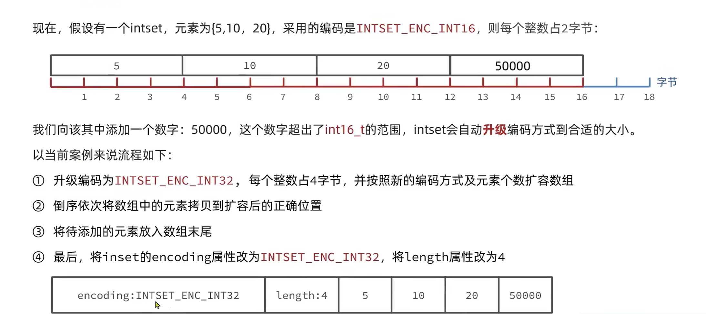
13.  `Dict`由三部分组成,分别是:哈希表、哈希节点(键值对)、字典
    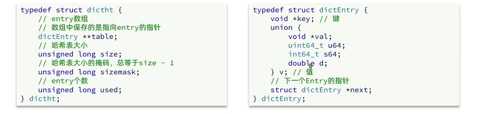
    当我们向`dict`添加键值对时,`Redis`首先根据`key`计算出`hash`值,然后利用`h&sizemask`来计算元素应该存储到数组中的哪个索引位置
    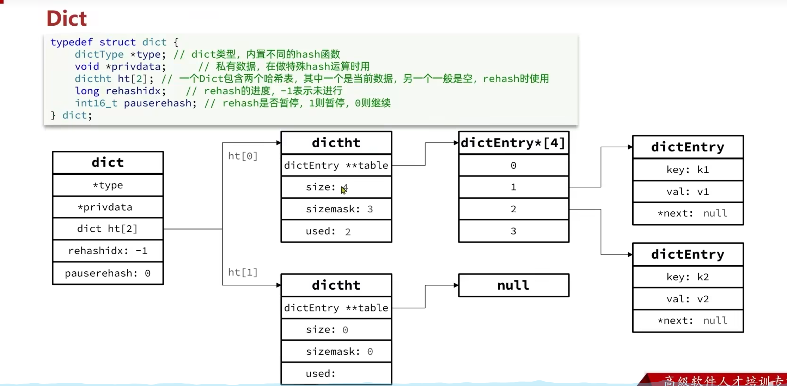
14. `Dict`在每次新增键值对时都会检查负载因子(`LoadFactor=used/size`),满足以下两种情况时会触发哈希表扩容:
    * 哈希表的`LoadFactor>=1`,并且服务器没有执行`BGSAVE`或者`BGREWRITEAOF`等后台进程
    * 哈希表的`LoadFactor>5` 
15. `Dict`每次删除元素时,也会对负载因子做检查,当`LoadFactor<0.1`时,会做哈希表收缩.不管是扩容还是收缩,必定会创建新的哈希表,导致哈希表的`size`和`sizemask`变化,而`key`的查询与`sizemask`有关.因此必须对哈希表中的每一个`key`重新计算索引,插入新的哈希表,这个过程称为`rehash`,过程如下:
    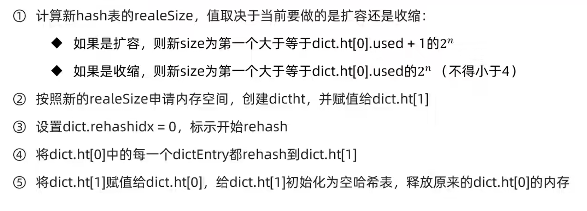
    `Dict`的`rehash`并不是一次性完成的.如果`dict`中包含数百万的`entry`,要在一次`rehash`完成,极有可能导致主线程阻塞.因此`dict`的`rehash`是分多次、渐进式的完成,因此称为渐进式`rehash`(每次访问`dict`时(增删改查)执行一次`rehash`),流程为:
    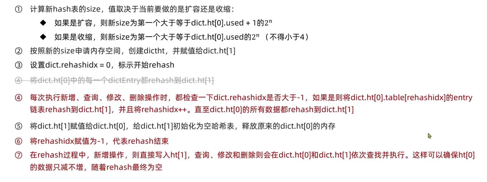
16. `dict`底层是数组+链表来解决哈希冲突,`dict`包含两个哈希表`ht[0]`平常用,`ht[1]`用来`rehash`
17. `ziplist`是一种特殊的"双端链表,由一系列特殊编码的连续内存块组成.可以在任意一端进行压入/弹出操作(类似双端队列`deque`),并且该操作的时间复杂度为`O(1)`
    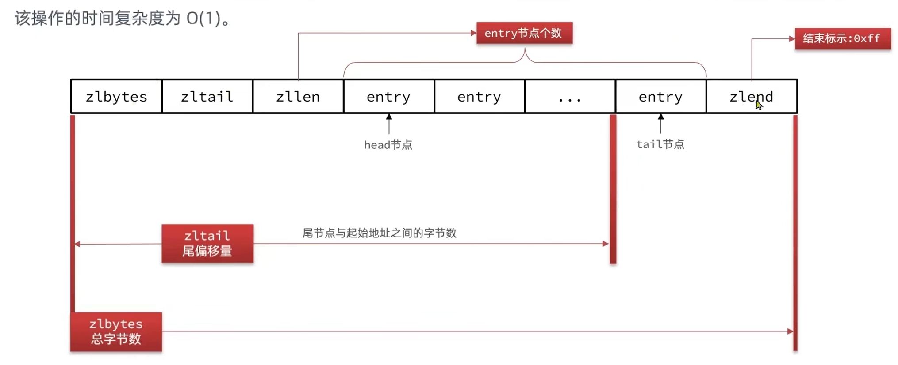
18. `ziplist`的`entry`结构:
    
19. `ziplist`的连锁更新问题:在特殊情况下产生的连续多次空间扩展操作称之为连锁更新(概率降低)
    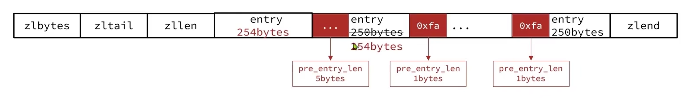
    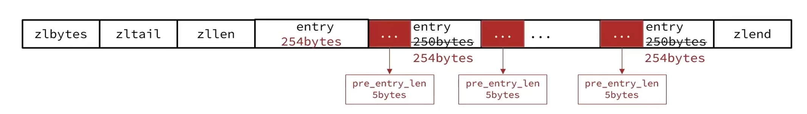、
20. `Redis`的五种数据结构:`String`、`list`、`hash`、`set`、`sorted set`
21. `Redis`和`LevelDB`一样,也有部分数据在硬盘上
22. `Redis`是单线程的
23. `Redis`与`Memcached`的区别
    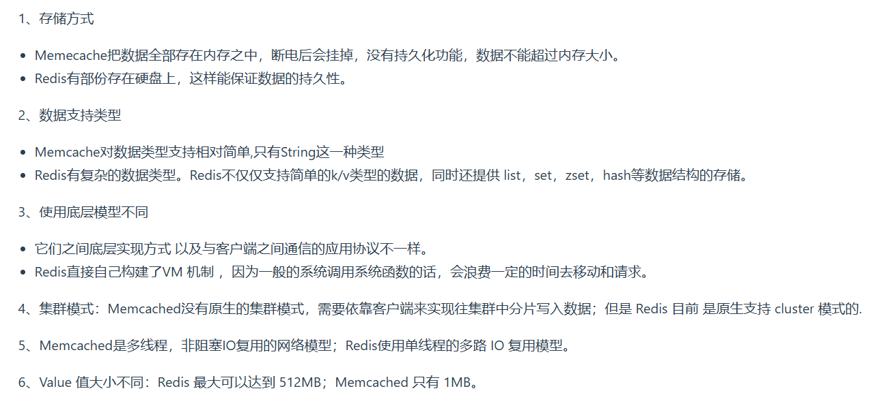
24. `Redis`为什么这么快?
    * 全部操作是纯内存的操作
    * 采用单线程,有效避免了频繁的上下文切换
    * 采用非阻塞`I/O`多路复用
25. `Redis`设置过期时间的方案:
    * 定期删除:默认每隔100ms就随机抽取一些设置了过期时间的`key`,检查是否过期,如果过期就删除
    * 惰性删除:指某个键值过期后,此键值不会马上被删除,而是等到下层被使用的时候,才会被检查到过期,此时才能得到删除
26. 定期删除和惰性删除不能保证一定删除数据,`Redis`采用内存淘汰机制来确保数据一定被删除
27. `Redis`是通过`IO`多路复用来处理多个客户端请求
28. 缓存雪崩:指的是缓存同一时间大面积的失效,所以,后面的请求都会落到数据库上,造成数据库短时间内承受大量请求而崩掉
29. 缓存穿透:指查询一个一定不存在的数据,由于缓存不命中,接着查询数据库也无法查询出结果,因此也不会写入到缓存中,这会导致每个查询都会去请求数据库,造成缓存穿透(布隆过滤器解决)
30. 缓存击穿:指一个`key`非常热点,大并发集中对这一个点访问,当这个`key`失效瞬间,持续的大并发就穿破缓存,直接请求数据库
31. `Redis`可以作为中间缓存使用
32. `Redis`的持久化机制:
    * 快照持久化:`Redis`可以通过创建快照来获得存储在内存里面的数据在某个时间点的副本.创建快照后,可以对快照进行备份,可以将快照复制到其它服务器从而创建具有相同数据的服务器副本,还快也将快照留在原地以便重启服务器的时候使用
    * `AOF`持久化