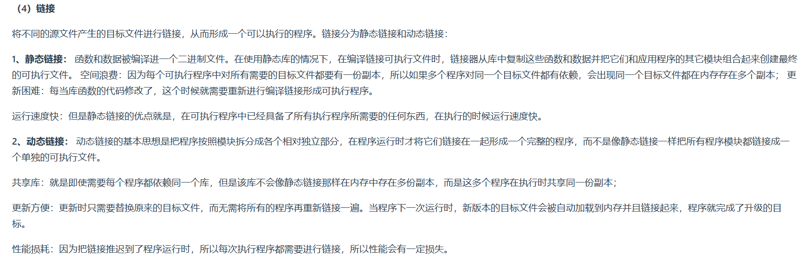
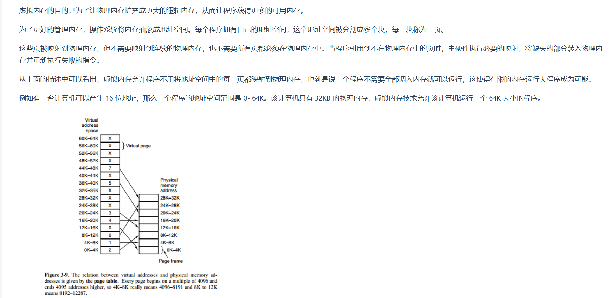

1. 进程是资源分配的基本单位,运行一个可执行程序会创建一个或多个进程,进程就是运行起来的可执行程序
2. 线程是资源调度的基本单位,也是程序执行的基本单位,是轻量级的进程.每个进程中都有唯一的主线程,且只能有一个,主线程和进程是相互依存的关系,主线程结束进程也会结束
3. 协程是用户态的轻量级线程,线程内部调度的基本单位
4. 同一个线程共享的有堆、全局变量、静态变量、指针、引用、文件等,而独自占有栈
5. 进程结构由以下几部分组成:代码段、堆栈段、数据段
6. 对于32位进程来说,`0xC0000000-0xFFFFFFFF`是内核空间地址,`0x00000000-0xC0000000`是用户空间地址
7. 一次完整的上下文切换通常是进程原先运行于用户态,之后因系统调用或时间片切换到内核态执行内核指令,完成上下文切换后回到用户态,此时已经切换到进程B
8. 进程调度算法
   * FCFS:先来先服务,非抢占式的调度算法,按照请求的顺序进行调度
   * SJF:短作业优先,非抢占式的调度算法,按估计运行实际最短的顺序进行调度
   * SRTN:最短剩余时间优先,最短作业优先的抢占式版本,按剩余运行时间的顺序进行调度
   * 时间片轮转:将所有就绪进程按FCFS的原则排成一个队列,每次调度时,把`CPU`时间分配给队首进程,该进程可以执行一个时间片.当时间片用完时,由计时器发出时钟中断,调度程序便停止执行该进程的执行,并将它送往就绪队列的末尾,同时继续把`CPU`时间分配给队首的进程
   * 优先级调度:为每个进程分配一个优先级,按优先级进行调度
   * 多级反馈队列
      
9. `Linux`下进程间通信方式:
    * 管道
    * 共享内存
    * 消息队列
    * 套接字
    * 信号量 
10. `Linux`下同步机制:
    * 信号量:可用于进程同步,也可用于线程同步
    * 互斥锁+条件变量:只能用于线程同步
11. 内存交换技术主要是在不同进程之间进行,而覆盖则用于统同一程序或进程中
12. 动态分区分配算法:
    * 首次适应算法(最好):每次从低地址开始查找,找到第一个能满足大小的空闲分区
    * 最佳适应算法:由于动态分区分配是一种连续分配方式,为各进程分配的空间必须是连续的一整片区域.因此为了保证当"大进程"到来时能有连续的大片空间,可以尽可能多地留下大片的空闲区,即优先使用更小的空闲区
    * 最坏适应算法:与最佳适应算法相反,即优先使用更大的空闲区
    * 邻近适应算法:首次适应算法每次都从链头开始查找,这可能会导致低地址部分出现很多小的空闲分区,而每次分配查找时,都要经过这些分区,因此也增加了查找的开销.如果每次都从上次查找结束的位置开始检索,就能解决此问题
13. 进程状态的切换:就绪状态、运行状态、阻塞状态
    
14. 一个`C/C++`程序从开始编译到生成可执行文件的完整过程:
    
    
15. 进程同步:信号量、管程  
16. 操作系统在对内存进行管理的时候需要:
    * 负责回收内存空间的分配与回收
    * 需要提供某种技术从逻辑上对内存空间进行扩充(虚拟内存)
    * 提供地址转换功能,负责程序的逻辑地址与物理地址的转换
    * 提供内存保护功能,保证各进程在各自存储空间内运行,互不干扰
17. 虚拟内存的目的:为了让物理内存扩充程更大的逻辑内存,从而让程序获得更多的可用内存
    
                                                                       