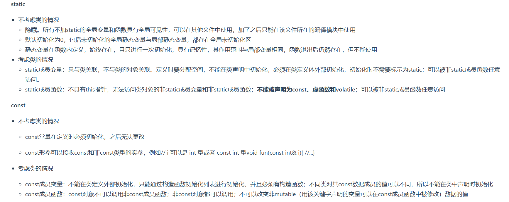

1. `C++`中的`struct`和`class`的区别
   * 相同点:
    - 两者都拥有成员函数、公有和私有部分
    - 任何可用使用`class`完成的工作,同样可用使用`struct`完成
   * 不同点:
    - `class`默认是`private`成员;而`struct`默认是`public`
    - 对于继承,`class`默认是`private`,`struct`默认是`public`
2. `define`和`const`的区别
   * `define`是在编译的预处理阶段;`const`是在编译、运行阶段
   * `define`只是将宏进行名称替换,在内存中会产生多个相同的备份;`const`在程序运行中只有一个备份
   * 宏不检查类型;`const`会检查数据类型
   * 宏定义的数据没有分配内存空间,只是插入替换掉;`const`定义的变量只是值不能改变,但要分配内存空间  
3. `static`和`const`的作用
   
   在类中定义`static`成员变量时不能直接初始化,如果是`static const`或者`inline static`那么是可用初始化的;`const`常量在定义时必须初始化,之后无法更改.`const`成员变量不能在类定义外部初始化,也不能在类中声明时初始化(因为不同类对其`const`数据成员的值可以不同)只能通过构造函数初始化列表进行初始化,而且必须有构造函数   
4. `C++`的顶层和底层`const`
   * 顶层`const`:指的是`const`修饰的变量本身是一个常量,无法修改,指的是指针,就是`*`号的右边(`int a=10;int* const b=&a;const int b2=20`)
   * 底层`const`:指的是`const`修饰的变量所指向的对象是一个常量,指的是所指变量,就是`*`号的左边(`int a=10;const int* b=&a`)
5. `override`用于指定这个子类的成员函数是重写的父类的虚函数;`final`关键字通常用于类的继承和虚函数的声明,它的作用是阻止派生类对基类中的虚函数进行重写或者防止派生类再次派出新的子类
6. 初始化和赋值的区别:
   
7. 在`C++`中加`extern "C"`后,相当于告诉编译器这部分代码是`C`写的,因此要按照`C`来编译,而不是`C++`