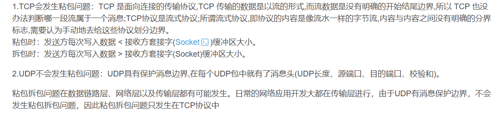
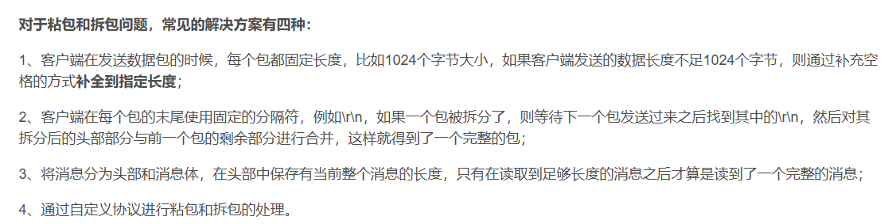
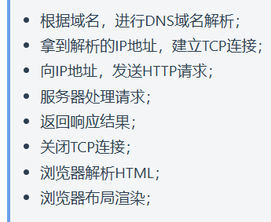

1. 物理层数据被称为比特流;数据链路层数据被称为帧;网络层数据被称为包
2. 一次完整的`HTTP`请求过程:域名解析->发起`TCP`三次握手->建立`TCP`连接后发起`http`请求->服务器响应`http`请求,浏览器得到`html`代码->浏览器解析`html`代码,并请求`html`代码中的资源->浏览器对页面进行渲染呈现给用户
3. `DNS`原理:将主机域名转换为`ip`地址,属于应用层协议,使用`UDP`传输.主机向本地域名服务器的查询一般都是采用递归查询;本地域名服务器向根域名服务器的查询是迭代查询
4. `HTTP1.0`中默认使用短连接,也就是说,客户端和服务器每进行一次`HTTP`操作,就建立一次连接,任务结束就中断连接;`HTTP1.1`起默认使用长连接
5. `TCP`粘包和拆包
   * 如果一次请求发送的数据量比较小，没达到缓冲区大小，`TCP`则会将多个请求合并为同一个请求进行发送，这就形成了粘包问题
   * 如果一次请求发送的数据量比较大，超过了缓冲区大小，`TCP`就会将其拆分为多次发送，这就是拆包，也就是将一个大的包拆分为多个小包进行发送
    
   * 解决粘包和拆包
    
6. 为什么服务器会有缓存这一项功能?
   为了缓解服务器压力;降低客户端获取资源的延迟:缓存位于内存中,读取缓存的速度更快.并且缓存服务器在地理位置也有可能比源服务器来得近,例如客户端的浏览器缓存.实现方法有:让代理服务器进行缓存;让客户端浏览器进行缓存
7. `HTTP`请求方法:`GET、POST、HEAD、PUT、DELETE、CONNECT、OPTIONS、TRACE、PATCH` 
8. `GET`是幂等的(指一次和多次请求某一资源应该具有同样的副作用,简单来说意味着对同一`URL`的多个请求应该返回同一的结果),而`POST`不是幂等的.因此,不能用`GET`请求做数据的增删改这些有副作用的操作,比如在网络不好的隧道中会尝试重试,如果`GET`请求曾数据,那么会有重复操作的风险,而这种重复操作可能会导致副作用
9. 如果维持连接,一个`TCP`连接是可以发送多个`HTTP`请求的
10. `HTTP2`中由于`Multiplexing`特点的存在,多个`HTTP`请求可以在同一个`TCP`连接中并行进行
11. 浏览器对同一`HOST`建立的`TCP`连接到的数量有限制:`Chrome`最多允许对同一个`Host`建立6个`TCP`连接,不同浏览器有些区别
12. 在浏览器中输入`uri`地址后显式页面的过程:
    