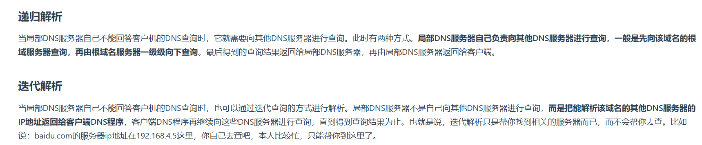
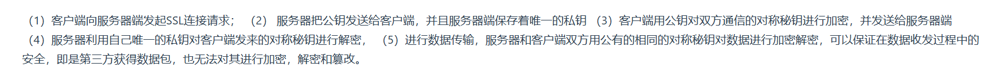

1. `RARP`协议:反向地址解析协议,网络层协议,`MAC`地址->`IP`地址,它使置只知道自己`MAC`地址的主机能够知道对应`IP`地址.原理:
   * 网络上的每台设备都会有一个独一无二的`MAC`地址,通常是由设备厂商分配的.主机从网卡上读取`MAC`地址,然后在网络上发送一个`RARP`请求的广播数据包,请求`RARP`服务器回复该主机的`IP`地址
   * `RARP`服务器收到了`RARP`请求数据包,为其分配`IP`地址,并将`RARP`回应发送给主机
   * `PC1`收到`RARP`回应后,就使用得到的`IP`地址进行通讯
2. 0-1023:知名端口号;1024-65535:动态端口
3. 为什么`TCP/IP`协议栈要分层
   * 各层之间是独立的
   * 灵活性好
   * 结构上可以分隔开
   * 易于实现和维护
   * 能促进标准化工作
4. `DNS`查询:递归查询、迭代查询
   
5. 除了可以将用户信息通过`Cookie`存储在用户浏览器中,也可以利用`Session`存储在服务端,存储在服务端的信息更加安全.`Session`可以存储在服务器上的文件、数据库或内存中,也可以将`Session`存储在`Redis`这种内存型数据库中,效率会更高
6. `SSL`整体流程:`SSL`握手阶段是非对称加密(服务端发送公钥->客户端发送公钥加密的对称密钥(用于通信)->服务器用私钥解密获取对称密钥);通信数据过程是对称加密
   
7. `Cookie`(用于浏览器跟踪)是服务器发送到用户浏览器并保存在本地的一小块数据,它会在浏览器之后向同一服务器再次发起请求时被携带上,用于告知服务端两个请求是否来自同一浏览器
8. `Session`的工作原理是客户端登录完成之后,服务器会创建对应的`session`,`session`创建完之后,会把`session`的`id`发送给客户端,客户端再存储到浏览器中.这样客户端每次访问服务器时,都会带着`sessionid`,服务器拿到`sessionid`之后,在内存找到与之对应的`session`这样就可以正常工作了
9. `Cookie`是客户端保持状态的方法,其分为会话`Cookie`和持久`Cookie`.服务器响应客户端请求时将`Cookie`字符串放在`Set-Cookie`字段下,客户端收到`Cookie`之后保存这段字符串,之后再请求时候带上`Cookie`就可以被识别
10. 