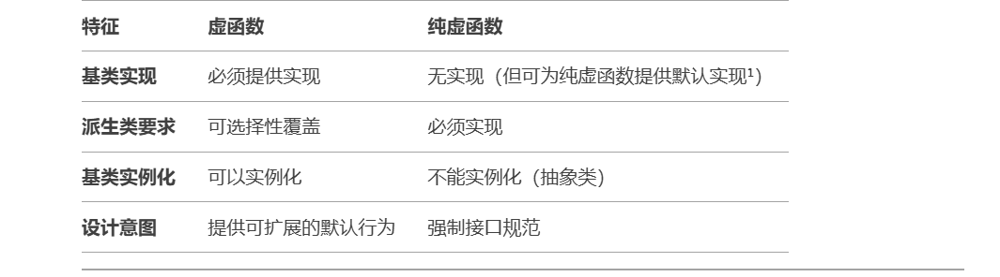

1. `C++`的内存分区:堆、栈、全局/静态存储区、常量存储区和代码区
2. `STL`中`allocate`包装`malloc`,`deallocate`包装`free`实现内存池
3. `C++`类的成员函数不占用对象的内存,静态成员也不占据类的空间,非静态成员变量才占据
4. `this`指针
   * `this`指针是类的指针,指向对象的首地址
   * `this`指针只能再成员函数中使用,在全局函数、静态成员函数中不能用`this`
   * `this`指针只有在成员函数中才有定义,且存储位置会因编译器不同有不同存储位置
5. `this`在成员函数的开始执行前构造,在成员的执行结束后清除;`this`指针会因编译器不同而有不同的放置位置,可能是栈,也可能是寄存器,甚至是全局变量;
6. 内存泄漏是指由于疏忽或错误造成了程序未能释放掉不再使用的内存的情况.内存泄漏并非指内存在物理上消失,而是应用程序分配某段内存后,由于设计错误,失去了对该段内存的控制.可以用智能指针来解决
7. 在类的析构函数中调用`delete this`,会发生什么?
   会导致堆栈溢出.`delete`本质是"为将被释放的内存调用一个或多个析构函数,然后,释放内存".显然,`delete this`会去调用本对象的析构函数,而析构函数中又调用`delete this`,形成无限递归,造成堆栈溢出,系统崩溃
8. 虚函数和纯虚函数的区别:
   