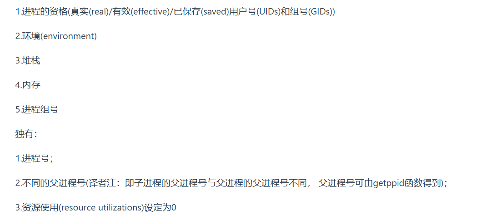

1. 内存是用于存放数据的硬件.程序执行前需要先放到内存中才能被`CPU`处理
2. 操作系统中的哲学家就餐问题:其实就是死锁问题.解决方法:
   * 每位哲学家必须同时拿起左右两根筷子
   * 只有在他的两个邻居都没有进餐的情况下才允许进餐
3. 几种典型锁:
   * 读写锁:多个读可以同时进行读;写必须互斥;写优于读
   * 互斥锁:一次只能一个线程拥有互斥锁,其它线程只有进入`sleep`状态等待.互斥锁是在抢锁失败的情况下主动放弃`CPU`进入睡眠状态直到锁的状态改变时再唤醒,互斥锁在加锁操作时涉及上下文的切换
   * 自旋锁:如果线程无法取得锁,线程不会立刻放弃`CPU`时间片,而是一直循环尝试获取锁,直到获取为止;如果别的线程长时期占有锁,那么自旋就是在浪费`CPU`做无用功,但是自旋锁一般应用于加锁时间很短的场景,这个时候效率比较高.自旋锁不会进入互斥锁中的`sleep`睡眠状态
4. `POSIX`线程锁:互斥锁、读写锁 、自旋锁
5. 怎么回收线程?
   * 等待线程结束:`int pthread_join(tid, retval)`:主线程调用,等待子线程退出并回收其资源,类似进程中的`wait()/waitpid()`回收进程
   * 结束线程:`void pthread_exit(void* retval)`:子线程执行,用于结束当前线程并通过`retavl`传递返回值
   * 分离线程:`int pthread_detach(pthread_t tid)`
6. 内存的覆盖是什么?
   由于程序运行时并非任何时候都要访问程序及数据各个部分,因此可以把用户空间分成为一个固定区和若干个覆盖区.将经常活跃的部分放在固定区(意思就是经常会被调用的部分),其余部分按照调用关系分段,首先将那些即将要访问的段放入覆盖区,其它段放在外存中,在需要调用前,系统将其调入覆盖区,替换覆盖区中原有的段.覆盖区的特点:是打破了必须将一个进程的全部信息装入内存后才能运行的限制,但当同时运行程序的代码量大于主存时仍不能运行,再而,内存中能够更新的地方只有覆盖区的段,不在覆盖区的段会常驻内存
7. 内存交换:内存空间紧张时,系统将内存中某些进程暂时换出外存,把外存中某些已具备运行条件的进程换入内存.换入:把准备好竞争`CPU`运行的程序从辅存移到内存;换出:把处于等待状态的程序从内存移到辅存,把内存空间腾出来
8. 什么时候会进行内存的交换?
   内存交换通常在许多进程运行且内存吃紧时进行(如:发现许多进程运行时经常发生缺页),而系统负荷降低就暂停
9. 终端退出,终端运行的进程会怎样?
    终端在退出时会发送`SIGHUP`给对应的`bash`进程,`bash`进程收到这个信号将它发给`session`下面的进程,如果程序没有对`SIGHUP`信号做特殊处理(如`nohup+&`),那么进程就会随着终端关闭而退出
10. 如何让进程后台运行?
    * 执行进程命令后加一个`&`,这样是将命令放入到一个作业队列中
    * `ctrl+z`挂起进程;`jobs`查看序号;`bg%序号`就能使进程后台运行了
    * `nohup+&`将标准输出和标准错误缺省会被重定向到`nohup.out`中,忽略所有挂断`SIGHUP`信号
    * 运行指令前+`setsid`,使其父进程变成`init`进程,不受`HUP`信号的影响
    * 将`命令+&`放在`()`中,也可以使进程不受`HUP`信号的影响
11. 快表:又称联想寄存器,是一种访问速度比内存快很多的高速缓冲存储器,用来存放当前访问的若干页表项,以加速地址变换的过程.与此对应,内存中的页表常称为慢表.快表就类似`Cache`缓存,快表会存放最近使用过的页表
    
12. 虚拟地址到物理地址的查表映射中,有快表和无快表有什么区别?
    
13. 在执行`malloc`申请内存时,操作系统是怎么做的?
    `malloc`函数主要是通过`brk()`、`mmap()`这两个系统调用实现的:当分配小于128k的内存时,使用`brk()`函数分配内存,将堆顶指针向高地址移动,获得新的内存空间,通过`brk()`方式申请的内存,`free`释放内存的时候,并不会把内存归还给操作系统,而是缓存在`malloc`的内存池中,待下次使用.分配大于128k的内存时,使用`mmap()`分配内存,利用私有匿名映射的方式,在文件映射区分配一块内存;通过`mmap()`方式申请的内存,`free`释放内存的时候,会把内存归还给操作系统,内存得到真正的释放
14. 守护进程:在后台运行的,没有控制终端与之相连的进程.它独立于控制终端,周期性地执行某种任务.`Linux`的大多数服务器就是用守护进程的方式实现的.创建守护进程的要点:
    
15. 如何避免僵尸进程?
    * 通过`signal(SIGCHLD,SIG_IGN)`通知内核对子进程的结束不关心,由内核回收.如果不想让父进程挂起(`wait/waitpid`),可以在父进程中加入一条语句:`signal(SIGCHLD,CIG_IGN)`表示父进程忽略`SIGCHLD`信号,从而让内核把僵尸子进程转交给`init`进程去处理,省去了大量僵尸进程占用系统资源
    * 父进程调用`wait/waitpid`
16. 局部性原理:时间局部性和空间局部性
    
17. 由`fork()`创建的新进程被称为子进程.该函数被调用一次,但返回两次.子进程中返回0,父进程中返回创建的子进程的`id`.子进程会从父进程拷贝继承:
    
18. 进程组就是多个进程的集合,其中有一个组长,其进程`pid`等于该进程组的`pgid`.只要在某个进程组中有一个进程存在,那么该进程组存在,这与组长进程是否终止无关
19. `shell`分前后台来控制的不是进程而是作业或者进程组.一个前台作业可以由多个进程组成,一个后台作业也可以由多个进程组成,`shell`可以运行一个前台作业和任意多个后台作业,这称为作业控制
20. 为什么只能运行一个前台作业?
    当我们在前台新起了一个作业,`shell`就被提到了后台,因此`shell`就没有办法再继续接受我们的指令并解析运行了;但是如果前台进程退出了,`shell`就会又被提到前台来,就可以继续接受进程并运行了
21. 会话(`seesion`)是一个或多个进程组的集合.一个会话可以有一个控制终端
22. 进程终止的方法
    * `main`函数的自然返回
    * 调用`exit`函数,属于`C`的函数库,用户空间的调用
    * 调用`_exit`函数,属于系统调用,即内核调用
    * 调用`abort`函数,异常程序终止
    * `ctrl+c`、`SIGINT`等信号
23. `Linux`中异常和中断:
    中断:大多数是由硬件设备产生的,其由`CPU`发送给内核
    
    异常:异常由`CPU`产生,同时它会发送给内核,要求内核处理这些异常(`CPU`处理程序时,一旦发现程序不在内存中,`CPU`会发生缺页异常)
    
    中断和异常的相同点:
    * 最后都是由`CPU`发送给内核,由内核去处理
    * 处理程序的流程设计是相似的
    中断和异常的不同点:
    * 产生源不同,异常由`CPU`产生,中断主要由硬件设备产生
    * 内核需要根据是异常还是中断调用不同的回调处理程序
    * 中断不是时钟同步的,这意味着中断可能随时到来;异常由`CPU`产生,它是时钟同步的
    * 当处理中断时,处于中断上下文中;处理异常时,处于进程上下文中
24. `Linux`中查看端口占用情况:
    * `netstat`:如`netstat -anp | grep 进程号`:查询进程号所对应的进程所占用的端口
    * `lsof`可以查看打开的文件和端口:`lsof -i : <port>`
25. `Linux`中怎么解决端口冲突:
    * 先通过`lsof`查看占用端口的进程`ID`(`pidof 进程名`也可以查看进程id):`lsof`会列出所有打开的文件和对应的进程id
    * 利用`kill -9 pid`来终止该进程,然后就解决了端口冲突了;如果是关键进程服务,那么就只能更改该服务的端口号,即找到服务的配置文件,然后修改端口号
26. `Linux`中的`grep`命令主要用于过滤文本内容,它通过模式匹配(通常是正则表达式)来筛选出符合特定条件的行或内容,如`ps aux | grep redis`:过滤当前系统中与`redis`相关的进程
27. 内核空间主要管理传输层、网络层、数据链路层和物理层,但它也通过系统调用接口(如套接字API)为应用层提供服务,尽管应用层本身运行在用户空间,但其网络功能依赖于内核空间的管理
28. 操作系统是一个完整的系统，包括内核、用户空间程序、系统工具和库等。内核是操作系统的核心部分，负责管理硬件资源和提供基本的系统服务，而用户空间程序则是运行在操作系统上的应用程序和服务。内核和用户空间程序共同协作，确保操作系统的功能和稳定性。因此操作系统既包括应用层,又包括下面几层

