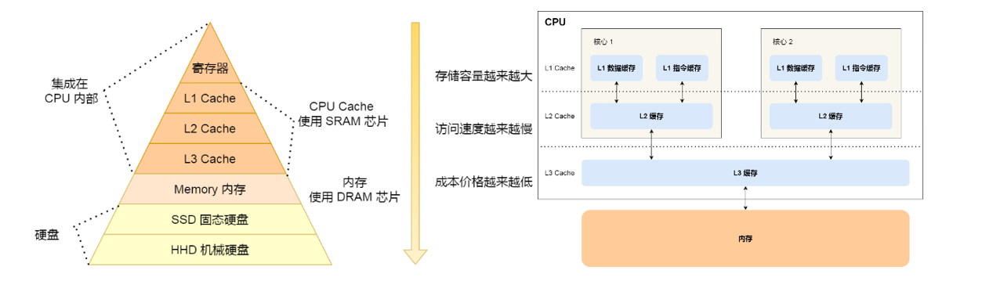
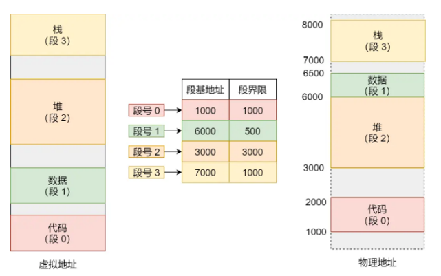
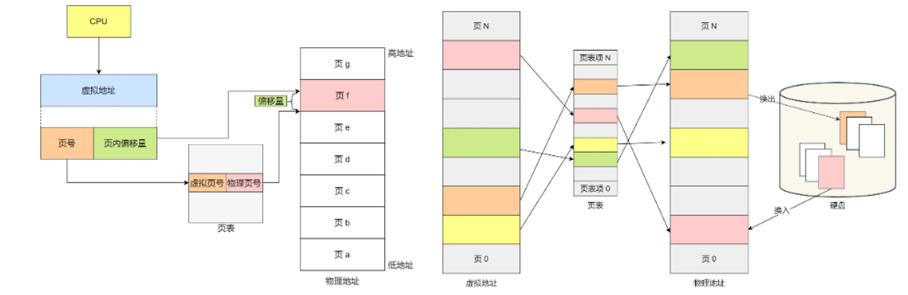
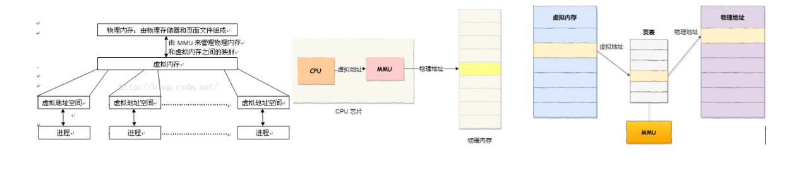
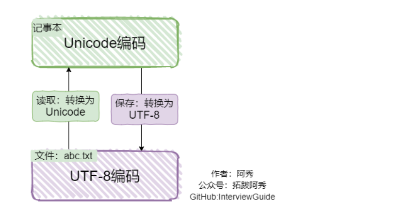
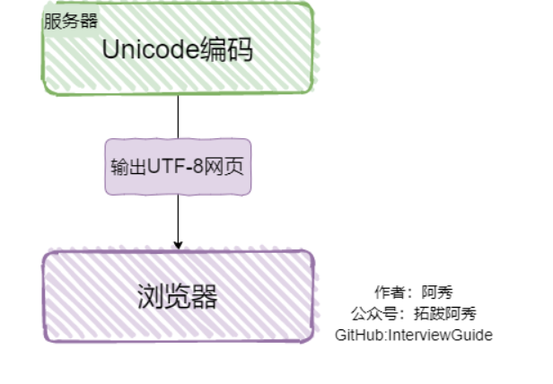

1. 线程池主要解决两个问题:线程创建与销毁的开销以及线程竞争造成的性能瓶颈.通过预先创建一组线程并复用它们,线程池有效地降低了线程创建和销毁的时间和资源消耗.同时,通过管理线程并发数量,线程池有助于减少线程之间的竞争,增加资源利用率,并提高程序运行的性能
2. 操作系统的存储器级别
   
3. `Windows`和`Linux`下用户空间内存分布情况:
   * 代码段`.txt`
   * 已初始化的数据`.data`
   * 未初始化的数据`.bss`
   * 堆段
   * 文件映射段,包括动态库、共享内存等
   * 栈段
4. 一个由`C/C++`编译的程序占用的内存分为哪几个部分
   * 栈区:地址向下增长,由编译器自动分配释放,存放函数的参数值,局部变量的值等
   * 堆区:地址向上增长,一般由程序员分配释放
   * 全局区:全局变量和静态变量的存储是放在一起的(`.data`段),初始化的全局变量和静态变量在一块区域(`.bss`段),未初始化的全局变量和未初始化的静态变量在相邻的另一块区域
   * 文字常量区:常量字符串存储在这
   * 代码区:存放函数体的二进制代码
5. 在进行动态内存分配时,操作系统会在硬盘中创建或申请一段虚拟内存空间,并更新到页表(这是一个存放在物理内存中的数据结构,它记录了虚拟页和物理页的映射关系)
6. 读写一个磁盘块的时间的影响因素
   * 旋转时间:主轴转动盘面,使得磁头移动到适当的扇区上
   * 寻道时间:制动手臂移动,使得磁头移动到适当的磁道上(寻道时间:磁头从一个磁道移动到另一个磁道所需的时间,通常为几毫秒到十几毫秒)
   * 实际的数据传输时间
7. 常见的磁盘调度算法:
   * 先来先服务
   * 最短寻道时间优先
   * 电梯扫描算法
8. 交换空间:`Linux`中的交换空间在物理主存(`RAM`)被充满时被使用.如果系统需要更多的内存资源,而物理内存已经充满,内存中不活跃的页就会被移到交换空间去.交换空间位于硬盘驱动器上,它比进入物理内存要慢.交换空间的总大小=max(计算机内存的两倍,32MB),不能超过2GB
9. 虚拟内存:虚拟内存在每⼀个进程创建加载的过程中，会分配⼀个连续虚拟地址空间，它不是真实存在的，⽽是通过映射与实际地址空间对应，这样就可以使每个进程看起来都有⾃⼰独⽴的连续地址空间，并允许程序访问⽐物理内存 RAM 更⼤的地址空间, 每个程序都可以认为它拥有⾜够的内存来运⾏。即程序所使用的内存地址叫做虚拟内存地址，实际存在硬件里面的空间地址叫物理内存地址。操作系统引入了虚拟内存，进程持有的虚拟地址会通过 CPU 芯片中的内存管理单元（MMU）的映射关系，来转换变成物理地址，然后再通过物理地址访问内存。操作系统管理虚拟地址与物理地址之间关系主要有两种方式，分别是内存分段和内存分页
    * 内存分段:虚拟地址是通过段表与物理地址进行映射的，分段机制会把程序的虚拟地址分成 4 个段，每个段在段表中有一个项，在这一项找到段的基地址，再加上偏移量，于是就能找到物理内存中的地址。分段的办法很好，解决程序本身不需要关心具体物理内存地址问题，不足是内存碎片（内部内存碎片和外部内存碎片）与内存交换效率低问题
     
    * 内存分页:为了解决内存分段的外部内存碎片和内存交换效率低的问题，就出现了内
存分页。分页是把整个虚拟和物理内存空间切成一段段固定尺寸的大小。这样一个连续并且尺寸固定的内存空间，我们叫页。在 Linux 下，每一页的大小为 4KB。采用了分页，页与页之间是紧密排列的，所以不会有外部碎片。但是，因为内存分页机制分配内存的最小单位是一页，即使程序不足一页大小，我们最少只能分配一个页，所以页内会出现内存浪费，所以针对内存分页机制会有内部内存碎片的现象。如果内存空间不够，操作系统会把其他正在运行的进程中的最近没被使用的内存页面给释放掉，也就是暂时写在硬盘上，称为换出。一旦需要的时候，再加载进来，称为换入。所以，一次性写入磁盘的也只有少数的一个页或者几个页，不会花太多时间，内存交换效率相对较高。内存地址转换三个步骤：把虚拟内存地址，切分成页号和偏移量；根据页号，从页表里面，查询对应的物理页号；直接拿物理页号，加上前面的偏移量，就得到了物理内存地址。但是这样简单的分页有有空间上缺陷，因为操作系统是可以同时运行非常多的进程的，那这就意味着页表会非常庞大，需要采用多级页表（Multi-Level Page Table）解决方案
    
    
10. 内部碎片:已经被分配出去(能明确指出属于哪个进程),由于被装入的数据块小于分区大小,从而导致分区内部有空间浪费,这种现象成为内部碎片(因为所有的内存分配必须起始于可被 4、8 或 16 整除（视处理器体系结构而定）的地址或者因为MMU的分页机制的限制，决定内存分配算法仅能把预定大小的内存块分配给客户。假设当某个客户请求一个43字节的内存块时，因为没有适合大小的内存，所以它可能会获得 44字节、48字节等稍大一点的字节，因此由所需大小四舍五入而产生的多余空间就叫内部碎片);外部碎片:指出于任何已分配区域或页面外部的空闲存储块.这些存储块的总和可以满足当前申请的长度要求,但是由于它们的地址不连续或其他原因,使得系统无法满足当前申请.频繁的分配与回收物理页面会导致大量的、连续且小的页面块夹杂在已分配的页面中间,就会产生外部碎片(假设有一块一共有100个单位的连续空闲内存空间，范围是0~99。如果你从中申请一块内存，如10个单位，那么申请出来的内存块就为0~9区间。这时候你继续申请一块内存，比如说5个单位大，第二块得到的内存块就应该为10~14区间。如果你把第一块内存块释放，然后再申请一块大于10个单位的内存块，比如说20个单位。因为刚被释放的内存块不能满足新的请求，所以只能从15开始分配出20个单位的内存块。现在整个内存空间的状态是0~9空闲，10~14被占用，15~24被占用，25~99空闲。其中0~9就是一个内存碎片了。如果10~14一直被占用，而以后申请的空间都大于10个单位，那么0~9就永远用不上了，变成外部碎片)
11. 从堆和栈上建立对象哪个快?
    * 堆在分配和释放都要调用函数`new/delete`,会花费一定的时间,而栈不需要这样
    * 访问堆的一个具体单元,需要两次访问内存,第一次取得指针,第二次才是真正的数据,而栈只需要一次.另外,堆的内容被操作系统交换到外存的概率比栈大,栈一般是不会被交换出去
12. 常见的内存分配方式
    * 从静态存储区分配:内存在程序编译的时候就已经分配好,这块内存在程序的整个运行期都存在,如:全局变量、`static`变量
    * 在栈上创建
    * 在堆上分配
13. 内存交换中,被换出的进程保存在磁盘中的对换区.通常把磁盘空间分为文件区和对换区两部分,文件区主要用于存放文件,主要追求存储空间的利用率,因此堆文件区空间的管理采用离散分配方式;对换区空间只占磁盘空间的小部分,被换出的进程数据就存放在对换区.对换区的IO速度比文件区的更快
14. 在发生内存交换时:可以优先换出阻塞进程;可以换出优先级低的进程
15. `Unicode`:它是一个字符编码标志,旨在为全球所有的文字、符号和字符提供统一的编码方案.它只是一个符号集,定义了每个字符的唯一代码点,但没有规定具体的编码实现方式.现在计算机系统通用的字符编码工作方式:
    * 在计算机内存中,统一使用`Unicode`编码,当需要保存到硬盘或需要传输的时候,就转换为`UTF-8`编码
    * 用记事本编辑的时候,从文件读取的`UTF-8`字符被转换为`Unicode`字符到内存中,编辑完成后,保存的时候再把`Unicode`转换为`UTF-8`保存到文件
    
    * 浏览网页的时候,服务器会把动态生成的`Unicode`内容转换为`UTF-8`再传输到浏览器
    
16. 系统的并发和并行
    * 并发:指的是宏观上在一段时间内能同时运行多个程序
    * 并行:指同一时刻能运行多个指令
17. 页面置换算法有哪些(置换(淘汰)的是物理页,然后新的物理页跟虚拟页映射):
    * 最佳置换法:该算法根据未来的⻚⾯访问情况，选择最⻓时间内不会被访问到的⻚⾯进⾏置换。那么就有⼀个问题了，未来要访问什么⻚⾯，操作系统怎么知道的呢?操作系统当然不会知道，所以这种算法只是⼀种理想情况下的置换算法，通常是⽆法实现的
    * 先进先出置换算法(FIFO):优先淘汰最先进入内存的页面;实现简单,性能很差,可能出现`Belady`异常
    * 最近最旧未使用置换算法(LRU):RU算法基于⻚⾯的使⽤历史，通过选择最⻓时间未被使⽤的⻚⾯进⾏置换
    * 时钟置换算法:(Clock算法的核⼼思想是通过使⽤⼀个指针(称为时钟指针)在环形链表上遍历，检查⻚⾯是否被访问过。这个访问过同样需要我们上⾯说到的访问字段来表示，此时访问字段只有⼀位。每个⻚⾯都与⼀个访问位相关联，标记该⻚⾯是否被访问过。当需要进⾏⻚⾯置换时，Clock算法从时钟指针的位置开始遍历环形链表。 如果当前⻚⾯的访问位为0，表示该⻚⾯最久未被访问，可以选择进⾏置换。将访问位设置为1，继续遍历下⼀个⻚⾯。 如果当前⻚⾯的访问位为1，表示该⻚⾯最近被访问过，它仍然处于活跃状态。将访问位设置为0，并继续遍历下⼀个⻚⾯如果遍历过程中找到⼀个访问位为0的⻚⾯，那么选择该⻚⾯进⾏置换)循环扫描各页面,第一轮淘汰访问位=0的,并将扫描过的页面访问位改为1.若第一轮没选中,则进行第二轮扫描;实现简单,算法开销小,但未考虑页面是否被修改过
    * 改进型的时钟置换算法:简单的时钟置换算法仅考虑到一个页面最近是否被访问过.事实上,如果被淘汰的页面没有被修改过,就不需要执行IO操作写回外存,因此就算加了一个修改位,变成了(访问位,修改位);
18. 死锁:两个或多个进程在争夺系统资源时，由于互相等待对⽅释放资源⽽⽆法继续执⾏的状态.如:当两个线程按不同顺序请求锁,就很可能陷入死锁:线程1先获取`lockA`,然后尝试获取`lockB`;线程2先获取`lockB`,然后尝试获取`lockA`;两个线程都持有一个锁,然后同时等待对方释放另一个锁,就造成了死锁
19. 死锁的必要条件:
    * 互斥条件：⼀个进程占⽤了某个资源时，其他进程⽆法同时占⽤该资源
    * 不可剥夺条件：资源不能被强制性地从⼀个进程中剥夺，只能由持有者⾃愿释放
    * 请求与保持条件：⼀个线程因为请求资源⽽阻塞的时候，不会释放⾃⼰的资源
    * 循环等待条件：多个进程之间形成⼀个循环等待资源的链，每个进程都在等待下⼀个进程所占有的资源
20. 死锁的处理方法:
    * 鸵鸟策略:就是忽略死锁
    * 死锁检测与死锁恢复:利用抢占恢复;利用回滚恢复;通过杀死进程恢复
    * 死锁预防:破坏死锁的必要条件进行预防
    * 死锁避免:资源有序分配法:按照固定的顺序获取锁;设置超时时间;死锁排查:
        - 使用工具:(`java`中通过`jdk`工具`jps、jstack、jconsole`);
        - 分析日志:可以分析系统日志和线程日志,查看是否有线程在等到某个锁,从而找出可能导致死锁的原因
        - 代码检查
21. 操作系统中分段式存储管理有外部碎片而无内部碎片,而固定的分页式存储管理有内部碎片而无外部碎片:分段式存储管理中，每个段的大小通常是固定的,当一个进程需要的内存小于段的大小时，操作系统会分配一个完整的段给该进程，导致段内未被使用的部分成为内部碎片;分段式存储管理允许每个段独立分配和管理，这意味着内存可以被分割成多个大小不一的段，而不需要像分页式存储管理那样需要连续的物理内存块。因此，分段式存储管理不会产生外部碎片
