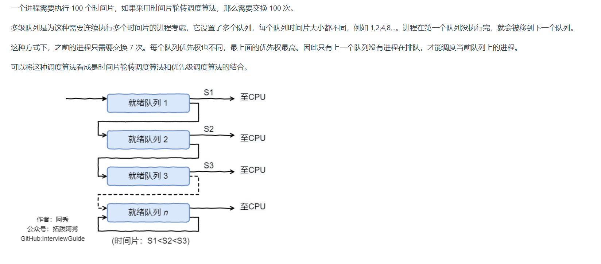
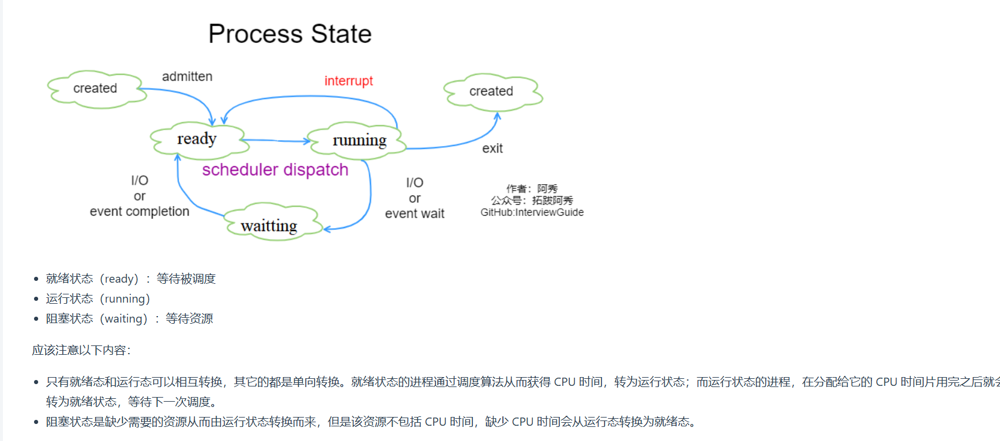
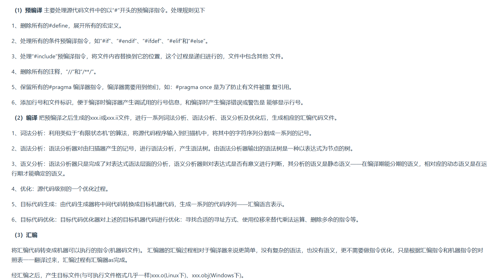
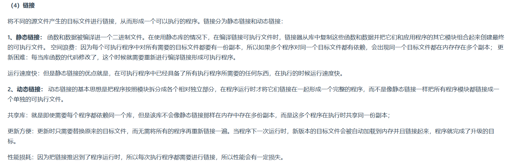
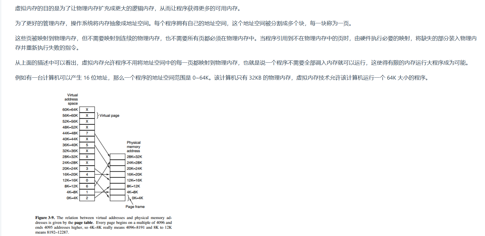

1. 进程是资源分配的基本单位,运行一个可执行程序会创建一个或多个进程,进程就是运行起来的可执行程序
2. 线程是资源调度的基本单位,也是程序执行的基本单位,是轻量级的进程.每个进程中都有唯一的主线程,且只能有一个,主线程和进程是相互依存的关系,主线程结束进程也会结束
3. 协程是用户态的轻量级线程,线程内部调度的基本单位
4. 同一个线程共享的有堆、全局变量、静态变量、指针、引用、文件等,而独自占有栈
5. 子进程创建后会拷贝父进程的代码段、堆栈段、数据段.实际上在父进程创建子进程后,父子进程除了`pid`外,几乎所有的部分一样.父子进程共享全部数据,但不是说它们对同一块数据进行操作,子进程在读写数据时会通过`copy-on-write`机制将公共的数据重新拷贝一份,之后在拷贝出的数据上进行操作
6. `copy-on-write`机制:核心思想是延迟数据的实际复制操作,直到数据被修改时才会进行复制(类似`Redis`中的惰性过期策略)
7. 每个进程都有各自的虚拟地址到物理地址的映射表,每个进程都有自己的虚拟地址空间
8. 进程结构由以下几部分组成:代码段、堆栈段、数据段
9. 对于32位进程来说,`0xC0000000-0xFFFFFFFF`是内核空间地址,`0x00000000-0xC0000000`是用户空间地址
10. 一次完整的上下文切换通常是进程原先运行于用户态,之后因系统调用或时间片切换到内核态执行内核指令,完成上下文切换后回到用户态,此时已经切换到进程B
11. 系统调用会导致用户态到内核态的切换
12. 用户态使用内核函数的话就会触发系统调用
13. 进程(线程)调度算法（抢占式更通用）
   * FCFS:先来先服务,非抢占式的调度算法,按照请求的顺序进行调度
   * SJF:短作业优先,非抢占式的调度算法,按估计运行实际最短的顺序进行调度
   * SRTN:最短剩余时间优先,最短作业优先的抢占式版本,按剩余运行时间的顺序进行调度
   * 时间片轮转:将所有就绪进程按FCFS的原则排成一个队列,每次调度时,把`CPU`时间分配给队首进程,该进程可以执行一个时间片.当时间片用完时,由计时器发出时钟中断,调度程序便停止执行该进程的执行,并将它送往就绪队列的末尾(就算没执行完也会强制停止),同时继续把`CPU`时间分配给队首的进程，抢占式
   * 优先级调度:为每个进程分配一个优先级,按优先级进行调度，抢占式
   * 多级反馈队列，抢占式
     
14. 线程(进程切换)的场景:
    * 时间片用完:在一个多任务操作系统中，每个线程被分配了一定的时间片来使用 CPU 资源。当一个线程的时间片用完时，即使它还没有完成任务，操作系统也会强制进行线程切换，将 CPU 执行权交给其他等待的线程。例如，在一个典型的分时操作系统环境下，多个用户同时运行多个应用程序，每个应用程序可能包含多个线程。操作系统会公平地分配时间片给每个线程，当一个线程的时间片耗尽时，就切换到其他线程，以保证所有线程都有机会执行，提高系统的整体吞吐量
    * 线程等待事件:当一个线程在等待某个事件发生时，如等待 I/O 操作完成、等待锁的释放、等待信号量等，它会进入等待状态。此时，操作系统会将 CPU 执行权交给其他可以运行的线程，如果没有可运行的其它线程，操作系统会把它挂起，而不会继续跑那个阻塞的线程。例如，在一个文件读取操作中，线程发起读取磁盘文件的请求后，会等待数据从磁盘传输到内存。由于 I/O 操作通常比较耗时，线程在这个等待期间不能做其他有用的工作，所以操作系统会进行线程切换，让其他线程利用这段时间来执行。当等待的事件发生后，操作系统会将线程从等待状态恢复到就绪状态，等待下一次 CPU 时间片
    * 线程优先级变化:操作系统会根据线程的优先级来决定线程的调度顺序。如果一个高优先级线程就绪（可以执行），操作系统可能会抢占当前低优先级线程的 CPU 资源，进行线程切换。例如，在一个实时系统中，处理紧急任务的高优先级线程需要及时得到 CPU 资源来保证任务的及时性。当这样的高优先级线程出现时，操作系统会立即进行线程切换，让高优先级线程先执行。这种机制可以确保关键任务能够及时得到处理，满足实时性要求
15. `Linux`下线程间通信方式:
    * 信号量
    * 锁机制:互斥锁、读写锁和自旋锁
    * 条件变量
16. `Linux`下线程间同步方式:
    * 互斥锁
    * 读写锁
    * 条件变量
    * 信号量
    * 原子操作
17. 互斥：一个时刻只能有一个进程或线程访问某个共享资源，当一个进程使用共享资源时，其它进程不能同时访问该资源；同步：指多个并发进程/线程之间协调和管理它们的执行顺序，以确保它们按照一定的顺序执行，而不是以一种不确定的顺序运行
18. `Linux`下进程间通信方式:
    * 管道
    * 共享内存
    * 消息队列
    * 信号量(在进程间传递控制信息(是否还有资源可以使用))
    * 套接字socket
    * 信号
19. 操作系统中的锁资源：互斥锁、读写锁、自旋锁、递归锁(可以对一个线程多次加锁,而不会死锁)
20. 进程没有像线程那样用互斥锁来保证共享资源线程安全的锁,而进程中有两种锁:
    * 文件锁:文件锁利用文件系统来实现锁机制.一个进程对文件加锁后,其他进程无法对该文件进行相同类型的锁定操作.文件锁包括独占锁和共享锁两种类型.独占锁用于写操作,同一时间只能由一个进程获取;共享锁用于读操作,允许多个进程同时获取
    * 信号量:信号量是一种计数器,用于控制同时访问特定资源的进程数量
21. `Linux`下同步机制:
    * 信号量:可用于进程同步,也可用于线程同步
    * 互斥锁+条件变量:只能用于线程同步
22. 内存交换技术主要是在不同进程之间进行,而覆盖则用于同一程序或进程中
23. 内存分配算法
    * 动态内存分配算法
    * 伙伴算法:伙伴算法是一种非常经典的内存分配算法，它采用了分离适配的设计思想，将物理内存按照 2 的次幂进行划分，内存分配时也是按照 2 的次幂大小进行按需分配，例如 4KB、 8KB、16KB 等。假设我们请求分配的内存大小为 10KB，那么会按照 16KB 分配
    * Slab算法
24. 动态内存分配算法:
    * 首次适应算法(最好):每次从低地址开始查找,找到第一个能满足大小的空闲分区
    * 最佳适应算法:由于动态分区分配是一种连续分配方式,为各进程分配的空间必须是连续的一整片区域.因此为了保证当"大进程"到来时能有连续的大片空间,可以尽可能多地留下大片的空闲区,即优先使用更小的空闲区
    * 最坏适应算法:与最佳适应算法相反,即优先使用更大的空闲区
    * 邻近适应算法:首次适应算法每次都从链头开始查找,这可能会导致低地址部分出现很多小的空闲分区,而每次分配查找时,都要经过这些分区,因此也增加了查找的开销.如果每次都从上次查找结束的位置开始检索,就能解决此问题
25. 进程状态的切换:就绪状态、运行状态、阻塞状态
    
26. 一个`C/C++`程序从开始编译到生成可执行文件的完整过程:
    
    
    静态链接的程序在程序运行前已经把库代码“打包”进可执行文件，运行时不需要额外加载和解析库函数，因此更快；而动态链接的程序在运行时还要加载共享库、解析符号地址，带来额外开销
27. 进程同步:信号量、消息传递(用receive、send实现的，一个进程以消息的形式给另一个指定的目标进程发送消息，receive和send是阻塞的，来保证同步)、管程(编译器保证只有一个进程在管程内活动)
28. 进程和线程的区别?什么时候用多线程,什么时候用多进程?
    进程是操作系统资源分配的基本单位,每个进程有各自的虚拟内存、文件描述符表、环境变量、信号处理表等,使用进程的目的是提供隔离的执行环境(一个进程宕机不会影响其它进程);线程是`cpu`调度的基本单位,每个线程有独立的线程`id`、程序计数器、寄存器集合、栈空间等,而同一进程内的线程共享进程的资源,使用线程的目的是快速切换执行流且切换开销尽可能小(因为它很多共享资源不用切换).`C++`线程崩溃可能导致整个进程终止.进程侧重点是隔离性,线程侧重点是切换效率高(并发性高)
29. 操作系统在对内存进行管理的时候需要:
    * 负责内存空间的分配与回收
    * 需要提供某种技术从逻辑上对内存空间进行扩充(虚拟内存)
    * 提供地址转换功能,负责程序的逻辑地址与物理地址的转换
    * 提供内存保护功能,保证各进程在各自存储空间内运行,互不干扰
30. 虚拟内存的目的:为了让物理内存扩充成更大的逻辑内存,从而让程序获得更多的可用内存.为了更好的管理内存,操作系统将内存抽象成地址空间.每个程序(进程)拥有自己的地址空间,这个地址空间被分割成多个块,每一块称为一页(物理页、虚拟页).这些页被映射到物理内存,但不需要映射到连续的物理内存,也不需要所有页都必须在物理内存中.当程序引用到不在物理内存中的页时,由硬件执行必要的映射(通过页表寄存器),然后将缺失的部分装入物理内存并重新执行失败的指令
    
31. 虚拟内存使用了空分复用技术,它将物理内存抽象为地址空间,每个进程都有各自的地址空间.地址空间的页被映射到物理内存,地址空间的页并不需要全部在物理内存中,当使用到一个没有在物理内存的页时(缺页中断),就执行页面置换算法,将该页置换到内存中
32. 锁竞争为什么会使性能不好？(前面两点是锁为什么会使性能不好的原因)
    * 串行化：锁的本质是强制将原本可以并行的代码串行化，浪费了多核处理器的并行能力
    * 等待和空转：当一个线程去获取锁资源时发现锁已被持有时，此时对于自旋锁会一直去循环重试；而对于互斥锁就会进入等待状态，也就是会放弃cpu，让操作系统去调度其它就绪的线程
    * 会带来上下文切换：当获取不到锁资源，此时等待锁的线程就会放弃cpu，就很可能会导致线程的上下文切换，这一步有很大的开销
                                                                       