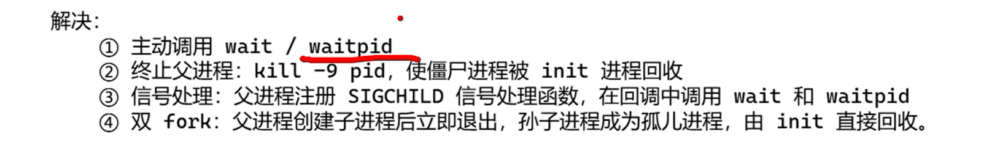

1. 孤儿进程和僵尸进程
   孤儿进程:当父进程提前终止,而其子进程仍在运行时,这些子进程会失去父进程的监管,成为孤儿进程.此时系统将孤儿进程的父进程设置为`init`进程(`pid=1`),由`init`进程负责在其结束后回收资源.孤儿进程通常是无害的,`init`进程会接管并回收它.
   僵尸进程:子进程已终止,但其父进程未通过`wait()/waitpid()`回收其退出状态,导致进程表中仍保留其`PCB`,占用系统资源,此时进程状态为`Z`.僵尸进程危害:僵尸进程会造成资源泄漏,僵尸进程的`PCB`长期占用进程表,可能导致系统无法创建新进程(进程`id`耗尽),同时大量僵尸进程会拖慢系统.僵尸进程的解决方法:
   
2. `recv`什么错误返回值是可以接受的?
   `recv`正常情况下会返回正数(返回的是接收到的字节数);接收到0表示对端关闭;接收到负数表示出现了在全局变量`errno`中包含具体错误类型:可接受错误:1.`EAGAIN`或`EWOULDBLOCK`:表示在非阻塞模式下,当前接收缓冲区无数据可读,那么会等待下次可读事件,无需关闭连接;2.`EINTR`:系统调用被信号(如`SIGINT`)中断,那么会重新调用`recv`,无需关闭连接.其它错误类型需要关闭连接,即是不可接受的
   