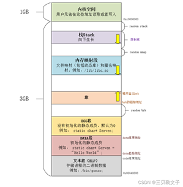
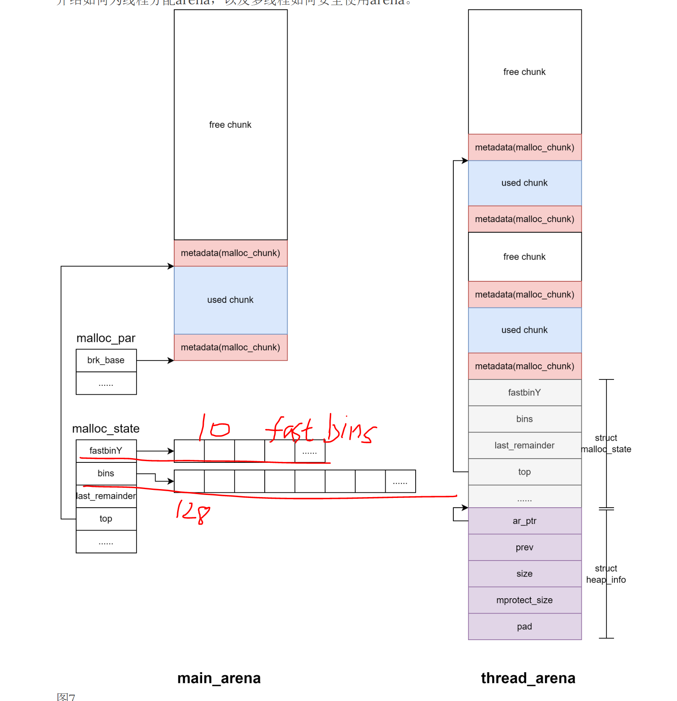
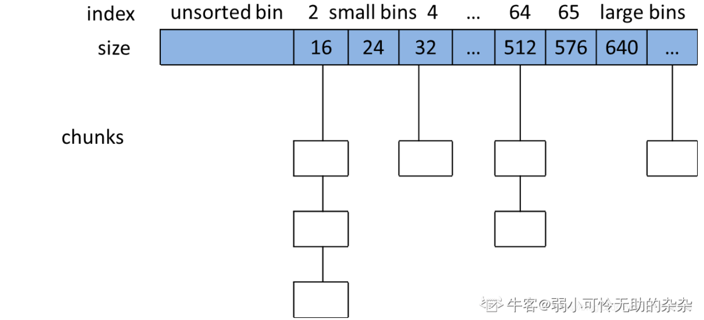
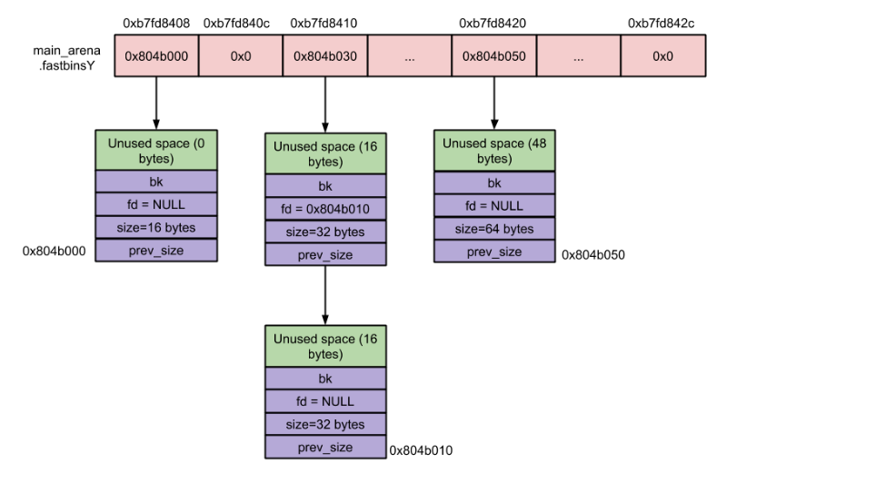
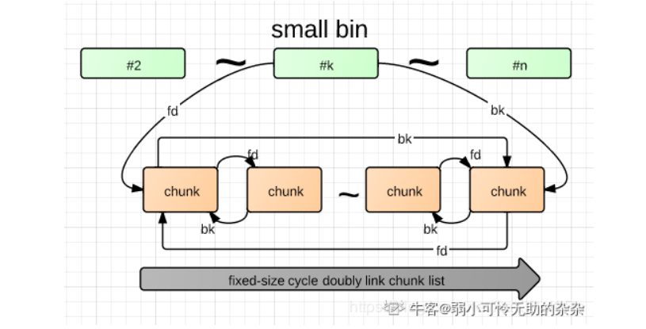
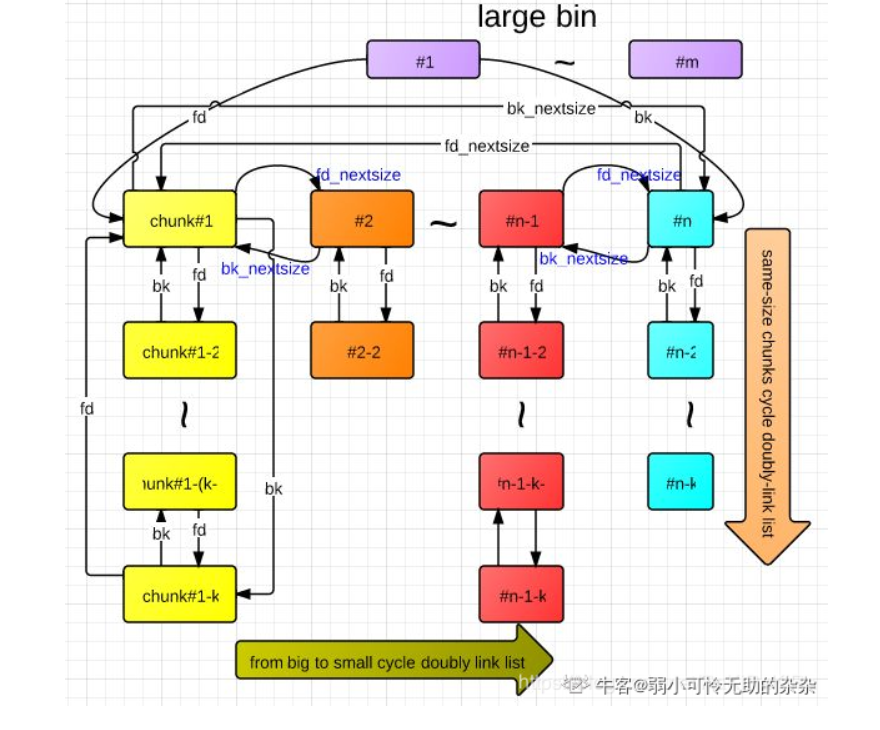
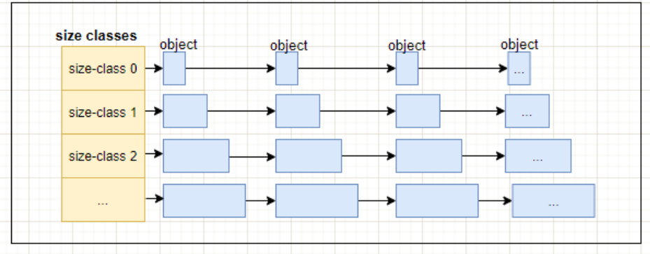
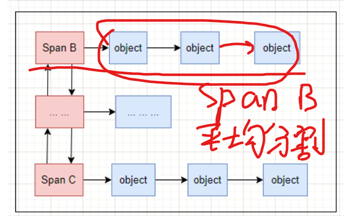

1. `malloc/free`是内存分配器里的一组函数,而`Linux`默认的内存分配器是`ptmalloc`
2. 为什么需要内存分配器?
   * 抽象和简化内存管理:内存分配器为程序员提供了一个抽象层
   * 改善外部碎片和内部碎片问题:通过合并解决外部碎片,通过划分不同大小的块解决内部碎片
   * 支持并发和多线程:内存分配器需要设计为线程安全,从而允许多个线程同时进行内存分配和释放,而无需程序员手动处理同步问题
   * 提高内存使用率:通过跟踪内存块的不同大小,来避免内存浪费;并且释放后的内存块可以重新分配给其他需要内存的部分,即内存复用,因此提高内存使用率
3. 在执行`malloc`申请内存时,操作系统是怎么做的?
    `malloc`函数主要是通过`brk()`、`mmap()`这两个系统调用实现的:当分配小于128k的内存时,使用`brk()`函数分配内存,将堆顶指针向高地址移动,获得新的内存空间,通过`brk()`方式申请的内存,`free`释放内存的时候,并不会把内存归还给操作系统,而是缓存在`malloc`的内存池中,待下次使用.分配大于128k的内存时,使用`mmap()`分配内存,利用私有匿名映射的方式,在文件映射区分配一块内存;通过`mmap()`方式申请的内存,`free`释放内存的时候,会把内存归还给操作系统,内存得到真正的释放
    
4. 缺页中断(是异常不是中断):指的是当软件试图访问已映射在虚拟地址空间中,但是目前并未加载在物理内存中的一个分页时,由CPU的内存管理单元所发出的中断(缺页中断发生在程序试图访问一个不在物理内存(RAM)中的虚拟内存页面时.当这种情况发生时,操作系统会暂停当前程序的执行,并触发一个中断,以处理这个缺页事件,即根据页面置换算法将一个物理页调出到磁盘的对换区)(缺页中断:在将虚拟地址转换为物理地址时发现目标页不在物理内存而触发的一种异常)
5. 为什么不全部使用`mmap`来分配内存？
   * 系统调用+缺页中断：向操作系统申请内存，是要通过系统调用的，执行系统调用是要进入内核态的，然后再回到用户态，切换会耗费不少时间，如果都用 mmap 来分配内存，等于每次都要执行系统调用；mmap 分配的内存每次释放的时候，都会归还给操作系统，于是每次 mmap 分配的虚拟地址都是缺页状态的，然后在第一次访问该虚拟地址的时候，就会触发缺页中断。 频繁通过 mmap 分配内存的话，不仅每次都会发生系统调用，还会发生缺页中断（在第一次访问虚拟地址后），这样会导致 CPU 消耗较大。
   * 池化管理：malloc 通过 brk() 系统调用在堆空间申请内存的时候，由于堆空间是连续的，所以直接预分配更大的内存来作为内存池，当内存释放的时候，就缓存在内存池中。等下次在申请内存的时候，就直接从内存池取出对应的内存块就行了，而且可能这个内存块的虚拟地址与物理地址的映射关系还存在，这样不仅减少了系统调用的次数，也减少了缺页中断的次数，这将大大降低 CPU 的消耗
6. 为什么不全部使用 brk 来分配？（brk频繁调用有什么问题）
   碎片问题：通过 brk 从堆空间分配的内存，并不会归还给操作系统，对于小块内存，堆内将产生越来越多不可用的碎片，导致“内存泄露”。malloc 实现中，充分考虑了 brk 和 mmap 行为上的差异及优缺点，默认分配大块内存 (128KB) 才使用 mmap 分配内存空间
7. 如何优化brk减少频繁系统调用？
   内存管理的核心目标主要有两点：高效的内存分配和回收，提升单线程或者多线程场景下的性能；减少内存碎片，包括内部碎片和外部碎片，提高内存的有效利用率。因此可以从这两方面对brk进行优化。1）内存分配回收：针对内存分配和回收问题，可以采用类似tcmalloc的机制，为每个线程分配一个局部缓存，对于小对象的分配，可以直接由线程局部缓存来完成；2）内存碎片：对于内存碎片问题，采用类似jemalloc的思想，将内存分配粒度划分为 Small、Large二个分类进行减少碎片
8. `ptmalloc`:`glibc`默认分配器.`malloc`采用的是内存池的管理方式,`ptmalloc`采用边界标记法将内存划分成很多块(一个个`chunk`),从而对内存的分配与回收进行管理
      - 分配区:分配区是`ptmalloc`管理内存的核心结构,它将内存划分为多个区域进行管理,每个分配区都有自己的`bins`链表,每个`arena`分配区包含了`fast bins`、`small bins`、`large bins`、`unsorted bins`、`top chunk`、`mmaped chunk`、`last remainder chunk`.可以独立地进行内存分配和释放操作,从而提高内存管理的效率和并发性能
         * 为了解决多线程锁竞争问题,分为主分配区和非主分配区,主分配区使用`brk`扩展堆,非主分配区使用`mmap`
         * 主分配区和非主分配区用一个环形链表管理
         * 每一个分配区利用互斥锁使线程对于该分配区的访问互斥
         * 每个进程只有一个主分配区,可以有多个非主分配区
         * 理想状态下是一个线程独占一个`arena`分配区,其中主分配区一定被主线程占用,其他线程则占用非主分配区,但是实际上,线程和`arena`分配区不是一一对应的,一个`arena`分配区被多条线程占用是常见的.因此,`malloc`分配和释放时需要加锁
         * 分配区的起始地址在`malloc_par`变量的`brk_base`中指出,其中指出`fast bins`不存在`bins`数组中,而是在分配区的`malloc_state`结构体静态变量中的`fastbinY`指针指向的内存
          `meta_data`就是保存的一些分配区的信息的字段,如大小等
      - `chunk`内存块:所有分配的内存以`chunk`形式管理,包含元数据和用户数据
      - 空闲链表`bins`(`bins`链表位于主(非主)分配区中):当用户使用`free`函数释放掉的内存,`ptmalloc`并不会马上交还给操作系统,而是被`ptmalloc`本身的空闲链表`bins`管理起来了,这样当下次进程需要`malloc`一块内存的时候,`ptmalloc`就会从空闲的`bins`上寻找一块合适大小的内存块分配给用户使用.这样的好处可以避免频繁的系统调用，降低内存分配的开销.`malloc`将相似大小的`chunk`用双向链表链接起来,这样一个链表被称为一个`bin`.`ptmalloc`一共维护了128bin.每个`bins`都维护了大小相近的单向/双向链表的`chunk`.(这个数组可以看作哈希表)基于`chunk`的大小,可以分为:
          
         * `fast bins`:程序在运行时会经常需要申请和释放一些较小的内存空间.当分配器合并了相邻的几个小的`chunk`之后,也许马上就会有另一个小块内存的请求,这样分配器又需要从大的空闲内存中切分出一块,这样无疑是比较低效的,故而,`malloc`中在分配过程中引入了`fast bins`.这个`bins`中维护小于等于`128`字节的`chunk`
            - `fast bins`是`bins`的高速缓冲区,大约有10个定长队列.每个`fast bin`都记录着一条`free chunk`的单链表(采用单链表是因为`fast bins`增删`chunk`都发生在链表的前端)
            - 每个`fast bin`管理固定大小的`chunk`(如16、24、32字节...)
            - 释放到`fast bin`的`chunk`不会立即合并相邻空闲块,避免频繁合并影响性能
             
         * `unsorted bins`:
           - 使用`bins`数组的第一个位置,是`bins`的一个缓冲区,加快分配的速度.当用户释放的内存大于128字节或者`fast bins`合并后的`chunk`都会首先进入`unsorted bin`上
           - 在进行`malloc`操作的时候,如果在`fast bins`中没有找到合适的`chunk`,则`ptmalloc`会先在`unsorted bin`中查找合适的空闲`chunk`,如果没有合适的`bin`,`ptmalloc`会将`unsorted bins`上的`chunk`放入`bins`(`small bins`、`large bins`)中,然后才查找`bins`(`unsorted bins`对放入的`chunk`大小没有限制)
           - `unsorted bins`可以看做是`bins`的一个缓冲区,增加它只是为了加快分配的速度(可以直接分配最近`free`掉的`chunk`,从而为后续寻找合适`bin`大小的`chunk`的时间开销就抹掉了)
         * `small bins`:
           - 大小<512字节的`chunk`被称为`small chunk`.数组从2开始编号,前64个`bin`为`small bins`,`small bins`中每个`bin`之间相差8个字节,同一个`small bins`中的`chunk`具有相同大小
           - 每个`small bins`都包括一个空闲区块的双向循环链表.`free`掉的`chunk`添加在链表的前端,而所需`chunk`则从链表后端摘除
           - 与`fast bins`不同,`small bins`会立即合并相邻的空闲`chunk`(消除外部碎片)(如果没有相邻的`chunk`,也会直接把这个`chunk`给回收到`unsorted bins`中),也即把它们从所属`small bins`的链表中摘除并合并成一个新的`chunk`,新`chunk`会添加在`unsorted bins`链表的前端(释放的内存大于128字节)
           
         * `large bins`:
           -  大小大于等于512字节的`chunk`被称为`large chunk`,位于`small bins`后面.`large bins`中的每一个`bin`分别包含了一个给定范围内的`chunk`,其中的`chunk`按大小递减排序,大小相同则按照最近使用时间排列 
           -  `large bins`分配原则:`smallest-first,best-fit`,从顶部遍历到底部以找到一个大小最接近用户需求的`chunk`.一旦找到,相应`chunk`就会分成两块,`User chunk`(用户请求大小)返回给用户,`Remainder chunk`(剩余大小)添加到`unsorted bins`
           - `free`与`small bins`类似,两个相邻的空闲`chunk`会被合并并放到`unsorted bins`中
           
      - 并不是所有`chunk`都按照上面的方式来组织,有三种例外情况.`top chunk`,`mmaped chunk`和`last remainder chunk`:
         * `top chunk`:当`bins`上都不能满足内存分配要求的时候,就会来`top chunk`上分配.当`top chunk`大小比用户所请求大小还大的时候,`top chunk`会分为两个部分:`User chunk`(用户请求大小)和`Remainder chunk`(剩余大小).其中`Remainder chunk`成为新的`top chunk`.当`top chunk`大小小于用户所请求的大小时,`top chunk`就通过`sbrk`(主分配区)或`mmap`(非主分配区)系统调用来扩容
         * `mmaped chunk`:当分配的内存非常大(大于分配阀值,默认128K)的时候,需要被`mmap`映射,则会放到`mmaped chunk`上,当释放`mmaped chunk`上的内存的时候会直接交还给操作系统 
         * `last remainder chunk`:当需要分配一个`small chunk`,但在`small bins`中找不到合适的`chunk`,如果`last remainder chunk`的大小大于所需要的`small chunk`大小,`last remainder chunk`被分裂成两个`chunk`,其中一个`chunk`返回给用户,另一个`chunk`变成新的`last remainder chunk`  
      - 内存分配流程:获取分配区(`arena`)并加锁->`fast bins`->`small bins`->`unsorted bin`->`large bins`->`top chunk`->增加`top chunk`
         * 获取分配区的锁，防止多线程冲突(当一个线程需要使用`malloc`分配内存的时候,会先查看该线程的私有变量中是否已经存在一个分配区.若是存在,会尝试对其进行加锁操作;若是加锁成功,就在使用该分配区分配内存,若是失败,就会遍历循环链表中获取一个未加锁的分配区.若是整个链表中都没有未加锁的分配区,则`malloc`会开辟一个新的分配区,将其加入全局的循环链表并加锁,然后使用该分配区进行内存分配.当释放这块内存时,同样会先获取待释放内存块所在的分配区的锁.若是有其他线程正在使用该分配区,则必须等待其他线程释放该分配区互斥锁之后才能进行释放内存的操作)
         * 计算出实际需要分配的内存的chunk实际大小。
         * 判断chunk的大小，如果小于max_fast（64Ｂ），则尝试去fast bins上取适合的chunk，如果有则分配结束。否则，下一步；
         * 判断chunk大小是否小于512B，如果是，则从small bins上去查找chunk，如果有合适的，则分配结束。否则下一步；
         * ptmalloc首先会遍历fast bins中的chunk，将相邻的chunk进行合并，并链接到unsorted bin中然后遍历 unsorted bins。如果unsorted bins上只有一个chunk并且大于待分配的chunk，则进行切割，并且剩余的chunk继续扔回unsorted bins；如果unsorted bins上有大小和待分配chunk相等的，则返回，并从unsorted bins删除；如果unsorted bins中的某一chunk大小 属于small bins的范围，则放入small bins的头部；如果unsorted bins中的某一chunk大小 属于large bins的范围，则找到合适的位置放入。若未分配成功，转入下一步；
         * 从large bins中查找找到合适的chunk之后，然后进行切割，一部分分配给用户，剩下的放入unsorted bin中。
         * 如果搜索fast bins和bins都没有找到合适的chunk，那么就需要操作top chunk来进行分配了当top chunk大小比用户所请求大小还大的时候，top chunk会分为两个部分：User chunk（用户请求大小）和Remainder chunk（剩余大小）。其中Remainder chunk成为新的top chunk。当top chunk大小小于用户所请求的大小时，top chunk就通过sbrk（main arena）或mmap（thread arena）系统调用来扩容。
         * 到了这一步，说明 top chunk 也不能满足分配要求，所以，于是就有了两个选择: 如 果是主分配区，调用 sbrk()，增加 top chunk 大小；如果是非主分配区，调用 mmap 来分配一个新的 sub-heap，增加 top chunk 大小；或者使用 mmap()来直接分配。在 这里，需要依靠 chunk 的大小来决定到底使用哪种方法。判断所需分配的 chunk 大小是否大于等于 mmap 分配阈值，如果是的话，则转下一步，调用 mmap 分配， 否则跳到第 10 步，增加 top chunk 的大小。
         * 使用 mmap 系统调用为程序的内存空间映射一块 chunk_size align 4kB 大小的空间。 然后将内存指针返回给用户。
         * 判断是否为第一次调用 malloc，若是主分配区，则需要进行一次初始化工作，分配 一块大小为(chunk_size + 128KB) align 4KB 大小的空间作为初始的 heap。若已经初 始化过了，主分配区则调用 sbrk()增加 heap 空间，分主分配区则在 top chunk 中切 割出一个 chunk，使之满足分配需求，并将内存指针返回给用户         
      - 内存回收策略:
         * 获取分配区的锁，保证线程安全。
         * 如果free的是空指针，则返回，什么都不做。
         * 判断当前chunk是否是mmap映射区域映射的内存，如果是，则直接munmap()释放这块内存。前面的已使用chunk的数据结构中，我们可以看到有M来标识是否是mmap映射的内存。
         * 判断chunk是否与top chunk相邻，如果相邻，则直接和top chunk合并（和top chunk相邻相当于和分配区中的空闲内存块相邻）。转到步骤8
         * 如果chunk的大小大于max_fast（64b），则放入unsorted bin，并且检查是否有合并，有合并情况并且和top chunk相邻，则转到步骤8；没有合并情况则free。
         * 如果chunk的大小小于 max_fast（64b），则直接放入fast bin，fast bin并没有改变chunk的状态。没有合并情况，则free；有合并情况，转到步骤7
         * 在fast bin，如果当前chunk的下一个chunk也是空闲的，则将这两个chunk合并，放入unsorted bin上面。合并后的大小如果大于64B，会触发进行fast bins的合并操作，fast bins中的chunk将被遍历，并与相邻的空闲chunk进行合并，合并后的chunk会被放到unsorted bin中，fast bin会变为空。合并后的chunk和top chunk相邻，则会合并到top chunk中。转到步骤8
         * 判断top chunk的大小是否大于mmap收缩阈值（默认为128KB），如果是的话，对于主分配区，则会试图归还top chunk中的一部分给操作系统。free结束
      - 优点:它是一个标准实现，所以兼容性较好
      - 缺点: 
         * 管理长周期内存时，会导致内存爆增，因为如果与top chunk 相邻的 chunk 不能释放，top chunk 以下的 chunk 都无法释放( `ptmalloc`后分配的内存先释放,因为`ptmalloc`收缩内存是从`top chunk`开始,因此如果与`top chunk`相邻的`chunk`不能释放,那么`top chunk`以下的`chunk`都无法释放,从而使内存暴增)
         * 内存不能从一个分配区移动到另一个分配区， 就是说如果多线程使用内存不均衡，容易导致内存的浪费
         * 如果线程数量过多时，内存分配和释放时加锁的代价上升，导致效率低下
         * 每个chunk需要8B的额外空间，空间浪费大
      - 适用场景:不适合多线程场景和需要申请长周期内存，只适合线程数较少和申请短周期内存的场景 
9. `ptmalloc`是怎么避免内存碎片的
   * 分`bins`策略:将空闲内存块按大小分类到不同的"bin"中(如`fast bins`、`small bins`、`large bins`等),分配时优先匹配最接近请求大小的块,减少内部碎片(但不能完全避免,比如分配43字节的块,但是`fast bins`中最接近的只有48字节,则会有5字节的内存碎片)
   * 空闲块合并(减少外部碎片):
      - 合并相邻空闲块:释放内存时检查相邻块是否空闲,合并成更大的块,减少外部碎片.例如.两个相邻的128字节空闲块合并为256字节 
      - `fast Bins`的延迟合并:`fast bins`默认不立即合并(当分配其刚刚合并了几块小的`chunk`之后,也许又有一个小块内存的需求,那么这个时候又需要从合并的`chunk`中去切割`chunk`块,这是低效的),但在内存不足或调用`malloc_trim`时,会触发合并并转移到其他`bins`
   * 大内存使用`mmap`分配,释放时直接归还给操作系统,避免了长期堆积碎片 
10. `tcmalloc`
    * `tcmalloc`:`LevelDB`的非内存池的内存分配就是用的`tcmalloc`,而不是普通的`malloc`,它比`ptmalloc2`性能更好
      - 多级缓存:
         * 线程本地缓存(`ThreadCache`):小对象(<=256KB)无锁分配,减少竞争.`ThreadCache`是每个线程各自独立拥有的`cache`,一个`cache`包含多个空闲内存链表`FreeList`,每个链表都有自己的`object`,每个`object`都是大小相同的.在申请小内存时,`tcmalloc`会根据申请内存大小映射到某个`size-class`链表(每个`size class`对应一个`FreeList`)中,比如:申请0到8个字节的大小时,会被映射到`size-class1`中,分配8个字节大小;申请9到16字节大小时,会被映射到`size-class2`中,分配16个字节大小….以此类推.每个线程独占一个`ThreadCache`,当线程申请小内存时,先在`ThreadCache`对应的`FreeList`中查找合适大小的空闲块.若存在,直接从中取出并返回给调用者,无需加锁;若不存在,再从`CentralCache`获取若干个空闲块放入`ThreadCache`的`FreeList`中,然后取用
          
         * 中心缓存:当`ThreadCache`中没有空闲内存块时,就从`CentralCache`中获取.`CentralCache`为每个大小类维护一个`CentralFreeList`,线程从`CentralFreeList`获取若干个空闲块放入`TreadCache`的`FreeList`(空闲列表)中.若`CentralFreeList`为空,则从`PageHeap`获取一个`Span`(`Span`是`PageHeap`中管理内存页的单位,它是由一组连续的`Page`组成,比如2个`Page`组成的`span`,多个这样的`span`就用链表来管理.当然,还可以有4个`Page`组成的`span`等等),将其切割为多个空闲块后放入`CentralFreeList`
         
         * `PageHeap`:当`CentralCache`也无法满足内存分配需求时,`PageHeap`会从操作系统申请新的内存页,并将其分配给需要的线程 
      - 对象分配
         * 小对象分配(<256KB):`ThreadCache —> CentralCache —> PageHeap —> 操作系统`
         * 中对象和大对象分配:直接从`PageHeap`获取内存,以整数个`page`(默认为8KB)为单位进行分配.首先将内存申请的字节数向上取整到最接近的`page`边界,然后从`PageHeap`获取相应的内存   
      - 优点:
         * 多线程环境中,小对象内存的分配和释放是无锁的,效率很高;中对象和大对象使用自旋锁
         * 通过合理划分大小类和管理内存块,`tcmalloc`能有效减少内存碎片的产生,提高内存的利用率(这一点和`ptmalloc`类似)
      - 缺点:
         * 对齐操作比`ptmalloc`多浪费一些内存(因为内存块的划分粒度没有`ptmalloc`那么细),有点空间换时间
         * 如果多个线程频繁分配中大对象,对自旋锁的竞争会很激烈
      - 适用场景:适用于多线程环境,尤其是那么对内存分配效率要求较高的应用     
11. `jemalloc`:同样都包含线程缓存的特性.但是`jemalloc`在设计上比`ptmalloc`和`tcmalloc`都要复杂,`jemalloc`将内存分配粒度划分为`Small`、`Large`、`Huge`三个分类,并记录了很多`meta`数据,所以在空间占用上要略多于`tcmalloc`,不过在大内存分配的场景,`jemalloc`的内存碎片要少于`tcmalloc`(一方面因为`jemalloc`的划分粒度不是2^k这样划分,就不会浪费那么多内存了;另一方面,使用了低地址优先的策略),并且`jemalloc`由于每一个线程绑定一个`arena`上,它的锁粒度更小
    * `jemalloc`基于申请内存的大小把内存分配分为:`small`、`large`、`huge`
      - `small`:如果请求内存`size`不大于`arena`的最小的`bin`(不同大小的内存单元),那么通过线程对应的`tcache`(线程缓存,类似`tcmalloc`)来进行分配
      - `large`:如果请求内存`size`大于`arena`的最小的`bin`,同时不大于`tcache`能缓存的最大块,也会通过线程对应的`tcache`来进行分配(如果`tcache`对应的`tbin`里有缓存块,直接分配;如果没有,从`chunk`(负责管理用户内存块的数据结构,以`page`为单位)里直接找一块相应的`page`整数倍大小的空间进行分配)
      - `huge`:如果请求分配内存大于`chunk`(4MB)大小,直接通过`mmap`进行分配
   * 多`arena`:内存由一定数量的`arenas`负责管理.每个用户线程都会被绑定到一个`arena`上,线程采用`round-robin`轮询的方式选择可用的`arena`进行内存分配,为了减少线程之间的锁竞争,默认每个`CPU`会分配4个`arena`.`jemalloc`的锁分布在多个 `Arena`和其内部的`bin/run`,每个锁仅覆盖少量线程;但是,`tcmalloc`的锁虽然按`Size Class`划分,但每个锁覆盖所有线程的同一`Size Class`请求 
   * 优点:
      - 采用多个`arena`来使竞争更小,锁粒度更小
      - 对于线程缓存也是无锁的
      - 使用了低地址优先的策略,保持内存紧凑性,来降低内存碎片化(`jemalloc`的动态内存分配算法用的是`best-fit`(最佳适应算法),`first-fit`(首次适应算法))
   * 缺点:`arena`之间的内存不可见,导致两个`arena`的内存出现大量交叉而无法合并
   * 性能:`jemalloc`>`tcmalloc`>`ptmalloc`,但是`jemalloc`设计更复杂
   * 适合场景:适合多线程环境,多线程并发度更好  
