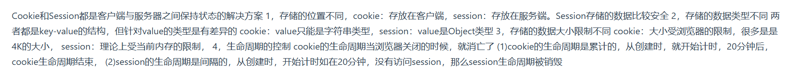
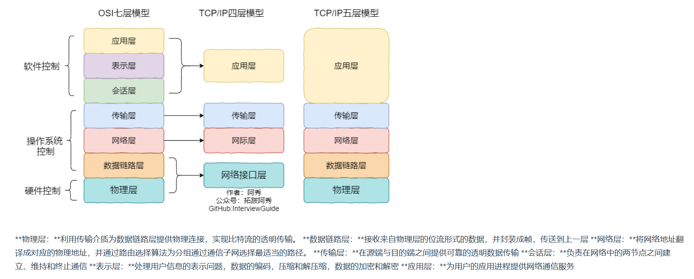
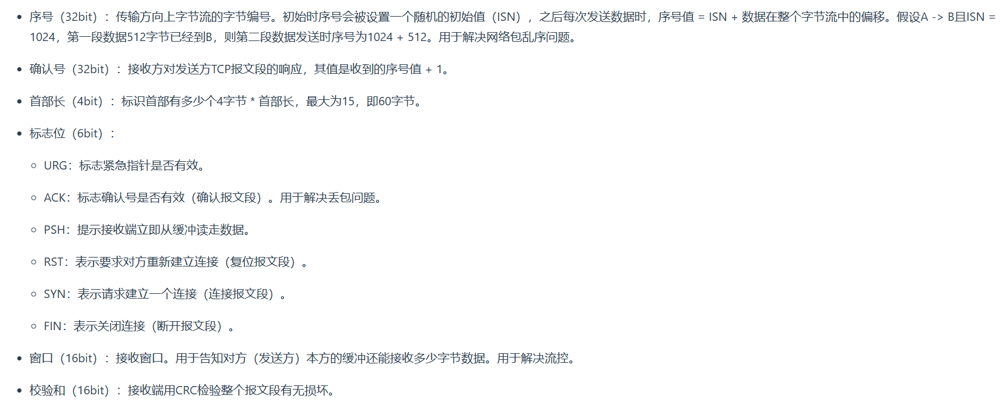
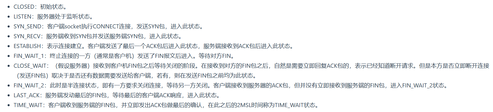
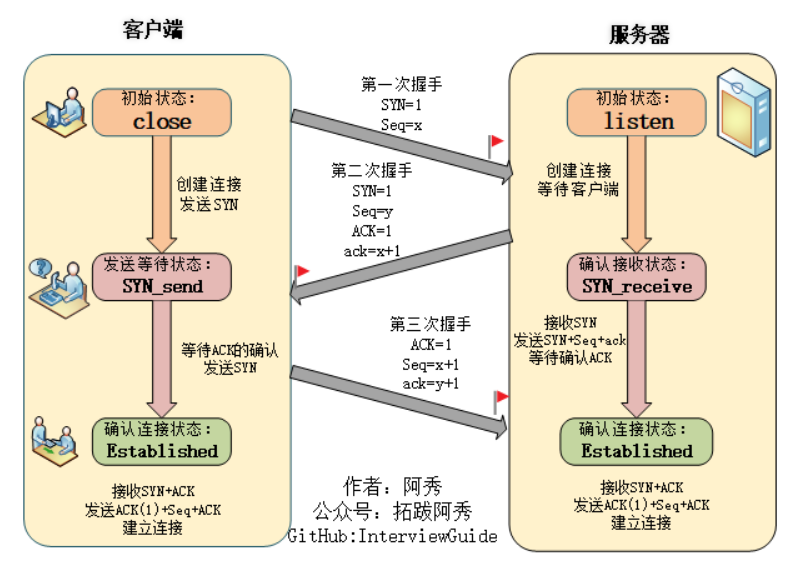
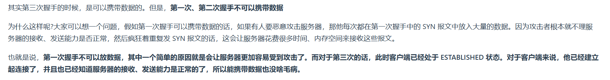

1. 使用`Session`的过程:
   * 用户进行登录时,用户提交包含用户名和密码的表单,放入`HTTP`请求报文中
   * 服务器验证该用户名和密码,如果正确则把用户信息存储到`Redis`中,它在`Redis`中的`key`称为`session id`
   * 服务器返回的响应报文的`Set-Cookie`首部字段包含了这个`session id`,客户端收到响应报文后将该`Cookie`值存入浏览器中
   * 客户端之后对同一个服务器进行请求时会包含该`Cookie`值,服务器收到之后提取出`seesion id`,从`Redis`中取出用户信息,继续之前的业务操作
2. `Session`和`Cookie`应该如何去选择?
   * `Cookie`只能存储`ASCII`码字符串,而`Session`则可以存储任何类型的数据,因此在考虑数据复杂性时首选`Session`
   * `Cookie`存储在浏览器中,容易被恶意查看.如果非要将一些隐私数据存在`Cookie`中,可以将`Cookie`值进行加密,然后在服务器进行解密
   * 对于大型网站,如果用户所有的信息都存储在`Session`中,那么开销是非常大的,因此不建议将所有的用户信息都存储到`Session`中
3. `Cookie`和`Session`的区别:
   
4. `DDos`攻击预防:
   * 限制同时打开`SYN`半连接的数目
   * 缩短`SYN`半连接的`Timeout`时间
   * 关闭不必要的服务
5. `MTU`:最大传输单元,由硬件规定,如以太网的`MTU`=1500字节
6. `MSS`:最大分节大小,为`TCP`数据包每次传输的最大数据分段大小,一般由发送端向对端`TCP`通知对端在每个节点中能发送的最大`TCP`数据.`MSS`值=`MTU`值-`IPv4 Header`(20字节)-`TCP Header`(20字节)
7. `OSI`七层模型的主要功能:
   
8. `HTTP`中有个缓存机制,但如何保证缓存是最新的呢?
   `max-age`指令出现在请求报文,并且缓存资源的缓存时间小于该指令指定的时间,那么就接受该缓存
   `max-age`指令出现在响应报文,表示缓存资源在缓存服务中保存的时间
   `Expires`首部字段也可以用于告知缓存服务器该资源什么时候会过期
   `HTTP/1.1`中,会优先处理`max-age`指令;`HTTP/1.0`中,`max-age`指令会被忽略
9.  `TCP`头部信息:
   
10. 常见的`TCP`连接状态:
   
11. `HTTP1.1`后,默认情况下`TCP`连接不会断开,只有在请求报头中声明`Connection:close`才会在请求完成后关闭连接
12. 三次握手:
    * 第一次握手:客户端给服务端发送一个`SYN`报文,并指明客户端的初始化序列号`seq=x`,此时客户端处于`SYN_SEND`状态
    * 第二次握手:服务器收到客户端的`SYN`报文后,会以自己的`SYN`报文作为应答,并且也指定了自己的序列号`seq=y`.同时会把客户端的`x+1`作为`ACK`的值,表示自己已经收到了客户端的`SYN`,此时服务器处于`SYN_RCVD`状态
    * 第三次握手:客户端收到`SYN`报文后,会发送一个`ACK=y+1`的报文,表示已经收到了服务端的`SYN`报文,此时客户端处于`ESTABLISHED`状态.服务器收到`ACK`报文后,也会处于`ESTABLISHED`状态,此时双方就建立了连接
    
13. 什么是半连接队列?
    服务器第一次收到客户端的`SYN`后,第二次握手发送`SYN+ACK`就会处于`SYN_RCVD`状态,此时双方还没有完全建立连接,服务器会把此种状态下请求连接放在一个队伍里,我们把这种队列称之为半连接队列
14. 为什么要三次握手:为了防止已失效的连接请求报文段突然又传送到了服务端
15. 三次握手过程中可以携带数据吗?
    第一次和第二次不可以携带,因为容易携带攻击数据,让服务器受到攻击,第三次可以携带
    
16. `SYN`攻击
    服务端的资源分配是在二次握手时分配的,而客户端的资源是在完成三次握手时分配的,所以服务器容易受到`SYN`洪泛攻击.`SYN`攻击就是客户端在短时间内伪造大量不存在的`IP`地址,并向服务器不断地发送`SYN`包,服务器则回复确认包,并等待客户端确定,由于源地址不存在,因此服务器需要不断重发直至超时,这些伪造的`SYN`包将长时间占用半连接队列,导致正常的`SYN`请求因为队列满而被丢弃,从而引起网络拥塞甚至系统瘫痪,`SYN`攻击是一种典型的`Dos/DDos`攻击.当在服务器上看到大量的半连接状态时,特别是源`IP`随机,基本上这就是一次`SYN`攻击.防御`SYN`攻击的方法:
    * 缩短超时时间
    * 增加最大半连接数
    * 过滤网关防护
    * `SYN Cookies`技术