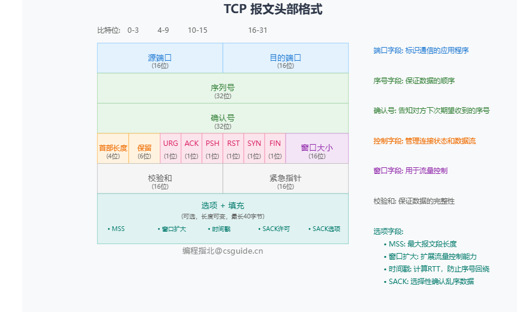
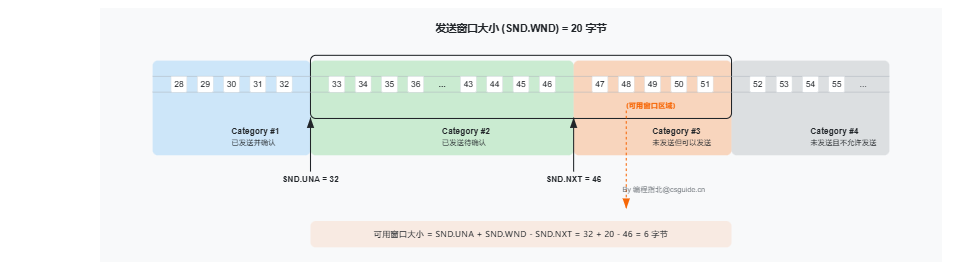
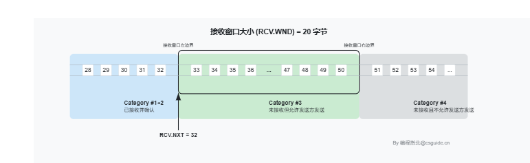
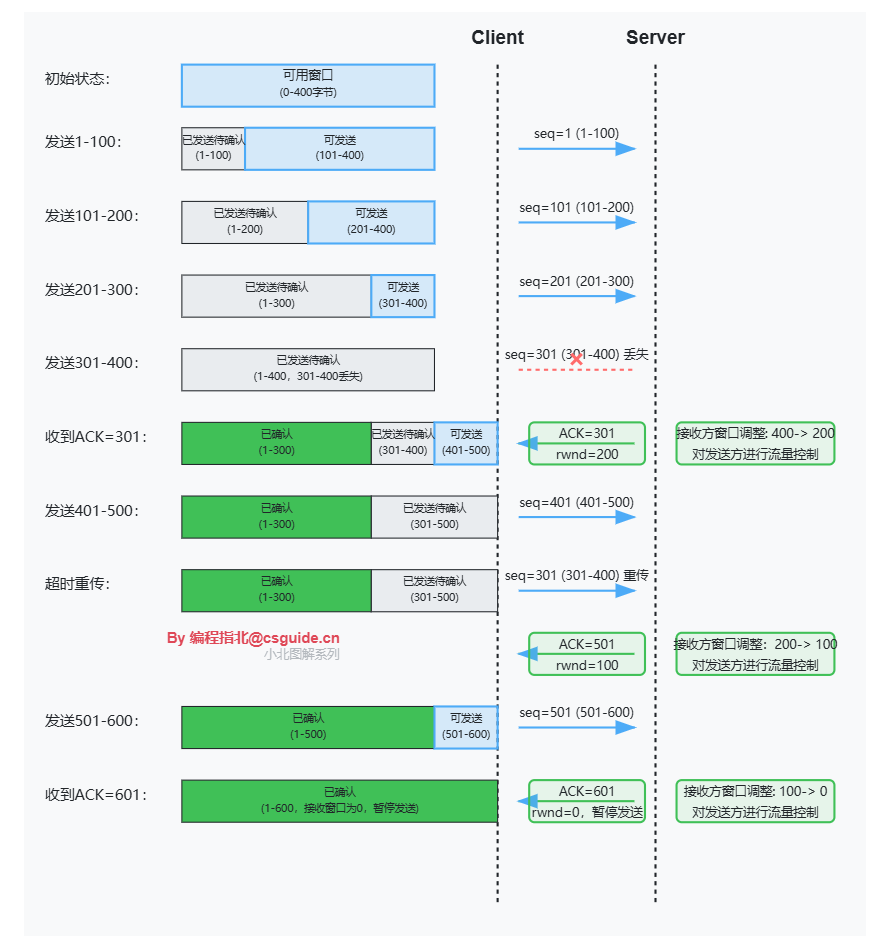
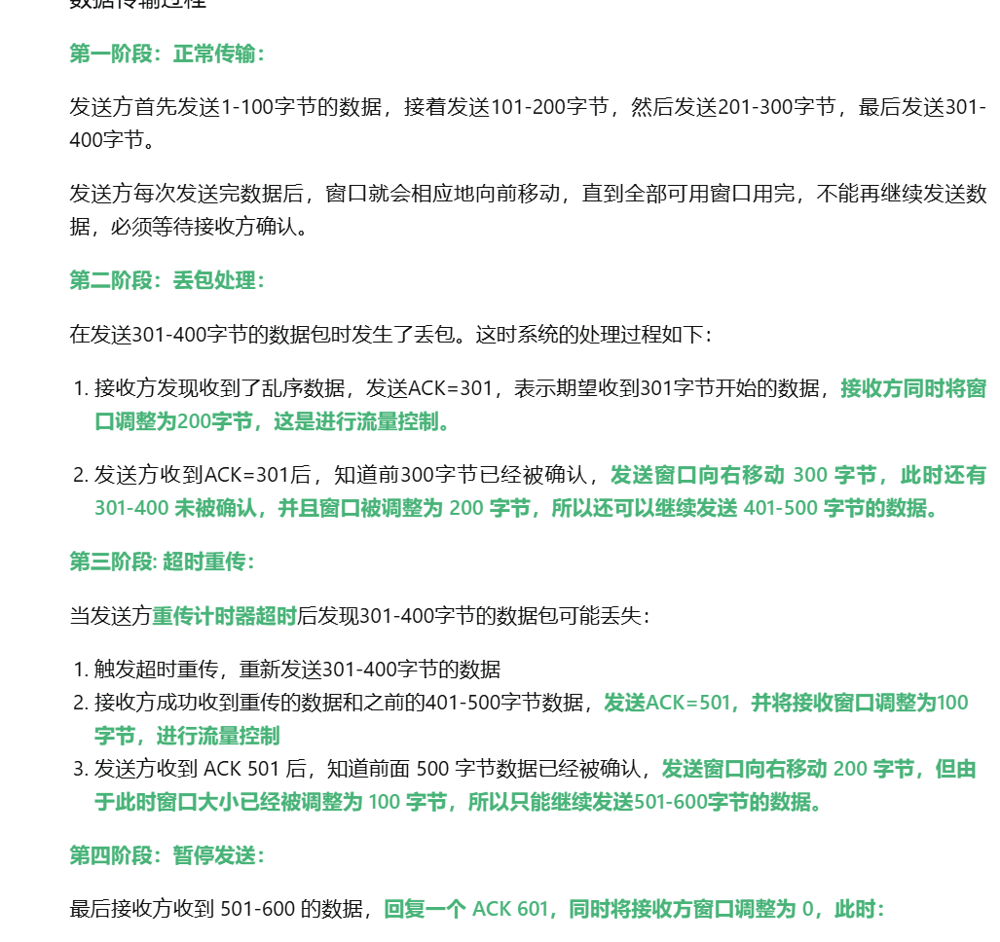
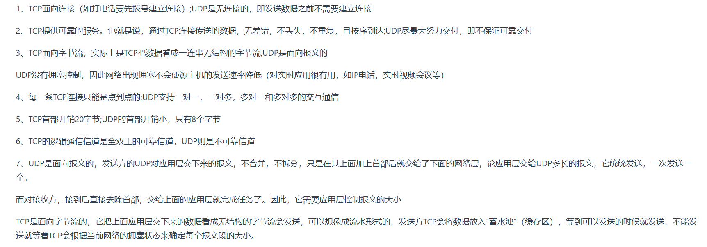
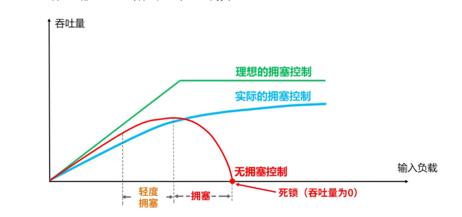

1. 四次挥手中,`FIN_WAIT_2`表示半关闭状态;`CLOSE_WAIT`此时被动关闭连接一方如果还有剩余数据要发送就会进入这个状态;`TIME_WAIT`就是`2MSL`状态
2. `TCP`的报文头部格式,里面有窗口大小字段
   
3. `TCP`流量控制:这是基于滑动窗口实现的,接收方通过`TCP`窗口字段告知发送方本方可接受的最大数据量,以此用以解决发送速率过快导致接收方不能接收的问题
   * 发送窗:用来限制发送方可以发送的数据大小,其中发送窗口的大小由接收端返回的`TCP`报文段中窗口字段来控制,接收方通过此字段告知发送方自己的缓冲区大小.发送窗口可以分为四个部分:已发送并确认|已发送待确认|未发送但可以发送|未发送且不允许发送
    
   * 接收窗:用来标记可以接收的数据大小.接收窗口可以分为三个部分:已接受|未接收但准备接收|未接收且不准备接收
    
   * `TCP`流量控制中发送方发送多大的数据由接收方的窗口大小和`ack`报文的序号决定,如:
    
    
    在最后,接收窗口大小为0,此时会通知发送方不要发送了,难道会一直这样让发送方不发送了吗?
    不是的,发送方会使用零窗口探测报文(1字节):当发送方发送接收窗口大小为0,且长时间未收到接收方窗口大小更新的消息时,发送方会启动持续计时器,并定期发送零窗口探测报文,用于探测接收方的接收窗口是否已经恢复  
4. `TCP`协议如何保证可靠传输:
   * 确认和重传:接收方收到报文就会确认,发送方发送一段时间后没有收到确认就会重传
   * 数据校验:`TCP`报文头有校验和,用于校验报文是否损坏
   * 数据合理分片和排序:`TCP`会按`MTU`合理分片,接收方会缓存未按序到达的数据,重新排序后交给应用层
   * 流量控制
   * 拥塞控制
5. `TCP`和`UDP`的区别:
   
6. `TCP`和`UDP`各自的特点:
   * `TCP`
    - 面向连接
    - 只能是点对点连接
    - 提供可靠的服务
    - 提供全双工通信
    - 面向字节流
    - 有流量控制和拥塞控制
   * `UDP`
    - 无连接
    - 尽最大努力交付
    - 面向报文
    - 没有拥塞控制
    - 支持一对一,一对多,多对一,多对多
    - 首部开销小,只有8字节 
7. `TCP`对应的应用层协议
   * `FTP`:文件传输协议
   * `Telnet`:用于远程登陆的协议
   * `SMTP`:简单邮件传送协议
   * `POP3`:用于接收邮件 
8. `UDP`对应的应用层协议
   * `DNS`:域名解析协议
   * `SNMP`:简单网络管理协议
   * `TFTP`:简单文件传输协议
9.  常见的数据链路层协议
   * `ARP`:地址解析协议;根据`IP`地址->`MAC`物理地址
   * `RARP`:反向地址转换协议;根据物理`MAC`地址->`IP`地址
   * `PPP`:点对点协议
10. `ping`是基于网络层的`ICMP`协议实现的,通过向对方发送一个`ICMP`回送请求报文,如果对方主机可达的话就会收到该报文,并响应一个`ICMP`回送回答报文.`ICMP`报文分为两类:`ICMP`差错报告报文(终点不可达;时间超过;参数问题;改变路由);`ICMP`询问报文(回送请求和回送回答报文(向特定主机发出回送请求报文,收到回送请求报文的主机响应回送回答报文);时间戳请求和回答(询问对方当前的时间,返回的是一个32位的时间戳))
11. `RTO`:从上一次发送数据,因为长期没有收到`ack`响应,到下一次重发之间的时间,即就是重传间隔;`RTT`数据从发送到接收到对方响应之间的时间间隔,即数据报在网络中一个往返用时,大小不稳定
12. `XSS`攻击:跨站点脚本攻击,指攻击者通过篡改网页,嵌入恶意脚本程序,在用户浏览网页时,控制用户浏览器进行恶意操作的一种攻击方式
13. `CSRF`攻击:跨站点请求伪造,指攻击者通过跨站请求,以合法的用户的身份进行非常操作,即盗用身份,以我的名义向第三方网站发送恶意请求.如何防范?
    * 安全框架:如`spring security`
    * `token`机制:`http`请求中验证`token`,没有`token`或者`token`内容不正确则认为是`CSRF`攻击
    * 验证码
    * `referer`识别:`HTTP`头部字段`Referer`,它记录了`http`请求的来源地址
14. 文件上传漏洞:指用户上传一个可执行的脚本文件,并通过此脚本文件获得了执行服务端的能力,即黑到了服务端.如何防范?
    将文件上层的目录设置为不可执行
15. 拥塞控制原理:拥塞控制目的是防止数据过多注入到网络中导致网络资源过载.拥塞控制主要使用拥塞窗口和慢启动门限来控制
    
16. 拥塞控制和流量控制的区别:
    * 控制目的
     - 拥塞控制是防止过多数据注入导致网络性能下降
     - 流量控制是防止发送方速率超过接收方处理能力
    * 控制范围
     - 拥塞控制是全局性网络控制
     - 流量控制是点对点通信控制
    * 控制方式
     - 拥塞控制是通过检测网络状态间接调整(检测是否达到慢启动门限,是否丢包)
     - 流量控制是接收方通过窗口大小直接告知发送方
    * 反馈信息
     - 拥塞控制是通过网络状态探测
     - 流量控制是通过接收方的可接受窗口大小
17. 拥塞控制和流量控制的相同点
    * 都是使用滑动窗口机制
    * 都是为了实现可靠且高效的数据传输,避免系统过载
    * 都在`TCP`协议中实现,由发送方执行控制动作     
18. `TCP`接收方对于未按序到达的数据怎么处理?
    当接收方收到未按序到达的数据时,它会将这些数据暂时存储在接收缓冲区中.接收方会根据数据段的序列号来判断数据是否按序到达.如果数据的序列号不在预期范围内,接收方会将这些数据缓存起来,等待缺失的数据段到达后进行重组.当缺失的数据段到达后,接收方会将缓存中的未按序数据与新到达的数据段进行重组,按照正确的顺序将数据传递给应用层

      