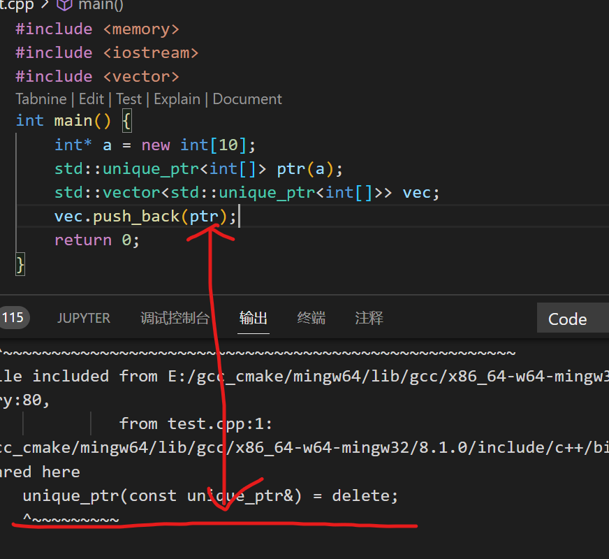

1. 指针和引用的区别
   * 指针是一个变量,存储的是一个地址,引用跟原来的变量实质是同一个东西,是原变量的别名
   * 指针可以有多级,引用只有一级
   * 指针可以为空,引用不能为`null`且在定义时必须初始化
   * 指针在初始化后可以改变指向,而引用在初始化后不可再改变
   * `sizeof`指针得到的是本指针的大小,`sizeof`引用得到的是引用所指向变量的大小
   * 当把指针作为参数进行传递时,也是将实参的一个拷贝传递给形参,两者指向的地址相同,但不是同一个变量,在函数中改变这个变量的指向不影响实参,而引用却可以
2. 介绍`std::unique_ptr`和`std::shared_ptr`
    * `std::unique_ptr`:排他所有权指针,多个智能指针不能共享同一个对象,不能进行普通的赋值和拷贝操作(如果允许可能会出现:双重释放、内存泄漏等问题),但可以使用`std::move`后的赋值
    * `std::shared_ptr`:采用引用计数方法，多个智能指针可以共享同一个对象，当计数为0的时候会自动的释放动态分配的资源,但会出现交叉引用的问题
3. `std::shared_ptr`怎么保证线程安全的
    引用计数使用的是原子操作
4. `TCP/IP`有哪些层,每层有哪些协议
    * 应用层:`DNS HTTP SSH HTTPS FTP SMTP`
    * 传输层:`TCP UDP`
    * 网络层;`IP ICMP IGMP RIP`
    * 数据链路层:`RAP ARAP PPP`
    * 物理层:`IEEE 802.11`->WIFI
5. `LSM`树的写入和读取过程
    主要由常驻内存的`C0`树和保留在磁盘的`C1`树两个模块组成.虽然`C1`树保存在磁盘,但是会将`C1`树中一些需要频繁访问的数据保存在数据缓存中,从而保证高频访问数据的快速收敛.当需要插入一条新的数据记录时,首先在`Log`文件末尾顺序添加一条数据插入的记录,然后将这个新的数据添加到驻留在内存的`C0`树中,其数据结构是跳表（有序的），当`C0`树的数据大小达到某个阈值时,则会自动将数据顺序写到磁盘中的`C1`树,这就是`LSM`树的数据写的全过程.而对于数据读过程,`LSM`树将首先从`C0`树中进行索引查询,如果不存在,则转向`C1`中继续进行查询,直至找到最终的数据记录
6. 快排平均时间复杂度
    `O(nlogn)`
7. 有序的数组的快排时间复杂度
    `O(n^2)`
8. 介绍`vector`和`list`,并分别应用在什么场景
    * `vector`是动态数组,底层以连续的内存空间存储元素;随机访问速度快，插删效率较低；在数组末尾插入元素的时间复杂度为常数级别（O(1)），但在其他位置插入或删除元素的时间复杂度为线性级别（O(n)）(因为涉及元素移动的操作)；适用于需要快速随机访问元素，不需频繁插入和删除的场景;并且扩容时会出现大量的移动、拷贝操作,影响性能
    * `list`内部以双向链表的形式存储数据； 插入和删除操作效率高，但随机访问速度较慢；在任意位置插入和删除元素的时间复杂度为常数级别（O(1)）； 适用于需要频繁插入和删除元素，但不需要随机访问的场景
9. `C++`实现线程安全的单例模式
    * 单例模式:这是一种创建型设计模式,确保一个类只有一个实例,并提供一个全局访问点.该模式常用于管理共享资源(如配置、线程池、数据库连接等)的场景
    * 实现方式
        - 饿汉式:实例在程序启动时就已经被创建.饿汉式可能会出现资源浪费,如果单例实例的初始化需要大量资源(如内存、文件句柄或网络连接),而程序可能永远不会用到它,就会造成资源浪费.饿汉式是线程安全的,但它的线程安全性并不是因为它本身做了特殊处理,而是因为它的实例在程序启动时就已经初始化了,因此不会出现多个线程同时尝试创建实例的情况
        ```C++
        #include <iostream>
        class Singleton {
            private:
                Singleton() {// 私有化构造函数禁止外部直接通过Singleton()创建实例
                    std::cout << "Singleton instance created\n";
                }
                static Singleton instance;// !!!
            public:
                static Singleton& getInstance() {
                    return instance;
                }
                Singleton(const Singleton&) = delete;
                Singleton& operator=(const Singleton&) = delete;
        };
        // 在类外初始化静态成员
        Singleton Singleton::instance;
        ```
        - 懒汉式:为了避免资源浪费,提出了懒汉式.在第一次调用`getInstance()`才创建实例
        ```C++
        #include <mutex>
        #include <iostream>
        class Singleton {
        private:
            Singleton() {// 私有化构造函数禁止外部直接通过Singleton()创建实例
                std::cout << "Singleton instance created\n";
            }
            static Singleton* instance;// 指针
            static std::mutex mutex;
        public:
            // 双重判断+加锁实现线程安全
            static Singleton* getInstance() {
                if (instance == nullptr) {
                    std::lock_guard<std::mutex> lock(mutex);
                    if (instance == nullptr) {
                        instance = new Singleton();
                    }
                }
                return instance;
            }
            static void destroyInstance() {
                delete instance;
                instance = nullptr;
            }
            Singleton(const Singleton&) = delete;
            Singleton& operator=(const Singleton&) = delete;
        };
        Singleton* Singleton::instance = nullptr;
        std::mutex Singleton::mutex;
        ``` 
        - 静态局部变量:此方法线程安全且不复杂,最为推荐
        ```C++
        #include <iostream>
        class Singleton {
        private:
            Singleton() {// 私有化构造函数禁止外部直接通过Singleton()创建实例
                std::cout << "Singleton instance created\n";
            }
        public:
            static Singleton& getInstance() {
                static Singleton instance;// 其实就是实例化一个对象，放在getInstance()里面
                return instance;
            }
            Singleton(const Singleton&) = delete;
            Singleton& operator=(const Singleton&) = delete;
        };
        ```
        `static`局部变量属于函数内部,初始化由编译器管理,不像静态成员变量,静态局部变量不需要在类外初始化
10. `C++`实现多线程累加数,并说会有什么问题,怎么解决
    ```C++
    void add_numbers(int iterations) {
        for (int i = 0; i < iterations; ++i) {
            // 加锁
            mtx.lock();
            sum += 1;
            // 解锁
            mtx.unlock();
        }
    }
    int main() {
        std::vector<std::thread> threads;
        // 创建多个线程执行累加任务
        for (int i = 0; i < num_threads; ++i)
            threads.push_back(std::thread(add_numbers, 10));
        // 等待所有线程完成
        for (auto& thread : threads)
            thread.join();
        std::cout << "Final sum: " << sum << std::endl;
        return 0;
    }
    ```
    不对共享资源`sum`加锁就会出现数据竞争
11. `int* const`和`const int*`
    * `int* const`指的是顶层`const`:指的是`const`修饰的指针变量本身是一个常量,无法修改,
    * `const int*`指的是底层`const`:指的是`const`修饰的指针变量所指向的对象是一个常量,指的是所指变量,就是`*`号的左边
12. 下面代码有什么问题:
    ```C++
    void test() {
        int* a = new int[10];
        std::unique_ptr<int[]> ptr(a)
        std::vector<std::unique_ptr<int[]>> vec;
        vec.push_back(ptr);// 会调用ptr所属的类类型(std::unique_ptr)的拷贝构造函数
    }
    ```
    
    * `std::unique_ptr`是不允许左值复制和赋值操作(`std::unique_ptr`是禁止拷贝和赋值的),因此要用的话就要用`std::move`.`std::vector`的`push_back`对于`ptr`会利用拷贝构造函数构造一个临时对象再将这个临时对象拷贝或移动(用`std::move`)到容器中,因此不用`std::move`的话在`vector`的`push_back`就使用`std::unique_ptr`禁止的拷贝构造函数
    * 注意:换成`emplace_back`也是不行的,对于元素为`std::unique_ptr`对象的构造是不能通过传入一个左值对象`ptr`进行对象构造的(如果允许,那么就会调用拷贝构造函数),只允许移动构造
13. 下面代码有什么问题:
    ```C++
    void test() {
        std::unique_ptr<int> ptr1(new int(10));
        std::unique_ptr<int> ptr2 = ptr1;// 错误：无法复制 std::unique_ptr
    }
    ```
    此时会调用拷贝构造,`unique_ptr`是禁止了拷贝构造的
14. `TCP`三次握手时,客户端发送的`SYN`,服务器没有应答,此时客户端会怎样?
    客户端在发送 SYN 后，会启动一个重传计时器。这个计时器的目的是为了在一定时间内等待服务器的响应。如果没有收到就会重传,如果多次重传后仍然没有收到应答,客户端就会放弃连接