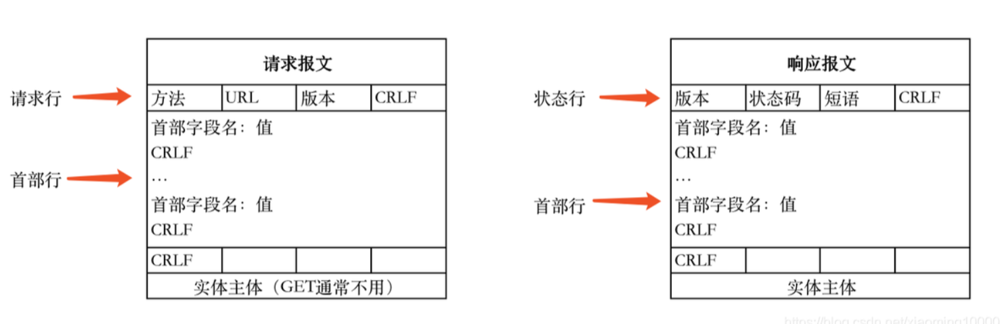
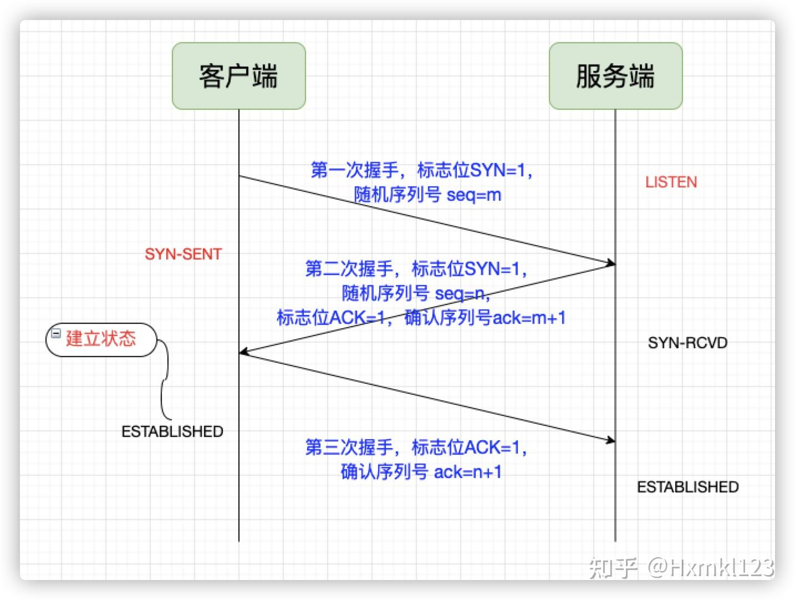
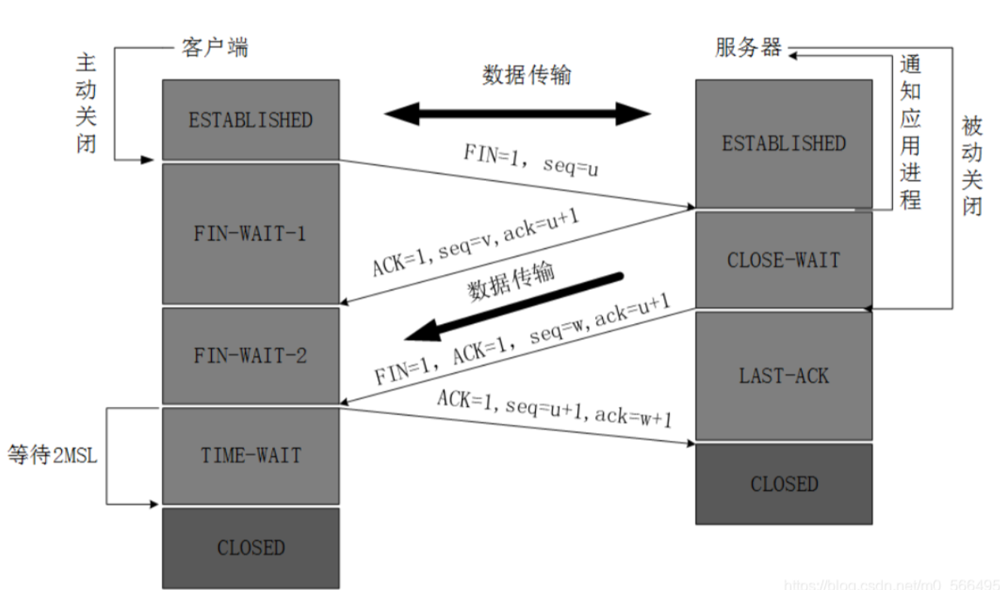
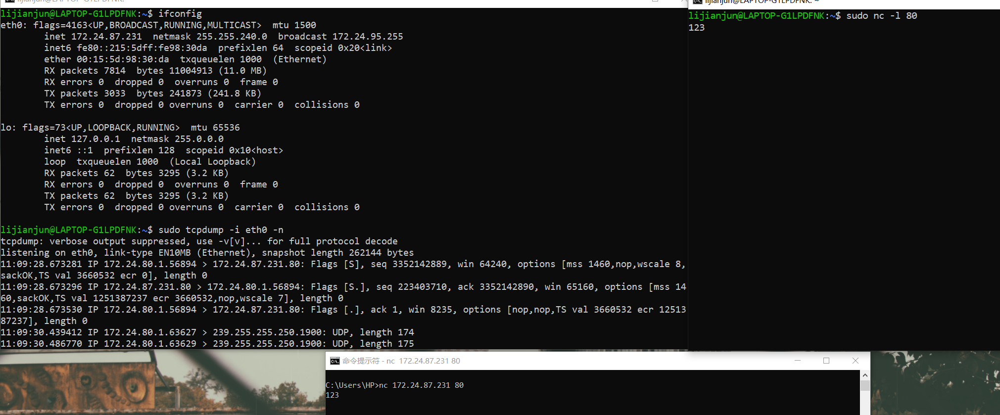
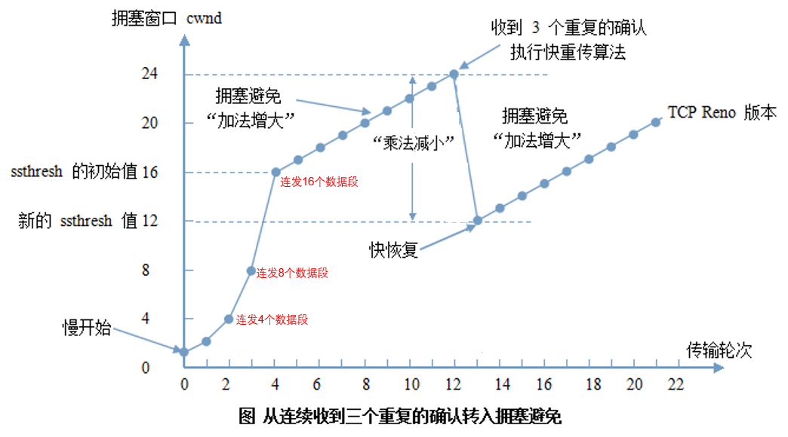

# HTTP
1. `HTTP`传输是基于`TCP/IP`的
2. `HTTP`是一个基于请求和响应,无状态的,应用层协议.所有的`WWW`文件都遵守这个标准
   ```s
   1. 无状态:协议对客户端没有状态存储,对事物处理没有"记忆"能力,比如访问一个网站需要反复进行登录操作
   2. 无连接:每次连接只处理一个请求,这样在长时间需要请求同一资源的情形下很耗费资源,因此后期可以通过Connection:Keep-Alive实现长连接
   3. 通信使用明文(不加密),内容可能被窃听或无法验证报文完整性,其内容可能已被篡改.所以出现了HTTPS
   ```
3. `HTTP2.0`实现了多路复用,多个HTTP 请求共享一个`TCP`连接
4. <mark>`HTTP`报文通常是多行组成的,每一行都以回车符和换行符(CRLF)终止.在`HTTP`报文中,请求报文和响应报文都由首部和主体组成,它们之间由一个空行分隔开</mark>
5. `HTTP`报文格式格式:请求(响应)行+头部字段集合+空行+消息正文
   
   如:
   ```s
   请求报文:
   POST /index.html HTTP/1.1 \r\n
   Host: www.somenet.com     \r\n
   Content-Length:9          \r\n
   \r\n
   color=red

   请求报文:
   GET http://oa.funds.com.cn:9080/OMSS/index/index.jsp?f=Fri%20Jan%205%2008:56:35%20UTC+0800%202018 HTTP/1.1             \r\n
   Accept: */*                       \r\n
   Accept-Language: zh-CN            \r\n
   User-Agent: Mozilla/4.0 (compatible; MSIE 7.0; Windows NT 6.1; WOW64; Trident/7.0; SLCC2; .NET CLR 2.0.50727; .NET CLR 3.5.30729; .NET CLR 3.0.30729; Media Center PC 6.0; .NET4.0C; .NET4.0E)                          \r\n
   Accept-Encoding: gzip, deflate    \r\n
   Connection: Keep-Alive            \r\n
   Host: oa.funds.com.cn:9080        \r\n
   Cookie: JSESSIONID=0000AgK4N-vgetNoKBOfYd_hJQP:-1; ECSNSessionID=721303315959898497; ASPSESSIONIDQQSCRBSQ=OMFFMGDCJHLLHCLPGMKCEOEG; ASPSESSIONIDCCCRTRDD=KMENDGIBFBKFDLHKKPJGJNMF                                    \r\n
   空行

   响应报文:
   HTTP/1.1 200 OK         \r\n
   Content-Type:text/html  \r\n
   Content-Length: 362     \r\n
   \r\n
   <html>//具体html内容  
   ```
6. 请求行:`METHOD+空格+URI+空格+VERSION+换行`
7. 响应行:`METHOD+空格+STAUS CODE+空格+REASON+换行`
8. `HTTP`请求报文的方法:
   ```s
   1. GET
   2. POST
   3. HEAD
   4. PUT
   5. DELETE
   ```
9. 头部字段是`key-value`的形式,`key`和`value`之间用`:`分割,最后用`CRLF`换行表示字段结束.比如:`Connection:keep-alive`.头部字段不区分大小写,字段名不允许出现空格,可以使用`-`,不能使用`_`.`http`可以自定义头
10. 请求头（Header）指的是头部字段，不是请求行
11. `HTTP`的头字段可分为:
   * 请求字段:请求头中的头字段;如`Host,Referer`;
   * 响应字段:响应头中的头字段,如`Server`;
   * 通用字段:在请求头和响应头里都能出现,如`Content-type,Connection`;`Content-Type`通常用来指定在`HTTP`请求或响应中传输的数据的类型
12. `http`的一次完整通信过程:
   ```s
   1. DNS解析:URL->IP
   2. TCP连接:三次握手
   3. 客户端的Web浏览器发送HTTP请求
   4. Web服务器应答
   5. 浏览器解析:当浏览器从服务器接收到.html文件后,就开始解析其中的html代码,遇到静态资源js/css.image等时就会向服务器去请求下载(此时就用上keep-alive头部信息了)
   6. 浏览器进行页面渲染:浏览器利用自己内部的工作机制,把请求的静态资源和html代码进行渲染,渲染之后呈现给用户,浏览器是一个边解析边渲染的过程
   7. 服务器关闭TCP连接:一般情况,一旦Web服务器向浏览器发送了请求数据,它就要关闭TCP连接.如果浏览器或者服务器在头部信息加入了:Connection:keep-alive,则TCP连接在发送后将仍然保持打开状态.在 HTTP/1.1 或更高版本中,服务器通常不会在每次请求之后主动关闭TCP连接,除非明确指定
   ```
13. `HTTP`对应的端口号为80   
# TCP
1. 三次握手、四次挥手
2. 为什么要三次握手:为了防止已失效的连接请求报文段突然又传送到了服务端
   ```s
   比如:client发出的第一个连接请求报文段并没有丢失,而是在某个网络结点长时间的滞留了,以致延误到连接释放以后的某个时间才到达server.本来这是一个早已失效的报文段,但是server收到此失效的连接请求报文段后,就误认为是client再次发出的一个新的连接请求,于是就向client发出确认报文段,同意建立连接.假设不采用“三次握手”,那么只要server发出确认,新的连接就建立了,由于client并没有发出建立连接的请求,因此不会理睬server的确认,也不会向server发送数据,但server却以为新的运输连接已经建立,并一直等待client发来数据.所以没有采用“三次握手”,这种情况下server的很多资源就白白浪费掉了
   ```
3. 
   
4. 在`TCP`报文头中,最重要的标志位有:
   ```s
   SYN:用于建立连接时发起连接请求的标志位
   ACK:用于确定收到数据的标志位
   FIN:用于关闭连接时发出结束连接请求的标志位
   RST:用于重置连接的标志位,通常用于异常情况的处理
   ```
5. 为什么要四次挥手:
   ```s
   当Server端收到FIN报文时,很可能并不会立即关闭SOCKET,所以只能先回复一个ACK报文,告诉Client端,"你发的FIN报文我收到了"。只有等到我Server端所有的报文都发送完了,我才能发送FIN报文,因此不能一起发送.故需要四步握手
   ```
6. `TCP`四次挥手时客户端需要有一个`2MSL`的`TIME_WAIT`状态,为什么?
   * 客户端第四次挥手发送的`ACK`服务端可能未收到,然后服务端会持续重传`FIN`,如果客户端不等待的话那么就会造成资源无法释放;
   * 避免上一次由于延迟的`TCP`连接数据影响到下一次的`TCP`连接;
7. 
   
8. 为什么是`2MSL`呢?
   因为客户端不知道服务端能否收到第四次挥手的`ACK`数据包,如果没收到,服务端就会重传`FIN`,考虑最坏的情况:第四次挥手的`ACK`包的最大生存时长(`MSL`)+服务端重传的`FIN`包的最大生存时长(`MSL`)=`2MSL`
9. `TCP`特点:
   * 基于连接的
   * 全双工
   * 字节流:不限制数据大小,打包成报文段,保证有序接收,重复报文自动丢弃
   * 流量缓冲:解决双方处理能力的不匹配
   * 可靠的传输服务
   * 拥塞控制
10. `TCP`连接:四元组[源地址,源端口,目的地址,目的端口]
11. 利用`tcpdump`抓包,`netcat(nc)`创建TCP连接:
   
12. `tcpdump`:
    ```s
    1. tcpdump是一个用于捕获数据包(抓包)的命令行工具,常用于网络故障排除、安全监控和协议分析等任务
    2. tcpdump -i <interface>//抓接口(网关)的包
    3. tcpdump -help
    4. tcpdump -w <filename>//保存数据到文件
    ```
13. `netcat`:
    ```s
    1. nc <目标主机IP> <端口号>//建立TCP连接
    2. nc -l [-p] <端口号>//监听TCP端口
    3. nc <目标主机IP> <端口号> < 文件名//发送文件
    4. nc -l [-p] <端口号> > 文件名//接收文件
    5. nc -u <目标主机IP> <端口号>//使用UDP协议
    ```
14. `telnet`也可以用于建立`TCP`连接
15. 对于`TCP`连接,客户端和服务器都可以主动关闭连接(发送`FIN`报文)
16. `netstat`是一个用于显示网络状态信息的命令行工具.它可以列出系统的网络连接、路由表、接口统计信息等
    ```s
    1. netstat -a//显示所有活动的网络连接
    2. netstat -l//显示所有监听状态的网络连接
    3. netstat -r//显示当前路由表
    4. netstat -s//显示统计信息,如接收和发送的数据包数量
    5. netstat -t//显示TCP协议的连接
    6. netstat -u//显示UDP协议的连接
    7. netstat -p//显示PID和进程名称
    8. netstat -n//显示数字格式的IP地址和端口号
    ```
17. `SO_KEEPALIVE`:这是一个套接字选项,用于启用或禁用TCP连接的"保活"功能(`Keep Alive`).在网络编程中,`SO_KEEPALIVE`选项的作用是帮助检测"死"连接,也就是那些已经断开但并未关闭的连接.<mark>启用`SO_KEEPALIVE`后,`TCP/IP`协议栈会定期发送探测消息(`Keep-Alive`探测包)以确认连接的另一端是否仍然存在和响应.如果连接的另一端没有响应探测消息,`TCP/IP`协议栈会尝试重传一定次数的探测消息.如果多次探测都没有响应,则认为连接已经失效,会终止连接</mark>
18. `TCP`的拥塞控制算法:慢开始、拥塞避免、快重传、快恢复
    
